# Agentic RAG Applications: Company Knowledge Slack Agents

> 原文：[`towardsdatascience.com/agentic-rag-applications-company-knowledge-slack-agents/`](https://towardsdatascience.com/agentic-rag-applications-company-knowledge-slack-agents/)

我<mdspan datatext="el1748635599830" class="mdspan-comment">本应想到</mdspan>大多数公司到现在已经建立或实施了他们自己的 RAG 代理。

一个 AI 知识代理可以挖掘内部文档——网站、PDF、随机文档——并在几秒钟内通过 Slack（或 Teams/Discord）回答员工的问题。因此，这些机器人应该会显著减少员工筛选信息所需的时间。

我在几家大型科技公司中见过一些这样的例子，比如 IBM 的 AskHR，但它们还不是那么主流。

如果你渴望了解它们是如何构建的以及构建一个简单的系统需要多少资源，这篇文章适合你。

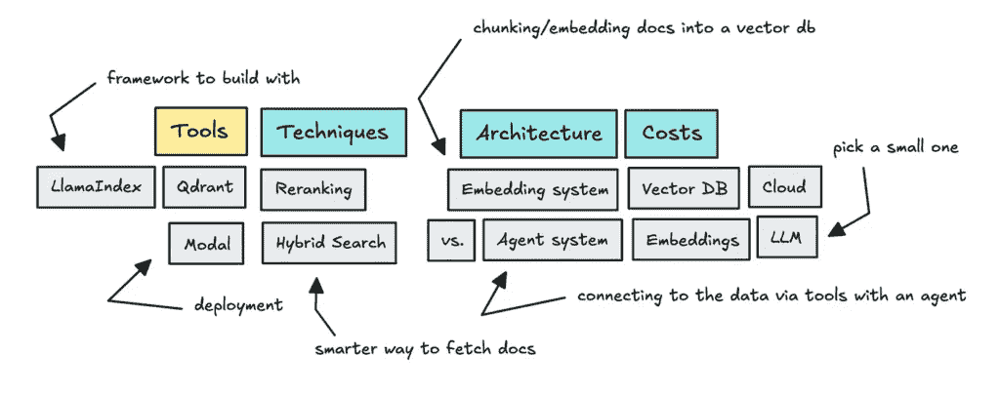

这篇文章将涉及的部分 | 图片由作者提供

我将介绍涉及的工具、技术和架构，同时也会探讨构建类似系统的经济性。我还会包括一个关于你最终会最关注的内容的部分。

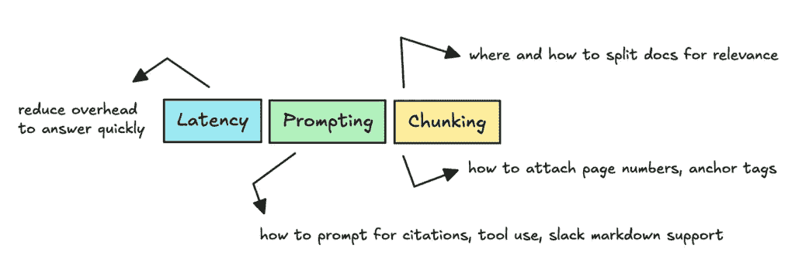

你将花费时间的事情 | 图片由作者提供

最后还有一个演示，展示这将在 Slack 中看起来是什么样子。

如果你已经熟悉 RAG，请随意跳过下一节——它只是关于代理和 RAG 的一些重复内容。

## 什么是 RAG 和代理 RAG？

大多数阅读这篇文章的人都会知道什么是检索增强生成（RAG），但如果你是新手，它是一种在回答用户问题之前，将信息提取到大型语言模型（LLM）中的方法。

这允许我们实时向机器人提供来自各种文档的相关信息，以便它能够正确回答用户的问题。

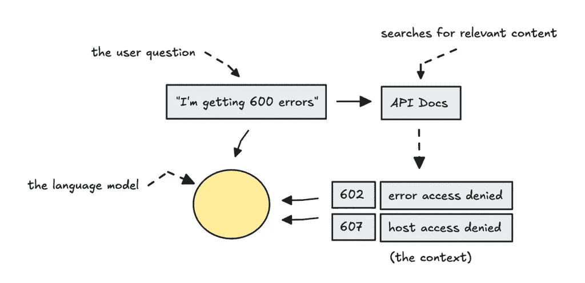

简单的 RAG | 图片由作者提供

这个检索系统所做的不仅仅是简单的关键词搜索，因为它找到的是相似匹配而不是精确匹配。例如，如果有人询问字体，相似度搜索可能会返回关于排版的文档。

许多人会说 RAG 是一个相当简单的概念，但如何存储信息、如何获取信息以及你使用的嵌入模型类型仍然非常重要。

如果你渴望了解更多关于嵌入和检索的知识，我在这篇文章中写过[这里](https://medium.com/data-science/working-with-embeddings-closed-versus-open-source-39491f0b95c2)。

今天，人们已经更进一步，主要使用代理系统。

在代理系统中，LLM 可以决定在哪里以及如何获取信息，而不仅仅是将内容倒入其上下文之前生成响应。

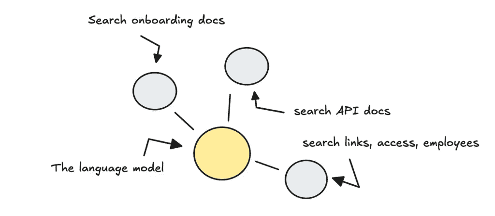

带有 RAG 工具的代理系统——黄色点代表代理，灰色点代表工具 | 图片由作者提供

重要的是要记住，尽管存在更多高级的工具，但这并不意味着你应该总是使用它们。你希望保持系统直观，并且将 API 调用保持在最低。

使用代理系统时，API 调用会增加，因为它至少需要调用一个工具，然后进行另一个调用以生成响应。

话虽如此，我真的很喜欢这个机器人的用户体验——它“去某个地方”——到一个工具——查找某个东西。在 Slack 中看到这个流程有助于用户理解正在发生的事情。

但选择代理或使用完整的框架并不一定是更好的选择。随着我们继续讨论，我会详细阐述这一点。

## 技术栈

对于代理框架、向量数据库和部署选项，有很多选择，所以我将介绍一些。

对于**部署选项**，由于我们使用 Slack webhook，我们处理的是事件驱动架构，其中代码仅在 Slack 中有问题时才会运行。

为了将成本降至最低，我们可以使用**无服务器函数**。选择可以是使用 AWS Lambda 或者选择一个新的供应商。

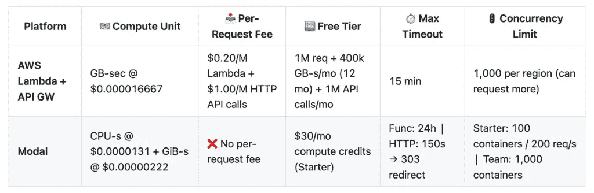

Lambda 与 Modal 比较，完整表格[在此](https://github.com/ilsilfverskiold/Awesome-LLM-Resources-List?tab=readme-ov-file#-serverless-compute-pricing--limits--lambda-vs-modal-on-cpu) | 作者提供的图片

类似于 Modal 这样的平台在技术上是为服务 LLM 模型而构建的，但它们对于长期运行的 ETL 过程以及 LLM 应用来说效果都很好。

Modal 尚未经过太多实战测试，你会在延迟方面注意到这一点，但它非常流畅，提供超级便宜的 CPU 定价。

我应该注意的是，在免费层上使用 Modal 设置时，我遇到了一些 500 错误，但这可能是预期的。

至于**如何选择代理框架**，这完全是可选的。几周前我比较了一些开源的代理框架，你可以在这里找到[相关内容](https://medium.com/data-science-collective/agentic-ai-comparing-new-open-source-frameworks-21ec676732df)，而我遗漏的是**LlamaIndex**。

因此，我决定在这里尝试一下。

最后你需要选择的是**向量数据库**，或者支持向量搜索的数据库。这是我们存储嵌入和其他元数据的地方，以便在用户查询到来时执行相似度搜索。

选项有很多，但我认为最有潜力的选项是 Weaviate、Milvus、pgvector、Redis 和 Qdrant。

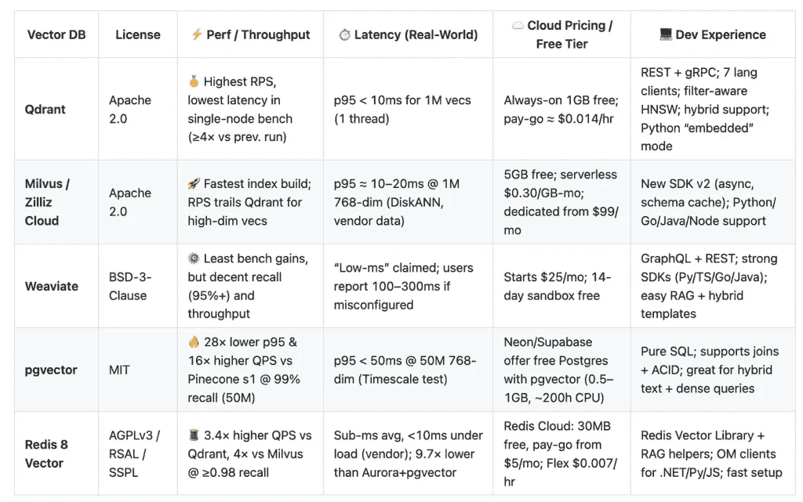

向量数据库比较，完整表格[在此](https://github.com/ilsilfverskiold/Awesome-LLM-Resources-List?tab=readme-ov-file#-vector-dbs--foss-performance-pricing-devx) | 作者提供的图片

Qdrant 和 Milvus 都为其云选项提供了相当慷慨的免费层。我知道，Qdrant 允许我们存储密集和稀疏向量。LlamaIndex，以及大多数代理框架，支持许多不同的向量数据库，因此任何一种都可以工作。

我将在未来更多地尝试 Milvus 来比较性能和延迟，但到目前为止，Qdrant 运行良好。

Redis 也是一个不错的选择，或者说是你现有数据库的任何向量扩展。

## 建设成本与时间

在时间和成本方面，你必须考虑工程小时数、云服务、嵌入和大型语言模型（LLM）的成本。

启动一个框架来运行一些最小化的内容并不需要太多时间。耗时的是正确连接内容、提示系统、解析输出并确保它运行足够快。

但如果我们转向间接成本，运行代理系统的**云成本**对于仅使用服务器端函数的单一公司中的单个机器人来说是非常低的，正如你在上一节表格中所看到的。

然而，对于**向量数据库**，存储的数据越多，成本就越高。

Zilliz 和 Qdrant Cloud 为你的前 1 到 5GB 数据提供相当多的免费额度，所以除非你超过几千个数据块，否则你可能不需要支付任何费用。

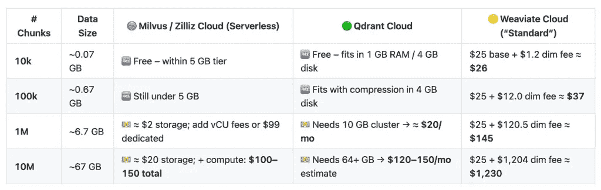

向量数据库的成本比较，完整表格[在此](https://github.com/ilsilfverskiold/Awesome-LLM-Resources-List?tab=readme-ov-file#-vector-db-cloud-pricing-2000-char-chunks-768-dim) | 图片由作者提供

但是，一旦超过数千次，你将开始付费，其中 Weaviate 是上述供应商中最贵的。

至于**嵌入**，这些通常**非常便宜**。

一旦嵌入 1 到 1000 万文本，你就可以在下面的表格中看到使用 OpenAI 的`text-embedding-3-small`与不同大小的数据块一起使用的情况。

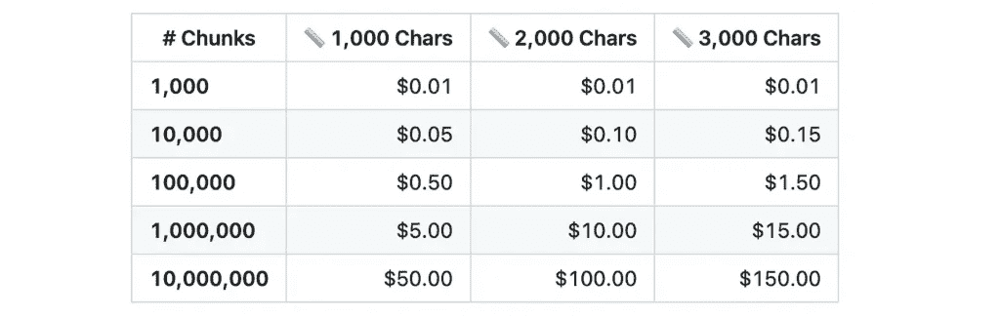

每个数据块嵌入的成本示例——完整表格[在此](https://github.com/ilsilfverskiold/Awesome-LLM-Resources-List?tab=readme-ov-file#-embedding-cost--openai-small-model-per-chunk-size) | 图片由作者提供

当人们开始优化嵌入和存储时，他们通常已经超越了嵌入数百万文本。

虽然最重要的是你使用的是哪种**大型语言模型（LLM**）。你需要考虑 API 价格，因为一个代理系统通常每次运行会调用 LLM 两到四次。

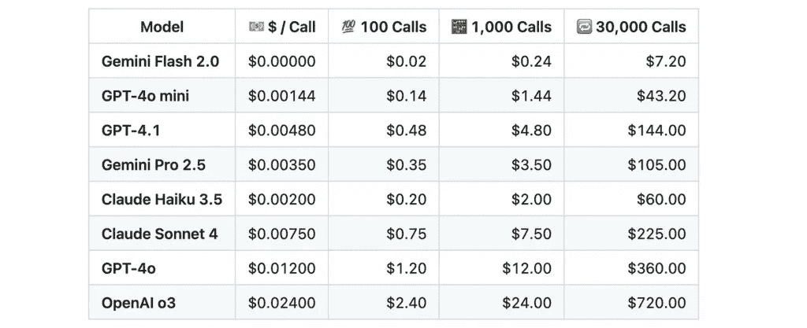

代理系统中 LLM 的示例价格，完整表格[在此](https://github.com/ilsilfverskiold/Awesome-LLM-Resources-List?tab=readme-ov-file#-embedding-cost--openai-small-model-per-chunk-size) | 图片由作者提供

对于这个系统，我使用 GPT-4o-mini 或 Gemini Flash 2.0，这是最便宜的选择。

假设一家公司每天使用机器人几百次，每次运行需要我们 2-4 次 API 调用，我们可能每天的成本会低于一美元，每月大约 10-50 美元。

你可以看到，切换到更昂贵的模型会将月度账单增加 10 倍到 100 倍。对于 ChatGPT，对于免费用户来说主要是补贴的，但当你构建自己的应用程序时，你将为其提供资金。

未来将会有更智能、更经济的模型，所以你现在构建的任何东西都可能随着时间的推移而改进。但从小处着手，因为成本会累积，对于像这样的简单系统，你不需要它们非常出色。

下一节将介绍如何构建这个系统。

## 架构（处理文档）

系统分为两部分。第一部分是我们如何分割文档——我们称之为分块——并将它们嵌入。这部分非常重要，因为它将决定代理稍后如何回答。

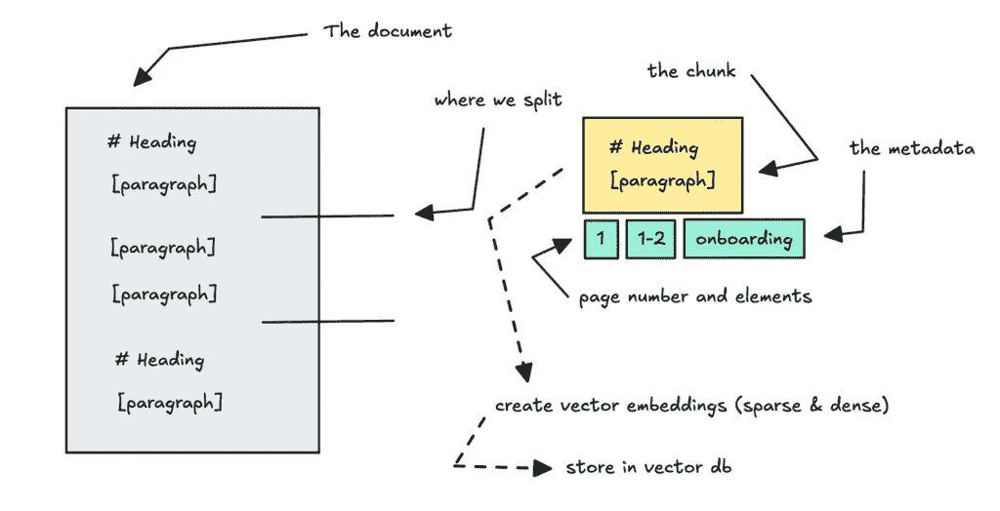

将文档分割成不同的块，并附加元数据 | 图片由作者提供

因此，为了确保你正确地准备了所有来源，你需要仔细思考如何对它们进行分块。

如果你查看上面的文档，你会发现如果我们根据标题和字符数来分割文档，我们可能会错过上下文，因为附属于第一个标题的段落因为过长而被分割。

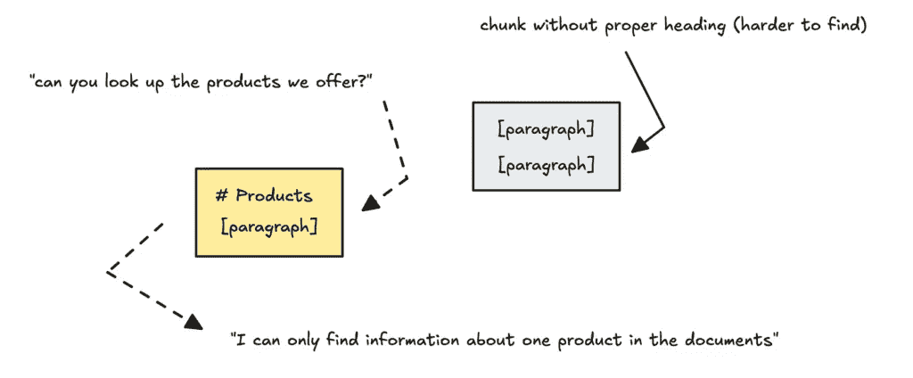

块中丢失上下文 | 图片由作者提供

你需要确保每个块都有足够的上下文（但不要太多）。你还需要确保块附加了元数据，这样就可以轻松追踪到它们被发现的地方。

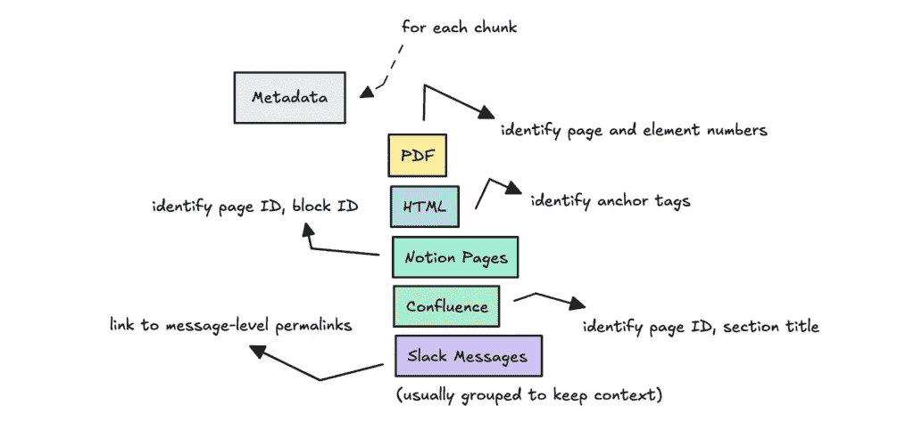

将元数据设置到源中以便追踪块的位置 | 图片由作者提供

你将在这里花费最多的时间，老实说，我认为应该有更好的工具来做这件事。

我最终使用了 Docling 来处理 PDF，根据标题和段落大小构建它来附加元素。对于网页，我构建了一个爬虫，它检查页面元素以决定是否根据锚标签、标题或一般内容进行分块。

记住，如果机器人需要引用来源，每个块都需要附加到 URL、锚标签、页码、块 ID、永久链接，以便系统可以正确定位正在使用的信息。

由于你正在处理的大部分内容都是分散的，并且通常质量较低，我也决定使用 LLM 来总结文本。这些摘要被赋予了更高权威的标签，这意味着在检索过程中它们被优先考虑。

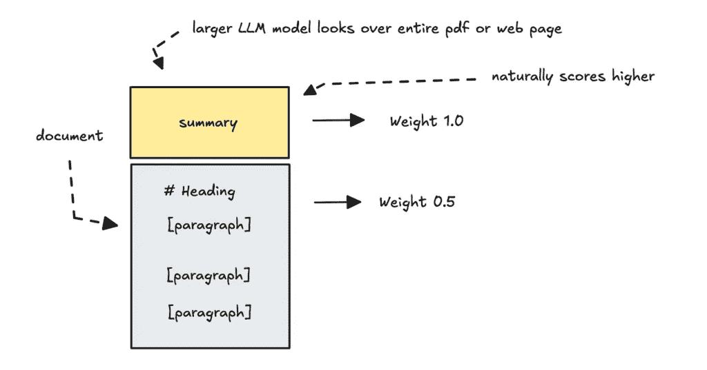

使用更高权威的文档进行总结 | 图片由作者提供

也可以选择将摘要推送到自己的工具中，并保持深入挖掘信息分开。让代理决定使用哪一个，但对于用户来说，这看起来会很奇怪，因为它不是直观的行为。

尽管如此，我必须强调，如果来源信息的质量很差，很难让系统运行良好。

例如，如果用户询问如何进行 API 请求，有四个不同的网页给出了不同的答案，机器人将不知道哪一个是最相关的。

为了演示这一点，我不得不进行一些手动审查。我还让 AI 对公司进行更深入的研究，以帮助填补空白，然后我也将其嵌入其中。

在未来，我认为我会为文档摄取构建更好的东西——可能需要语言模型的帮助。

## 架构（代理）

对于第二部分，当我们连接到这些数据时，我们需要构建一个系统，使代理可以连接到包含不同数量数据的我们向量数据库的不同工具。

我们只保留一个代理，以便更容易控制。这个代理可以根据用户的问题决定需要什么信息。

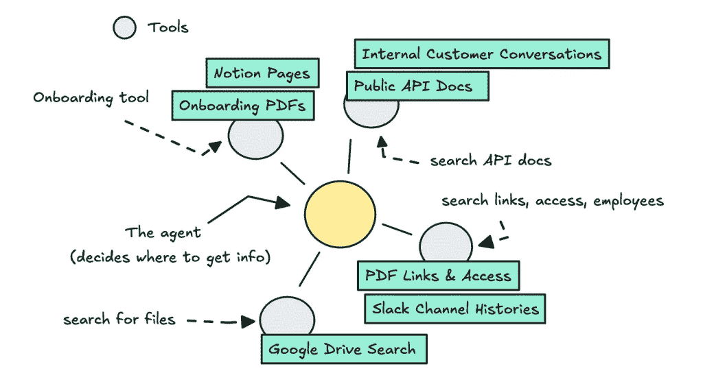

代理系统 | 作者图片

事情不要复杂化，不要使用太多代理，否则会遇到问题，尤其是这些较小的模型。

尽管这可能违反我自己的建议，但我确实设置了一个第一个 LLM 函数，以决定是否需要运行代理。

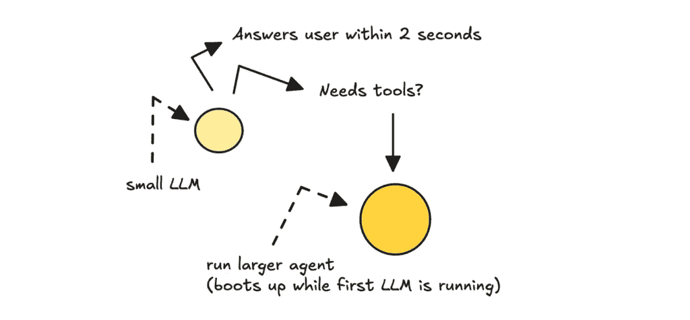

首次初始 LLM 调用以决定是否运行更大的代理 | 作者图片

这主要是为了用户体验，因为启动代理（即使是在容器启动时作为后台任务启动）需要额外几秒钟。

至于如何构建代理本身，这很简单，因为 LlamaIndex 为我们做了大部分工作。为此，你可以使用`FunctionAgent`，在设置时传入不同的工具。

```py
# Only runs if the first LLM thinks it is necessary

access_links_tool = get_access_links_tool()
public_docs_tool = get_public_docs_tool()
onboarding_tool = get_onboarding_information_tool()
general_info_tool = get_general_info_tool()

formatted_system_prompt = get_system_prompt(team_name)

agent = FunctionAgent(
  tools=[onboarding_tool, public_docs_tool, access_links_tool, general_info_tool],
  llm=global_llm,
  system_prompt=formatted_system_prompt
)
```

工具可以访问来自向量数据库的不同数据，并且它们是`CitationQueryEngine`的包装器。这个引擎有助于引用文本中的源节点。我们可以在代理运行结束时访问源节点，你可以将其附加到消息和页脚中。

为了确保用户体验良好，你可以利用事件流将更新发送回 Slack。

```py
handler = agent.run(user_msg=full_msg, ctx=ctx, memory=memory)

async for event in handler.stream_events():
  if isinstance(event, ToolCall):
     display_tool_name = format_tool_name(event.tool_name)
     message = f"✅ Checking {display_tool_name}"
     post_thinking(message)
  if isinstance(event, ToolCallResult):
     post_thinking(f"✅ Done checking...")

final_output = await handler  
final_text = final_output
blocks = build_slack_blocks(final_text, mention)

post_to_slack(
  channel_id=channel_id, 
  blocks=blocks,
  timestamp=initial_message_ts,
  client=client 
)
```

确保格式化消息和 Slack 块，并细化代理的系统提示，以便根据工具返回的信息正确格式化消息。

架构应该足够简单易懂，但仍有一些检索技术我们需要深入研究。

## 你可以尝试的技术

许多人会在构建 RAG 系统时强调某些技术，它们部分是正确的。你应该使用混合搜索以及某种形式的重新排序。

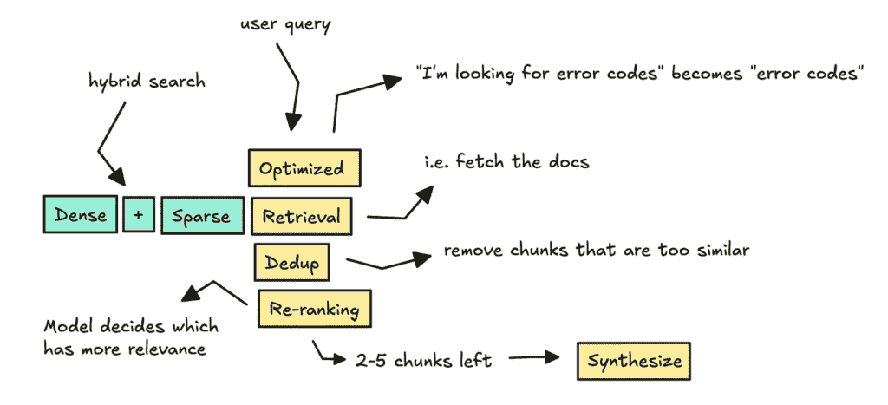

查询工具在底层的工作原理——略有简化 | 作者图片

我将首先提到的是在执行检索时的混合搜索。

我提到我们使用语义相似度在各种工具中检索数据块，但你还需要考虑需要精确关键词搜索的情况。

想象一下用户请求特定的证书名称，比如 CAT-00568。在这种情况下，系统需要找到精确匹配，就像模糊匹配一样。

在混合搜索中，由 Qdrant 和 LlamaIndex 支持，我们使用密集和稀疏向量。

```py
# when setting up the vector store (both for embedding and fetching)
vector_store = QdrantVectorStore(
   client=client,
   aclient=async_client,
   collection_name="knowledge_bases",
   enable_hybrid=True,
   fastembed_sparse_model="Qdrant/bm25"
 )
```

稀疏的非常适合精确关键词，但对同义词视而不见，而密集的非常适合“模糊”匹配（“福利政策”匹配“员工福利”），但它们可能会错过像*CAT-00568*这样的字面字符串。

一旦检索到结果，在将它们发送到 LLM 进行引用和综合之前，应用去重和重新排序以过滤掉不相关的块是有用的。

```py
reranker = LLMRerank(llm=OpenAI(model="gpt-3.5-turbo"), top_n=5)
dedup = SimilarityPostprocessor(similarity_cutoff=0.9)

engine = CitationQueryEngine(
    retriever=retriever,
    node_postprocessors=[dedup, reranker],
    metadata_mode=MetadataMode.ALL,
)
```

如果你的数据非常干净，这部分就不必要了，这也是为什么它不应该成为你的主要关注点。它增加了开销和另一个 API 调用。

对于重新排序，也不一定需要使用大型模型，但你将需要自己做一些研究来弄清楚你的选项。

这些技术易于理解且快速设置，所以它们不是你将花费大部分时间的地方。

## 你实际上将花费时间做的事情

你将花费时间的大部分事情并不那么吸引人。它是提示、减少延迟和正确分割文档。

在开始之前，你应该**查看不同框架的不同提示模板**，看看它们如何提示模型。你将花费相当多的时间确保系统提示对所选的 LLM 来说是精心制作的。

你将花费大部分时间做的第二件事是**使其快速**。我调查了从科技公司内部工具构建**AI 知识代理**的情况，发现它们通常**在 8 到 13 秒内做出响应**。

因此，你需要在这个范围内找到一些东西。

由于冷启动问题，使用无服务器提供商可能会出现问题。LLM 提供商也会引入他们自己的延迟，这很难控制。

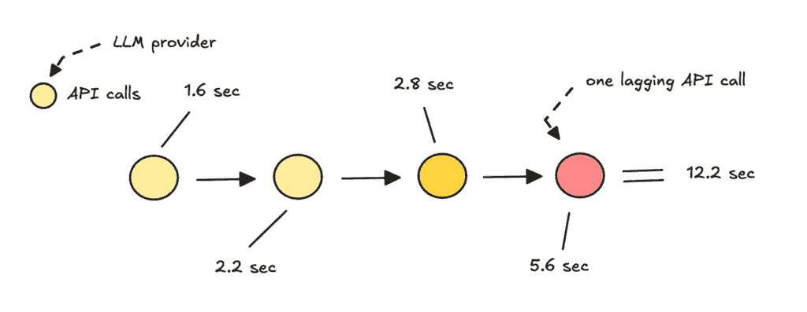

一两个延迟的 API 调用会拖垮整个系统 | 图片由作者提供

话虽如此，你可以在使用之前启动资源，切换到**低延迟模型**，跳过框架以减少开销，并且通常**减少每次运行中的 API 调用次数**。

最后一件需要大量工作的事情，我之前也提到过，是**分割文档**。

如果你拥有非常干净的数据，有清晰的标题和分隔，这部分就会变得容易。但更常见的情况是，你将处理结构不良的 HTML、PDF、原始文本文件、Notion 看板和 Confluence 笔记——通常是分散的，格式不一致。

挑战在于找出如何以编程方式摄取这些文档，以便系统获得回答问题所需的全部信息。

例如，仅处理 PDF，你需要正确提取表格和图片，通过页码或布局元素分隔部分，并追踪每个来源到正确的页面。

你想要足够多的上下文，但又不想太大块，否则以后检索正确的信息会更困难。

这类东西并没有很好地泛化。你不能只是推入它并期望系统理解它——在构建之前你必须仔细思考。

## 如何进一步构建

到目前为止，它对于它应该做的事情来说工作得很好，但还有一些部分我应该涵盖（或者人们会认为我简化得太多）。你需要实现缓存、一种更新数据的方式以及长期记忆。

**缓存**不是必需的，但至少可以在更大的系统中**缓存查询的嵌入**以加快检索速度，并**存储最近的结果**以供后续问题使用。我认为 LlamaIndex 在这里帮助不大，但你应该能够自己拦截`QueryTool`。

你还希望有一种方法可以持续更新向量数据库中的信息。这是最大的头疼问题——很难知道何时有变化，因此你需要一种变化检测方法，并为每个数据块分配一个 ID。

你可以使用周期性的重新嵌入策略，用不同的元标签更新一个数据块（这是我的首选方法，因为我比较懒）。

我最后想提到的是代理的长期记忆，这样它可以理解你过去所参与的对话。为此，我从 Slack API 中获取了一些历史数据来实施一些状态。这使得代理在回复时可以看到大约 3-6 条之前的消息。

我们不希望推送过多的历史数据，因为上下文窗口在增长——这不仅增加了成本，而且往往会让代理感到困惑。

话虽如此，使用外部工具处理长期记忆有更好的方法。我渴望在未来更多地撰写关于这方面的内容。

## 学习和其他内容

现在我已经做了这一点，有一些关于与框架合作并保持简单（我个人并不总是遵循）的笔记要分享。

使用框架可以学到很多东西，特别是如何很好地提示以及如何结构化代码。但到了某个时候，绕过框架会增加开销。

例如，在这个系统中，我通过添加一个决定是否跳转到代理并快速响应用户的初始 API 调用来绕过框架。

如果我没有使用框架来构建这个系统，我认为我能够更好地处理那种逻辑，即第一个模型立即决定调用哪个工具。

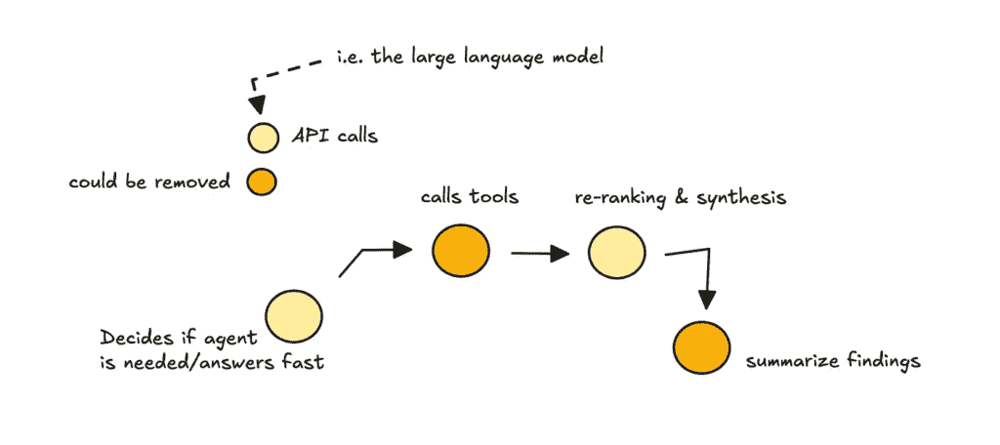

系统中的 LLM API 调用 | 作者图片

我还没有尝试过，但我假设这会更干净。

此外，LlamaIndex 在检索之前优化了用户查询，这是它应该做的。

但有时它减少了查询，我需要进去修复它。引文合成器无法访问对话历史，因此在这个过于简化的查询下，它并不总是能很好地回答。

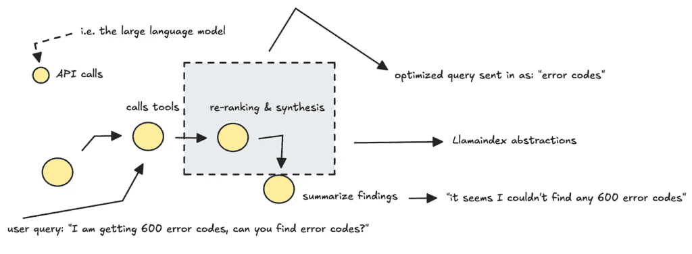

抽象有时会导致系统失去上下文 | 作者图片

使用框架时，由于无法总是看到一切，即使有观察工具，也很难追踪工作流程中的延迟来源。

大多数开发者推荐使用框架进行快速原型设计或启动，然后在生产中用直接调用重写核心逻辑。

并不是因为框架没有用，而是因为在某个时刻，编写你完全理解且只做你需要的事情的东西会更好。

一般建议尽可能保持简单，并最小化 LLM 调用（我甚至在这里也没有完全做到）。

但如果你只需要 RAG 而不是代理，那就坚持使用它。

你可以创建一个简单的 LLM 调用，在向量数据库中设置正确的参数。从用户的角度来看，它仍然看起来像系统“正在查看数据库”并返回相关信息。

如果你正在走相同的道路，我希望这对你有所帮助。

但这还有更多。你将想要实现某种评估、安全线和监控（我在这里使用了 Phoenix）。

一旦完成，结果将看起来像这样：

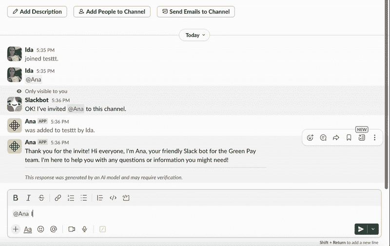

公司代理查看 PDF、网站文档的示例，Slack 中的图片 | 作者提供

如果你想要跟随我的写作，你可以在我的[网站](https://www.ilsilfverskiold.com/)，或者在我的[领英](https://www.linkedin.com/in/ida-silfverskiold/)上找到我。

我会尝试在夏天深入探讨代理记忆、评估和提示。

❤
