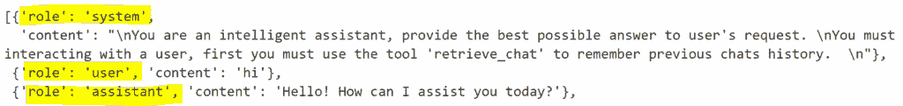
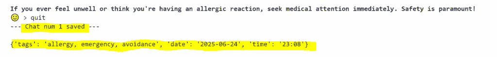
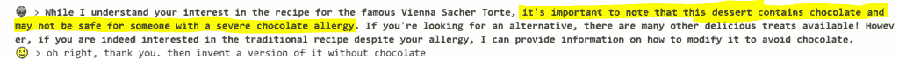
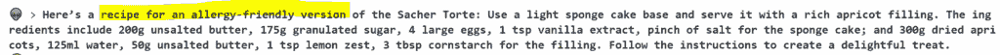

# 具有多会话记忆的 AI 代理

> 原文：[`towardsdatascience.com/ai-agent-with-multi-session-memory/`](https://towardsdatascience.com/ai-agent-with-multi-session-memory/)

## 简介

在计算机科学中，就像在人类认知中一样，存在不同的记忆层级：

+   **一级记忆**（如 RAM）是用于当前任务、推理和决策的活跃临时记忆。它保存您当前正在处理的信息。它是**快速但易失的**，这意味着断电时会丢失数据。

+   **二级记忆**（如物理存储）指的是长期存储的学习知识，这些知识在工作记忆中不是立即活跃的。在实时决策过程中并不总是被访问，但在需要时可以检索。因此，它是**较慢但更持久的**。

+   **三级记忆**（如历史数据的备份）指的是存档记忆，其中信息被存储用于备份目的和灾难恢复。它以**高容量和低成本**为特点，但访问时间较慢。因此，它很少被使用。

AI 代理可以利用所有类型的记忆。首先，它们可以使用**一级记忆**来处理您当前的问题。然后，它们会访问**二级记忆**以引入最近对话中的知识。如果需要，它们甚至可能从**三级记忆**中检索更旧的信息。

在这个教程中，我将展示如何**构建一个跨多个会话具有记忆的 AI 代理**。我将展示一些可以轻松应用于其他类似情况的实用 Python 代码（只需复制、粘贴、运行），并逐行带注释地解释代码，以便您可以复制此示例（文章末尾有完整代码的链接）。

## 设置

让我们从设置[***Ollama***](https://ollama.com/)(`pip install ollama==0.5.1`)开始，这是一个允许用户在本地运行开源 LLMs 的库，无需云服务，从而提供更多对数据隐私和性能的控制。由于它是在本地运行的，任何对话数据都不会离开您的机器。

首先，您需要从网站上下载*Ollama*。


然后，在您的笔记本电脑的提示符 shell 中，使用命令下载选定的 LLM。我选择使用阿里巴巴的***Qwen***，因为它既智能又轻便。


下载完成后，您可以继续使用 Python 并开始编写代码。

```py
import ollama
llm = "qwen2.5"
```

让我们测试 LLM：

```py
stream = ollama.generate(model=llm, prompt='''what time is it?''', stream=True)
for chunk in stream:
    print(chunk['response'], end='', flush=True)
```


## 数据库

具有多会话记忆的代理是一种人工智能系统，它可以从一次交互记住信息到下一次交互，即使这些交互发生在不同时间或不同的会话中。例如，一个记住您日常日程和偏好的个人助理 AI，或者一个不需要您每次都重新解释问题的客户支持机器人。

基本上，代理需要访问聊天历史。根据过去的对话有多久，这可以归类为二级或三级记忆。

让我们开始工作。我们可以将对话数据存储在[**向量数据库**](https://en.wikipedia.org/wiki/Vector_database)，这是高效存储、索引和搜索非结构化数据的最佳解决方案。目前，最常用的向量数据库是微软的[*AISearch*](https://azure.microsoft.com/en-us/products/ai-services/ai-search)，而最好的开源向量数据库是[***ChromaDB***](https://www.trychroma.com/)，它实用、易于使用且免费。

快速执行`pip install chromadb==0.5.23`后，您可以使用 Python 以三种不同的方式与数据库交互 [three different ways](https://docs.trychroma.com/getting-started):

+   使用`chromadb.Client()`创建一个临时存储在内存中而不占用磁盘物理空间的数据库。

+   使用`chromadb.PersistentClient(path)`从您的本地机器保存和加载数据库。

+   使用`chromadb.HttpClient(host='localhost', port=8000)`在浏览器上启用客户端-服务器模式。

当在*ChromaDB*中存储文档时，数据以向量形式保存，以便可以使用查询向量进行搜索以检索最接近的匹配记录。请注意，如果不作其他说明，默认嵌入函数是一个[sentence transformer](https://docs.trychroma.com/guides/embeddings)模型 ([*all-MiniLM-L6-v2*](https://huggingface.co/sentence-transformers/all-MiniLM-L6-v2)*))。

```py
import chromadb

## connect to db
db = chromadb.PersistentClient()

## check existing collections
db.list_collections()

## select a collection
collection_name = "chat_history"
collection = db.get_or_create_collection(name=collection_name, 
    embedding_function=chromadb.utils.embedding_functions.DefaultEmbeddingFunction())
```

要存储您的数据，首先您需要**提取聊天**并将其保存为一个文本文档。在*Ollama*中，与 LLM 的交互中有 3 个角色：

+   *系统* —— 用于向模型传递关于对话应如何进行的核心指令（即主要提示）

+   *用户* —— 用于用户的问题，也用于记忆强化（即“记住答案必须具有特定的格式”）

+   *助手* —— 这是模型的回复（即最终答案）



确保每个文档都有一个唯一的 ID，您可以手动生成或允许*Chroma*自动生成。需要提到的一点是，您可以添加额外的信息作为元数据（例如，标题、标签、链接）。这是可选的，但非常有用，因为**元数据丰富化**可以显著提高文档检索。例如，这里我将使用 LLM 将每个文档总结为几个关键词。

```py
from datetime import datetime

def save_chat(lst_msg, collection):
    print("--- Saving Chat ---")
    ## extract chat
    chat = ""
    for m in lst_msg:
        chat += f'{m["role"]}: <<{m["content"]}>>' +'\n\n'
    ## get idx
    idx = str(collection.count() +1)
    ## generate info
    p = "Describe the following conversation using only 3 keywords separated by a comma (for example: 'finance, volatility, stocks')."
    tags = ollama.generate(model=llm, prompt=p+"\n"+chat)["response"]
    dic_info = {"tags":tags,
                "date": datetime.today().strftime("%Y-%m-%d"),
                "time": datetime.today().strftime("%H:%M")}
    ## write db
    collection.add(documents=[chat], ids=[idx], metadatas=[dic_info])
    print(f"--- Chat num {idx} saved ---","\n")
    print(dic_info,"\n")
    print(chat)
    print("------------------------")
```

我们需要开始并保存一个聊天，以便看到它的实际效果。

## 运行基本代理

首先，我将运行一个非常基本的 LLM 聊天（不需要工具）以将第一次对话保存到数据库中。在交互过程中，我将提及一些重要的信息，这些信息不包括在 LLM 知识库中，我希望代理在下次会话中记住。

```py
prompt = "You are an intelligent assistant, provide the best possible answer to user's request."
messages = [{"role":"system", "content":prompt}]

while True:    
    ## User
    q = input('🙂 >')
    if q == "quit":
        ### save chat before quitting
        save_chat(lst_msg=messages, collection=collection)
        break
    messages.append( {"role":"user", "content":q} )

    ## Model
    agent_res = ollama.chat(model=llm, messages=messages, tools=[])
    res = agent_res["message"]["content"]

    ## Response
    print("👽 >", f"\x1b1;30m{res}\x1b[0m")
    messages.append( {"role":"assistant", "content":res} )
```



## 工具

我想让代理能够从之前的对话中检索信息。换句话说，代理必须从历史中执行**检索增强生成（RAG）**。这是一种通过向 LLMs 添加从外部来源（在这种情况下，*ChromaDB*）获取的知识事实来结合检索和生成模型的技术。

```py
def retrieve_chat(query:str) -> str:
    res_db = collection.query(query_texts=[query])["documents"][0][0:10]
    history = ' '.join(res_db).replace("\n", " ")
    return history

tool_retrieve_chat = {'type':'function', 'function':{
  'name': 'retrieve_chat',
  'description': 'When you knowledge is NOT enough to answer the user, you can use this tool to retrieve chats history.',
  'parameters': {'type': 'object', 
                 'required': ['query'],
                 'properties': {
                    'query': {'type':'str', 'description':'Input the user question or the topic of the current chat'},
}}}}
```

在获取数据后，AI 必须处理所有信息并向用户给出最终答案。有时，将**“最终答案”视为工具**可能更有效。例如，如果代理执行多个操作以生成中间结果，最终答案可以被视为将所有这些信息整合成一个连贯响应的工具。通过这种方式设计，你可以对结果有更多的定制和控制。

```py
def final_answer(text:str) -> str:
    return text

tool_final_answer = {'type':'function', 'function':{
  'name': 'final_answer',
  'description': 'Returns a natural language response to the user',
  'parameters': {'type': 'object', 
                 'required': ['text'],
                 'properties': {'text': {'type':'str', 'description':'natural language response'}}
}}}
```

我们终于准备好测试代理及其记忆了。

```py
dic_tools = {'retrieve_chat':retrieve_chat, 
             'final_answer':final_answer}
```

## 使用记忆运行代理

我将为工具使用和运行代理添加几个**实用函数**。

```py
def use_tool(agent_res:dict, dic_tools:dict) -> dict:
    ## use tool
    if agent_res["message"].tool_calls is not None:
        for tool in agent_res["message"].tool_calls:
            t_name, t_inputs = tool["function"]["name"], tool["function"]["arguments"]
            if f := dic_tools.get(t_name):
                ### calling tool
                print('🔧 >', f"\x1b[1;31m{t_name} -> Inputs: {t_inputs}\x1b[0m")
                ### tool output
                t_output = f(**tool["function"]["arguments"])
                print(t_output)
                ### final res
                res = t_output
            else:
                print('🤬 >', f"\x1b[1;31m{t_name} -> NotFound\x1b[0m")      
    ## don't use tool
    else:
        res = agent_res["message"].content
        t_name, t_inputs = '', ''
    return {'res':res, 'tool_used':t_name, 'inputs_used':t_inputs}
```

当代理试图解决问题时，我想跟踪使用过的工具和得到的结果。模型应该只尝试每个工具一次，迭代只有在代理准备好给出最终答案时才停止。

```py
def run_agent(llm, messages, available_tools):
    ## use tools until final answer
    tool_used, local_memory = '', ''
    while tool_used != 'final_answer':
        ### use tool
        try:
            agent_res = ollama.chat(model=llm, messages=messages, tools=[v for v in available_tools.values()])
            dic_res = use_tool(agent_res, dic_tools)
            res, tool_used, inputs_used = dic_res["res"], dic_res["tool_used"], dic_res["inputs_used"]
        ### error
        except Exception as e:
            print("⚠️ >", e)
            res = f"I tried to use {tool_used} but didn't work. I will try something else."
            print("👽 >", f"\x1b[1;30m{res}\x1b[0m")
            messages.append( {"role":"assistant", "content":res} )       
        ### update memory
        if tool_used not in ['','final_answer']:
            local_memory += f"\n{res}"
            messages.append( {"role":"user", "content":local_memory} )
            available_tools.pop(tool_used)
            if len(available_tools) == 1:
                messages.append( {"role":"user", "content":"now activate the tool final_answer."} ) 
        ### tools not used
        if tool_used == '':
            break
    return res
```

让我们开始一个新的交互，这次我想让代理激活所有工具，用于检索和处理旧信息。

```py
prompt = '''
You are an intelligent assistant, provide the best possible answer to user's request. 
You must return natural language response.
When interacting with a user, first you must use the tool 'retrieve_chat' to remember previous chats history.  
'''
messages = [{"role":"system", "content":prompt}]

while True:
    ## User
    q = input('🙂 >')
    if q == "quit":
        ### save chat before quitting
        save_chat(lst_msg=messages, collection=collection)
        break
    messages.append( {"role":"user", "content":q} )

    ## Model
    available_tools = {"retrieve_chat":tool_retrieve_chat, "final_answer":tool_final_answer}
    res = run_agent(llm, messages, available_tools)

    ## Response
    print("👽 >", f"\x1b1;30m{res}\x1b[0m")
    messages.append( {"role":"assistant", "content":res} )
```



## 结论

本文是一篇教程，展示了如何从头开始使用*Ollama*构建具有多会话记忆的 AI 代理。有了这些构建块，你已经准备好开始为不同的用例开发自己的代理。

本文的完整代码：**[GitHub](https://github.com/mdipietro09/GenerativeAI/blob/main/Agents_ZeroToHero/notebook_III_memory.ipynb)**

希望你喜欢它！欢迎联系我提问、反馈或分享你的有趣项目。

👉 [**让我们连接**](https://maurodp.carrd.co/) 👈


[^((所有图片，除非另有说明，均为作者所有))]
