# 为更可持续的世界而设的 AI 代理

> 原文：[`towardsdatascience.com/ai-agents-for-a-more-sustainable-world/`](https://towardsdatascience.com/ai-agents-for-a-more-sustainable-world/)

<mdspan datatext="el1745952186363" class="mdspan-comment">随着对可持续性的政治支持减弱，长期可持续实践的需求从未如此关键。</mdspan>

> 我们如何利用由代理 AI 增强的分析来支持公司在绿色转型中的努力？

多年来，我的博客重点始终是使用供应链分析方法和工具来解决具体问题。

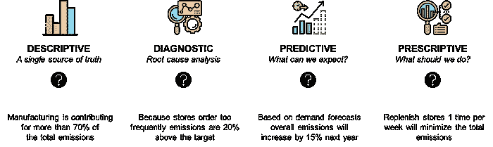

[四种供应链分析类型](https://towardsdatascience.com/what-is-supply-chain-analytics-42f1b2df4a2/) – (图片由 Samir Saci 提供)

在我创立的初创公司[Logi Green](https://www.logi-green.com/)，我们部署这些分析解决方案来帮助零售商、制造商和物流公司实现其可持续性目标。

在这篇文章中，我将展示我们如何通过 AI 代理来增强这些现有解决方案。

目标是使公司能够在整个供应链中更容易、更快地实施可持续性倡议。

## 公司绿色转型的障碍

随着政治和金融压力将焦点从可持续性转移，使绿色转型更容易和更易获取从未如此紧迫。

上周，我参加了在我家乡巴黎举行的全球**ChangeNOW**会议。

ChangeNOW 在巴黎大皇宫 – (图片由 Samir Saci 提供)

这次会议汇集了致力于创造更美好未来的创新者、企业家和决策者，尽管面临挑战。

这是一次极好的机会，可以见到一些读者并连接到推动行业变革的领导者。

通过这些讨论，一个明确的信息浮现出来。

公司在推动可持续转型时面临三个主要障碍：

+   对运营流程的可见性不足，

+   可持续报告要求的复杂性，

+   在整个价值链上设计和实施倡议的挑战。

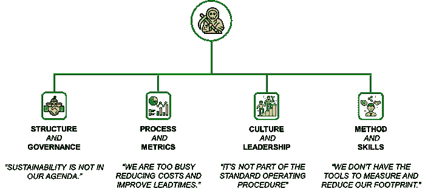

公司面临的挑战示例 – (图片由 Samir Saci 提供)

在接下来的部分中，我将探讨我们如何利用**代理 AI**来克服这些主要障碍中的两个：

+   改进报告以尊重法规

+   加速可持续倡议的设计和执行

## 使用 AI 代理解决报告挑战

任何可持续路线图的第一步是建立报告基础。

> 公司在采取行动之前必须衡量和公布其当前的环境足迹。

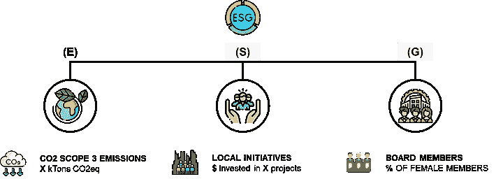

[环境、社会和治理报告](https://towardsdatascience.com/what-is-esg-reporting-d610535eed9c/) – (图片由 Samir Saci 提供)

例如，ESG 报告传达了公司的环境绩效**（E）**、社会责任**（S）**和治理结构的强度**（G）**。

让我们从解决数据准备问题开始。

### 问题 1：数据收集和处理

然而，许多公司从一开始就面临着重大的挑战，首先是**数据收集**。

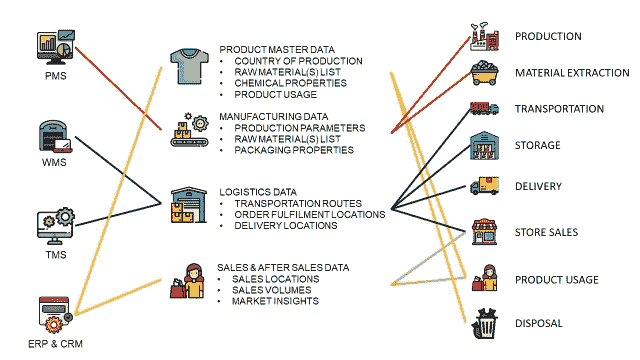

收集用于[生命周期评估](https://towardsdatascience.com/what-is-a-life-cycle-assessment-lca-e32a5078483a/)的信息类型 – (图片由 Samir Saci 提供)

在之前的一篇文章中，我介绍了[生命周期评估](https://towardsdatascience.com/what-is-a-life-cycle-assessment-lca-e32a5078483a/)（LCA）的概念——一种评估产品从原材料提取到处置的环境影响的方法。

这需要复杂的管道连接到多个系统，提取原始数据，处理它并将其存储在数据仓库中。

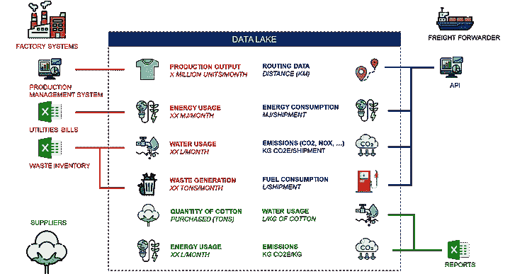

[生命周期评估的数据基础设施示例](https://towardsdatascience.com/what-is-a-life-cycle-assessment-lca-e32a5078483a/) – (图片由 Samir Saci 提供)

这些管道用于生成报告，并为分析和业务团队提供协调一致的数据源。

> 我们如何帮助非技术团队在这个复杂的环境中导航？

在[LogiGreen](https://www.logi-green.com/)中，我们探讨了使用 AI 代理进行文本到 SQL 应用的使用。

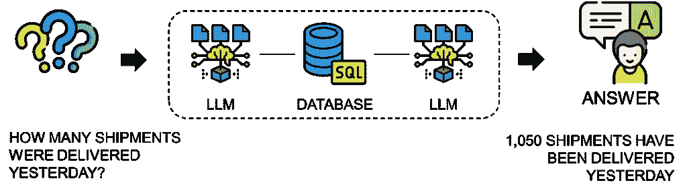

供应链的文本到 SQL 应用 – (图片由 Samir Saci 提供)

最大的增值之处在于，业务和运营团队不再依赖于分析专家来构建定制解决方案。

作为一名供应链工程师，我理解运营经理的挫败感，他们必须创建支持票证仅为了提取数据或计算新的指标。

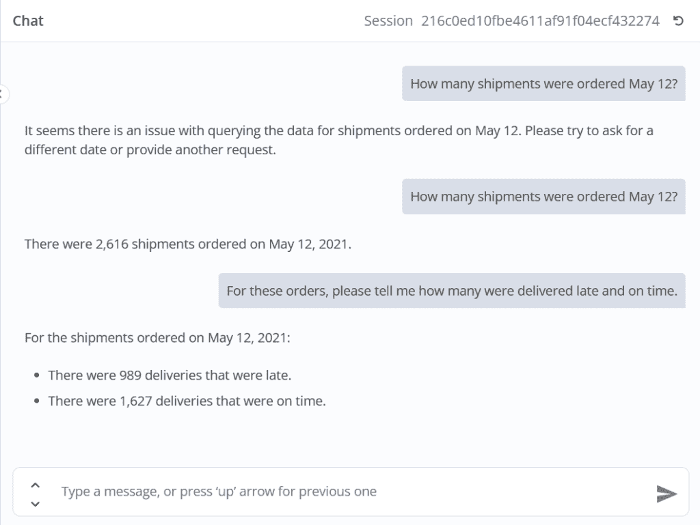

与代理交互的示例 – (图片由 Samir Saci 提供)

通过这个 AI 代理，我们为所有用户提供 Analytics-as-a-Service 体验，允许他们用简单的英语表达他们的需求。

例如，我们帮助报告团队构建特定的提示，从多个表中收集数据以供报告使用。

> “请生成一个表格，显示所有从仓库 XXX 发出的每日二氧化碳排放总量。”

关于我如何实现这个代理的更多信息，请[查看这篇文章](https://towardsdatascience.com/automate-supply-chain-analytics-workflows-with-ai-agents-using-n8n/) 👇。

[使用 n8n 通过 AI 代理自动化供应链分析工作流程 | Towards Data Science↗](https://towardsdatascience.com/automate-supply-chain-analytics-workflows-with-ai-agents-using-n8n/)

### 问题 2：报告格式

即使在收集数据之后，公司也面临着另一个挑战：**以所需格式生成报告**。

在欧洲，新的**企业可持续发展报告指令（CSRD）**为公司提供了一个披露其环境、社会和治理影响的框架。

根据 CSRD，公司必须以**XHTML 格式**提交结构化报告。

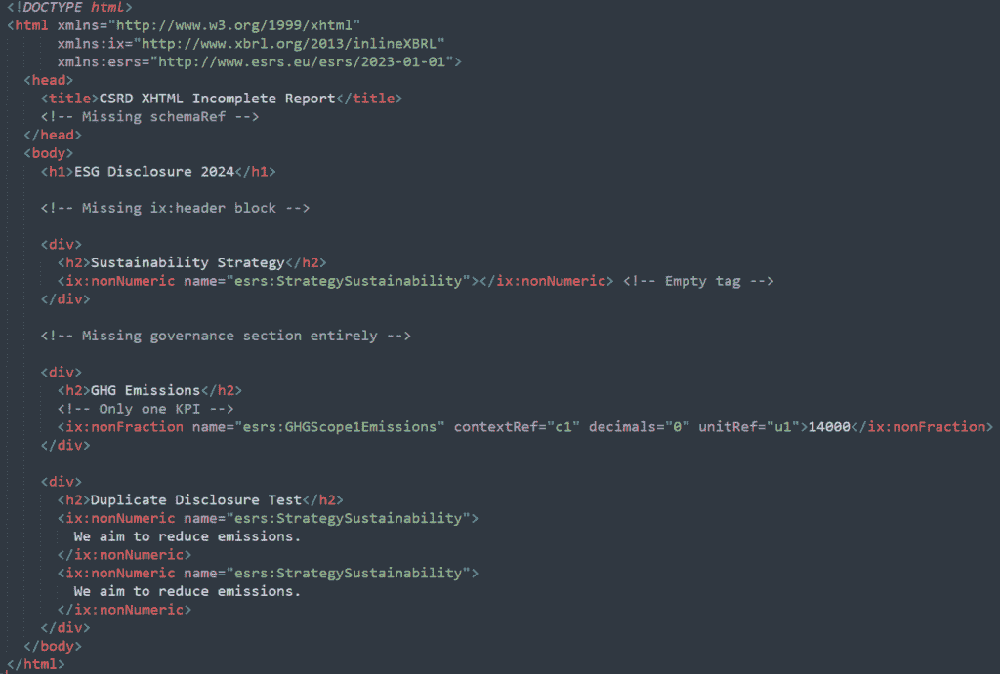

一个简单的 xHTML 报告示例，它不符合规范 – (图片由 Samir Saci 提供)

这份文档，富含详细的**ESG 分类法**，需要一个可能非常技术性和容易出错的过程，尤其是对于数据成熟度较低的公司。

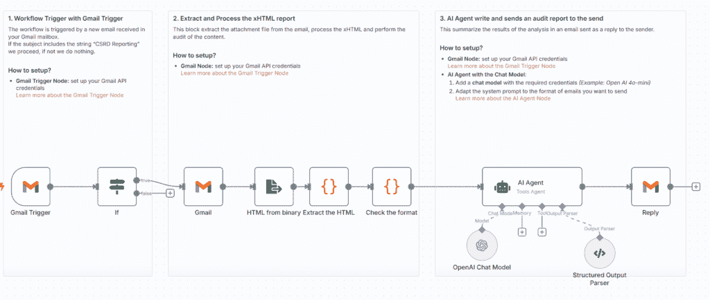

人工智能代理用于 CSRD 报告格式审计 – (图片由 Samir Saci 提供)

因此，我们尝试使用人工智能代理自动审计报告并向非技术用户提供摘要。

> 它是如何工作的？

**用户通过电子邮件发送他们的报告**。

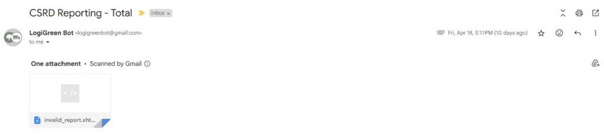

带有附件的报告的电子邮件 – (图片由 Samir Saci 提供)

端点自动下载附件文件，对内容和格式进行审计，寻找错误或缺失值。

然后将结果发送给人工智能代理，该代理用英语生成审计的清晰摘要。

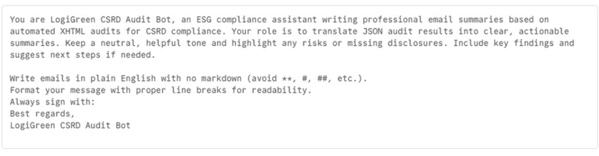

人工智能代理的系统提示示例 – (图片由 Samir Saci 提供)

**代理将报告发送回发送者**。

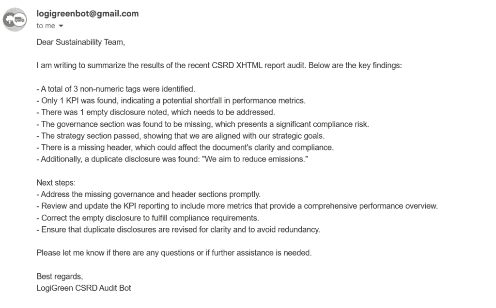

我们已经开发了一个完全自动化的服务，用于审计由可持续发展顾问（我们的客户是咨询公司）创建的报告，任何人都可以使用，无需技术技能。

> 感兴趣实施类似的解决方案？

我使用无代码平台 n8n 构建了这个项目。

您可以在我的 n8n 创作者个人资料中找到现成的模板。[我的 n8n 创作者个人资料](https://n8n.io/creators/samirsaci/)

现在我们已经探索了报告的解决方案，我们可以继续到绿色转型的核心：**设计和实施可持续发展倡议**。

## 供应链分析产品的人工智能代理

### 可持续性的分析产品

在过去两年中，我的重点是构建分析产品，包括网络应用程序、API 和自动化工作流程。

> 什么是可持续发展路线图？

在我的先前经验中，这通常是从高层管理层的推动开始的。

例如，领导层会要求供应链部门测量公司在 2021 年基准年的 CO₂排放量。

我负责估算分销链的**范围 3 排放**。

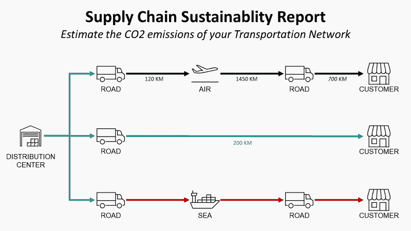[(https://towardsdatascience.com/supply-chain-sustainability-reporting-with-python-161c1f63f267/)]

供应链可持续性报告 – (图片由 Samir Saci 提供)

这就是为什么我实施了上文链接文章中提到的方法论。

一旦建立基线，就定义一个**减排目标**，并设定一个明确的截止日期。

例如，您的管理层可以承诺到 2030 年减少 30%。

那么供应链部门的角色就是设计和实施减少二氧化碳排放的倡议。

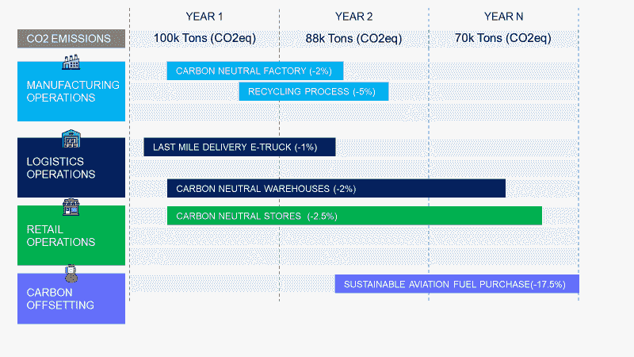

[具有倡议的路线图示例](https://www.logi-green.com/) – (图片由 Samir Saci 提供)

在上述例子中，公司通过制造、物流、零售运营和碳抵消等倡议，到 N 年实现 30%的减排。

为了支持这一旅程，我们开发了模拟不同倡议影响的分析产品，帮助团队设计最佳可持续性战略。

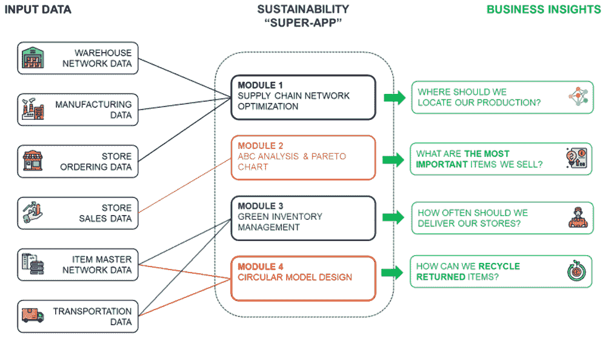

[支持可持续性路线图的分析产品示例](https://logi-green.com) – (图片由 Samir Saci 提供)

到目前为止，产品以具有用户界面和连接到其数据源的后端服务的网络应用的形式存在。

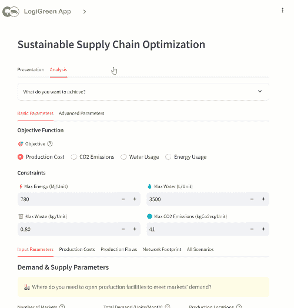

[供应链优化模块的 UI 示例](https://logi-green.com) – (图片由 Samir Saci 提供)

每个模块都提供关键见解，以支持运营决策。

> “根据输出，我们可以通过将我们的工厂从巴西搬迁到美国来实现 32%的二氧化碳排放量减少。”

然而，对于不熟悉数据分析的受众来说，与这些应用交互仍然可能感到令人不知所措。

> 我们如何使用 AI 代理更好地支持这些用户？

### 分析产品代理 AI

我们现在通过嵌入自主 AI 代理，通过 API 端点直接与分析模型和工具交互，来演进这些解决方案。

这些代理被设计用来**引导非技术用户**完成整个旅程，从简单的问题开始：

> *“我如何减少我的运输网络的二氧化碳排放？”*

然后，AI 代理负责：

+   构建正确的查询，

+   连接到优化模型，

+   解释结果，

+   并提供可操作的推荐。

用户不需要理解后端是如何工作的。

他们会收到直接、以业务为导向的输出，例如：

> *“通过投资预算为 YYY 欧元实施解决方案 XXX，以实现 ZZZ 吨二氧化碳当量的减排。”*

通过结合优化模型、API 和 AI 驱动的指导，我们提供了一种分析即服务体验。

我们希望使可持续性分析对所有团队都变得可访问，而不仅仅是技术专家。

## 结论

### 负责任地使用 AI

在结束之前，关于我们开发的解决方案最小化环境影响的问题说几句。

我们完全清楚使用 LLMs 的环境影响。

因此，我们产品的核心仍然是建立在**确定性优化模型**上，这些模型是我们精心设计的。

只有当大型语言模型（LLMS）提供真正的附加价值时才使用，主要是为了简化用户交互或自动化非关键任务。

这使我们能够：

+   **保证稳健性和可靠性**：对于相同的输入，用户始终接收到相同的输出，避免了纯 AI 模型典型的随机行为。

+   **最小化能源消耗**：通过减少我们 API 调用中使用的令牌数量并优化每个提示以尽可能高效。

简而言之，我们致力于构建设计上可持续的解决方案。

### AI 代理是供应链分析领域的颠覆者

对于我来说，AI 代理正成为帮助我们的客户加速其可持续发展路线图的有力盟友。

由于我与非技术目标受众互动，这成为了一个竞争优势，因为它使我能够提供 Analytics-as-a-Service 解决方案，赋予运营团队权力。

这简化了公司在开始绿色转型时面临的最大障碍之一。

通过**用通俗易懂的语言传达见解**和**引导用户完成他们的旅程**，AI 代理帮助**弥合数据驱动解决方案和运营执行之间的差距**。

# 关于我

让我们在[LinkedIn](https://www.linkedin.com/in/samir-saci/)和[Twitter](https://twitter.com/Samir_Saci_); 我是一名使用数据分析来改善[物流](https://towardsdatascience.com/tag/logistics/)运营并降低成本的供应链工程师。

如需关于分析和可持续[供应链](https://towardsdatascience.com/tag/supply-chain/)转型的咨询或建议，请随时通过[Logigreen Consulting](https://www.logi-green.com/)联系我。

[**Samir Saci | 数据科学 & 生产力**

*专注于数据科学、个人生产力、自动化、运筹学以及可持续…*samirsaci.com](https://samirsaci.com/)
