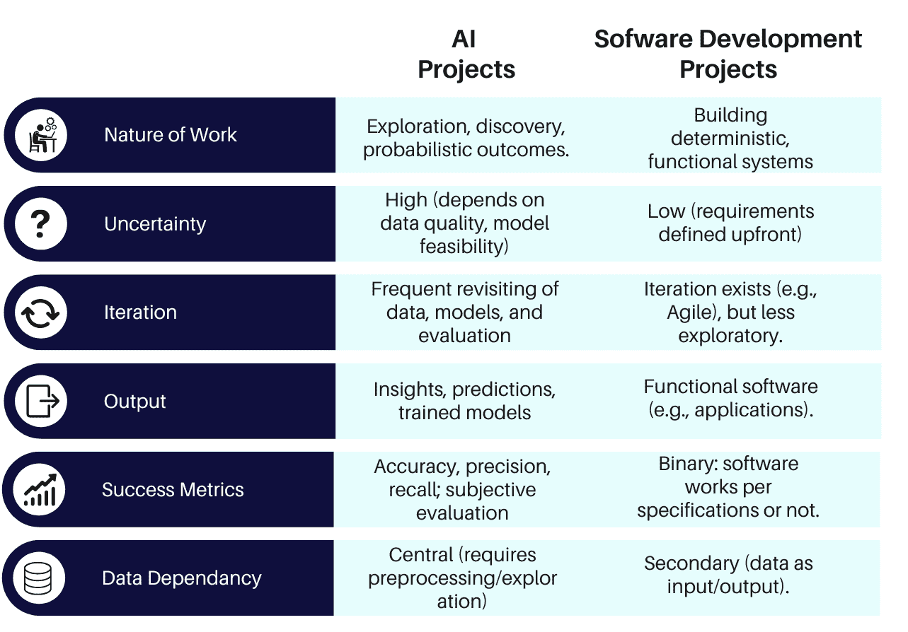
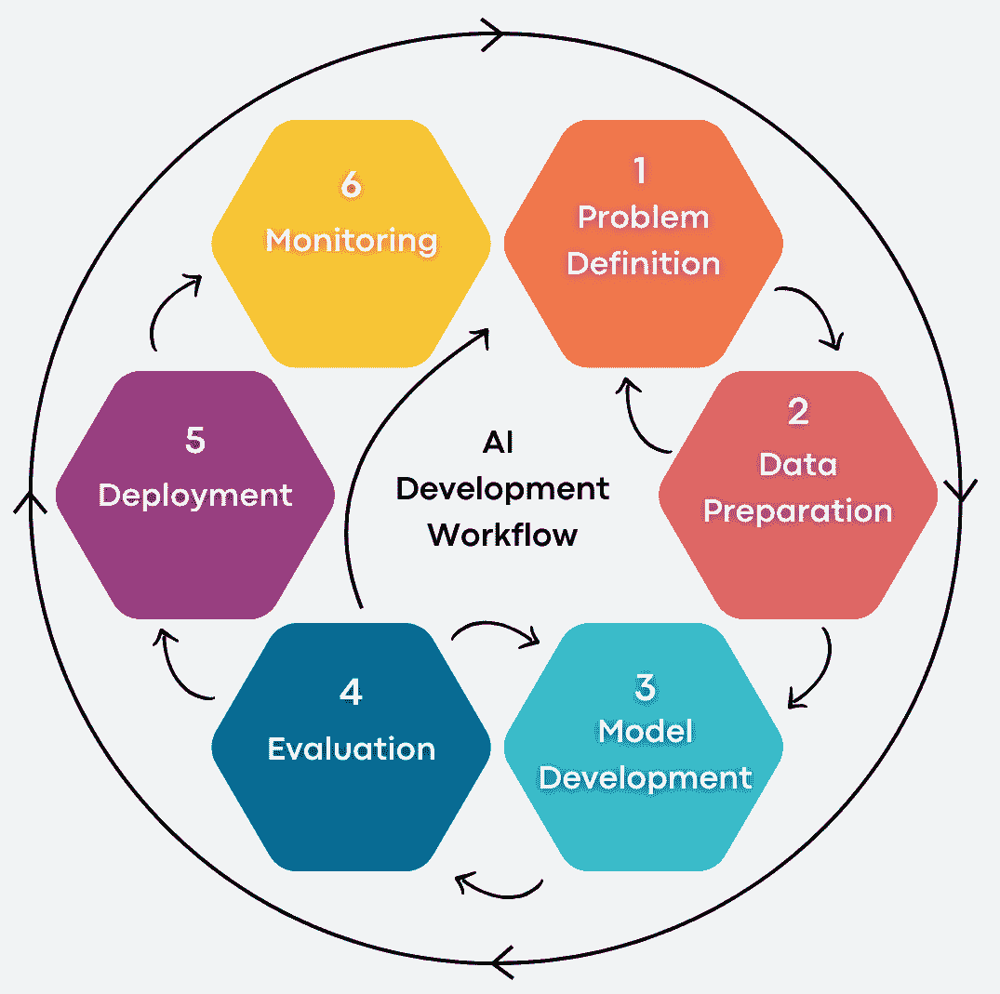
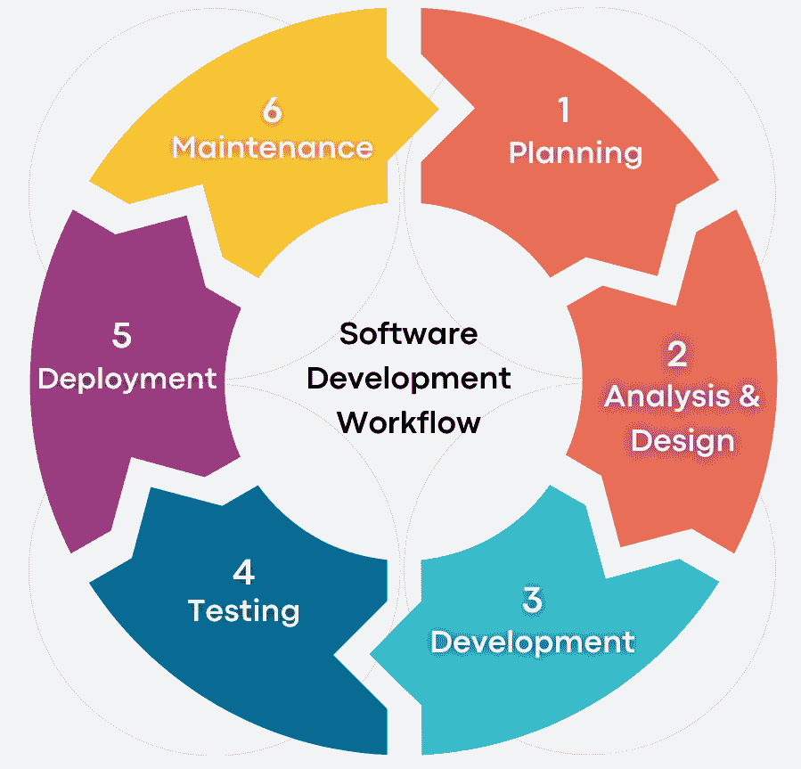

# 人工智能开发与软件工程：关键差异解析

> 原文：[`towardsdatascience.com/ai-development-vs-software-engineering-key-differences-explained-0709633e81d2/`](https://towardsdatascience.com/ai-development-vs-software-engineering-key-differences-explained-0709633e81d2/)

在许多人工智能（AI）和软件工程团队中工作并领导过，我注意到关于这些团队如何工作的**主要误解**，特别是认为这些流程是相同的假设。

尽管有些人认为人工智能的开发与标准软件的开发相同，甚至可能更简单，因为“人工智能可以自己解决”——但现实当然完全不同。

本文**讨论了基本差异，并提供了可操作的方法来帮助企业有效地采用人工智能**。

## 人工智能与传统软件开发之间的关键差异

首先，当我讨论人工智能开发时，我会结合一些标准的**人工智能、机器学习和数据科学**方法，因为这些方法之间有许多关键相似之处，所有这些都与传统的软件开发流程形成对比。

人工智能项目在方法、工作流程和成功标准方面与传统软件开发不同。以下总结了其中许多关键差异：

核心差异——由作者创建的图像

## 开发生命周期：迭代探索与线性执行

### 人工智能工作流程

人工智能项目遵循迭代框架（如[CRISP-DM](https://www.datascience-pm.com/crisp-dm-2/)，通常用于数据科学项目），强调发现和适应。

在这里，我使用了一个类似于 CRISP-DM 的工作流程，但增加了一个明确的监控步骤（这在开发人工智能和机器学习模型时强调了其重要性）。尽管这在数据科学中也很重要，但在某些情况下，输出的是一系列报告或洞察，而不是一个模型。

在人工智能模型的情况下，需要更多的监控，这可能会重新触发对更新模型的必要性（再次开始循环）。人工智能模型需要重新训练并不是模型的失败，而是捕捉新出现的模式（这些模式可能不在模型训练的数据中存在）的自然过程。

1.  **问题定义**：根据业务目标陈述项目的目标（例如，“将客户流失率降低 20%）”。

1.  **数据准备**：数据清洗、预处理和探索（例如，如何处理销售数据中的缺失值）。

1.  **模型开发**：尝试不同的算法（例如，神经网络与支持向量机）。

1.  **评估**：基于模型之前从未见过的数据进行模型验证（并优化超参数）。

1.  **部署**：将其发布到生产环境中（例如，提供实时预测的 API）。

1.  **监控**：监控模型性能并跟踪任何与预期不符的偏差。允许定期重新训练模型（例如，每季度更新）。

AI 开发工作流程 - 由作者创建的图像

## 软件开发工作流程

传统项目遵循诸如软件开发生命周期（SDLC）等方法论：

1.  **规划**：定义范围、功能、成本和时间框架。

1.  **分析与设计**：开发 UI/UX 原型和系统架构。

1.  **开发**：开发代码（例如，前端使用 React，后端使用 Node.js）。

1.  **测试**：检查其是否符合设定的标准。

1.  **部署**：发布到应用商店或服务器。

1.  **维护**：修复错误并提供给用户更新。

软件开发工作流程 - 由作者创建的图像

软件开发遵循一个较为简单的流程：这里的主要区别在于，与开发过程中可以在多个点回退到早期阶段的 AI 工作流程相比，正向进展是连续的。

## 为什么 AI 项目需要迭代

### 问题定义不确定性

• **挑战**：复杂问题通常不容易定义和确定范围（例如，欺诈检测涉及不断演变的模式和行为）。

• **解决方案**：在调查数据（与利益相关者一起）时，应细化问题。

### 数据不确定性

• **挑战**：数据缺陷或偏见可能直到项目中期才会出现（例如，在医疗保健数据库中缺乏患者人口统计数据）。

• **解决方案**：应进行可行性研究和迭代数据审计。

### 探索性模型开发

• **挑战**：没有单一的“最佳匹配”算法（例如，欺诈检测模型可能需要在某个阶段使用决策树，而在另一个阶段使用图神经网络）。

• **解决方案**：在 MVP 阶段应原型化多种方法。

### 概率性结果

• **挑战**：模型可能对来自现实世界的数据变化很脆弱（例如，欺诈检测模型可能无法很好地处理新的欺诈类型）。

• **解决方案**：安排重新训练周期并监控性能。

## 成功建议

### 1. 优先考虑数据策略而非立即构建模型

**构建稳健的数据基础设施**：

+   数据收集、清理和标注应自动化

+   实施版本控制系统以跟踪数据集迭代并确保可以重现结果

**进行项目前审计**：

+   旨在在建模之前发现数据中的任何问题。

## 2. 构建跨职能团队

**关键角色**：

+   **数据工程师**：设计可扩展的数据处理管道。

+   **数据科学家/人工智能工程师**：设计、构建和测试有效的 AI/ML 模型

+   **领域专家**：提供反馈（例如，医疗保健 AI 的临床医生）。

**打破孤岛**：

+   定期举行技术团队和业务利益相关者的会议，以对齐优先级。

## 3. 接受分阶段开发

**从 MVP 开始**：

+   专注于狭窄、高影响的使用案例（例如，*"预测一条生产线的设备故障"*）。

+   使用 MVP 的结果来证明进一步投资的合理性。

**逐步迭代**：

+   根据反馈调整模型

## 4. 计划模型衰减和漂移

**持续监控**：

+   跟踪重要的性能指标（例如准确性、延迟）

+   根据性能设置自动警报（例如，*"如果精确度低于 90%，则重新训练"*）。

**为重新训练预算**：

+   应假定模型需要重新训练

+   根据用例，可能需要更频繁或更少地重新训练。

+   例如，一个欺诈检测模型需要定期训练以检测新的模式

## 5. 优先考虑可解释性和透明度

**选择可解释的模型**：

+   在受监管的行业（如医疗保健）中，除非有高度复杂的模型是合理的，否则使用更简单的模型（例如决策树）。

**严格记录**：

+   维护模型版本、训练数据和超参数的日志

## 6. 将 AI 目标与业务成果对齐

**避免“为了 AI 而 AI”**：

+   如果可以通过类似的软件解决方案或一组规则实现解决方案，那么追求更简单的选项

+   这始于与业务 KPIs（例如，“降低客户流失率 15%”）相关的明确问题陈述。

**衡量全面回报率**：

+   间接效益也包括在内（例如，客户满意度）以及准确性指标。

## 7. 早期建立道德护栏

**测试公平性**：

+   有如[fairlearn](https://fairlearn.org/)或[AIF360](https://aif360.res.ibm.com/)之类的包可以评估模型在子群体（例如年龄、性别、地理）中的公平性。

**合规性集成**：

+   从一开始就遵守 GDPR、欧盟 AI 法案等规定。

## 结论：将不确定性转化为战略优势

虽然人工智能开发和软件工程可以服务于不同的目的，但它们各自都有其优势，也可以相互补充。

软件工程擅长为定义明确的问题创建确定性系统，而人工智能开发处理基于模式的问题，这些问题不能以传统方式编程。

人工智能开发的探索性性质不是缺陷：它只是处理复杂和不确定问题的需要。

对于刚开始人工智能开发的组织，成功是通过理解和接受迭代过程实现的，而不是试图实施传统的软件开发方法。

* * *

如果你想了解更多关于我的信息，请访问[www.paulferguson.me](https://www.paulferguson.me)，或者在[LinkedIn](https://www.linkedin.com/in/fergusonpaul/)上与我联系。
