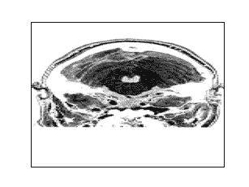
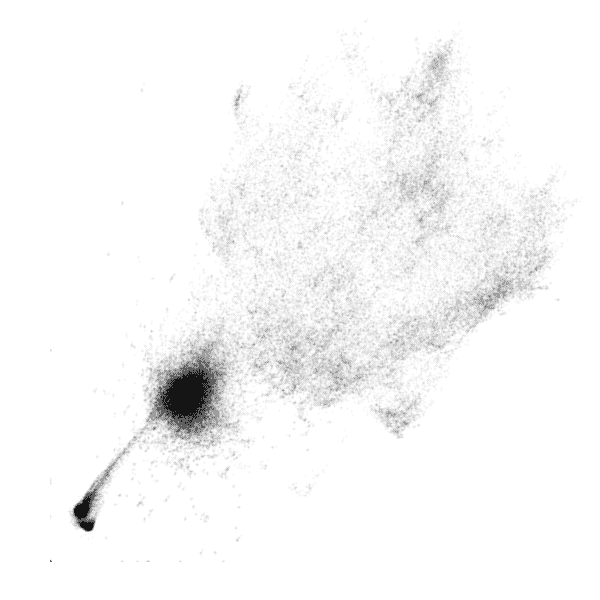
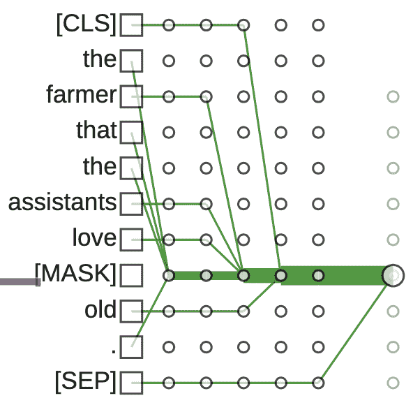

# AI 不是黑盒（相对而言）

> 原文：[`towardsdatascience.com/ai-is-not-a-black-box/`](https://towardsdatascience.com/ai-is-not-a-black-box/)

摘要：为一般 TDS 读者撰写的观点文章。我主张 AI 在可感知的方式上比人类更透明。声称 AI 是“黑盒”的观点缺乏视角，并且与人类智能研究中存在的透明度缺乏比较，而人类智能研究在某些方面是人工智能研究的基础。

<mdspan datatext="el1749772753263" class="mdspan-comment">你，一个（假设）人类</mdspan>读者，是一个黑盒。你的思维是神秘的。我不知道你如何思考。我不知道你会做什么，也不知道你是否真诚地说话，以及你是否真诚地、无预谋地为自己的行为辩护。我们从多年的内省和与他人互动的经验中学会了理解和信任人类。但经验也告诉我们，理解局限于那些有足够相似生活背景的人，而对于那些与我们动机相反的人，信任是不必要的。

人工智能——虽然仍然神秘——与人类相比则清晰可见。我可以探测 AI 的思想和动机的等价物，并知道我得到的是真相。此外，AI 的“生活背景”等价物，即其训练数据，以及“动机”等价物，即其训练目标，大部分甚至全部是已知且可供审查和分析的。尽管我们仍然缺乏与现代 AI 系统多年的经验，但我认为不存在不透明的问题；相反，AI 系统相对于检查的相对透明性，它们的“白盒”性质，可以成为理解和信任的基础。

你可能从两个意义上听说过 AI 被称为“黑盒”：像 OpenAI 的 ChatGPT 或 Anthropic 的[Claude 这样的 AI 是黑盒](https://techcrunch.com/2025/04/24/anthropic-ceo-wants-to-open-the-black-box-of-ai-models-by-2027/)，因为你无法检查它们的代码或参数（黑盒*访问*）。在更广泛的意义上，即使你可以检查这些事物（*白盒*访问），它们在理解 AI 如何以可推广的方式运作方面也帮助不大。你可以遵循定义 ChatGPT 的每一条指令，但得到的洞察与仅仅阅读其输出并无二致，这是[中国房间](https://en.wikipedia.org/wiki/Chinese_room)论证的一个推论。然而，人的思维比即使是受限访问的 AI 更加晦涩。由于物理障碍和伦理约束限制了我们对人类思维机制的调查，以及我们对大脑结构和成分的模型不完整，人的思维更像是一个黑盒——尽管是一个有机的、碳基的、“自然”的黑盒——甚至比专有、封闭源代码的 AI 模型还要神秘。让我们比较一下当前科学告诉我们关于人类大脑内部运作和 AI 模型的信息。

图 2. fMRI 捕获的人脑体积。功能数据未显示。图像由作者提供；数据由[Pietrini 等人](https://openfmri.org/dataset/ds000105/)提供，并包含在[PPDL](https://opendatacommons.org/licenses/pddl/1-0/)下。

截至 2025 年，唯一已被[映射](https://flywire.ai/)的静态神经网络结构——即苍蝇的神经网络——其复杂性仅占人脑的一小部分。在功能上，使用[功能性磁共振成像](https://en.wikipedia.org/wiki/Functional_magnetic_resonance_imaging) (fMRI)的实验可以将神经活动精确到大脑物质大约 1mm³的体积。图 2 展示了作为 fMRI 研究一部分捕获的神经网络结构示例。所需的硬件包括价值至少 20 万美元的机器、稳定液氦的供应，以及一群非常耐心的人类，他们愿意在超导体从他们头部几英寸远的地方旋转时保持静止。虽然 fMRI 研究可以确定，例如，处理[人脸和房屋的视觉描绘与某些大脑区域相关](https://www.zora.uzh.ch/id/eprint/3224/9/haxby_science2001V.pdf)，但我们所知的关于[大脑功能的大部分内容要归功于字面上的意外](https://en.wikipedia.org/wiki/Cognitive_neuropsychology)，这些当然在伦理上不可扩展。伦理的、侵入性较小的实验方法提供了相对较低的信号与噪声比。

图 3. Gemma2-2B 的 26 层中包含 425k 个概念。动画按顺序突出显示每一层。图像和布局由作者提供；数据由 Google 提供，并包含在[CC BY](https://huggingface.co/google/gemma-scope-2b-pt-res/blob/main/LICENSE)下。

开源模型（白盒访问），包括大型语言模型（LLM），通常以（虚拟的）切片和切块（分割）以及其他比在人类身上使用最昂贵的 fMRI 机器和最锋利的手术刀更侵入性的方式进行审查——这使用的是消费级计算机游戏硬件。每个神经连接的每个比特都可以在大量输入下反复和一致地检查和记录。在这个过程中，AI 不会感到疲倦，也不会受到任何影响。这种级别的访问、控制和可重复性使我们能够从其中提取大量信号，从而可以进行精细的分析。控制 AI 观察的内容使我们能够以有用的方式将熟悉的概念与 AI 内部和外部的组件和过程联系起来：

+   将类似 fMRI 的神经活动与[conc](https://www.neuronpedia.org/gemma-2-2b/16-gemmascope-res-16k/6077)[epts](https://www.neuronpedia.org/gemma-2-2b/16-gemmascope-res-16k/6259)关联。我们可以判断一个 AI 是否在“思考”某个特定概念。我们如何能很好地判断当人类在思考某个特定概念时的情况？图 1 和图 3 是来自[GemmaScope](https://huggingface.co/google/gemma-scope)的概念渲染，该工具提供了谷歌 Gemma2 模型内部到概念的注释。

+   确定特定输入对输出的[重要性](https://arxiv.org/pdf/2305.15853)。我们可以判断一个特定部分的提示是否在产生 AI 的响应中起到了重要作用。我们能否判断人类的决定是否受到特定关注的影响？

+   将概念传递视为[通过 AI 的路径](https://arxiv.org/pdf/2005.01190)。这意味着我们可以确切地知道一个概念在神经网络中从输入词到最终输出的路径。图 4 展示了这样一个语法概念（主语-数量一致性）的路径追踪示例。我们能否对人类也做到同样的事情？

图 4。通过双向转换器（BERT）模型层传递主语-数量一致性的路径。图片由作者提供([来源](https://arxiv.org/pdf/2011.00740))。

当然，人类可以自我报告上述前两个问题的答案。你可以询问招聘经理他们在阅读你的简历时在想什么，或者是什么因素在他们的决定中起到了重要作用（或者没有）。不幸的是，人类会撒谎，他们自己也不知道自己行动的原因，或者他们自己没有意识到自己的偏见[来源](https://en.wikipedia.org/wiki/Implicit-association_test)。对于生成式 AI 也是如此，但 AI 领域的可解释性方法并不依赖于 AI 的答案，[真实](https://arxiv.org/pdf/2304.13734)，[无偏见](https://arxiv.org/pdf/2402.04489)，自我意识或其他。我们不需要信任 AI 的输出就能判断它是否在思考某个特定概念。我们实际上是从其（虚拟）神经元上粘附的探针中读取的。对于开源模型来说，这很简单，考虑到从人类那里（道德上）获取此类信息所需付出的努力，这简直可笑。

关于闭源的“黑盒访问”AI，仅从黑盒访问中就可以推断出很多信息。模型的血统和它们的一般架构都是已知的。它们的基本组件是标准的。它们也可以以远高于人类忍受的速度进行询问，并且以更可控和可重复的方式进行。在选定输入下的可重复性常常是开放访问的替代品。[模型的部分内容可以被推断](https://arxiv.org/pdf/2403.06634)或通过“蒸馏”技术复制其[语义](https://www.forbes.com/sites/siladityaray/2025/01/29/openai-believes-deepseek-distilled-its-data-for-training-heres-what-to-know-about-the-technique/)。因此，黑盒并不是理解与信任的绝对障碍，但要让 AI 更加透明，最直接的方式是允许对其整个规范的开放访问，尽管目前杰出的 AI 构建者中存在这种趋势。

人类可能是更复杂的思考机器，所以上述比较可能看起来并不公平。而且，由于我们作为人类多年的经验和与其他（假设的）人类的互动，我们更倾向于认为我们理解并可以信任人类。我们对各种 AI 的经验正在迅速增长，它们的能力也在增长。虽然表现最好的模型的大小也在增长，但它们的一般架构已经稳定。没有迹象表明我们将失去上述描述的那种对其操作的透明度，即使它们达到并随后超越人类的能力。也没有迹象表明对人类大脑的探索可能产生足以使其变得不那么神秘的突破。AI 不是——并且可能不会成为——流行的人类情绪所说的那个黑盒。

[Piotr Mardziel](https://piotr.mardziel.com/), AI 部门负责人，[RealmLabs.AI](http://realmlabs.ai).

[Sophia Merow](https://www.linkedin.com/in/sophia-merow) 和 [Saurabh Shintre](https://www.linkedin.com/in/saurabh-shintre/) 为这篇帖子做出了贡献。
