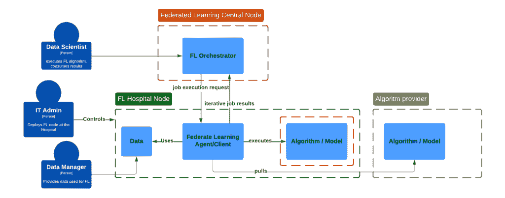
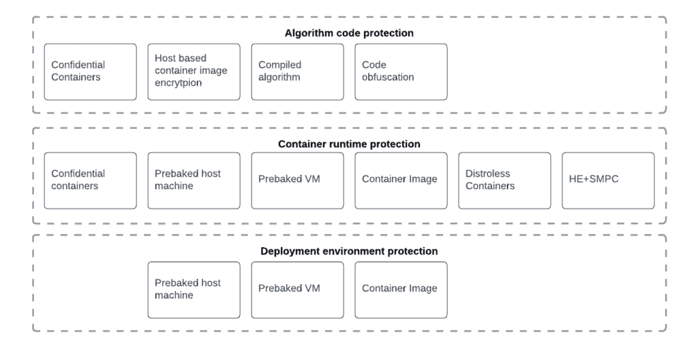
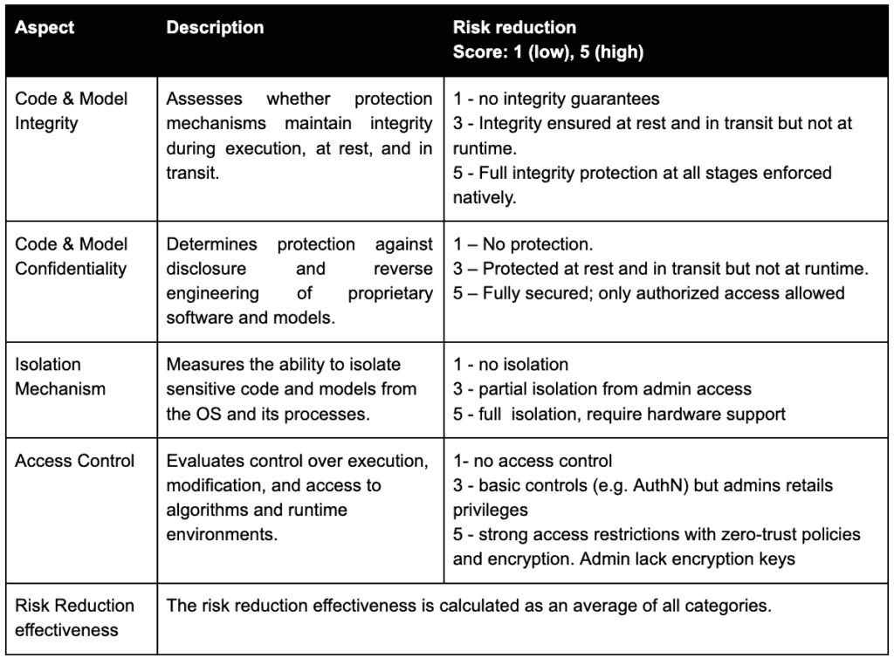
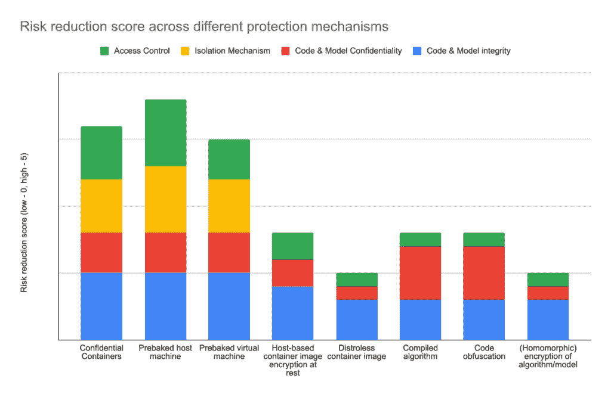

# 联邦学习环境下的算法保护

> 原文：[`towardsdatascience.com/algorithm-protection-in-the-context-of-federated-learning/`](https://towardsdatascience.com/algorithm-protection-in-the-context-of-federated-learning/)

在一家生物技术公司工作期间，我们的目标是推进机器学习（ML）和人工智能（AI）算法，例如，使脑部损伤分割能够在患者数据所在的医院/诊所位置执行，以确保以安全的方式进行处理。本质上，这是由我们已在众多现实世界医院环境中采用的联邦学习机制所保证的。然而，当算法被视为公司资产时，我们还需要保护手段，不仅保护敏感数据，还要在异构联邦环境中保护算法的安全。

图 1 高级工作流程和攻击面。图由作者提供

大多数算法都假设封装在兼容 Docker 的容器中，允许它们独立使用不同的库和运行时。假设存在第三方 IT 管理员，他们旨在保护患者数据并锁定部署环境，使其对算法提供商不可访问。这种观点描述了旨在打包和保护容器化工作负载，防止本地系统管理员窃取知识产权的不同机制。

为了确保全面的方法，我们将针对三个关键层面对保护措施进行讨论：

+   **算法代码保护：** 采取措施保护算法代码，防止未经授权的访问或逆向工程。

+   **运行时环境：** 评估管理员在容器化系统中访问机密数据的风险。

+   **部署环境：** 基础设施保护防止未经授权的系统管理员访问。

图 2 不同的保护层。图由作者提供

## 方法论

在分析风险后，我们确定了两种保护措施类别：

+   知识产权盗窃和未经授权的分发：防止管理员用户访问、复制、执行算法。

+   逆向工程风险降低：阻止管理员用户分析代码以揭露并声称所有权。

在理解这种评估的主观性时，我们考虑了所有机制的所有定性和定量特征。

## 定性评估

在选择合适的解决方案时考虑了以下类别，并在总结中进行了考虑：

+   硬件依赖性：在联邦系统中可能出现的锁定和可扩展性挑战。

+   软件依赖性：反映成熟度和长期稳定性

+   硬件和软件依赖性：设置复杂性、部署和维护工作量

+   云依赖性：与单一云管理程序的锁定风险

+   医疗环境：评估技术成熟度和异构硬件配置要求。

+   成本：涵盖专用硬件、实施和维护

## 定量评估

主观风险降低定量评估描述：

考虑上述方法和评估标准，我们制定了一份机制清单，这些机制有可能保证目标。

## 机密容器

机密容器（CoCo）是一种新兴的 CNCF 技术，旨在提供机密运行时环境，该环境将运行 CPU 和 GPU 工作负载，同时保护托管公司的算法代码和数据。

CoCo 支持多种 TEE，包括 Intel TDX/SGX 和 AMD SEV 硬件技术，以及 Nvidia GPU 操作符的扩展，这些技术在其执行期间使用硬件支持的代码和数据保护，防止有决心的和熟练的本地管理员使用本地调试器转储容器内存内容，并访问正在处理算法和数据。

通过对运行时环境和执行代码的加密证明来建立信任。它确保代码没有被篡改或被远程管理员读取。

这似乎是我们问题的完美解决方案，因为远程数据站点管理员无法访问算法代码。不幸的是，尽管持续努力，CoCo 软件栈的当前状态仍然存在安全漏洞，允许恶意管理员为自己颁发证明并有效地绕过所有其他保护机制，使它们实际上变得毫无用处。每次技术接近实际生产准备时，都会发现新的基本安全问题需要解决。值得注意的是，这个社区在沟通差距方面相当透明。

TEEs 和 CoCo（专用硬件、配置负担、加密导致的运行时开销）经常和合理地被认为引入了额外的复杂性，如果这项技术实现了其代码保护承诺，这种复杂性是合理的。虽然 TEE 似乎得到了很好的采用，但 CoCo 接近但尚未达到，根据我们的经验，地平线一直在移动，因为发现了新的基本漏洞需要解决。

换句话说，如果我们有现成的 CoCo，它就会是我们问题的解决方案。

## 静止状态下的基于主机的容器镜像加密（静止和传输保护）

这种策略基于包含算法的容器镜像的端到端保护。

它保护算法在静止和传输状态下的源代码，但在运行时并不保护，因为容器在执行前需要解密。

网站上的恶意管理员可以直接或间接访问解密密钥，因此他可以在执行时间解密容器内容后读取容器内容。

另一种攻击场景是将调试器附加到正在运行的容器镜像上。

因此，基于主机的静态容器镜像加密使得从存储设备中窃取算法和在传输过程中由于加密而变得更加困难，但具有一定技能的管理员可以解密并暴露算法。

在我们看来，管理员从容器中解密算法（时间、努力、技能集、基础设施）的实践努力增加得太低，以至于不能被视为有效的算法保护机制。

## 预配置自定义虚拟机

在这种情况下，算法所有者正在交付一个加密的虚拟机。

密钥可以在启动时通过除管理员之外的其他人从键盘添加（每次重启都需要），从外部存储（USB 密钥，非常脆弱，因为任何具有物理访问权限的人都可以附加密钥存储），或使用远程 SSH 会话（例如使用[Dropbear](https://github.com/mkj/dropbear)）而不允许本地管理员解锁引导加载程序和磁盘。

可以使用像 LUKS 这样的有效和成熟的技术来完全加密本地虚拟机文件系统，包括引导加载程序。

然而，即使远程密钥是通过除恶意管理员之外的其他人通过引导级别的微型 SSH 会话提供的，运行时仍然会暴露于虚拟机管理程序级别的调试器攻击，因为启动后，虚拟机内存被解密并可以扫描代码和数据。

尽管如此，这种解决方案，特别是通过算法所有者远程提供的密钥，与加密容器相比，显著提高了算法代码的保护程度，因为攻击需要比仅使用解密密钥解密容器镜像更多的技能和决心。

为了防止内存转储分析，我们考虑在启动时部署一个预配置的主机机器，其中包含具有 ssh 密钥的主机，这消除了对内存的任何虚拟机管理程序级别的访问。作为旁注，有方法可以将物理内存模块冻结以延迟数据丢失。

## 无发行版容器镜像

无发行版容器镜像将运行算法所需的最小层和组件数量减少到最低。

攻击面大大减少，因为组件数量减少，这些组件容易受到漏洞和已知攻击的影响。它们在存储、网络传输和延迟方面也更轻。

然而，尽管有这些改进，算法代码仍然没有得到任何保护。

无发行版的容器被推荐为更安全的容器，但不是保护算法的容器，因为算法就在那里，容器镜像可以轻易挂载，算法可以在不费很大力气的情况下被窃取。

作为无发行版的容器，这并没有解决我们保护算法代码的目标。

## 编译算法

大多数机器学习算法是用 Python 编写的。这种解释型语言不仅使得在其它机器和环境中执行算法代码变得非常容易，而且可以访问源代码并能够修改算法。

这种潜在的场景甚至使得窃取算法代码的一方可以修改它，比如说 30%或更多的源代码，并声称它不再是原始算法，甚至可能使法律诉讼的举证变得更为困难。

编译型语言，如 C、C++、Rust，当与强大的编译器优化（例如 C 中的-O3 优化）结合使用时，不仅使得源代码不可用，而且使得逆向工程源代码变得更加困难。

编译器优化引入了显著的控制流变化、数学运算替换、函数内联、代码重构和难以追踪的堆栈。

这使得逆向工程代码变得更加困难，在某些场景下实际上不可行，因此可以将其视为与纯 Python 代码相比，通过数量级增加逆向工程攻击成本的方法。

由于大多数算法是用 Python 编写的，并且需要转换为 C、C++或 Rust，因此增加了复杂性和技能差距。

这种选择确实增加了算法进一步开发以及修改以声称其所有权的成本，但它并不能阻止算法在约定的合同范围之外执行。

## 代码混淆

建立的技术使得代码的可读性大大降低，理解和发展更加困难，可以用来使算法演变更加困难。

不幸的是，它并不能阻止算法在合同范围之外执行。

此外，去混淆技术正在变得越来越好，多亏了高级语言模型，降低了代码混淆的实际效果。

代码混淆确实增加了算法逆向工程的实际成本，因此将其作为与其他选项（例如，与编译代码和自定义虚拟机）结合的选项是值得考虑的。

## 同态加密作为代码保护机制

同态加密（HE）是一种旨在保护数据的承诺技术，在联邦学习和分析场景中，其部分结果的加密聚合策略非常有趣。

聚合方（信任有限）只能处理加密数据并执行加密聚合，然后它可以解密聚合结果，而无法解密任何单个数据。

由于其复杂性、性能影响、支持的运算数量有限，HE 的实际应用受到限制，尽管有可观察的进展（包括 HE 的 GPU 加速），但它仍然是一种利基和新兴的数据保护技术。

从算法保护目标的角度来看，HE（同态加密）既没有设计成，也无法被设计成保护算法。因此，它根本不是一种算法保护机制。

## 结论

图 3 风险降低分数，图片由作者提供

从本质上讲，我们描述并评估了在部署医疗算法以及在可能不受信任的环境中运行它们的情况下，保护算法知识产权和敏感数据的策略和技术。

可见，最有前景的技术是那些提供一定程度硬件隔离的技术。然而，这些技术使得算法提供商完全依赖于将要部署的运行时。虽然编译和混淆不能完全减轻知识产权盗窃的风险，尤其是即使是基本的 LLM（大型语言模型）似乎也有帮助，但这些方法，尤其是当结合使用时，使得算法非常难以使用和修改代码，这本身就已经提供了一定程度的安全性。

预先配置的主机/虚拟机是最常见和被广泛采用的方法，扩展了诸如通过 SSH 在启动期间获取密钥的全盘加密等功能，这可能会让本地管理员难以访问任何数据。然而，特别是预先配置的机器可能会在医院引起某些合规性问题，这需要在建立联邦网络之前进行评估。

关键硬件和软件供应商（英特尔、AMD、英伟达、微软、红帽）认识到显著的需求并持续发展，这预示着在不泄露患者数据的情况下，以联邦方式训练受知识产权保护的算法将很快成为可能。然而，硬件支持的方法对医院内部基础设施非常敏感，而医院内部基础设施本质上相当异构。因此，容器化提供了一些可移植性的希望。考虑到这一点，合作者提供的 Confidential Containers 技术似乎是一个非常有吸引力的承诺，尽管它尚未完全准备好投入生产。

当然，结合上述机制、代码、运行时和基础设施环境，并辅以适当的法律框架可以降低残余风险，然而没有任何解决方案能够提供绝对的保护，尤其是针对拥有特权访问权限的坚定对手——这些措施的综合效果为知识产权盗窃设置了实质性的障碍。

我们非常重视并珍视来自社区的反馈，这有助于进一步引导未来的努力，以开发可持续、安全且有效的方法来加速人工智能的开发和部署。共同合作，我们可以应对这些挑战，取得突破性的进展，确保在各种环境中都有稳健的安全性和合规性。

*贡献：作者想感谢 [Jacek Chmiel](https://www.linkedin.com/in/jacekchmiel/), [Peter Fernana Richie](https://www.linkedin.com/in/peter-fernana-ritchie/), [Vitor Gouveia](https://www.linkedin.com/in/vgouveia/) 以及 [Roche](http://roche.com/) 的联邦开放式科学团队，他们提供了头脑风暴、实用导向的解决方案思维和贡献。*

### 链接与资源

[英特尔保密容器指南](https://cc-enabling.trustedservices.intel.com/intel-confidential-containers-guide/01/introduction/index.html)

英伟达博客描述了与 CoCo [Confidential Containers Github](https://github.com/confidential-containers) 和 [Kata Agent Policies](https://github.com/kata-containers/kata-containers/blob/main/docs/how-to/how-to-use-the-kata-agent-policy.md) 的集成

商业供应商：[Edgeless systems contrast](https://www.edgeless.systems/products/contrast), [Redhat](https://www.redhat.com/en/blog/introducing-confidential-containers-bare-metal) 和 [Azure](https://learn.microsoft.com/en-us/azure/aks/confidential-containers-overview)

[远程解锁 LUKS 加密磁盘](https://www.cyberciti.biz/security/how-to-unlock-luks-using-dropbear-ssh-keys-remotely-in-linux/)

[完美匹配以提升隐私增强型医疗数据分析](https://towardsdatascience.com/omop-datashield-a-perfect-match-to-elevate-privacy-enhancing-healthcare-analytics-041b425d532a/)

[医疗数据中的差分隐私和联邦学习](https://towardsdatascience.com/differential-privacy-and-federated-learning-for-medical-data-0f2437d6ece9/)
