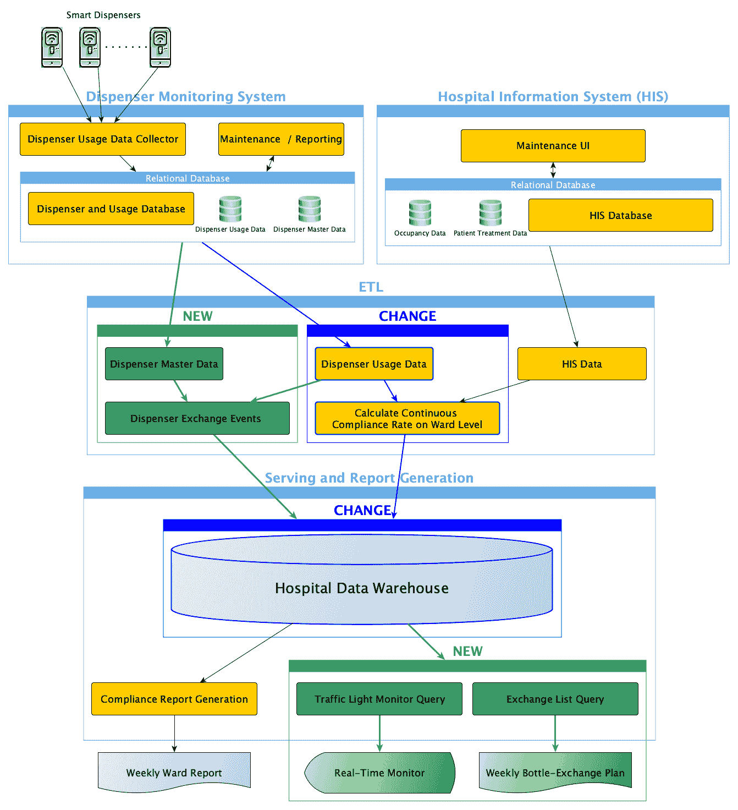
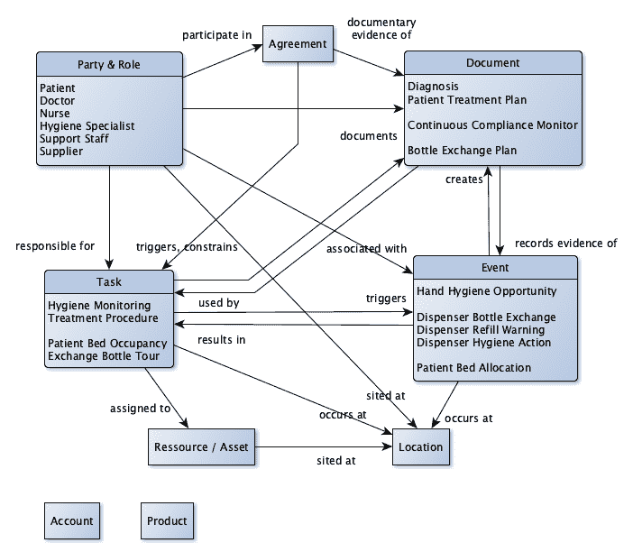
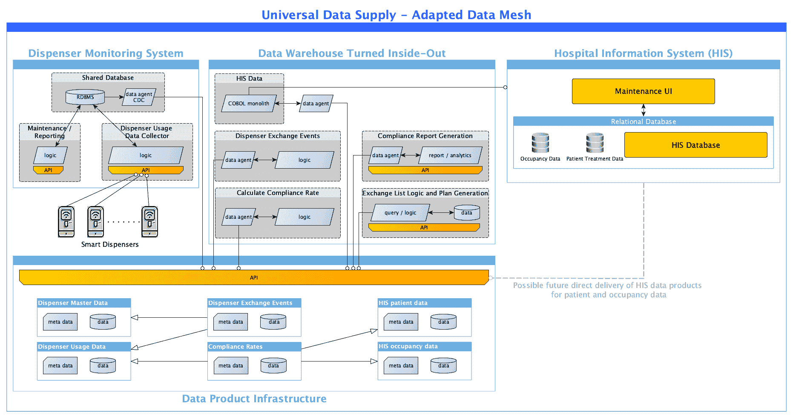

# 对齐您的数据架构以实现通用数据供应

> 原文：[`towardsdatascience.com/align-your-data-architecture-for-universal-data-supply-656349c9ae66/`](https://towardsdatascience.com/align-your-data-architecture-for-universal-data-supply-656349c9ae66/)

由[Simone Hutsch](https://unsplash.com/@heysupersimi?utm_source=medium&utm_medium=referral)在[Unsplash](https://unsplash.com?utm_source=medium&utm_medium=referral)上的照片

现在我们已经了解了业务需求，我们需要检查当前的数据架构是否支持它们。

> 如果您想知道我们数据架构中要评估的内容以及当前设置的情况，请查看[业务案例描述](https://medium.com/towards-data-science/universal-data-supply-know-your-business-9ed8a80a0224)。

· 针对短期需求的评估 ∘ 初始对齐方法 · 中期需求和长期愿景 · 逐步转换 ∘ 敏捷需要一些前瞻性 ∘ 构建您的业务流程和信息模型 ∘ 全面挑战您的架构 ∘ 解耦和演进

## 针对短期需求的评估

让我们回顾一下短期需求：

1.  **带有自动化合规监控的即时反馈**：及时向员工提供合规性反馈，以有效强化手卫生实践。在近乎实时的情况下计算合规率，并使用简单的交通灯可视化在病房监控器上显示。

1.  **设备可用性和维护**：确保分配器始终处于功能状态，并通过近乎实时的跟踪进行补充，以避免因分配器空缺而导致的合规性失败。

当前的每周批量 ETL 流程显然无法提供即时反馈。

然而，我们可以尽可能减少批量运行时间并持续循环。为了近乎实时反馈，我们还需要持续运行查询以获取最新的合规率报告。

这两个技术要求都具有挑战性。来自 HIS 的每周批量流程处理大量数据，无法调整以在几秒钟内运行。如果保持当前模型，该模型优化用于跟踪历史数据，持续监控也会对数据仓库造成沉重负担。

在我们深入解决此问题之前，让我们也检查第二个需求。

智能分配器可以装载各种尺寸的瓶子，在*分配器主数据*中进行跟踪。为了计算当前的填充水平，我们从初始体积中减去已分配的总量。每次更换瓶子时，填充水平应重置到初始体积。为了支持这一点，分配器制造商已宣布将在未来版本中实施两个新事件：

+   分配器将自动跟踪其填充水平，并在达到可配置的低点时发送 *补充警告*。此阈值基于瓶子空前的估计时间（*剩余故障时间*）。

+   当分配器的瓶子被更换时，它将发送 *瓶子交换事件*。

然而，这些改进的设备大约需要 12 个月才能可用。作为权宜之计，当前的 ETL 流程需要更新以执行所需的计算并生成事件。

需要基于这些事件生成一份新报告，以通知支持人员哪些分配器需要及时更换瓶子。在中型医院（200-500 个分配器）中，重症监护室每月大约使用 2 升消毒剂。这意味着大约有 19 个分配器需要在支持人员的每周交换计划中补充。

由于分配器使用情况在各个病房之间差异很大，需要更换瓶子的位置遍布整个医院。支持人员希望收到按最佳路线组织好的瓶子交换清单。

### 初始对齐方法

遵循“永不更改运行中的系统”的原则，我们可以尽可能多地重用组件以最小化更改。

实施短期要求的初始想法——作者图片

我们将不得不构建新的组件（绿色部分）并更改现有的组件（深蓝色部分）以支持新的要求。

我们知道批处理需要替换为流处理以实现近实时反馈。我们考虑使用 [变更数据捕获 (CDC)](https://en.wikipedia.org/wiki/Change_data_capture) 技术从内部关系型数据库获取分配器使用情况的更新。然而，对 *分配器监控系统* 的测试显示，*分配器使用数据收集器* 每隔 5 分钟才更新数据库。为了简化问题，我们决定重新安排每周的批处理提取过程，以与监控系统的 5 分钟更新周期同步。

通过减少批处理运行时间并持续循环，我们有效地创建了一个支持流处理的微批处理。更多详情，请参阅我的关于 [如何统一批处理和流处理](https://towardsdatascience.com/batch-and-streaming-demystified-for-unification-dee0b48f921d) 的文章。

由于涉及大量数据，减少 *HIS 数据* ETL 批处理过程的运行时间是主要挑战。我们可以将患者和占用数据从其他 *HIS 数据* 中解耦，但 *HIS 数据库* 提取过程是一个复杂、长期被忽视的 COBOL 程序，没有人敢修改。提取逻辑深深埋藏在 COBOL 单块中，对源系统的了解有限。因此，我们认为在 HIS 中实现患者和占用数据的近实时提取是“不可行的”。

相反，我们计划调整*合规率计算*，以便将几乎实时的*分配器使用数据*与仍每周更新的*HIS 数据*相结合。在与卫生专家讨论后，我们同意患者治疗和入住率的变化率较低，表明整个星期情况将相对稳定。

*病房级别的持续合规率*将存储在实时分区中，与数据仓库的病房实体相关联。它将支持新的*交通灯监控查询*的短期运行时间，该查询作为相应 ETL 批处理过程的后续安排。

因此，监控器将每 5 分钟更新一次，这似乎足够接近实时。新的*交换列表查询*将按周安排，以创建*每周瓶装交换计划*，通过电子邮件发送给支持人员。

我们有信心这足以满足短期需求。

## 中期需求和长期愿景

然而，在我们开始迅速实施短期解决方案之前，我们也应该审视中期和长期愿景。让我们回顾一下确定的需求：

1.  **细粒度数据洞察**：超越汇总报告，在更具体级别（例如，按班次或甚至个人）了解合规性。

1.  **非合规行动的可操作警报**：利用历史数据与几乎实时的扩展监控数据相结合，使系统能够立即通知工作人员遗漏的卫生行动，理想情况下由医疗保健工作者个性化。

1.  **个性化合规仪表板**：创建个性化的仪表板，显示每个工作人员的合规历史、改进机会和基准。

1.  **与智能可穿戴设备的集成**：利用可穿戴技术直接向医疗保健工作者提供实时和隐蔽的反馈，支持护理点的合规性。

这些长期愿景突出了显著提高实时处理能力的需求。它们还强调了在更细粒度级别处理数据和使用智能处理以获得个性化见解的重要性。处理个性化信息会引发必须妥善解决的安全问题。最后，我们需要无缝集成先进的监控设备和智能可穿戴设备，以安全、隐蔽和及时地接收个性化信息。

这导致了一系列对我们当前架构的额外挑战。

但挑战不仅限于卫生监控的要求；医院也即将被一家大型私营医院运营商接管。

这意味着当前的 HIS 必须集成到一个更大的系统中，该系统将覆盖 30 家医院。目标是扩展卫生分配器的先进监控功能，以便新运营商网络中的其他医院也能从中受益。作为一个长期愿景，他们希望监控功能能够无缝集成到他们的全球 HIS 中。

另一个挑战是规划分配器制造商宣布的创新。通过关于剩余故障时间、加注警告和瓶子交换事件的持续讨论，我们知道制造商愿意启用*分配器使用数据*的实时流。这将允许数据直接发送给消费者，绕过当前通过关系数据库的 5 分钟批量处理过程。

## 逐步转换

我们希望通过逐步转型来应对我们架构面临的巨大挑战。

由于我们已经了解到敏捷工作是有益的，我们希望从最初的想法开始，然后在后续步骤中逐步完善系统。

但这真的是敏捷工作吗？

### 灵活性需要一定的远见

我经常遇到的情况是，人们将“以小步骤行动”等同于敏捷工作。虽然我们确实希望逐步进化我们的架构，但每一步都应该以长期目标为方向。

如果我们将我们的进化限制在当前 IT 架构能够提供的内容上，我们可能不会朝着真正需要的方向发展。

当我们开发最初的协调时，我们只是根据如何在现有架构的约束下实施第一步进行推理。然而，这种方法使我们的视野局限于当前设置中什么是“可行的”。

因此，让我们尝试相反的方法，并明确指出所需的内容，包括长期需求。只有这样，我们才能将下一步的目标定位在正确的架构方向上。

对于架构决策，我们不需要使用业务流程模型和符号（BPMN）等标准详细说明业务流程的每个方面。我们只需要对流程和信息流有一个高级理解。

但正确的详细程度是什么，使我们能够做出进化架构决策？

### 构建你的业务流程和信息模型

让我们从很高的起点开始，找出正确的水平。

在我的关于数据网格挑战和解决方案系列的第三部分中，我在[`medium.com/towards-data-science/challenges-and-solutions-in-data-mesh-part-3-dacb917f3c91`](https://medium.com/towards-data-science/challenges-and-solutions-in-data-mesh-part-3-dacb917f3c91)中概述了一种基于**建模模式**的方法，用于建模本体或企业数据模型。让我们将这种方法应用到我们的示例中。

***注意：*** 在本文中，我们无法为医疗保健行业创建一个完整的本体。然而，我们可以将这种方法应用于与我们示例相关的小子主题。

* * *

让我们确定与我们示例相关的明显**建模模式**：

*当事人 & 角色:* 在我们的医疗保健示例中，涉及的当事人包括患者、医疗设备供应商、医疗保健专业人员（医生、护士、卫生专家等）、医院运营商、支持人员和医院作为一个组织单位。

*位置:* 医院建筑地址、病房、楼层、实验室、手术室等。

*资源 / 资产:* 医院作为建筑，我们的智能分配器等医疗设备等。

*文件:* 代表患者信息（如诊断、书面协议、治疗方案等）的各种文件。

*事件:* 我们已经确定了与分配器相关的事件，如瓶装交换和补充警告，以及与医疗保健实践者相关的活动，如识别手卫生机会或时刻。

*任务:* 从医生的患者治疗计划中，我们可以直接推导出医疗工作者需要执行的过程或活动。监控这些过程是提供医疗保健服务的许多信息需求之一。

* * *

以下高级建模模式可能在我们示例的医疗保健设置中一开始并不明显：

*产品:* 虽然我们可能不会将医院视为以产品为导向，但它们确实提供诊断或患者治疗等服务。如果提供药品、供应品和医疗设备，我们甚至可以谈论典型的产品。一个更好的整体术语可能是“健康保健服务”。

*协议:* 不仅包括提供者网络与供应商之间的协议，用于购买医疗产品和药品，还包括患者与医生之间的协议。

*账户:* 我们的主要用例是关注通过密切监控和教育员工来维护最佳卫生实践。我们在这里并不专注于会计方面。然而，一般会计以及索赔管理和支付结算是非常重要的医疗保健业务流程。因此，医院信息系统（HIS）的大部分内容都涉及会计。

让我们用这些高级建模模式和它们之间的关系来可视化我们的用例。

来自医疗保健行业的示例，用高级建模模式说明 – 图片由作者提供

这能给我们带来什么？

使用这个高级模型，我们可以将“卫生监控”识别为一个整体业务流程，以观察患者护理并采取适当的行动，以尽可能最佳地预防与护理相关的感染。

我们将“患者管理”视为一个整体过程，用于管理和跟踪与医生制定的医疗保健计划相关的所有患者护理活动。

我们认识到“医院管理”这一概念，它组织着像医院病房这样的资产，以及所有内部医疗设备和仪器。患者和工作人员会占用和使用这些资产，并且这种使用需要得到管理。

让我们描述一些流程：

+   **医生**记录从**患者**检查中得出的**诊断**。

+   **医生**与**患者**讨论推导出的**诊断**，并在**患者治疗计划**中记录与**患者**就推荐治疗达成一致的所有内容。

+   **治疗协议**触发**治疗程序**，并反映了**医生**和**护士**对患者治疗的责任。

+   负责**患者床位占用**的**护士**将在病房分配患者床位，这会触发**患者床位分配**。

+   负责患者治疗的**护士**从患者那里抽取血样，并触发由**卫生监测**检测到的几个**手卫生机会**和**分配器卫生行动**。

+   **卫生监测**从**分配器卫生行动、手卫生机会、患者床位分配**信息中计算合规性，并将其记录在**持续合规监控器**中。

+   在一周内进行的**分配器卫生行动**会导致**卫生监测**触发**分配器补充警告**。

+   负责**卫生监测**的**卫生专家**从累积的**分配器补充警告**中编制每周的**瓶交换计划**。

+   负责每周**交换瓶巡检**的**支持人员**接收**瓶交换计划**，并在为受影响的分配器更换空瓶时触发**分配器瓶交换**事件。

+   等等 …

这样我们就能获得业务的整体功能视图。这个视图完全独立于我们将选择的实际实现业务需求的架构风格。

因此，一个高级的业务流程和信息模型是讨论任何与医疗从业者相关的用例的完美工具。

### 全方位挑战你的架构

在对业务有如此透彻的理解之后，我们可以更全面地挑战我们的架构。我们今天已经理解和知道的一切都可以，并且应该被用来推动我们向目标架构的下一步迈进。

让我们来看看为什么我们的初始架构方法未能充分支持所有已识别的需求：

+   **近实时处理仅部分解决**

传统的数据仓库架构并不是近实时处理的理想架构方法。在我们的例子中，长时间运行的**HIS 数据**提取过程是一个面向批次的单体，无法调整以支持低延迟需求。

我们可以将单体拆分为独立的提取过程，但为了真正使所有相关应用程序能够实现近实时处理，我们需要重新思考我们在应用程序之间共享数据的方式。

作为数据工程师，我们应该创建抽象，使应用程序开发者从低级数据处理决策中解脱出来。他们既不需要考虑是否需要选择批处理或流处理风格，也不需要知道如何实际在技术上实现这一点。

如果我们允许应用程序开发者独立于这些技术数据细节实现所需的企业逻辑，这将极大地简化他们的工作。

你可以在我的关于[统一批处理和流处理](https://towardsdatascience.com/batch-and-streaming-demystified-for-unification-dee0b48f921d)的文章中了解更多关于如何实际实施这些内容的细节。

+   **初始对齐是由技术驱动的，而不是由业务驱动的**

企业需求应该驱动 IT 架构决策。如果我们视而不见，将需求软化到“可行”的程度，我们就允许技术驱动这个过程。

与卫生专家关于患者治疗和占用率变化率低的讨论是这样的需求软化。我们知道在周内会有状态变化的情况，但我们接受稳定性的假设以保持当前的 IT 架构。

即使我们不能立即改变整个架构，我们也应该朝着正确的方向迈出步伐。即使我们无法立即使所有应用程序都支持近实时处理，我们也应该采取行动来创建支持它的支持。

+   **智能设备、标准操作系统（HIS）和高级监控需要无缝集成**

长期愿景是将监控功能与现有的 HIS（医院信息系统）功能无缝集成。这包括集成各种新的（子）系统和新的技术设备，这些对于医院运营至关重要。

在一个单方面专注于分析处理的架构中，我们无法充分解决这些横切需求。我们需要找到方法，使系统中的所有未来参与者之间能够实现灵活的数据流动。每个应用程序或系统组件都需要连接到我们的数据网，而无需改变该组件本身。

总体而言，我们可以断言，初始架构变更计划不会是朝着这种灵活集成方法的针对性步骤。

### 解耦和演进

为了确保每一步都有效地朝着我们的目标架构迈进，我们需要对当前架构组件进行平衡解耦。

因此，通用数据供应定义了数据交换的抽象“数据作为产品”，适用于任何类型的应用程序之间的数据交换。为了使当前应用程序能够创建“数据作为产品”而无需完全重新设计，我们使用“数据代理”来（重新）将数据流从应用程序导向数据网。

> [**现代数据与应用工程打破业务上下文丢失**](https://towardsdatascience.com/modern-data-and-application-engineering-breaks-the-loss-of-business-context-7d0bca755adb)

通过使用这些抽象，任何应用程序也可以成为接近实时能力的。因为无论应用程序是操作平面还是分析平面的一部分，预期的操作 HIS 与卫生监测组件的集成都显著简化。

> [**操作和分析数据**](https://towardsdatascience.com/operational-and-analytical-data-54fc9de05330)

让我们看看解耦如何帮助，例如，将当前的数据仓库集成到网格中。

数据仓库可以被[重新定义为网格中许多应用程序之一](https://medium.com/towards-data-science/data-warehouse-redefined-f65609454a01)。例如，我们可以重新设计 ETL 组件*病房级别的持续合规率*作为一个独立的应用程序，产生*数据作为产品*抽象。如果我们不想或不能触及 ETL 逻辑本身，我们可以使用*数据代理*抽象来转换数据到目标结构。

我们可以对*分配器交换事件*或任何其他 ETL 或查询/报告组件进行同样的操作。通过实现一个数据代理，将*数据产品 HIS 占用数据*和*HIS 患者数据*分离，可以解耦 COBOL 单体*HIS 数据*。这允许数据交付组件完全独立于消费者进行演进。

当分配器供应商准备好直接创建所需的交换事件的高级功能时，我们只需更改*分配器交换事件*组件。供应商可以直接提供*数据作为产品*抽象，或者我们可以通过调整*分配器交换事件数据代理和逻辑*来转换分配器的专有数据输出。

作为适应数据网格的统一数据供应的架构对齐 - 图像由作者提供

每当我们能够直接从 HIS 创建*HIS 患者*数据或*HIS 占用*数据时，我们可以在不影响系统其他部分的情况下，部分或完全退役*HIS 数据*组件。

* * *

我们需要全面评估我们的架构，考虑所有已知业务需求。技术受限的方法可能导致中间步骤不符合所需，而只是看起来可行。

深入了解您的业务，并推导出技术无关的过程和信息模型。这些模型将促进您的业务理解，同时允许您的业务驱动您的架构。

* * *

在后续步骤中，我们将探讨更多关于如何根据这些想法设计**数据作为产品**和**数据代理**的技术细节。敬请期待更多见解！
