# 使用 Transformer 的 4 个基本计算机视觉任务的交互式指南

> 原文：[`towardsdatascience.com/an-interactive-guide-to-4-fundamental-computer-vision-tasks-using-transformers/`](https://towardsdatascience.com/an-interactive-guide-to-4-fundamental-computer-vision-tasks-using-transformers/)

## 什么是计算机视觉和视觉模型？

计算机视觉是人工智能的一个子领域，具有广泛的应用范围，专注于图像处理和理解。传统上通过卷积神经网络（CNNs）来处理，这一领域由于 Transformer 架构的出现而发生了革命。虽然 Transformer 因其语言处理应用而闻名，但它们可以有效地适应，成为许多视觉模型的核心。在本文中，我们将探讨最先进的视觉和多模态模型，例如***ViT（视觉 Transformer）、DETR（检测 Transformer）、BLIP（Boostrapping Language-Image Pretraining）和 ViLT（视觉语言 Transformer）***，它们专门从事各种计算机视觉任务，包括**图像分类、分割、图像到文本转换和视觉问答**。这些任务具有各种实际应用，从大规模标注图像、检测医学图像中的异常到从文档中提取文本以及基于视觉数据生成文本响应。

**与卷积神经网络（CNNs）的比较**

在基础模型得到广泛应用之前，卷积神经网络（CNNs）是大多数计算机视觉任务的占主导地位的解决方案。简而言之，CNNs 形成了一个由特征图、池化、线性层和全连接层组成的层次深度学习架构。相比之下，视觉 Transformer 利用了允许图像补丁相互注意的自注意力机制。它们还具有更少的归纳偏差，这意味着它们不像 CNNs 那样受特定模型假设的约束，但因此需要显著更多的训练数据才能在泛化任务上实现强大的性能。

**与大型语言模型（LLMs）的比较**

基于 Transformer 的视觉模型采用了大型语言模型（LLMs）使用的架构，并增加了额外的层，将这些图像数据转换为数值嵌入。在自然语言处理任务中，文本序列在由 Transformer 编码器消费之前会经历分词和嵌入的过程。同样，图像/视觉数据在输入到视觉 Transformer 编码器之前会经过补丁、位置编码和图像嵌入的过程。在整个文章中，我们将进一步探讨视觉 Transformer 及其变体如何建立在 Transformer 骨干之上，并从语言处理扩展到图像理解和图像生成。

**多模态模型的扩展**

视觉模型的发展推动了开发能够同时处理图像和文本数据的多模态模型的需求。虽然视觉模型专注于将图像数据单向转换为数值表示，并通常为分类或目标检测（即图像分类和图像分割任务）产生基于分数的输出，但多模态模型需要在不同数据类型之间进行双向处理和集成。例如，一个图像-文本多模态模型可以从图像输入生成连贯的文本序列，用于图像字幕和视觉问答任务。

## 4 种基本计算机视觉任务类型

### 0. 项目概述

我们将探讨这 4 个基本计算机视觉任务及其对应的针对每个任务专门设计的变换器模型的细节。这些模型主要在编码器和解码器架构上有所不同，这赋予了它们在解释、处理和翻译不同文本或视觉模态时的独特能力。

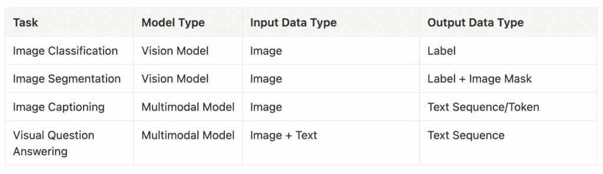

为了使本指南更具互动性，我设计了一个[Streamlit 网络应用](https://huggingface-computer-vision.streamlit.app/)来展示和比较这些计算机视觉任务和模型的输出。我们将在文章末尾介绍端到端应用开发。

下面是基于上传的图像的输出预览，显示*任务名称、输出、运行时间、模型名称、模型类型*，通过运行 Hugging Face 管道的默认模型。

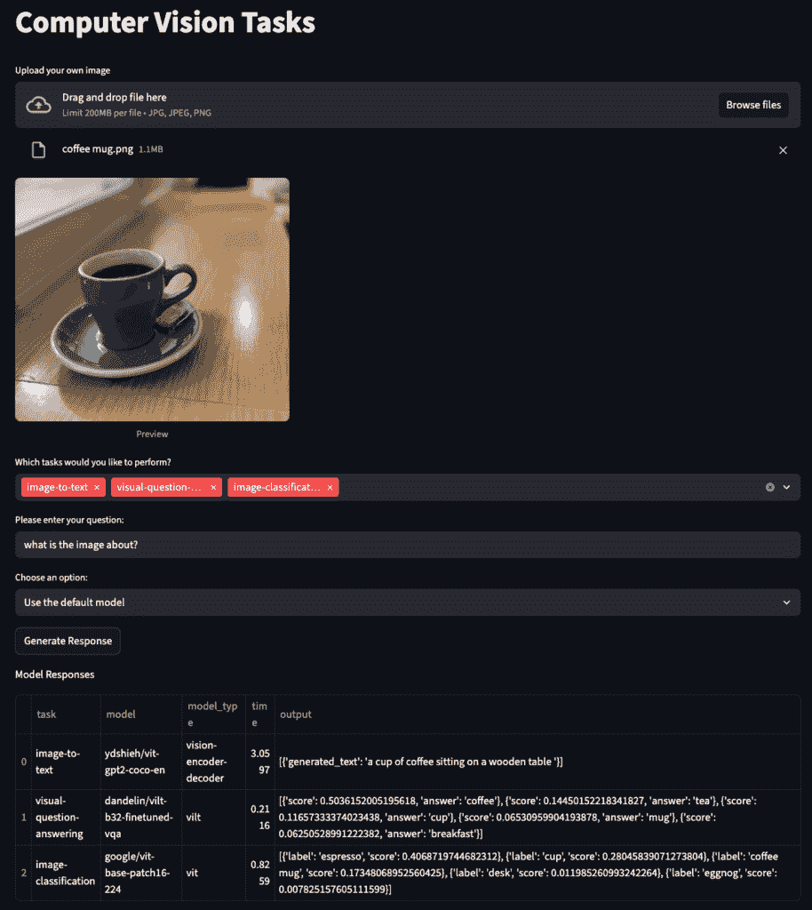

### 1. 图像分类

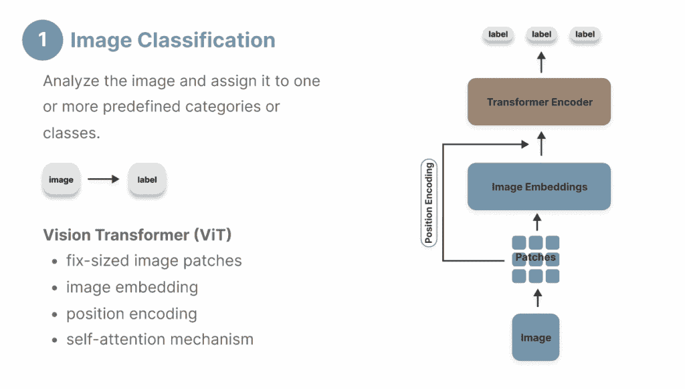

首先，让我们介绍图像分类——这是一个基本的计算机视觉任务，它将图像分配到预定义的标签集合中，这可以通过基本的视觉变换器实现。

**ViT（视觉变换器**）

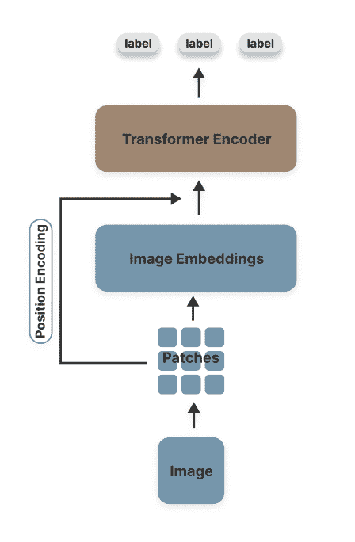

视觉变换器（ViT）是本文后面介绍的大多数计算机视觉模型的基础。它通过仅编码器的变换器架构在图像分类任务上始终优于 CNN。它处理图像输入并输出候选标签的概率分数。由于图像分类是一个纯粹的理解图像任务，没有生成要求，因此 ViT 的仅编码器架构非常适合此目的。

ViT 架构由以下组件组成：

+   分块：将输入图像分解成小而固定的像素块（通常每个块 16×16 像素），以便保留下游处理中的局部特征。

+   嵌入：将图像块转换为数值表示，也称为向量嵌入，使得具有相似特征的图像在向量空间中投影为更接近的嵌入。

+   分类标记（CLS）：从所有图像块中提取和汇总信息，形成一个数值表示，这使得它在分类中特别有效。

+   位置编码：保留原始图像像素的相对位置。CLS 标记始终位于位置 0。

+   Transformer 编码器：通过多层多头注意力和前馈网络处理嵌入。

ViT 的机制导致其在捕获全局依赖关系方面的效率，而 CNN 主要依赖于通过卷积核进行的局部处理。另一方面，ViT 的缺点是需要大量的训练数据（通常是数百万张图像）来迭代调整注意力层中的模型参数，以实现强大的性能。

如果你更喜欢视频教程，请查看我们的 YouTube 视频 🎬。

**实现**

Hugging Face 管道通过抽象底层图像处理步骤，显著简化了图像分类任务的实现。

```py
from transformers import pipeline
from PIL import Image

image = Image.open(image_url)
pipe = pipeline(task="image-classification", model=model_id)
output = pipe(image=image)
```

+   输入参数：

    +   `模型`: 当未指定`模型`参数时，你可以选择自己的模型或使用默认模型（即“google/vit-base-patch16-224”）。

    +   `任务`: 提供一个任务名称（例如“image-classification”，“image-segmentation”）

    +   `图像`: 通过 URL 或图像文件路径提供图像对象。

+   输出：模型为候选标签生成分数。

我们通过提供两个组成不同的相似图像来比较默认图像分类模型“google/vit-base-patch16-224”的结果。正如我们所见，这个基线模型很容易混淆，尽管两幅图像都包含相同的主要对象，但产生了显著不同的输出（“espresso”与“mircowave”）。

*“咖啡杯”图像输出*


```py
[
  { "label": "espresso", "score": 0.40687331557273865 },
  { "label": "cup", "score": 0.2804579734802246 },
  { "label": "coffee mug", "score": 0.17347976565361023 },
  { "label": "desk", "score": 0.01198530849069357 },
  { "label": "eggnog", "score": 0.00782513152807951 }
]
```

*“带背景的咖啡杯”图像输出*


```py
[
  { "label": "microwave, microwave oven", "score": 0.20218633115291595 },
  { "label": "dining table, board", "score": 0.14855517446994781 },
  { "label": "stove", "score": 0.1345038264989853 },
  { "label": "sliding door", "score": 0.10262308269739151 },
  { "label": "shoji", "score": 0.07306522130966187 }
]
```

尝试使用我们的 [Streamlit 网页应用](https://huggingface-computer-vision.streamlit.app/)自己尝试不同的模型，看看它是否能生成更好的结果。

### 2. 图像分割

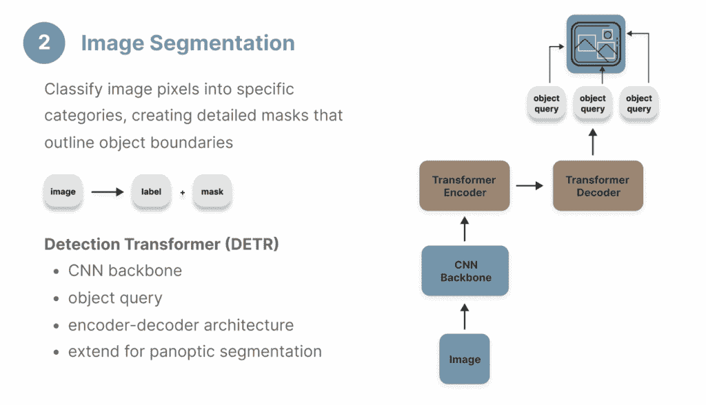

图像分割是另一种常见的计算机视觉任务，它需要一个仅视觉的模型。其目标与目标检测类似，但需要在像素级别上具有更高的精度，生成对象边界的掩码，而不是像目标检测那样绘制边界框。

主要有三种图像分割类型：

+   语义分割：预测每个对象类别的掩码。

+   实例分割：预测对象类别的每个实例的掩码。

+   全景分割：通过为每个像素分配一个对象类别及其实例来结合实例分割和语义分割。

**DETR（检测转换器）**

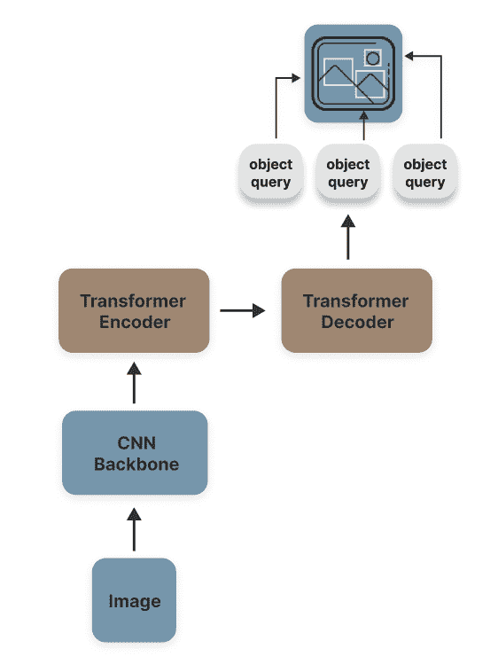

虽然 DETR 广泛用于目标检测，但它可以通过添加分割掩码头扩展到执行全景分割任务。如图表所示，它利用了编码器-解码器 Transformer 架构和 CNN 骨干网络进行特征图提取。DETR 模型学习一组对象查询，并训练预测这些查询的边界框，随后通过掩码预测头来执行精确的像素级分割。

**Mask2Former**

Mask2Former 也是图像分割任务的常见选择。由 Facebook AI Research 开发，Mask2Former 通常在精度和计算效率方面优于 DETR 模型。这是通过应用掩码注意力机制而不是全局交叉注意力来实现的，以专注于图像中的前景信息和主要对象。

**实现**

我们使用管道实现，就像图像分类一样，只需简单地将任务参数更改为“image-segmentation”。为了处理输出，我们提取对象标签和掩码，然后使用`st.image()`显示掩码图像

```py
from transformers import pipeline
from PIL import Image
import streamlit as st

image = Image.open(image_url)
pipe = pipeline(task="image-segmentation", model=model_id)
output = pipe(image=image)

output_labels = [i['label'] for i in output]
output_masks = [i['mask'] for i in output]

for m in output_masks:
		st.image(m)
```

我们比较了 DETR（“facebook/detr-resnet-50-panoptic”）和 Mask2Former（“facebook/mask2former-swin-base-coco-panoptic”）的性能，这两个模型都是在全景分割上进行微调的。如图像分割输出所示，DETR 和 Mask2Former 都成功识别并提取了“杯子”和“餐桌”。Mask2Former 的推理速度更快（2.47 秒，而 DETR 为 6.3 秒），并且还能从背景中识别出“window-other”。

*DETR “facebook/detr-resnet-50-panoptic” 输出*

```py
[
	{
		'score': 0.994395, 
		'label': 'dining table', 
		'mask': <PIL.Image.Image image mode=L size=996x886 at 0x7FAEA068D130>
	}, 
	{
		'score': 0.999692, 
		'label': 'cup', 
		'mask': <PIL.Image.Image image mode=L size=996x886 at 0x7FAEA0657290>
	}
]
```

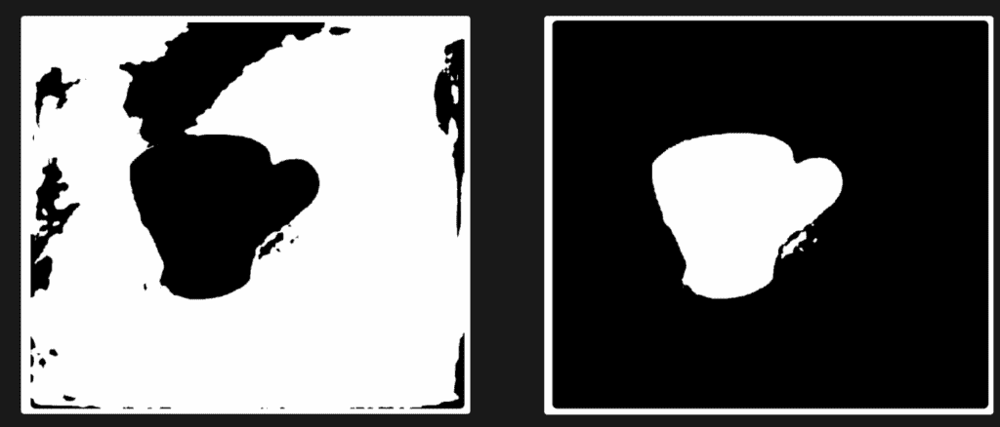

*Mask2Former “facebook/mask2former-swin-base-coco-panoptic” 输出*

```py
[
	{
		'score': 0.999554, 
		'label': 'cup', 
		'mask': <PIL.Image.Image image mode=L size=996x886 at 0x7FAEAC25BF80>
	}, 
	{
		'score': 0.971946, 
		'label': 'dining table', 
		'mask': <PIL.Image.Image image mode=L size=996x886 at 0x7FAEA6907EF0>
	}, 
	{
		'score': 0.983782, 
		'label': 'window-other', 
		'mask': <PIL.Image.Image image mode=L size=996x886 at 0x7FAF22942B40>
	}
]
```

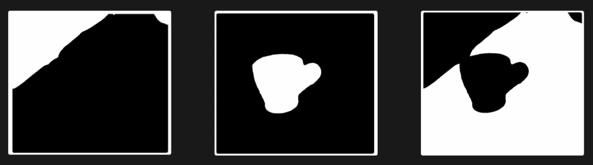

### 3. 图像描述

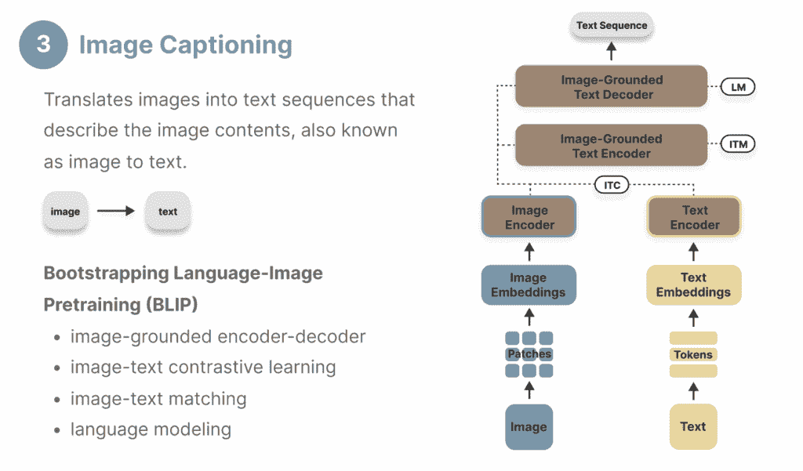

图像描述，也称为图像到文本，将图像转换为描述图像内容的文本序列。这项任务需要图像理解和文本生成的能力，因此非常适合能够同时处理图像和文本数据的跨模态模型。

**视觉编码器-解码器**

视觉编码器-解码器是一种多模态架构，它将用于图像理解的视觉模型与用于文本生成的预训练语言模型相结合。一个常见的例子是 ViT-GPT2，它将视觉 Transformer（在第一部分“图像分类”中介绍）作为视觉编码器，将 GPT-2 模型作为解码器，以执行自回归文本生成。

**BLIP (Boostrapping Language-Image Pretraining)**

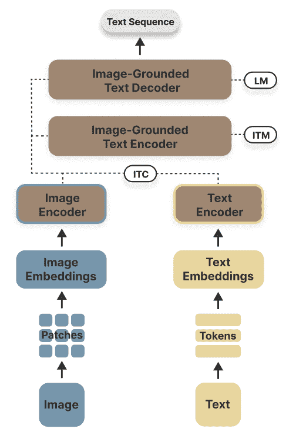

Salesforce Research 开发的 BLIP 利用了 4 个核心模块——一个图像编码器、一个文本编码器，随后是一个通过注意力机制融合视觉和文本特征的图像基础文本编码器，以及一个用于文本序列生成的图像基础文本解码器。预训练过程涉及最小化图像-文本对比损失、图像-文本匹配损失和语言建模损失，目标是使视觉信息和文本序列之间的语义关系对齐。它在应用中提供了更高的灵活性，可以用于 VQA（视觉问答），但它也引入了更多复杂性到架构设计中。

**实现**

我们使用下面的代码片段从图像字幕管道生成输出。

```py
from transformers import pipeline
from PIL import Image

image = Image.open(image_url)
pipe = pipeline(task="image-to-text", model=model_id)
output = pipe(image=image)
```

我们下面尝试了三种不同的模型，它们都能生成相当准确的图像描述，其中较大的模型比基础模型表现更好。

*视觉编码器-解码器“ydshieh/vit-gpt2-coco-en”输出*

```py
[{'generated_text': 'a cup of coffee sitting on a wooden table'}]
```

*BLIP“Salesforce/blip-image-captioning-base”输出*

```py
[{'generated_text': 'a cup of coffee on a table'}]
```

*BLIP“Salesforce/blip-image-captioning-large”输出*

```py
[{'generated_text': 'there is a cup of coffee on a saucer on a table'}]
```

### 4. 视觉问答

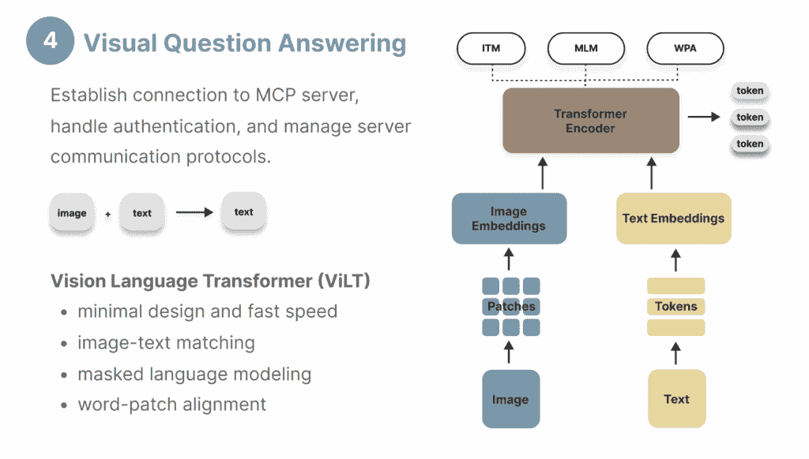

视觉问答（VQA）因其能够使用户对图像提出问题并获得连贯的文本响应而越来越受欢迎。它还需要一个多模态模型，能够从视觉数据中提取关键信息，同时也能够生成文本响应。它与图像字幕的不同之处在于，除了图像外，它还接受用户提示作为输入，因此需要一个同时解释两种模态的编码器。

**ViLT (视觉语言转换器**)

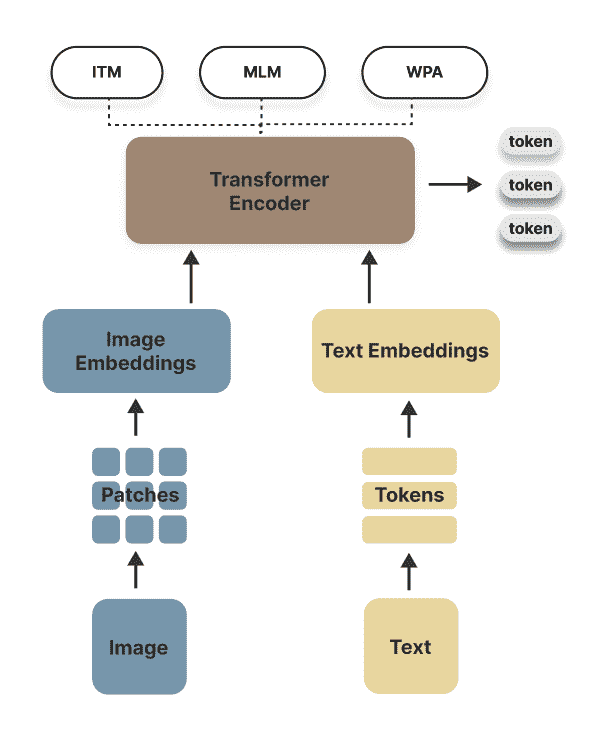

ViLT 是一个计算效率高的模型架构，用于执行 VQA 任务。ViLT 将图像补丁嵌入和文本嵌入整合到一个统一的转换器编码器中，该编码器针对三个目标进行预训练：

+   图像-文本匹配：学习图像-文本对之间的语义关系

+   掩码语言建模：学习根据文本和图像输入从词汇表中预测掩码词/标记

+   词补对齐：学习单词和图像补丁之间的关联

ViLT 采用仅编码器架构，具有特定任务的头部（例如分类头部、VQA 头部），这种最小化设计比依赖于区域监督进行对象检测和卷积架构进行特征提取的 VLP（视觉和语言预训练）模型快十倍。然而，这种简化的架构在复杂任务上导致性能次优，并且依赖于大量训练数据来实现泛化功能。如后文所示，一个缺点是 ViLT 模型为 VQA 生成基于标记的输出，而不是连贯的句子，这与具有大量候选标签的图像分类任务非常相似。

**BLIP**

如第三部分“图像标题”中所述，BLIP 是一个更广泛的模型，也可以针对执行视觉问答任务进行微调。由于其编码器-解码器架构，它生成完整的文本序列而不是标记。

**实现**

VQA 使用下面的代码片段实现，将图像和文本提示作为模型输入。

```py
from transformers import pipeline
from PIL import Image
import streamlit as st

image = Image.open(image_url)
question='describe this image'
pipe = pipeline(task="image-to-text", model=model_id, question=question)
output = pipe(image=image)
```

当比较 ViLT 和 BLIP 模型在“描述这张图片”的问题上时，由于它们不同的模型架构，输出结果差异显著。ViLT 从其现有的词汇表中预测得分最高的标记，而 BLIP 生成更连贯和合理的成果。

*ViLT “dandelin/vilt-b32-finetuned-vqa”输出*

```py
[
  { "score": 0.044245753437280655, "answer": "kitchen" },
  { "score": 0.03294338658452034, "answer": "tea" },
  { "score": 0.030773703008890152, "answer": "table" },
  { "score": 0.024886665865778923, "answer": "office" },
  { "score": 0.019653357565402985, "answer": "cup" }
]
```

*BLIP “Salesforce/blip-vqa-capfilt-large”输出*

```py
[{'answer': 'coffee cup on saucer'}]
```

* * *

## 端到端计算机视觉应用程序开发

让我们将网络应用程序开发分解为 6 个易于遵循的步骤，以便您能够轻松构建自己的交互式 Streamlit 应用程序或根据您的需求进行定制。请查看我们的[GitHub](https://github.com/destingong/computer-vision)存储库以获取端到端实现。

1. 初始化网络应用程序并配置页面布局。

```py
def initialize_page():
    """Initialize the Streamlit page configuration and layout"""
    st.set_page_config(
        page_title="Computer Vision",
        page_icon="🤖",
        layout="centered"
    )
    st.title("Computer Vision Tasks")
    content_block = st.columns(1)[0]

    return content_block
```

2. 提示用户上传图像。

```py
def get_uploaded_image():

    uploaded_file = st.file_uploader(
        "Upload your own image", 
        accept_multiple_files=False,
        type=["jpg", "jpeg", "png"]
    )
    if uploaded_file:
        image = Image.open(uploaded_file)
        st.image(image, caption='Preview', use_container_width=False)

    else:
        image = None

    return image
```

3. 使用多选下拉列表选择一个或多个计算机视觉任务（也接受用户输入的选项，例如“document-question-answering”）。如果选择“visual-question-answering”或“document-question-answering”，它将提示用户输入问题，因为这两个任务需要“问题”作为额外的输入参数。

```py
def get_selected_task():
    options = st.multiselect(
        "Which tasks would you like to perform?",
        [
            "visual-question-answering",
            "image-to-text",
            "image-classification",
            "image-segmentation",
        ],
        max_selections=4,
        accept_new_options=True,
    )

    #prompt for question input if the task is 'VQA' and 'DocVQA' - parameter "question"
    if 'visual-question-answering' in options or 'document-question-answering' in options:
        question = st.text_input(
            "Please enter your question:"
        )

    elif "Other (specify task name)" in options:
        task = st.text_input(
            "Please enter the task name:"
        )
        options = task
        question = ""

    else:
        question = ""

    return options, question
```

4. 提示用户在集成到 hugging face 管道的默认模型或输入自己的模型之间进行选择。

```py
def get_selected_model():
    options = ["Use the default model", "Use your selected HuggingFace model"]
    selected_option = st.selectbox("Choose an option:", options)
    if selected_option == "Use your selected HuggingFace model":
        model = st.text_input(
            "Please enter your selected HuggingFace model id:"
        )
    else:
        model = None

    return model
```

5. 根据用户输入的参数创建任务管道，然后收集模型输出和处理时间。结果以表格格式显示，使用`st.dataframe()`比较不同的*任务名称、输出、运行时间、模型名称和模型类型*。对于图像分割任务，分割掩码也使用`st.image()`显示。

```py
def display_results(image, task_list, user_question, model):

    results = []
    for task in task_list:
        if task in ['visual-question-answering', 'document-question-answering']:
            params = {'question': user_question}
        else:
            params = {}

        row = {
            'task': task,
        }

        try:
            model = i['model']
            row['model'] = model
            pipe = pipeline(task, model=model)

        except Exception as e:
            pipe = pipeline(task)
            row['model'] = pipe.model.name_or_path

        start_time = time.time()
        output = pipe(
            image,
            **params
        )
        execution_time = time.time() - start_time

        row['model_type'] = pipe.model.config.model_type
        row['time'] = execution_time

        # display image segentation visual output
        if task == 'image-segmentation':
            output_masks = [i['mask'] for i in output]

        row['output'] = str(output)

        results.append(row)
        results_df = pd.DataFrame(results)

    st.write('Model Responses')
    st.dataframe(results_df)

    if 'image-segmentation' in task_list:
        st.write('Segmentation Mask Output')

        for m in output_masks:
            st.image(m)

    return results_df 
```

6. 最后，使用主函数将这些函数链接在一起。使用“生成响应”按钮触发这些函数，并在应用程序中显示结果。

```py
def main():
    initialize_page()
    image = get_uploaded_image()
    task_list, user_question = get_selected_task()
    model = get_selected_model()

    # generate reponse spinning wheel
    if st.button("Generate Response", key="generate_button"):
        display_results(image, task_list, user_question, model)

# run the app
if __name__ == "__main__":
    main()
```

* * *

## 摘要信息

我们介绍了从传统的基于 CNN 的方法到转换器架构的演变，比较了视觉模型与语言模型和多模态模型。我们还探讨了 4 个基本的计算机视觉任务及其相应的技术，并提供了一个实用的 Streamlit 实现指南，以构建您自己的计算机视觉网络应用程序，以便进一步探索。

基本的计算机视觉任务和模型包括：

+   **图像分类：**分析图像并将它们分配到一个或多个预定义的类别或类别，利用如 ViT（视觉转换器）之类的模型架构。

+   **图像分割：**将图像像素分类到特定类别，创建详细的面罩，以描绘对象边界，包括 DETR 和 Mask2Former 模型架构。

+   **图像描述:** 为图像生成描述性文本，展示将视觉编码与语言生成能力相结合的模型，如视觉编码器-解码器和 BLIP。

+   **视觉问答 (VQA):** 处理图像和文本查询，基于图像内容回答开放式问题，比较如 ViLT (视觉语言转换器) 的基于标记的输出与 BLIP 的更连贯的响应等架构。
