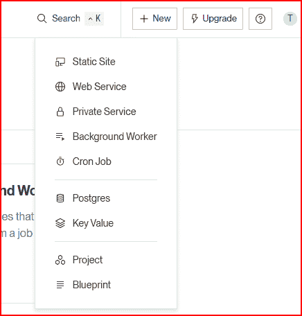
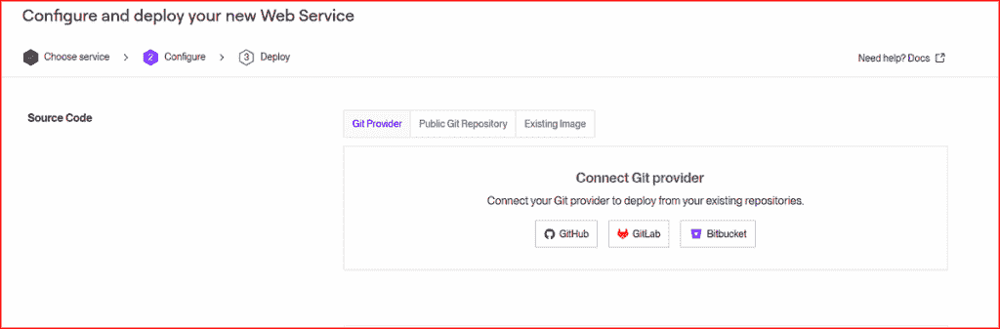
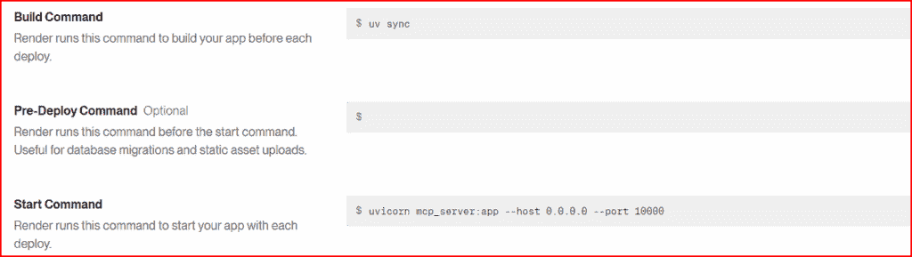

# 远程模型上下文协议服务器的介绍

> 原文：[`towardsdatascience.com/an-introduction-to-remote-model-context-protocol-servers/`](https://towardsdatascience.com/an-introduction-to-remote-model-context-protocol-servers/)

我上一次写关于模型上下文协议（MCP）是在 2024 年 12 月初，就在这个主题指数级增长到今天之前不久。我记得当时认为，为了让 MCP 成为一项颠覆性技术，MCP 客户端能够访问非本地 MCP 服务器是必须发生的关键事情之一。当然，这已经发生了，但如果你想要参与其中的一小部分呢？你该如何着手编写远程 MCP 服务器，为它制作有用的工具，测试它，然后将其部署到云端，例如，以便任何人都可以从任何支持客户端的任何地方访问它所暴露的工具？

我将在本文中向你展示如何完成所有这些事情。

## 快速回顾一下什么是 MCP 服务器

对于什么是 MCP 服务器，有数十种定义。在我看来，这可能有点过于简化，MCP 服务器使得 MCP 启用客户端，例如 Cursor 和 Claude 代码，能够调用 MCP 服务器包含的有用功能。

这和你只是编写了一堆有价值的工具并在你的代码中调用它们有什么不同？

嗯，关键是这些工具是你写的。那么，其他人编写存在的潜在工具宇宙怎么办？我确信你听说过这个表达：“……有应用可以做到这一点”。在不远的将来，那可能变成“……有 MCP 服务器可以做到这一点”。好吧，虽然不那么简洁，但同样具有开创性。

到目前为止，绝大多数 MCP 服务器都是基于 STDIO 传输类型编写的。这意味着服务器托管在你本地系统上的责任在你身上。这有时可能很棘手且容易出错。此外，只有你能访问那个服务器。这就是远程（或可流式传输的 HTTP）MCP 服务器发挥作用的地方。托管在远程，你只需要知道服务器的 URL 和它提供的工具名称，你就可以在几秒钟内启动并运行。

那么，如果你编写了其他人可能会觉得真正有用的东西，为什么不把它做成一个远程 MCP 服务器，将其托管在云端，并让其他人也能使用它呢？

好吧，让我们开始吧。

## 我的设置

我将使用 Windows 和 Microsoft Visual Studio Code 来开发 MCP 服务器及其工具的代码。我将使用 Git Bash 作为我的命令行，因为它附带了一些我将会使用的实用工具，例如**curl**和**sed**。你还需要安装**Node.js**和**uv** Python 包工具。如果你想将完成的 MCP 服务器部署到云端，你还需要在 GitHub 上存储你的代码，因此你需要一个账户。

你应该做的第一件事是为你的代码等初始化一个新的项目。使用带有 init 标志的 **uv** 工具来完成此操作。接下来，我们添加一个环境，切换到它并添加所有我们的代码将使用的外部库。

```py
$ uv init remote-mcp
Initialized project `remote-mcp` at `/home/tom/projects/remote-mcp`
$ cd remote-mcp
$ ls -al
total 28
drwxr-xr-x 3 tom tom 4096 Jun 23 17:42 .
drwxr-xr-x 14 tom tom 4096 Jun 23 17:42 ..
drwxr-xr-x 7 tom tom 4096 Jun 23 17:42 .git
-rw-r--r-- 1 tom tom 109 Jun 23 17:42 .gitignore
-rw-r--r-- 1 tom tom 5 Jun 23 17:42 .python-version
-rw-r--r-- 1 tom tom 0 Jun 23 17:42 README.md
-rw-r--r-- 1 tom tom 88 Jun 23 17:42 main.py
-rw-r--r-- 1 tom tom 156 Jun 23 17:42 pyproject.toml

$ uv venv && source .venv/bin/activate
# Now, install the libraries we will use.
(remote-mcp) $ uv add fastapi 'uvicorn[standard]' mcp-server requests yfinance python-dotenv
```

## 我们将要开发的内容

我们将开发一个 MCP 服务器以及两个不同的工具，以便我们的 MCP 服务器可以利用。第一个将是一个诺贝尔奖检查器。你提供一个年份，例如，1935 年，以及一个主题，例如，物理学，然后 MCP 服务器将返回关于该主题该年获奖者的信息。第二个工具将返回过去一周内某个城市的最高记录温度

首先，我们将编写我们的两个工具并在本地进行测试。接下来，我们将将这些工具集成到本地运行的 MCP 服务器中，并测试该配置。如果一切按预期工作，我们可以将 MCP 服务器及其工具部署到远程云服务器上，并验证其是否继续正常工作。

#### 代码示例 1— 获取诺贝尔奖信息

诺贝尔奖网站的服务受 Creative Commons zero 许可协议许可。您可以通过以下链接查看详细信息：

[`www.nobelprize.org/about/terms-of-use-for-api-nobelprize-org-and-data-nobelprize-org`](https://www.nobelprize.org/about/terms-of-use-for-api-nobelprize-org-and-data-nobelprize-org)

这里是我们将要使用的基函数。打开你的代码编辑器，并将以下内容保存到一个名为 **prize_tool.py** 的文件中。

```py
import requests
import os
import io
import csv

# from mcp.server.fastmcp import FastMCP
try:
    from mcp.server.fastmcp import FastMCP
except ModuleNotFoundError:
    # Try importing from a local path if running locally
    import sys
    sys.path.append(os.path.abspath(os.path.join(os.path.dirname(__file__), '..')))
    from fastmcp import FastMCP

mcp = FastMCP(name="nobelChecker",stateless_http=True)

@mcp.tool()
def nobel_checker(year, subject):
    """
    Finds the Nobel Prize winner(s) for a given year and subject using the Nobel Prize API.

    Args:
        year (int): The year of the prize.
        subject (str): The category of the prize (e.g., 'physics', 'chemistry', 'peace').

    Returns:
        list: A list of strings, where each string is the full name of a winner.
              Returns an empty list if no prize was awarded or if an error occurred.
    """
    BASE_URL = "http://api.nobelprize.org/v1/prize.csv"

    # Prepare the parameters for the request, converting subject to lowercase
    # to match the API's expectation.
    params = {
        'year': year,
        'category': subject.lower()
    }

    try:
        # Make the request using the safe 'params' argument
        response = requests.get(BASE_URL, params=params)

        # This will raise an exception for bad status codes (like 404 or 500)
        response.raise_for_status()

        # If the API returns no data (e.g., no prize that year), the text will
        # often just be the header row. We check if there's more than one line.
        if len(response.text.splitlines()) <= 1:
            return [] # No winners found

        # Use io.StringIO to treat the response text (a string) like a file
        csv_file = io.StringIO(response.text)

        # Use DictReader to easily access columns by name
        reader = csv.DictReader(csv_file)

        winners = []
        for row in reader:
            full_name = f"{row['firstname']} {row['surname']}"
            winners.append(full_name)

        return winners

    except requests.exceptions.RequestException as e:
        print(f"An error occurred during the API request: {e}")
        return [] # Return an empty list on network or HTTP errors

if __name__ == "__main__":
   data =  nobel_checker(1921,"Physics")
   print(data)
```

此脚本定义了一个小的“nobel-checker” MCP（模型上下文协议）工具，该工具可以在本地或 FastMCP 服务器内部运行。在尝试从 `mcp.server` 包中导入 `FastMCP` 并在导入失败时回退到同级的 `fastmcp` 模块后，它将构建一个名为 **nobelChecker** 的 MCP 实例，带有 stateless_http=True 标志，这意味着 FastMCP 将自动为单次调用暴露一个纯 HTTP 端点。装饰函数 **nobel_checker** 成为一个 MCP 工具。当调用时，它使用提供的年份和主题构建一个对 Rest API 的查询，并返回该年份和主题的获奖者姓名（或如果不存在，则返回一条有用的消息）。

如果我们在本地运行上述代码，我们将获得类似于以下输出的结果，这表明函数正在正确工作并执行其预期任务。

```py
['Albert Einstein']
```

#### 代码示例 2— 获取城市温度信息

对于我们的第二个基函数，我们将编写一个工具，该工具可以返回过去一周内某个城市的最高温度。天气数据由 Open-Meteo.com 提供。在其许可页面（[`open-meteo.com/en/license`](https://open-meteo.com/en/license)），它声明，

“API 数据在 [Attribution 4.0 国际 (CC BY 4.0)](https://creativecommons.org/licenses/by/4.0/) 许可下提供”

你可以自由地**分享**：以任何媒体或格式复制和重新分发材料，以及**改编**：混搭、转换和在此基础上构建材料。“

我已经给出了正确的归属和链接到他们的许可，这满足了他们许可的条款。

创建 Python 文件 **temp_tool.py** 并输入以下代码。

```py
# temp_tool.py

from mcp.server.fastmcp import FastMCP

mcp = FastMCP(name="stockChecker", stateless_http=True)

import requests
from datetime import datetime, timedelta

# This helper function can be reused. It's not tied to a specific API provider.
def get_coords_for_city(city_name):
    """
    Converts a city name to latitude and longitude using a free, open geocoding service.
    """
    # Using Open-Meteo's geocoding, which is also free and requires no key.
    GEO_URL = "https://geocoding-api.open-meteo.com/v1/search"
    params = {'name': city_name, 'count': 1, 'language': 'en', 'format': 'json'}

    try:
        response = requests.get(GEO_URL, params=params)
        response.raise_for_status()
        data = response.json()

        if not data.get('results'):
            print(f"Error: City '{city_name}' not found.")
            return None, None

        # Extract the very first result
        location = data['results'][0]
        return location['latitude'], location['longitude']

    except requests.exceptions.RequestException as e:
        print(f"API request error during geocoding: {e}")
        return None, None

@mcp.tool()
def get_historical_weekly_high(city_name):
    """
    Gets the highest temperature for a city over the previous 7 days using the
    commercially-friendly Open-Meteo API.

    Args:
        city_name (str): The name of the city (e.g., "New York", "London").

    Returns:
        float: The highest temperature in Fahrenheit from the period, or None if an error occurs.
    """
    # 1\. Get the coordinates for the city
    lat, lon = get_coords_for_city(city_name)
    if lat is None or lon is None:
        return None # Exit if city wasn't found

    # 2\. Calculate the date range for the last week
    end_date = datetime.now() - timedelta(days=1)
    start_date = datetime.now() - timedelta(days=7)
    start_date_str = start_date.strftime('%Y-%m-%d')
    end_date_str = end_date.strftime('%Y-%m-%d')

    # 3\. Prepare the API request for the Historical API
    HISTORICAL_URL = "https://archive-api.open-meteo.com/v1/era5"
    params = {
        'latitude': lat,
        'longitude': lon,
        'start_date': start_date_str,
        'end_date': end_date_str,
        'daily': 'temperature_2m_max', # The specific variable for daily max temp
        'temperature_unit': 'fahrenheit' # This API handles units correctly
    }

    try:
        print(f"Fetching historical weekly max temp for {city_name.title()}...")
        response = requests.get(HISTORICAL_URL, params=params)
        response.raise_for_status()
        data = response.json()

        daily_data = data.get('daily', {})
        max_temps = daily_data.get('temperature_2m_max', [])

        if not max_temps:
            print("Could not find historical temperature data in the response.")
            return None

        # 4\. Find the single highest temperature from the list of daily highs
        highest_temp = max(max_temps)

        return round(highest_temp, 1)

    except requests.exceptions.RequestException as e:
        print(f"API request error during historical fetch: {e}")
        return None

if __name__ == "__main__":
   data =  get_historical_weekly_high("New York")
   print(data) 
```

此函数接受一个城市名称，并返回该城市过去一周记录的最高温度。

这里是本地运行时的典型输出。

```py
Fetching historical weekly max temp for New York...
104.3
```

## 创建我们的 MCP 服务器

现在我们已经展示了我们的函数可以正常工作，让我们将它们整合到 MCP 服务器中，并在本地运行它。以下是您需要的服务器代码。

```py
# mcp_server.py

import contextlib
from fastapi import FastAPI
from temp_tool import mcp as temp_mcp
from prize_tool import mcp as prize_mcp
import os
from dotenv import load_dotenv

load_dotenv()

# Create a combined lifespan to manage both session managers
@contextlib.asynccontextmanager
async def lifespan(app: FastAPI):
    async with contextlib.AsyncExitStack() as stack:
        await stack.enter_async_context(temp_mcp.session_manager.run())
        await stack.enter_async_context(prize_mcp.session_manager.run())
        yield

app = FastAPI(lifespan=lifespan)
app.mount("/temp", temp_mcp.streamable_http_app())
app.mount("/prize", prize_mcp.streamable_http_app())

PORT = int(os.getenv("PORT", "10000"))

if __name__ == "__main__":
    import uvicorn
    uvicorn.run(app, host="0.0.0.0", port=PORT)
```

我们对原始 prize_tool 和 temp_tool 代码库的唯一更改是在每个文件的底部删除三行，这些行用于测试。从两个文件中删除这些行。

```py
if __name__ == "__main__":
    data = nobel_checker(1921,"Physics")
    print(data)

and ...

if __name__ == "__main__":
    data = get_historical_weekly_high("New York")
    print(data)
```

## 本地运行 MCP 服务器

要运行我们的服务器，请在命令行终端中输入以下命令。

```py
$ uvicorn mcp_server:app --reload --port 10000
$ # You can also use python mcp_server.py --reload --port 10000
$ #
INFO: Will watch for changes in these directories: ['C:\\Users\\thoma\\projects\\remote-mcp\\remote-mcp']
INFO: Uvicorn running on http://127.0.0.1:10000 (Press CTRL+C to quit)
INFO: Started reloader process [3308] using WatchFiles
INFO: Started server process [38428]
INFO: Waiting for application startup.
[06/25/25 08:36:22] INFO StreamableHTTP session manager started streamable_http_manager.py:109
INFO StreamableHTTP session manager started streamable_http_manager.py:109
INFO: Application startup complete.
```

## 本地测试我们的 MCP 服务器

我们可以使用 Gitbash 命令行终端和 curl 来做这个。首先确保您的服务器正在运行。让我们先尝试我们的温度检查工具。输出总是可以后处理，以便以更用户友好的格式显示您想要的内容。

```py
$ curl -sN -H 'Content-Type: application/json' -H 'Accept: application/json, text/event-stream' -d '{"jsonrpc":"2.0","id":1,"method":"tools/call","params":{"name":"get_historical_weekly_high","arguments":{"city_name":"New York"}}}' http://localhost:10000/temp/mcp/ | sed -n '/^data:/{s/^data: //;p}'

{"jsonrpc":"2.0","id":1,"result":{"content":[{"type":"text","text":"104.3"}],"isError":false}}
```

这显示过去一周纽约的最高温度为 104.3 华氏度。

现在我们可以测试奖品检查工具了。

```py
$ curl -sN -H 'Content-Type: application/json' -H 'Accept: application/json, text/event-stream' -d '{"jsonrpc":"2.0","id":1,"method":"tools/call","params":{"name":"nobel_checker","arguments":{"year":1921,"category":"Physics"}}}' http://localhost:10000/prize/mcp/ | sed -n '/^data:/{s/^data: //;p}' 

{"jsonrpc":"2.0","id":1,"result":{"content":[{"type":"text","text":"Albert Einstein"}],"isError":false}} 
```

阿尔伯特·爱因斯坦确实在 1921 年赢得了诺贝尔物理学奖。

## 远程部署我们的 MCP 服务器

现在我们对我们的代码感到满意，并且 MCP 服务器在本地运行正常，下一步是将它远程部署，让世界上任何人都可以使用它。有几种方法可以做到这一点，但可能最简单（并且最初成本最低）的是使用像 **Render** 这样的服务。

Render 是一个现代云托管平台——类似于 AWS、Heroku 或 Vercel 的简化替代品——它允许您部署全栈应用、API、数据库、后台工作进程等，而 DevOps 成本最小。更重要的是，它免费开始使用，并且对我们的需求来说已经足够了。所以前往他们的 [网站](https://render.com/) 并注册。

在使用 Render 部署之前，您必须将代码提交并发送到 GitHub（或 GitLab/Bitbucket）仓库。之后，在 Render 网站上，选择创建新的 Web 服务器，



来自 Render 网站的图片

第一次，Render 将会请求访问您的 GitHub（或 Bitbucket/GitLab）账户。



来自 Render 网站的图片

之后，您需要提供构建部署和启动服务器的命令。例如……



来自 Render 网站的图片

在 ***设置*** 屏幕上，点击 ***手动*** ***部署*** -> ***部署最新提交*** 菜单项，将显示构建和部署过程的日志。几分钟之后，您应该会看到以下消息，表明您的部署成功。

```py
...
...
==> Build successful 🎉
==> Deploying...
==> Running 'uv run mcp_server.py'
...
...
...
==> Available at your primary URL https://remote-mcp-syp1.onrender.com==> Available at your primary URL https://remote-mcp-syp1.onrender.com
...
Detected service running on port 10000
...
...
```

您需要的关键地址是标记为默认 URL 的那个。在我们的例子中，这是 [`remote-mcp-syp1.onrender.com`](https://remote-mcp-syp1.onrender.com)

#### 测试我们的远程 MCP 服务器

我们可以像测试本地运行一样做这件事，即使用 curl。首先，检查最高温度，这次是芝加哥。注意 URL 的改变，变成了我们新的远程 URL。

```py
$ curl --ssl-no-revoke -sN -H "Content-Type: application/json" -H "Accept: application/json, text/event-stream" -d '{"jsonrpc":"2.0","id":1,"method":"tools/call","params":{"name":"get_historical_weekly_high","arguments":{"city_name":"Chicago"}}}' https://remote-mcp-syp1.onrender.com/temp/mcp/|sed -n '/^data:/{s/^data: //;p}' 
```

我们的结果如何？

```py
{"jsonrpc":"2.0","id":1,"result":{"content":[{"type":"text","text":"95.4"}],"isError":false}} 
```

眼尖的你们可能已经注意到，与我们在本地使用的命令相比，上面的 curl 命令中包含了一个额外的标志**（— ssl-no-revoke）**。这仅仅是由于 curl 在 Windows 下工作方式的一个小怪癖。如果你使用 WSL2 for Windows 或 Linux，你不需要这个额外的标志。

接下来，我们测试我们的远程诺贝尔奖检查器。这次是 2024 年的化学奖。

```py
$  $ curl --ssl-no-revoke -sN \
-H 'Content-Type: application/json' \
-H 'Accept: application/json, text/event-stream' \
-d '{"jsonrpc":"2.0","id":1,"method":"tools/call","params":{"name":"nobel_checker","arguments":{"year":2024,"subject":"Chemistry"}}}' \
'https://remote-mcp-syp1.onrender.com/prize/mcp/' | sed -n '/^data:/{s/^data: //;p}' 
```

输出结果？

```py
{"jsonrpc":"2.0","id":1,"result":{"content":[{"type":"text","text":"David Baker"},{"type":"text","text":"Demis Hassabis"},{"type":"text","text":"John Jumper"}],"isError":false}}
```

如果你想通过代码而不是使用 curl 来尝试访问 MCP 服务器，这里有一些示例 Python 代码，说明了如何调用远程的**nobel_checker**工具。

```py
import requests
import json
import ssl
from urllib3.exceptions import InsecureRequestWarning
from urllib3 import disable_warnings

# Disable SSL warnings (equivalent to --ssl-no-revoke)
disable_warnings(InsecureRequestWarning)

def call_mcp_server(url, method, tool_name, arguments, request_id=1):
    """
    Call a remote MCP server

    Args:
        url (str): The MCP server endpoint URL
        method (str): The JSON-RPC method (e.g., "tools/call")
        tool_name (str): Name of the tool to call
        arguments (dict): Arguments to pass to the tool
        request_id (int): JSON-RPC request ID

    Returns:
        dict: Response from the MCP server
    """

    # Prepare headers
    headers = {
        "Content-Type": "application/json",
        "Accept": "application/json, text/event-stream"
    }

    # Prepare JSON-RPC payload
    payload = {
        "jsonrpc": "2.0",
        "id": request_id,
        "method": method,
        "params": {
            "name": tool_name,
            "arguments": arguments
        }
    }

    try:
        # Make the request with SSL verification disabled
        response = requests.post(
            url,
            headers=headers,
            json=payload,
            verify=False,  # Equivalent to --ssl-no-revoke
            stream=True   # Support for streaming responses
        )

        # Check if the request was successful
        response.raise_for_status()

        # Try to parse as JSON first
        try:
            return response.json()
        except json.JSONDecodeError:
            # If not JSON, return the text content
            return {"text": response.text}

    except requests.exceptions.RequestException as e:
        return {"error": f"Request failed: {str(e)}"}

# Example usage
if __name__ == "__main__":

    result = call_mcp_server(
        url="https://remote-mcp-syp1.onrender.com/prize/mcp/",
        method="tools/call",
        tool_name="prize_checker",
        arguments={"year": 2024, "subject": "Chemistry"}
    )
    print("\MCP Tool Call Response:")
    print(json.dumps(result, indent=2))
```

输出结果。

```py
\MCP Tool Call Response:
{
  "text": "event: message\r\ndata: {\"jsonrpc\":\"2.0\",\"id\":1,\"result\":{\"content\":[{\"type\":\"text\",\"text\":\"David Baker\"},{\"type\":\"text\",\"text\":\"Demis Hassabis\"},{\"type\":\"text\",\"text\":\"John Jumper\"}],\"isError\":false}}\r\n\r\n"
}
```

## 摘要

本文介绍了如何在云中**编写、测试和部署**你的远程、可流式传输的 HTTP 模型上下文协议（MCP）服务器，使任何 MCP 客户端都能远程访问功能（工具）。

我向你展示了如何编写一些有用的独立函数——一个诺贝尔奖检查器和城市温度信息工具。在本地使用 curl 命令测试这些以确保它们按预期工作后，我们将它们转换为 MCP 工具并编写了一个 MCP 服务器。在本地成功部署和测试 MCP 服务器后，我们探讨了如何将我们的服务器部署到云中。

为了这个目的，我演示了如何使用 Render，一个云托管平台，并指导你完成注册和免费部署我们的 MCP 服务器应用的步骤。然后我们使用 curl 测试远程服务器，确认它按预期工作。

最后，我还提供了一些你可以用来测试 MCP 服务器的 Python 代码。

随意测试一下我在 Render 上的 MCP 服务器。请注意，因为它处于免费层，服务器在一段时间的不活动后将会关闭，这可能会导致在检索结果时出现 30-60 秒的延迟。
