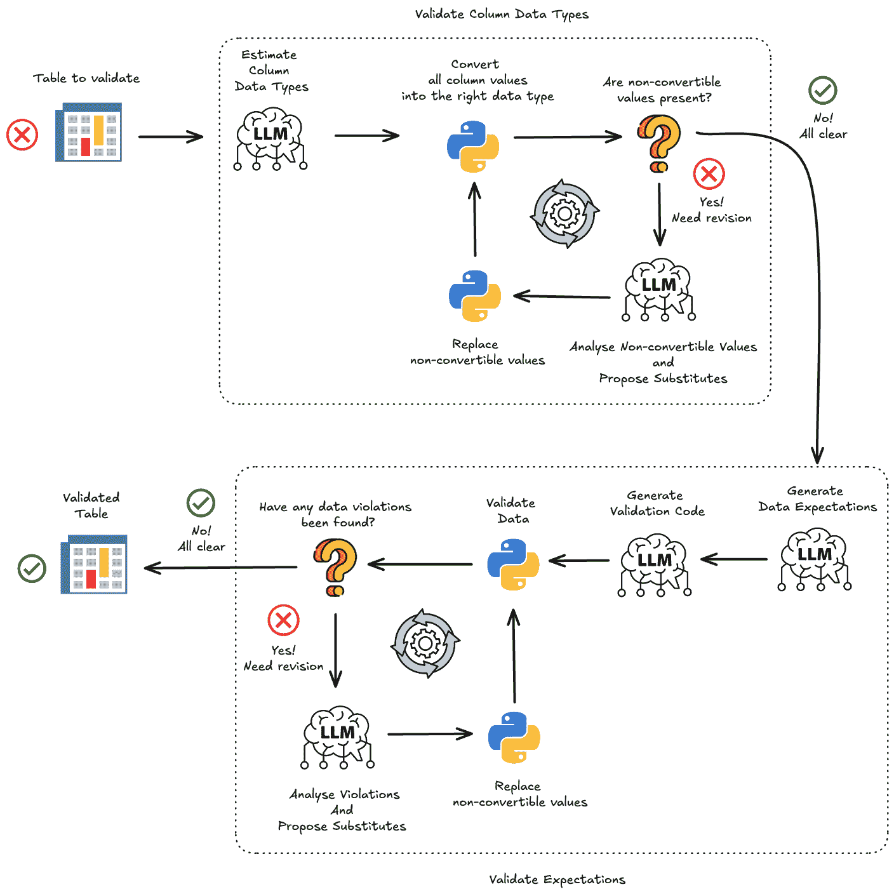
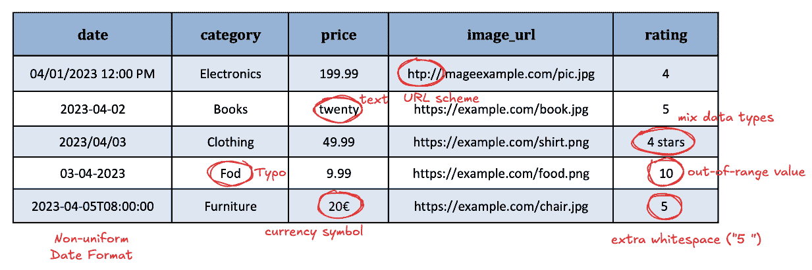
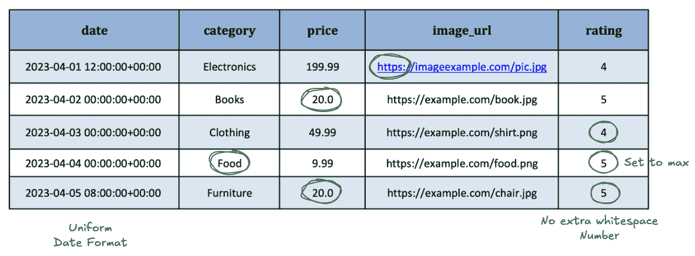

# 基于 LLM 的自动化表格数据验证工作流程

> 原文：[`towardsdatascience.com/an-llm-based-workflow-for-automated-tabular-data-validation/`](https://towardsdatascience.com/an-llm-based-workflow-for-automated-tabular-data-validation/)

<mdspan datatext="el1744658426682" class="mdspan-comment">本文</mdspan>是关于自动化任何表格数据集数据清洗的一系列文章之一：

+   [使用 LLM 轻松实现电子表格规范化](https://towardsdatascience.com/effortless-spreadsheet-normalisation-with-llm/)

您可以使用[CleanMyExcel.io](https://cleanmyexcel.io/)服务在自己的数据集上测试本文中描述的功能，该服务免费且无需注册。

## 什么是数据有效性？

数据有效性指的是数据符合预期的格式、类型和值范围。这种标准化确保了数据根据隐含或显含的要求保持一致性。

与数据有效性相关的一些常见问题包括：

+   不适当的变量类型：不适合分析需要的列数据类型，例如，以文本格式表示的温度值。

+   混合数据类型的列：包含数值和文本数据的单个列。

+   不符合预期格式：例如，无效的电子邮件地址或 URL。

+   超出范围的值：列值超出允许或认为是正常的范围，例如，高中生的年龄为负值或大于 30 岁。

+   时区和日期时间格式问题：数据集中不一致或异质的日期格式。

+   缺乏测量标准化或统一尺度：同一变量的测量单位存在差异，例如，在温度测量中混用摄氏度和华氏度。

+   数字字段中的特殊字符或空白：受非数字元素污染的数值数据。

列表还在继续。

如**重复记录或实体**和**缺失值**这类错误类型不属于此类。

但识别此类数据有效性问题的典型策略是什么？

## 当数据符合期望时

数据清洗虽然可能非常复杂，但通常可以分解为两个关键阶段：

1. 检测数据错误

2. 纠正这些错误。

数据清洗的核心是识别和解决数据集中的差异——特别是违反预定义约束的值，这些约束来自对数据的期望。

重要的是要承认一个基本事实：在现实场景中，几乎不可能全面识别所有潜在的数据错误——数据问题的来源几乎是无限的，从人为输入错误到系统故障，因此无法完全预测。然而，我们可以做的是定义我们认为数据中合理常规模式，称为数据期望——关于“正确”数据应该是什么样子的合理假设。例如：

+   如果处理的是高中生的数据集，我们可能会期望年龄在 14 至 18 岁之间。

+   客户数据库可能需要电子邮件地址遵循标准格式（例如，[[email protected]](/cdn-cgi/l/email-protection))。

通过建立这些期望，我们为检测异常创建了一个结构化框架，使数据清洗过程既可管理又可扩展。

这些期望来自语义和统计分析。我们理解列名“年龄”指的是众所周知的“生活时间”概念。其他列名可能来自高中的词汇领域，而列统计（例如最小值、最大值、平均值等）提供了对值分布和范围的洞察。综合这些信息，有助于确定对该列的期望：

+   年龄值应该是整数

+   值应在 14 至 18 之间

期望的准确性通常与分析数据集所花费的时间一样。自然地，如果数据集被团队每天定期使用，发现微妙的数据问题——以及因此细化期望——的可能性会显著增加。然而，即使在大多数环境中，简单的期望也很少系统地检查，这通常是由于时间限制，或者仅仅是因为它不是待办事项列表上最愉快或最高优先级的任务。

一旦我们定义了我们的期望，下一步就是检查数据是否真正满足这些期望。这意味着应用数据约束并寻找违规情况。对于每个期望，可以定义一个或多个约束。这些数据质量规则可以转换为程序函数，该函数返回一个二元决策——一个布尔值，指示给定的值是否违反了测试的约束。

这种策略在许多数据质量管理工具中普遍实施，这些工具提供基于定义的约束检测数据集中所有数据错误的方法。然后开始一个迭代过程，解决每个问题，直到所有期望都得到满足——即没有违规情况存在。

这种策略在理论上可能看起来简单且易于实施。然而，在实践中往往并非如此——数据质量仍然是许多组织面临的主要挑战和耗时任务。

## 基于 LLM 的工作流程，用于生成数据期望、检测违规情况并解决它们

此验证工作流程分为两个主要组件：列数据类型的验证和符合期望的情况。

可能会同时处理这两个问题，但在我们进行的实验中，在数据帧中事先正确转换每个列的值是一个至关重要的初步步骤。它通过将整个过程分解为一系列顺序动作来促进数据清理，从而提高性能、理解和可维护性。这种策略当然是主观的，但它倾向于尽可能避免一次处理所有数据质量问题。

为了说明和理解整个过程的每一步，我们将考虑这个生成的示例：

数据有效性问题的示例散布在整个表中。每一行故意嵌入一个或多个问题：

+   **行 1**：使用非标准日期格式和无效的 URL 方案（不符合预期格式）。

+   **行 2**：包含文本形式的“二十”作为价格值，而不是数值（不合适的变量类型）。

+   **行 3**：给出了“4 星”的评分，与其他地方的数值评分混合（数据类型混合）。

+   **行 4**：提供了一个“10”的评分值，如果预期评分在 1 到 5 之间（超出范围值）。此外，单词“Food”中存在拼写错误。

+   **行 5**：使用带有货币符号的价格（“20€”）和带有额外空白的评分（“5 ”），显示出缺乏测量标准化和特殊字符/空白问题。

### 验证列数据类型

#### 估计列数据类型

此处的任务是确定数据帧中每个列的最合适的数据类型，基于列的语义意义和统计属性。分类限于以下选项：字符串、整数、浮点数、日期和时间以及布尔值。这些类别足够通用，可以涵盖大多数常见的数据类型。

有多种方法可以进行这种分类，包括确定性方法。这里选择的方法利用了一个大型语言模型（LLM），通过提供有关每个列和整个数据帧上下文的信息来引导其决策：

+   **列名列表**

+   **数据集的代表性行**，随机抽样

+   **列统计**描述每个列（例如，唯一值的数量，最高值的比例等）

*示例*：

| 1. 列名：date  描述：表示与每条记录相关的日期和时间信息。

建议数据类型：datetime

2. 列名：category

描述：包含定义项目类型或分类的类别标签。

建议数据类型：string

3. 列名：price

描述：包含以货币形式表示的项目的数值价格。

建议数据类型：float

4. 列名：image_url

描述：存储指向项目图片的网页地址（URL）。

建议数据类型：string

5. 列名：rating

描述：使用数值分数表示对项目的评估或评分。

建议数据类型：int |

#### 将列值转换为估计的数据类型

一旦预测了每列的数据类型，就可以开始转换值了。根据所使用的表格框架，这一步可能会有所不同，但底层逻辑保持相似。例如，在 [CleanMyExcel.io](https://cleanmyexcel.io/) 服务中，Pandas 被用作核心数据框引擎。然而，在 Python 生态系统中，其他库如 Polars 或 PySpark 也同样强大。

所有不可转换的值都留出以供进一步调查。

#### 分析不可转换的值并提出替代方案

这一步可以视为一个插补任务。之前标记的非可转换值违反了列的预期数据类型。由于潜在原因如此多样，这一步可能相当具有挑战性。再次强调，LLM 提供了一个有用的权衡，以解释转换错误并建议可能的替代方案。

有时，更正过程很简单——例如，将二十岁的年龄值转换为整数 20。在许多其他情况下，替代方案并不明显，用哨兵值（占位符）标记值是更好的选择。例如，在 Pandas 中，特殊对象 pd.NA 适用于此类情况。

*示例*：

| { “violations”： [

{

“index”： 2，

“column_name”： “rating”，

“value”： “4 stars”

“violation”： “在数值评分字段中包含非数值文本。”，

“substitute”： “4”

},

{

“index”： 1，

“column_name”： “price”，

“value”： “twenty”

“violation”： “无法直接转换为数字的文本表示。”，

“substitute”： “20”

},

{

“index”： 4，

“column_name”： “price”，

“value”： “20€”

“violation”： “价格值包含多余的货币符号。”，

“substitute”： “20”

}

]

} |

#### 替换不可转换的值

此时，将程序函数应用于替换有问题的值与建议的替代值。然后再次测试该列，以确保所有值现在都可以转换为估计的数据类型。如果成功，工作流程将进入期望模块。否则，重复之前的步骤，直到列得到验证。

### 验证列数据期望

#### 生成所有列的期望

以下元素提供：

+   **数据字典**：列名，简短描述和预期数据类型

+   **代表性行**从数据集中随机抽取

+   **列统计**，例如唯一值的数量和最高值的比例

根据每列的语义意义和统计特性，目标是定义验证规则和期望，以确保数据质量和完整性。这些期望应属于以下与标准化相关的以下类别：

+   有效范围或区间

+   预期格式（例如，对于电子邮件或电话号码）

+   允许的值（例如，对于分类字段）

+   列数据标准化（例如，‘Mr’，‘Mister’，‘Mrs’，‘Mrs。’变为 [‘Mr’，‘Mrs’])

*示例*：

| 列名：日期

• 期望：值必须是一个有效的日期时间。

- 理由：该列表示日期和时间信息，因此每个条目应遵循标准日期时间格式（例如，ISO 8601）。

• 期望：日期时间值应包含时区信息（最好是 UTC）。

- 理由：提供的样本时间戳包含显式的 UTC 时区信息。这确保了基于时间分析的一致性。

──────────────────────────────

列名：category

• 期望：允许的值应标准化为预定义的集合。

- 理由：根据语义意义，有效的类别可能包括“书籍”、“电子产品”、“食品”、“服装”和“家具”。（注意：样本中包含“Fod”，可能需要更正为“Food”。）

• 期望：条目应遵循标准化的文本格式（例如，标题大小写）。

- 理由：一致的字母大小写和拼写将提高下游分析并减少数据清理问题。

──────────────────────────────

列名：价格

• 期望：值必须是一个数值浮点数。

- 理由：由于该列包含货币金额，条目应以数值（浮点数）形式存储，以确保准确计算。

• 期望：价格值应在有效的非负数值区间内（例如，价格 ≥ 0）。

- 理由：在定价环境中，负价格通常没有意义。即使样本中观察到的最小值为 9.99，允许零或正值对于定价数据来说更现实。

──────────────────────────────

列名：image_url

• 期望：值必须是一个有效的 URL，具有预期的格式。

- 理由：由于该列存储图像网页地址，每个 URL 应遵循标准的 URL 格式化模式（例如，包括正确的协议方案）。

• 期望：URL 应以“https://”开头。

- 理由：样本显示一个 URL 使用“htp://”，这可能是拼写错误。强制执行安全的（https）URL 标准可以提高数据可靠性和用户安全性。

──────────────────────────────

列名：rating

• 期望：值必须是一个整数。

- 理由：评估分数是数值的，并且如样本所示，评分以整数形式存储。

• 期望：评分值应在有效的区间内，例如在 1 到 5 之间。

- 理由：在许多情况下，评分通常在 1 到 5 的范围内。尽管样本包含 10 的值，但可能是数据质量问题。强制执行这个范围标准可以标准化评估尺度。|

#### 生成验证代码

一旦定义了期望，目标就是创建一个结构化的代码，该代码检查数据是否符合这些约束。代码格式可能取决于选择的验证库，例如[Pandera](https://pandera.readthedocs.io/)（用于[CleanMyExcel.io](https://cleanmyexcel.io/)）、[Pydantic](https://docs.pydantic.dev/latest/)、[Great Expectations](https://greatexpectations.io/)、[Soda](https://www.soda.io/)等。

为了使调试更容易，验证代码应该逐元素应用检查，以便在失败发生时，行索引和列名可以清楚地识别。这有助于有效地定位和解决问题。

#### 分析违规并提出替代方案

当检测到违规时，必须解决。每个问题都会用简短的解释和精确的位置（行索引+列名）标记。使用 LLM 根据违规描述估计最佳可能的替换值。同样，这由于数据问题的多样性和不可预测性而非常有用。如果适当的替代方案不明确，则根据所使用的数据框包应用哨兵值。

*示例*:

| { “violations” : [

{

“index”: 3,

“column_name”: “category”,

“value”: “Fod”,

“violation”: “类别应该是以下之一[‘Books’，‘Electronics’，‘Food’，‘Clothing’，‘Furniture’]”,

“substitute”: “Food”

},

{

“index”: 0,

“column_name”: “image_url”,

“value”: “http://imageexample.com/pic.jpg”,

“violation”: “image_url 应以‘https://’开头”,

“substitute”: “https://imageexample.com/pic.jpg”

},

{

“index”: 3,

“column_name”: “rating”,

“value”: “10”,

“violation”: “评分应在 1 到 5 之间”,

“substitute”: “5”

}

]

} |

剩余步骤与在验证列数据类型时使用的迭代过程类似。一旦所有违规问题得到解决且没有进一步的问题被发现，数据框就完全验证了。

您可以使用[CleanMyExcel.io](https://cleanmyexcel.io/)服务在自己的数据集上测试本文中描述的功能，该服务免费且无需注册。

## 结论

有时期望可能缺乏领域专业知识——整合人工输入可以帮助揭示更多样化、具体和可靠的期望。

在解决过程中的自动化是一个关键挑战。人工介入的方法可以增加透明度，尤其是在选择替代或估计值时。

本文是关于自动化任何表格数据集数据清洗的一系列文章之一：

+   [使用 LLM 轻松进行电子表格规范化](https://towardsdatascience.com/effortless-spreadsheet-normalisation-with-llm/)

在即将到来的文章中，我们将探讨路线图上已经列出的相关主题，包括：

+   上文所使用的电子表格编码器的详细描述。

+   数据唯一性：防止数据集中出现重复实体。

+   数据完整性：有效处理缺失值。

+   评估数据重塑、有效性以及其他数据质量的关键方面。

请保持关注！

感谢 Marc Hobballah 审阅本文并提供反馈。

所有图片，除非另有说明，均为作者所有。
