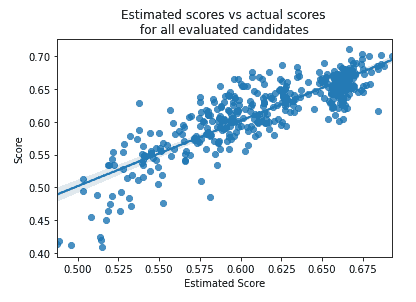

# 特征选择概述

> 原文：[`towardsdatascience.com/an-overview-of-feature-selection-1c50965551dd/`](https://towardsdatascience.com/an-overview-of-feature-selection-1c50965551dd/)

### 特征选择概述，以及介绍一种很少使用但非常有效的方法（基于历史的特征选择），该方法基于一个训练用于估计给定特征集预测能力的回归模型。

当处理表格数据的预测问题时，我们通常会将特征选择作为过程的一部分。这至少有以下几个原因，每个都很重要，但每个都相当不同。首先，这可能是为了提高模型的准确率；其次，为了减少训练和执行模型的计算成本；第三，这也可能是为了使模型更加鲁棒，能够在未来的数据上表现良好。

本文是关于特征选择系列文章的一部分。在这篇文章和下一篇文章中，我将深入探讨前两个目标：最大化准确率和最小化计算。下一篇文章将专门探讨鲁棒性。

此外，本文还介绍了一种名为*基于历史的特征选择（HBFS）*的特征选择方法。HBFS 基于对不同特征子集的实验，学习哪些表现良好（以及哪些特征在组合在一起时表现良好），并据此估计和发现可能表现更好的其他特征子集。

HBFS 将在下一篇文章中更详细地描述；本文提供了一些背景信息，从 HBFS 与其他特征选择方法比较的角度来看。此外，下一篇文章描述了一些评估 HBFS 的实验，将其与其他特征选择方法进行比较，这些方法在本篇文章中有所描述。

除了为 HBFS 特征选择方法提供一些背景信息外，本文对那些对特征选择感兴趣的一般读者也很有用，因为它提供了一个我认为读者会感兴趣的关于特征选择的概述。

## 特征选择与模型准确率

首先考虑模型的准确性，我们常常发现，使用比所有可用特征更少的特征，就能达到更高的准确率（无论是通过交叉验证，还是在单独的验证集上进行测试）。这一点可能有点不直观，因为从理论上讲，许多模型，包括基于树的模型（虽然它们并不总是，但往往在表格数据的预测中表现最佳），理想情况下应该能够忽略不相关的特征，只使用真正具有预测性的特征，但在实践中，不相关（或只有边际预测性）的特征往往会使模型产生混淆。

例如，在基于树的模型中，当我们深入到树的底层时，分裂点是基于越来越少的数据记录确定的，选择一个不相关的特征变得越来越可能。将这些特征从模型中移除，虽然通常不会带来非常大的收益，但通常会在准确性方面带来一些显著的提升（在这里使用“准确性”一词具有一般意义，与用于评估模型的任何指标相关，而不仅仅是准确性指标本身）。

## 减少计算成本的特性选择

这里讨论的特征选择的第二个动机是最大限度地减少模型的计算成本，这通常也非常重要。特征数量减少可以减少调整、训练、评估、推理和监控所需的时间和处理。

特征选择实际上是调整过程的一部分，但在这里我们考虑的是其他调整步骤，包括模型选择、选择执行的前处理以及超参数调整——这些通常非常耗时，但如果在前期进行了足够的特征选择，那么耗时就会减少。

当调整模型（例如，调整超参数）时，通常需要训练和评估大量模型，这可能会非常耗时。但是，如果特征数量足够减少，这个过程可以大大加快。

如果使用大量特征进行这些步骤，可能会慢得多。实际上，使用额外特征的代价可能足够大，以至于超过了使用更多特征所带来的性能提升（正如所指示的，使用更多特征并不一定会提高准确性，实际上可能会降低准确性），因此，为了使用更少的特征，可能有必要接受性能的轻微下降。

此外，减少推理时间可能也是一项期望。例如，在实时环境中，可能需要非常快速地做出大量预测，在这种情况下，使用更简单的模型（包括使用更少的特征）可以在某些情况下促进这一点。

评估每个模型（例如，在执行数据漂移测试时）以及监控每个模型（例如，当有较少的特征需要监控时）也存在类似的成本。

任何准确性的提高所带来的商业利益都需要与更复杂模型的成本相平衡。通常情况下，任何准确性的提升，即使是微小的提升，也可能使得添加额外的特征变得非常值得。但情况往往相反，性能的微小提升并不总是证明使用更大、更慢的模型是合理的。事实上，在大多数情况下，准确性的微小提升并没有真正的商业价值。

## 额外的动机

特征选择还有其他动机。在某些环境中，使用比必要的更多特征需要额外的努力，包括收集、存储和确保这些特征的质量。

另一个动机，至少在托管环境中工作时，可能是使用更少的特征可以降低整体成本。这可能是由于使用更多特征时，除了额外的计算成本之外的成本。例如，当使用 Google BigQuery 时，查询的成本与访问的列数相关联，因此使用更少的特征可能会有成本节约。

## 特征选择的技术

有许多执行特征选择的方法，也有许多对这些方法进行分类的方式。我这里要介绍的不是特征选择方法的标准化分类形式，但我认为这是一种相当直接且有用的观察方式。我们可以将技术分为两组：

+   **逐个评估每个特征的预测能力的方法**。这些方法通常被称为*过滤器*方法，以及一些更复杂的方法。一般来说，这类方法以某种方式评估每个特征，一次评估一个——例如，根据它们与目标列的相关性，或者它们与目标之间的互信息，等等。这些方法不考虑特征之间的相互作用，可能会错过那些只有与其他特征结合使用时才具有预测性的特征，或者包括那些虽然具有预测性但高度冗余的特征——即存在一个或多个特征，在其他特征存在的情况下，添加的预测能力很少。

+   **试图识别一组理想特征的方法**。这包括通常被称为*包装器*的方法（我将在下面进一步描述）。这还包括遗传方法，以及其他类似的优化方法（群体智能等）。这些方法不试图对每个单独特征的预测能力进行排名，而只是找到一组特征，这些特征组合在一起比任何其他组合都表现更好。这些方法通常评估多个候选特征集，然后选择其中最好的。这些方法之间的主要区别在于它们确定要评估哪些特征集的方式。

我们将在下一节中更详细地探讨这些类别。

## 逐个评估每个特征的预测能力

[scikit-learn](https://scikit-learn.org/stable/api/sklearn.feature_selection.html#module-sklearn.feature_selection)（以及几个其他库，例如，[mlxtend](https://rasbt.github.io/mlxtend/)）提供了许多用于特征选择的方法。

scikit-learn 中的大多数特征选择工具都是设计用来识别最具预测性的特征，通过逐个评估它们与目标列的关联来实现。这些包括，例如，[chi2](https://scikit-learn.org/stable/modules/generated/sklearn.feature_selection.chi2.html#sklearn.feature_selection.chi2)，[互信息](https://scikit-learn.org/stable/modules/generated/sklearn.feature_selection.mutual_info_classif.html#sklearn.feature_selection.mutual_info_classif)，以及 [ANOVA f-value](https://scikit-learn.org/stable/modules/generated/sklearn.feature_selection.f_classif.html#sklearn.feature_selection.f_classif)。

[FeatureEngine](https://feature-engine.trainindata.com/en/latest/index.html) 库还提供了一个名为 [MRMR](https://feature-engine.trainindata.com/en/latest/user_guide/selection/MRMR.html) 的算法的实现，该算法同样试图对特征进行排序，在这种情况下，基于它们与目标的关联，以及它们与其他特征的关联（它将具有高目标关联和低其他特征关联的特征排序得最高）。

我们接下来将探讨一些尝试单独评估每个特征的其他方法。这远非一个完整的列表，但它涵盖了大多数最流行的方法。

### **递归特征消除**

scikit-learn 提供的 [Recursive Feature Elimination](https://scikit-learn.org/stable/modules/generated/sklearn.feature_selection.RFE.html#sklearn.feature_selection.RFE) 通过首先在所有特征的全集上训练一个模型来实现。这必须是一个能够提供特征重要性的模型（例如，随机森林，它提供了一个特征*重要性*属性，或者线性回归，它可以使用系数来估计每个特征的重要性，假设特征已经被缩放）。

然后，它反复删除最不重要的特征，并重新评估特征，直到达到目标数量的特征。假设这个过程一直进行到只剩下一个特征，我们就得到了每个特征的预测价值的排序顺序（特征被删除得越晚，其预测性就被认为越强）。

### **1D 模型**

1D 模型是使用一个维度（即一个特征）的模型。例如，我们可能创建一个决策树，该决策树仅使用单个特征来预测目标。对于数据集中的每个特征，可以一次训练这样的决策树，并评估其预测目标的能力。对于任何可以单独预测的特征，相关的决策树将具有优于随机的能力。

使用这种方法，还可以根据使用每个特征训练的 1D 模型的准确性来对特征进行排序。

这与简单地检查特征与目标之间的相关性有些相似，但也能够检测特征与目标之间更复杂、非单调的关系。

### **基于模型的特征选择**

Scikit-learn 提供了对[基于模型的特征选择](https://scikit-learn.org/stable/modules/generated/sklearn.feature_selection.SelectFromModel.html#sklearn.feature_selection.SelectFromModel)的支持。为此，我们使用所有特征来训练一个模型，就像递归特征消除一样，但不是逐个删除特征，我们只是使用模型提供的特征重要性（或者可以使用类似的方法，使用另一个特征重要性工具，例如[SHAP](https://shap.readthedocs.io/en/latest/)）。例如，我们可以训练一个 LogisticRegression 或 RandomForest 模型。这样做，我们可以访问分配给每个特征的特性重要性，并仅选择最相关的特征。

如果我们的目标是创建尽可能精确的模型，那么这并不是一个识别最佳特征子集的有效方法，因为它识别的是模型在任何情况下使用的特征，而不是模型*应该*使用的特征。因此，使用这种方法不太可能导致更精确的模型。然而，这种方法非常快，当目标不是提高精度，而是减少计算时，这可以非常有用。

### **排列检验**

排列检验类似。对此可能有不同的变体，但为了看看一种方法：我们使用全部特征集来训练一个模型，然后使用验证集或交叉验证来评估它。这为模型的表现提供了一个基准。然后我们可以逐个取验证集中的每个特征，对其进行打乱（排列），重新评估模型，并确定分数下降了多少。也有可能逐个重新训练每个特征排列。准确性下降得越多，特征就越重要。

### **Boruta 方法**

使用 Boruta 方法，我们针对每个特征创建一个所谓的*影子特征*，这是原始特征的排列版本。所以，如果我们最初在表中拥有，比如说，10 个特征，我们就为这些特征中的每一个创建影子版本，因此总共就有 20 个特征。然后我们使用这 20 个特征来训练一个模型，并评估每个特征的重要性。同样，我们可以使用许多 scikit-learn 模型和其他模型（例如 CatBoost）提供的内置特征重要性度量，或者可以使用像[SHAP](https://shap.readthedocs.io/en/latest/)这样的库（这可能会慢一些，但会提供更准确的特征重要性）。

我们将任何阴影特征（假设它们具有零预测能力）赋予的最大重要性作为区分预测特征和非预测特征的阈值。检查所有其他特征，看它们的特征重要性是否高于这个阈值。这个过程重复多次，每个特征根据它获得高于这个阈值的特征重要性的次数进行评分。

这是对可能用于评估特征的一些方法的一个快速概述。这些方法可能不是最优的，尤其是当目标是创建最准确的模型时，因为它们没有考虑特征之间的相互作用，但它们非常快，并且往往能很好地对特征进行排名。

通常，使用这些方法，我们将得到每个特征的排名顺序。我们可能已经提前确定了我们希望使用多少个特征。例如，如果我们知道我们希望使用 10 个特征，我们只需简单地选择排名前 10 的特征。

或者，我们可以使用验证集进行测试，先使用前 1 个特征，然后是前 2 个，然后是前 3 个，以此类推，直到使用所有特征。例如，如果我们有一个特征的排名顺序（从最强到最弱）：{E, B, H, D, G, A, F, C}，那么我们可以测试：{E}，然后{E, B}，然后{E, B, H}，以此类推，直到完整的集合{E, B, H, D, G, A, F, C}，其理念是如果我们只使用一个特征，它将是最强的；如果我们只使用两个特征，它将是最强的两个，以此类推。根据每个特征集的评分，我们可以选择具有最高指标评分的特征数量，或者平衡评分和特征数量的最佳特征数量。

## 寻找最佳特征子集

上述方法的主要局限性在于它们没有充分考虑特征之间的相互作用。特别是，它们可能会错过即使单独作用不强但可能很有用的特征（例如，在某些特定数据子集或其与另一个特征的关联可以预测目标的情况下），并且它们可能会包含冗余的特征。如果两个或多个特征提供了大部分相同的信号，那么很可能其中一些可以去除而不会使模型的技能下降太多。

现在，我们来看看试图找到最佳特征子集的方法。这些方法不试图评估或排名每个特征，而只是找到作为一组工作得最好的特征集。

为了确定最佳特征集，有必要测试和评估许多这样的集，这会更昂贵——组合的数量比简单地考虑每个特征要多，而且每个组合的评估成本更高（由于有更多特征，模型训练通常更慢）。然而，这通常会导致比简单地使用所有特征或依赖于评估特征的方法时更强的模型。

我应该指出，虽然我们不一定严格使用其中一种方法；将它们结合起来是完全可能的。例如，由于大多数识别最优特征集的方法相当慢，我们首先可以运行上述方法之一（这些方法分别评估特征并按其预测能力进行排名），以创建一个特征短名单，然后执行一个方法来找到这些短名单特征的优化子集。这可能会错误地排除一些特征（首先用于过滤特征的方法可能会移除一些在其他特征存在时可能有用的特征），但也可以在更快但不太准确和更慢但更准确的方法之间取得良好的平衡。

尝试找到最佳特征集的方法包括所谓的*包装方法*、*随机搜索*、*各种优化方法*，以及一些其他方法。本文介绍的方法 HBFS 也是一个试图找到最佳特征集的方法的例子。这些方法将在下面进行描述。

### 包装方法

包装方法也可以被认为是一种对特征进行排名的技术（它们可以提供估计预测能力的排名顺序），但在这个讨论中，我将它们归类为能够识别最佳特征集的方法。包装方法实际上确实测试了特征的完整组合，但以一种受限的方式（尽管通常仍然非常慢）。

使用包装方法时，我们通常要么从一个空的特征集开始，一次添加一个特征（这被称为*加法过程*），要么从一个完整的特征集开始，一次移除一个特征（这被称为*减法过程*）。

在加法过程中，我们首先找到单个特征，它使我们能够创建最强的模型（使用相关指标）。这需要逐一测试每个特征。然后我们找到当添加到集合中时，可以使我们创建使用第一个特征和第二个特征的最强模型的特征。这需要使用除已存在的特征之外的每个特征进行测试。然后我们以相同的方式选择第三个特征，以此类推，直到最后一个特征，或者达到某些停止条件（例如特征的最大数量）。

如果有特征 {A, B, C, D, E, F, G, H, I, J}，共有 10 个特征。我们首先逐一测试这 10 个特征（需要 10 次测试）。我们可能会发现 D 效果最好，因此我们有了特征集{D}。然后我们测试{D, A}、{D, B}、{D, C}、{D, E}……{D, J}，这是 9 次测试，并从中选择最强的。我们可能会发现{D, E}效果最好，因此将{D, E}作为特征集。然后我们测试{D, E, A}、{D, E, B}……{D, E, J}，这是 8 次测试，再次从中选择最强的，以此类推。如果目标是找到最佳的特征集，比如 5 个特征，我们可能会以例如{D, E, B, A, I}结束。

我们可以看到，这种方法可能会错过最佳的五特征组合，但通常会相当好。在这个例子中，这可能是至少在可以识别的最强 5 个特征子集之一，尽管在下一篇文章中描述的测试表明，包装方法往往不如预期有效。

我们还可以看到，如果有很多特征，这可能会非常慢。如果有数百个特征，这将是不可能的。但是，如果有适量的特征，这可以合理地工作得很好。

减法方法的工作原理类似，但在每一步中移除一个特征。

### 随机搜索

随机搜索很少用于特征选择，尽管在许多其他上下文中使用，例如超参数调整。在下一篇文章中，我们将展示随机搜索实际上在特征选择方面比预期更有效，但它确实存在不具战略性和不随时间学习的问题，就像优化技术或 HBFS 一样。

这可能导致随机搜索不必要地测试一些肯定很弱的候选者（例如，与已测试的其他特征集非常相似的特征集，其中之前测试的集表现不佳）。这也可能导致未能测试出在迄今为止进行的其他实验中看起来最有希望的某些特征组合。

然而，随机搜索非常简单，在许多情况下可能足够好，并且通常优于单独评估特征的方 法。

### 优化技术

有许多优化技术可以用来确定最佳特征集，包括爬山法、遗传方法、贝叶斯优化和群体智能等。

爬山法，应用于特征选择，可以与[使用爬山法解决经典的世界系列投注问题](https://medium.com/towards-data-science/solving-the-classic-betting-on-the-world-series-problem-using-hill-climbing-5e9766e1565d)中描述的过程类似。

在这里，我们将从一个随机的特征集开始，然后找到一个小修改（添加或删除少量特征）来改进这个集（测试几个这样的小修改并取最好的），然后找到一个小变化来改进那个特征集，以此类推，直到满足某个停止条件（我们可以限制时间、考虑的候选者数量、上次改进的时间或设置其他此类限制）。

以这种方式，从一个随机（并且可能表现不佳）的特征集开始，我们可以逐渐、反复地改进，直到最终发现一个非常强大的特征集。

例如，我们可能随机从{B, F, G, H, J}开始，然后找到包含特征 C 的小变化{B, C, F, G, H, J}（这增加了特征 C）效果更好，然后是{B, C, F, H, J}（移除了特征 G）效果更好一些，以此类推。

在某些情况下，我们可能会陷入局部最优解，这时另一种称为*模拟退火*的技术可能有助于继续进步。这允许我们偶尔选择性能较低的选择，这有助于防止陷入一种没有微小变化可以改进的状态。

遗传算法的工作方式类似，尽管在每一步中，考虑的候选者数量很多，而不是只有一个，并且还会进行*组合*以及*变异*（在爬山解的每一步中对候选特征集所做的微小修改与遗传算法中对候选者的修改相似，这些修改被称为*变异*）。

在*组合*过程中，选择两个或多个候选者，并基于这些候选者的某种组合创建一个或多个新的候选者。例如，如果我们有两个特征集，我们可以取其中一个特征集使用的一半特征，以及另一个特征集使用的一半特征，删除任何重复的特征，并将这个组合视为一个新的候选者。

（在实践中，当使用遗传方法进行特征选择问题时，候选者通常会被格式化为一个由 0 和 1 组成的字符串序列——每个特征一个值——在一个有序的特征列表中，表示该特征是否包含在集合中，因此将两个候选者组合的过程可能与此示例略有不同，但基本思想是相同的。）

使用遗传算法进行不同目的的一个例子，即构建决策树，可以在[使用自助和遗传算法创建更强的决策树](https://medium.com/towards-data-science/create-stronger-decision-trees-with-bootstrapping-and-genetic-algorithms-1ae633a993c9)中找到。

### 贝叶斯优化

使用贝叶斯优化，解决诸如寻找最优特征集等问题的方法是首先尝试多个随机候选者，评估这些候选者，然后创建一个模型，该模型可以根据我们从已评估的候选者中学到的知识来估计其他特征集的技能。

为了做到这一点，我们使用一种称为*高斯过程*的回归器，因为它不仅能够为任何其他候选者提供估计（在这种情况下，估计使用此特征集训练的模型的度量分数），而且能够量化不确定性。

例如，如果我们已经评估了一个给定的特征集，比如 {F1, F2, F10, F23, F51}（并得到了 0.853 的分数），那么我们可以相对确定一个非常相似的特征集，比如：{F1, F2, F10, F23, F51, F53} 的预测分数为 0.858——尽管我们无法完全确定，因为新增的一个特征 F53 可能会提供大量的额外信号。但我们的估计将比完全不同的特征集更确定，例如 {F34, F36, F41, F62}（假设尚未评估与此类似的特征集，这将具有很高的不确定性）。

作为另一个例子，集合 {F1, F2, F10, F23} 比它少一个特征，即 F51。如果 F51 看起来不具有预测性（考虑到给予其他包含和不包含 F53 的特征集的分数），或者看起来与 F1 高度冗余，那么我们可以有信心地估计 {F1, F2, F10, F23} 的分数——它应该与 {F1, F2, F10, F23, F51} 的分数大致相同。尽管仍然存在显著的不确定性，但与完全不同的特征集相比，这种不确定性要小得多。

因此，对于任何给定的特征集，高斯过程不仅可以生成其将获得的分数的估计，还可以生成不确定性，这以可信区间的形式提供。例如，如果我们关注宏观 f1 分数，高斯过程可以学习估计任何给定特征集的宏观 f1 分数。对于某个集合，它可能估计，例如，0.61，它还可能指定一个可信区间为 0.45 到 0.77，这意味着有 90%（如果我们使用 90% 作为可信区间的宽度）的概率 f1 分数将在 0.45 和 0.77 之间。

贝叶斯优化旨在平衡探索和利用。在过程的开始阶段，我们倾向于更多地关注探索——在这种情况下，确定哪些特征具有预测性，哪些特征最适合一起包含等等。然后，随着时间的推移，我们倾向于更多地关注利用——利用我们所学的知识来尝试识别尚未评估的最有希望的特征集，然后对其进行测试。

贝叶斯优化通过交替使用所谓的 *获取方法* 来识别下一个待评估的候选者，评估这些候选者，从中学习，再次调用获取方法，等等。在早期，获取方法将倾向于选择看起来有希望但不确定性高的候选者（因为这些是我们可以从中学到最多的事物），而在后期，将选择看起来最有希望且相对不确定性较低的候选者（因为这些候选者最有可能超越已经评估的候选者，尽管它们可能是迄今为止找到的最高得分特征集的小幅变化）。

在这篇文章中，我们介绍了一种称为基于历史的特征选择（HBFS）的方法，这可能与贝叶斯优化最相似，尽管稍微简单一些。我们接下来看看这个，在下一篇文章中，我们将比较其性能与其他之前介绍的方法。

## 基于历史的特征选择

我们现在已经非常快速地概述了许多其他今天常用的主要特征选择选项。现在我将介绍基于历史的特征选择（HBFS）。这是另一种特征选择方法，我发现它非常有用，而且我没有意识到有其他实现，甚至讨论，尽管这个想法相当直观和简单。

由于我所知没有其他实现，我创建了一个 Python 实现，现在可在 GitHub 上找到，[HistoryBasedFeatureSelection](https://github.com/Brett-Kennedy/HistoryBasedFeatureSelection)。

这提供了 Python 代码、文档、一个示例笔记本以及用于彻底测试 HBFS 的文件。

即使你实际上没有使用 HBFS 进行你的机器学习模型，我希望你会发现这种方法很有趣。这些想法仍然是有用的，并且希望至少是一个帮助思考特征选择的好方法。

尽管如此，我将表明 HBFS 与其他特征选择选项相比往往表现良好，因此它可能值得在项目中查看，尽管这些想法足够简单，可以直接编码——使用 GitHub 页面上的代码可能很方便，但不是必需的。

我将这种方法称为*基于历史的特征选择（HBFS）*，因为它从尝试特征子集的历史中学习，从它们在验证集上的表现中学习，测试额外的候选特征集，从这些中学习，如此等等。随着实验历史的进展，模型能够越来越好地学习哪些特征子集最有可能表现良好。

以下是最主要的算法，以伪代码的形式呈现：

```py
Loop a specfied number of times (by default, 20)
| Generate several random subsets of features, each covering about half 
|     the features
| Train a model using this set of features using the training data
| Evaluate this model using the validation set
| Record this set of features and their evaluated score

Loop a specified number of times (by default, 10)
|   Train a RandomForest regressor to predict, for any give subset of 
|      features, the score of a model using those features. This is trained
|      on the history of model evaluations of so far.
|  
|   Loop for a specified number of times (by default, 1000)
|   |   Generate a random set of features
|   |   Use the RandomForest regressor estimate the score using this set 
|   |     of features
|   |   Store this estimate
|
|   Loop over a specfied number of the top-estimated candidates from the 
|   |       previous loop (by default, 20)
|   |   Train a model using this set of features using the training data
|   |   Evaluate this model using the validation set
|   |   Record this set of features and their evaluated score   

output the full set of feature sets evaluated and their scores, 
   sorted by scores
```

我们可以看到，这与贝叶斯优化相比要简单一些，因为第一次迭代完全专注于探索（候选者随机生成）并且所有后续迭代完全专注于利用——没有逐渐趋向更多利用的趋势。

这有一些好处，因为这个过程通常只需要很少的迭代次数，通常在 4 到 12 次左右（因此探索看起来可能较弱的候选特征集的价值较小）。它还避免了调整平衡探索和利用的过程。

因此，获取函数相当简单——我们只是选择那些尚未测试但看起来最有希望的候选者。虽然这（由于探索的某些减少）可能会错过一些有强大潜力的候选者，但在实践中它似乎能够可靠且迅速地识别出最强的候选者。

HBFS 执行速度相当快。当然，它比评估每个特征的方法要慢，但在性能方面与包装方法、遗传方法以及其他试图找到最强特征集的方法相比相当不错。

HBFS 设计成让用户在执行过程中理解其进行的特征选择过程。例如，提供的一种可视化图表显示了所有评估的特征集的分数（包括估计分数和实际评估分数），这有助于我们了解它能够多好地估计任意候选特征集将被赋予的分数）。



HBFS 还包括一些与特征选择方法不常见的功能，例如允许用户选择：1）简单地最大化准确性，或者 2）在最大化准确性与最小化计算成本之间平衡目标。这些将在下一篇文章中描述。

## 结论

这提供了一个关于特征选择中最常见的一些方法的快速概述。每种方法的工作方式略有不同，每种方法都有其优缺点。根据具体情况，如果目标是最大化准确性，或者平衡准确性与计算成本，不同的方法可能更可取。

这也提供了一个关于基于历史特征选择方法的快速介绍。

HBFS 是一种我发现效果非常好的新算法，通常情况下，尽管并非总是如此，它比这里描述的方法更可取（没有一种方法会严格优于所有其他方法）。

在下一篇文章中，我们将更详细地探讨 HBFS，并描述一些实验，比较其性能与其他在此处描述的方法。

在接下来的文章中，我将探讨如何使用特征选择来创建更健壮的模型，考虑到在生产中可能发生的数据或目标的变化。

所有图片均为作者提供。
