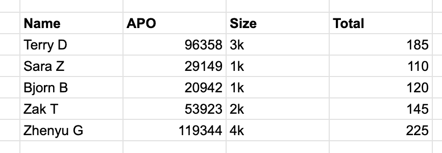
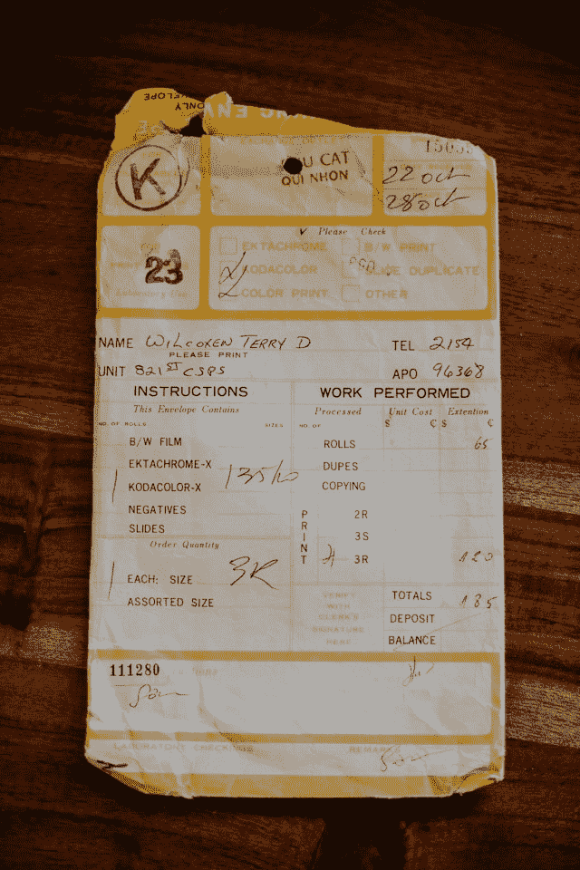
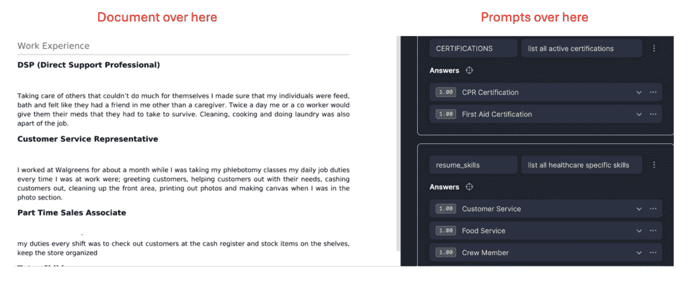

# 《雪花公司文档人工智能的无偏见评论》

> 原文：[`towardsdatascience.com/an-unbiased-review-of-snowflakes-document-ai/`](https://towardsdatascience.com/an-unbiased-review-of-snowflakes-document-ai/)

作为数据专业人士，我们对表格数据感到很自在…

表格数据。图片由作者提供。

我们还可以处理文字、json、xml 流和猫的图片。但关于装满这类东西的纸箱怎么办？

（图片由 Annie Spratt 提供，[Unsplash](https://unsplash.com/photos/a-receipt-sitting-on-top-of-a-wooden-table-recgFWxDO1Y)）

这张收据上的信息非常渴望被存储在某个表格数据库中。如果我们能够扫描所有这些，通过 LLM 进行处理，并将结果保存在表格中，那岂不是很好？

幸运的是，我们生活在文档人工智能的时代。文档人工智能结合了 OCR 和 LLMs，使我们能够搭建起纸质世界和数字数据库世界之间的桥梁。

所有主要云服务提供商都有某种版本的这种技术…

+   [谷歌（文档人工智能）](https://cloud.google.com/document-ai?hl=en),

+   [微软（文档人工智能）](https://www.microsoft.com/en-us/research/project/document-ai/)

+   [AWS（智能文档处理）](https://aws.amazon.com/ai/generative-ai/use-cases/document-processing/)

+   [雪花（文档人工智能）](https://docs.snowflake.com/en/user-guide/snowflake-cortex/document-ai/overview)

在这里，我将分享我对雪花公司文档人工智能的看法。除了在工作中使用雪花公司产品外，我与雪花公司没有任何关联。他们没有委托我写这篇文章，我也没有参与任何大使计划。所有这些只是为了说明，我可以写一篇*无偏见*的[雪花公司文档人工智能](https://docs.snowflake.com/en/user-guide/snowflake-cortex/document-ai/overview)评论。

* * *

## 什么是文档人工智能？

文档人工智能允许用户快速从数字文档中提取信息。当我们说“文档”时，我们指的是带文字的图片。不要将此与[特定领域的 NoSQL 事物](https://aws.amazon.com/documentdb/)混淆。

该产品结合了 OCR 和 LLM 模型，使用户能够创建一组提示，并一次性对大量文档执行这些提示。

雪花公司的文档人工智能在（清洗过的）简历中的应用。图片由作者提供。

LLMs 和 OCR 都有出错的空间。雪花公司通过（1）不断敲打 OCR 直到它变得锋利——我看到你，雪花开发者——以及（2）让我微调我的 LLM 来解决这个问题。

微调雪花 LLM 的感觉更像[露营](https://www.merriam-webster.com/dictionary/glamping)而不是一些粗犷的户外冒险。我审查了 20 多份文档，点击“训练模型”按钮，然后冲洗并重复，直到性能令人满意。我甚至还是数据科学家吗？

一旦模型训练完成，我就可以一次运行 1000 份文档的提示。我喜欢将结果保存到表格中，但你可以实时处理结果。

* * *

## 这为什么重要？

这个产品有几个原因很酷。

+   你可以在纸质世界和数字世界之间架起一座桥梁。我从未想过我桌子下的那一大堆纸质发票会进入我的云数据仓库，但现在它可以了。扫描纸质发票，上传到 Snowflake，运行我的文档 AI 模型，然后！我想要的所需信息就被解析成整洁的表格。

+   通过 SQL 调用机器学习模型非常方便，为什么我们之前没有想到这一点呢？在以前，这需要几百行代码来加载原始数据（SQL >> python/spark 等），清理数据，构建特征，进行训练/测试分割，训练模型，做出预测，然后通常将预测写回 SQL。

+   在内部构建这将是一项重大任务。是的，OCR 技术已经存在很长时间了，但仍然可能有些挑剔。显然，微调 LLM 的时间并不长，但每周都在变得更容易。要自己将这些组件组合起来以实现各种文档的高精度，可能需要花费很长时间。需要数月的时间进行打磨。

当然，一些元素仍然是在内部构建的。一旦我从文档中提取信息，我就必须想出如何处理这些信息。虽然这是一项相对快速的工作。

* * *

## 我们的用例——迎接流感季节：

我在一家名为[IntelyCare](https://www.intelycare.com/)的公司工作。我们在医疗人员配置领域运营，这意味着我们帮助医院、养老院和康复中心为个别班次、长期合同或全职/兼职工作找到优质的临床医生。

我们许多设施要求临床医生必须接种最新的流感疫苗。去年，我们的临床医生提交了超过 10,000 份流感疫苗，以及数十万份其他文件。我们手动审查了所有这些文件以确保其有效性。这是在医疗人员配置世界中工作的乐趣之一！

**剧透警告：使用文档 AI，我们能够在短短几周内将需要手动审查的流感疫苗文件数量减少了约 50%。**

要实现这一点，我们做了以下几件事：

+   将一堆流感疫苗文件上传到 Snowflake。

+   调整提示，训练模型，再次调整提示，再次重新训练模型……

+   构建了逻辑来比较模型输出与临床医生档案（例如，名字是否匹配）的对比。在格式化名字、日期等方面肯定会有一些试错。

+   构建了“决策逻辑”，用于批准文档或将文档退回给人类。

+   在更大的手动审查文档堆上测试了整个流程。仔细检查了任何假阳性。

+   重复操作，直到我们的混淆矩阵令人满意。

对于这个项目，假阳性会带来业务风险。我们不希望批准过期或缺少关键信息的文档。我们不断迭代，直到假阳性率降为零。最终我们可能会有一些假阳性，但会比现在的人工审查过程少。

然而，假阴性是无害的。如果我们的管道不喜欢流感疫苗，它就会简单地将文档路由到人工团队进行审查。如果他们继续批准文档，那么一切照旧。

模型在处理干净/简单的文档方面做得很好，这些文档占所有流感疫苗的 ~50%。如果它很混乱或令人困惑，它就会像以前一样回到人工那里。

* * *

## 我们在过程中学到的东西

1.  *模型在阅读文档方面做得最好，而不是基于文档做出决定或进行数学运算。*

最初，我们的提示试图确定文档的有效性。

坏：*文档是否已经过期？*

我们发现将提示限制为可以通过查看文档回答的问题要有效得多。LLM 并不 *确定* 任何事情。它只是从页面上抓取相关的数据点。

好：*过期日期是什么？*

保存结果并做下游的数学运算。

1.  **您仍然需要仔细考虑训练数据**

在我们的训练数据中，一位临床医生有几份重复的流感疫苗。称这位临床医生为 Ben。我们中的一个提示是，“病人的名字是什么？”因为“Ben”在训练数据中多次出现，任何稍微不清楚的文档都会返回“Ben”作为病人名字。

因此，过度拟合仍然是一个问题。过采样/欠采样仍然是一个问题。我们用更仔细收集的训练文档再次尝试，效果要好得多。

文档 AI 非常神奇，但并非 *那么* 神奇。基础知识仍然很重要。

1.  **模型可能会被写在餐巾纸上的内容欺骗。**

根据我的了解，Snowflake 没有将文档图像渲染为 [嵌入](https://abdulkaderhelwan.medium.com/introduction-to-image-embeddings-55b8247d13f2) 的方法。您可以从提取的文本中创建嵌入，但这不会告诉您文本是否是手写的。只要 *文本* 是有效的，模型和下游逻辑都会给它绿灯。

您可以通过比较提交文档的图像嵌入与已接受文档的嵌入来轻松解决这个问题。任何嵌入偏离太远的文档都会被退回进行人工审查。这是一项简单的工作，但现在您必须在外部 Snowflake 中完成。

1.  **没有我想象的那么贵**

Snowflake 以开销大而闻名。出于 HIPAA 合规性考虑，我们为这个项目运行了一个更高级别的 Snowflake 账户。我倾向于担心 Snowflake 的账单。

最后，我们不得不加倍努力，每周花费超过 100 美元来训练模型。我们每隔几天就运行数千份文档通过模型来衡量其准确性，并在迭代模型的同时，但从未能突破预算。

更好的是，我们在人工审查过程中节省了资金。使用 AI 审查 1000 份文档（批准约 500 份）的成本大约是我们用于人工审查剩余 500 份文档成本的 20%。总的来说，流感疫苗接种审查的成本降低了 40%。

* * *

## 总结

我对使用 Document AI 完成如此规模的项目速度之快印象深刻。我们从几个月缩短到了几天。我给它打 4 星（满分 5 星），如果 Snowflake 能给我们提供访问图像嵌入的功能，我愿意给它第五星。

自从流感疫苗接种以来，我们已经为其他类似或更好的文档部署了类似的模型，并且有了所有这些准备工作，我们不再害怕即将到来的流感季节，而是准备好迎接挑战。
