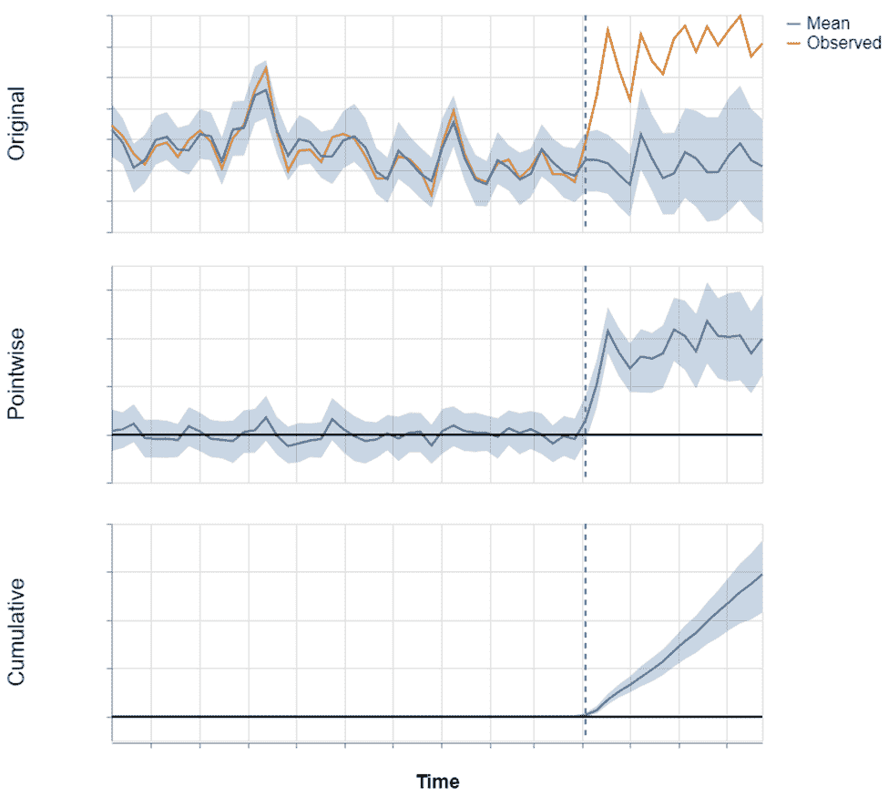
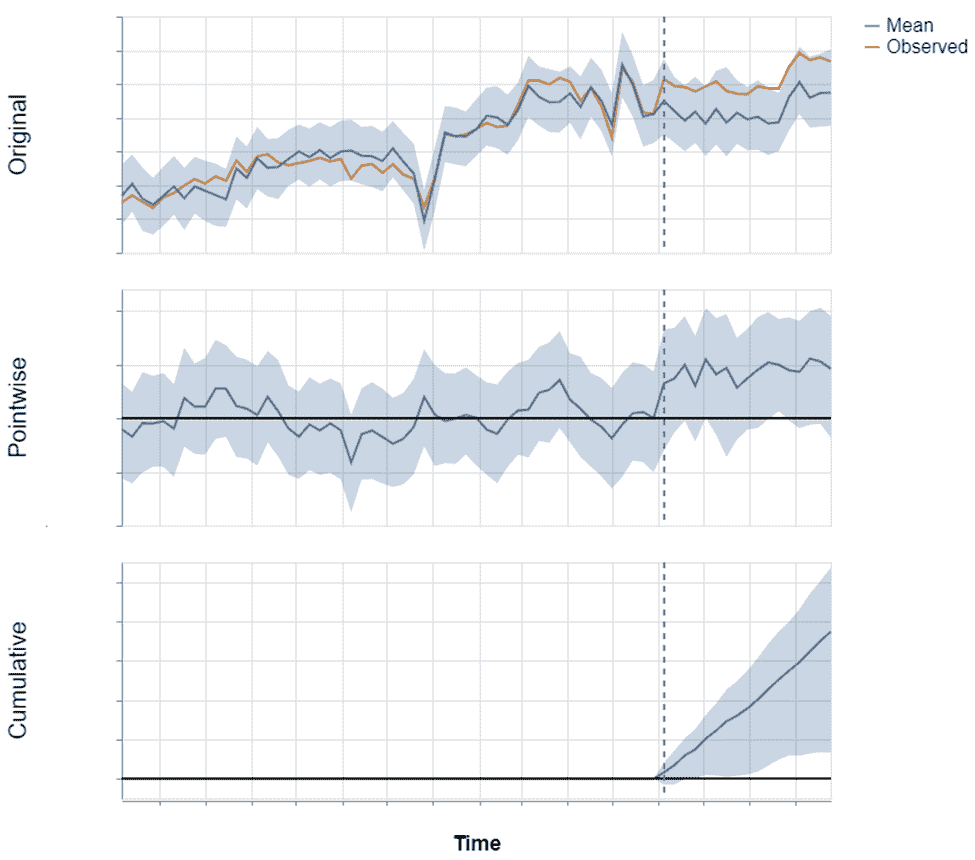
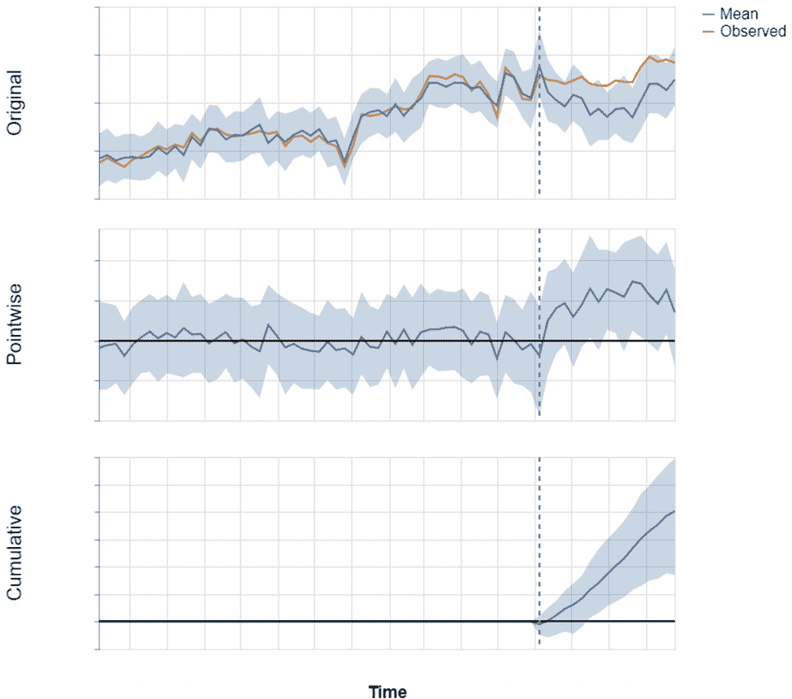
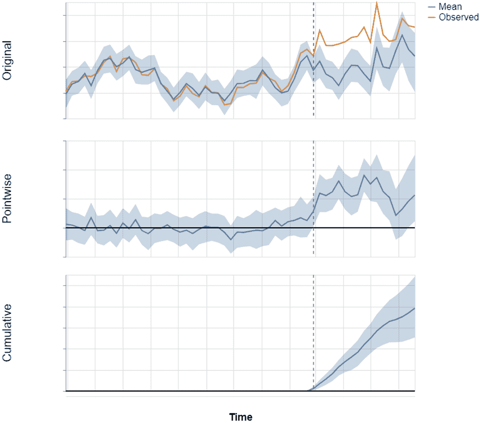

# 因果影响在零售销售转移分析中的应用：家乐福案例研究

> 原文：[`towardsdatascience.com/analysis-of-sales-shift-in-retail-with-causal-impact-a-case-study-at-carrefour/`](https://towardsdatascience.com/analysis-of-sales-shift-in-retail-with-causal-impact-a-case-study-at-carrefour/)

**披露：**我在家乐福工作。本文中表达的观点是我个人的观点。所提供的数据和示例已获得雇主许可并不含任何机密信息。

## <mdspan datatext="el1758136907017" class="mdspan-comment">简介</mdspan>

商店的商品组合是向顾客销售的完整且多样化的产品范围。它受各种因素的影响而演变，例如：经济条件、消费趋势、盈利能力、质量或合规性问题、某些产品系列的更新、库存水平、季节性变化等。

当一个产品在商店货架上不再可用时，其部分销售额可能会转移到其他产品。对于像家乐福这样的主要食品零售商来说，准确估计这种销售转移对于管理因产品不可用而造成的损失风险以及估算由此产生的损失至关重要。

这种测量作为产品不可用后果的指标。此外，它逐渐构建了一个有价值的销售转移影响估计历史。

然而，估计销售转移是复杂的。顾客行为——受难以预测的情感因素影响——某些产品的季节性，或新产品的推出都可能影响销售转移。此外，许多产品同时在所有商店中不可用，这使得建立控制群体成为不可能。

由谷歌团队开发的因果影响合成控制方法符合我们分析框架的特定性。它使我们能够将产品不可用对销售的影响与影响因素隔离开来，并且适用于准实验和观察性研究。基于贝叶斯结构时间序列模型，因果影响进行反事实分析，计算销售影响为产品不可用后观察到的销售与通过合成控制本应观察到的销售之间的差异。

本文介绍了我们估算产品不可用后销售转移效应的因果影响方法，以及选择控制组时间序列的启发式方法。

*由于保密问题，图表上的数值已被删除。请注意，每个块代表 x 轴上一个月，y 轴代表一个变量数量，这可能相当大。*

## I) 指定用例

产品不可用主要有两种形式：

+   完全不可用：该产品不再在国家组合中可用，影响所有商店。

+   部分不可用：产品在某些商店中不再可用——但不是所有商店——在其他商店中仍然可用。

我们认为，可靠的销售额变化影响估计应该准确评估损失的销售和转移到其他产品的销售额部分。然而，知道这些数量的确切值是不可能的，这使得这个挑战变得复杂。

我们的研究分析了产品完全不可用的情况，因为这些情况在销售影响方面最为重要。

请注意，因果推断不是未来事件的预测框架：它识别过去中的因果关系，而不是预测未来事件。

## II) 为什么我们选择了谷歌的 Causal Impact 模型？

因果方法旨在理解变量之间的因果关系，通过隔离我们试图分析的效果，从所有其他现有效果中解释一个变量如何影响另一个变量。

在这些工具中，Causal Impact 是一个用户友好的库，它在一个完全贝叶斯框架内运行，允许集成先验信息，同时在结果中提供内在的置信区间。其预测表示如果没有干预，预期的结果，以分布函数的形式表示，而不是单一值。

Causal Impact 通过结合内生成分（如季节性和局部水平）与用户选择的对外时间序列（协变量）来生成预测。这些协变量必须不受干预的影响，并且应该捕捉到可能影响主要时间序列的趋势或因素。我们将在后面讨论协变量选择。

***图 1：*** *Causal Impact 在实际应用中的简化示例。顶部图表显示了两个时间序列：橙色线代表实际观察到的数据，而蓝色线是模型预测，使用协变量和内生成分创建。每个方块代表一个月。这个预测估计了如果感兴趣的事件（由垂直虚线标记）没有发生，会发生什么。蓝色阴影区域表示预测的不确定性。第二个图表显示了预测和观察数据之间的点对点差异，底部图表显示了累积影响。*

## III) 管理数据中的异常值和异常

为了确保分析准确，我们通过以下两个关键步骤解决了销售数据异常：

+   我们排除了分析中销售为负或大量零销售的时间序列。

+   对于偶尔出现零销售的时间序列，我们将这些值替换为前一周和后一周销售的平均值。

## IV) 模型设计

协变量的选择对反事实预测的准确性有显著影响。这些时间序列必须捕捉到可能影响目标时间序列的趋势或外部因素，同时不受干预的影响。

此外，考虑估计的销售位移效应相对于所研究的时间序列的大小至关重要：如果干预预计只会使目标序列受到影响几个百分点，则该序列可能不合适，因为小效应难以与随机噪声区分（尤其是图书馆设计者已经表明，小于 1%的效果难以证明与干预有关）。因此，我们仅在理论最大销售位移率超过其子系列销售 5%的情况下分析销售位移。我们将其计算为 S/(1-S)，其中 S 表示产品在变得不可用之前在其子系列中产生的营业额百分比。

考虑到这些初步考虑，我们设计了以下 Causal Impact 模型：

**目标**

作为目标时间序列，我们选择了产品子系列的销售总和，排除了已不可用的产品。

**协变量**

我们首先排除了以下类型的时间序列：

+   与已停售产品属于同一子系列的产品，以防止其不可用性产生任何影响。

+   与已停售产品不属于同一系列的其它产品，因为协变量应保持业务相关性。

+   与目标序列相关但不是协整的时间序列，以避免虚假关系。

使用这些过滤器，我们选择了 60 个协变量：

+   20 个协变量是基于它们在干预前一年与目标序列的最高协整性选择的。

+   从前 200 个协整序列中选择了 40 个额外的协变量，基于它们在干预前一年与目标序列的最强相关性。

注意，这些数字（20、40 和 60）是从我们之前的模型拟合中得出的经验法则。

这种经验方法结合了捕捉长期趋势（通过协整）和短期变化（通过相关性）的时间序列。我们故意选择了大量的协变量，因为 Causal Impact 采用了一种“尖峰和板”方法，该方法通过分配接近零的回归系数自动减少不显著序列的影响，同时给予重要序列更大的权重。

## V) 模型验证

为了验证我们的协变量选择策略，我们大量借鉴了 Causal Impact 设计者所采用的方法。我们进行了以下部分产品不可用性的研究：

1.  我们检查了产品部分不可用的情况，并使用差异-差异方法进行了初步的传统统计分析。

1.  我们应用 Causal Impact 时，将控制人口作为协变量，该人口由产品子系列的销售（不包括不可用的产品）组成，这些产品在商店中仍然可用。这些协变量提供了最佳的可供选择的假设，因为这些商店未受到干预的影响。

1.  最后，我们在没有对照组的情况下应用了因果影响，而是使用我们在模型设计部分概述的基于协整和相关的选择过程。

在多个报告（涵盖不同产品、数量和类别）中的一致估计将证明我们可以在更广泛的范围内可靠地应用这种方法。

此外，我们还开发了两个指标来评估合成控制的品质：一个适应性指标和一个预测能力指标。

+   适应性指标，评分在 0 到 1 之间，评估合成控制模型在干预前期间对目标建模的优劣。

+   预测能力指标是一种回溯测试，它评估了合成控制在过去模拟的虚假干预期间的质量。

**一个实际验证示例**

为了通过一个实际案例验证上述描述的过程，我们分析了一个酸奶包装在某些商店中不可用的情况。我们通过匹配每个产品不可用的商店与一个具有相似销售表现、客户特征和地理位置的仍有产品的商店，建立了治疗组和对照组。

该产品的理论最大销售转移率为 9.5%，我们之前的分析显示乳制品家族的销售转移率非常高。因此，我们预计将获得接近理论最大率的估计。

按照我们的三步验证方法，我们获得了以下结果：

1.  差分差分分析估计的因果效应为 8.7%，概率为 98.7%。

1.  如图 2（下方所示），使用对照组进行因果影响分析估计的因果效应为 9.0%，置信区间为[3.7%，14.4%]，概率为 99.9%。我们还可以看到，虽然模型有效地追踪了时间序列波动，但它确实显示出一些小的偏差。

**图 2：** 使用对照组构建的合成控制对产品不可用后乳制品品牌因果效应的估计。

此外，当使用基于协整和相关的协变量而不是对照组时，因果影响分析估计的因果效应为 8.5%，置信区间为[2.4%，15.1%]，概率为 99.9%，如图 3（下方所示）。同样，模型有效地追踪了时间序列波动，但显示出一些小的偏差。

**图 3：** 使用代理（仅使用治疗群体中的商店数据构成合成控制）对产品不可用后乳制品品牌因果效应的估计。

这里是三种不同分析方法获得的估计总结：

| **分析** | **效应估计** | **因果效应概率** |
| --- | --- | --- |
| 差分法 | 8.7% | 98.7%（显著） |
| 带有控制人群的因果影响 | 9.0% CI: [3.7%, 14.4%] | 99.9%（显著） |
| 没有控制人群信息的因果影响 | 8.5% CI: [2.4, 15.1%] | 99.1%（显著） |

这表明，无论是否使用控制人群，估计值的大小保持一致，从而验证了在没有控制人群时我们对协变量的选择过程。

## VI) 完全不可用：不再可用的米包

我们考察了一个全国性的案例，其中一种米品牌变得不可用。我们将分析限制在产品不可用后的几个月内，以避免捕捉到可能在未来更长时期内出现的无关效应。该产品的理论最大销售转移率为 31.2%。我们应用了前面描述的协变量选择方法来估计潜在的销售额转移效应。

***图 4：*** *在米品牌不再可用后，使用代理（仅使用治疗人群中的商店数据构成合成控制）进行因果效应估计。*

如图 4 所示，合成控制模型在干预前很好地模拟了目标。干预后，预测准确捕捉到了季节性趋势。估计值的可信区间非常窄。

我们获得了统计上显著的估计值，表明产品不可用导致的销售额在接下来的几个月内增加了 22%，概率超过 99.9%。这个数量大约代表了产品不可用前米包总销售额的 70%，这意味着 30%的米包销售额没有转移。

## VII) 使用建议和经验报告

因果影响是一个稳健且用户友好的因果推断工具。然而，在花费大量时间指定模型并提高其精度后，我们在将其微调以获得可工业化的解决方案时遇到了挑战。

+   我们想要强调的第一个要点是“垃圾输入，垃圾输出”原则的重要性，这在使用因果影响时尤其相关。无论使用哪些协变量，因果影响总会产生结果，有时概率非常高，即使在结果不现实或不可能的情况下。

+   仅根据协整标准选择的时间序列有时会掩盖模型特征的重要性，如果不严格控制调整，这可能会极大地降低估计精度。

+   选择 20 个序列进行协整和 40 个序列进行相关性的选择是一个经验法则。虽然在我们遇到的大多数情况下都有效，但它可能需要进一步的细化。

## 结论

在本文中，我们提出了一种因果方法来估计产品不可用时的销售转移效应，使用了因果影响（Causal Impact）。我们概述了选择可分析产品和协变量的方法。

尽管这种方法在大多数情况下是功能性和稳健的，但它存在局限性和改进领域。一些是结构性的，而另一些则需要花费更多时间在模型调整上。

+   我们在不同产品上测试了该方法，并取得了有希望的结果，但它并不全面。一些非常季节性或历史数据很少的产品具有挑战性。此外，仅在少数几家商店中不可用的产品很少见，这限制了我们在大量不同案例中验证该方法的能力。

+   另一个结构性的限制是模型对事后分析的要求：在产品不可用之前，该工具不允许预测销售转移效应。能够这样做将极大地有利于业务团队。目前正在努力使用贝叶斯结构时间序列预测方法来接近销售转移预测。

+   销售转移效应分析忽略了边际影响：变得不可用的产品可能比其销售转移到的产品具有更高的单位边际利润。由此得出的商业结论可能不同，但在子家族级别的分析中排除了这一级别的细节。

+   最后，我们可以探索其他替代合成控制，例如增强 SC（Augmented SC）、鲁棒 SC（Robust SC）、惩罚 SC（Penalized SC），甚至其他因果方法，如双向固定效应模型。
