# 使用 Python 和 GeoPandas 分析龙卷风数据

> 原文：[`towardsdatascience.com/analyze-tornado-data-with-python-and-geopandas-591d5e559bb4/`](https://towardsdatascience.com/analyze-tornado-data-with-python-and-geopandas-591d5e559bb4/)

### 快速成功数据科学

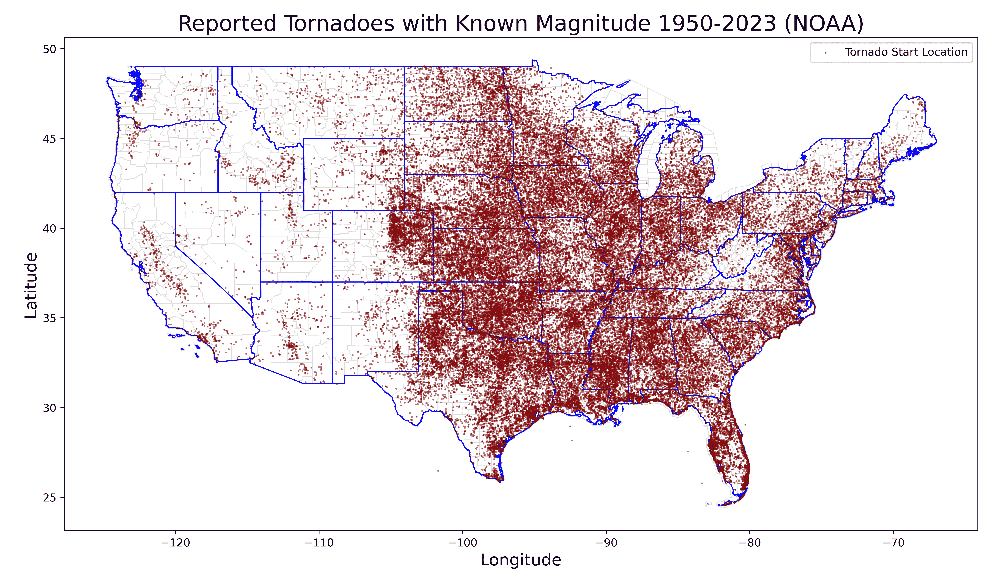

1950-2023 年间报告的具有分配的 EF 等级的龙卷风（作者提供）

如果你对研究龙卷风感兴趣，*国家海洋和大气管理局（NOAA）*有一个很棒的公有领域数据库，让你的研究更加方便。该数据库追溯到 1950 年，涵盖了龙卷风的起始和结束位置、强度、伤害、死亡人数、经济损失等。

数据可以通过 NOAA 的*[风暴预测中心](https://www.spc.noaa.gov/wcm/)*获取。除了原始数据外，该网站还提供了许多图表和地图，以多种方式对数据进行切片和切块。我最喜欢的地图是 20 年的严重天气监视平均数。它使得俄克拉荷马州的边界看起来大部分是基于恶劣天气的！

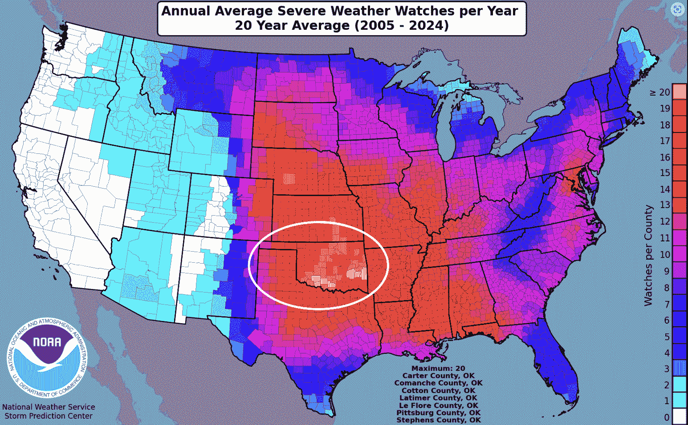

俄克拉荷马州（圈出）经历的恶劣天气比其份额多([NOAA](https://www.spc.noaa.gov/wcm/20ywatcha.png))

这些预制地图很有用，但它们不能解决每一种情况。有时你需要制作*自定义*地图，要么是为了回答特定问题，要么是为了整合外部数据。

在这个*快速成功数据科学*项目中，我们将使用 Python、pygris、GeoPandas、Plotly Express 以及 NOAA 广泛数据库的一部分来绘制龙卷风发生地点、图表其频率和强度，以及绘制生命损失图。

* * *

## 数据集

下图中的 CSV 格式数据集，黄色高亮显示，涵盖了 1950-2023 年期间。请勿下载。为了方便，我在代码中提供了一个链接，可以编程访问它。

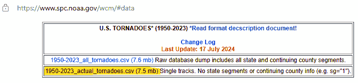

来自 NOAA 严重天气数据库页面（作者提供）

此 CSV 文件包含 29 列。您可以在[这里](https://www.spc.noaa.gov/wcm/data/SPC_severe_database_description.pdf)找到列名的键。我们将主要使用龙卷风起始位置（`slat`，`slon`），年份（`yr`）和月份（`mo`），风暴强度（`mag`）以及死亡人数（`fat`）。

如前所述，这些数据属于[公有领域](https://www.climate.gov/faqs)。任何归功于 NOAA Climate.gov 的内容都可以自由重新使用，只要适当注明出处。

* * *

## 安装库

你可能还需要安装[Matplotlib](https://matplotlib.org/stable/users/getting_started/)、[GeoPandas](https://geopandas.org/en/stable/getting_started/install.html)、[Plotly Express](https://pypi.org/project/plotly-express/)和 Pygris。前面的链接提供了安装说明。

你可能还需要为 Plotly Express 安装*nbformat*。你可以通过以下方式之一完成此操作：

`pip install nbformat`

或者

`conda install nbformat`

或者

`conda install anaconda::nbformat`

> **注意：** *`pygris`*必须使用*`pip`*安装。如果你使用 conda 环境，最佳实践是在最后安装*`pygris`*。

***

## 地图代码

以下代码，用 JupyterLab 编写，绘制了美国下 48 个州龙卷风的起始位置。我们首先绘制整个数据集（近 69,000 个龙卷风！）然后按年份和震级绘制子集。

### 导入库

导入的库支持我们在本项目中产生的地图和图表。`calendar`模块将帮助我们将*数值*月份转换为月份名称*缩写*。

我们将使用流行的`matplotlib`库来制作静态图表，并使用`geopandas`处理地理空间数据。Pandas 将帮助加载数据和处理数据。（因为`geopandas`包含`pandas`作为依赖项，所以没有必要单独安装）。GeoPandas 包含`shapely`，我们将使用它从 CSV 文件创建一个具有地理空间意识的 GeoDataFrame。

最后，`pygris`模块提供了方便访问和加载[美国人口普查局 TIGER/Line](https://www.census.gov/geographies/mapping-files/time-series/geo/tiger-line-file.html)地图边界形状文件的功能。这使得我们可以绘制美国州和县的边界。

```py
# Plot all tornadoes (1950-2023) with a known EF magnitude:

import calendar
import matplotlib.pyplot as plt
import pandas as pd
import geopandas as gpd
from shapely.geometry import Point, box
from pygris import states, counties
```

### 加载数据和准备 GeoDataFrame

NOAA CSV 文件存储在一个 Gist 上以方便使用。我们将首先将其加载为一个 pandas DataFrame，然后过滤掉非连续的美国组成部分。

```py
# Load the CSV file into a DataFrame 
df_raw = pd.read_csv('https://bit.ly/40xJCMK')

# Filter out Alaska, Hawaii, Puerto Rico, and Virgin Islands:
df = df_raw[~df_raw['st'].isin(['AK', 'HI', 'PR', 'VI'])]

# Create a GeoDataFrame for the data points
geometry = gpd.array.from_shapely([Point(xy) for xy in zip(df['slon'], 
                                                           df['slat'])])
gdf = gpd.GeoDataFrame(df, geometry=geometry, crs="EPSG:4326")

# Filter out rows where magnitude is -9 (unknown):
gdf = gdf[(gdf['mag'] != -9)]
```

注意，第二行中的波浪号(`~`)是否定布尔序列。因此，我们告诉 pandas 给我们一个没有列出州的 DataFrame。

CSV 文件中的主要地理空间数据是纬度(`slat`)和经度(`slon`)列。我们将使用 GeoPandas 和 Shapely 将这些转换为几何列，这是 GeoDataFrames 与 DataFrames 的区别所在。我们还将分配一个坐标参考系统(`crs`)，这样 GeoPandas 就知道如何将数据投影到平面上。（有关 GeoDataFrames 和投影系统的更多信息，请参阅这篇文章）：

[`towardsdatascience.com/comparing-country-sizes-with-geopandas-2ce027282ba0`](https://towardsdatascience.com/comparing-country-sizes-with-geopandas-2ce027282ba0)

最后一步过滤掉没有分配震级值（未知=-9）的龙卷风。我们这样做是为了稍后可以处理震级值。这从数据集中移除了大约 1,000 个龙卷风：

```py
# Count the number of occurrences of -9 in the 'mag' column:
num_negative_nines = (df['mag'] == -9).sum()
print(f"Number of -9 values in the 'mag' column: {num_negative_nines}")
```

```py
Number of -9 values in the 'mag' column: 1024
```

### 准备县和州边界

`pygris`库提供了访问官方美国人口普查政治边界形状文件的便捷途径。以下代码使用`pygris`和 GeoPandas 来准备我们将绘制龙卷风数据的地图。

```py
# Load the U.S. census state boundaries using pygris:
states_df = states(year=2020)  
states_gdf = gpd.GeoDataFrame(states_df)

# Load the U.S. census county boundaries using pygris:
counties_df = counties(year=2020)  #
counties_gdf = gpd.GeoDataFrame(counties_df)

# Filter for the contiguous US:
states_gdf = states_gdf[~states_gdf['STUSPS'].isin(['AK', 'HI', 'PR', 'VI'])]
counties_gdf = counties_gdf[~counties_gdf['STATEFP'].isin(
    ['02', '15', '72', '78'])]  # FIPS state codes for AK, HI, PR, VI

# Create a bounding box for the specified map bounds:
bounds_box = box(-127, 23, -67, 50)  # (min_lon, min_lat, max_lon, max_lat)

# Clip the GeoDataFrames to the bounding box:
clipped_states = gpd.clip(states_gdf, bounds_box)
clipped_counties = gpd.clip(counties_gdf, bounds_box)
```

我们首先调用`pygris`的`states`和`counties`模块，它们返回 DataFrames。这些 DataFrame 中的每一个都被传递给 GeoPandas 的`GeoDataFrame()`类，以创建 GeoDataFrame。

下面是`states_gdf` GeoDataFrame 的前几行示例：

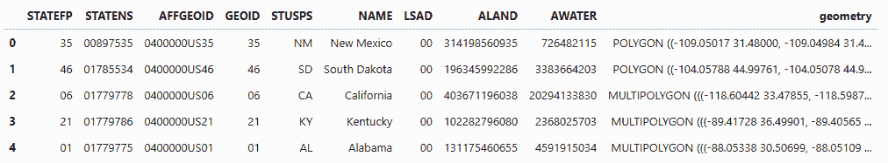

First 5 rows of the states_gdf GeoDataFrame (by the author)

接下来，我们使用`states_gdf`的"STUSPS"列来过滤掉不在下 48 州内的州和领地。然后我们使用"STSTEFP"列中的 FIPS 州代码来过滤掉这些排除州中的县，从`counties_gdf` GeoDataFrame 中。

> FIPS 州代码是一个在*U.S. Federal Information Processing Standard Publication ("FIPS PUB") 5–2*中定义的数字代码，用于识别美国各州和其他相关区域。您可以在[这里](https://www.census.gov/library/reference/code-lists/ansi.html)找到这些代码。

最后两个步骤创建了一个包含整个美国大陆的边界框，然后使用它来裁剪 GeoDataFrames。在我看来，这会产生一个看起来更好的地图。

### 绘制地图

现在我们使用 Matplotlib 和 GeoPandas 来绘制数据。虽然 GeoPandas 建立在 Matplotlib 之上，可以不使用它进行绘图，但使用 Matplotlib 可以得到更精细的结果。

```py
# Plot the filtered data:
fig, ax = plt.subplots(1, 1, figsize=(15, 12))

# Plot the county and state borders:
clipped_counties.plot(ax=ax, 
                      color='none', 
                      edgecolor='gainsboro', 
                      linewidth=0.5)

clipped_states.plot(ax=ax, 
                    color='none', 
                    edgecolor='blue',
                    linewidth=1)

# Plot the tornado locations:
gdf.plot(ax=ax, 
         color='maroon', 
         marker='.', 
         markersize=1, 
         alpha=0.5,
         label='Tornado Start Location')

plt.title('Reported Tornadoes with Known Magnitude 1950-2023 (NOAA)', 
          fontsize=20)
plt.xlabel('Longitude', fontsize=15)
plt.ylabel('Latitude', fontsize=15)
plt.legend()

plt.show()
```

这段代码有注释且简单易懂。但要注意的一点是，我们只绘制了龙卷风的*首次报告位置*（`slat`和`slon`中的"s"代表"start"）。结束位置（`elat`和`elon`）也包含在 NOAA 数据中，您可以使用它们来绘制龙卷风轨迹。

下面是结果，显示了近 70,000 次龙卷风：


1950–2023 年间已知强度所有龙卷风的起始位置（作者提供）

仔细观察这张地图。你应该能够识别出主要城市（如休斯顿、达拉斯和俄克拉荷马城）以及主要道路（如圣安东尼奥和达拉斯之间的 I-35，以及穿越密西西比州中部和路易斯安那州北部的 I-20）。这是因为人口和雷达站越多，检测到龙卷风就越容易。

这张地图的另一个有趣方面是，"[龙卷风走廊](https://en.wikipedia.org/wiki/Tornado_Alley)"，历史上位于德克萨斯州、俄克拉荷马州、堪萨斯州、南达科他州、爱荷华州和内布拉斯加州等中西部州，正在向*东扩展*。事实上，一个新的术语"[迪西走廊](https://en.wikipedia.org/wiki/Dixie_Alley)"现在被应用于东南部各州，尤其是密西西比州和阿拉巴马州。为了看到这一点，我们可以从 1950 年到 1978 年和 1980 年到 2009 年的两个 30 年时间段绘制数据：

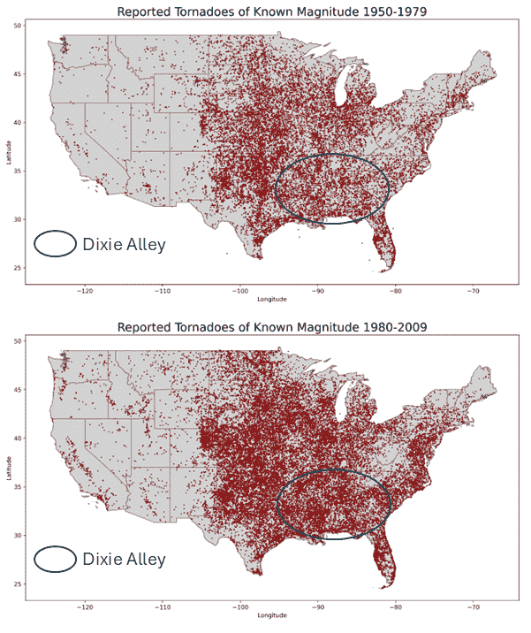

1950–1979 年与 1980–2009 年报告的风暴比较显示报告数量增加，并形成了“迪克西走廊”。（作者制）

> **注意：**多普勒天气雷达网络的广泛应用，特别是[NEXRAD 网络](https://www.test.roc.noaa.gov/branches/program-branch/site-id-database/site-id-location-maps.php)，从大约 1990 年开始极大地提高了风暴预测和检测能力。

在 NOAA 网站上的这个 KDE 地图上，“迪克西走廊”甚至更加明显：

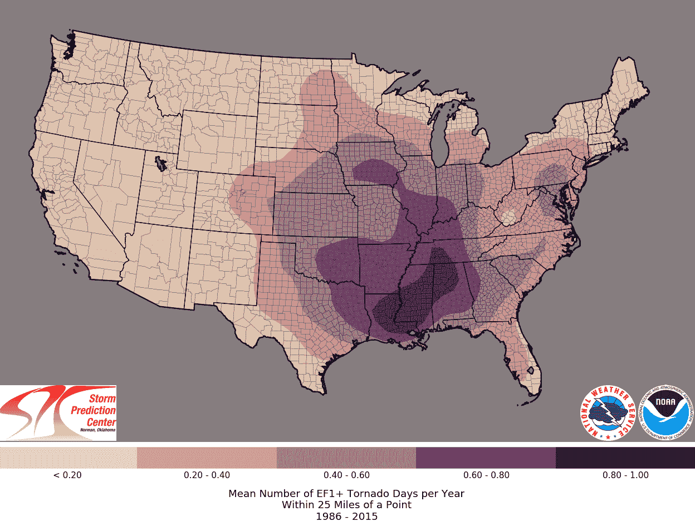

每年 25 英里范围内 EF1 级及以上风暴日的平均数量（1986–2015）([NOAA](https://www.spc.noaa.gov/wcm/#20yavg))

### 映射单年的龙卷风爆发

接下来，我们将利用之前的代码来查看 2023 年发生的风暴（2024 年的数据集尚未最终确定）。这涉及到将原始 GeoDataFrame 复制到一个名为`gdf_2023`的新 GeoDataFrame 中，并过滤掉所有“yr”列不是 2023 年的行：

```py
# 2023 tornadoes with county boundaries:

# Copy the original GDF:
gdf_2023 = gdf.copy()

# Filter for rows where the year is 2023:
gdf_2023 = gdf[(gdf['yr'] == 2023)]

# Plot the filtered data:
fig, ax = plt.subplots(1, 1, figsize=(15, 12))
clipped_counties.plot(ax=ax, 
                      color='none', 
                      edgecolor='gainsboro', 
                      linewidth=0.5)

clipped_states.plot(ax=ax, 
                    color='none', 
                    edgecolor='dimgrey', 
                    linewidth=1)

gdf_2023.plot(ax=ax, 
              color='maroon', 
              marker='v', 
              markersize=14, 
              label='Tornado Start Location')

plt.title('Reported Tornadoes with Known Magnitude 2023 (NOAA)', 
          fontsize=20)
plt.xlabel('Longitude', fontsize=15)
plt.ylabel('Latitude', fontsize=15)
plt.legend()

plt.show()
```

这是结果。注意，*倒三角形*标记样式(`'v'`)类似于小龙卷风。永远不要放弃追求充满活力的生活！

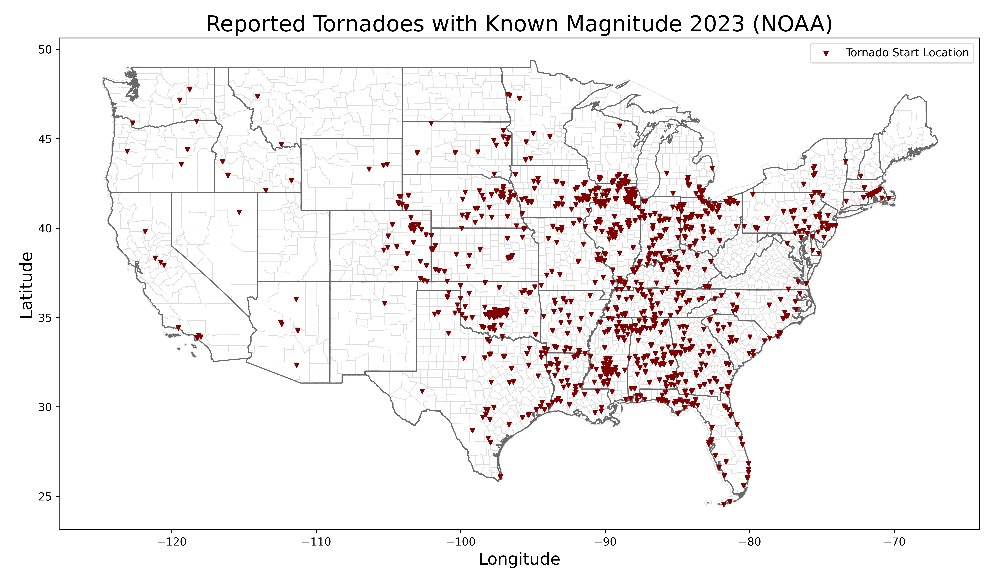

2023 年分配了 EF 等级的风暴图（作者制）

“迪克西走廊”在这张图上表现得非常明显。俄克拉荷马州和密西西比州似乎在争夺“风暴最频繁的州”的称号。

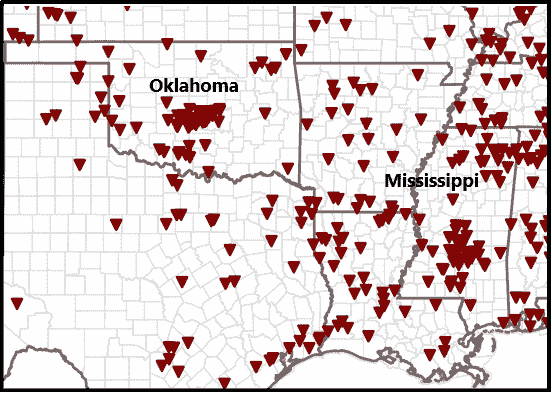

2023 年美国中南部风暴图（作者制）

同样引人注目的是墨西哥湾和大西洋沿岸线上的风暴。这些风暴可能是由飓风或热带风暴引发的。

### 映射强度

2007 年，*[增强富吉塔等级](https://www.weather.gov/oun/efscale)，*或*EF 等级*，开始投入使用。这个等级使用估计的风速和相关损害来为每个龙卷风分配 0 到 5 的评级，5 表示最强。

以下代码将最弱的风暴（EF0–1）和最强的风暴（EF2–5）分离出来，并使用不同的颜色进行映射。

```py
# Plot EF0-1 and EF2-5 tornadoes separately:

# Ensure gdf_2023 is a copy, not a view:
gdf_2023_colors = gdf_2023.copy()

# Plot tornadoes with dynamic coloring and z-order:
fig, ax = plt.subplots(1, 1, figsize=(15, 12))

# Plot counties and states:
clipped_counties.plot(ax=ax, 
                      color='none', 
                      edgecolor='gainsboro', 
                      linewidth=0.5, 
                      zorder=1)

clipped_states.plot(ax=ax, 
                    color='none', 
                    edgecolor='dimgrey', 
                    linewidth=1, 
                    zorder=2)

# Plot magnitude 2+ tornadoes (maroon) with a lower z-order (on top):
gdf_2023_colors[gdf_2023_colors['mag'] >= 2].plot(ax=ax,
                                                  color='maroon',
                                                  marker='v',
                                                  markersize=14,
                                                  zorder=4,
                                                  label='EF 2+')

gdf_2023_colors[gdf_2023_colors['mag'] <= 1].plot(ax=ax,
                                                  color='goldenrod',
                                                  alpha=0.6,
                                                  marker='v',
                                                  markersize=14,
                                                  zorder=3,
                                                  label='EF 0-1')

# Add titles and labels:
plt.title('Tornadoes Reported in 2023 by Magnitude (NOAA)', 
          fontsize=20)
plt.xlabel('Longitude', fontsize=15)
plt.ylabel('Latitude', fontsize=15)

# Add legend with title:
plt.legend(loc='lower left', 
           title="Tornado Starting Location", 
           shadow=True, 
           fancybox=True)

plt.show()
```

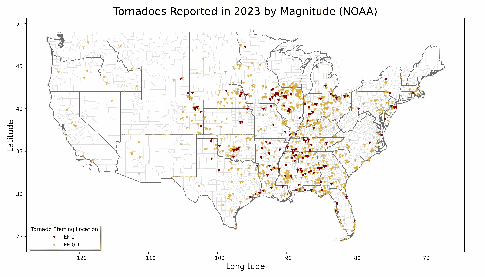

2023 年按强度分组的风暴颜色编码图（作者制）

注意到更严重的风暴（深红色）通常位于密西西比河附近或其东边，而不是历史上的“龙卷风走廊”的中西部。

### 奖励：使用 Plotly Express 绘制 2023 年龙卷风图

到目前为止，我们一直在使用 Matplotlib/GeoPandas 进行绘图。为了获得更交互式的图表，你可以使用*[Plotly Express](https://plotly.com/python/plotly-express/)*库。这也消除了对 GeoPandas 的需求，因为 Plotly Express 与具有纬度和经度列的 pandas DataFrames 一起工作。

以下代码绘制了 2023 年报告的龙卷风位置。

```py
# Plot 2023 tornadoes with Plotly Express:

import pandas as pd
import plotly.express as px
from IPython.display import display

# Load the CSV file into a DataFrame
csv_file = "1950-2023_actual_tornadoes.csv"
df_raw = pd.read_csv(csv_file)

# Filter out rows where magnitude (F-scale) is -9 (unknown):
df = df_raw[df_raw['mag'] != -9]

# Filter for rows where the year is 2023:
df_2023 = df.query('yr == 2023').copy()

# Convert 'mag' to a string (object) column for discrete color mapping:
df_2023['mag'] = df_2023['mag'].astype(object)

# Specify a discrete color scale:
color_scale = px.colors.qualitative.Set1

# Make plot:
fig = px.scatter_geo(df_2023,
                     lat='slat',
                     lon='slon',
                     color='mag',  # Color points by magnitude
                     size=df_2023['mag'].astype(float),
                     size_max=12,
                     hover_name='st',  # state abbreviation
                     hover_data={'yr': True,  # year
                                 'mag': True,  # magnitude
                                 'fat': True},  # fatalities
                     title="Tornadoes Reported in 2023 (NOAA)",
                     scope="usa",
                     projection="albers usa",
                     labels={'mag': 'Magnitude'},
                     color_discrete_sequence=color_scale)

# Customize layout for better display in Jupyter Notebook:
fig.update_layout(geo=dict(showland=True,
                           landcolor="lightgray",
                           showlakes=True,
                           lakecolor="lightblue",
                           showcountries=True,
                           countrycolor="white"),
                  width=1200,
                  height=800,
                  autosize=True,
                  margin=dict(l=50, r=50, t=100, b=50),
                  title=dict(y=0.95,
                             x=0.5,
                             xanchor="center",
                             yanchor="top",
                             font=dict(size=18)))

# Use an upside-down triangle to resemble tornadoes:
fig.update_traces(marker=dict(symbol="triangle-down"))

# Display the plot
display(fig)
```

下面是输出结果：

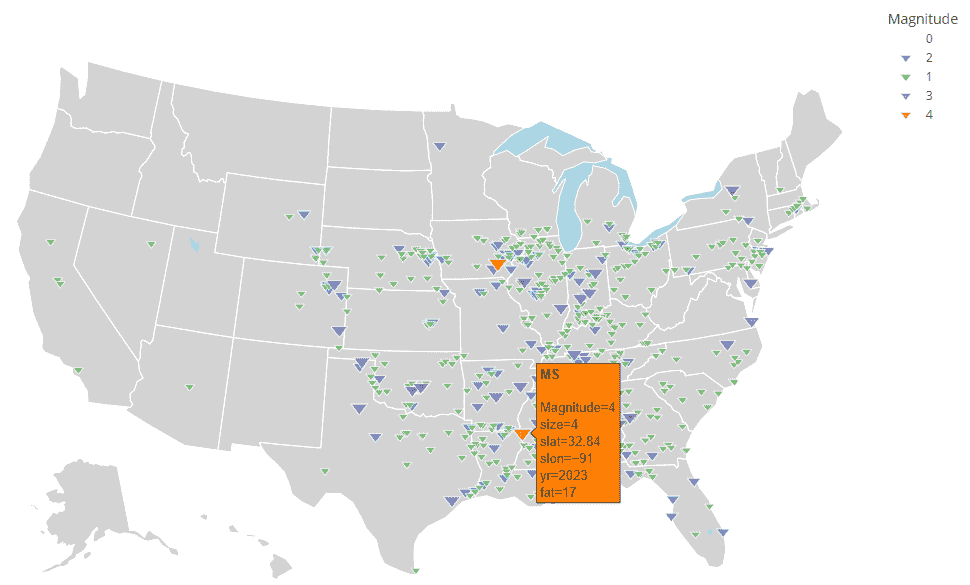

显示悬停窗口动作的 Plotly Express 图形（作者）

虽然我更喜欢基于 Matplotlib 的地图的外观，但 Plotly Express 允许许多有用的功能，如缩放、平移以及通过悬停窗口查看详细点数据。

* * *

## 绘图代码

你可以用不仅仅是地图的方式来可视化 NOAA 数据。在本节中，我们将制作各种图表来分析龙卷风频率、EF 等级和每 EF 等级的死亡人数。

### 每年龙卷风数量

首先，我们将查看每年发生的龙卷风数量。这次，我们将包括大约一千次没有记录 EF 等级的龙卷风。

```py
# Make bar chart of number of tornadoes per year:

# Load the CSV file into a DataFrame:
df = pd.read_csv('https://bit.ly/40xJCMK')

# Filter out Alaska, Hawaii, Puerto Rico, and Virgin Islands:
df = df[~df_raw['st'].isin(['AK', 'HI', 'PR', 'VI'])]

# Group by the year column and count the number of tornadoes per year:
tornadoes_per_year = df.groupby('yr').size()

# Create the bar chart
fig, ax = plt.subplots(figsize=(15, 8))
ax.bar(tornadoes_per_year.index, tornadoes_per_year.values, 
       color='dimgrey', 
       alpha=0.8)

# Add a horizontal line with arrows from 1990 to 1995:
start_year = 1990
end_year = 1995
y_position = tornadoes_per_year.max() * 0.81

# Plot the horizontal line with arrows:
ax.annotate('', 
            xy=(end_year, y_position), 
            xytext=(start_year, y_position),
            arrowprops=dict(arrowstyle='<->', 
                            color='firebrick', 
                            lw=2))

# Add annotation text above the line:
ax.text((start_year + end_year) / 2,
        y_position + tornadoes_per_year.max() * 0.03,
        "NEXRAD Doppler Radar Deployed", 
        color='firebrick', 
        fontsize=13, 
        ha='center')

# Add labels and title:
ax.set_title('Number of Tornadoes per Year (1950-2023)', 
             fontsize=18)
ax.set_xlabel('Year', fontsize=16)
ax.set_ylabel('Number of Tornadoes', fontsize=16)
ax.grid(axis='y', linestyle='--', alpha=0.7)

plt.show()
```

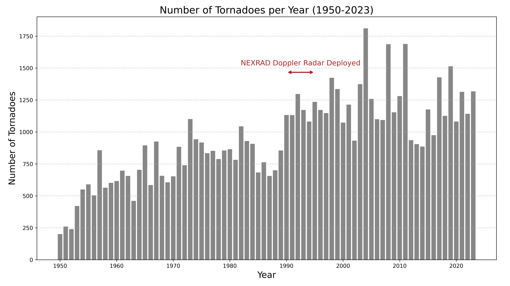

每年龙卷风数量的条形图（1950–2023）（作者）

大约从 1990 年开始的龙卷风数量增加部分是由于 20 世纪 90 年代初至中期部署的 NEXRAD 天气监视雷达网络。虽然气候变化无疑影响了龙卷风的数量，但在解释数据时，重要的是要意识到采样问题。

### 每月龙卷风数量

现在，我们将查看整个时间框架内龙卷风的月度频率。

```py
# Plot reports per month for the full dataset:

# Add a column for month abbreviations:
df.loc[:, 'month_abbr'] = gdf['mo'].apply(lambda x: calendar.month_abbr[x])

# Plot using pandas:
df['month_abbr'].value_counts().reindex(calendar.month_abbr[1:]).plot(
    kind='bar',
    color='firebrick',
    figsize=(10, 6),
    xlabel='Month',
    ylabel='Count',
    title='Reports of Tornadoes by Month (1950-2023)')

plt.xticks(rotation=45) 
plt.grid(axis='y', linestyle='--', alpha=0.7)

plt.show()
```

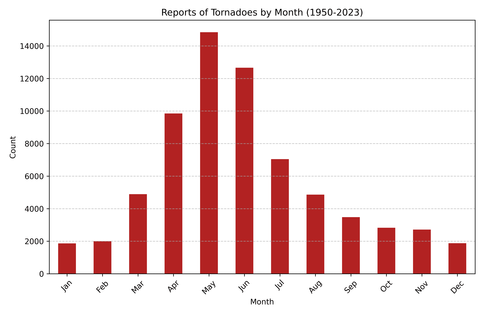

每月报告的龙卷风数量（1950–2023）（作者）

如预期，龙卷风在春季更为常见，此时天气从冬季过渡到夏季。

> **注意：**你可以通过将上一段代码中的`df`改为`gdf`直接从 GeoDataFrame 制作这样的图表。语法是相同的。

### 龙卷风年度计数：累积图

这里有一个问题：“在过去的 15 年里，龙卷风的数量与长期平均数相比是增加还是减少了？”

为了回答这个问题，我们将使用 NOAA 数据制作自 2008 年以来每年每月龙卷风数量的累积图，并将其与整个数据集（1950–2023）每月累积平均数叠加。

下面是注释过的代码：

```py
# Plot cumulative tornado counts vs. month:

# Load the CSV file into a DataFrame:
df_raw = pd.read_csv('https://bit.ly/40xJCMK')

# Filter out Alaska, Hawaii, Puerto Rico, and Virgin Islands:
df = df_raw[~df_raw['st'].isin(['AK', 'HI', 'PR', 'VI'])]

# Define function to group, pivot, and calculate cumulative sums:
def prepare_data(df, start_year=None, end_year=None):
    if start_year and end_year:
        df = df[(df['yr'] >= start_year) &amp; (df['yr'] <= end_year)]
    grouped = df.groupby(['yr', 'mo']).size().reset_index(name='tornado_count')
    pivot = grouped.pivot(index='mo', 
                          columns='yr', 
                          values='tornado_count').fillna(0)
    return pivot.cumsum()

# Calculate cumulative sums for all years and average:
cumulative_all_years = prepare_data(df)
mean_all_years = cumulative_all_years.mean(axis=1)

# Calculate cumulative sums for 2009-2023:
cumulative_counts = prepare_data(df, start_year=2009, end_year=2023)

# Plot the data:
fig, ax = plt.subplots(figsize=(12, 8))
cmap = plt.cm.tab20  # Define the colormap

# Plot each year's cumulative count:
for idx, year in enumerate(cumulative_counts.columns):
    linestyle = 'dashed' if 2009 <= year <= 2016 else 'solid'
    ax.plot(cumulative_counts.index, cumulative_counts[year], 
            label=str(year), 
            color=cmap(idx / len(cumulative_counts.columns)), 
            linestyle=linestyle, alpha=0.7)

# Plot the mean of all years:
ax.plot(mean_all_years.index, mean_all_years, 
        color='k', 
        linewidth=3, 
        label='Mean (1950-2023)')

# Define function to customize the plot:
def customize_plot(ax, title, xlabel, ylabel):
    ax.set_title(title, fontsize=16)
    ax.set_xlabel(xlabel, fontsize=14)
    ax.set_ylabel(ylabel, fontsize=14)
    ax.set_xticks(range(1, 13))
    ax.set_xticklabels(['Jan', 'Feb', 'Mar', 'Apr', 'May', 'Jun', 
                        'Jul', 'Aug', 'Sep', 'Oct', 'Nov', 'Dec'])
    ax.grid(axis='y', linestyle='--', alpha=0.7)

customize_plot(ax=ax, 
               title='Cumulative Tornado Counts vs. Month (2009-2023)', 
               xlabel='Month', 
               ylabel='Cumulative Tornado Count')

# Reverse the order of the legend:
handles, labels = ax.get_legend_handles_labels()
ax.legend(handles[::-1], 
          labels[::-1], 
          loc='upper left', 
          fontsize=10, 
          title="Year")

# Mirror the y-axis on the right side of the plot:
ax2 = ax.twinx()
ax2.set_yticks(ax.get_yticks())
ax2.set_ylim(ax.get_ylim())
ax2.set_yticklabels([int(label) for label in ax.get_yticks()])

# Show the plot:
plt.tight_layout()
plt.show()
```

这里是结果；为了清晰起见，较老的曲线使用虚线：

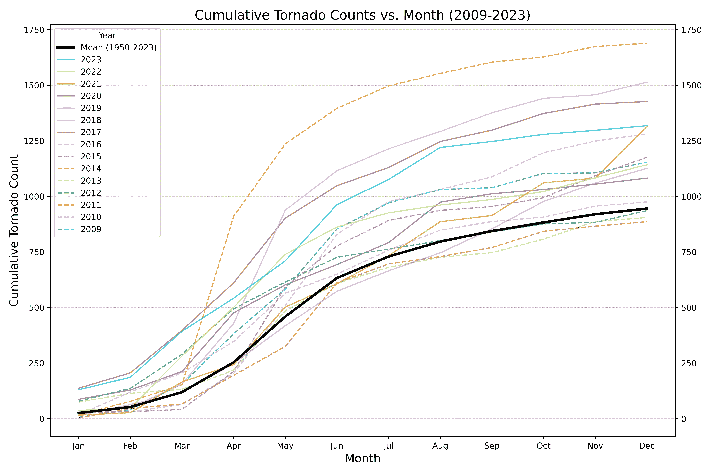

累积龙卷风计数与月份对比，以及 1950–2023 的平均值（作者）

在过去 15 年的大部分时间里，每月和每年的龙卷风数量都超过了长期平均水平。然而，这部分是由于在此期间使用了现代天气监视雷达。如果我们看 1990-2023 年的平均值，在这些新系统广泛使用时，这种关系更为合理：

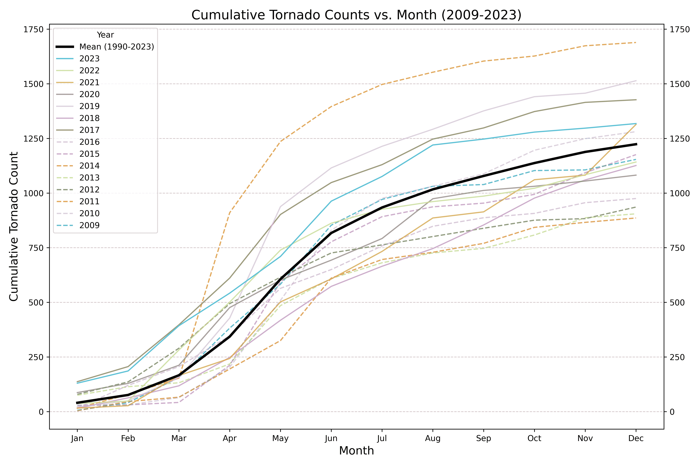

龙卷风累计数量与月份对比，1990-2023 年平均值（作者）

> 根据[初步报告](https://en.wikipedia.org/wiki/Tornadoes_of_2024)，2024 年将成为继 2004 年之后的第二活跃的龙卷风年，共有至少 1777 起龙卷风被确认，而报告总数为 1880 起。只有 2004 年有更多的龙卷风，共有 1817 起。

### 按 EF 等级划分的龙卷风数量

现在，我们将按 EF 等级计算龙卷风数量，其中 0 是最弱的，5 是最强的。我们将对整个数据集（1950-2023 年）进行此操作。

```py
# Calculate number of reported tornadoes by EF magnitude:
magnitude_counts = df['mag'].value_counts().sort_index()

# Chart tornadoes by magnitude:
plt.figure(figsize=(10, 6))
bars = plt.bar(magnitude_counts.index, magnitude_counts.values,
               color='maroon', 
               alpha=0.8)

# Annotate each bar with the value:
for bar in bars:
    height = bar.get_height()  # Get the height of the bar
    plt.text(bar.get_x() + bar.get_width() / 2,  # center of bar)
             height + 5,                         # Y-coordinate above bar
             f'{int(height):,}',                 # Text to display
             ha='center',                        # Center text
             va='bottom',                        # Align text below Y-coordinate
             fontsize=10,                        
             color='maroon')                     

# Customize the plot:
plt.xlabel('Tornado Magnitude (EF-scale)')
plt.ylabel('Number of Reported Tornadoes')
plt.title('Tornadoes by EF Magnitude (1950-2023)')
plt.grid(axis='y', linestyle='--', alpha=0.7)
plt.xticks([-9, 0, 1, 2, 3, 4, 5])

# Show the plot:
plt.tight_layout()
plt.show()
```

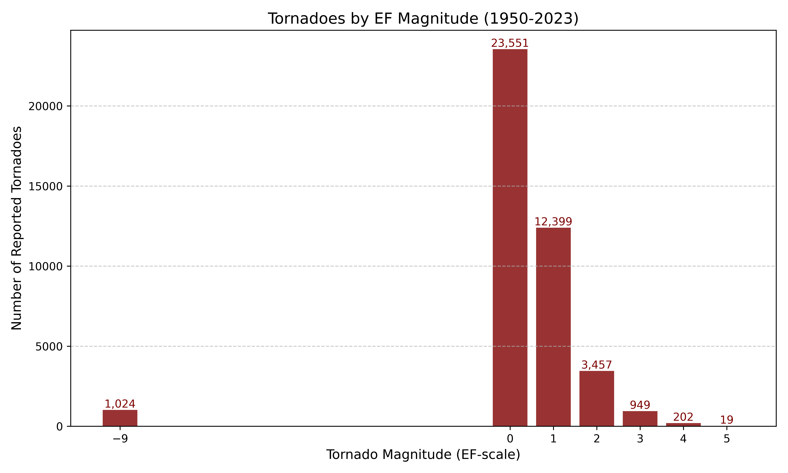

按 EF 等级划分的龙卷风数量（-9 = 未知等级）（作者）

-9 的等级代表一个*未知*的 EF 等级。对于 0-5 的等级，其行为是合理的。最弱的龙卷风是最常见的，而最强的（EF4-5）则相对罕见。

### 按 EF 等级划分的死亡人数

这里有一个有趣的问题：*你认为 EF1 风暴会因数量众多而导致更多死亡，还是 EF5 风暴会因强度大而导致更多死亡？*

让我们来看看：

```py
# Calculate number of fatalities by EF magnitude:
fatalities_by_magnitude = df.groupby('mag')['fat'].sum()

# Chart fatalities by magnitude:
plt.figure(figsize=(10, 6))
plt.bar(fatalities_by_magnitude.index, fatalities_by_magnitude.values,
        color='orange', 
        alpha=0.8)
plt.xlabel('Tornado Magnitude (EF-value)')
plt.ylabel('Total Fatalities')
plt.title('Total Fatalities by Tornado EF Magnitude')
plt.grid(axis='y', linestyle='--', alpha=0.7)
plt.xticks([-9, 0, 1, 2, 3, 4, 5])

plt.show()
```

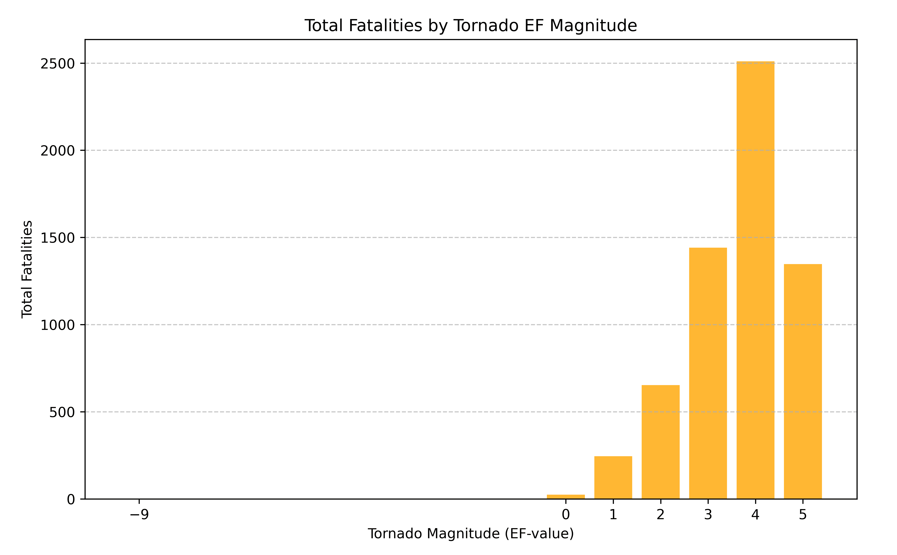

按 EF 等级划分的死亡人数（1950-2023 年）（作者）

龙卷风在 EF4 级别时变得越来越致命。EF5 龙卷风在技术上比 EF4 龙卷风更致命，但由于其极端罕见，造成的死亡人数较少。

我们在这里就结束了，但请注意，我们只是触及了表面。要查看更多与龙卷风相关的可视化内容，请访问*[严重天气地图、图形和数据页面](https://www.spc.noaa.gov/wcm/#stats)*，以及 NOAA 的*[风暴预测中心](https://www.spc.noaa.gov/)*网站的其他部分。

***

## 龙卷风走廊和百慕大经线

如前所述，著名的“龙卷风走廊”一直在向东迁移。有趣的是，另一个著名的气候特征，“百慕大经线”也在向东移动。这条垂直边界标志着干旱的西部与湿润的东部之间的分界线。科学家们现在认为它更接近 98 度经线，位于德克萨斯州的达拉斯-沃斯堡都会区以西。这代表着自 19 世纪末首次被识别以来，向东移动了大约 140 英里（224 公里）。

你可以在这里了解更多相关信息：

> [**用 Plotly Express 讲述气候故事**](https://betterprogramming.pub/tell-a-climate-story-with-plotly-express-bca33a723bc4)

***

## 摘要

在这个项目中，我们使用了[免费的 NOAA 数据](https://www.spc.noaa.gov/wcm/#data)来调查从 1950 年到 2023 年美国本土的龙卷风统计数据。虽然我们使用了 Matplotlib、GeoPandas 和 pandas 生成了静态地图和图表，但我们还研究了 Plotly Express 作为动态映射的替代方案。

* * *

## 谢谢！

感谢阅读，请关注我，未来将有更多“快速成功数据科学”项目分享。
