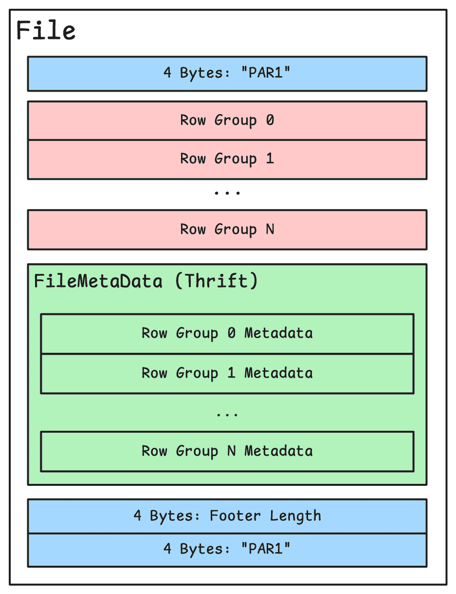
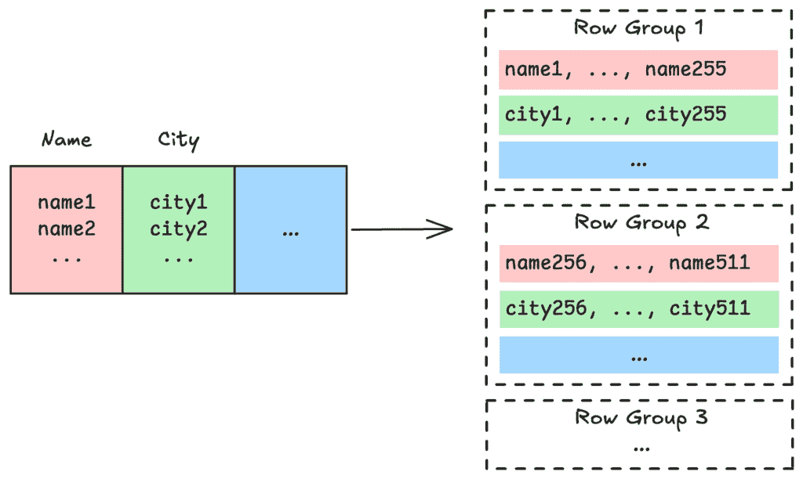
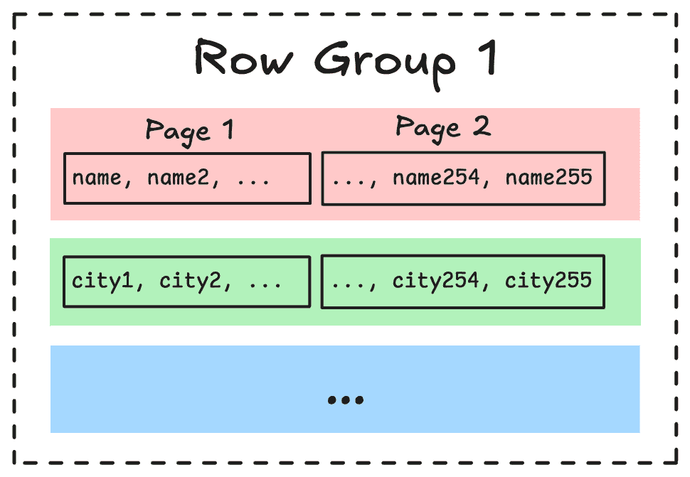
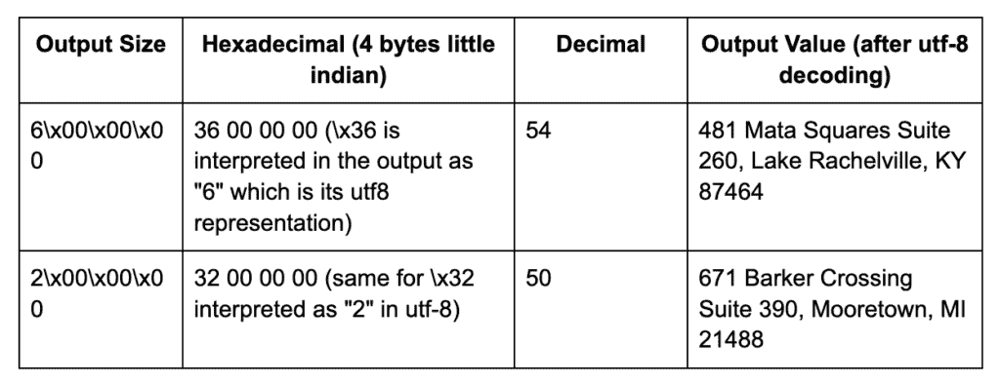

# Parquet 文件的结构

> 原文：[`towardsdatascience.com/anatomy-of-a-parquet-file/`](https://towardsdatascience.com/anatomy-of-a-parquet-file/)

近年来，Parquet 已成为大数据生态系统中的数据存储标准格式。其列式格式提供了几个优点：

+   当只处理子集列时，查询执行速度更快

+   快速计算所有数据的统计信息

+   由于高效的压缩，存储体积减少

当与 Delta Lake 或 Apache Iceberg 等存储框架结合使用时，它可以无缝集成到查询引擎（例如，Trino）和数据仓库计算集群（例如，Snowflake，BigQuery）。在本文中，主要使用标准的 Python 工具剖析 Parquet 文件的内容，以更好地理解其结构和它如何贡献于这些性能。

## 编写 Parquet 文件（们）

要生成 Parquet 文件，我们使用 PyArrow，它是 Apache Arrow 的 Python 绑定，以列式格式在内存中存储数据框。PyArrow 在写入文件时允许进行细粒度的参数调整。这使得 PyArrow 成为 Parquet 操作的理想选择（也可以简单地使用 [Pandas](https://pandas.pydata.org/docs/reference/api/pandas.DataFrame.to_parquet.html)）。

```py
# generator.py

import pyarrow as pa
import pyarrow.parquet as pq
from faker import Faker

fake = Faker()
Faker.seed(12345)
num_records = 100

# Generate fake data
names = [fake.name() for _ in range(num_records)]
addresses = [fake.address().replace("\n", ", ") for _ in range(num_records)]
birth_dates = [
    fake.date_of_birth(minimum_age=67, maximum_age=75) for _ in range(num_records)
]
cities = [addr.split(", ")[1] for addr in addresses]
birth_years = [date.year for date in birth_dates]

# Cast the data to the Arrow format
name_array = pa.array(names, type=pa.string())
address_array = pa.array(addresses, type=pa.string())
birth_date_array = pa.array(birth_dates, type=pa.date32())
city_array = pa.array(cities, type=pa.string())
birth_year_array = pa.array(birth_years, type=pa.int32())

# Create schema with non-nullable fields
schema = pa.schema(
    [
        pa.field("name", pa.string(), nullable=False),
        pa.field("address", pa.string(), nullable=False),
        pa.field("date_of_birth", pa.date32(), nullable=False),
        pa.field("city", pa.string(), nullable=False),
        pa.field("birth_year", pa.int32(), nullable=False),
    ]
)

table = pa.Table.from_arrays(
    [name_array, address_array, birth_date_array, city_array, birth_year_array],
    schema=schema,
)

print(table)
```

```py
pyarrow.Table
name: string not null
address: string not null
date_of_birth: date32[day] not null
city: string not null
birth_year: int32 not null
----
name: [["Adam Bryan","Jacob Lee","Candice Martinez","Justin Thompson","Heather Rubio"]]
address: [["822 Jennifer Field Suite 507, Anthonyhaven, UT 98088","292 Garcia Mall, Lake Belindafurt, IN 69129","31738 Jonathan Mews Apt. 024, East Tammiestad, ND 45323","00716 Kristina Trail Suite 381, Howelltown, SC 64961","351 Christopher Expressway Suite 332, West Edward, CO 68607"]]
date_of_birth: [[1955-06-03,1950-06-24,1955-01-29,1957-02-18,1956-09-04]]
city: [["Anthonyhaven","Lake Belindafurt","East Tammiestad","Howelltown","West Edward"]]
birth_year: [[1955,1950,1955,1957,1956]]
```

输出清楚地反映了列式存储，与 Pandas 不同，Pandas 通常显示传统的“行式”表格。

## Parquet 文件是如何存储的？

Parquet 文件通常存储在廉价的对象存储数据库中，如 S3（AWS）或 GCS（GCP），以便数据处理管道可以轻松访问。这些文件通常通过利用目录结构采用分区策略进行组织：

```py
# generator.py

num_records = 100

# ...

# Writing the parquet files to disk
pq.write_to_dataset(
    table,
    root_path='dataset',
    partition_cols=['birth_year', 'city']
)
```

如果 `birth_year` 和 `city` 列被定义为分区键，PyArrow 会在目录数据集中创建这样的树结构：

```py
dataset/
├─ birth_year=1949/
├─ birth_year=1950/
│ ├─ city=Aaronbury/
│ │ ├─ 828d313a915a43559f3111ee8d8e6c1a-0.parquet
│ │ ├─ 828d313a915a43559f3111ee8d8e6c1a-0.parquet
│ │ ├─ …
│ ├─ city=Alicialand/
│ ├─ …
├─ birth_year=1951 ├─ ... 
```

该策略启用分区修剪：当查询过滤这些列时，引擎可以使用文件夹名称只读取必要的文件。这就是为什么分区策略对于限制处理大量数据时的延迟、I/O 和计算资源至关重要（几十年来，传统的关系型数据库就是这样做的）。

通过计数一个过滤出生年份的 Python 脚本打开的文件，可以轻松验证修剪效果：

```py
# query.py
import duckdb

duckdb.sql(
    """
    SELECT * 
    FROM read_parquet('dataset/*/*/*.parquet', hive_partitioning = true)
    where birth_year = 1949
    """
).show()
```

```py
> strace -e trace=open,openat,read -f python query.py 2>&1 | grep "dataset/.*\.parquet"

[pid    37] openat(AT_FDCWD, "dataset/birth_year=1949/city=Box%201306/e1ad1666a2144fbc94892d4ac1234c64-0.parquet", O_RDONLY) = 3
[pid    37] openat(AT_FDCWD, "dataset/birth_year=1949/city=Box%201306/e1ad1666a2144fbc94892d4ac1234c64-0.parquet", O_RDONLY) = 3
[pid    39] openat(AT_FDCWD, "dataset/birth_year=1949/city=Box%201306/e1ad1666a2144fbc94892d4ac1234c64-0.parquet", O_RDONLY) = 4
[pid    39] openat(AT_FDCWD, "dataset/birth_year=1949/city=Box%203487/e1ad1666a2144fbc94892d4ac1234c64-0.parquet", O_RDONLY) = 5
[pid    39] openat(AT_FDCWD, "dataset/birth_year=1949/city=Box%203487/e1ad1666a2144fbc94892d4ac1234c64-0.parquet", O_RDONLY) = 3
[pid    39] openat(AT_FDCWD, "dataset/birth_year=1949/city=Clarkemouth/e1ad1666a2144fbc94892d4ac1234c64-0.parquet", O_RDONLY) = 4
[pid    39] openat(AT_FDCWD, "dataset/birth_year=1949/city=Clarkemouth/e1ad1666a2144fbc94892d4ac1234c64-0.parquet", O_RDONLY) = 5
[pid    39] openat(AT_FDCWD, "dataset/birth_year=1949/city=DPO%20AP%2020198/e1ad1666a2144fbc94892d4ac1234c64-0.parquet", O_RDONLY) = 3
[pid    39] openat(AT_FDCWD, "dataset/birth_year=1949/city=DPO%20AP%2020198/e1ad1666a2144fbc94892d4ac1234c64-0.parquet", O_RDONLY) = 4
[pid    39] openat(AT_FDCWD, "dataset/birth_year=1949/city=East%20Morgan/e1ad1666a2144fbc94892d4ac1234c64-0.parquet", O_RDONLY) = 5
[pid    39] openat(AT_FDCWD, "dataset/birth_year=1949/city=East%20Morgan/e1ad1666a2144fbc94892d4ac1234c64-0.parquet", O_RDONLY) = 3
[pid    39] openat(AT_FDCWD, "dataset/birth_year=1949/city=FPO%20AA%2006122/e1ad1666a2144fbc94892d4ac1234c64-0.parquet", O_RDONLY) = 4
[pid    39] openat(AT_FDCWD, "dataset/birth_year=1949/city=FPO%20AA%2006122/e1ad1666a2144fbc94892d4ac1234c64-0.parquet", O_RDONLY) = 5
[pid    39] openat(AT_FDCWD, "dataset/birth_year=1949/city=New%20Michelleport/e1ad1666a2144fbc94892d4ac1234c64-0.parquet", O_RDONLY) = 3
[pid    39] openat(AT_FDCWD, "dataset/birth_year=1949/city=New%20Michelleport/e1ad1666a2144fbc94892d4ac1234c64-0.parquet", O_RDONLY) = 4
[pid    39] openat(AT_FDCWD, "dataset/birth_year=1949/city=North%20Danielchester/e1ad1666a2144fbc94892d4ac1234c64-0.parquet", O_RDONLY) = 5
[pid    39] openat(AT_FDCWD, "dataset/birth_year=1949/city=North%20Danielchester/e1ad1666a2144fbc94892d4ac1234c64-0.parquet", O_RDONLY) = 3
[pid    39] openat(AT_FDCWD, "dataset/birth_year=1949/city=Port%20Chase/e1ad1666a2144fbc94892d4ac1234c64-0.parquet", O_RDONLY) = 4
[pid    39] openat(AT_FDCWD, "dataset/birth_year=1949/city=Port%20Chase/e1ad1666a2144fbc94892d4ac1234c64-0.parquet", O_RDONLY) = 5
[pid    39] openat(AT_FDCWD, "dataset/birth_year=1949/city=Richardmouth/e1ad1666a2144fbc94892d4ac1234c64-0.parquet", O_RDONLY) = 3
[pid    39] openat(AT_FDCWD, "dataset/birth_year=1949/city=Richardmouth/e1ad1666a2144fbc94892d4ac1234c64-0.parquet", O_RDONLY) = 4
[pid    39] openat(AT_FDCWD, "dataset/birth_year=1949/city=Robbinsshire/e1ad1666a2144fbc94892d4ac1234c64-0.parquet", O_RDONLY) = 5
[pid    39] openat(AT_FDCWD, "dataset/birth_year=1949/city=Robbinsshire/e1ad1666a2144fbc94892d4ac1234c64-0.parquet", O_RDONLY) = 3
```

只需读取 100 个文件中的 23 个。

## 读取原始 Parquet 文件

让我们解码一个没有使用专用库的原始 Parquet 文件。为了简单起见，数据集被导出到一个单独的文件中，没有压缩或编码。

```py
# generator.py

# ...

pq.write_table(
    table,
    "dataset.parquet",
    use_dictionary=False,
    compression="NONE",
    write_statistics=True,
    column_encoding=None,
)
```

首先要知道的是，二进制文件由 4 个字节包围，其 ASCII 表示为“PAR1”。如果情况不是这样，则文件已损坏。

```py
# reader.py

with open("dataset.parquet", "rb") as file:
    parquet_data = file.read()

assert parquet_data[:4] == b"PAR1", "Not a valid parquet file"
assert parquet_data[-4:] == b"PAR1", "File footer is corrupted"
```

如 [文档](https://parquet.apache.org/docs/file-format/) 所示，文件分为两部分：包含实际数据的“行组”和包含元数据（以下为模式）的尾部。



### 尾部

页脚的大小在结束标记之前的 4 个字节中指示，以“小端”格式（在`unpack`函数中记为“<I”）的无符号整数表示。

```py
# reader.py

import struct

# ...

footer_length = struct.unpack("<I", parquet_data[-8:-4])[0]
print(f"Footer size in bytes: {footer_length}")

footer_start = len(parquet_data) - footer_length - 8
footer_data = parquet_data[footer_start:-8]
```

```py
Footer size in bytes: 1088
```

页脚信息使用名为[Apache Thrift](https://thrift.apache.org/)的跨语言序列化格式进行编码。使用类似于 JSON 的人可读但冗长的格式，然后将其转换为二进制，在内存使用方面将不太高效。使用 Thrift，可以如下声明数据结构：

```py
struct Customer {
	1: required string name,
	2: optional i16 birthYear,
	3: optional list<string> interests
}
```

基于这个声明，Thrift 可以生成 Python 代码来解码具有这种数据结构的字节字符串（它也生成了执行编码部分的代码）。包含 Parquet 文件中实现的所有数据结构的 thrift 文件可以在此处下载[这里](https://github.com/apache/parquet-format/blob/master/src/main/thrift/parquet.thrift)。安装了 thrift 二进制文件后，让我们运行：

```py
thrift -r --gen py parquet.thrift
```

生成的 Python 代码放置在“gen-py”文件夹中。页脚的数据结构由 FileMetaData 类表示——这是一个从 Thrift 模式自动生成的 Python 类。使用 Thrift 的 Python 实用工具，二进制数据被解析并填充到这个 FileMetaData 类的实例中。

```py
# reader.py

import sys

# ...

# Add the generated classes to the python path
sys.path.append("gen-py")
from parquet.ttypes import FileMetaData, PageHeader
from thrift.transport import TTransport
from thrift.protocol import TCompactProtocol

def read_thrift(data, thrift_instance):
    """
    Read a Thrift object from a binary buffer.
    Returns the Thrift object and the number of bytes read.
    """
    transport = TTransport.TMemoryBuffer(data)
    protocol = TCompactProtocol.TCompactProtocol(transport)
    thrift_instance.read(protocol)
    return thrift_instance, transport._buffer.tell()

# The number of bytes read is not used for now
file_metadata_thrift, _ = read_thrift(footer_data, FileMetaData())

print(f"Number of rows in the whole file: {file_metadata_thrift.num_rows}")
print(f"Number of row groups: {len(file_metadata_thrift.row_groups)}")

Number of rows in the whole file: 100
Number of row groups: 1
```

页脚包含了关于文件结构和内容的详细信息。例如，它准确地追踪生成的数据框中的行数。这些行都包含在一个单一的“行组”中。*但什么是“行组”呢？*

### **行组**

与纯列导向格式不同，Parquet 采用混合方法。在写入列块之前，数据框首先垂直分区为行组（我们生成的 parquet 文件太小，无法分割成多个行组）。



这种混合结构提供了几个优点：

Parquet 为每个行组内的每个列计算统计数据（如最小/最大值）。这些统计数据对于查询优化至关重要，允许查询引擎跳过不符合过滤条件的整个行组。例如，如果查询过滤为`birth_year > 1955`，而一个行组的最大出生年份是 1954，则引擎可以有效地跳过整个数据部分。这种优化称为“谓词下推”。Parquet 还存储其他有用的统计数据，如不同值计数和空值计数。

```py
# reader.py
# ...

first_row_group = file_metadata_thrift.row_groups[0]
birth_year_column = first_row_group.columns[4]

min_stat_bytes = birth_year_column.meta_data.statistics.min
max_stat_bytes = birth_year_column.meta_data.statistics.max

min_year = struct.unpack("<I", min_stat_bytes)[0]
max_year = struct.unpack("<I", max_stat_bytes)[0]

print(f"The birth year range is between {min_year} and {max_year}")
```

```py
The birth year range is between 1949 and 1958
```

+   行组使数据并行处理成为可能（对于 Apache Spark 等框架尤其有价值）。这些行组的大小可以根据可用的计算资源进行配置（使用 PyArrow 中的`write_table`函数的`row_group_size`属性）。

```py
# generator.py

# ...

pq.write_table(
    table,
    "dataset.parquet",
    row_group_size=100,
)

# /!\ Keep the default value of "row_group_size" for the next parts
```

+   即使这不是列格式的主要目标，Parquet 的混合结构在重建完整行时仍能保持合理的性能。如果没有行组，重建整个行可能需要扫描每个列的全部内容，这对于大文件来说将非常低效。

### **数据页**

Parquet 文件的最小子结构是页面。它包含同一列的值的序列，因此也是同一类型的。页面大小的选择是权衡的结果：

+   较大的页面意味着存储和读取的元数据更少，这对于具有最小过滤器的查询来说是最优的。

+   较小的页面减少了读取的不必要数据量，当查询针对小而分散的数据范围时，这更好。



现在让我们解码地址列的第一页的内容，该列的位置可以在页脚中找到（由右侧`ColumnMetaData`的`data_page_offset`属性给出）。每一页之前都有一个包含一些元数据的 Thrift `PageHeader`对象。偏移量实际上指向页元数据的 Thrift 二进制表示，该表示位于页面本身之前。这个 Thrift 类被称为`PageHeader`，也可以在`gen-py`目录中找到。

> 💡 *在页面标题和页面内实际包含的值之间，可能有一些字节用于实现[*Dremel*](https://static.googleusercontent.com/media/research.google.com/fr//pubs/archive/36632.pdf)格式，该格式允许编码[*嵌套数据结构*](https://parquet.apache.org/docs/file-format/nestedencoding/)。由于我们的数据具有规则的表格格式，且值不是可空的，因此在写入文件时（[*https://parquet.apache.org/docs/file-format/data-pages/*](https://parquet.apache.org/docs/file-format/data-pages/)*）这些字节被跳过。*

```py
# reader.py
# ...

address_column = first_row_group.columns[1]
column_start = address_column.meta_data.data_page_offset
column_end = column_start + address_column.meta_data.total_compressed_size
column_content = parquet_data[column_start:column_end]

page_thrift, page_header_size = read_thrift(column_content, PageHeader())
page_content = column_content[
    page_header_size : (page_header_size + page_thrift.compressed_page_size)
]
print(column_content[:100])
```

```py
b'6\x00\x00\x00481 Mata Squares Suite 260, Lake Rachelville, KY 874642\x00\x00\x00671 Barker Crossing Suite 390, Mooreto'
```

生成的值最终以纯文本形式出现，未编码（如写入 Parquet 文件时指定）。然而，为了优化列格式，建议使用以下编码算法之一：字典编码、运行长度编码（RLE）或 delta 编码（后者保留用于 int32 和 int64 类型），然后使用 gzip 或 snappy 进行压缩（可用的编解码器列表[在此](https://parquet.apache.org/docs/file-format/data-pages/compression/)）。由于编码页面包含相似值（所有地址、所有十进制数字等），压缩比率可以特别有利。

如[规范](https://parquet.apache.org/docs/file-format/data-pages/encodings/)所述，当字符字符串（BYTE_ARRAY）未编码时，每个值之前都有一个表示为 4 字节整数的值大小。这可以从前面的输出中观察到：



要读取所有值（例如，前 10 个），循环相当简单：

```py
idx = 0
for _ in range(10):
    str_size = struct.unpack("<I", page_content[idx : (idx + 4)])[0]
    print(page_content[(idx + 4) : (idx + 4 + str_size)].decode())
    idx += 4 + str_size
```

```py
481 Mata Squares Suite 260, Lake Rachelville, KY 87464
671 Barker Crossing Suite 390, Mooretown, MI 21488
62459 Jordan Knoll Apt. 970, Emilyfort, DC 80068
948 Victor Square Apt. 753, Braybury, RI 67113
365 Edward Place Apt. 162, Calebborough, AL 13037
894 Reed Lock, New Davidmouth, NV 84612
24082 Allison Squares Suite 345, North Sharonberg, WY 97642
00266 Johnson Drives, South Lori, MI 98513
15255 Kelly Plains, Richardmouth, GA 33438
260 Thomas Glens, Port Gabriela, OH 96758
```

我们做到了！我们以一种非常简单的方式成功地重现了专业库如何读取 Parquet 文件。通过理解其构建块，包括头部、尾部、行组和数据页，我们可以更好地欣赏到诸如谓词下推和分区剪枝等特性如何在数据密集型环境中带来如此令人印象深刻的性能优势。我相信了解 Parquet 内部工作原理有助于我们做出更好的存储策略、压缩选择和性能优化的决策。

文章中使用的所有代码都可在我的 GitHub 仓库 [`github.com/kili-mandjaro/anatomy-parquet`](https://github.com/kili-mandjaro/anatomy-parquet) 中找到，您可以在那里探索更多示例并尝试不同的 Parquet 文件配置。

无论您是在构建数据管道、优化查询性能，还是仅仅对数据存储格式感到好奇，我希望对 Parquet 内部结构的深入研究能为您的数据工程之旅提供有价值的见解。

*所有图片均为作者原创。*
