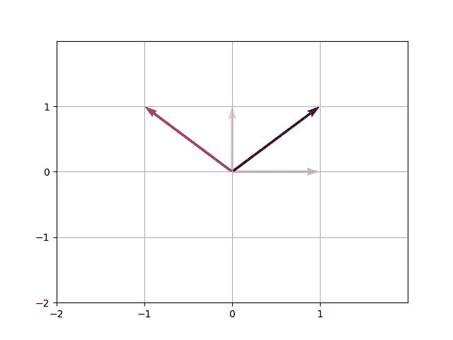
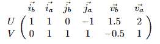
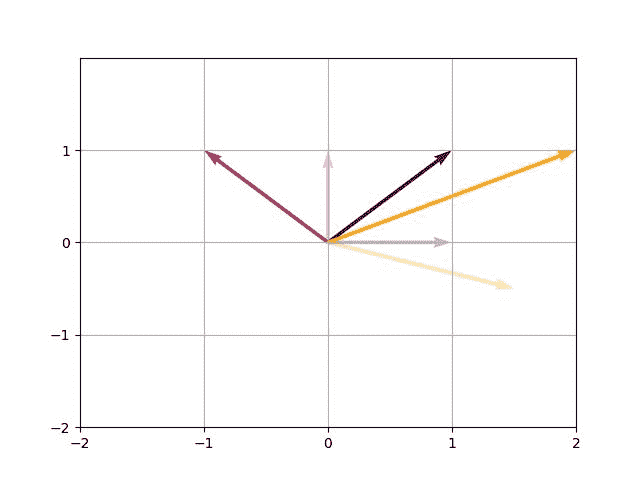
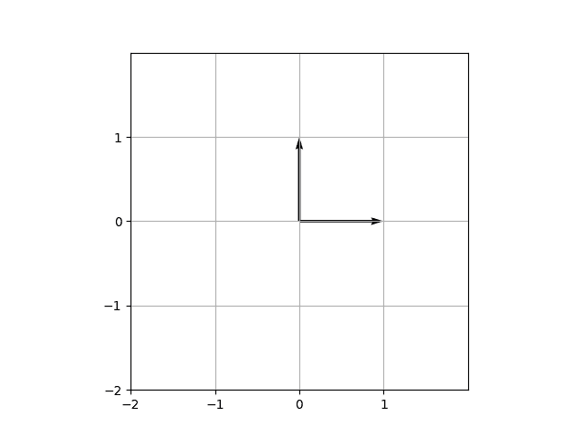
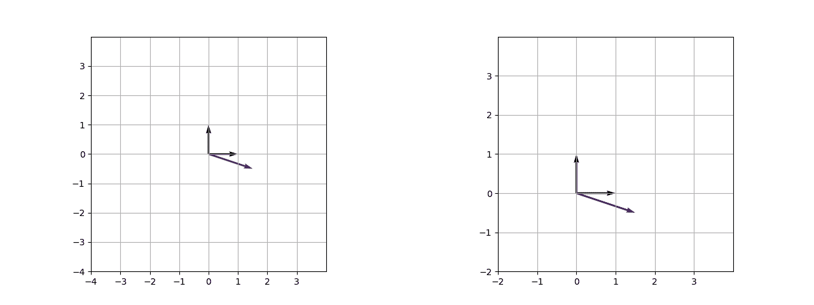

# 使用矢量场动画线性变换

> 原文：[`towardsdatascience.com/animating-linear-transformations-with-quiver/`](https://towardsdatascience.com/animating-linear-transformations-with-quiver/)

<mdspan datatext="el1750274715538" class="mdspan-comment">作为一名数据科学家工作不可避免地意味着在多个抽象层上工作，首先是代码和数学的抽象。这很好，因为这让你能够快速获得惊人的结果。但有时停下来思考一下整洁界面背后实际发生了什么是很明智的。这个过程通常由可视化辅助。在这篇文章中，我想介绍如何使用动画矢量场图来思考线性变换，这些变换通常在机器学习算法和相关界面的阴暗角落中可靠地默默工作。最后，我们将能够用我们的矢量场图可视化像奇异值分解这样的概念。

### 绘制静态矢量场图

来自 `matplotlib` Python 包的矢量场图允许我们绘制箭头（在我们的情况下代表向量）。让我们先看看一个静态矢量场图：



图片由作者提供

我们可以直接从图像中通过查看两个基向量的目标位置来推导出变换矩阵。第一个基向量从位置 (1, 0) 开始，落在 (1, 1) 上，而第二个基向量从 (0, 1) 移动到 (-1, 1)。因此，描述这个变换的矩阵是：

\[

\begin{pmatrix}

1 & -1 \\

1 & 1 \\

\end{pmatrix}

\]

从视觉上看，这相当于逆时针旋转 45 度（或 \(\pi/4\) 弧度）和轻微拉伸（因子 \(\sqrt{2}\)）。

带着这些信息，让我们看看如何使用矢量场实现这一点（注意，我省略了一些样板代码，如轴的缩放）：

```py
import numpy as np
import matplotlib.pyplot as plt
from matplotlib import cm

def quiver_plot_base_vectors(transformation_matrix: np.ndarray):
    # Define vectors
    basis_i = np.array([1, 0])
    basis_j = np.array([0, 1])
    i_transformed = transformation_matrix[:, 0]
    j_transformed = transformation_matrix[:, 1]

    # plot vectors with quiver-function
    cmap = cm.inferno
    fig, ax = plt.subplots()
    ax.quiver(0, 0, basis_i[0], basis_i[1], 
        color=cmap(0.2), 
        scale=1, 
        angles="xy", 
        scale_units="xy", 
        label="i", 
        alpha=0.3)
    ax.quiver(0, 0, i_transformed[0], i_transformed[1], 
        color=cmap(0.2), 
        scale=1,   
        angles="xy",  
        scale_units="xy", 
        label="i_transformed")
    ax.quiver(0, 0, basis_j[0], basis_j[1], 
        color=cmap(0.5), 
        scale=1, 
        angles="xy", 
        scale_units="xy", 
        label="j", 
        alpha=0.3)
    ax.quiver(0, 0, j_transformed[0], j_transformed[1], 
        color=cmap(0.5), 
        scale=1, 
        angles="xy", 
        scale_units="xy", 
        label="j_transformed")

if __name__ == "__main__":
    matrix = np.array([
        [1, -1],
        [1, 1]  
    ])
    quiver_plot_base_vectors(matrix)
```

如您所见，我们为每个向量定义了一个矢量场图。这只是为了说明目的。如果我们看看矢量函数的签名 – `quiver([X, Y], U, V, [C], /, **kwargs)` – 我们可以观察到 U 和 V 接收 numpy 数组作为输入，这比提供标量值要好。让我们重构这个函数，使其只使用一次矢量调用。此外，让我们添加一个向量 v = (1.5, -0.5) 来查看它上的变换。

```py
def quiver_plot(transformation_matrix: np.ndarray, vector: np.ndarray):
    # Define vectors
    basis_i = np.array([1, 0])
    basis_j = np.array([0, 1])
    i_transformed = transformation_matrix[:, 0]
    j_transformed = transformation_matrix[:, 1]
    vector_transformed = transformation_matrix @ vector
    U, V = np.stack(
        [
            basis_i, i_transformed,
            basis_j, j_transformed,
            vector, vector_transformed,
        ],
        axis=1)

    # Draw vectors
    color = np.array([.2, .2, .5, .5, .8, .8])
    alpha = np.array([.3, 1.0, .3, 1.0, .3, 1.0])
    cmap = cm.inferno
    fig, ax = plt.subplots()
    ax.quiver(np.zeros(6), np.zeros(6), U, V,
        color=cmap(color),
        alpha=alpha,
        scale=1,
        angles="xy",
        scale_units="xy",
    )

if __name__ == "__main__":
    matrix = np.sqrt(2) * np.array([
        [np.cos(np.pi / 4), np.cos(3 * np.pi / 4)],
        [np.sin(np.pi / 4), np.sin(3 * np.pi / 4)]
    ])
    vector = np.array([1.5, -0.5])
    quiver_plot(matrix, vector)
```

这比第一个例子要短得多，也更方便。我们在这里做的是水平堆叠每个向量，产生以下数组：



第一行对应于 `quiver` 的 U 参数，第二行对应于 V。而列代表我们的向量，其中 \(\vec{i}\) 是第一个基向量，\(\vec{j}\) 是第二个，\(\vec{v}\) 是我们的自定义向量。索引 b 和 a 代表 *before* 和 *after*（即线性变换是否应用）。让我们看看输出：



基向量与 \(\vec{v}\) 的线性变换

图片由作者提供

重新审视代码，可能会让人困惑我们整洁简单的变换矩阵发生了什么，它被重新表述为：

\[

{\scriptsize

M=\begin{pmatrix}

{1}&{-1}\\

{1}&{1}\\

\end{pmatrix}={\sqrt{2}}

\begin{pmatrix}

{\cos\left(\frac{1}{4}\pi\right)}&{\cos\left(\frac{3}{4}\pi\right)}\\

{\sin\left(\frac{1}{4}\pi\right)}&{\sin\left(\frac{3}{4}\pi\right)}\\

\end{pmatrix}

}

\]

原因在于，随着我们添加动画，这种表示方法将变得非常有用。通过平方根的标量乘法表示我们的向量拉伸了多少，而矩阵的元素则用三角函数表示，以描绘单位圆中的旋转。

### 让我们开始动画

添加动画的原因可能包括更清晰的图表，我们可以去除幽灵向量，并为演示创造更吸引人的体验。为了通过动画增强我们的图表，我们可以通过使用`matplotlib.animation`中的`FuncAnimation()`函数留在 matplotlib 生态系统中。该函数接受以下参数：

+   a `matplotlib.figure.Figure` object

+   一个更新函数

+   帧数

对于每一帧，更新函数都会被调用，生成初始矢量图的更新版本。更多详情请查看 matplotlib 的[官方文档](https://matplotlib.org/stable/api/_as_gen/matplotlib.pyplot.quiver.html)。

考虑到这些信息，我们的任务是定义在更新函数中实现的逻辑。让我们从只有三个帧和基向量开始简单。在帧 0 时，我们处于初始状态。而在最后一帧（帧 2）时，我们需要到达重新表述的矩阵 M。因此，我们预计在帧 1 时会达到一半。因为 M 中\(\cos\)和\(\sin\)的参数表示弧度（即我们在单位圆上走了多远），我们可以将它们除以二以获得所需的旋转。（第二个向量得到一个负的\(\cos\)，因为我们现在处于第二象限）。同样，我们需要考虑拉伸，由标量因子表示。我们通过计算变化量来完成，这个变化量是\(\sqrt{2}-1\)，并将这个变化量的一半加到初始缩放上。

\[

{\scriptsize

\begin{aligned}

\text{第 0 帧:} \quad &

\begin{pmatrix}

\cos(0) & \cos\left(\frac{\pi}{2}\right) \\

\sin(0) & \sin\left(\frac{\pi}{2}\right)

\end{pmatrix}

\\[1em]

\text{第 1 帧:} \quad &

s \cdot \begin{pmatrix}

\cos\left(\frac{1}{2} \cdot \frac{\pi}{4}\right) & -\cos\left(\frac{1}{2} \cdot \frac{3\pi}{4}\right) \\

\sin\left(\frac{1}{2} \cdot \frac{\pi}{4}\right) & \sin\left(\frac{1}{2} \cdot \frac{3\pi}{4}\right)

\end{pmatrix}, \quad \text{其中 } s = 1 + \frac{\sqrt{2} – 1}{2}

\\[1em]

\text{第 2 帧:} \quad &

\sqrt{2} \cdot \begin{pmatrix}

\cos\left(\frac{\pi}{4}\right) & \cos\left(\frac{3\pi}{4}\right) \\

\sin\left(\frac{\pi}{4}\right) & \sin\left(\frac{3\pi}{4}\right)

\end{pmatrix}

\end{aligned}

}

\]



The matrices describe where the two base vectors land on each frame

GIF by Author

One Caveat to the explanation above: It serves the purpose to give intuition to the implementation idea and holds true for the base vectors. However the actual implementation contains some more steps, e.g. some transformations with \(\arctan\) to get the desired behavior for all vectors in the two-dimensional space.

So let’s inspect the main parts of the implementation. The full code can be found on my [github](https://github.com/KendamaQQ/lin_transform).

```py
import numpy as np
import matplotlib.pyplot as plt
from matplotlib import animation
from matplotlib import cm

class AnimationPlotter:
[...]
def animate(self, filename='output/mat_transform.gif'):
        self.initialize_plot()
        anim = animation.FuncAnimation(
            self.fig,
            self.update_quiver,
            frames=self.frames + 1,
            init_func=self.init_quiver,
            blit=True,
        )
        anim.save(filename, writer='ffmpeg', fps=self.frames/2)
        plt.close()

if __name__ == "__main__":
    matrix = np.sqrt(2) * np.array([
        [np.cos(np.pi / 4), np.cos(3 * np.pi / 4)],
        [np.sin(np.pi / 4), np.sin(3 * np.pi / 4)]

    ])
    vector = np.array([1.5, -0.5]).reshape(2, 1)
    transformer = Transformer(matrix)
    animation_plotter = AnimationPlotter(transformer, vector)
    animation_plotter.animate()
```

The `animate()` method belongs to a custom class, which is called `AnimationPlotter`. It does what we already learned with the inputs as provided above. The second class on the scene is a custom class `Transformer`, which takes care of computing the linear transformations and intermediate vectors for each frame. The main logic lies within the `AnimationPlotter.update_quiver()` and `Transformer.get_intermediate_vectors()` methods, and looks as follows.

```py
class AnimationPlotter:
    [...]
    def update_quiver(self, frame: int):
        incremented_vectors = self.transformer.get_intermediate_vectors(
            frame, self.frames
        )
        u = incremented_vectors[0]
        v = incremented_vectors[1]
        self.quiver_base.set_UVC(u, v)
        return self.quiver_base,

class Transformer:
    [...]
    def get_intermediate_vectors(self, frame: int, total_frames: int) -> np.ndarray:
         change_in_direction = self.transformed_directions - self.start_directions
         change_in_direction = np.arctan2(np.sin(change_in_direction), np.cos(change_in_direction))
         increment_direction = self.start_directions + change_in_direction * frame / total_frames
         increment_magnitude = self.start_magnitudes + (self.transformed_magnitudes - self.start_magnitudes) * frame / total_frames
         incremented_vectors = np.vstack([np.cos(increment_direction), np.sin(increment_direction)]) @ np.diag(increment_magnitude)
         return incremented_vectors
```

What happens here is that for each frame the intermediate vectors get computed. This is done by taking the difference between the end and start directions (which represent vector angles). The change in direction/angle is then normalized to the range \([-\pi, \pi]\) and added to the initial direction by a ratio. The ratio is determined by the current and total frames. The magnitude is determined as already described. Finally, the incremented vector gets computed based on the direction and magnitude and this is what we see at each frame in the animation. Increasing the frames to say 30 or 60 makes the animation smooth.

### 动画奇异值分解（SVD）

最后我想展示一下如何创建介绍性动画。它展示了 4 个向量（每个象限一个）依次进行三次变换。确实，应用的三次变换对应于我们上面已知的变换矩阵 M，但通过奇异值分解（SVD）进行分解。您可以在[这篇文章](https://towardsdatascience.com/svd-8c2f72e264f/)中获取或更新您关于 SVD 的知识，这是一篇非常好且直观的 tds 文章。或者如果您更喜欢更数学化的阅读，可以[在这里](https://towardsdatascience.com/singular-value-decomposition-svd-demystified-57fc44b802a0/)查看。然而，使用`numpy.linalg.svd()`计算矩阵 M 的奇异值分解非常简单。这样做会导致以下分解：

\[

{\scriptsize

\begin{align}

A \vec{v} &= U\Sigma V^T\vec{v} \\[1em]

\sqrt{2} \cdot \begin{pmatrix}

\cos\left(\frac{\pi}{4}\right) & \cos\left(\frac{3\pi}{4}\right) \\

\sin\left(\frac{\pi}{4}\right) & \sin\left(\frac{3\pi}{4}\right)

\end{pmatrix} \vec{v} &=

\begin{pmatrix}

\cos\left(\frac{3\pi}{4}\right) & \cos\left(\frac{3\pi}{4}\right) \\

\sin\left(\frac{-\pi}{4}\right) & \sin\left(\frac{\pi}{4}\right)

\end{pmatrix}

\begin{pmatrix}

\sqrt{2} & 0 \\

0 & \sqrt{2}

\end{pmatrix}

\begin{pmatrix}

-1 & 0 \\

0 & 1

\end{pmatrix} \vec{v}

\end{align}

}

\]

注意，平方根拉伸通过中间矩阵被提炼出来。以下动画展示了当 v = (1.5, -0.5) 时这一过程是如何实际（或动态）发生的。



分解变换（左侧）和矩阵 M 的变换（右侧）GIF 由作者制作

最后，紫色向量 \(\vec{v}\) 在两种情况下都到达了其确定的位置。

### 结论

总结来说，我们可以使用 `quiver()` 函数在二维空间中显示向量，并借助 `matplotlib.animation.FuncAnimation()` 添加吸引人的动画效果。这可以清晰地展示线性变换，例如，你可以用它来演示机器学习算法的底层机制。欢迎您 fork 我的仓库并实现您自己的可视化。希望您喜欢阅读！
