# Apollo 和视频大型多模态模型（LMMs）的设计选择

> 原文：[`towardsdatascience.com/apollo-and-design-choices-of-video-large-multimodal-models-lmms-0e672c618cf0/`](https://towardsdatascience.com/apollo-and-design-choices-of-video-large-multimodal-models-lmms-0e672c618cf0/)

作者提供的图像 - Flux.1 Schnell

正如我们所期待的，模型越来越能够理解不同类型的输入。我们已经看到了图像 Transformer 模型（参见我关于[微调 Flux](https://medium.com/@mgunton7/step-by-step-lets-fine-tune-flux-1-822f92c07c15)和 MM1 背后的[研究](https://medium.com/towards-data-science/multimodal-large-language-models-apples-mm1-c1e94d87a161)的博客），现在我们开始看到视频模型出现在场景中。

2024 年 12 月，Meta 推出了其新的 Apollo 系列模型。当他们推出这些模型时，还发布了一篇论文，详细介绍了他们在大型多模态模型（LMMs）方面的研究和工作。这篇论文充满了许多精彩细节，因此，而不是试图涵盖所有内容，我将专注于他们在构建模型时强调的 4 个主要设计选择。

让我们深入探讨！

## 背景

### 嵌入

让我们首先列出一些快速想法，这些想法对于理解这里发生的事情很重要。每个 Transformer 都依赖于嵌入作为其输入。然而，用户输入通常首先从用户理解的内容（文本、视频）转换为标记，然后转换为嵌入。为了转换为嵌入，我们使用嵌入模型。对于多模态输入，我们通常为每种输入类型使用不同的编码器。

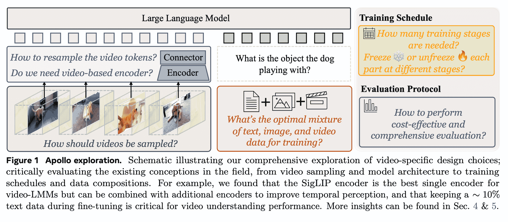

论文中的图 1 [链接](https://arxiv.org/pdf/2412.10360)

虽然我们可以很容易地看到如何使用这种方法来设置图像编码器，但如何将这个过程适应视频则并不那么直接。

我们将看到作者探讨了如何最好地选择编码器。

### ApolloBench 数据集

作者首先对现有的视频基准进行了分析。基准需要进行分析，这样我们才知道在这些基准上的高分实际上与更好的性能相关。然而，作者发现其中一些基准可以通过模型只理解输入数据的一部分来操纵。例如，如果模型只理解视频的一帧，那么它的得分应该不高——然而，在令人惊讶的许多基准测试中，它做到了这一点（如红色方框和须状图所示）。作者发现，很大一部分可以通过仅依靠文本和图像理解来回答——这使得它们成为视频理解的指南。此外，当在基准测试中比较不同模型时，他们发现许多模型的性能聚集在一起，导致基准测试不那么有用。

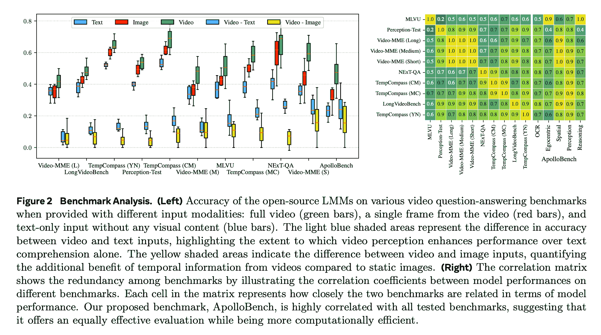

图 2 来自[该论文](https://arxiv.org/pdf/2412.10360)

基于这些发现，作者决定创建一个新的基准，以更清楚地测试视频理解和区分模型性能。作者只选择了多选题来避免需要从外部模型进行额外分析以完成回答问题。他们移除了那些被超过 50%的模型正确回答的问题，以及那些不需要任何视频理解的问题。对于剩余的问题，作者根据他们测试的技能将它们分为 5 个类别：时间 OCR、自我中心、空间、感知和推理。从每个类别中只保留了那些明显导致模型之间结果不同的前 400 个问题，这些问题被保留在基准中。

我们将看到他们使用他们新的数据集来指导几乎所有的设计选择。

## 视频采样

我们面临的第一项设计选择是抽取多少数据。对于图像，我们只有一个帧，所以该帧应该被处理。然而对于视频，我们通常以每秒 30 帧的速度运行。虽然每一帧略有不同，但它们通常并不那么极端不同，以至于缺少一帧就是一个问题（[以 Phi 现象为例](https://en.wikipedia.org/wiki/Phi_phenomenon)）

### 均匀采样与每秒帧数

在论文中，他们比较了均匀采样和每秒帧数采样（FPS 采样）。均匀采样意味着我们将从视频中随机抽取一帧。假设我们有一个 10 秒的剪辑，每秒 30 帧。如果我们想进行大小为 5 的均匀采样，我们将随机选择 300 个可能的帧中的 5 个，并通过我们的嵌入器传递。虽然这保证了即使对于更长的视频，我们也将始终有足够的内存，但这里有一些显著的扭曲，使得这种方法不太理想。最重要的是，通过随机选择，我们丢失了帧之间的时间元素，可能导致模型对事物发生速度有一个错误的看法。相比之下，基于每秒的采样将保持帧之间的时间信息，但需要通过模型发送更多的标记，因此在内存方面成本更高。

### 性能比较

为了比较采样选项，他们训练了五个不同的模型，这些模型要么使用均匀采样在设定速率下（8、16、32 和 64）训练，要么使用每秒帧数（FPS）采样。然后他们在测试时间对这些模型进行了评估。左边的图表显示了模型是根据其相应的训练方法进行测试的。正如你所见，在 ApolloBench 数据集的所有 5 个类别中，FPS 采样表现更好（见图 4 左侧）。

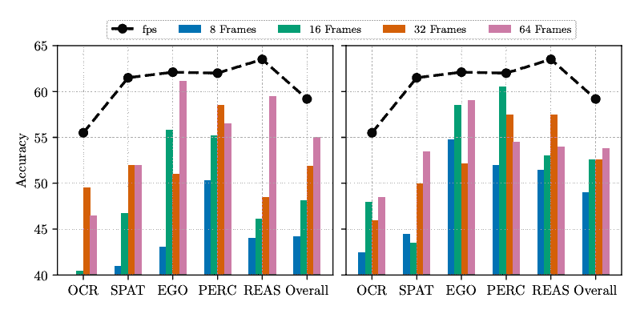

图 4（左侧和中间）来自[该论文](https://arxiv.org/pdf/2412.10360)

为了消除训练是这里差异的疑虑，作者们还使用每秒帧数推理采样对所有模型进行了实验。我们再次看到，每秒帧数训练的模型表现最好。尽管如此，鉴于均匀采样模型（尤其是采样帧数较少的模型）取得的重大改进，值得注意的是 FPS 采样似乎非常强大。

在 FPS 采样成功的基础上，作者们想看看如何最好地使用它所需的额外 token。下面的图表显示了作者们通过 token 重采样器（下面会详细介绍）调整每个帧发送给模型的 token 数量。图表中的颜色表示准确率，x 轴是每秒帧数，y 轴是每秒 token 数，靠近虚线红线的数字表示每帧 token 数。

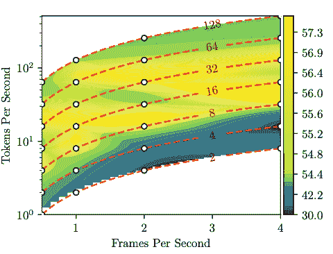

图 4（右）来自[该论文](https://arxiv.org/pdf/2412.10360)

在每帧 8 到 32 个 token 之间似乎找到了最高的持续准确率。我们看到在每帧更高和更低的 token 数量下准确率较低，这表明这里发生了权衡，因为需要处理的数据更多（或更少）。还值得指出的是，每秒帧数并不像每秒 token 数和每帧 token 数那样重要。对我来说，这表明某些关键时刻需要高度采样，而我们目前无法预测这些时刻，因此最好的办法是让多个连接同时发挥作用。

## 视频表示

在我们之前讨论了如何为不同类型的输入使用不同的编码器。对于文本，我们可能会使用类似[tiktoken](https://github.com/openai/tiktoken)的东西，而对于更复杂的输入，行业还没有统一采用一种形式。这意味着当我们试图将视频表示为 token 时，我们应该考虑基于其他模态（尤其是图像）中效果良好的多种编码策略。

### 图像编码器

图像编码器通常有两种类型：语言监督和自监督编码。两者使用方式相同（输入图像，输出嵌入），但训练方式不同。对于语言监督编码模型（如 CLIP），我们有图像和描述性文本作为输入。我们分别嵌入两者并尝试使两个嵌入相似。此外，对于批次中的每个图像-文本对，我们尽力使嵌入与其他图像-文本对的嵌入不同（这是 CLIP 的对比部分）。另一方面，自监督编码只接受图像作为训练输入。模型通过玩游戏（如预测旋转图像的角度或预测图像块之间的相对位置）来学习创建正确的嵌入（你已经在 reCAPTCHAs 中见过这些）。这里的目的是驱使模型学习图像的有用部分，而不需要标签。

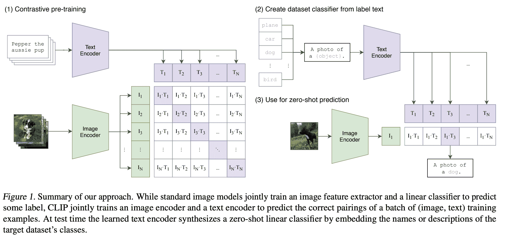

图 1 来自[从自然语言监督中学习可迁移的视觉模型](https://arxiv.org/pdf/2103.00020.pdf)

### 视频编码器

由于视频同时包含图像和声音，这里的编码策略可能比图像更复杂。许多领先的视频编码器所做的是基于图像策略，例如掩码和语言监督，以驱动我们的视频编码器学习关键特征。同样，基于我们在 CLIP 中使用的对比损失，我们可以使用对比损失来使嵌入器将视频和音频数据对齐。让我们更深入地探讨掩码和对比损失策略，通过一个示例解释它们是如何工作的。

对于掩码，想象你有一个熊穿过森林的视频。我们通常看到人们会随机选择视频的几个部分进行掩码。这个掩码输入随后被嵌入器处理，嵌入器的目标是正确预测最后的标记。一旦我们看到一个令人满意的聚合损失，我们只需在最后调整我们的模型以输出最终的 logits 而不是下一个标记的概率。我们将这些 logits 用作嵌入

对于多模态对比损失，我将通过一个示例来解释这一点。假设我们有 3 个视频，每个视频都有音频。我们首先使用视频嵌入器嵌入所有视频，使用音频嵌入器嵌入所有音频。这给我们 3 对嵌入 logits：(V1, A1), (V2, A2), (V3, A3)。我们现在对这 3 个进行余弦相似度计算，这样我们可以教会模型区分所有这些对。目标是我们的正确对(V1, A1)的余弦相似度高于错误对(V1,A2)和(V1, A3)。一旦我们这样做足够多，模型就会学会如何为音频-视频对生成相似的嵌入。

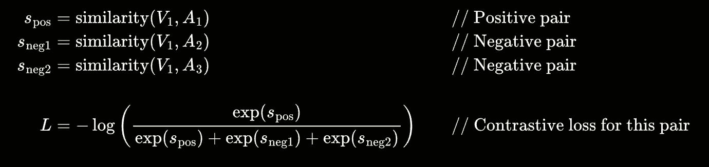

图片由作者提供 – 对比损失的示例计算

### 图像与视频编码器的结合

到目前为止，你可能想知道为什么我们讨论了图像编码器，因为已经有了视频编码器。在测试了多种不同的视频编码器后，作者发现它们在视频数据上并不比图像编码器有明显的优势。虽然图像编码器在其嵌入中不会包含任何时间信息，但它们似乎提供了更高质量的嵌入，从而允许更好的模型性能。

作者使用不同的编码器（视频和图像）训练了几个模型，并在下面的图表中比较了它们的性能。你可以看到，总的来说，语言监督模型优于自监督模型。重要的是，表现最好的模型，[SigLIP SO400M](https://huggingface.co/google/siglip-so400m-patch14-384)，是一个图像嵌入器。

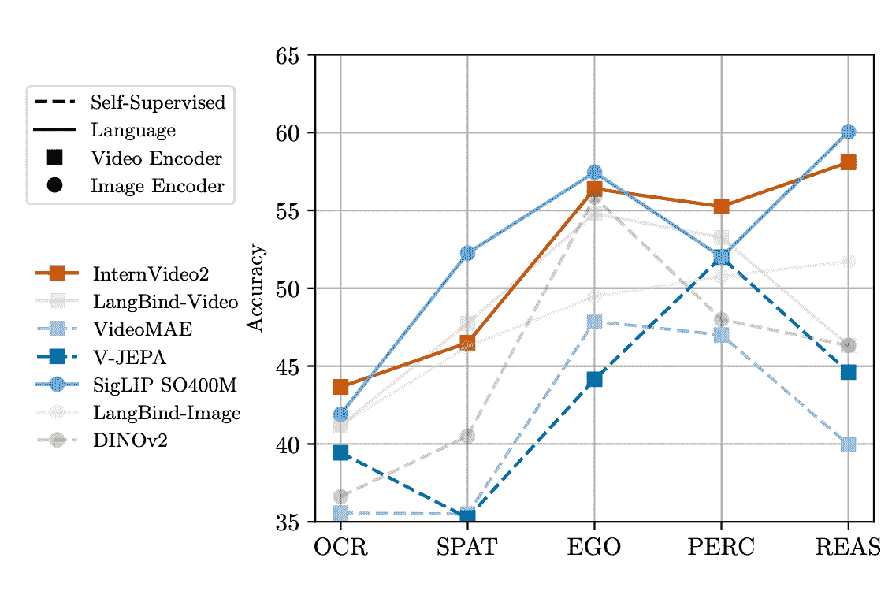

来自[该论文](https://arxiv.org/pdf/2412.10360)的图 5（左）

他们随后测试了通过配对编码器来提高准确性的可能性。假设是，虽然图像编码器在时间理解方面表现不佳，但在空间理解方面表现良好。另一方面，视频编码器在时间理解方面表现良好，但在空间理解方面表现不佳。下面的图表显示了某些图像编码器和视频编码器对的性能。有趣的是，将表现最好的图像编码器([SigLIP SO400M](https://huggingface.co/google/siglip-so400m-patch14-384))与表现最好的视频编码器([InternVideo2](https://huggingface.co/collections/OpenGVLab/internvideo2-6618ccb574bd2f91410df5cd))结合起来，确实提高了准确性，超过了各自单独所能达到的水平（提高了约 4%）。

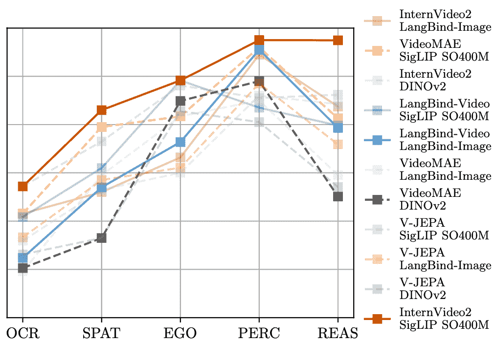

来自[该论文](https://arxiv.org/pdf/2412.10360)的图 5（右）—— 注意这里的 Y 轴与图 5（左）相同

## 视频令牌采样

我们的视频编码输出其嵌入维度低于模型隐藏层预期的维度。解决这个问题的典型方法是通过上采样，我们将投影放大 2-4 倍。自然地，这个额外信息并不像我们的常规嵌入那样具有高信号，因此这是一个我们可以寻找来修复的地方。一个解决方案是重采样——我们将多个令牌组合成一个。这已经在图像模型中尝试过，并且没有降低性能。有几种不同的方法可以组合令牌（使用 QFormer，平均池化），但之前的论文发现通道连接是最佳的，因此这是作者们所测试的。

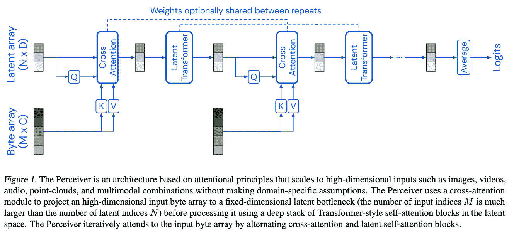

来自"[Perceiver: 通过迭代注意力实现通用感知](https://arxiv.org/abs/2103.03206)"的图 1

作者们尝试了 3 种技术：`mlp up-projection + average pooling`，`2D conv + average pooling`，和`perceiver resampling`。MLP 上投影是使用多层感知器来处理我们的上采样，然后对所有现在扩展的张量进行平均池化。2D 卷积是使用卷积操作来组合两个张量，然后从那里使用平均池化来输出结果。最后，我们有 Perceiver 重采样，它使用 Perceiver 架构（如上图所示）来确定如何最佳地组合令牌。

如下所示，使用 Perceiver 重采样器来组合令牌导致了最高的整体得分。

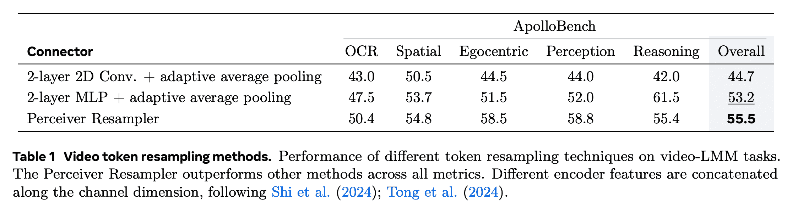

来自[该论文](https://arxiv.org/pdf/2412.10360)的表 1

## 视频令牌集成

与其他多模态模型一样，一个关键的设计选择是如何结合不同的标记类型。最初，这些标记只是简单地直接连接并传递给模型，然而，最近的研究已经明确地区分了这两种类型。这是通过新的特殊标记或文本来实现的。

作者尝试了 4 种不同的分离方式。一种没有任何区分（`<vid_token>`），另一种在 vid_token 的两侧各有 2 个特殊标记（`<vid_start>...<vid_end>`）。最后两种使用时间戳直接编码时间信息。他们要么在视频标记之前放置这些时间信息，要么在我们第一个特殊标记之前。

通过 ApolloBench 运行这 4 种方法表明，在开头没有特殊标记的时间戳最为有效。理论是，通过添加新词汇，我们增加了模型的认知负荷，需要更多的训练来学习这些权重，而没有显著的改进。同时，通过添加时间信息，我们使用了原始词汇，并为模型提供了所需上下文。

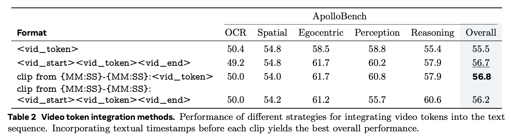

[论文中的 Table 2](https://arxiv.org/pdf/2412.10360)

## 结论

我们现在已经了解了 Meta 在他们的 LMM 中做出的 4 个关键设计选择。随着这里的研究不断改进，似乎理想的编码器（或编码器对）将解锁重大的性能提升。今天，我们广泛地看到模型可以处理更大长度的上下文，并且有更多类型的输入。我预计一旦我们有一个强大的视频编码器，我们将看到可用于训练这些模型的数据爆炸式增长。

[通过我的 MM1 博客](https://towardsdatascience.com/multimodal-large-language-models-apples-mm1-c1e94d87a161)，我曾提到我们将开始看到更多多模态模型的推出。看到这一点不仅成真，而且编码器思维方式适用于多个领域，这真的非常酷。

现在是构建模型的一个激动人心的时刻！

* * *

[1] Zohar, O., et al., ["Apollo: An Exploration of Video Understanding in Large Multimodal Models"](https://arxiv.org/pdf/2412.10360) (2024), arXiv

[2] Jaegle, A., et al., ["Perceiver: General Perception with Iterative Attention"](https://arxiv.org/abs/2103.03206) (2021), arXiv

[3] McKinzie, B., et al. ["MM1: Methods, Analysis & Insights from Multimodal LLM Pre-training" (2024)](https://arxiv.org/pdf/2403.09611.pdf), arXiv

[4] Radford, A., et al. ["Learning Transferable Visual Models From Natural Language Supervision"](https://arxiv.org/pdf/2103.00020.pdf) (2021), arXiv

[5] WikiMedia Foundation, et al., "[Phi 现象](https://en.wikipedia.org/wiki/Phi_phenomenon)" (2024), Wikipedia
