# 密度估计在法律理论中的应用

> 原文：[`towardsdatascience.com/applications-of-density-estimation-to-legal-theory/`](https://towardsdatascience.com/applications-of-density-estimation-to-legal-theory/)

<mdspan datatext="el1749573129974" class="mdspan-comment">之前</mdspan>，我写过一篇关于密度估计理论（以及一些应用！）的文章，以及它如何成为统计分析中各种方法的有力工具。根据*压倒性*的读者需求，我认为使用密度估计来从一些有趣的数据中得出一些见解可能很有趣——在这种情况下，与法律理论相关的数据。


构建性批评

虽然深入研究统计方法背后的数学细节以形成对算法的坚实基础是很好的，但最终我们希望使用这些工具从数据中得出有趣的见解！

在这篇文章中，我们将使用密度估计来分析一些关于两种判决系统（有罪/无罪）与三种判决系统（有罪/无罪/证据不足）对陪审团对其最终判决感知信心影响的数据。

### 内容

+   **背景 & 数据集**

+   **密度估计用于探索性分析**

+   **正式测试分布差异**

+   **未来调查与总结**

+   **来源**

* * *

### 背景 & 数据集

美国的法律体系在刑事诉讼中采用两种选择的判决系统（有罪/无罪）。然而，一些其他国家，特别是苏格兰，使用三种判决系统（有罪/无罪/证据不足）来决定被告的命运。在这个三种判决系统中，陪审团有额外的选择，可以选择“证据不足”的判决，这意味着控方提供的证据不足以确定被告是否有罪或无罪。

在法律上，“证据不足”和“无罪”的判决是等效的，因为被告在两种结果下都被宣判无罪。然而，这两个判决具有不同的语义含义，因为“证据不足”是让陪审团在无法确信被告对所犯罪行负有责任或无罪时选择的。

苏格兰因其模糊性最近废除了这种第三种判决[链接](https://www.bbc.com/news/uk-scotland-65397235)。实际上，当我阅读相关内容时，我发现关于这种判决存在相互冲突的定义——[一些来源](https://pubmed.ncbi.nlm.nih.gov/17703354/)将其定义为当陪审员认为被告有罪，但检方未能提供足够证据定罪时的选择。这可能会给被“证据不足”判决的无罪被告带来与公众眼中被判有罪的被告相似的污名。相比之下，[其他来源](https://scholarship.law.umn.edu/faculty_articles/1089/)将判决定义为有罪与无罪之间的中间地带（令人困惑！）。

在本文中，我们将分析包含模拟陪审员在两种和三种判决系统下感知到的判决信心水平的数据。数据还包含有关证词中是否存在冲突证据的信息。这些特征将使我们能够调查陪审员对其最终判决的感知信心水平是否因判决系统/或冲突证据的存在而有所不同。

关于数据的更多信息，请查看[文档](https://vincentarelbundock.github.io/Rdatasets/doc/betareg/MockJurors.html)。

* * *

### 探索性分析的密度估计

不再拖延，让我们深入数据！

```py
mock <- read.csv("data/MockJurors.csv")
summary(mock)
```

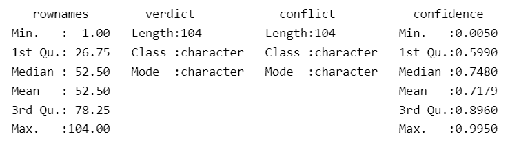

数据摘要

我们的数据由 104 个观测值和三个感兴趣的变量组成。每个观测值对应一个模拟陪审员的判决。我们感兴趣的三个变量如下所述：

+   `verdict`：陪审员的决策是在两种或三种判决系统下做出的。

+   `conflict`：审判中是否存在冲突的证词证据。

+   `confidence`：陪审员对其判决的信心程度，范围从 0 到 1，其中 0/1 分别对应低/高信心。

让我们简要地看一下这些单个特征。

```py
# barplot of verdict
ggplot(mock, aes(x = verdict, fill = verdict)) + 
        geom_bar() +
      geom_text(stat = "count", aes(label = after_stat(count)), vjust = -0.5) +
      labs(title = "Count of Verdicts") +
      theme(plot.title = element_text(hjust = 0.5))

# barplot of conflict
ggplot(mock, aes(x = conflict, fill = conflict)) + 
         geom_bar() +
      geom_text(stat = "count", aes(label = after_stat(count)), vjust = -0.5) +
      labs(title = "Count of Conflict Levels") +
      theme(plot.title = element_text(hjust = 0.5))

# crosstab: verdict & conflict
# i.e. distribution of conflicting evidence across verdict levels
ggplot(mock, aes(x = verdict, fill = conflict)) +
  geom_bar(position = "dodge") +
  geom_text(
    stat = "count",
    aes(label = after_stat(count)),
    position = position_dodge(width = 0.9),
    vjust = -0.5
  ) +
  labs(title = "Verdict and Conflict") +
  theme(plot.title = element_text(hjust = 0.5))
```

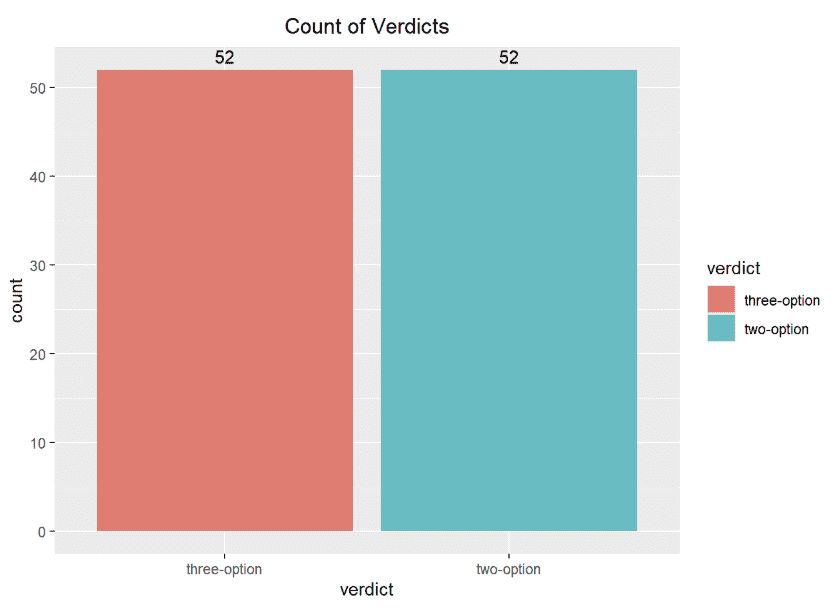

根据判决划分的条形图

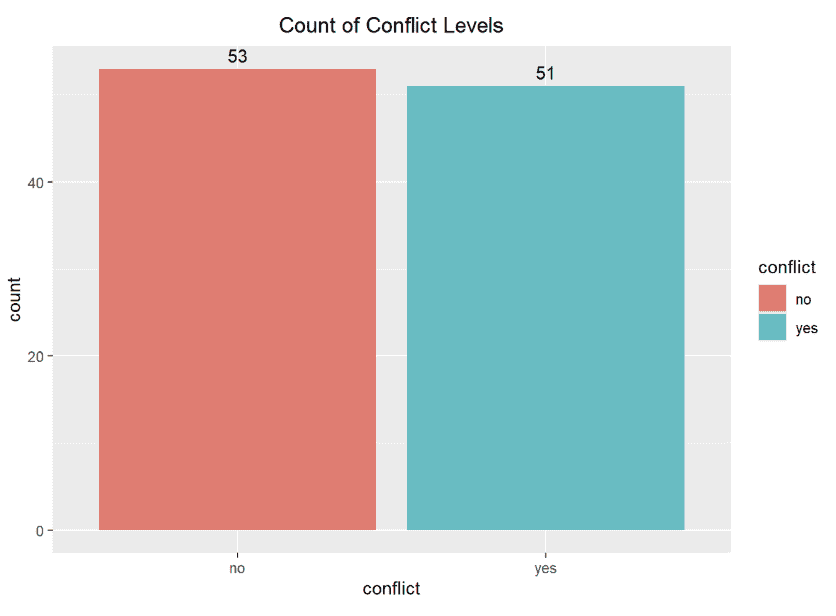

根据冲突情况划分的条形图

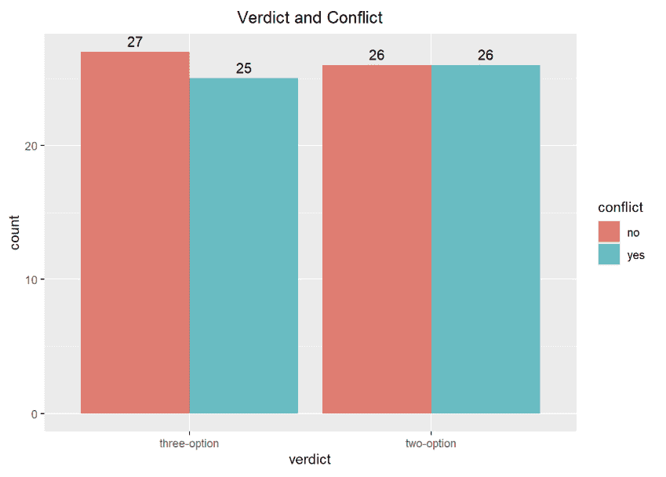

根据冲突情况划分的判决条形图

观测值在判决级别上均匀分布（52/52），在`conflict`因素上几乎均匀分布（53 个无，51 个有）。此外，`conflict`的分布似乎在`verdict`的两个级别上都是均匀的，即两种判决系统中记录的冲突/无冲突证据的判决数量大致相等。因此，我们可以继续比较这些组之间的信心水平分布，而不必担心不平衡的数据会影响我们分布估计的质量。

让我们看看陪审员信心水平的分布。

我们可以使用密度估计来可视化信心水平的分布。[密度估计](https://medium.com/data-science-collective/non-parametric-density-estimation-theory-and-applications-6b31eeb0ee20)可以提供对变量分布的清晰直观展示，尤其是在处理大量数据时。然而，估计可能会因几个参数而有所不同。例如，让我们看看由各种[带宽选择方法](https://aakinshin.net/posts/kde-bw/)产生的密度估计。

```py
bws <- list("SJ", "ucv", "nrd", "nrd0")

# Set up a 2x2 grid for plotting
par(mfrow = c(2, 2))  # 2 rows, 2 columns

for (bw in bws) {
  pdf_est <- density(mock$confidence, bw = bw, from = 0, to = 1) 

  # Plot PDF
  plot(pdf_est,
       main = paste("Density Estimate: Confidence (", bw, ")" ),
       xlab = "Confidence",
       ylab = "Density",
       col = "blue",
       lwd = 2)
  rug(mock$confidence)
  # polygon(pdf_est, col = rgb(0, 0, 1, 0.2), border = NA)
  grid()
}

# Reset plotting layout back to default (optional)
par(mfrow = c(1, 1))
```

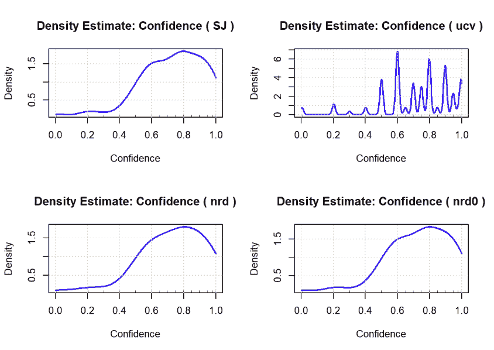

不同带宽下的信心密度估计

上图展示了由 Sheather-Jones、无偏交叉验证和正态参考分布方法产生的密度估计。

显然，带宽的选择可以给我们展示出非常不同的信心水平分布图。

+   使用无偏交叉验证给人一种`信心`分布非常稀疏的印象，考虑到我们的数据集（104 个观测值）很小，这一点并不令人惊讶。

+   其他带宽产生的密度估计相当相似。由正态参考分布方法产生的估计似乎比 Sheather-Jones 产生的估计稍微平滑一些，因为正态参考分布方法在其计算中使用了高斯核。总体来看，信心水平似乎高度集中在 0.6 或更高的值上，其分布似乎有一个较重的左尾。

现在，让我们进入有趣的部分，检验陪审团的信心水平可能会如何根据冲突证据的存在和判决系统而变化。

```py
# plot distribution of Confidence by Conflict
# use Sheather-Jones bandwidth for density estimate
ggplot(mock, aes(x = confidence, fill = conflict)) +
  geom_density(alpha = 0.5, bw = bw.SJ(mock$confidence)) + 
  labs(title = paste("Density: Confidence by Conflict")) + 
  xlab("Confidence") + 
  ylab("Density") +
  theme(plot.title = element_text(hjust = 0.5))
```

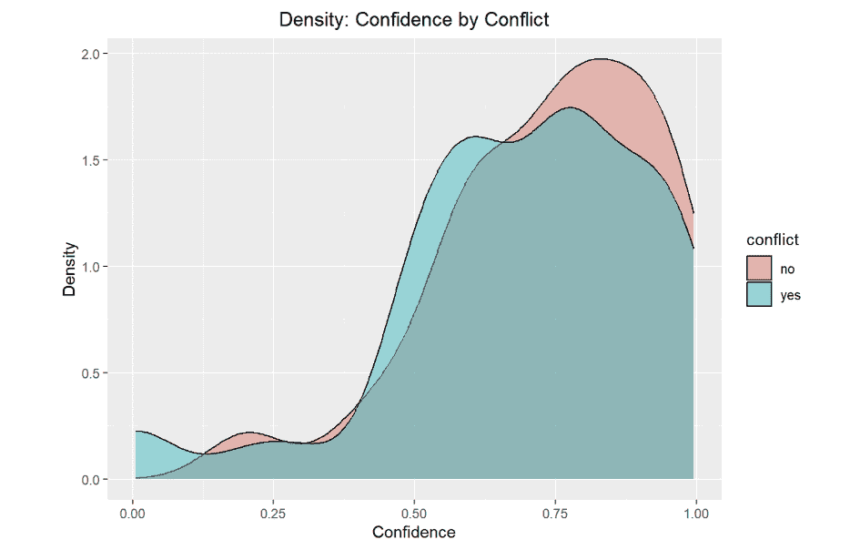

信心密度按冲突分类

如上图所示，在存在冲突证据的情况下，陪审团的信心水平似乎没有太大差异，因为`信心`密度估计的大面积重叠表明了这一点。也许在没有冲突证据的情况下，陪审团可能对其判决更有信心，因为`无冲突`下的`信心`密度估计似乎显示出相对于存在冲突证据下的密度估计，信心值大于 0.8 的集中度更高。然而，分布看起来几乎相同。

让我们来检验陪审团对两种选择与三种选择判决系统的信心水平是否有所不同。

```py
# plot distribution of Confidence by Verdict
# use Sheather-Jones bandwidth for density estimate
ggplot(mock, aes(x = confidence, fill = verdict)) +
  geom_density(alpha = 0.5, bw = bw.SJ(mock$confidence)) + 
  labs(title = paste("Density: Confidence by Verdict")) + 
  xlab("Confidence") + 
  ylab("Density") +
  theme(plot.title = element_text(hjust = 0.5))
```

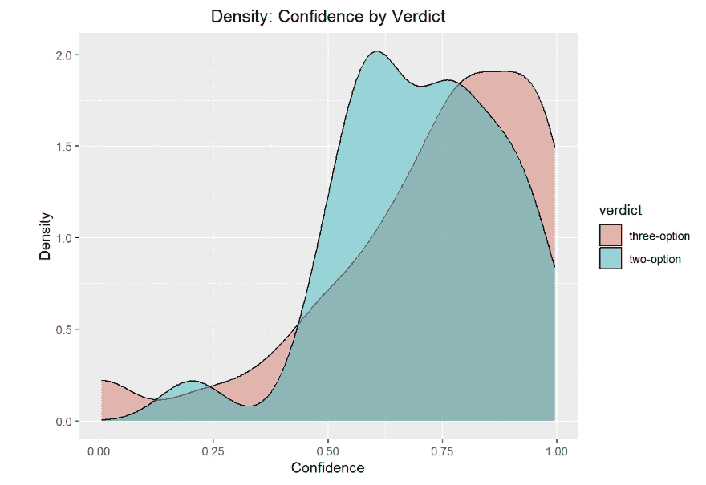

信心密度按判决分类

这张图提供了更有力的证据，表明`置信度`水平在两个判决系统中并非均匀分布。似乎相对于三选项判决系统，陪审团在两选项判决系统下对他们的判决可能稍微不那么自信。这一点得到了以下事实的支持：两选项和三选项判决系统下`置信度`的分布似乎分别在 0.625 和 0.875 处达到峰值。然而，两个判决系统的`置信度`分布仍然存在显著的重叠，因此我们需要正式测试我们的主张，以得出置信度水平在这些判决系统中是否存在显著差异的结论。

让我们考察`置信度`的分布是否在`判决`和`矛盾`的联合层级上有所不同。

```py
# plot distribution of Confidence by Conflict & Verdict
# use Sheather-Jones bandwidth for density estimate
ggplot(mock, aes(x = confidence, fill = conflict)) +
  geom_density(alpha = 0.5, bw = bw.SJ(mock$confidence)) +
  facet_wrap(~ verdict) +
  labs(title = paste("Density: Confidence by Conflict & Verdict")) +
  xlab("Confidence") +
  ylab("Density") +
  theme(plot.title = element_text(hjust = 0.5))
```

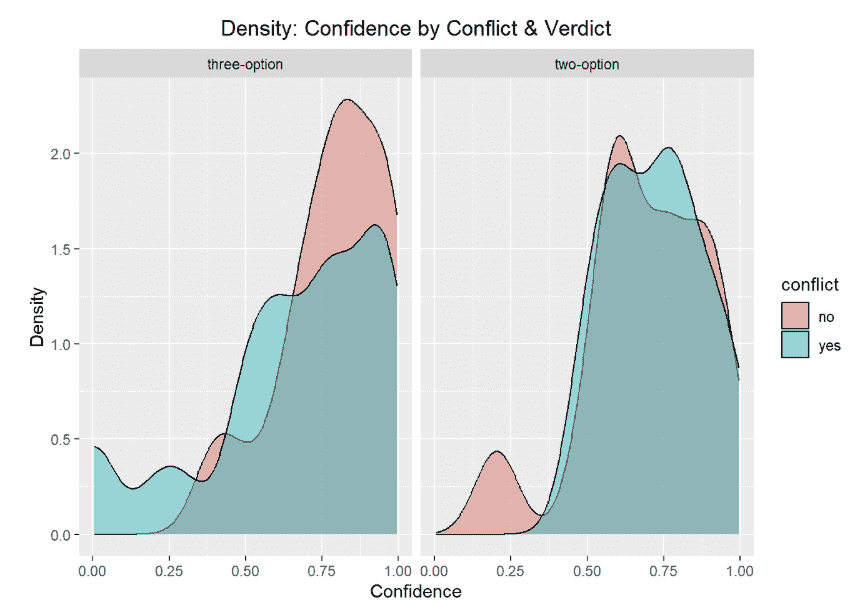

`矛盾`与`判决`的`置信度`密度。

通过按`矛盾`和`判决`分层分析`置信度`的分布，我们可以获得一些有趣的见解。

+   在两判决系统下，基于矛盾证据/无矛盾证据做出的判决的置信水平似乎非常相似。也就是说，当在传统的**有罪/无罪**判决范式下工作时，陪审团在面对矛盾证据时对他们的判决似乎同样自信。

+   相比之下，在三种选项的判决下，陪审团在没有矛盾证据的情况下对他们的判决似乎比在有矛盾证据的情况下更有信心。他们相应的密度图显示，在没有矛盾证据的情况下做出的判决在较高的`置信度`水平（`置信度`> 0.75）上显示出更高的集中度，而与有矛盾证据做出的判决相比。此外，在没有矛盾证据的情况下，几乎没有陪审团报告的`置信度`水平低于 0.2。相反，在有矛盾证据的情况下，有低`置信度`水平（`置信度`< 0.25）的判决集中度要大得多。

* * *

### 正式测试分布差异。

我们的数据探索性分析表明，陪审团的置信度水平可能因判决系统以及是否存在矛盾证据而有所不同。让我们通过比较按这些因素划分的`置信度`密度来正式测试这一点。

我们将进行测试，比较以下设置中的`置信度`分布（正如我们上面以定性的方式所做的那样）：

+   `矛盾`各层级的`置信度`分布。

+   `判决`各层级的`置信度`分布。

+   `矛盾`与`判决`层级的`置信度`分布。

首先，让我们比较存在冲突/无冲突证据时`置信度`的分布。我们可以使用[**sm.density.compare()**](https://cran.r-project.org/web/packages/sm/index.html)函数，该函数是[**sm**](https://cran.r-project.org/web/packages/sm/index.html)包的一部分，来比较这些`置信度`分布在这些`冲突`级别。为了进行这项测试，我们可以指定以下关键参数：

+   `x`：我们想要建模的数据密度向量。在我们的情况下，这将是指`置信度`。

+   `group`：比较`x`密度的因素。在这个例子中，这将是指`冲突`。

+   `model`：将此设置为`equal`将执行一个假设检验，以确定`置信度`的分布是否在`冲突`级别上有所不同。

此外，我们将在`冲突`级别的`置信度`密度估计中建立一个共同的带宽。我们将通过计算每个`冲突`子组的`置信度`的 Sheather-Jones 带宽来实现这一点，然后计算这些带宽的调和平均值，然后将该值设置为密度比较的带宽。

在我们下面的所有假设检验中，我们将使用标准的α = 0.05 标准来评估[统计显著性](https://www.statsig.com/blog/understanding-significance-levels-a-key-to-accurate-data-analysis)。

```py
set.seed(123)

# define subsets for conflict
no_conflict <- subset(mock, conflict=="no")
yes_conflict <- subset(mock, conflict=="yes")

# compute Sheather-Jones bandwidth for subsets
bw_n <- bw.SJ(no_conflict$confidence)
bw_y <- bw.SJ(yes_conflict$confidence)
bw_h <- 2/((1/bw_n) + (1/bw_y)) # harmonic mean

# compare densities
sm.density.compare(x=mock$confidence, 
                   group=mock$conflict, 
                   model="equal", 
                   bw=bw_h, 
                   nboot=10000)
```

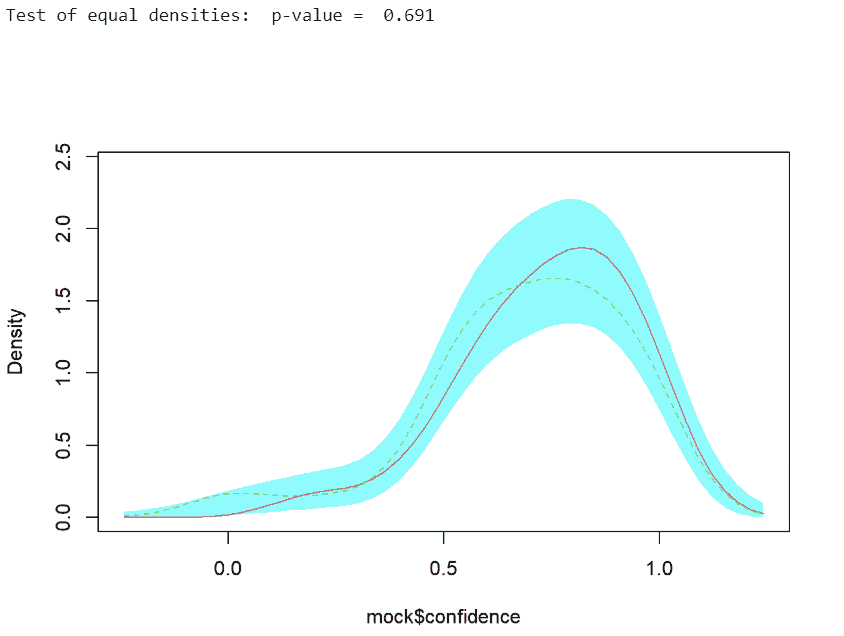

通过冲突比较的置信度密度测试

我们对**sm.density.compare()**的调用输出上述假设检验的 p 值，以及覆盖两个`冲突`级别的`置信度`密度曲线的图形显示。大的 p 值（p=0.691）表明我们没有足够的证据来拒绝零假设，即冲突/无冲突的`置信度`密度相等。换句话说，这表明在我们的数据集中，陪审员倾向于对他们的判决有相似的信心，无论证词中是否存在冲突证据。

现在，我们将进行类似的分析，以正式比较两个判决系统和三个判决系统中的陪审员置信度水平。

```py
set.seed(123)

# define subsets for conflict
two_verdict <- subset(mock, verdict=="two-option")
three_verdict <- subset(mock, verdict=="three-option")

# compute Sheather-Jones bandwidth for subsets
bw_2 <- bw.SJ(two_verdict$confidence)
bw_3 <- bw.SJ(three_verdict$confidence)
bw_h <- 2/((1/bw_2) + (1/bw_3)) # harmonic mean

# compare densities
sm.density.compare(mock$confidence, group=mock$verdict, model="equal", 
                   bw=bw_h, nboot=10000)
```

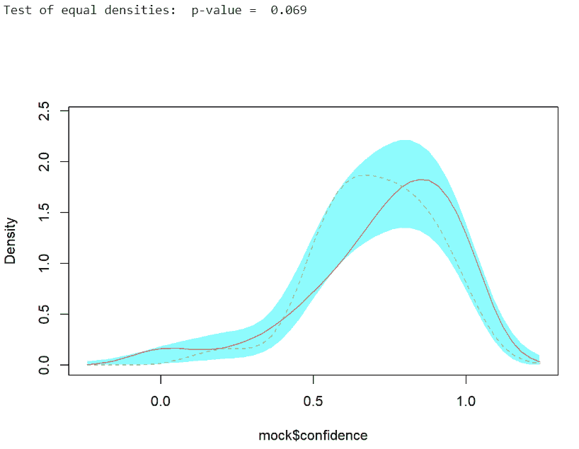

通过判决比较的置信度密度测试

我们可以看到，与两判决对三判决系统的`置信度`比较相关的 p 值要小得多（p=0.069）。尽管我们仍然未能拒绝零假设，但在这个背景下，p 值为 0.069 意味着如果两个判决和三个判决系统的`置信度`水平真实分布相同，那么我们遇到的经验数据中，两个判决系统`置信度`分布的差异至少与我们看到的一样大的概率大约为 7%。换句话说，如果陪审员在两个判决系统中对他们的判决同样有信心，我们的经验数据不太可能发生。

这个结论与我们上面进行的定性分析结果一致，其中似乎表明在两判决与三判决系统中，判决的置信水平不同——具体来说，三判决系统下的判决似乎比两判决系统下的判决具有更高的置信度。

现在，为了未来的研究，将数据扩展到包括最终判决决定（即有罪/无罪/证据不足）将是非常好的。也许，这些额外的数据可以帮助揭示陪审员如何真正看待“证据不足”的判决。

+   如果在三个判决系统下的“有罪”/“无罪”判决中观察到更高的置信水平，相对于两判决系统，这可能表明“证据不足”的判决有效地捕捉了陪审员决策背后的不确定性，并且作为一个第三判决提供了两选项判决系统所缺乏的灵活性。

+   如果在“有罪”/“无罪”判决中，两个判决系统的置信水平大致相等，并且在三判决系统中，所有三个判决的置信水平也大致相等，那么这可能表明“证据不足”的判决正在作为一个真正的第三选项独立于典型的二元判决。也就是说，陪审员选择“证据不足”主要是出于其他原因，而不仅仅是他们不确定将被告归类为有罪/无罪。也许，陪审员认为“证据不足”是在检方未能提供令人信服的证据时选择的判决，即使陪审员对被告的真实罪责有所了解。

最后，让我们测试在不同级别的`conflict`和`verdict`下`confidence`分布是否存在差异。

为了测试这些子组之间置信度分布的差异，我们可以运行[Kruskal-Wallis 测试](https://datatab.net/tutorial/kruskal-wallis-test)。Kruskal-Wallis 测试是一种非参数统计方法，用于测试感兴趣变量在组间分布的差异。当您想要避免对变量的分布做出假设（即非参数），变量本质上是序数的，并且比较的子组之间相互独立时，它是合适的。本质上，您可以将它视为[单因素方差分析](https://datatab.net/tutorial/one-factorial-anova)的非参数、多组版本。

R 语言通过[**kruskal.test()**](https://www.rdocumentation.org/packages/stats/versions/3.6.2/topics/kruskal.test) API 使我们能够轻松实现这一点。我们可以指定以下参数来执行我们的测试：

+   `x`：我们想要比较其分布的数据向量。在我们的情况下，这将是指`confidence`。

+   `g`：一个因子，用于标识我们想要比较的`x`分布的组。我们将将其设置为`group_combo`，它包含`verdict`和`conflict`的子组。

```py
kruskal.test(x=mock$confidence, 
             g=mock$group_combo) # group_combo: subgroups defined by verdict, conflict
```

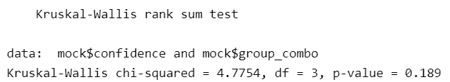

按冲突和判决的 Kruskal-Wallis 检验信心

Kruskal-Wallis 检验的输出（p=0.189）表明，我们没有足够的证据来断言陪审团的信心水平在“判决”和“冲突”的各个级别上存在差异。

这有些出乎意料，因为我们的定性分析似乎表明，按“冲突”将每个“判决”组分割，以有意义的方式分割了“信心”值。值得注意的是，这些子组中的数据量都很少（25-27 个观察值），因此收集更多数据可能是进一步调查这一点的下一步。

* * *

### 未来调查与总结

让我们简要回顾一下我们分析的结果：

+   我们的数据探索性分析似乎表明，陪审团对判决系统的信心水平存在差异。此外，存在矛盾证据似乎会影响三个判决系统中的陪审团信心水平，但在两个判决系统中影响很小。然而，我们进行的所有统计测试都没有提供显著证据来支持这些结论。

+   尽管我们的统计测试不支持，但我们不应如此迅速地否定我们的定性分析。这项调查的下一步可能包括获取更多数据，因为我们只处理了 104 个观察值。此外，将我们的数据扩展到包括陪审团的判决决定（有罪/无罪/证据不足）可能有助于进一步调查陪审团何时选择“证据不足”的判决。

感谢阅读！如果您有关于如何进行这项分析的额外想法，我非常愿意在评论中听到。我当然不是法律理论的领域专家，所以将统计方法应用于法律数据对我来说是一次很好的学习经历，我很乐意了解两个领域交叉的其他有趣问题。如果您有兴趣进一步了解，我强烈推荐查看以下资源！

*作者已创建本文中的所有图像。*

* * *

### 来源

数据：

+   [模拟陪审团对其判决的信心](https://vincentarelbundock.github.io/Rdatasets/doc/betareg/MockJurors.html)

法律理论：

+   [三个判决问题](https://scholarship.law.umn.edu/faculty_articles/1089/)

+   [陪审团决策：心理学的影响与启示](https://www.law.nyu.edu/sites/default/files/upload_documents/Jury-Decision-Making.pdf)

统计学：

+   [密度估计](https://medium.com/data-science-collective/non-parametric-density-estimation-theory-and-applications-6b31eeb0ee20)

+   [带宽选择](https://aakinshin.net/posts/kde-bw/)

+   [统计显著性 & p 值](https://www.statsig.com/blog/understanding-significance-levels-a-key-to-accurate-data-analysis)

+   [Kruskal-Wallis 检验](https://datatab.net/tutorial/kruskal-wallis-test)
