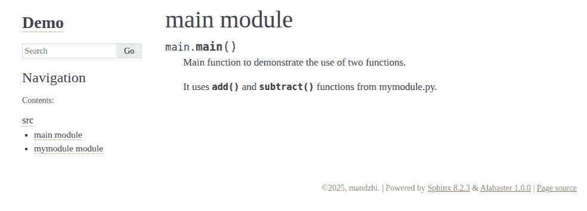
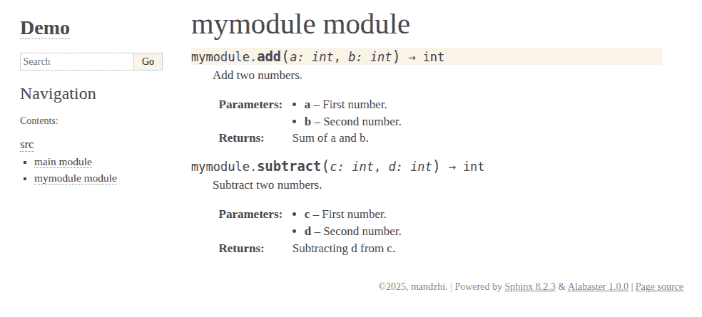
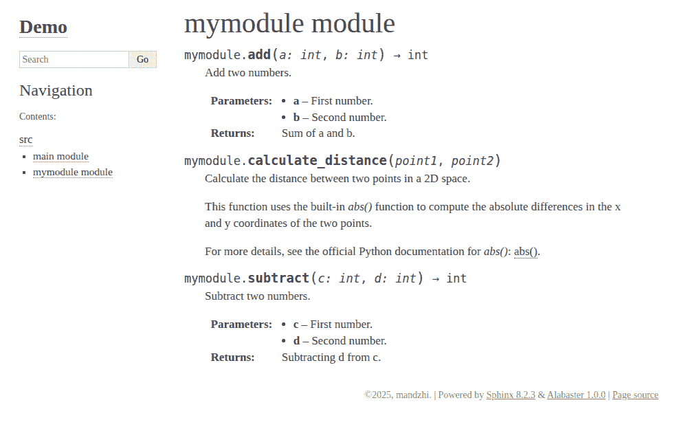
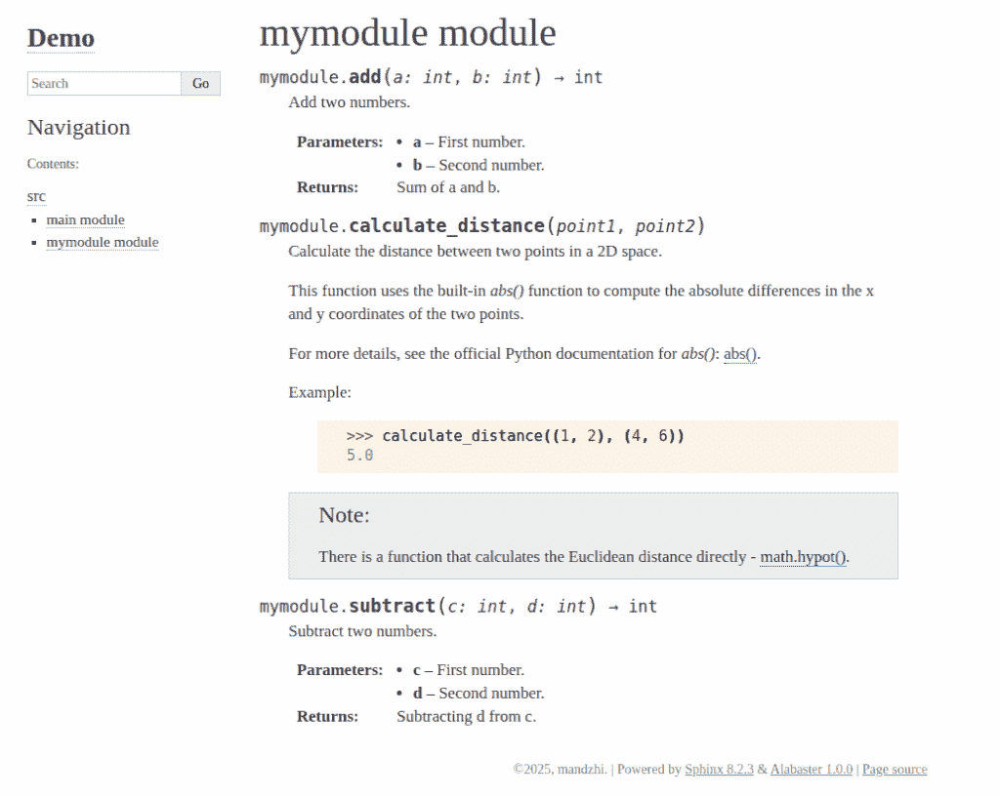

# 将 Sphinx 的功能应用于创建您下一个数据科学项目的文档

> 原文：[`towardsdatascience.com/apply-sphinxs-functionality-to-create-documentation-for-your-next-data-science-project/`](https://towardsdatascience.com/apply-sphinxs-functionality-to-create-documentation-for-your-next-data-science-project/)

## <mdspan datatext="el1750137818137" class="mdspan-comment">引言</mdspan>

良好的文档对于几乎任何数据科学项目都是至关重要的，因为它增强了清晰度，促进了协作，并确保了可重复性。清晰简洁的文档为项目的目标、方法和发现提供了背景，使得其他团队成员（尤其是新手）和利益相关者更容易理解所做工作的含义。此外，文档还作为未来增强或故障排除的参考，减少了重新解释甚至刷新主要概念所需的时间。

听起来很有吸引力，不是吗？但你是否知道，您可以通过使用 docstrings，通过 Sphinx 文档工具以一致的风格创建功能文档？如果您对 Sphinx 的功能还不太了解，这篇文章可以帮助您弄清楚。

> **关于 docstrings 的简短说明**
> 
> Docstrings 是出现在代码中任何类、类方法和函数中的注释块。
> 
> Sphinx 官方支持三种主要的 docstring 格式：Google [[1](https://google.github.io/styleguide/pyguide.html)]，NumPy [[2](https://numpydoc.readthedocs.io/en/latest/format.html)] 和 reStructuredText (reST) [[3](https://docutils.sourceforge.io/rst.html)]。选择哪一种取决于你，但在这篇文章中，我将使用 reST 格式，因为它具有多功能性。

在这篇文章中，我将向您介绍 Sphinx 工具中最令人印象深刻的三个功能，这些功能可以自动为 Python 模块生成文档。在考虑这三个案例之前，我假设您已经创建了一个文档目录并在您的机器上安装了 Sphinx。如果没有，请先阅读 TDS 文章，了解如何安装和设置 Sphinx [[4](https://towardsdatascience.com/step-by-step-basics-code-autodocumentation-fa0d9ae4ac71/)]。

安装 Sphinx 后，通过命令 `sphinx-quickstart` 创建一个新的 Sphinx 项目。按照提示设置您的项目。这将使您的目录中包含几个文件，包括 `conf.py` 和 `index.rst`。

## 案例一：使用交叉引用进行快速导航

根据 Sphinx 的官方网站，其最有用的功能之一是通过语义交叉引用角色创建自动交叉引用。交叉引用可以用来链接到函数、类、模块，甚至文档中的章节。

例如，对对象描述的交叉引用，如 `` :func:`.name` ``，将创建一个链接到 `name()` 被文档化的地方。

让我们看看实际是如何的。想象一下，我们有一个简单的 Python 模块`mymodule.py`，其中包含两个基本函数。

第一个函数是关于两个数字相加：

```py
def add(a: int, b: int) -> int:
    """
    Add two numbers.

    :param a: First number.
    :param b: Second number.
    :return: Sum of a and b.
    """
    return a + b
```

第二点是关于从一个数字中减去另一个数字：

```py
def subtract(c: int, d: int) -> int:
    """
    Subtract two numbers.

    :param c: First number.
    :param d: Second number.
    :return: Subtracting d from c.
    """
    return c - d
```

可以使用`:func:`在文档中创建对这些两个函数的交叉引用（`:func:.add`，`:func:.subtract`）。让我们创建另一个文件（`main.py`），它将使用`mymodule.py`中的函数。如果你想记录这个文件，也可以在这里添加 docstrings：

```py
from mymodule import add, subtract
def main():
   """
   Main function to demonstrate the use of two functions.

   It uses :func:`.add` and :func:`.subtract` functions from mymodule.py.
   """
   # Call the first function
   first = add(2,3)
   print(first)

   # Call the second function
   second = subtract(9,8)
   print(second)

if __name__ == "__main__":
   main()
```

要从你的代码中自动生成文档，你可以在`conf.py`文件中启用 autodoc 扩展。将`'sphinx.ext.autodoc'`添加到扩展列表中：

`extensions = ['sphinx.ext.autodoc']`

确保包含你模块的路径，以便 Sphinx 可以找到它。在`conf.py`文件顶部添加以下行：

```py
import os
import sys
sys.path.insert(0,  os.path.abspath('../src')) # mymodule.py and main.py are located in src folder in documentation directory
```

然后我们需要生成我们 Python 包的`.rst`文件。这是 Sphinx 自己的格式，在生成 HTML 文件之前需要生成。使用`apidoc`命令处理`.rst`文件会更快。在终端运行：

```py
sphinx-apidoc -o source src
```

这里`-o source`定义了放置输出文件的目录，而`src`设置了我们需要描述的 Python 模块的位置。运行此命令后，新生成的`.rst`文件将出现在你的文件夹中。

最后，导航到你的文档文件夹并运行：

```py
make html
```

这将在`_build/html`目录中生成 HTML 文档。在网页浏览器中打开生成的 HTML 文件。你应该看到带有交叉引用的添加和减法函数的文档：



点击函数名称，你将被带到包含其描述的页面：



## 情况 2.添加外部资源链接

除了插入交叉引用的能力外，Sphinx 还允许你添加指向外部资源的链接。以下是一个示例，说明如何在`mymodule.py`文件中创建一个函数，该函数利用内置的`abs()`函数来演示如何在 docstrings 中添加指向官方 Python 文档的链接：

```py
def calculate_distance(point1, point2):
   """
   Calculate the distance between two points in a 2D space.

   This function uses the built-in `abs()` function to compute the absolute     
   differences in the x and y coordinates of the two points.

   For more details, see the official Python documentation for `abs()`:
   `abs() <https://docs.python.org/3/library/functions.html#abs>`_.
   """
   a, b = point1
   c, d = point2

   # Calculate the differences in x and y coordinates
   delta_x = abs(c - a)
   delta_y = abs(d - b)

   # Calculate the Euclidean distance using the Pythagorean theorem
   distance = (delta_x**2 + delta_y**2) ** 0.5
   return distance
```

对于这个案例运行`make html`命令会提供以下输出：



### 情况 3.创建特殊指令和示例以获得更好的视觉效果

在 Sphinx 中，你可以使用不同的警告、消息和警告以及获得的结果的具体示例来创建简短的段落。让我们通过添加注释指令和示例来丰富我们的模块。

```py
def calculate_distance(point1, point2):
   """
   Calculate the distance between two points in a 2D space.

   This function uses the built-in `abs()` function to compute the absolute
   differences in the x and y coordinates of the two points.

   For more details, see the official Python documentation for `abs()`:
   `abs() <https://docs.python.org/3/library/functions.html#abs>`_.

   Example:
       >>> calculate_distance((1, 2), (4, 6))
       5.0

   .. note::
       There is a function that calculates the Euclidean distance directly - `math.hypot() <https://docs.python.org/3/library/math.html#math.hypot>`_.
   """
   a, b = point1
   c, d = point2

   # Calculate the differences in x and y coordinates
   delta_x = abs(c - a)
   delta_y = abs(d - b)

   # Calculate the Euclidean distance using the Pythagorean theorem
   distance = (delta_x**2 + delta_y**2) ** 0.5
   return distance
```

生成的 HTML 页面如下所示：



因此，为了在 docstrings 中添加任何示例，你需要使用`>>>`。要指定注释，只需使用`.. note::`。好事是，你可以在注释中添加指向外部资源的链接。

## 结论

详尽的文档不仅使他人能够更好地理解阅读的主题，而且能够深入与之互动，这对于技术和科学文档至关重要。总的来说，良好的文档促进了高效的知识传递，并有助于保持项目的长期发展，最终有助于其成功和影响力。

在这篇文章中，我们探讨了如何使用 Sphinx 文档工具创建一个简单但高质量的文档。我们不仅学习了如何从头开始创建 Sphinx 项目，还了解了如何使用其功能，包括交叉引用、外部资源链接和特殊指令。希望，你发现这些知识对你自己有帮助！

注意：文章中的所有图片均由作者制作。

### 参考文献

[1] Google Python 风格指南：[`google.github.io/styleguide/pyguide.html`](https://google.github.io/styleguide/pyguide.html) make html

[2] NumPy 风格指南：[`numpydoc.readthedocs.io/en/latest/format.html`](https://numpydoc.readthedocs.io/en/latest/format.html)

[3] reStructuredText 风格指南：[`docutils.sourceforge.io/rst.html`](https://docutils.sourceforge.io/rst.html)

[4] “逐步基础：代码自动文档化”文章：[`towardsdatascience.com/step-by-step-basics-code-autodocumentation-fa0d9ae4ac71`](https://towardsdatascience.com/step-by-step-basics-code-autodocumentation-fa0d9ae4ac71)

[5] Sphinx 文档工具的官方网站：[`www.sphinx-doc.org/en/master/`](https://www.sphinx-doc.org/en/master/)
