# 我们是否比内容看了更多的广告？分析 YouTube 赞助数据

> 原文：[`towardsdatascience.com/are-we-watching-more-ads-than-content-analyzing-youtube-sponsor-data/`](https://towardsdatascience.com/are-we-watching-more-ads-than-content-analyzing-youtube-sponsor-data/)

<mdspan datatext="el1742417761800" class="mdspan-comment">我确实</mdspan>不是唯一一个觉得 YouTube 的赞助片段最近变得更长、更频繁的人。有时候，我观看的视频似乎每隔几秒钟就在试图向我推销什么。

<mdspan datatext="el1742607365299" class="mdspan-comment">一方面，很高兴小型和中型 YouTube 创作者能够通过他们的技艺谋生，但另一方面</mdspan>，确实很烦人，总是被广告轰炸。

在这篇博客文章中，我将探讨这些赞助片段，使用来自一个流行的浏览器扩展 SponsorBlock 的数据，来找出感知到的广告增加实际上是否真的发生了，以及量化我看了多少广告。

我将带你了解我的分析，提供 SQL、DuckDB 和 pandas 的代码片段。所有代码都可在我的 GitHub 上找到[https://github.com/mtrentz/sponsorblock-analysis]，由于数据集是开放的，我还会教你如何下载它，这样你就可以跟随并自己玩转这些数据。

这些是我将在这次分析中试图回答的问题：

+   **赞助片段在过去几年中是否有所增加？**

+   **哪些频道每视频的赞助时间百分比最高？**

+   **视频中的赞助片段密度是多少？**

为了得到这些答案，我们不得不走很长的路。这是本篇文章的议程：

+   SponsorBlock 是如何工作的

+   清洗数据

+   探索和增强数据

+   回答每个问题

+   结论

让我们开始吧！

## 如何工作

SponsorBlock 是一个扩展程序，允许你跳过视频中的广告片段，类似于你跳过 Netflix 的片头。它非常准确，因为我记得自从我大约一个月前开始使用它以来，我没有看到任何一个错误的片段，而且我观看了很多非英语创作者的视频。

你可能会问自己这个扩展程序是如何知道视频的哪些部分是赞助内容的，信不信由你，答案是众包！

用户提交广告片段的时间戳，其他用户投票决定其准确性。对于没有贡献的平均用户来说，你唯一需要做的就是按 Enter 键跳过广告。


好的，现在你已经知道了 SponsorBlock 是什么，让我们来谈谈数据。

## 清洗数据

如果你想跟进，你可以使用这个[SponsorBlock 镜像](https://github.com/mchangrh/sb-mirror)（下载所有内容可能需要相当多的时间）。数据库模式可以在[这里](https://github.com/ajayyy/SponsorBlockServer/blob/master/DatabaseSchema.md)查看，尽管其中大部分对这个项目来说都不会很有用。

如预期的那样，他们的数据库模式是为了使扩展正常工作而设计的，而不是为了某个家伙从巨大的社区努力中窃取信息，以找出他最喜欢的创作者运行广告的百分比。为此，需要对数据进行一些清理和建模工作。

对于这个分析来说，只有两个表是重要的：

+   `sponsorTimes.csv`：这是最重要的表，包含所有众包赞助片段的`startTime`和`endTime`。CSV 文件大约有 5GB。

+   `videoInfo.csv`：包含每个视频的标题、发布日期和与每个视频关联的频道 ID。

在我们深入之前，这些都是我最终使用的所有库。随着我们的进行，我会解释那些不太明显的库。

```py
pandas
duckdb
requests
requests-cache
python-dotenv
seaborn
matplotlib
numpy
```

因此，第一步是加载数据。令人惊讶的是，这已经有点具有挑战性，因为我解析 CSV 文件的一些行时遇到了很多错误。这是我找到的大多数行可以正常工作的设置：

```py
import duckdb
import os

# Connect to an in-memory DuckDB instance
con = duckdb.connect(database=':memory:')

sponsor_times = con.read_csv(
    "sb-mirror/sponsorTimes.csv",
    header=True,
    columns={
        "videoID": "VARCHAR",
        "startTime": "DOUBLE",
        "endTime": "DOUBLE",
        "votes": "INTEGER",
        "locked": "INTEGER",
        "incorrectVotes": "INTEGER",
        "UUID": "VARCHAR",
        "userID": "VARCHAR",
        "timeSubmitted": "DOUBLE",
        "views": "INTEGER",
        "category": "VARCHAR",
        "actionType": "VARCHAR",
        "service": "VARCHAR",
        "videoDuration": "DOUBLE",
        "hidden": "INTEGER",
        "reputation": "DOUBLE",
        "shadowHidden": "INTEGER",
        "hashedVideoID": "VARCHAR",
        "userAgent": "VARCHAR",
        "description": "VARCHAR",
    },
    ignore_errors=True,
    quotechar="",
)

video_info = con.read_csv(
    "sb-mirror/videoInfo.csv",
    header=True,
    columns={
        "videoID": "VARCHAR",
        "channelID": "VARCHAR",
        "title": "VARCHAR",
        "published": "DOUBLE",
    },
    ignore_errors=True,
    quotechar=None,
)

# Ignore warnings
import warnings
warnings.filterwarnings('ignore')
```

下面是数据样本的示例：

```py
con.sql("SELECT videoID, startTime, endTime, votes, locked, category FROM sponsor_times LIMIT 5")

con.sql("SELECT * FROM video_info LIMIT 5")
```

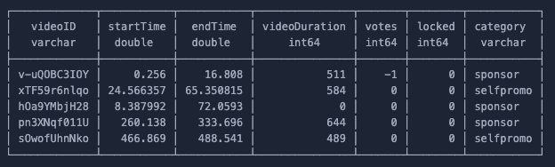

sponsorTimes.csv 样本

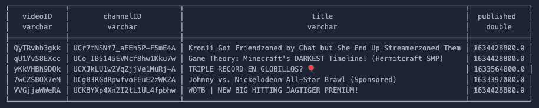

videoInfo.csv 样本

理解`sponsorTimes`表中的数据非常重要，否则清理过程将没有任何意义。

每一行代表一个用户提交的赞助视频的时间戳。**由于多个用户可以为同一视频提交片段，数据集中包含重复和可能不正确的条目**，这些条目在清理过程中需要处理。

为了找到不正确的片段，我将使用`votes`和`locked`列，因为后者代表已确认正确的片段。

另一个重要的列是`category`。有许多类别，如简介、结束语、填充等。**对于这次分析，我将只处理赞助和自我推广。**

我首先应用了一些过滤器：

```py
CREATE TABLE filtered AS
SELECT
    *
FROM sponsor_times
WHERE category IN ('sponsor', 'selfpromo') AND (votes > 0 OR locked=1)
```

**过滤锁定片段或拥有超过 0 票的片段是一个重大的决定**。这大幅减少了数据集的大小，但这样做使得数据非常可靠。例如，在这样做之前，所有广告比例最高的前 50 个频道都是垃圾邮件，随机频道，播放了 99.9%的广告。

完成这些后，下一步是获取一个数据集，其中每个赞助片段只出现一次。例如，一个在开头和结尾都有赞助片段的视频应该只有两行数据。

到目前为止，情况并非如此，因为在单个视频中，我们可以为每个段落有多个用户提交的条目。为了做到这一点，我将使用窗口函数来识别是否有两个或更多行数据代表同一段落。

第一个窗口函数比较一行中的`startTime`与前一行的`endTime`。如果这些值不重叠，则表示它们是不同段落的条目，否则它们是同一段落的重复条目。

```py
CREATE TABLE new_segments AS
SELECT
    -- Coalesce to TRUE to deal with the first row of every window
    -- as the values are NULL, but it should count as a new segment.
    COALESCE(startTime > LAG(endTime) 
      OVER (PARTITION BY videoID ORDER BY startTime), true) 
      AS new_ad_segment,
    *
FROM filtered
```

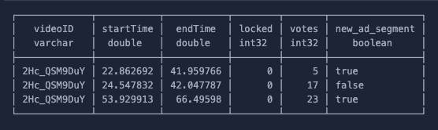

单个视频的窗口函数示例。

当一行代表视频的新段落时，`new_ad_segment`列总是为 TRUE。前两行，由于它们的时间戳重叠，被正确标记为同一段落。

接下来，第二个窗口函数将按编号标记每个广告段落：

```py
CREATE TABLE ad_segments AS
SELECT
    SUM(new_ad_segment) 
      OVER (PARTITION BY videoID ORDER BY startTime)
      AS ad_segment,
    *
FROM new_segments
```

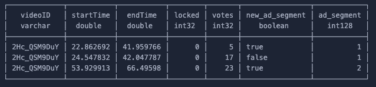

单个视频的广告段落的标签示例。

最后，现在每个段落都已正确编号，很容易找到被锁定或拥有最高投票数的段落。

```py
CREATE TABLE unique_segments AS
SELECT DISTINCT ON (videoID, ad_segment)
    *
FROM ad_segments
ORDER BY videoID, ad_segment, locked DESC, votes DESC
```

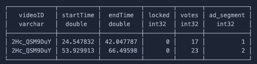

单个视频的最终数据集示例。

就这样！现在这个表格为每个唯一的广告段落有一行，我可以开始探索数据了。

如果这些查询看起来很复杂，并且你需要对窗口函数进行复习，请查看这篇[博客](https://towardsdatascience.com/understand-sql-window-functions-once-and-for-all-4447824c1cb4/)，它将教你所有你需要知道的关于它们的知识！博客中最后讨论的例子几乎就是我这里使用的几乎完全相同的过程。

## 探索和增强数据

最后，数据集已经足够好，可以开始探索了。我做的第一件事是了解数据的规模：

+   **36.0k 个独特的频道**

+   **552.6k 个独特的视频**

+   **673.8k 个独特的赞助段落**，平均每个视频有 1.22 个段落

如前所述，通过筛选出被锁定或至少有 1 个赞的段落，数据集大幅减少，大约减少了 80%。但这是我为了得到可以工作的数据而必须付出的代价。

为了检查数据是否没有立即出现错误，我收集了拥有最多视频的频道：

```py
CREATE TABLE top_5_channels AS 
SELECT
    channelID,
    count(DISTINCT unique_segments.videoID) AS video_count
FROM
    unique_segments
    LEFT JOIN video_info ON unique_segments.videoID = video_info.videoID 
WHERE
    channelID IS NOT NULL
    -- Some channel IDs are blank
    AND channelID != '""'
GROUP BY
    channelID
ORDER BY
    video_count DESC
LIMIT 5
```

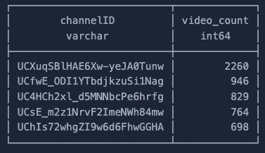

每个频道的视频数量看起来很真实……但与它们一起工作真是太糟糕了。我不想每次想知道频道名称时都去浏览器查找频道 ID。

为了解决这个问题，我创建了一个小脚本，其中包含从 YouTube API 获取这些值的函数。我使用`requests_cache`库来确保我不会重复 API 调用并耗尽 API 限制。

```py
import requests
import requests_cache
from dotenv import load_dotenv
import os

load_dotenv()
API_KEY = os.getenv("YT_API_KEY")

# Cache responses indefinitely
requests_cache.install_cache("youtube_cache", expire_after=None)

def get_channel_name(channel_id: str) -> str:
    url = (
        f"https://www.googleapis.com/youtube/v3/channels"
        f"?part=snippet&id={channel_id}&key={API_KEY}"
    )
    response = requests.get(url)
    data = response.json()

    try:
        return data.get("items", [])[0].get("snippet", {}).get("title", "")
    except (IndexError, AttributeError):
        return ""
```

此外，我还创建了非常类似的功能来获取每个频道的国家和缩略图，这将在以后很有用。如果你对代码感兴趣，请查看[GitHub 仓库](https://github.com/mtrentz/sponsorblock-analysis)。

在我的 DuckDB 代码中，我现在能够注册这个 Python 函数并在 SQL 中调用它们！我只需要非常小心地始终在聚合和过滤的数据上使用它们，否则，我可以说再见了我的 API 配额。

```py
# This the script created above
from youtube_api import get_channel_name

# Try registering the function, ignore if already exists
try:
    con.create_function('get_channel_name', get_channel_name, [str], str)
except Exception as e:
    print(f"Skipping function registration (possibly already exists): {e}")

# Get the channel names
channel_names = con.sql("""
    select
        channelID,
        get_channel_name(channelID) as channel_name,
        video_count
    from top_5_channels
""")
```

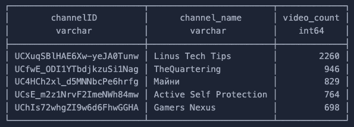

好多了！我查看了 YouTube 上我熟悉的两个频道，进行快速合理性检查。Linus Tech Tips 共有 7.2k 个视频上传，其中 2.3k 包含在这个数据集中。Gamers Nexus 有 3k 个视频，其中 700 个包含在数据集中。对我来说看起来足够好了！

在真正回答我设定要回答的问题之前，最后一件事是了解视频的平均时长。

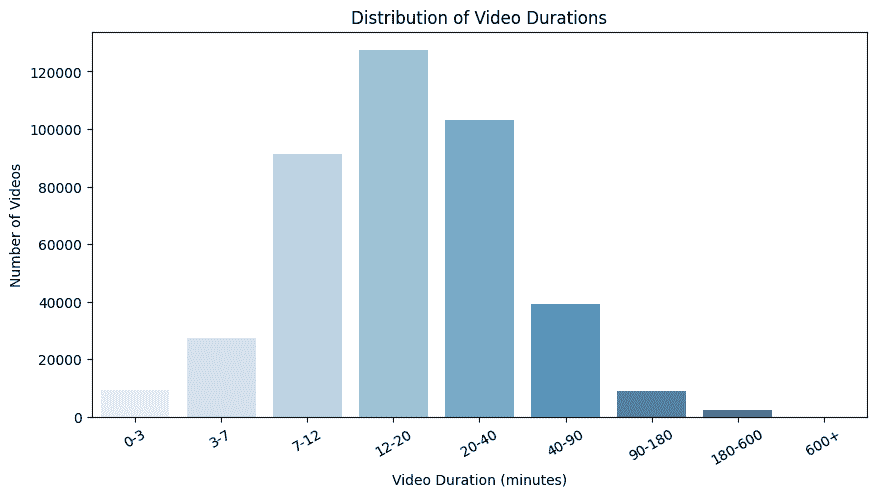

这在很大程度上符合我的预期。我仍然对 20-40 分钟视频的数量有点惊讶，因为多年来“元规则”是制作 10 分钟的视频以最大化 YouTube 自身的广告。

此外，我认为之前图表中使用的视频时长桶相当能代表我对视频长度的看法，所以我会继续使用它们在接下来的部分。

作为参考，这是创建那些桶所使用的 pandas 代码。

```py
video_lengths = con.sql("""
  SELECT DISTINCT ON (videoID)
      videoID,
      videoDuration
  FROM
      unique_segments
  WHERE
      videoID IS NOT NULL
      AND videoDuration > 0
"""
).df()

# Define custom bins, in minutes
bins = [0, 3, 7, 12, 20, 40, 90, 180, 600, 9999999] 
labels = ["0-3", "3-7", "7-12", "12-20", "20-40", "40-90", "90-180", "180-600", "600+"]

# Assign each video to a bucket (trasnform duration to min)
video_lengths["duration_bucket"] = pd.cut(video_lengths["videoDuration"] / 60, bins=bins, labels=labels, right=False)
```

## 赞助段落是否在过去几年中增加？

最大的问题。这将证明我是否过于担心每个人都在试图随时随地向我推销东西。不过，我会先回答一个更简单的问题，即不同视频时长中赞助商的百分比。

我的预期是，短视频相比长视频，其运行时间中来自赞助商的部分比例更高。让我们看看这是否确实如此。

```py
CREATE TABLE video_total_ads AS
SELECT
    videoID,
    MAX(videoDuration) AS videoDuration,
    SUM(endTime - startTime) AS total_ad_duration,
    SUM(endTime - startTime) / 60 AS ad_minutes,
    SUM(endTime - startTime) / MAX(videoDuration) AS ad_percentage,
    MAX(videoDuration) / 60 AS video_duration_minutes
FROM
    unique_segments
WHERE
    videoDuration > 0
    AND videoDuration < 5400
    AND videoID IS NOT NULL
GROUP BY
    videoID
```

为了保持可视化简单，我应用了类似的桶，但只到 90 分钟。

```py
# Define duration buckets (in minutes, up to 90min)
bins = [0, 3, 7, 12, 20, 30, 40, 60, 90]    
labels = ["0-3", "3-7", "7-12", "12-20", "20-30", "30-40", "40-60", "60-90"]

video_total_ads = video_total_ads.df()

# Apply the buckets again
video_total_ads["duration_bucket"] = pd.cut(video_total_ads["videoDuration"] / 60, bins=bins, labels=labels, right=False)

# Group by bucket and sum ad times and total durations
bucket_data = video_total_ads.groupby("duration_bucket")[["ad_minutes", "videoDuration"]].sum()

# Convert to percentage of total video time
bucket_data["ad_percentage"] = (bucket_data["ad_minutes"] / (bucket_data["videoDuration"] / 60)) * 100
bucket_data["video_percentage"] = 100 - bucket_data["ad_percentage"]
```

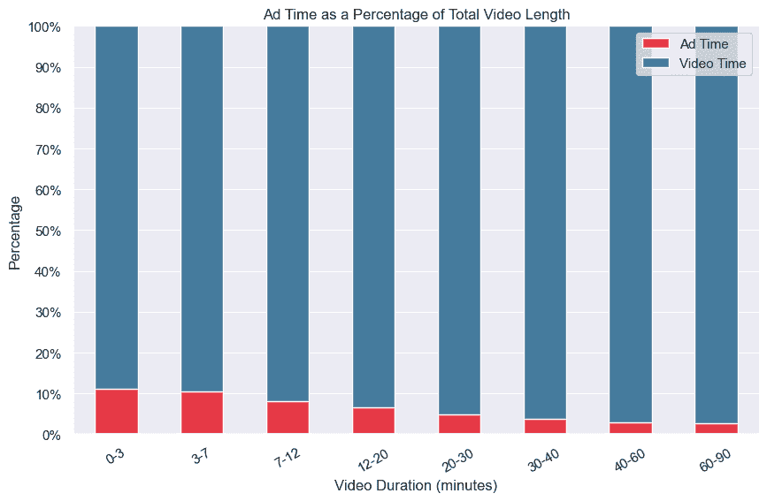

如预期的那样，如果你在 YouTube 上观看的是短时长的内容，那么其中大约 10%是赞助视频！时长为 12-20 分钟的视频有 6.5%的赞助商，而 20-30 分钟的视频只有 4.8%。

为了进行年度分析，我需要将赞助时间与`videoInfo`表连接起来。

```py
CREATE TABLE video_total_ads_joined AS
SELECT
    *
FROM
    video_total_ads
LEFT JOIN video_info ON video_total_ads.videoID = video_info.videoID
```

接下来，让我们看看每年有多少视频：

```py
SELECT
    *,
    to_timestamp(NULLIF (published, 0)) AS published_date,
    extract(year FROM to_timestamp(NULLIF (published, 0))) AS published_year
FROM
    video_total_ads
```

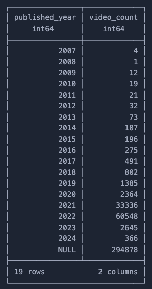

不太好，一点也不好。我并不完全清楚原因，但有很多视频没有记录时间戳。似乎只有 2021 年和 2022 年的视频才可靠地存储了它们的发布日期。

我确实有一些想法，关于如何使用其他公开数据来改进这个数据集，但这是一个非常耗时的工作，我会把这个留到未来的博客文章中。我不打算满足于基于有限数据的答案，但现在，我必须将就我所拥有的。

我选择将分析限制在 2018 年至 2023 年之间，因为这些年份有更多的数据点。

```py
# Limiting the years as for these here I have a decent amount of data.
start_year = 2018
end_year = 2023

plot_df = (
    video_total_ads_joined.df()
    .query(f"published_year >= {start_year} and published_year <= {end_year}")
    .groupby(["published_year", "duration_bucket"], as_index=False)
    [["ad_minutes", "video_duration_minutes"]]
    .sum()
)

# Calculate ad_percentage & content_percentage
plot_df["ad_percentage"] = (
    plot_df["ad_minutes"] / plot_df["video_duration_minutes"] * 100
)
plot_df["content_percentage"] = 100 - plot_df["ad_percentage"]
```

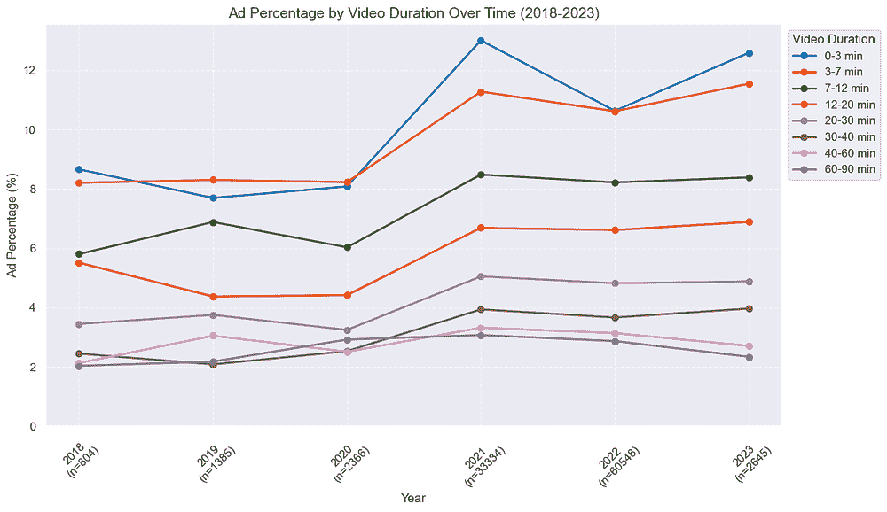

广告百分比急剧增加，尤其是在 2020 年到 2021 年之间，但之后趋于平稳，尤其是在较长的视频中。这在很大程度上是有道理的，因为在那几年里，随着人们在家的时间越来越多，在线广告增长了很多。

对于较短的视频，从 2022 年到 2023 年似乎有所增加。但由于数据有限，我没有 2024 年的数据，所以我无法得出结论性的答案。

接下来，让我们进入不依赖于发布日期的问题，这样我就可以处理更大一部分数据集。

## 哪些频道的视频赞助时间百分比最高？

这对我来说很有趣，因为我想知道我积极观看的频道是否是运行最多广告的频道。

从之前创建的表格继续，我可以轻松按频道分组广告和视频数量：

```py
CREATE TABLE ad_percentage_per_channel AS
SELECT
    channelID,
    sum(ad_minutes) AS channel_total_ad_minutes,
    sum(videoDuration) / 60 AS channel_total_video_minutes
FROM
    video_total_ads_joined
GROUP BY
    channelID
```

我决定筛选出数据中至少有 30 分钟视频的频道，作为消除异常值的一种方式。

```py
SELECT
    channelID,
    channel_total_video_minutes,
    channel_total_ad_minutes,
    channel_ad_percentage
FROM
    ad_percentage_per_channel
WHERE
    -- At least 30 minutes of video
    channel_total_video_minutes > 1800
    AND channelID IS NOT NULL
ORDER BY
    channel_ad_percentage DESC
LIMIT 50
```

如前所述，我还创建了一些函数来获取频道的国家和缩略图。这让我能够创建这个可视化。

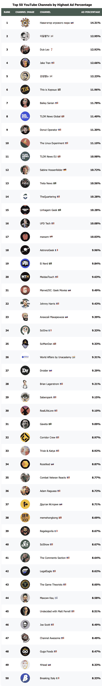

我不确定这让我感到惊讶与否。我经常观看列表上的一些频道，特别是 Gaveta（#31），一位巴西 YouTube 红人，他涵盖电影和电影剪辑。

我也知道，他和走廊团队（#32）都做了很多自我赞助，推广自己的内容和产品，所以也许其他频道也是这样！

无论如何，数据看起来不错，百分比似乎与我的手动检查和个人经验相符。

我很想知道你观看的频道是否在这个列表中，以及这让你感到惊讶与否！

如果你想看到前 150 位创作者，请[订阅我的免费通讯](https://mtrentz.substack.com/subscribe)，因为我会在这里发布完整的列表以及更多关于这次分析的信息！

## 视频中赞助片段的密度是多少？

你有没有想过视频广告在哪个点效果最好？人们可能只是跳过放在开始处的赞助片段，然后继续观看并关闭视频，对于放在结尾处的也是如此。

从个人经验来看，我觉得如果广告在视频中间播放，我更有可能观看，但我不认为这是创作者在大多数情况下所做的事情。

那么，我的目标就是创建一个显示视频播放期间广告密度的热图。做这件事出人意料地并不明显，而我找到的解决方案非常巧妙，几乎让我震惊。让我给你展示一下。

这是进行此分析所需的数据。每行一个广告，包括每个片段开始和结束的时间戳：

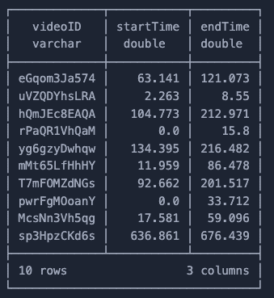

第一步是标准化间隔，例如，我不在乎广告从 63 秒开始，我想要知道的是它是否在视频运行时间的 1%处开始，还是在 50%处开始。

```py
CREATE TABLE ad_intervals AS
SELECT
    videoID,
    startTime,
    endTime,
    videoDuration,
    startTime / videoDuration AS start_fraction,
    endTime / videoDuration AS end_fraction
FROM
    unique_segments
WHERE
    -- Just to make sure we don't have bad data
    videoID IS NOT NULL
    AND startTime >= 0
    AND endTime <= videoDuration
    AND startTime < endTime
    -- Less than 40h
    AND videoDuration < 144000
```

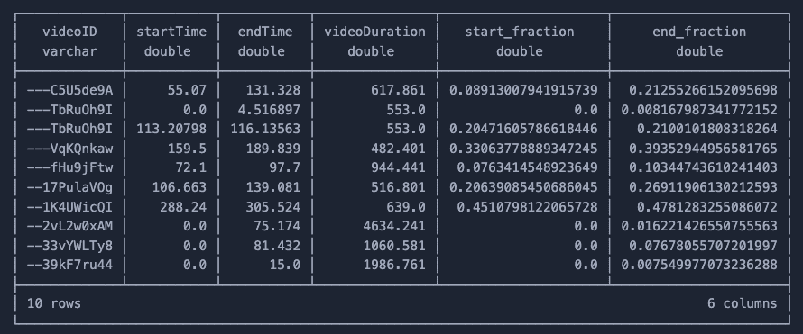

很好，现在所有区间都是可比较的，但问题远未解决。

我想让你思考，你会如何解决这个问题？如果我问你“在所有视频的 10%运行时间处，有多少广告正在播放？”

我不相信这是一个显而易见的问题。我的第一反应是创建一些桶，然后，对于每一行，我会问“在运行时间的 1%处是否有广告正在播放？2%呢？等等……”

虽然这听起来是个糟糕的想法。我无法用 SQL 完成它，解决这个问题的代码将会非常混乱。最终，我找到的解决方案的实现非常简单，使用了 Sweep Line Algorithm（扫描线算法），这是一种在编程面试和谜题中经常使用的算法。

我将向您展示我是如何解决这个问题的，但如果你不理解发生了什么，请不要担心。我将在稍后分享其他资源，让您了解更多相关信息。

首先要做的事情是将每个区间（startTime, endTime）转换为两个事件，一个事件在广告开始时计为+1，另一个事件在广告结束时计为-1。之后，只需按“开始时间”对数据集进行排序。

```py
CREATE TABLE ad_events AS
WITH unioned as (
  -- This is the most important step.
  SELECT
      videoID,
      start_fraction as fraction,
      1 as delta
  FROM ad_intervals
  UNION ALL
  SELECT
      videoID,
      end_fraction as fraction,
      -1 as delta
  FROM ad_intervals
), ordered AS (
  SELECT
      videoID,
      fraction,
      delta
  FROM ad_events
  ORDER BY fraction, delta
)
SELECT * FROM ordered
```

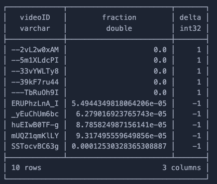

现在已经更容易看到前进的道路了！我需要做的就是使用对 delta 列的累积求和，然后，在数据集的任何一点，我都可以知道正在运行的广告数量！

例如，如果从 0 秒到 10 秒有三次广告开始，但其中两次也结束了，那么 delta 值将是+3 然后-2，这意味着目前只有一个广告正在运行！

接下来，为了简化数据，我首先将分数四舍五入到小数点后四位，然后进行汇总。这并不是必需的，但在尝试绘制数据时，行数过多是个问题。最后，我将正在运行的广告数量除以视频总数，以得到百分比。

```py
CREATE TABLE ad_counter AS 
WITH rounded_and_grouped AS (
  SELECT
      ROUND(fraction, 4) as fraction,
      SUM(delta) as delta
  FROM ad_events
  GROUP BY ROUND(fraction, 4)
  ORDER BY fraction
), running_sum AS (
  SELECT
      fraction,
      SUM(delta) OVER (ORDER BY fraction) as ad_counter
  FROM rounded_and_grouped
), density AS (
  SELECT
      fraction,
      ad_counter,
      ad_counter / (SELECT COUNT(DISTINCT videoID) FROM unique_segments_filtered) as density
  FROM running_sum
)
SELECT * FROM density
```

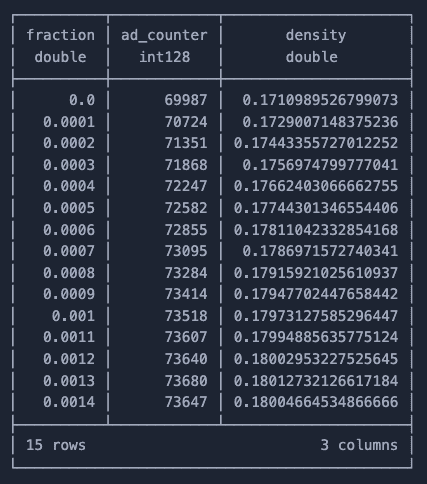

使用这些数据，我不仅知道在视频开始时（0.0%的分数）有 69987 个视频正在播放广告，这也代表了数据集中所有视频的 17%。

现在我终于可以将其绘制为热图：

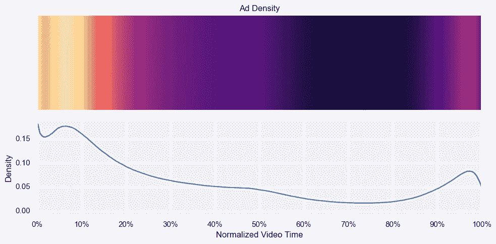

如预期的那样，两端的小波表明，频道在视频的开始和结束时播放广告的情况更为常见。而且，视频中间部分也有一个平台期，但随后下降，因为视频的后半部分通常广告较少。

我觉得有趣的是，一些视频显然会直接开始播放广告。我无法想象这种情况，所以我手动检查了 10 个视频，结果确实如此……我不确定这有多具代表性，但大多数我打开的视频都与游戏相关，且是俄语，它们直接开始播放广告！

在我们继续到结论之前，你认为这个问题的解决方案如何？我惊讶于使用 Sweep Line 技巧做这件事是多么简单。如果你想了解更多，我最近发布了一篇[博客文章](https://towardsdatascience.com/practical-sql-puzzles-that-will-level-up-your-skill/)，涵盖了一些 SQL 模式，最后一个就是这个问题！只是重新包装在计算并发会议的上下文中。

## 结论

我真的很享受做这个分析，因为数据对我来说非常个人化，尤其是因为我最近沉迷于 YouTube。我还觉得我找到的答案相当令人满意，至少大部分是这样。为了结束这个话题，让我们来做最后的回顾！

### 随着时间的推移，赞助段落是否有所增加？

从 2020 年到 2021 年有一个明显的增加。这是一个在整个数字媒体中发生的效果，在这份数据中表现得非常明显。在最近几年，我说不出是否有增加，因为我没有足够的数据来有信心地说。

### 哪些频道的视频广告比例最高？

我成功地创建了一个非常令人信服的列表，列出了运行最多广告的前 50 个频道。我还发现，我最喜欢的创作者中，有一些花了很多时间试图向我推销东西！

### 视频中赞助段落的密度是多少？

如预期的那样，大多数人会在视频的开始和结束时运行广告。除此之外，很多创作者会在视频中间运行广告，使得视频的后半部分稍微不那么广告密集。

此外，还有一些 YouTube 创作者会立即开始播放带有广告的视频，我认为这是一个疯狂的战略。

### 其他学习和下一步

我喜欢数据在展示不同视频尺寸中广告百分比时的清晰度。现在我知道，如果我不跳过广告，我可能在 YouTube 上花费 5-6%的时间观看广告，因为我主要观看 10-20 分钟的视频。

尽管如此，我对于按年分析仍然不完全满意。我已经查看了其他数据，并下载了超过 100GB 的 YouTube 元数据数据集。我确信我可以使用它，结合 YouTube API，填补一些空白，并得到一个更有说服力的答案来回答我的问题。

### 可视化代码

你可能已经注意到，我没有提供图表的代码片段。这是故意的，为了使博客文章更易于阅读，因为 matplotlib 代码占用空间很大。

你可以在[我的 GitHub 仓库](https://github.com/mtrentz/sponsorblock-analysis)中找到所有代码，这样你就可以复制我的图表了。

* * *

这就是这篇文章的全部内容！我真的希望你喜欢阅读这篇博客文章，并学到了一些新东西！

如果你对这个帖子中没有提到的有趣话题感兴趣，或者喜欢学习数据，**请订阅我的** [**Substack 上的免费通讯**](https://mtrentz.substack.com/subscribe)。只要我有真正有趣的内容要分享，我就会发布。

想要直接联系或有疑问？**随时通过** [**mtrentz.com**](https://mtrentz.com/)**联系**。

*除非另有说明，所有图片和动画均为作者创作*。
