# 你还在使用 LoRA 来微调你的 LLM 吗？

> 原文：[`towardsdatascience.com/are-you-still-using-lora-to-fine-tune-your-llm/`](https://towardsdatascience.com/are-you-still-using-lora-to-fine-tune-your-llm/)

LoRA ([低秩自适应 – arxiv.org/abs/2106.09685](https://arxiv.org/abs/2106.09685)) 是一种流行的低成本微调大型语言模型（LLMs）的技术。但 2024 年见证了新的参数高效微调技术的爆炸式增长，LoRA 的替代方案如 SVF、SVFT、MiLoRA、PiSSA、LoRA-XS 等等……大多数都是基于我非常喜欢的一种矩阵技术：奇异值分解（SVD）。让我们深入探讨。

## LoRA

原始 LoRA 的洞察力是微调模型的所有权重是过度杀鸡用牛刀。相反，LoRA 冻结了模型，只训练一小对低秩的“适配器”矩阵。请参见下面的插图（其中 W 是任何在变压器 LLM 中的权重矩阵）。

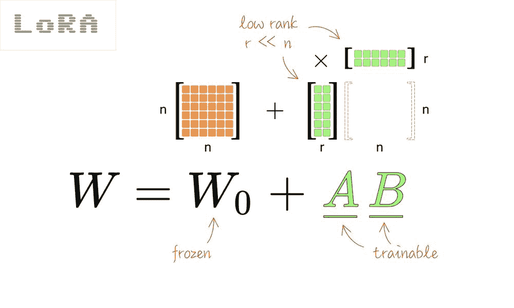

这节省了内存和计算周期，因为需要计算和存储的梯度要少得多。例如，[这里是一个 Gemma 8B 模型](https://colab.research.google.com/drive/14X1spciHDxCYd5c_L8ZtRLrwbU0Hh9y9?usp=sharing)，使用 LoRA 进行微调以模仿海盗说话：只有 2200 万个参数是可训练的，85 亿个参数保持冻结。

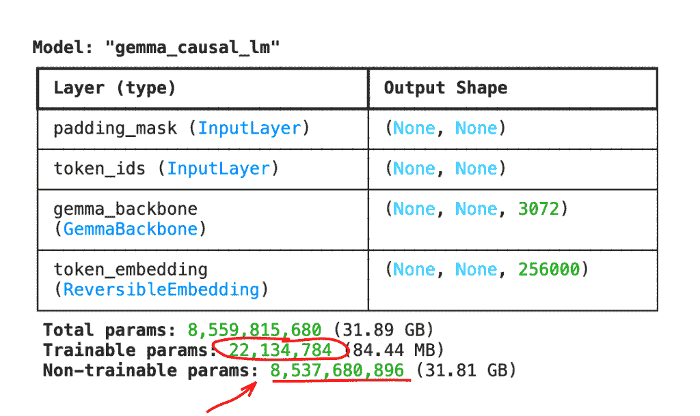

LoRA 非常受欢迎。它甚至成为主流 ML 框架如 Keras 中的一个单行 API：

```py
gemma.backbone.enable_lora(rank=8)
```

但 LoRA 是最好的吗？研究人员一直在努力改进公式。确实，有许多选择更小的“适配器”矩阵的方法。而且，由于它们中的大多数都巧妙地使用了矩阵的奇异值分解（SVD），让我们暂停一下，来点数学。

## SVD：简单的数学

SVD 是理解矩阵结构的一个伟大工具。该技术将矩阵分为三个部分：W = USV^T，其中 U 和 V 是正交的（即基变换），S 是排序奇异值的对角矩阵。这种分解总是存在的。

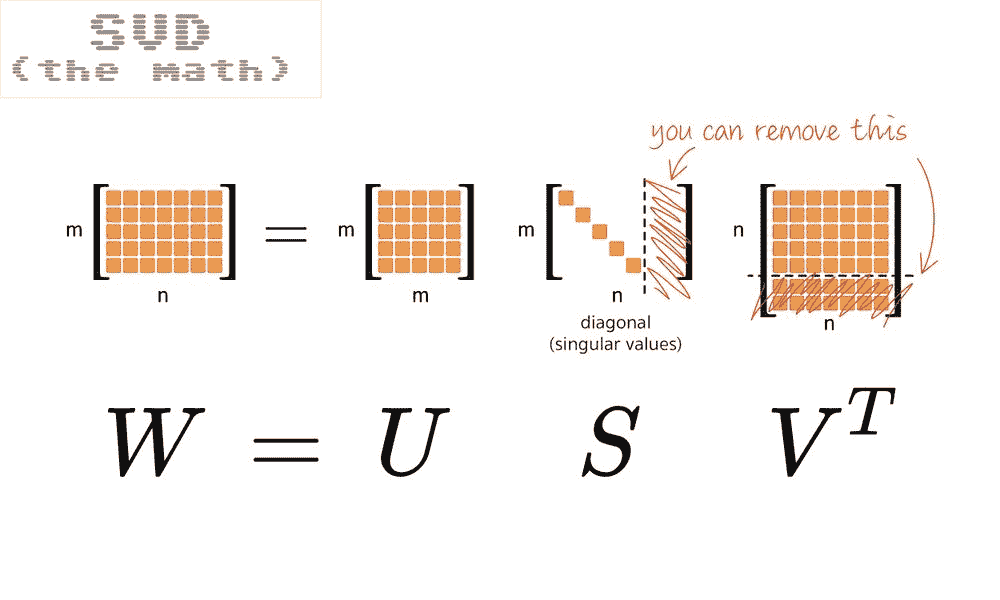

在“教科书”中的奇异值分解（SVD）中，U 和 V 是方阵，而 S 是一个对角线上有奇异值，尾部为零的矩形。在实践中，你可以使用一个方阵 S 和一个矩形 U 或 V 来工作——参见图片——被切掉的部分只是乘以零。这种“经济型”的 SVD 是常用库中使用的，例如，[numpy.linalg.svd](https://numpy.org/doc/2.2/reference/generated/numpy.linalg.svd.html)。

那么，我们如何利用这个方法更有效地选择权重进行训练呢？让我们快速浏览五种基于 SVD 的最近低秩微调技术，并附上注释说明。

## SVF

LoRA 的最简单替代方案是使用模型权重矩阵的 SVD，然后直接微调奇异值。奇怪的是，这是最近在 Transformers² 论文中发表的称为 SVF 的技术，([arxiv.org/abs/2501.06252v2](https://arxiv.org/abs/2501.06252v2))。

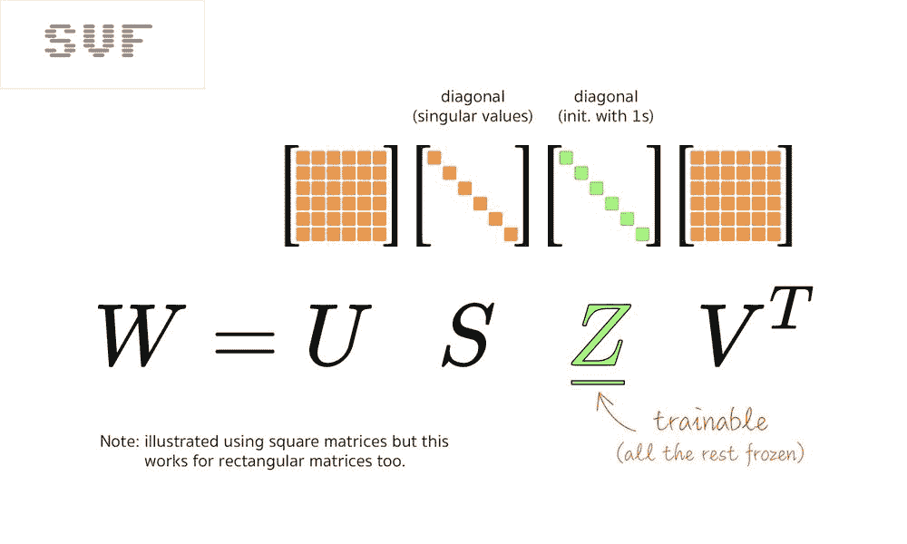

SVF 在参数方面比 LoRA 更经济。作为额外的好处，它使得调整后的模型可以组合。有关更多信息，请参阅我的 Transformers² 解释[这里](https://bsky.app/profile/martin-gorner.bsky.social/post/3lhu5lkrqvd2s)，但组合两个 SVF 微调模型只是一个加法：

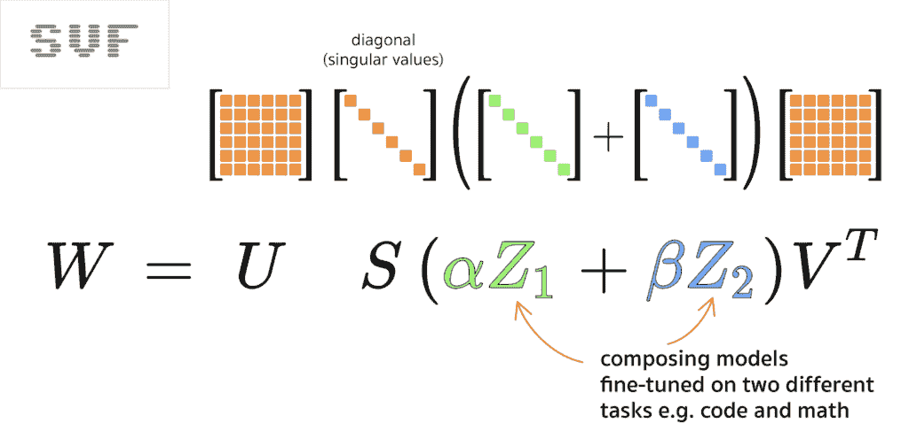

## SVFT

如果你需要更多的可训练参数，SVFT 论文([arxiv.org/abs/2405.19597](https://arxiv.org/abs/2405.19597))探讨了多种实现方式，首先是在对角线上添加更多的可训练权重。

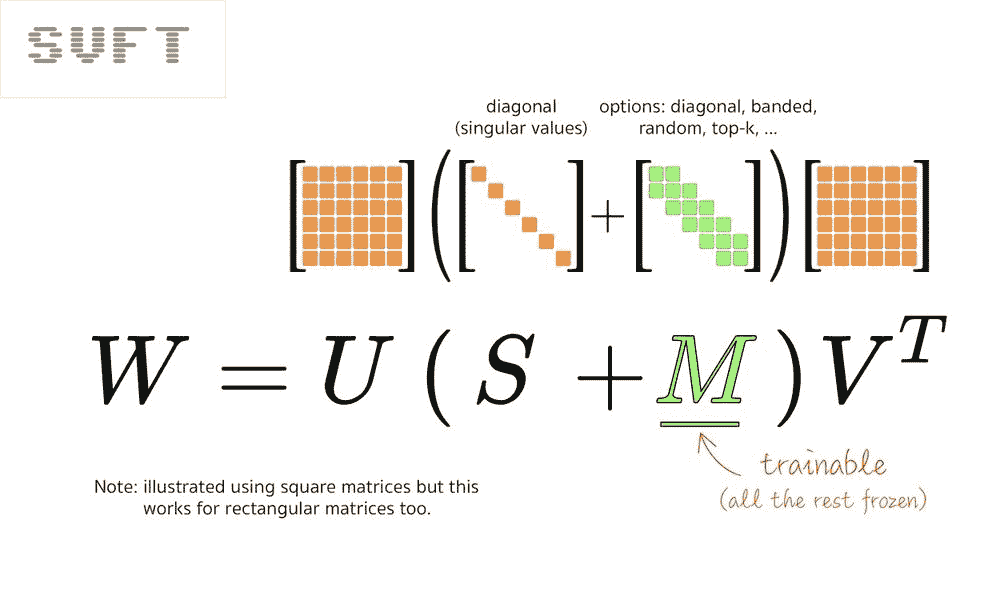

它还评估了多种替代方案，例如将它们随机地分布在“M”矩阵中。

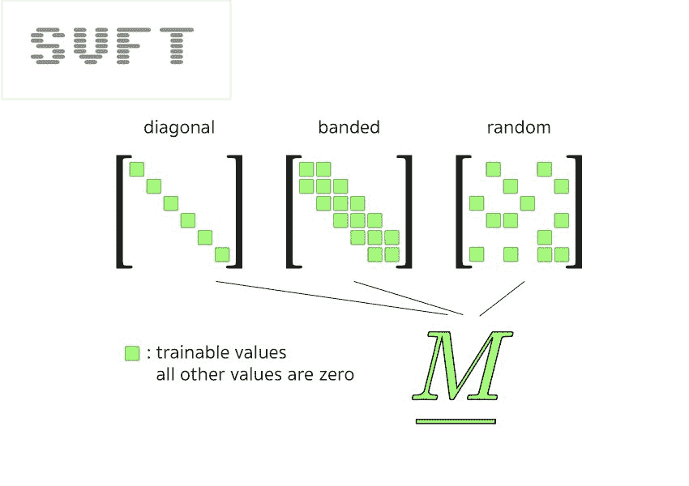

更重要的是，SVFT 论文证实，除了对角线之外拥有更多可训练值是有用的。请参见他们下面的微调结果。

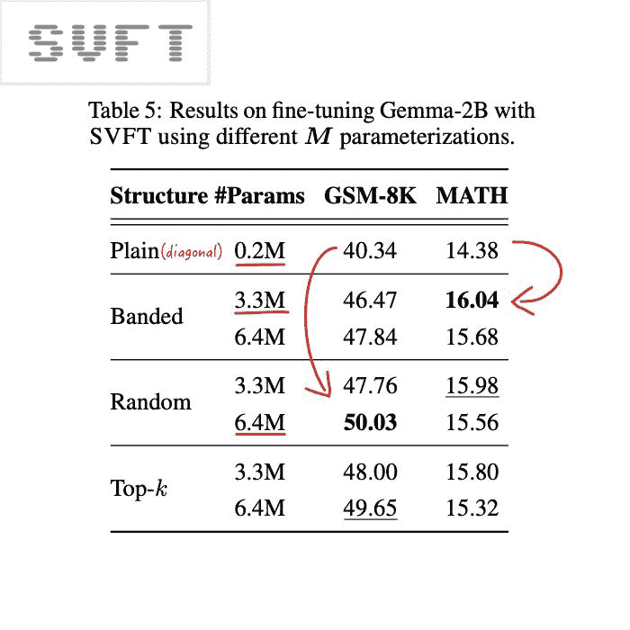

接下来是几种将奇异值分为两组的技术，“大”和“小”。但在我们继续之前，让我们暂停一下，再深入一些 SVD 数学。

## 更多 SVD 数学

SVD 通常被视为分解为三个矩阵 W=USV^T，但它也可以被视为许多秩为 1 的矩阵的加权求和，这些矩阵由奇异值加权：

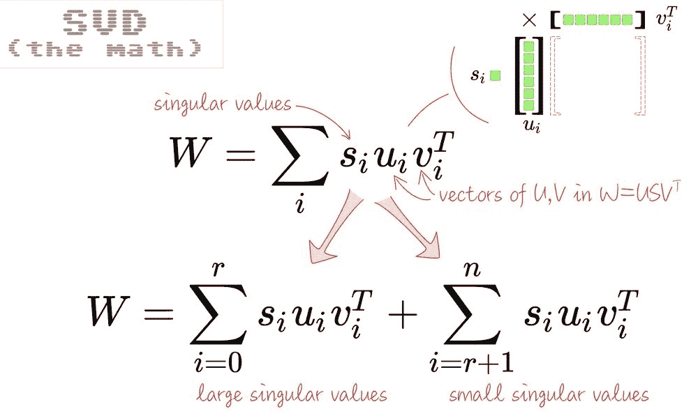

如果你想证明它，一方面，使用 **USV^T** 形式和矩阵乘法公式表达单个矩阵元素 W[jk]，另一方面，

**Σ s[i]u[i]v[i]^T** 形式，另一方面，利用 S 是对角线的性质简化，并注意这实际上是同一件事。

在这种表示中，很容易看出你可以将总和分为两部分。由于你总是可以排序奇异值，你可以使这成为“大”和“小”奇异值之间的拆分。

回到树矩阵形式 **W=USV**^T，这就是拆分的样子：

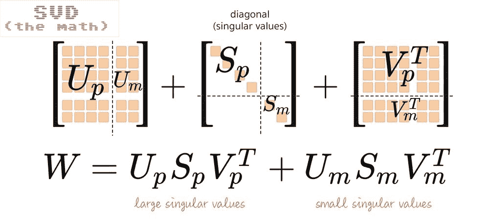

基于这个公式，两篇论文探讨了只调整大奇异值或只调整小奇异值会发生什么，PiSSA 和 MiLoRA。

## PiSSA

PiSSA (主要奇异值和奇异向量自适应，[arxiv.org/abs/2404.02948](https://arxiv.org/abs/2404.02948)) 声称你应该只调整大主值。机制如下所示：

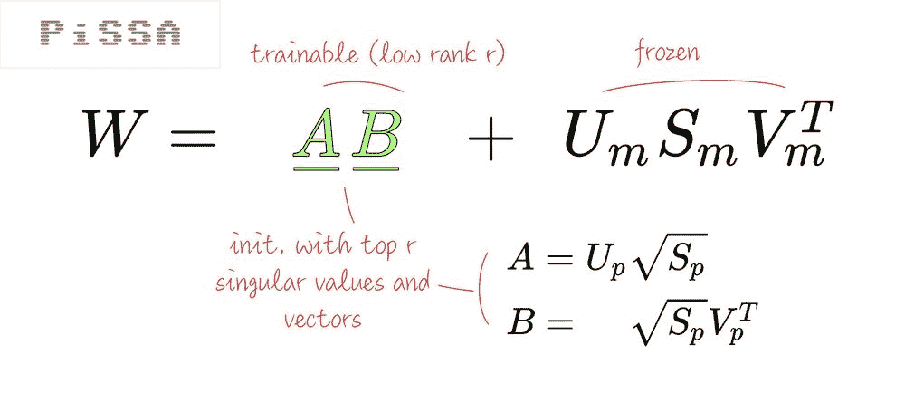

从论文中：“PiSSA 是通过自适应主要奇异成分来设计近似完全微调的，这些成分被认为可以捕捉权重矩阵的本质。相比之下，MiLoRA 旨在适应新任务，同时最大限度地保留基础模型的知识。”

PiSSA 论文也有一个有趣的发现：完全微调容易过拟合。你可能会在绝对值上通过低秩微调技术获得更好的结果。

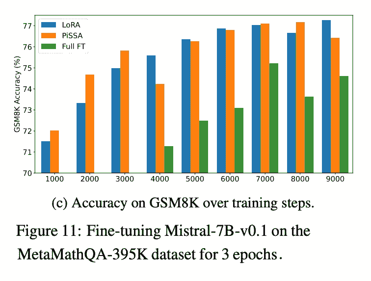

## MiLoRA

MiLoRA（小奇异值组件 LoRA [arxiv.org/abs/2406.09044](https://arxiv.org/abs/2406.09044)），另一方面，声称你应该只调整小的主成分值。它使用与 PiSSA 类似的机制：

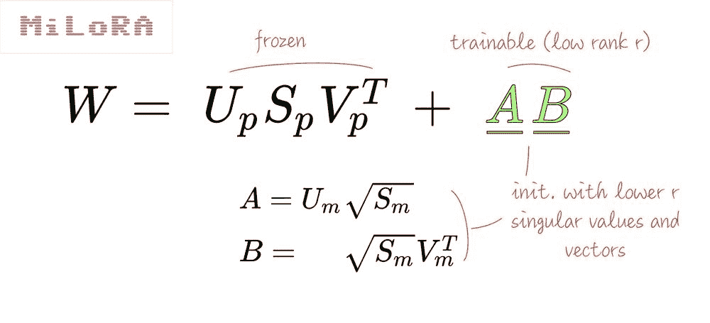

令人惊讶的是，MiLoRA 似乎在调整数学数据集时占上风，至少当调整的数据集与原始预训练相当一致时。可以说，PiSSA 应该更适合将 LLM 的行为进一步从预训练中弯曲。

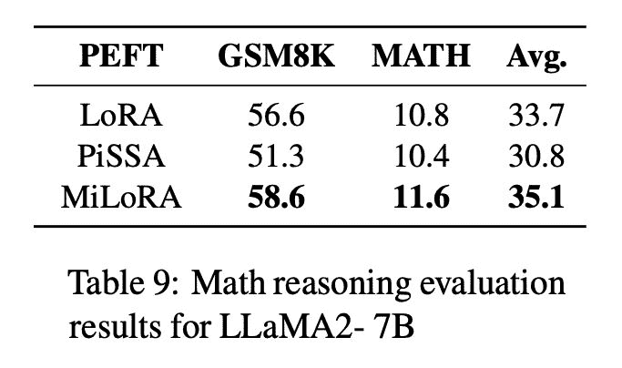

## LoRA-XS

最后，我想提到 LoRA-XS ([arxiv.org/abs/2405.17604](https://arxiv.org/abs/2405.17604))。它与 PiSSA 非常相似，但机制略有不同。它也以显著更少的参数展示了良好的结果。

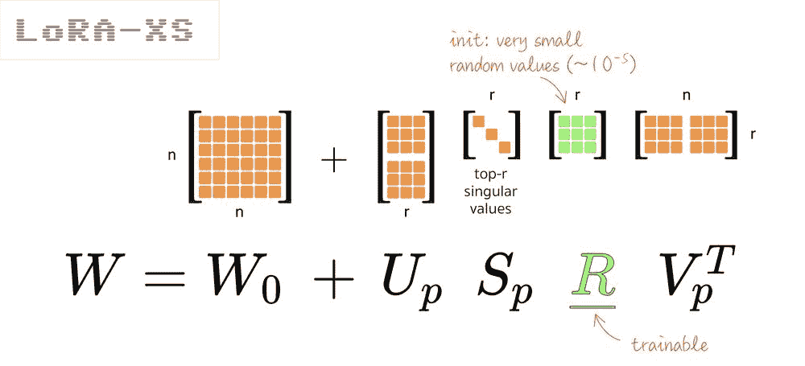

论文提供了在两种条件下这种设置为何是“理想”的数学解释：

+   那就是截断 SVD 中的底部主成分值仍然可以很好地近似权重矩阵

+   那就是微调数据分布接近预训练数据分布

在我看来，这两者都值得怀疑，所以我不打算详细说明数学原理。一些结果：

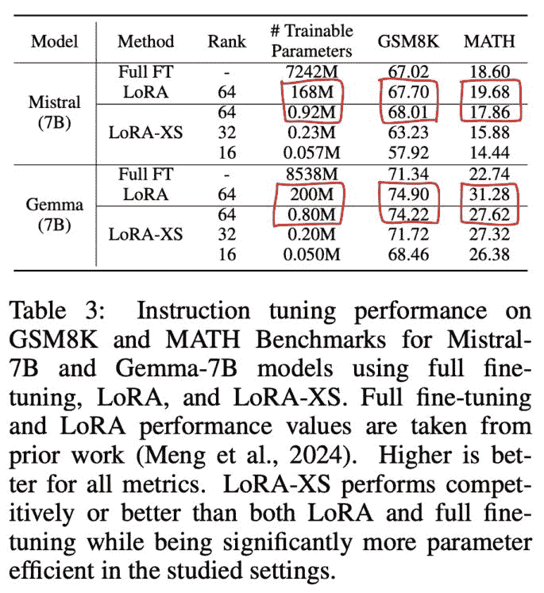

基本假设似乎是奇异值有“大”和“小”之分，但这真的正确吗？我制作了一个[快速 Colab](https://colab.research.google.com/drive/1IgzfW7l2P4aytSaNuOa7QIjIVzKg4aIQ?usp=sharing)来检查 Gemma2 9B 上的情况。底线：99%的奇异值都在 0.1 – 1.1 的范围内。我不确定将它们分为“大”和“小”有多少意义。

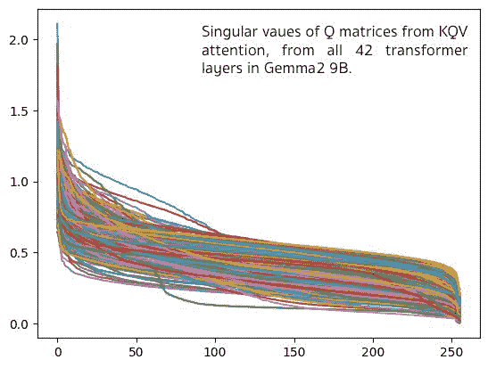

## 结论

还有许多更多的参数高效的微调技术。值得提及：

+   DoRA ([arxiv.org/abs/2402.09353](https://arxiv.org/abs/2402.09353))，它将权重分为幅度和方向，然后调整这些方向。

+   AdaLoRA ([arxiv.org/abs/2303.10512](https://arxiv.org/abs/2303.10512))具有一个复杂的机制，用于在给定的可训练权重预算中找到最佳的调整秩。

我的结论：要超越 LoRA 标准，参数减少 10 倍，我喜欢 Transformers²的 SVF 的简单性。如果你需要更多的可训练权重，SVFT 是一个简单的扩展。两者都使用所有奇异值（满秩，无奇异值剪枝）并且仍然便宜 😁。祝大家调整愉快！

注意：所有插图要么是由作者创建的，要么是从 arxiv.org 论文中提取出来用于评论和讨论目的。
