# 你确定你的后验分布有意义吗？

> 原文：[`towardsdatascience.com/are-you-sure-your-posterior-makes-sense/`](https://towardsdatascience.com/are-you-sure-your-posterior-makes-sense/)

*<mdspan datatext="el1744396435829" class="mdspan-comment">本文</mdspan>由* [*Felipe Bandeira*](https://ofelipebandeira.medium.com/)*, [*Giselle Fretta*](https://www.linkedin.com/in/gisele-fretta/)*, [*Thu Than*](https://www.linkedin.com/in/thu-than-2243b5315/)*, 和* [*Elbion Redenica*](https://www.linkedin.com/in/elbionred/)* *共同撰写。我们还感谢 Carl Scheffler 教授的支持。*

## 简介

参数估计几十年来一直是统计学中最重要的话题之一。虽然最大似然估计等频率主义方法曾经是黄金标准，但计算技术的进步为贝叶斯方法开辟了空间。使用 MCMC 采样器估计后验分布变得越来越普遍，但可靠的推断取决于一个远非微不足道的任务：确保采样器——以及它底层执行的过程——按预期工作。记住刘易斯·卡罗尔曾经说过：“如果你不知道你要去哪里，任何路都能带你到那里。”

本文旨在帮助数据科学家评估贝叶斯参数估计中经常被忽视的一个方面：采样过程的可靠性。在整个章节中，我们结合简单的类比和严谨的技术，以确保我们的解释对任何熟悉贝叶斯方法的数据科学家都是可访问的。尽管[我们的实现](https://github.com/FelipeBandeira/ExploratoryProjects/tree/master/sampler_diagnostics)是用 Python 和 PyMC 完成的，但我们涵盖的概念对任何使用 MCMC 算法的人来说都是有用的，从 Metropolis-Hastings 到 NUTS。

## 关键概念

没有数据科学家或统计学家会否认稳健参数估计方法的重要性。无论目标是进行推断还是进行模拟，拥有建模数据生成过程的能力是这个过程的关键部分。长期以来，估计主要使用频率主义工具进行，例如最大似然估计（MLE）或甚至回归中使用的著名的最小二乘优化。然而，频率主义方法存在明显的缺点，例如它们专注于点估计，并且没有结合可能提高估计的先验知识。

作为这些工具的替代，贝叶斯方法在过去几十年中越来越受欢迎。它们不仅为统计学家提供了未知参数的点估计，还提供了置信区间，所有这些都基于数据和研究人员持有的先验知识。最初，贝叶斯参数估计是通过一种针对未知参数（表示为θ）和已知数据点（表示为 x）的贝叶斯定理的改编版本来完成的。我们可以定义 P(θ|x)，即给定数据的参数值的后验分布为：

\[ P(\theta|x) = \frac{P(x|\theta) P(\theta)}{P(x)} \]

在这个公式中，P(x|θ)是在给定参数值的情况下数据的似然函数，P(θ)是参数的先验分布，P(x)是证据，它是通过积分先验的所有可能值来计算的：

\[ P(x) = \int_\theta P(x, \theta) d\theta \]

在某些情况下，由于所需计算的复杂性，无法通过解析方法推导出后验分布。然而，随着计算技术的进步，运行采样算法（尤其是 MCMC 算法）来估计后验分布变得更加容易，为研究人员提供了一种强大的工具，用于在解析后验分布不易找到的情况下。然而，这种力量也伴随着大量责任，以确保结果有意义。这正是采样诊断发挥作用的地方，提供了一套有价值的工具来评估 1）MCMC 算法是否运行良好，以及 2）我们看到的估计分布是否是真实后验分布的准确表示。但我们如何知道这些呢？

### 采样器的工作原理

在深入探讨诊断技术的细节之前，我们应先了解采样后验分布的过程（尤其是使用 MCMC 采样器）。简单来说，我们可以将后验分布想象为一个我们尚未去过但需要了解其地形的地域。我们如何绘制该地区的准确地图呢？

我们最喜欢的一个类比来自[Ben Gilbert](https://www.youtube.com/watch?v=I4xoX7lJbL8)。假设这个未知的区域实际上是一个我们希望绘制平面图的房子。由于某种原因，我们无法直接进入房子，但我们可以将带有 GPS 设备的蜜蜂放入房子里。如果一切按预期进行，蜜蜂将在房子周围飞舞，通过它们的轨迹，我们可以估计出房子的平面图。在这个类比中，平面图是后验分布，而采样器是围绕房子飞舞的一群蜜蜂。

我们撰写这篇文章的原因是，在某些情况下，蜜蜂不会像预期的那样飞行。如果它们因为某种原因（例如有人把糖洒在地板上）被困在某个房间里，它们返回的数据将不会代表整个房子；蜜蜂没有访问所有房间，只访问了几个，我们关于房子外观的图景最终将是不完整的。同样，当采样器工作不正确时，我们对后验分布的估计也将是不完整的，基于此进行的任何推断都可能是不正确的。

### 蒙特卡洛马尔可夫链（MCMC）

从技术角度讲，我们称任何经历从一种状态到另一种状态具有特定属性的算法为 MCMC 过程。马尔可夫链指的是下一个状态只依赖于当前状态（或者蜜蜂的下一个位置只受其当前位置的影响，而不受它之前去过的地方的影响）。蒙特卡洛意味着下一个状态是随机选择的。Metropolis-Hastings、Gibbs 采样、哈密顿蒙特卡洛（HMC）和无转回采样器（NUTS）等 MCMC 方法都是通过构建接近随机且逐渐探索后验分布的马尔可夫链（一系列步骤）来操作的。

现在你已经了解了采样器的工作原理，让我们深入一个实际场景，以帮助我们探索采样问题。

## 案例研究

想象在一个遥远的国度，一位州长想了解人口少于 100 万的城市的市长在公共年度医疗保健上的支出情况。他不仅想看纯粹的频率，还想了解解释支出的潜在分布，并且即将收到一份支出数据的样本。问题是，参与项目的两位经济学家在模型应该是什么样子的问题上意见不一。

### 模型 1

第一个经济学家认为所有城市花费相似，围绕某个均值有一些变化。因此，他创建了一个简单的模型。尽管经济学家如何选择先验概率的具体细节对我们来说并不重要，但我们确实需要记住，他正在尝试近似一个正态分布（单峰）。

\[

x_i ∼ 正态分布(μ, σ²) 对于所有 i 独立同分布

μ ∼ 正态分布(10, 2)

σ² ∼ 均匀分布(0,5)

\]

### 模型 2

第二个经济学家不同意，他认为支出比他的同事认为的要复杂。他认为，鉴于意识形态差异和预算限制，有两种类型的城市：一种是尽力少花钱的城市，另一种是不怕多花钱的城市。因此，他创建了一个稍微复杂一些的模型，使用正态混合来反映他相信真实分布是双峰的信念。

\[

x_i ∼ 正态混合分布([ω, 1-ω], [m_1, m_2], [s_1², s_2²]) 对于所有 i 独立同分布

m_j ∼ 正态分布(2.3, 0.5²) 对于 j = 1,2

s_j² \sim \text{逆伽马}(1,1) \text{ for } j=1,2 \\

\omega \sim \text{Beta}(1,1)

\]

数据到达后，每位经济学家都会运行一个 MCMC 算法来估计他们希望的后验，这将反映现实（1）如果他们的假设是正确的，并且（2）*如果样本器工作正确*。第一个*if*，关于假设的讨论，应留给经济学家。然而，他们如何知道第二个*if*是否成立？换句话说，**他们如何确保样本器工作正确，从而他们的后验估计是无偏的**？

## 样本器诊断

为了评估样本器的性能，我们可以探索一组反映估计过程不同部分的指标。

### 定量指标

#### R-hat（潜在尺度缩减因子）

简而言之，R-hat 评估的是否所有从不同地方出发的蜜蜂在一天结束时都探索了相同的房间。为了估计后验，MCMC 算法使用多个链（或蜜蜂）从随机位置开始。R-hat 是我们用来评估链的*收敛性*的指标。它通过比较每个链内样本的方差与链间样本均值方差来衡量多个 MCMC 链是否混合良好（即它们是否采样了相同的拓扑）。直观地说，这意味着

\[

\hat{R} = \sqrt{\frac{\text{链间方差}}{\text{链内方差}}}

\]

如果 R-hat 接近 1.0（或低于 1.01），这意味着每个链内的方差与链之间的方差非常相似，表明它们已经收敛到相同的分布。换句话说，链的行为相似，彼此之间也无法区分。这正是我们在采样第一个模型的后验分布后所看到的情况，如下表最后一列所示：

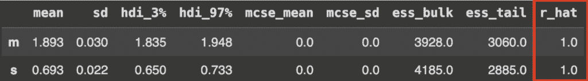

图 1. 样本器理想 R-hat 的汇总统计。

然而，第二个模型的 r-hat 值却告诉我们一个不同的故事。如此大的 r-hat 值表明，在采样过程结束时，不同的链还没有收敛。在实践中，这意味着*他们探索并返回的分布是不同的*，或者每个蜜蜂创建了一个不同房间的地图。这从根本上使我们无法了解这些部分是如何连接的，或者完整的平面图是什么样子。

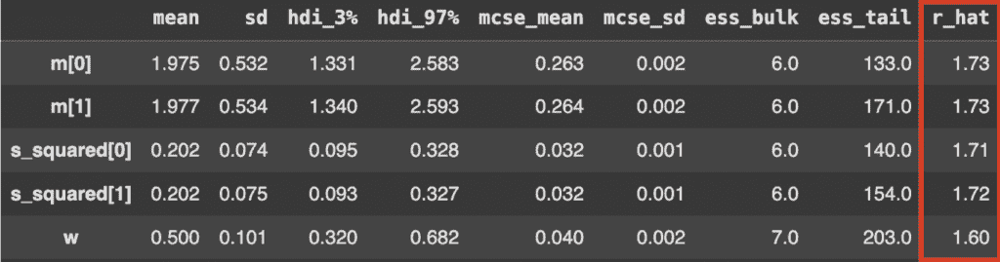

图 2. 样本器展示问题 R-hat 的汇总统计。

由于我们的 R-hat 读数很大，我们知道第二个模型中的抽样过程出了问题。然而，即使 R-hat 的结果在可接受的范围内，这也不能保证抽样过程是有效的。*R-hat 只是一个诊断工具，不是保证*。有时，即使你的 R-hat 读数低于 1.01，采样器可能并没有正确地探索完整的后验分布。这种情况发生在多个蜜蜂从同一房间开始探索并停留在那里的时候。同样，如果你使用的是少量链，并且你的后验分布恰好是多模态的，那么所有链都从同一模式开始并未能探索其他峰的概率是存在的。

R-hat 的读数反映的是收敛性，而不是完成。为了有一个更全面的概念，我们需要检查其他诊断指标。

#### 有效样本大小 (ESS)

当解释 MCMC 是什么时，我们提到“蒙特卡洛”指的是下一个状态是随机选择的。这并不一定意味着状态是完全独立的。即使蜜蜂随机选择它们的下一步，这些步骤在某种程度上仍然是相关的。如果一个蜜蜂在 t=0 时刻正在探索客厅，那么它在 t=1 时刻很可能仍然在客厅里，即使它处于同一房间的不同部分。由于样本之间的这种自然联系，我们说这两个数据点是*自相关的*。

由于其本质，MCMC 方法固有地产生自相关的样本，这使统计分析变得复杂，并需要仔细评估。在统计推断中，我们通常假设独立样本以确保不确定性估计的准确性，因此需要无相关样本。如果两个数据点彼此过于相似，相关性会降低它们的*有效*信息含量。数学上，下面的公式表示随机过程中两个时间点（t1 和 t2）之间的自相关函数：

\[

R_{XX}(t_1, t_2) = E[X_{t_1} \overline{X_{t_2}}]

\]

其中 E 是期望值算子，X-bar 是复共轭。在 MCMC 抽样中，这一点至关重要，因为高自相关意味着新样本不会给我们带来与旧样本不同的任何信息，从而实际上减少了我们拥有的样本量。不出所料，反映这一点的指标被称为有效样本大小（ESS），它帮助我们确定我们真正有多少个独立的样本。

如前所述，有效样本大小通过估计多少个真正独立的样本可以提供与我们所拥有的自相关样本相同的信息来考虑自相关。对于参数 θ，ESS 定义为：

\[

ESS = \frac{n}{1 + 2 \sum_{k=1}^{\infty} \rho(\theta)_k}

\]

其中 *n* 是样本总数，ρ(θ)k 是参数 θ 在滞后 *k* 处的自相关。

通常，对于 ESS 读数，越高越好。这就是我们在第一个模型的读数中看到的情况。两种常见的 ESS 变化是**Bulk-ESS**，它评估分布中央部分的混合情况，以及**Tail-ESS**，它关注采样分布尾部的效率。两者都告诉我们我们的模型是否准确地反映了中心趋势和可信区间。

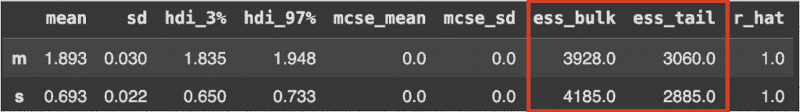

图 3. 采样器的总结统计信息，突出了 ESS bulk 和 tail 的理想量。

相比之下，第二个模型的读数非常糟糕。通常，我们希望看到至少是总样本量 1/10 的读数。在这种情况下，鉴于每个链采样了 2000 个观测值，我们应该期望至少有 800 个 ESS 读数（来自 4 条链，每条链 2000 个样本的总样本量 8000），但这并不是我们观察到的。

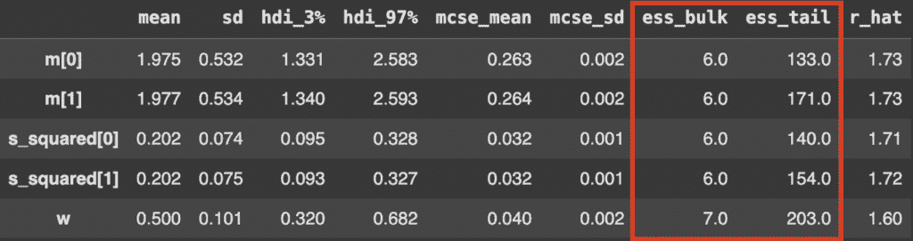

图 4. 采样器的总结统计信息，展示了有问题的 ESS bulk 和 tail。

### 可视化诊断

除了数值指标外，我们可以通过使用诊断图来加深我们对采样器性能的理解。主要的有排序图、轨迹图和配对图。

#### 排序图

排序图帮助我们确定不同的链是否探索了后验分布的所有部分。如果我们再次考虑蜜蜂的类比，排序图告诉我们哪些蜜蜂探索了房子的哪些部分。因此，为了评估所有链是否均匀地探索了后验，我们观察采样器生成的排序图的形状。理想情况下，我们希望所有链的分布看起来大致均匀，就像在采样第一个模型后生成的排序图中那样。下面的每种颜色代表一条链（或一只蜜蜂）：

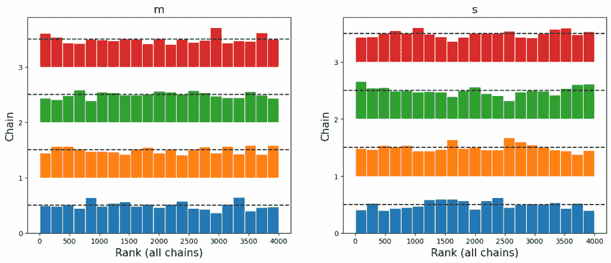

图 5. 四条 MCMC 链中参数‘m’和‘s’的排序图。每个条形代表一条链的排名值的分布，理想的均匀排名表示良好的混合和适当的收敛。

在幕后，通过一系列简单的步骤生成排序图。首先，我们运行采样器，让它从每个参数的后验中采样。在我们的情况下，我们正在采样第一个模型中参数*m*和*s*的后验。然后，参数一个接一个，我们从所有链中获取所有样本，将它们放在一起，并按从小到大的顺序排列。然后我们问自己，对于每个样本，它来自哪个链？这将使我们能够创建我们上面看到的图表。

相比之下，差的排名图很容易识别。与前面的例子不同，下面显示的第二个模型的分布并不均匀。从图中，我们解读到每个链在开始于不同的随机位置后，都卡在了某个区域，没有探索后验分布的全部。因此，我们不能从结果中得出推论，因为它们是不可靠的，并且不代表真正的后验分布。这相当于有四只蜜蜂从房子的不同房间开始，在探索过程中卡在了某个地方，从未覆盖整个房产。

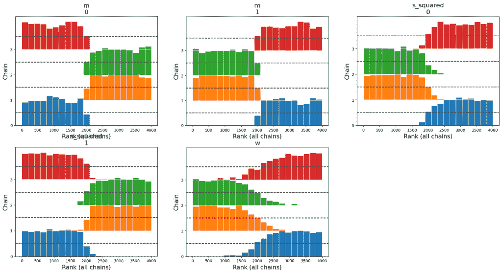

图 6. 参数 m、s_squared 和 w 在四个 MCMC 链上的排名图。每个子图显示了每个链的排名分布。存在明显的偏离均匀性（例如，阶梯状模式或链之间的不平衡），这表明可能存在采样问题。

#### KDE 和迹图

与 R-hat 类似，迹图帮助我们通过可视化算法如何随时间探索参数空间来评估 MCMC 样本的*收敛性*。PyMC 提供了两种类型的迹图来诊断混合问题：核密度估计（KDE）图和基于迭代的迹图。这些中的每一个在评估采样器是否正确探索目标分布时都发挥着独特的作用。

KDE 图（通常在左侧）估计每个链的后验密度，其中*每条线代表一个单独的链*。这使我们能够检查所有链是否收敛到相同的分布。如果 KDEs 重叠，则表明链正在从相同的后验分布中进行采样，并且已经发生混合。另一方面，迹图（通常在右侧）可视化参数值如何在 MCMC 迭代（步骤）中变化，其中每条线代表不同的链。一个混合良好的采样器将产生看起来嘈杂和随机的迹图，没有明显的结构或链之间的分离。

使用蜜蜂的类比，迹图可以被视为在不同位置上房子的“特征”快照。如果采样器工作正确，左侧图中的 KDEs 应该紧密对齐，表明所有蜜蜂（链）都以相似的方式探索了房子。同时，右侧图应该显示高度可变的迹图，它们混合在一起，证实链正在积极地在空间中移动，而不是卡在特定的区域。

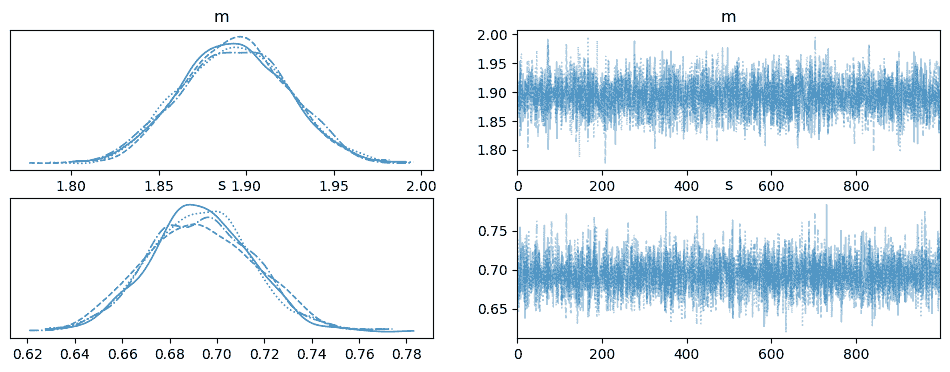

图 7. 来自第一个模型的参数 m 和 s 在四个 MCMC 链上的密度和迹图。左侧面板显示了每个链的边缘后验分布的核密度估计（KDE），表明中心趋势和分布的一致性。右侧面板显示了迭代的迹图，链之间有重叠，没有明显的发散，表明良好的混合和收敛。

然而，如果您的采样器混合不良或存在收敛问题，您将看到类似下面的图。在这种情况下，核密度估计（KDEs）不会重叠，这意味着不同的链从不同的分布中采样，而不是共享的后验分布。迹图也将显示结构化模式而不是随机噪声，这表明链卡在不同的参数空间区域，未能完全探索它。

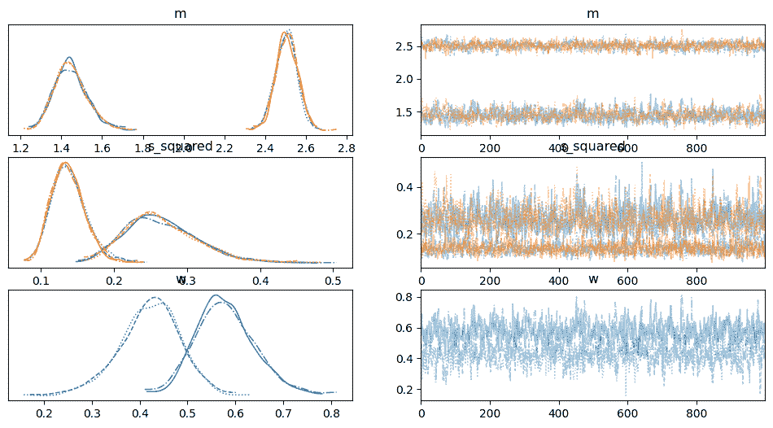

图 8. 第二个模型的参数 m、s_squared 和 w 在 MCMC 链中的核密度估计（KDE，左）和迹图（右）。m 和 w 显示出多模态分布，表明可能存在可识别性问题。迹图揭示链以有限的混合探索不同的模式，特别是对于 m，突出了收敛和有效采样的挑战。

通过使用迹图与其他诊断工具一起，您可以识别采样问题并确定您的 MCMC 算法是否有效地探索后验分布。

#### 配对图

第三种常用于诊断的图是配对图。在我们要估计多个参数的后验分布的模型中，配对图使我们能够观察“不同参数之间的相关性”。为了理解此类图是如何形成的，再次考虑蜜蜂的类比。如果您想象我们将创建一个包含房屋宽度和长度的图，蜜蜂每“一步”可以表示为一个(x, y)组合。同样，后验的每个参数都表示为一个维度，我们创建散点图，显示采样器使用参数值作为坐标的行走路径。在这里，我们正在绘制每个独特的对(x, y)，结果是在图像中间看到的散点图。您在边缘看到的单维图是每个参数的边缘分布，为我们提供了关于采样器在探索它们时的行为的额外信息。

查看第一个模型的配对图。

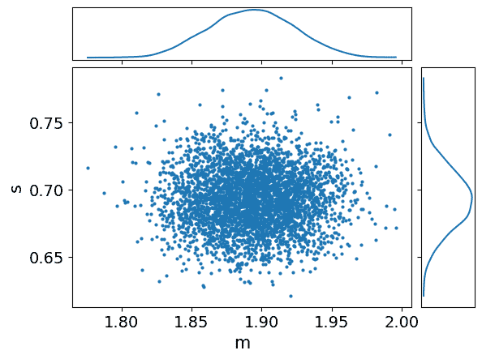

图 9. 参数 m 和 s 的联合后验分布，以及边缘密度。散点图显示大致对称的椭圆形，表明 m 和 s 之间的相关性较低。

每个轴代表我们正在估计的两个参数中的一个。目前，让我们专注于中间的散点图，它显示了从后验中采样的参数组合。我们有一个非常均匀的分布的事实意味着，对于 m 的任何特定值，s 的值范围都有同等可能被采样。此外，我们没有看到两个参数之间的相关性，这通常是好事！有些情况下，我们会期望一些相关性，例如当我们的模型涉及回归线时。然而，在这种情况下，我们没有理由相信两个参数应该高度相关，因此我们没有观察到异常行为是好消息。

现在，看看第二个模型的成对图表。

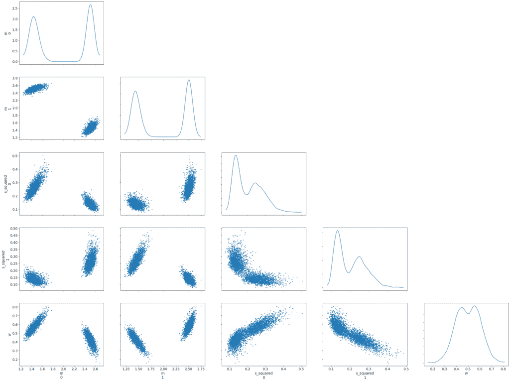

图 10. 参数 m、s_squared 和 w 的联合后验分布的成对图表。散点图揭示了几个参数之间的强相关性。

由于这个模型有五个参数需要估计，我们自然会有更多的图表，因为我们正在成对地分析它们。然而，与之前的例子相比，它们看起来很奇怪。具体来说，这里的样本点并不是均匀分布的，而是似乎被分成了两个区域，或者似乎有一定的相关性。这是另一种可视化秩图所显示内容的方法：采样器没有探索完整的后验分布。下面我们单独展示了左上角的图表，其中包含来自 m0 和 m1 的样本。与模型 1 的图表相比，我们可以看到一个参数的值极大地影响了另一个参数的值。例如，如果我们围绕 2.5 采样 m1，那么 m0 很可能会从 1.5 附近的非常狭窄的范围内采样。

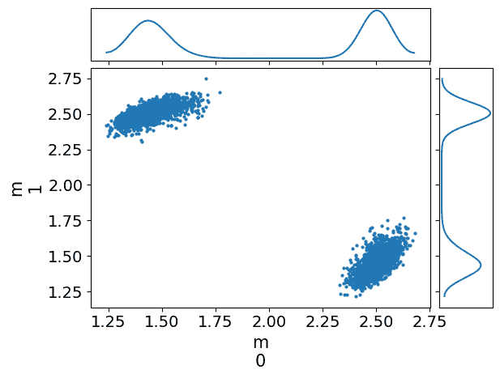

图 11. 参数 m₀和 m₁的联合后验分布，以及边缘密度。

在有问题的成对图表中，可以相对频繁地观察到某些形状。例如，对角线模式表明参数之间存在高度相关性。香蕉形状通常与参数化问题有关，通常存在于具有紧先验或约束参数的模型中。漏斗形状可能表明具有不良几何形状的层次模型。当我们有两个独立的岛屿，如上面的图表所示，这可以表明后验是双峰的，并且链没有很好地混合。然而，请记住，这些形状*可能*表明问题，但并不一定如此。这取决于数据科学家检查模型并确定哪些行为是预期的，哪些不是！

## 一些修复技术

当你的诊断表明存在采样问题——无论是关于 R-hat 值、低 ESS、不寻常的秩图、分离的迹图，还是在成对图中的奇怪参数相关性——几种策略可以帮助你解决潜在问题。采样问题通常源于目标后验分布对采样器来说过于复杂，难以高效探索。复杂的目标分布可能具有：

+   采样器难以在其之间移动的多个模式（峰值）

+   不同区域之间通过狭窄“走廊”连接的不规则形状

+   尺度差异极大的区域（如漏斗的“颈部”）

+   难以准确采样的重尾

在蜜蜂的类比中，这些复杂性代表着具有不寻常楼层布局的房子——断开的房间、极其狭窄的走廊，或者大小变化极大的区域。就像蜜蜂可能会被困在这样的房子的特定区域一样，MCMC 链也可能卡在后验分布的某些区域。

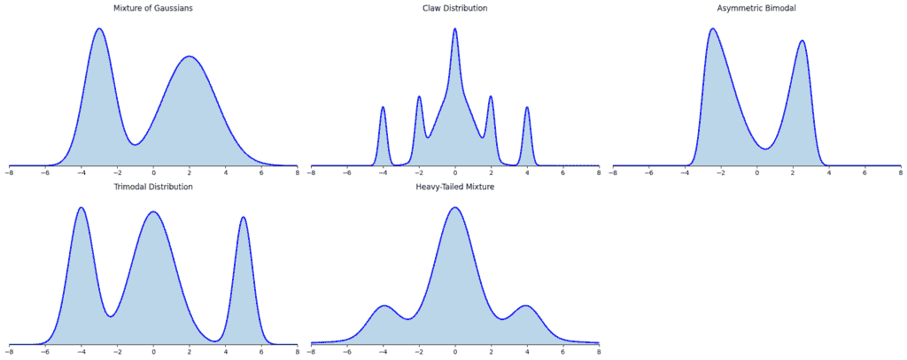

图 12. 多模态目标分布的示例。

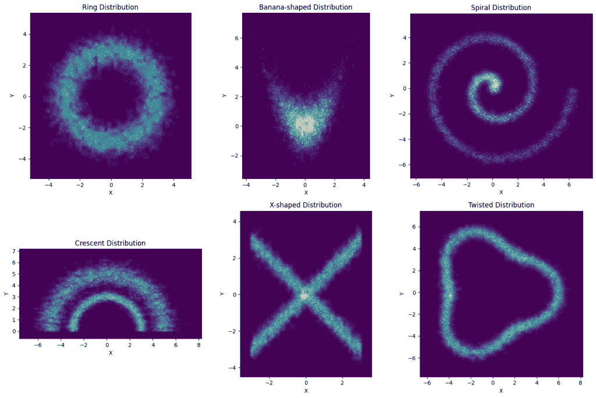

图 13. 奇形怪状分布的示例。

为了帮助采样器进行探索，我们可以使用一些简单的策略。

### 策略 1：重新参数化

重新参数化对于层次模型和具有挑战性几何形状的分布特别有效。它涉及将你的模型参数转换，使其更容易采样。回到蜜蜂的类比，想象蜜蜂正在探索一个布局奇特的房子：一个宽敞的客厅通过一个非常非常狭窄的走廊与厨房相连。我们之前没有提到的一个方面是蜜蜂必须以相同的方式在整个房子中飞行。这意味着如果我们要求蜜蜂使用大的“步长”，它们会很好地探索客厅，但在走廊中会直接撞到墙上。同样，如果它们的步长很小，它们会很好地探索狭窄的走廊，但需要很长时间才能覆盖整个客厅。房子中自然存在的尺度差异使得蜜蜂的工作更加困难。

代表这种场景的一个经典例子是 Neal 的漏斗，其中一个参数的尺度依赖于另一个参数：

\[

p(y, x) = \text{Normal}(y|0, 3) \times \prod_{n=1}^{9} \text{Normal}(x_n|0, e^{y/2})

\]

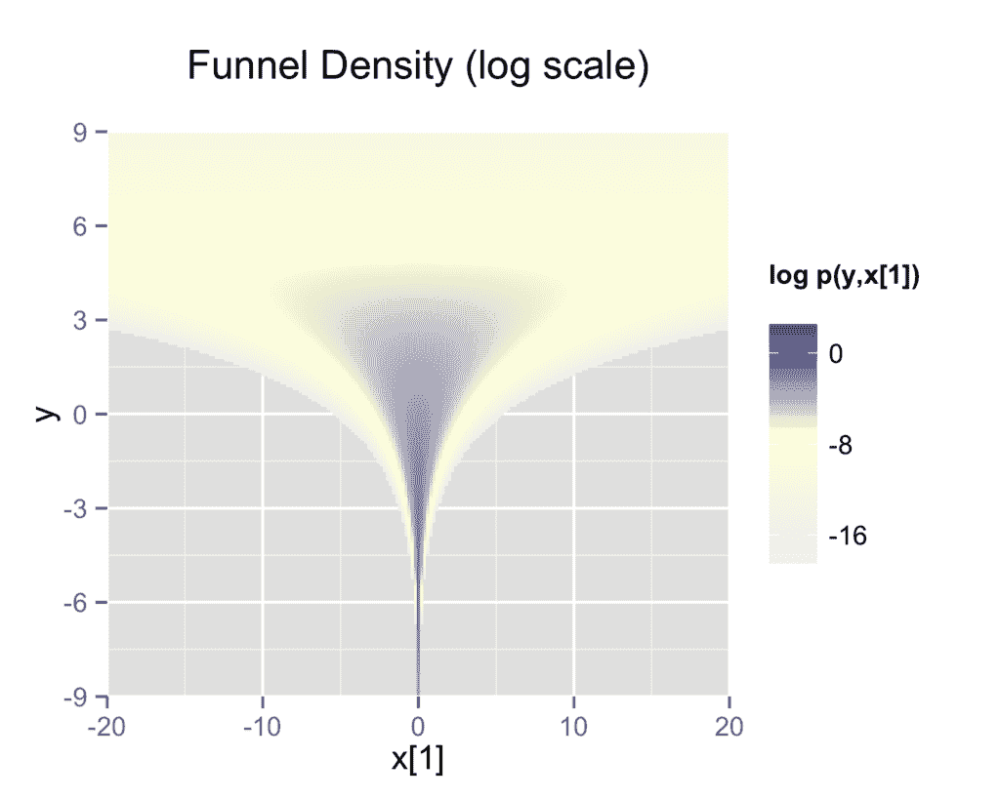

图 14. 记录 y 的边缘密度和 Neal 漏斗的第一维。采样器在颈部难以采样，需要比身体小得多的步长。（图片来源：Stan 用户指南）

我们可以看到 x 的尺度依赖于 y 的值。为了解决这个问题，我们可以将 x 和 y 作为独立的标准正态分布分离，然后将这些变量转换成所需的漏斗分布。而不是直接这样采样：

\[

\begin{align*}

y &\sim \text{Normal}(0, 3) \\

x &\sim \text{Normal}(0, e^{y/2})

\end{align*}

\]

您可以先对标准正态分布进行重参数化以进行采样：

\[

y_{raw} \sim \text{Standard Normal}(0, 1) \\

x_{raw} \sim \text{Standard Normal}(0, 1) \\

\\

y = 3y_{raw} \\

x = e^{y/2} x_{raw}

\]

这种技术通过消除它们之间的依赖性，将层次参数分离，并通过消除它们之间的依赖性使采样更有效。

重参数化就像重新设计房子，使得不是强迫蜜蜂找到一条狭窄的走廊，而是创建一个新的布局，其中所有通道的宽度都相似。这有助于蜜蜂在整个探索过程中使用一致的飞行模式。

### 策略 2：处理重尾分布

重尾分布（如柯西和 Student-T 分布）对采样器和理想的步长提出了挑战。它们的尾部需要比中心区域更大的步长（类似于非常长的走廊，蜜蜂需要长途跋涉），这造成了一个挑战：

+   小步长会导致尾部采样效率低下

+   大步长会导致中心区域拒绝过多

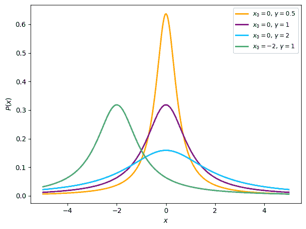

图 15.各种柯西分布的概率密度函数说明了改变位置参数和尺度参数的影响。（图片来源：维基百科）

重参数化解决方案包括：

+   对于柯西分布：将变量定义为使用柯西逆 CDF 的均匀分布的变换

+   对于 Student-T 分布：使用 Gamma-Mixture 表示

### 策略 3：超参数调整

有时解决方案在于调整采样器的超参数：

+   **增加总迭代次数**：最简单的方法——给采样器更多时间来探索。

+   **增加目标接受率（adapt_delta）**：减少发散过渡（例如，对于复杂模型，尝试 0.9 而不是默认的 0.8）。

+   **增加最大树深度（max_treedepth）**：允许采样器在每次迭代中走更多步。

+   **延长预热/适应阶段**：给采样器更多时间来适应后验几何形状。

记住，虽然这些调整可能会提高您的诊断指标，但它们通常只治疗症状而不是根本原因。之前的策略（重参数化和更好的建议分布）通常提供更基本的解决方案。

### 策略 4：更好的建议分布

这个解决方案适用于函数拟合过程，而不是后验的采样估计。它基本上提出了这样的问题：“我目前*在这里*在这个景观中。我应该跳到哪里才能探索整个景观，或者我怎么知道下一次跳跃是我应该做的跳跃？”因此，选择一个好的分布意味着确保采样过程探索整个参数空间，而不仅仅是特定区域。一个好的建议分布应该：

1.  在目标分布具有大量概率质量的地方。

1.  允许采样器进行适当大小的跳跃。

提议分布的一个常见选择是高斯（正态）分布，其均值为μ，标准差为σ——我们可以调整分布的规模来决定从当前位置跳到下一个位置的距离。如果我们选择提议分布的规模太小，可能需要太长时间来探索整个后验分布，或者它可能会卡在一个区域而无法探索整个分布。但如果规模太大，你可能永远无法探索某些区域，跳过它们。这就像打乒乓球，我们只能到达两个边缘，而无法到达中间。

### 改善先验规格

当所有其他方法都失败时，重新考虑你模型的先验规格。模糊或弱信息先验（如均匀分布的先验）有时会导致采样困难。更有信息的先验，当由领域知识证明时，可以帮助引导采样器向参数空间的更合理区域移动。有时，尽管你尽了最大努力，模型可能仍然难以有效采样。在这种情况下，考虑是否一个更简单的模型可能实现类似推断目标，同时更易于计算。最好的模型通常不是最复杂的模型，而是平衡复杂性和可靠性的模型。下表显示了针对不同问题的修复策略总结。

| **诊断信号** | **潜在问题** | **推荐修复** |
| --- | --- | --- |
| 高 R-hat | 链之间混合不良 | 增加迭代次数，调整步长 |
| 低 ESS | 高自相关 | 重新参数化，增加 adapt_delta |
| 非均匀等级图 | 链在不同区域卡住 | 更好的提议分布，从多个链开始 |
| 轨迹图中的分离 KDE | 链探索不同的分布 | 重新参数化 |
| 配对图中的漏斗形状 | 层次模型问题 | 非中心化重新参数化 |
| 配对图中的非连接簇 | 混合不良的多模态 | 调整分布，模拟退火 |

## 结论

评估 MCMC 采样的质量对于确保可靠的推理至关重要。在本文中，我们探讨了关键诊断指标，如 R-hat、ESS、等级图、轨迹图和配对图，讨论了每个指标如何帮助确定采样器是否正常工作。

如果我们希望你在意的一个要点是，你应该在从样本中得出结论之前始终运行诊断。没有单一指标能提供明确的答案——每个指标都作为工具，突出潜在问题，而不是证明收敛。当出现问题时，重新参数化、超参数调整和先验规格等策略可以帮助提高采样效率。

通过结合这些诊断与深思熟虑的建模决策，你可以确保更稳健的分析，降低因采样行为不佳而导致误导性推断的风险。

## 参考文献

B. Gilbert, [Bob 的蜜蜂：使用多个蜜蜂（链）判断 MCMC 收敛的重要性](https://www.youtube.com/watch?v=I4xoX7lJbL8) (2018), Youtube

Chi-Feng, [MCMC 演示](https://chi-feng.github.io/mcmc-demo/app.html?algorithm=RandomWalkMH&target=banana) (n.d.), GitHub

D. Simpson, [或许现在是时候让旧方法死去；或者我们破坏了 R-hat，现在我们必须修复它。](https://statmodeling.stat.columbia.edu/2019/03/19/maybe-its-time-to-let-the-old-ways-die-or-we-broke-r-hat-so-now-we-have-to-fix-it/) (2019), 统计建模、因果推断和社会科学

M. Taboga, [马尔可夫链蒙特卡洛（MCMC）方法](https://www.statlect.com/fundamentals-of-statistics/Markov-Chain-Monte-Carlo) (2021), 概率论与数理统计讲座。Kindle Direct Publishing.

T. Wiecki, [MCMC 采样入门](https://twiecki.io/blog/2015/11/10/mcmc-sampling/) (2024), twecki.io

Stan 用户指南，[重新参数化](https://mc-stan.org/docs/2_18/stan-users-guide/reparameterization-section.html) (n.d.), Stan 文档
