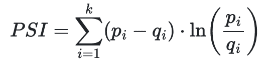
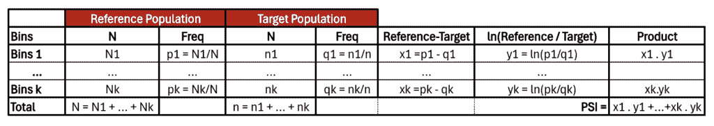
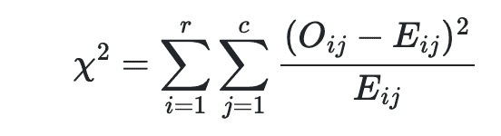
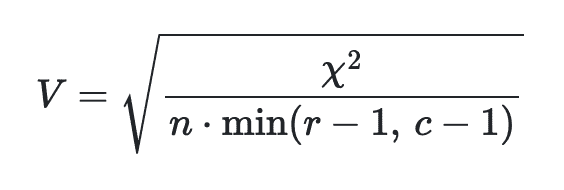
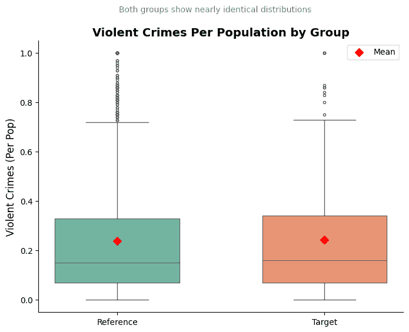
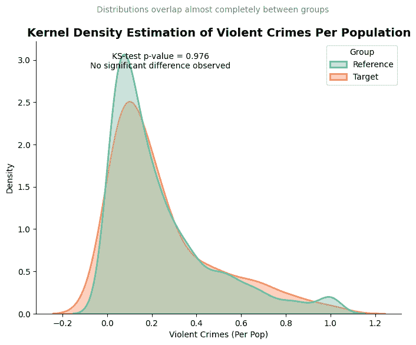
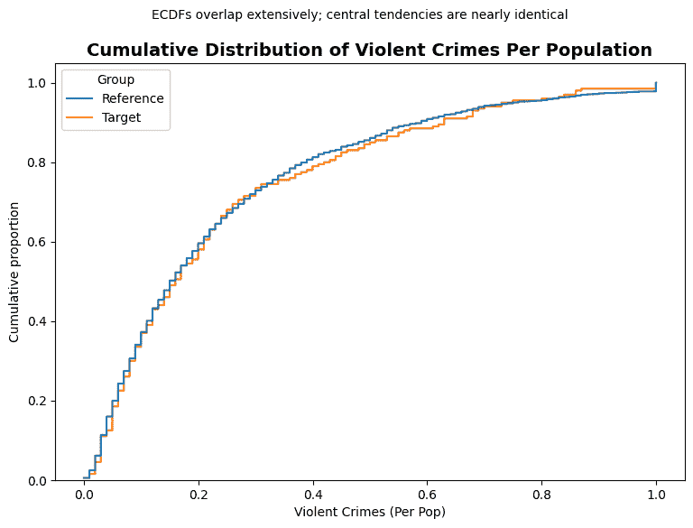
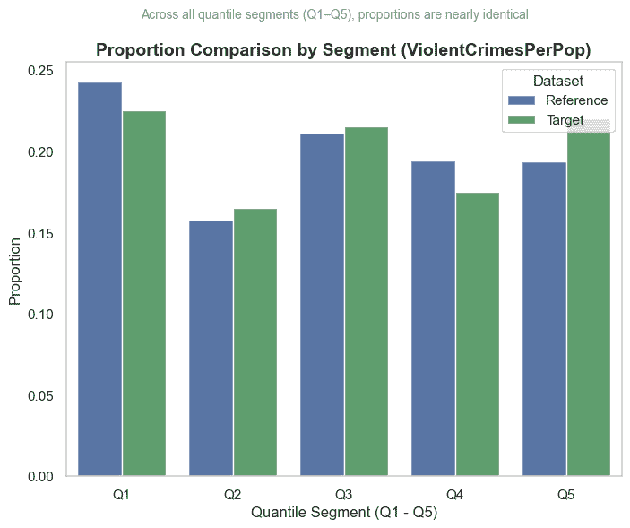
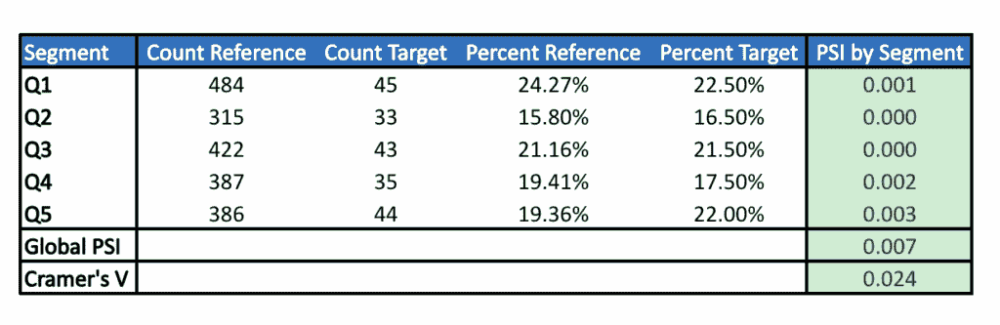
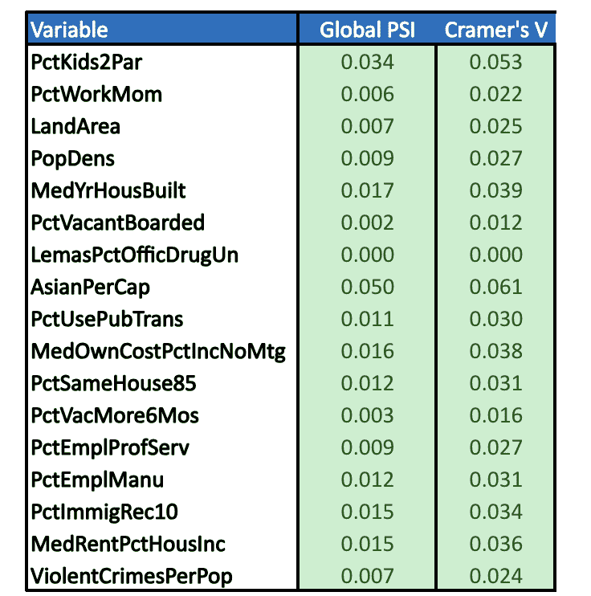

# 您的训练数据是否具有代表性？使用 Python 中的 PSI 进行检验的指南

> 原文：[`towardsdatascience.com/assessment-of-representativeness-between-two-populations-to-ensure-valid-performance-2/`](https://towardsdatascience.com/assessment-of-representativeness-between-two-populations-to-ensure-valid-performance-2/)
> 
> 为了充分利用本教程，你应该对如何比较两个分布有一个扎实的理解。如果你不熟悉，我建议阅读这篇优秀的文章[@matteo-courthoud](https://towardsdatascience.com/how-to-compare-two-or-more-distributions-9b06ee4d30bf/)。
> 
> 我们使用 Python 自动化了分析，并将结果导出到 Excel 文件中。如果你已经掌握了 Python 的基础知识以及如何写入 Excel，那么事情会变得更加简单。
> 
> 我想感谢所有花时间阅读和与我互动文章的人。你们的支持和反馈意义重大。

在**建模项目**中，无论是学术还是专业，两个样本之间的数据代表性问题经常出现。

通过代表性，我们指的是两个样本彼此相似或共享相同特征的程度。这个概念至关重要，因为它直接决定了统计结论的准确性或预测模型的性能。

在模型的每个生命周期阶段，数据代表性问题都呈现出特定的形式：

+   在**构建阶段**：一切从这里开始。你收集数据，清理它，将其分为训练、测试和超时样本，估计参数，并仔细记录每个决策。你确保测试和超时样本代表训练数据。

+   在**应用阶段**：一旦模型构建完成，就必须将其与现实世界进行对比。这里出现了一个关键问题：新的数据集是否真正类似于构建过程中使用的那些？如果不是，之前的大部分工作可能会迅速失去其价值。

+   在**监控阶段或回测中**：随着时间的推移，群体会发生变化。因此，模型必须定期接受挑战。它的预测是否仍然有效？目标投资组合的代表性是否仍然得到保证？

因此，代表性不是一个一次性约束，而是一个伴随模型整个开发过程的问题。

为了回答两个样本之间代表性的问题，最常见的方法是比较它们的分布、比例和结构。这涉及到使用密度函数、直方图、箱线图等视觉工具，并辅以如学生 t 检验、Kruskal-Wallis 检验、Wilcoxon 检验或 Kolmogorov-Smirnov 检验等统计测试。关于这个问题，[@matteo-courthoud](https://towardsdatascience.com/how-to-compare-two-or-more-distributions-9b06ee4d30bf/)发表了一篇优秀的文章，其中包含了实用的代码，我们建议读者进一步了解。

在本文中，我们将关注在信用风险管理中经常使用的两个实用工具，以检查两个数据集是否可比：

+   **人口稳定性指数（PSI**）显示了分布随时间或两个样本之间的移动程度。

+   **Cramér 的 V**衡量了类别之间的关联强度，帮助我们了解两个群体是否具有相似的结构。

我们将探讨这些工具如何通过将统计比较转化为清晰的数据来帮助工程师和决策者，从而更快、更可靠地做出决策。

在本文的第一部分中，我们提出了两个具体的例子，其中样本之间的代表性问题可能出现。在第二部分中，我们使用 PSI 和 Cramér 的 V 评估两个数据集之间的代表性。最后，在第三部分中，我们展示了如何在 Python 中实现和自动化这些分析，并将结果导出到 Excel 文件中。

## 1. 两个代表性挑战的真实世界例子

当模型应用于其开发之外的其他领域时，代表性问题变得重要。两个典型的情况说明了这一挑战：

### 1.1 当模型应用于**新范围**的客户时

想象一家银行为小型企业开发评分模型。该模型表现良好，并在内部得到认可。受到这一成功的鼓舞，管理层决定将其扩展到大型企业。你的经理要求你对此方法提出意见。在回答之前，你将采取哪些步骤？

由于开发和应用的人口不同，在新的人口中使用模型扩展了其范围。因此，确认这种应用的有效性至关重要。

统计学家有几个工具可以解决这个问题，特别是比较开发群体与应用群体的**代表性分析**。这可以通过检查它们的特征**变量变量**来完成，例如通过均值相等性测试、分布相等性测试，或者通过比较分类变量的分布。

### 1.2 当两家银行**合并**并需要对其风险模型进行对齐时

现在考虑银行 A，这是一个拥有大量资产负债表和评估客户违约风险的成熟模型的庞大机构。银行 A 正在研究与银行 B 合并的可能性。然而，银行 B 在一个较弱的经济环境中运营，并且尚未开发出自己的内部模型。

假设银行 A 的管理层找到你，作为负责其内部模型的统计学家。战略问题是：在合并的情况下，是否应该将银行 A 的内部模型应用于银行 B 的投资组合？

在将银行 A 的内部模型应用于银行 B 的投资组合之前，比较两个投资组合中关键变量的分布至关重要。只有当两个总体真正代表对方时，模型才能有信心地转移。

我们刚刚介绍了两个具体案例，其中验证代表性对于明智的决策至关重要。在下一节中，我们将通过介绍两种统计工具：人口稳定性指数（PSI）和 Cramér 的 V，来探讨如何分析两个投资组合之间的代表性。

## 2. 使用人口稳定性指数（PSI）和 V-Cramer 比较分布以评估两个群体之间的代表性

在实践中，研究两个数据集之间的代表性包括比较两个样本中观察变量的特征。这种比较依赖于统计指标和视觉工具。

从统计学的角度来看，分析师通常会检查集中趋势的度量（均值、中位数）和分散度（方差、标准差），以及更细粒度的指标，如分位数。

在视觉方面，常见的工具包括直方图、箱线图、累积分布函数、密度曲线和 QQ 图。这些可视化有助于检测两个分布之间在形状、位置或分散度上的潜在差异。

这种图形分析提供了一个基本的第一步：它们引导调查并帮助形成假设。然而，它们必须通过统计测试来证实观察结果并得出严格的结论。这些测试包括：

+   **参数检验**，例如 Student 的*t*-检验（均值比较），

+   **非参数检验**，例如 Kolmogorov-Smirnov 检验（分布比较）、卡方检验（用于分类变量）和 Welch 检验（用于不等方差）。

这些方法在[@matteo-courthoud](https://towardsdatascience.com/how-to-compare-two-or-more-distributions-9b06ee4d30bf/)的文章中有很好的阐述。除此之外，两个指标在信用风险分析中特别相关，用于评估人群之间的分布漂移并支持决策：**人口稳定性指数（PSI）**和**Cramér 的 V**

### 2.1. 人口稳定性指数（PSI）

PSI（人口稳定性指数）是信用行业的一个基本工具。它衡量同一变量的两个分布之间的差异：

+   例如，在训练数据集和更近期的应用数据集之间，

+   或者，在时间 T[0]的参考数据集和时间 T[1]的另一个数据集之间。

换句话说，**PSI 量化了人口随时间推移或在不同范围内漂移的程度**。

这是在实践中是如何工作的：

+   对于一个**分类变量**，我们计算两个数据集中每个类别的观察比例。

+   对于一个**连续变量**，我们首先将其**离散化成箱**。在实践中，十分位数常用于获得平衡分布。

然后 PSI 逐个箱子比较参考数据集中观察到的比例与目标数据集中的比例。最终指标使用对数公式汇总这些差异：



在这里，*pᵢ*和*qᵢ*分别代表参考数据集和目标数据集中第*i*个箱子的比例。PSI 可以在 Excel 文件中轻松计算：



**人口稳定性指数（PSI）的计算框架**。

解释非常直观：

+   较小的 PSI 意味着两个分布更接近。

+   PSI 为**0**意味着分布是相同的。

+   一个非常大的 PSI（趋向于无穷大）意味着两个分布从根本上来说是不同的。

在实践中，行业指南通常使用以下阈值：

+   **PSI < 0.1**：人口是稳定的，

+   **0.1 ≤ PSI < 0.25**：变化是明显的——密切监控，

+   **PSI ≥ 0.25**：变化是显著的——模型可能不再可靠。

### 2.2. 克拉美尔 V

在评估两个数据集中分类变量（或离散化的连续变量）的代表性时，一个自然的起点是**卡方检验独立性**。

我们构建一个交叉表，包括：

+   关注变量的类别（模态），以及

+   一个表示数据集成员的指标变量（数据集 1/数据集 2）。

测试基于以下统计量：



其中 O[ij]是观察到的计数，E[ij]是在独立性假设下的期望计数。

+   **零假设 H[0]**：变量在两个数据集中具有相同的分布（独立性）。

+   **备择假设 H[1]**：分布不同。

如果**H[0]**被拒绝，我们得出结论，该变量在两个数据集中不遵循相同的分布。

然而，卡方检验有一个主要局限性：它只提供二元答案（拒绝/不拒绝），并且其功效对样本大小非常敏感。在非常大的数据集中，即使是微小的差异也可能在统计上显著。

为了解决这一局限性，我们使用**克拉美尔 V**，它将卡方统计量重新缩放，以产生一个介于 0 和 1 之间的归一化关联度度量：



其中 n 是总样本量，r 是行数，c 是列数在列联表中。

解释是直观的：

+   V≈0    ⇒ 分布非常相似；代表性很强。

+   V→1    ⇒ 分布之间的差异很大；数据集在结构上不同。

与仅回答“是”或“否”的卡方检验不同，Cramér’s V 提供了一个差异强度的分级度量。这使我们能够评估差异是否可以忽略、适中或重大。

我们使用与 PSI 相同的阈值来得出我们的结论。**对于 PSI 和 Cramér’s V 指标，如果两个数据集中一个或多个变量的分布有显著差异，我们得出结论，它们不具有代表性**。

## 3. 使用 Python 中的 PSI 和 Cramér’s V 测量代表性。

在一篇[之前的文章](https://towardsdatascience.com/model-selection-in-linear-regression/)中，我们应用了不同的变量选择方法，将**Communities & Crime**数据集简化为仅**16 个解释变量**。这一步骤对于简化模型同时保留最相关信息是必不可少的。

此数据集还包括一个名为**fold**的变量，它将数据分成**10 个子样本**。这些折叠通常用于交叉验证：它们允许我们通过在一个数据集的部分上训练模型并在另一部分上验证模型来测试模型的鲁棒性。为了使交叉验证可靠，每个折叠应代表全局数据集：

1.  **为了确保有效的性能估计**。

1.  **为了防止偏差**：不具代表性的折叠会扭曲模型结果

1.  **为了支持泛化**：代表性的折叠能更好地表明模型在新数据上的表现。

在这个例子中，我们将关注使用我们的两个指标：**PSI**和**Cramer’s V**，通过比较两个样本中 16 个变量的分布来检查折叠 1 是否代表全局数据集。我们将分两步进行：

### 第 1 步：从目标变量开始

我们从**目标变量**开始。这个想法很简单：比较其在折叠 1 和整个数据集之间的分布。为了量化这种差异，我们将使用两个互补指标：

+   **人口稳定性指数（PSI）**，用于衡量分布变化，

+   **Cramér’s V**，用于衡量两个分类变量之间关联的强度。

### 第 2 步：对所有变量进行自动化分析

在用目标变量说明方法后，我们将该方法扩展到所有特征。我们将构建一个**Python 函数**，计算每个**16 个解释变量**以及目标变量的 PSI 和 Cramér’s V。

为了使结果易于解释，我们将所有内容导出到一个**Excel 文件**中，包括：

+   每个变量一个**工作表**，通过分段进行详细比较，

+   一个**摘要标签**，汇总所有变量的结果。

#### 3.1 比较全局数据集（参考）和折叠 1（目标）之间的目标变量`ViolentCrimesPerPop`

在应用统计检验或构建决策指标之前，进行描述性和图形分析是至关重要的。这不仅仅是形式上的；它们提供了对群体之间差异的早期直觉，并有助于解释结果。在实践中，一个精心选择的图表经常揭示后来由 PSI 或 Cramér 的 V 这样的指标所证实（或挑战）的结论。

对于可视化，我们按以下三个步骤进行：

**1. 比较连续分布** 我们从箱线图、累积分布函数和概率密度图等图形工具开始。这些可视化提供了一种直观的方式来检查两个数据集中目标变量分布之间的差异。

**2. 分位数离散化** 接下来，我们使用四分位数（Q1, Q2, Q3, Q4）将参考数据集中的变量进行离散化，从而创建五个类别（Q1 至 Q5）。然后，我们将完全相同的截止点应用于目标数据集，确保每个观测值都映射到从参考数据中定义的区间。这保证了两个分布之间的可比性。

**3. 比较分类分布** 最后，一旦变量被离散化，我们就可以使用适合分类数据的可视化方法——例如条形图——来比较两个数据集中频率的分布情况。

该过程取决于变量的类型：

**对于连续变量：**

+   从标准的可视化开始（箱线图、累积分布和密度图）。

+   接下来，根据参考数据集的四分位数将变量分割成段（Q1 至 Q5）。

+   最后，将这些段作为类别处理，并比较它们的分布。

**对于分类变量：**

+   不需要离散化——它已经以分类形式存在。

+   直接比较类别分布，例如使用条形图。

下面的代码准备了我们想要比较的两个数据集，然后使用箱线图可视化目标变量，显示其在全局数据集和折叠 1 中的分布。

```py
import pandas as pd
import numpy as np
import seaborn as sns
import matplotlib.pyplot as plt
from scipy.stats import chi2_contingency, ks_2samp

data = pd.read_csv("communities_data.csv")
# filter sur fold =1

data_ref = data
data_target = data[data["fold"] == 1]

# compare the two distribution of "ViolentCrimesPerPop" in the reference and target datasets with boxplots

# Build datasets with a "Group" column
df_ref = pd.DataFrame({
    "ViolentCrimesPerPop": data_ref["ViolentCrimesPerPop"],
    "Group": "Reference"
})

df_target = pd.DataFrame({
    "ViolentCrimesPerPop": data_target["ViolentCrimesPerPop"],
    "Group": "Target"
})

# Merge them
df_all = pd.concat([df_ref, df_target])

plt.figure(figsize=(8, 6))

# Boxplot with both distributions overlayed
sns.boxplot(
    x="Group", 
    y="ViolentCrimesPerPop", 
    data=df_all,
    palette="Set2",
    width=0.6,
    fliersize=3
)

# Add mean points
means = df_all.groupby("Group")["ViolentCrimesPerPop"].mean()
for i, m in enumerate(means):
    plt.scatter(i, m, color="red", marker="D", s=50, zorder=3, label="Mean" if i == 0 else "")

# Title tells the story
plt.title("Violent Crimes Per Population by Group", fontsize=14, weight="bold")
plt.suptitle("Both groups show nearly identical distributions", 
             fontsize=10, color="gray")

plt.ylabel("Violent Crimes (Per Pop)", fontsize=12)
plt.xlabel("")

# Cleaner look
sns.despine()
plt.grid(axis="y", linestyle="--", alpha=0.5, visible=False)
plt.legend()

plt.show()

print(len(data.columns))
```



上图表明，两组在`ViolentCrimesPerPop`变量上的分布相似。为了更仔细地观察，我们可以使用核密度估计（KDE）图，它提供了对潜在分布的平滑视图，并使发现细微差异变得更容易。

```py
plt.figure(figsize=(8, 6))

# KDE plots with better styling
sns.kdeplot(
    data=df_all,
    x="ViolentCrimesPerPop",
    hue="Group",
    fill=True,         # use shading for overlap
    alpha=0.4,         # transparency to show overlap
    common_norm=False,
    palette="Set2",
    linewidth=2
)

# KS-test for distribution difference
g1 = df_all[df_all["Group"] == df_all["Group"].unique()[0]]["ViolentCrimesPerPop"]
g2 = df_all[df_all["Group"] == df_all["Group"].unique()[1]]["ViolentCrimesPerPop"]
stat, pval = ks_2samp(g1, g2)

# Add annotation
plt.text(df_all["ViolentCrimesPerPop"].mean(),
         plt.ylim()[1]*0.9,
         f"KS-test p-value = {pval:.3f}\nNo significant difference observed",
         ha="center", fontsize=10, color="black")

# Titles with story
plt.title("Kernel Density Estimation of Violent Crimes Per Population", fontsize=14, weight="bold")
plt.suptitle("Distributions overlap almost completely between groups", fontsize=10, color="gray")

plt.xlabel("Violent Crimes (Per Pop)")
plt.ylabel("Density")

sns.despine()
plt.grid(False)
plt.show()
```



KDE 图证实了两个分布非常相似，显示出高度的重叠。Kolmogorov-Smirnov（KS）统计检验的值为 0.976，也表明两组之间没有显著差异。为了扩展分析，我们现在可以检查目标变量的累积分布。

```py
# Cumulative distribution
plt.figure(figsize=(9, 6))
sns.histplot(
    data=df_all,
    x="ViolentCrimesPerPop",
    hue="Group",
    stat="density",
    common_norm=False,
    fill=False,
    element="step",
    bins=len(df_all),
    cumulative=True,
)

# Titles tell the story
plt.title("Cumulative Distribution of Violent Crimes Per Population", fontsize=14, weight="bold")
plt.suptitle("ECDFs overlap extensively; central tendencies are nearly identical", fontsize=10)

# Labels & cleanup
plt.xlabel("Violent Crimes (Per Pop)")
plt.ylabel("Cumulative proportion")
plt.grid(visible=False)
plt.show()
```



累积分布图提供了额外的证据，表明两组非常相似。曲线几乎完全重叠，表明它们的分布在中位数和分散度上几乎完全相同。

作为下一步，我们将变量在参考数据集中量化为分位数，然后将相同的截止点应用于目标数据集（折叠 1）。下面的代码演示了如何做这件事。最后，我们将使用条形图比较产生的分布。

```py
def bin_numeric(ref, tgt, n_bins=5):
    """
    Discretize a numeric variable into quantile bins (ex: quintiles).
    - Quantile thresholds are computed only on the reference dataset.
    - Extend bins with -inf and +inf to cover all possible values.
    - Returns:
        * ref binned
        * tgt binned
        * bin labels (Q1, Q2, ...)
    """
    edges = np.unique(ref.dropna().quantile(np.linspace(0, 1, n_bins + 1)).values)
    if len(edges) < 3:  # if variable is almost constant
        edges = np.array([-np.inf, np.inf])
    else:
        edges[0], edges[-1] = -np.inf, np.inf
    labels = [f"Q{i}" for i in range(1, len(edges))]
    return (
        pd.cut(ref, bins=edges, labels=labels, include_lowest=True),
        pd.cut(tgt, bins=edges, labels=labels, include_lowest=True),
        labels
    )

# Apply binning
ref_binned, tgt_binned, bin_labels = bin_numeric(data_ref["ViolentCrimesPerPop"], data_target["ViolentCrimesPerPop"], n_bins=5)

# Effectifs par segment pour Reference et Target
ref_counts = ref_binned.value_counts().reindex(bin_labels, fill_value=0)
tgt_counts = tgt_binned.value_counts().reindex(bin_labels, fill_value=0)

# Convertir en proportions
ref_props = ref_counts / ref_counts.sum()
tgt_props = tgt_counts / tgt_counts.sum()

# Construire un DataFrame pour seaborn
df_props = pd.DataFrame({
    "Segment": bin_labels,
    "Reference": ref_props.values,
    "Target": tgt_props.values
})

# Restructurer en format long
df_long = df_props.melt(id_vars="Segment", 
                        value_vars=["Reference", "Target"], 
                        var_name="Source", 
                        value_name="Proportion")

# Style sobre
sns.set_theme(style="whitegrid")

# Barplot avec proportions
plt.figure(figsize=(8,6))
sns.barplot(
    x="Segment", y="Proportion", hue="Source",
    data=df_long, palette=["#4C72B0", "#55A868"]  # bleu & vert sobres
)

# Titre et légende
# Titles with story
plt.title("Proportion Comparison by Segment (ViolentCrimesPerPop)", fontsize=14, weight="bold")
plt.suptitle("Across all quantile segments (Q1–Q5), proportions are nearly identical", fontsize=10, color="gray")

plt.xlabel("Quantile Segment (Q1 - Q5)")
plt.ylabel("Proportion")
plt.legend(title="Dataset", loc="upper right")
plt.grid(False)
plt.show()
```



如前所述，我们得出相同的结论：参考数据和目标数据集中的分布非常相似。为了超越视觉检查，我们现在将计算人口稳定性指数（PSI）和 Cramér 的 V 统计量。这些指标使我们能够量化分布之间的差异；对于所有变量来说是一般性的，对于特定的目标变量 ViolentCrimesPerPop 来说则是特定的。

3.2 自动化所有变量的分析

如前所述，使用 PSI 和 Cramér 的 V 计算的两个数据集中每个变量的分布比较结果，分别显示在单个 Excel 文件中的单独工作表中。

为了说明，我们首先检查当比较全局数据集（参考）与折叠 1（目标）时，目标变量*ViolentCrimesPerPop*的结果。下表 1 总结了 PSI 和 Cramér 的 V 是如何计算的。



**表 1：PSI 和 Cramér 的 V 对于*ViolentCrimesPerPop*：全局数据集（参考）与折叠 1（目标**）

由于 PSI 和 Cramér 的 V 都低于 0.1，我们可以得出结论，目标变量*ViolentCrimesPerPop*在两个数据集中遵循相同的分布。

生成此表的代码如下。相同的代码也可以用于生成所有变量的结果并将它们导出到名为**representativity.xlsx**的 Excel 文件中。

```py
EPS = 1e-12  # A very small constant to avoid division by zero or log(0)

# ============================================================
# 1\. Basic functions
# ============================================================

def safe_proportions(counts):
    """
    Convert raw counts into proportions in a safe way.
    - If the total count = 0, return all zeros (to avoid division by zero).
    - Clip values so no proportion is exactly 0 or 1 (numerical stability).
    """
    total = counts.sum()
    if total == 0:
        return np.zeros_like(counts, dtype=float)
    p = counts / total
    return np.clip(p, EPS, 1.0)

def calculate_psi(p_ref, p_tgt):
    """
    Compute the Population Stability Index (PSI) between two distributions.

    PSI = sum( (p_ref - p_tgt) * log(p_ref / p_tgt) )

    Interpretation:
    - PSI < 0.1  → stable
    - 0.1–0.25   → moderate shift
    - > 0.25     → major shift
    """
    p_ref = np.clip(p_ref, EPS, 1.0)
    p_tgt = np.clip(p_tgt, EPS, 1.0)
    return float(np.sum((p_ref - p_tgt) * np.log(p_ref / p_tgt)))

def calculate_cramers_v(contingency):
    """
    Compute Cramér's V statistic for association between two categorical variables.
    - Input: a 2 x K contingency table (counts).
    - Uses Chi² test.
    - Normalizes the result to [0, 1].
      * 0   → no association
      * 1   → perfect association
    """
    chi2, _, _, _ = chi2_contingency(contingency, correction=False)
    n = contingency.sum()
    r, c = contingency.shape
    if n == 0 or min(r - 1, c - 1) == 0:
        return 0.0
    return np.sqrt(chi2 / (n * (min(r - 1, c - 1))))

# ============================================================
# 2\. Preparing variables
# ============================================================

def bin_numeric(ref, tgt, n_bins=5):
    """
    Discretize a numeric variable into quantile bins (ex: quintiles).
    - Quantile thresholds are computed only on the reference dataset.
    - Extend bins with -inf and +inf to cover all possible values.
    - Returns:
        * ref binned
        * tgt binned
        * bin labels (Q1, Q2, ...)
    """
    edges = np.unique(ref.dropna().quantile(np.linspace(0, 1, n_bins + 1)).values)
    if len(edges) < 3:  # if variable is almost constant
        edges = np.array([-np.inf, np.inf])
    else:
        edges[0], edges[-1] = -np.inf, np.inf
    labels = [f"Q{i}" for i in range(1, len(edges))]
    return (
        pd.cut(ref, bins=edges, labels=labels, include_lowest=True),
        pd.cut(tgt, bins=edges, labels=labels, include_lowest=True),
        labels
    )

def prepare_counts(ref, tgt, n_bins=5):
    """
    Prepare frequency counts for one variable.
    - If numeric: discretize into quantile bins.
    - If categorical: take all categories present in either dataset.
    Returns:
      segments, counts in reference, counts in target
    """
    if pd.api.types.is_numeric_dtype(ref) and pd.api.types.is_numeric_dtype(tgt):
        ref_b, tgt_b, labels = bin_numeric(ref, tgt, n_bins)
        segments = labels
    else:
        segments = sorted(set(ref.dropna().unique()) | set(tgt.dropna().unique()))
        ref_b, tgt_b = ref.astype(str), tgt.astype(str)

    ref_counts = ref_b.value_counts().reindex(segments, fill_value=0)
    tgt_counts = tgt_b.value_counts().reindex(segments, fill_value=0)
    return segments, ref_counts, tgt_counts

# ============================================================
# 3\. Analysis per variable
# ============================================================

def analyze_variable(ref, tgt, n_bins=5):
    """
    Analyze a single variable between two datasets.
    Steps:
    - Build counts by segment (bin for numeric, category for categorical).
    - Compute PSI by segment and Global PSI.
    - Compute Cramér's V from the contingency table.
    - Return:
        DataFrame with details
        Summary dictionary (psi, v_cramer)
    """
    segments, ref_counts, tgt_counts = prepare_counts(ref, tgt, n_bins)
    p_ref, p_tgt = safe_proportions(ref_counts.values), safe_proportions(tgt_counts.values)

    # PSI
    psi_global = calculate_psi(p_ref, p_tgt)
    psi_by_segment = (p_ref - p_tgt) * np.log(p_ref / p_tgt)

    # Cramér's V
    contingency = np.vstack([ref_counts.values, tgt_counts.values])
    v_cramer = calculate_cramers_v(contingency)

    # Build detailed results table
    df = pd.DataFrame({
        "Segment": segments,
        "Count Reference": ref_counts.values,
        "Count Target": tgt_counts.values,
        "Percent Reference": p_ref,
        "Percent Target": p_tgt,
        "PSI by Segment": psi_by_segment
    })

    # Add summary lines at the bottom of the table
    df.loc[len(df)] = ["Global PSI", np.nan, np.nan, np.nan, np.nan, psi_global]
    df.loc[len(df)] = ["Cramer's V", np.nan, np.nan, np.nan, np.nan, v_cramer]

    return df, {"psi": psi_global, "v_cramer": v_cramer}

# ============================================================
# 4\. Excel reporting utilities
# ============================================================

def apply_traffic_light(ws, wb, first_row, last_row, col, low, high):
    """
    Apply conditional formatting (traffic light colors) to a numeric column in Excel:
    - green  if value < low
    - orange if low <= value <= high
    - red    if value > high

    Note: first_row, last_row, and col are zero-based indices (xlsxwriter convention).
    """
    green  = wb.add_format({"bg_color": "#C6EFCE", "font_color": "#006100"})
    orange = wb.add_format({"bg_color": "#FCD5B4", "font_color": "#974706"})
    red    = wb.add_format({"bg_color": "#FFC7CE", "font_color": "#9C0006"})

    if last_row < first_row:
        return  # nothing to color

    ws.conditional_format(first_row, col, last_row, col,
        {"type": "cell", "criteria": "<", "value": low, "format": green})
    ws.conditional_format(first_row, col, last_row, col,
        {"type": "cell", "criteria": "between", "minimum": low, "maximum": high, "format": orange})
    ws.conditional_format(first_row, col, last_row, col,
        {"type": "cell", "criteria": ">", "value": high, "format": red})

def representativity_report(ref_df, tgt_df, variables, output="representativity.xlsx",
                            n_bins=5, psi_thresholds=(0.10, 0.25),
                            v_thresholds=(0.10, 0.25), color_summary=True):
    """
    Build a representativity report across multiple variables and export to Excel.

    For each variable:
      - Create a sheet with detailed PSI by segment, Global PSI, and Cramer's V.
      - Apply traffic light colors for easier interpretation.

    Create one "Résumé" sheet with overall Global PSI and Cramer's V for all variables.
    """
    summary = []

    with pd.ExcelWriter(output, engine="xlsxwriter") as writer:
        wb = writer.book
        fmt_header = wb.add_format({"bold": True, "bg_color": "#0070C0",
                                    "font_color": "white", "align": "center"})
        fmt_pct   = wb.add_format({"num_format": "0.00%"})
        fmt_ratio = wb.add_format({"num_format": "0.000"})
        fmt_int   = wb.add_format({"num_format": "0"})

        for var in variables:
            # Analyze variable
            df, meta = analyze_variable(ref_df[var], tgt_df[var], n_bins)
            sheet = var[:31]  # Excel sheet names are limited to 31 characters
            df.to_excel(writer, sheet_name=sheet, index=False)
            ws = writer.sheets[sheet]

            # Format headers and columns
            for j, col in enumerate(df.columns):
                ws.write(0, j, col, fmt_header)
            ws.set_column(0, 0, 18)
            ws.set_column(1, 2, 16, fmt_int)
            ws.set_column(3, 4, 20, fmt_pct)
            ws.set_column(5, 5, 18, fmt_ratio)

            nrows = len(df)   # number of data rows (excluding header)
            col_psi = 5       # "PSI by Segment" column index

            # PSI by Segment rows
            apply_traffic_light(ws, wb, first_row=1, last_row=max(1, nrows-2),
                                col=col_psi, low=psi_thresholds[0], high=psi_thresholds[1])

            # Global PSI row (second to last)
            apply_traffic_light(ws, wb, first_row=nrows-1, last_row=nrows-1,
                                col=col_psi, low=psi_thresholds[0], high=psi_thresholds[1])

            # Cramer's V row (last row) 
            apply_traffic_light(ws, wb, first_row=nrows, last_row=nrows,
                                col=col_psi, low=v_thresholds[0], high=v_thresholds[1])

            # Add summary info for Résumé sheet
            summary.append({"Variable": var,
                            "Global PSI": meta["psi"],
                            "Cramer's V": meta["v_cramer"]})

        # Résumé sheet
        df_sum = pd.DataFrame(summary)
        df_sum.to_excel(writer, sheet_name="Résumé", index=False)
        ws = writer.sheets["Résumé"]
        for j, col in enumerate(df_sum.columns):
            ws.write(0, j, col, fmt_header)
        ws.set_column(0, 0, 28)
        ws.set_column(1, 2, 16, fmt_ratio)

        # Apply traffic light to summary sheet
        if color_summary and len(df_sum) > 0:
            last = len(df_sum)
            # PSI column
            apply_traffic_light(ws, wb, 1, last, 1, psi_thresholds[0], psi_thresholds[1])
            # Cramer's V column
            apply_traffic_light(ws, wb, 1, last, 2, v_thresholds[0], v_thresholds[1])

    return output

# ============================================================
# Example
# ============================================================

if __name__ == "__main__":
    # columns namees privées de fold
    columns = [x for x in data.columns if x != "fold"]

    # Generate the report
    path = representativity_report(data_ref, data_target, columns, output="representativity.xlsx")
    print(f" Report generated: {path}")
```

最后，表 2 显示了文件的最后一张工作表，标题为*总结*，它汇集了所有感兴趣变量的结果。



**PSI 和 Cramér 的 V 对所有变量的总结：全局数据集与折叠 1**

本综合分析提供了两个数据集之间代表性的整体视图，使得解释和决策变得更加容易。由于 PSI 和 Cramér 的 V 值都低于 0.1，我们可以得出结论，所有变量在全局数据集和折叠 1 中遵循相同的分布。因此，折叠 1 可以被认为是全局数据集的代表。

## 结论

在这篇文章中，我们探讨了如何通过比较两个数据集变量的分布来研究它们之间的代表性。我们介绍了两个关键指标**人口稳定性指数**（PSI）和**Cramér 的 V**，这两个指标都易于使用、易于解释，并且对决策具有高度价值。

我们还展示了如何自动化这些分析，并将结果直接保存到 Excel 文件中。

主要的收获是：如果你构建了一个模型并且最终出现了**过拟合**，可能的原因之一是你的训练集和测试集并不具有代表性。一个简单的预防方法是始终在数据集之间运行代表性分析。那些显示出代表性问题的变量可以在你将数据分割为训练集和测试集时指导你进行分层。那么你呢？在什么情况下你会研究两个数据集之间的代表性，出于什么原因，以及使用什么方法？

### 参考文献

Yurdakul, B. (2018). *人口稳定性指数的统计特性*. 西密歇根大学。

Redmond, M. (2002). Communities and Crime [数据集]. UCI 机器学习库. https://doi.org/10.24432/C53W3X.

### 数据与许可

本文使用的数据集许可为**创意共享署名 4.0 国际（CC BY 4.0）**许可。

此许可允许任何人出于任何目的（包括商业用途）共享和修改数据集，前提是必须正确注明来源。

想要了解更多细节，请参阅官方许可文本：[CC BY 4.0](https://creativecommons.org/licenses/by/4.0/).

### 免责声明

*我写作是为了学习，所以犯错误是常态，尽管我会尽力。请，当你发现错误时，告诉我。我也很欣赏对新主题的建议！*
