# 利用 AI 决策电路实现 LLM 确定性

> 原文：[`towardsdatascience.com/attaining-llm-certainty-with-ai-decision-circuits/`](https://towardsdatascience.com/attaining-llm-certainty-with-ai-decision-circuits/)

<mdspan datatext="el1746128471751" class="mdspan-comment">AI 代理的承诺席卷了整个世界**。**代理可以与周围的世界互动，撰写文章（当然不包括这篇），代表你采取行动，并且通常使任何任务的自动化变得容易且可接近**。**

代理针对流程中最困难的部分，快速处理问题。有时过于迅速——如果你的代理过程需要人类在循环中决定结果，那么人类审查阶段可能会成为流程的瓶颈。

一个示例代理过程处理客户电话并对其进行分类。即使一个 99.95%准确的代理在听取 10,000 个电话的过程中也会犯 5 个错误。尽管知道这一点，代理也无法告诉你**哪**5 个 10,000 个电话被错误分类。

LLM 作为裁判是一种技术，其中你将每个输入喂给另一个 LLM 过程，以判断从输入输出的结果是否正确。然而，因为这也是另一个 LLM 过程，它也可能是不准确的。这两个概率过程创建了一个包含真正例、假正例、假反例和真反例的混淆矩阵。

换句话说，一个被 LLM 过程正确分类的输入可能被其判断 LLM 或反之判断为不正确。

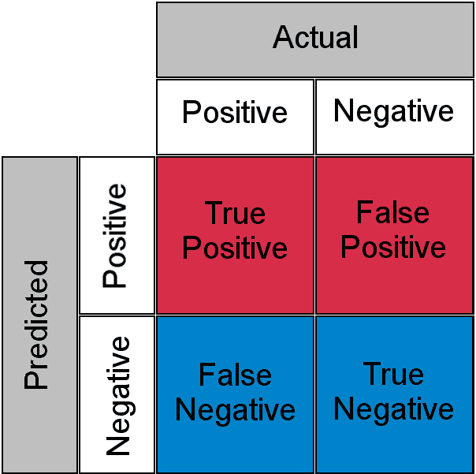

混淆矩阵 ([ThresholdTom](https://commons.wikimedia.org/wiki/File:ConfusionMatrixRedBlue.png)，公有领域，通过维基媒体共享)

由于这种“[已知未知](https://en.wikipedia.org/wiki/There_are_unknown_unknowns)”，对于敏感的工作负载，人类仍然必须审查和理解所有 10,000 个电话。我们又回到了同样的瓶颈问题。

我们如何将更多的统计确定性融入我们的代理过程中？在这篇文章中，我构建了一个系统，使我们能够对我们的代理过程更有信心，将其推广到任意数量的代理，并开发一个成本函数来帮助引导系统未来的投资。我在这篇文章中使用到的代码可以在我的仓库[ai-decision-circuits](https://github.com/Barneyjm/ai-decision-circuits/blob/main/formula-derivation.md)中找到。

## AI 决策电路

错误检测和纠正并不是新概念。在数字和模拟电子等领域，错误纠正至关重要。甚至量子计算的发展也依赖于扩展错误纠正和检测的能力。我们可以从这些系统中汲取灵感，并利用 AI 代理实现类似的功能。

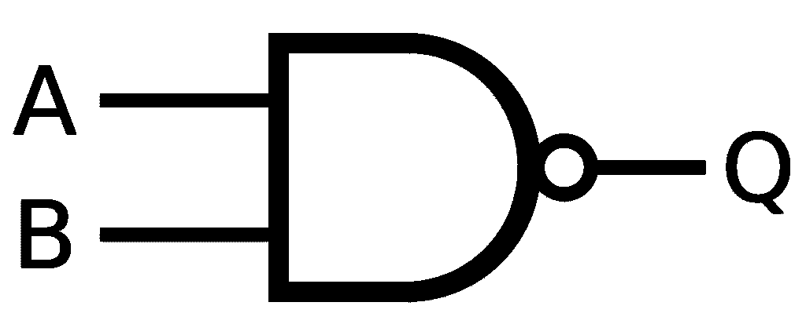

一个 NAND 门的例子 (Inductiveload, 公共领域, [链接](https://commons.wikimedia.org/w/index.php?curid=5729015))

在布尔逻辑中，NAND 门是计算的圣杯，因为它们可以执行任何操作。它们是功能完备的，这意味着任何逻辑操作都可以仅使用 NAND 门来构建。这个原则可以应用于 AI 系统，以创建具有内置错误纠正的稳健决策架构。

## 从电子电路到 AI 决策电路

正如电子电路使用冗余和验证来确保可靠的计算一样，AI 决策电路可以使用具有不同视角的多个代理来得出更准确的结果。这些电路可以使用信息论和布尔逻辑的原则来构建：

1.  **冗余处理**：多个 AI 代理独立处理相同的输入，类似于现代 CPU 如何使用冗余电路来检测硬件错误。

1.  **共识机制**：决策输出通过投票系统或加权平均进行组合，类似于容错电子中的多数逻辑门。

1.  **验证代理**：专门的 AI 验证器检查输出的合理性，功能上类似于像[奇偶校验位](https://en.wikipedia.org/wiki/Parity_bit)或[循环冗余校验](https://en.wikipedia.org/wiki/Cyclic_redundancy_check)这样的错误检测代码。

1.  **人机协同集成**：在决策过程中的关键点进行战略性的人工验证，类似于关键系统如何使用人工监督作为最终验证层。

## AI 决策电路的数学基础

这些系统的可靠性可以使用概率论进行量化。

对于单个代理，失败的概率来自通过测试数据集观察到的准确度随时间的变化，存储在像[LangSmith](https://www.langchain.com/langsmith)这样的系统中。

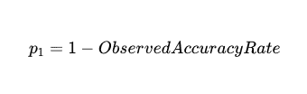

对于一个 90%准确的代理，失败的概率，`p_1`，`1–0.9`是 0.1，或 10%。

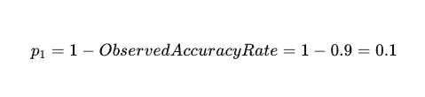

两个独立代理在相同输入上失败的概率是两个代理准确度的乘积：

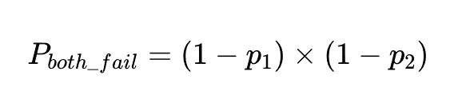

如果我们有 N 次执行这些代理，总的失败次数是

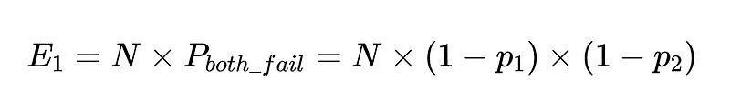

预期失败次数

因此，在两个独立代理之间进行 10,000 次执行，两者都具有 90%的准确度，预期的失败次数是 100 次。

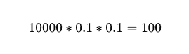

然而，我们仍然不知道那些 10,000 个电话中的哪一个是实际的 100 次失败。

我们可以将这个想法的四个扩展结合在一起，以创建一个更稳健的解决方案，对任何给定响应都提供信心：

+   一个主要分类器（简单的准确度以上）

+   一个备份分类器（简单的准确度以上）

+   模式验证器（例如，0.7 的准确度）

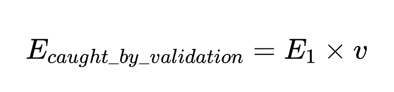

模式验证器捕获的错误数

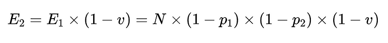

验证后剩余的错误

+   最后，一个负检查器（例如，准确率为 0.6）

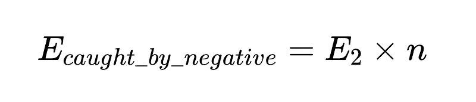

负检查器捕获的错误数

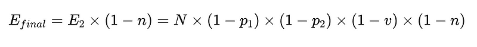

最终未检测到的错误

要将此放入代码（[完整仓库](https://github.com/Barneyjm/ai-decision-circuits/tree/main)），我们可以使用简单的 Python：

```py
def primary_parser(self, customer_input: str) -> Dict[str, str]:
    """
    Primary parser: Direct command with format expectations.
    """
    prompt = f"""
    Extract the category of the customer service call from the following text as a JSON object with key 'call_type'. 
    The call type must be one of: {', '.join(self.call_types)}.
    If the category cannot be determined, return {{'call_type': null}}.

    Customer input: "{customer_input}"
    """

    response = self.model.invoke(prompt)
    try:
        # Try to parse the response as JSON
        result = json.loads(response.content.strip())
        return result
    except json.JSONDecodeError:
        # If JSON parsing fails, try to extract the call type from the text
        for call_type in self.call_types:
            if call_type in response.content:
                return {"call_type": call_type}
        return {"call_type": None}

def backup_parser(self, customer_input: str) -> Dict[str, str]:
    """
    Backup parser: Chain of thought approach with formatting instructions.
    """
    prompt = f"""
    First, identify the main issue or concern in the customer's message.
    Then, match it to one of the following categories: {', '.join(self.call_types)}.

    Think through each category and determine which one best fits the customer's issue.

    Return your answer as a JSON object with key 'call_type'.

    Customer input: "{customer_input}"
    """

    response = self.model.invoke(prompt)
    try:
        # Try to parse the response as JSON
        result = json.loads(response.content.strip())
        return result
    except json.JSONDecodeError:
        # If JSON parsing fails, try to extract the call type from the text
        for call_type in self.call_types:
            if call_type in response.content:
                return {"call_type": call_type}
        return {"call_type": None}

def negative_checker(self, customer_input: str) -> str:
    """
    Negative checker: Determines if the text contains enough information to categorize.
    """
    prompt = f"""
    Does this customer service call contain enough information to categorize it into one of these types: 
    {', '.join(self.call_types)}?

    Answer only 'yes' or 'no'.

    Customer input: "{customer_input}"
    """

    response = self.model.invoke(prompt)
    answer = response.content.strip().lower()

    if "yes" in answer:
        return "yes"
    elif "no" in answer:
        return "no"
    else:
        # Default to yes if the answer is unclear
        return "yes"

@staticmethod
def validate_call_type(parsed_output: Dict[str, Any]) -> bool:
    """
    Schema validator: Checks if the output matches the expected schema.
    """
    # Check if output matches expected schema
    if not isinstance(parsed_output, dict) or 'call_type' not in parsed_output:
        return False

    # Verify the extracted call type is in our list of known types or null
    call_type = parsed_output['call_type']
    return call_type is None or call_type in CALL_TYPES
```

通过将这些与简单的布尔逻辑相结合，我们可以获得类似的准确度，并对每个答案都有信心：

```py
def combine_results(
    primary_result: Dict[str, str], 
    backup_result: Dict[str, str], 
    negative_check: str, 
    validation_result: bool,
    customer_input: str
) -> Dict[str, str]:
    """
    Combiner: Combines the results from different strategies.
    """
    # If validation failed, use backup
    if not validation_result:
        if RobustCallClassifier.validate_call_type(backup_result):
            return backup_result
        else:
            return {"call_type": None, "confidence": "low", "needs_human": True}

    # If negative check says no call type can be determined but we extracted one, double-check
    if negative_check == 'no' and primary_result['call_type'] is not None:
        if backup_result['call_type'] is None:
            return {'call_type': None, "confidence": "low", "needs_human": True}
        elif backup_result['call_type'] == primary_result['call_type']:
            # Both agree despite negative check, so go with it but mark low confidence
            return {'call_type': primary_result['call_type'], "confidence": "medium"}
        else:
            return {"call_type": None, "confidence": "low", "needs_human": True}

    # If primary and backup agree, high confidence
    if primary_result['call_type'] == backup_result['call_type'] and primary_result['call_type'] is not None:
        return {'call_type': primary_result['call_type'], "confidence": "high"}

    # Default: use primary result with medium confidence
    if primary_result['call_type'] is not None:
        return {'call_type': primary_result['call_type'], "confidence": "medium"}
    else:
        return {'call_type': None, "confidence": "low", "needs_human": True}
```

## 决策逻辑，一步一步

### 第 1 步：当质量控制失败时

```py
if not validation_result:
```

这意味着：“如果我们的质量控制专家（验证者）拒绝主要分析，不要相信它。”然后系统会尝试使用备用意见。如果这也未能通过验证，它会将案件标记为人类审阅。

用日常用语来说：“如果我们的第一个答案看起来有些不对劲，让我们尝试我们的备用方法。如果那仍然看起来可疑，让我们让人类介入。”

### 第 2 步：处理矛盾

```py
if negative_check == 'no' and primary_result['call_type'] is not None:
```

这检查特定类型的矛盾：“我们的负检查器说不应该有呼叫类型，但我们的主要分析器还是找到了一个。”

在这种情况下，系统会求助于备用分析器来打破僵局：

+   如果备用方法同意没有呼叫类型 → 发送给人类

+   如果备用方法与主要方法一致 → 接受但标记为中等置信度

+   如果备用方法有不同的呼叫类型 → 发送给人类

这就像说：“如果一个专家说‘这个不可分类’，而另一个专家说它是，我们需要一个裁决者或人类判断。”

### 第 3 步：当专家意见一致时

```py
if primary_result['call_type'] == backup_result['call_type'] and primary_result['call_type'] is not None:
```

当主要和备用分析器独立得出相同的结论时，系统会将其标记为“高置信度”——这是最佳情况。

用日常用语来说：“如果两位不同的专家使用不同的方法独立得出相同的结论，我们可以相当确信他们是正确的。”

### 第 4 步：默认处理

如果没有特殊情况适用，系统默认为主分析器的结果，并标记为“中等置信度”。如果连主分析器也无法确定呼叫类型，它将案件标记为人类审阅。

## 为什么这种方法很重要

这种决策逻辑通过以下方式创建了一个健壮的系统：

1.  **减少误报**：系统只有在多种方法达成一致时才提供高置信度

1.  **捕捉矛盾**：当系统的不同部分意见不一致时，它会降低置信度或升级到人类

1.  **智能升级**：只有真正需要专家专业知识的情况才会被人类审阅员看到

1.  **置信度标记**：结果包括系统对每个答案的置信度，允许下游过程对高置信度与中等置信度的结果进行不同处理

这种方法反映了电子设备如何使用冗余电路和投票机制来防止错误导致系统故障。在 AI 系统中，这种深思熟虑的组合逻辑可以显著降低错误率，同时高效地仅在使用人类评审员最能增加价值的地方使用他们。

### 示例

在 2015 年，费城水务局[发布了按类别划分的客户通话计数](https://metadata.phila.gov/#home/datasetdetails/560184fc077169215719b5a5/representationdetails/561f12d775d3fc3a4c7beb7b/)。客户通话理解是代理人员处理的一个非常常见的流程。而不是让人类逐个听取客户电话，代理人员可以更快地听取通话，提取信息，并将通话分类以进行进一步的数据分析。对于水务部门来说，这很重要，因为更快地识别关键问题，这些问题就能更快地得到解决。

我们可以构建一个实验。我使用 LLM 通过提示“给定以下类别，生成该电话通话的简短记录：<类别>”来生成有关电话通话的伪造记录。以下是一些示例，完整文件[在此](https://github.com/Barneyjm/ai-decision-circuits/blob/main/customer-calls.json)：

```py
{
  "calls": [
    {
      "id": 5,
      "type": "ABATEMENT",
      "customer_input": "I need to report an abandoned property that has a major leak. Water is pouring out and flooding the sidewalk."
    },
    {
      "id": 7,
      "type": "AMR (METERING)",
      "customer_input": "Can someone check my water meter? The digital display is completely blank and I can't read it."
    },
    {
      "id": 15,
      "type": "BTR/O (BAD TASTE & ODOR)",
      "customer_input": "My tap water smells like rotten eggs. Is it safe to drink?"
    }
  ]
}
```

现在，我们可以使用更传统的 LLM 作为评判者的评估方法来设置实验（[完整实现在此](https://github.com/Barneyjm/ai-decision-circuits/blob/main/customer-calls.json)）：

```py
def classify(customer_input):
  CALL_TYPES = [
      "RESTORE", "ABATEMENT", "AMR (METERING)", "BILLING", "BPCS (BROKEN PIPE)", "BTR/O (BAD TASTE & ODOR)", 
      "C/I - DEP (CAVE IN/DEPRESSION)", "CEMENT", "CHOKED DRAIN", "CLAIMS", "COMPOST"
  ]
  model = ChatAnthropic(model='claude-3-7-sonnet-latest')

  prompt = f"""
  You are a customer service AI for a water utility company. Classify the following customer input into one of these categories:
  {', '.join(CALL_TYPES)}

  Customer input: "{customer_input}"

  Respond with just the category name, nothing else.
  """

  # Get the response from Claude
  response = model.invoke(prompt)
  predicted_type = response.content.strip()

  return predicted_type
```

通过仅将记录传递给 LLM，我们可以隔离真实类别的知识，并与返回的提取类别进行比较。

```py
def compare(customer_input, actual_type)
  predicted_type = classify(customer_input)

  result = {
      "id": call["id"],
      "customer_input": customer_input,
      "actual_type": actual_type,
      "predicted_type": predicted_type,
      "correct": actual_type == predicted_type
  }
  return result
```

使用 Claude 3.7 Sonnet（截至撰写时的最先进模型）对整个伪造数据集进行运行，性能非常出色，91%的通话被准确分类：

```py
"metrics": {
    "overall_accuracy": 0.91,
    "correct": 91,
    "total": 100
}
```

如果这些是真实的通话，并且我们没有对该类别的先验知识，我们仍然需要审查所有 100 个电话通话以找到 9 个错误分类的通话。

通过实施我们上面提到的稳健决策电路，我们得到了类似的准确度结果，并对这些答案的**置信度**有信心。在这种情况下，整体准确度为 87%，但在高度自信的答案中准确度为 92.5%。

```py
{
  "metrics": {
      "overall_accuracy": 0.87,
      "correct": 87,
      "total": 100
  },
  "confidence_metrics": {
      "high": {
        "count": 80,
        "correct": 74,
        "accuracy": 0.925
      },
      "medium": {
        "count": 18,
        "correct": 13,
        "accuracy": 0.722
      },
      "low": {
        "count": 2,
        "correct": 0,
        "accuracy": 0.0
      }
  }
}
```

我们需要在高度自信的答案中达到 100%的准确度，因此还有工作要做。这种方法让我们能够深入了解高度自信答案不准确的原因。在这种情况下，糟糕的提示和简单的验证能力无法捕捉到所有问题，导致分类错误。这些能力可以通过迭代改进以达到高度自信答案中的 100%准确度。

### 高度自信答案的增强过滤

当前系统在主分析和备用分析器意见一致时将响应标记为“高度自信”。为了达到更高的准确性，我们需要更加挑剔地选择哪些内容可以被认为是“高度自信”。

```py
# Modified high confidence logic
if (primary_result['call_type'] == backup_result['call_type'] and 
    primary_result['call_type'] is not None and
    validation_result and
    negative_check == 'yes' and
    additional_validation_metrics > threshold):
    return {'call_type': primary_result['call_type'], "confidence": "high"}
```

通过增加更多的资格标准，我们将有更少的“高度自信”结果，但它们将更加准确。

### 额外的验证技术

一些其他想法包括以下：

**三级分析器**：添加第三个独立的分析方法

```py
# Only mark high confidence if all three agree 
if primary_result['call_type'] == backup_result['call_type'] == tertiary_result['call_type']:
```

**历史模式匹配**：与历史正确结果进行比较（例如：向量搜索）

```py
if similarity_to_known_correct_cases(primary_result) > 0.95:
```

**对抗性测试**：对输入应用小的变化并检查分类是否稳定

```py
variations = generate_input_variations(customer_input)
if all(analyze_call_type(var) == primary_result['call_type'] for var in variations):
```

### LLM 提取系统中人工干预的通用公式

[完整推导过程在此](https://github.com/Barneyjm/ai-decision-circuits/blob/main/formula-derivation.md)。

+   N = 总执行次数（在我们的例子中为 10,000）

+   p_1 = 主要解析器的准确率（在我们的例子中为 0.8）

+   p_2 = 备用解析器的准确率（在我们的例子中为 0.8）

+   v = 架构验证器的有效性（在我们的例子中为 0.7）

+   n = 负面检查器的有效性（在我们的例子中为 0.6）

+   H = 需要的人工干预次数

+   E_final = 最终未检测到的错误

+   m = 独立验证器的数量

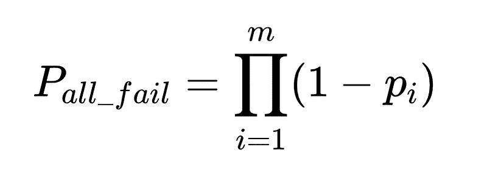

所有解析器均失败的概率

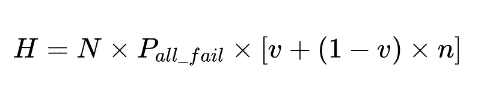

需要人工干预的案例数量

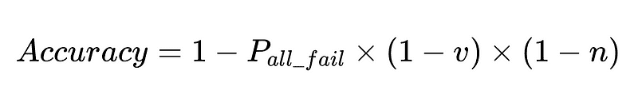

最终系统准确率

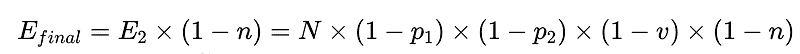

最终错误计数

### 优化系统设计

该公式揭示了关键见解：

+   添加解析器会有递减的回报，但总是提高准确率

+   系统的准确率受限于：

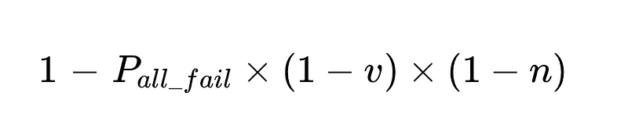

+   人工干预与总执行次数 N 成线性关系

对于我们的例子：

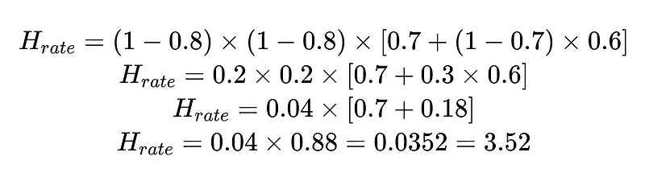

这表明在 10,000 次执行中有大约 352 次需要人工干预。

我们可以使用这个计算出的 H_rate 来实时跟踪我们解决方案的有效性。如果我们的人工干预率开始缓慢上升至 3.5%以上，我们知道系统正在崩溃。如果我们的人工干预率稳步下降至 3.5%以下，我们知道我们的改进按预期进行。

### 成本函数

我们还可以建立一个成本函数，帮助我们调整系统。

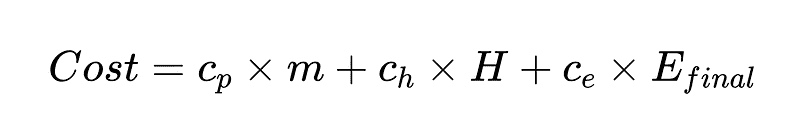

其中：

+   c_p = 每次解析器运行的成本（在我们的例子中为 0.10）

+   m = 解析器执行次数（在我们的例子中为 2 * N）

+   H = 需要人工干预的案例数量（在我们的例子中为 352）

+   c_h = 每个人工干预的成本（例如：4 小时，每小时 50 美元）

+   c_e = 每个未检测到的错误的成本（例如：1000 美元）

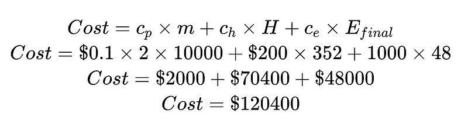

该示例系统的成本，按解析器成本、人工干预成本和未检测错误成本分解

通过将成本分解为每个人工干预的成本和每个未检测到的错误的成本，我们可以整体调整系统。在这个例子中，如果人工干预的成本（70,400 美元）不可接受且过高，我们可以专注于提高高置信度结果。如果未检测到的错误的成本（48,000 美元）不可接受且过高，我们可以引入更多的解析器以降低未检测到的错误率。

当然，成本函数作为探索如何优化它们所描述的情况的方法更有用。

从我们上面的场景来看，为了将未检测到的错误数 E_final 减少 50%，其中

+   p1 和 p2 = 0.8，

+   v = 0.7 和

+   n = 0.6

我们有三个选择：

1.  添加一个准确度为 50%的新解析器并将其作为三级分析器。请注意，这会带来权衡：你运行更多解析器的成本随着人工干预成本的增加而增加。

1.  将两个现有的解析器各自提高 10%。鉴于这些解析器执行任务的难度，这可能或可能不可能实现。

1.  通过人工干预提高验证过程 15%。再次强调，这会增加成本。

### 人工智能可靠性的未来：通过精确性建立信任

随着人工智能系统在商业和社会关键领域的日益集成，追求完美准确度将成为一项要求，尤其是在敏感应用中。通过采用这些受电路启发的 AI 决策方法，我们可以构建既高效扩展又能获得一致可靠性能带来的深厚信任的系统。未来不属于最强大的单一模型，而是属于那些精心设计、结合多种视角并具有战略人类监督的系统。

正如数字电子学从不可靠的组件发展到我们信任其处理最重要数据的计算机一样，AI 系统现在也在经历类似的旅程。本文中描述的框架代表了最终将成为关键任务 AI 标准架构的早期蓝图——这些系统不仅承诺可靠性，而且在数学上保证可靠性。问题不再是能否构建出几乎完美的 AI 系统，而是我们能在多快的时间内将这些原则应用于我们最重要的应用中。
