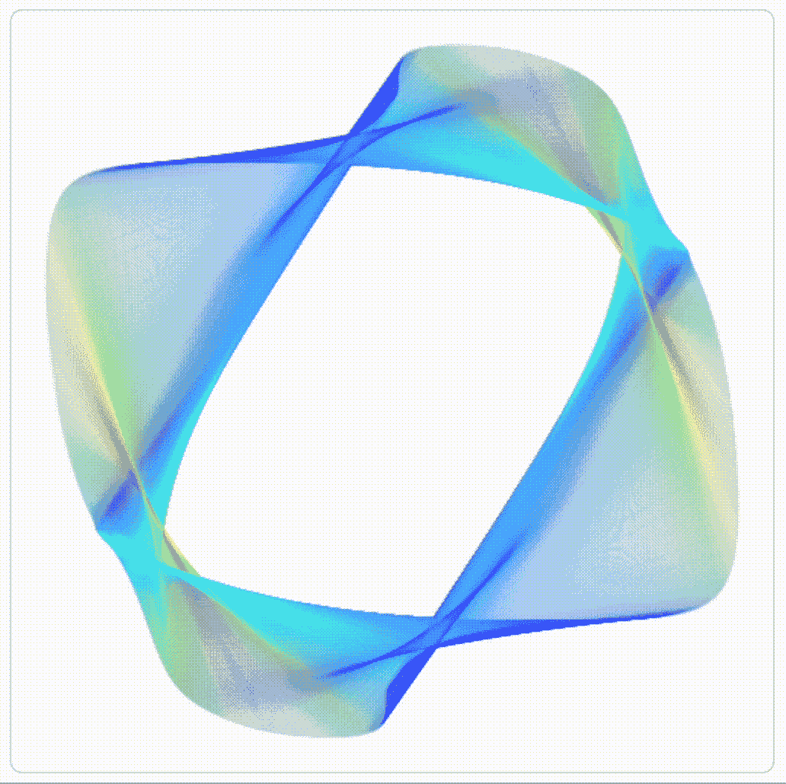
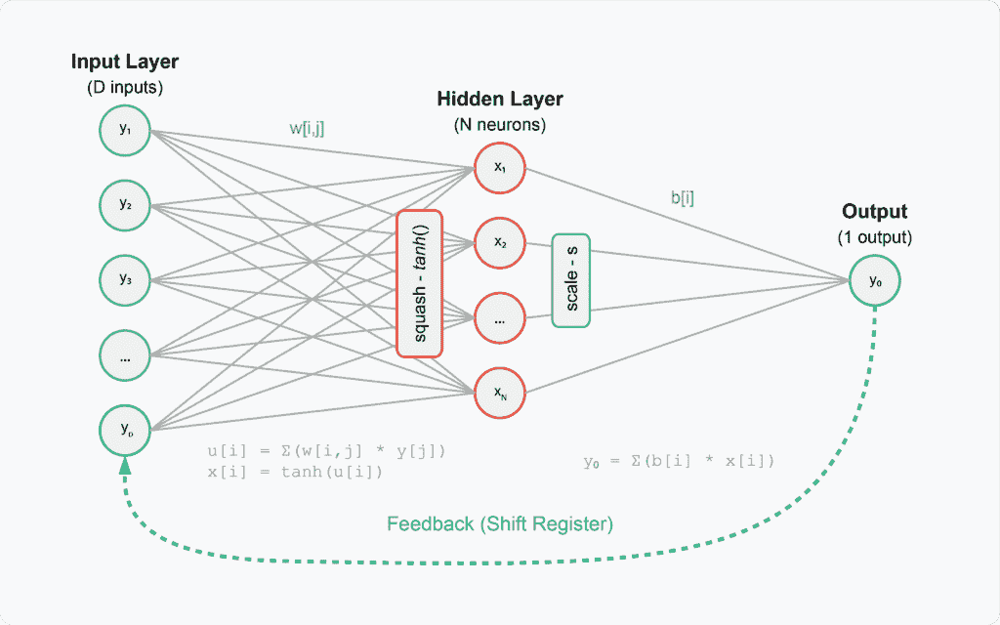
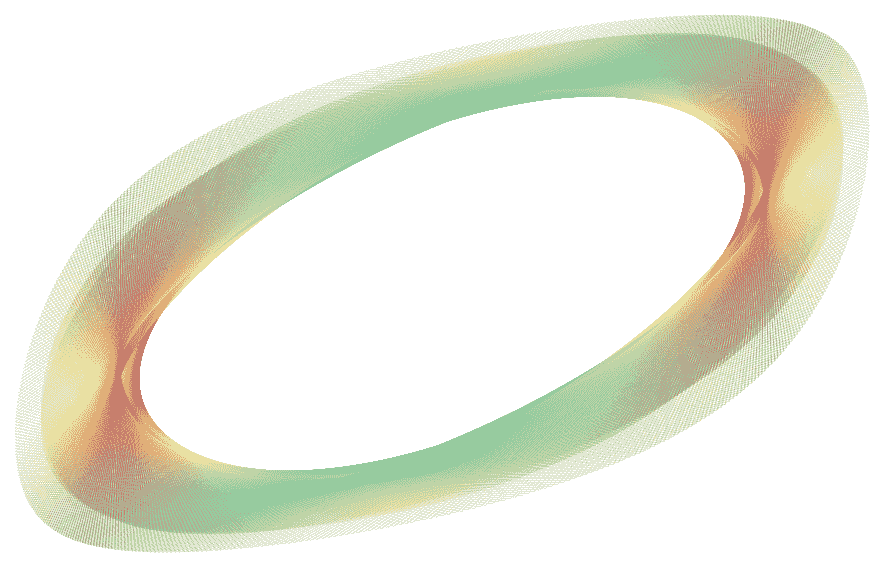
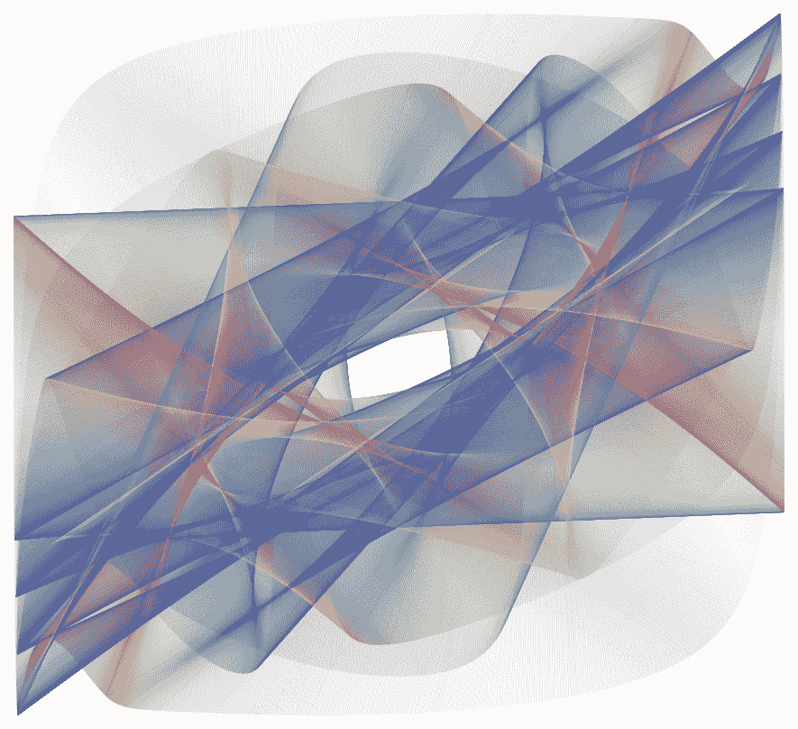
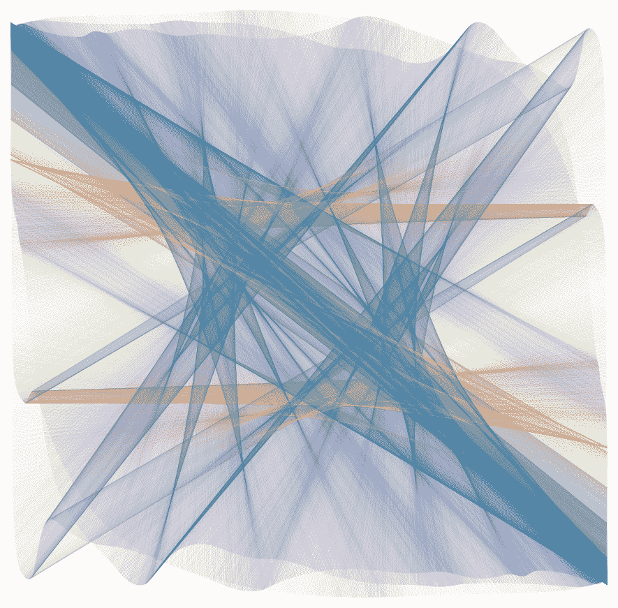

# 神经网络电路中的吸引子：美与混沌

> 原文：[`towardsdatascience.com/attractors-in-neural-network-circuits-beauty-and-chaos/`](https://towardsdatascience.com/attractors-in-neural-network-circuits-beauty-and-chaos/)



随着时间推移，前两个神经元激活的状态空间遵循一个吸引子。

<mdspan datatext="el1742930501083" class="mdspan-comment">记忆、振荡的化学反应和双摆有什么共同之处？所有这些系统都有可能状态的吸引盆地，就像磁铁吸引系统向特定轨迹移动。具有多个输入的复杂系统通常随时间演变，产生复杂和有时是混沌的行为。吸引子代表了动态系统的长期行为模式——一个系统无论其初始条件如何，都会随时间收敛的模式。**

在我们当前的人工智能时代，神经网络无处不在，通常作为强大的表示提取和模式识别工具。然而，这些系统也可以通过另一个迷人的视角来观察：作为随时间演变并收敛到状态流形的动态系统。当实现反馈回路时，即使是简单的神经网络也能产生引人注目的美丽吸引子，从极限环到混沌结构。

### **神经网络作为动态系统**

虽然从广义上讲，神经网络最常为人所知的是嵌入提取任务，但它们也可以被视为动态系统。动态系统描述了状态空间中的点如何根据一组固定的规则或力随时间演变。在神经网络的背景下，状态空间由神经元的激活模式组成，演变规则由网络的权重、偏差、激活函数和其他技巧决定。

传统的神经网络通过梯度下降进行优化，以找到其收敛的最终状态。然而，当我们引入反馈——将输出连接回输入时——网络变成了一个具有不同时间动态的循环系统。这些动态可以表现出从简单收敛到固定点到复杂混沌模式的各种行为。

### **理解吸引子**

吸引子是一组状态，系统倾向于从各种起始条件演变到这些状态。一旦系统达到吸引子，除非受到外部力的干扰，否则它将保持在那一组状态内。吸引子确实在形成记忆[1]、振荡的化学反应[2]和其他非线性动态系统中起着重要作用。

### **吸引子的类型**

动态系统可以表现出几种类型的吸引子，每种都有独特的特征：

+   **点吸引子**：最简单的形式，系统无论起始条件如何都会收敛到一个固定的单一点。这代表了一个稳定的平衡状态。

+   **极限环**：系统进入一个重复的周期性轨道，在相空间中形成一个闭合回路。这代表了具有固定周期的振荡行为。

+   **环面**（准周期）吸引子：系统在相空间中沿着类似甜甜圈的轨迹运动。与极限环不同，这些轨迹实际上永远不会真正重复，但它们仍然绑定在特定区域内。

+   **奇异**（混沌）吸引子：具有非周期性行为，永远不会完全重复，但仍然保持在相空间有限区域内。这些吸引子表现出对初始条件的敏感依赖性，其中微小的差异会在长时间内产生重大后果——这是混沌的标志。想想蝴蝶效应。

### **设置**

在下一节中，我们将深入探讨一个非常简单的神经网络架构的例子，该架构能够实现这种行为，并展示一些相当不错的例子。我们将涉及李雅普诺夫指数，并为希望实验生成自己的神经网络吸引子艺术（而非生成式 AI 意义上的）的人提供实现。



图 1\. 我们将用于吸引子生成的神经网络示意图和组件。[所有图均由作者创建，除非另有说明]

我们将使用一个带有反馈环的极度简化的单层神经网络。其架构包括：

1.  **输入层**：

    +   大小为 D 的数组（这里 16-32）个输入

    +   我们将非传统地标记它们为 y₁, y₂, y₃, …, y[D]，以突出这些是从输出映射过来的

    +   作为移位寄存器存储先前的输出

1.  **隐藏层**：

    +   包含 N 个神经元（这里少于 D，大约 4-8）

    +   我们将标记它们为 x₁, x₂, …, x[N]

    +   *tanh*() 激活函数用于压缩

1.  **输出层**

    +   单个输出神经元（y₀）

    +   将隐藏层输出与偏置相结合——通常，我们使用偏置通过添加来偏移输出；这里，我们使用它们进行缩放，因此实际上它们是一个权重数组

1.  **连接**：

    +   输入到隐藏层：权重矩阵 w[i,j]（在 -1 和 1 之间随机初始化）

    +   隐藏层到输出：偏置权重 b[i]（在 0 和 s 之间随机初始化）

1.  **反馈环**：

    +   输出 y₀ 反馈到输入层，创建一个动态映射

    +   作为移位寄存器（y₁ = 前一个 y₀，y₂ = 前一个 y₁，等等）

    +   这种反馈是创建动态系统行为的原因

1.  **关键公式**：

    +   隐藏层：u[i] = Σ(w[i,j] * y[j]); x[i] = *tanh*(u[i])

    +   输出：y₀ = Σ(b[i] * x[i])

使这个网络能够生成吸引子的关键方面：

+   **反馈环**将一个简单的前馈网络转换成一个动态系统

+   **非线性激活函数** (*tanh*) 能够产生复杂行为

+   **随机权重初始化**（由随机种子控制）创建了不同的吸引子模式

+   **缩放因子 s**影响系统的动力学，并可能将其推入混沌状态。

为了研究系统对混沌的敏感性，我们将计算不同参数集的 Lyapunov 指数。Lyapunov 指数是衡量**动力系统不稳定性**的度量…

\[\delta Z(t)| \approx e^{\lambda t} |\delta (Z(0))|\]

\[\lambda = n_t \sum_{k=0}^{n_t-1} ln \frac{|\Delta y_{k+1}|}{|\Delta y_k|}\]

…其中 n[t]是时间步数，Δy[k]是状态 y(x[i])和 y(x[i]+ϵ)在某一时间点的距离；ΔZ(0)代表两个相邻起始点之间的初始无限小（非常小）的分离，而ΔZ(t)是时间 t 后的分离。对于稳定系统收敛到固定点或稳定吸引子，此参数小于 0，对于不稳定（发散的，因此是混沌系统）它大于 0。

让我们编写代码！我们将只使用 NumPy 和默认的 Python 库来实现。

```py
import numpy as np
from typing import Tuple, List, Optional

class NeuralAttractor:
    """

    N : int
        Number of neurons in the hidden layer
    D : int
        Dimension of the input vector
    s : float
        Scaling factor for the output

    """

    def __init__(self, N: int = 4, D: int = 16, s: float = 0.75, seed: Optional[int] = 
None):
        self.N = N
        self.D = D
        self.s = s

        if seed is not None:
            np.random.seed(seed)

        # Initialize weights and biases
        self.w = 2.0 * np.random.random((N, D)) - 1.0  # Uniform in [-1, 1]
        self.b = s * np.random.random(N)  # Uniform in [0, s]

        # Initialize state vector structures
        self.x = np.zeros(N)  # Neuron states
        self.y = np.zeros(D)  # Input vector
```

我们使用一些基本参数初始化`NeuralAttractor`类——隐藏层中的神经元数量、输入数组中的元素数量、输出缩放因子和随机种子。然后我们继续随机初始化权重和偏差以及 x 和 y 状态。这些权重和偏差将不会被优化——它们将保持原位，这次没有梯度下降。

```py
 def reset(self, init_value: float = 0.001):
        """Reset the network state to initial conditions."""
        self.x = np.ones(self.N) * init_value
        self.y = np.zeros(self.D)

    def iterate(self) -> np.ndarray:
        """
        Perform one iteration of the network and return the neuron outputs.

        """
        # Calculate the output y0
        y0 = np.sum(self.b * self.x)

        # Shift the input vector
        self.y[1:] = self.y[:-1]
        self.y[0] = y0

        # Calculate the neuron inputs and apply activation fn
        for i in range(self.N):
            u = np.sum(self.w[i] * self.y)
            self.x[i] = np.tanh(u)

        return self.x.copy()
```

接下来，我们将定义迭代逻辑。我们每次迭代都从反馈循环开始——我们通过将所有 y 元素向右移动来实现移位寄存器电路，并计算最新的 y[0]输出，将其放置在输入的第一个元素中。

```py
 def generate_trajectory(self, tmax: int, discard: int = 0) -> Tuple[np.ndarray, 
np.ndarray]:
        """
        Generate a trajectory of the states for tmax iterations.

        -----------
        tmax : int
            Total number of iterations
        discard : int
            Number of initial iterations to discard

        """
        self.reset()

        # Discard initial transient
        for _ in range(discard):
            self.iterate()

        x1_traj = np.zeros(tmax)
        x2_traj = np.zeros(tmax)

        for t in range(tmax):
            x = self.iterate()
            x1_traj[t] = x[0]
            x2_traj[t] = x[1]

        return x1_traj, x2_traj
```

现在，我们定义一个函数，该函数将在 tmax 个时间步长内迭代我们的网络图，并输出前两个隐藏神经元的状态以进行可视化。我们可以使用任何隐藏神经元，甚至可以可视化三维状态空间，但我们将限制我们的想象力在二维。

这就是系统的核心。现在，我们只需定义一些线条和段落的魔法，以实现漂亮的可视化。

```py
import numpy as np
import matplotlib.pyplot as plt
import matplotlib.collections as mcoll
import matplotlib.path as mpath
from typing import Tuple, Optional, Callable

def make_segments(x: np.ndarray, y: np.ndarray) -> np.ndarray:
    """
    Create list of line segments from x and y coordinates.

    -----------
    x : np.ndarray
        X coordinates
    y : np.ndarray
        Y coordinates

    """
    points = np.array([x, y]).T.reshape(-1, 1, 2)
    segments = np.concatenate([points[:-1], points[1:]], axis=1)
    return segments

def colorline(
    x: np.ndarray,
    y: np.ndarray,
    z: Optional[np.ndarray] = None,
    cmap = plt.get_cmap("jet"),
    norm = plt.Normalize(0.0, 1.0),
    linewidth: float = 1.0,
    alpha: float = 0.05,
    ax = None
):
    """
    Plot a colored line with coordinates x and y.

    -----------
    x : np.ndarray
        X coordinates
    y : np.ndarray
        Y coordinates

    """
    if ax is None:
        ax = plt.gca()

    if z is None:
        z = np.linspace(0.0, 1.0, len(x))

    segments = make_segments(x, y)
    lc = mcoll.LineCollection(
        segments, array=z, cmap=cmap, norm=norm, linewidth=linewidth, alpha=alpha
    )
    ax.add_collection(lc)

    return lc

def plot_attractor_trajectory(
    x: np.ndarray,
    y: np.ndarray,
    skip_value: int = 16,
    color_function: Optional[Callable] = None,
    cmap = plt.get_cmap("Spectral"),
    linewidth: float = 0.1,
    alpha: float = 0.1,
    figsize: Tuple[float, float] = (10, 10),
    interpolate_steps: int = 3,
    output_path: Optional[str] = None,
    dpi: int = 300,
    show: bool = True
):
    """
    Plot an attractor trajectory.

    Parameters:
    -----------
    x : np.ndarray
        X coordinates
    y : np.ndarray
        Y coordinates
    skip_value : int
        Number of points to skip for sparser plotting

    """
    fig, ax = plt.subplots(figsize=figsize)

    if interpolate_steps > 1:
        path = mpath.Path(np.column_stack([x, y]))
        verts = path.interpolated(steps=interpolate_steps).vertices
        x, y = verts[:, 0], verts[:, 1]

    x_plot = x[::skip_value]
    y_plot = y[::skip_value]

    if color_function is None:
        z = abs(np.sin(1.6 * y_plot + 0.4 * x_plot))
    else:
        z = color_function(x_plot, y_plot)

    colorline(x_plot, y_plot, z, cmap=cmap, linewidth=linewidth, alpha=alpha, ax=ax)

    ax.set_xlim(x.min(), x.max())
    ax.set_ylim(y.min(), y.max())

    ax.set_axis_off()
    ax.set_aspect('equal')

    plt.tight_layout()

    if output_path:
        fig.savefig(output_path, dpi=dpi, bbox_inches='tight')

    return fig
```

上面的函数将接受生成的状态空间轨迹并将其可视化。因为状态空间可能密集填充，我们将**跳过每 8 个、16 个或 32 个时间点以稀疏化**我们的向量。我们也不想用一种单一的颜色来绘制这些点，因此我们根据图轴的 x 和 y 坐标**将颜色编码为周期函数**（*np.sin(1.6 * y_plot + 0.4 * x_plot)）。坐标的乘数是任意的，并且恰好生成令人愉悦的平滑颜色图，符合你的喜好。

```py
N = 4
D = 32
s = 0.22
seed=174658140

tmax = 100000
discard = 1000

nn = NeuralAttractor(N, D, s, seed=seed)

# Generate trajectory
x1, x2 = nn.generate_trajectory(tmax, discard)

plot_attractor_trajectory(
    x1, x2,
    output_path='trajectory.png',
)
```

在定义了神经网络和迭代参数之后，我们可以生成状态空间轨迹。如果我们花足够的时间去调整参数，我们会发现一些有趣的东西（我保证！）。如果我们不喜欢手动参数网格搜索的工作，我们可以添加一个函数来检查**随时间覆盖状态空间的比例**。如果在 t = 100,000 次迭代后（除了最初的 1,000 个“预热”时间步），我们只接触了状态空间的一小部分值，我们可能卡在一个点上。一旦我们找到一个不那么害羞地占据更多状态空间的吸引子，我们可以使用默认的绘图参数来绘制它：



图 2. 极限环吸引子。

吸引子的稳定类型之一是**极限环吸引子**（参数：N = 4, D = 32, s = 0.22, seed = 174658140）。它在相空间中看起来像一条单一的、闭合的轨迹。轨道随时间序列遵循规则、周期性的路径。我不会在这里包含李雅普诺夫指数计算的代码，以便更多地关注生成的吸引子的视觉方面，但如果感兴趣，可以在以下[链接](https://github.com/anyakors/neural_attractors)找到。这个吸引子的李雅普诺夫指数（λ=−3.65）为负，表明**稳定性**：从数学上讲，这个指数将导致系统状态随时间衰减或收敛到这个吸引子盆地。

如果我们继续增加缩放因子，我们更有可能调整电路中的值，也许更有可能找到一些有趣的东西。



图 3. 托里德吸引子。

这里是**托里德（准周期）吸引子**（参数：N = 4, D = 32, s = 0.55, seed = 3160697950）。它仍然具有有序的片状结构，这些结构以有组织的准周期模式缠绕。这个吸引子的李雅普诺夫指数值更高，但仍然是负值（λ=−0.20）。

当我们进一步增加缩放因子 s 时，系统更容易出现混沌。以下参数下出现了**奇怪（混沌）吸引子**：N = 4, D = 16, s = 1.4, seed = 174658140。它以轨迹的不可预测、无重复的模式为特征。这个吸引子的李雅普诺夫指数为正（λ=0.32），表明不稳定（随着时间的推移，从一个最初非常接近的状态发散）和混沌行为。这就是“蝴蝶效应”吸引子。



图 4. 奇怪吸引子。

随着我们进一步增加比例因子 s，系统变得更加容易陷入混沌。具有以下参数的奇异（混沌）吸引子出现：N = 4, D = 16, s = 1.4, seed = 174658140。它以轨迹的异常、不可预测的模式为特征，这些模式永远不会重复。该吸引子的李雅普诺夫指数为正（λ=0.32），表明不稳定（随着时间的推移，从一个最初非常接近的状态发散）和混沌行为。这就是“蝴蝶效应”吸引子。

这又是一个证明美学可以非常数学化，反之亦然的例子。最视觉上吸引人的吸引子通常存在于混沌的边缘——想想看！这些结构足够复杂，可以表现出复杂的行为，同时又有足够的秩序来保持连贯性。这与各种艺术形式的观察结果相呼应，在这些艺术形式中，秩序与不可预测性之间的平衡往往创造出最吸引人的体验。

一个交互式小部件，可用于生成和可视化这些吸引子，[在此处](https://www.codehelix.ai/blog/attractors)可用。源代码[也在此处](https://github.com/anyakors/neural_attractors)可用，并邀请进一步探索。这个项目的想法在很大程度上受到了 J.C. Sprott [3] 的工作的启发。

### 参考文献

[1] B. Poucet 和 E. Save, 《记忆中的吸引子》（2005 年），科学 [DOI:10.1126/science.1112555](https://doi.org/10.1126/science.1112555).

[2] Y.J.F. Kpomahou 等人，一篇关于新型非线性耗散参数化学振荡器中的混沌行为和共存吸引子的论文（2022 年），复杂性 [DOI:10.1155/2022/9350516](https://doi.org/10.1155/2022/9350516).

[3] J.C. Sprott, 《人工神经网络吸引子》（1998 年），计算机与图形学 [DOI:10.1016/S0097-8493(97)00089-7](http://doi.org/10.1016/S0097-8493(97)00089-7).
