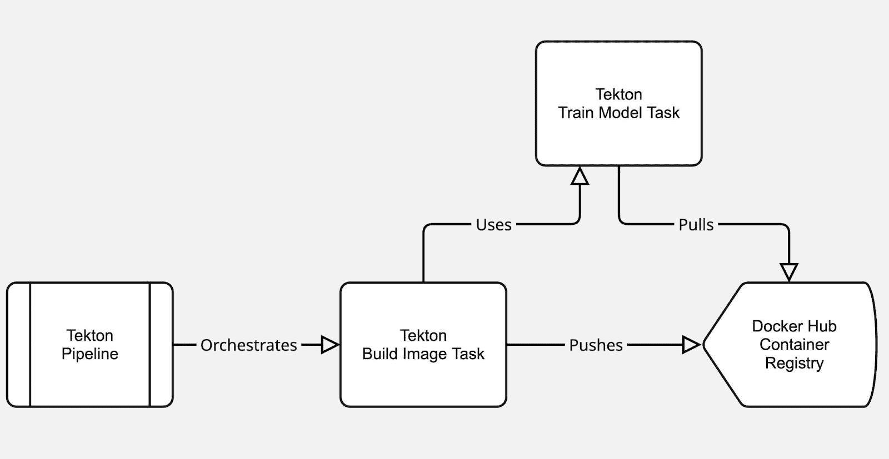
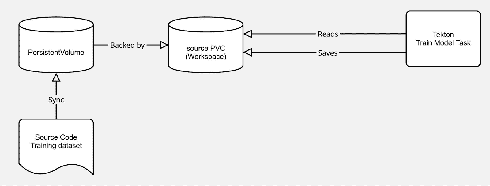
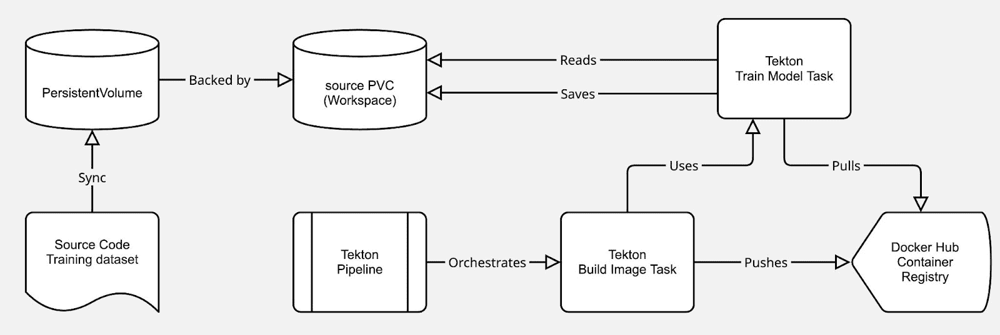
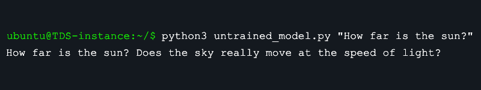
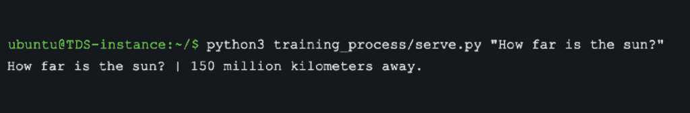

# 自动化模型训练：使用 Tekton 和 Buildpacks 的 MLOps 管道

> 原文：[`towardsdatascience.com/automate-models-training-an-mlops-pipeline-with-tekton-and-buildpacks/`](https://towardsdatascience.com/automate-models-training-an-mlops-pipeline-with-tekton-and-buildpacks/)

<mdspan datatext="el1749532257635" class="mdspan-comment">有效实施机器学习的动力意味着仅仅训练一个模型已经不再足够；健壮、自动化和可重复的训练管道正在迅速成为 MLOps 的标准要求。许多团队在将机器学习实验与生产级 CI/CD 实践集成时遇到困难，常常陷入手动流程或复杂的容器配置中。如果你能够简化训练工作流程的容器化并编排它们，而无需编写 Dockerfile 会怎样呢？

在本教程中，我将展示如何使用开源 [Tekton](https://tekton.dev/) 管道和 [Buildpacks](https://buildpacks.io/) 自动化训练 GPT-2 模型。我们将容器化训练工作流程而无需编写 Dockerfile，并使用 Tekton 来编排构建和训练步骤。

我将通过一个轻量级的 GPT-2 调整示例来演示这一点，展示训练前后模型的输出，并提供逐步说明以重新创建管道。

## 工具包概述：Tekton、Buildpacks 和 GPT-2

### Tekton Pipelines：云原生 CI/CD for ML

Tekton Pipelines 是一个开源的 CI/CD 框架，它原生运行在 Kubernetes 上。它允许你将管道定义为 Kubernetes 资源，从而实现云原生构建、测试和部署工作流程。在 Tekton 管道中，每个步骤都在容器中运行，这使得它非常适合需要隔离和可重复性的 ML 工作流程。

### Buildpacks：跳过 Dockerfile

记得上次你与复杂的 Dockerfile 斗争，试图将所有依赖和配置都调整得恰到好处吗？[Paketo Buildpacks](https://paketo.io/)（Cloud Native Buildpacks 的一个实现）提供了一个令人耳目一新的替代方案。它们直接从你的源代码中自动化创建容器镜像。Buildpacks 分析你的项目，检测语言和依赖项，然后为你构建一个优化、安全的容器镜像。这不仅节省了时间，还将最佳实践纳入到你的镜像构建过程中，通常会产生比手动使用 Dockerfile 创建的更安全、更高效的镜像。

### GPT-2：轻量级模型

我们将以 GPT-2 作为示例模型。它是一个知名的变压器模型，并且关键的是，它足够轻量，我们可以快速在小型自定义数据集上调整它。这使得它非常适合演示我们的训练管道的机制，而无需大量的计算资源或等待数小时。我们将使用一组微小的问答对来调整它，这样我们就可以在管道施展魔法后清楚地看到其输出的差异。

这里的目标不是使用 GPT-2 实现突破性的 NLP 结果。相反，我们专注于展示一个高效且自动化的模型训练 CI/CD pipeline。模型是我们的有效载荷。

## 查看项目内部：代码、数据和 Pipeline 结构

我在 GitHub 上设置了一个示例 [仓库](https://github.com/sylvainkalache/Automate-PyTorch-Model-Training-with-Tekton-and-Buildpacks)，其中包含了您需要的一切来跟随操作。让我们快速浏览一下关键组件：

+   `training_process/train.py` – 模型训练脚本。它使用 HuggingFace Transformers 和 PyTorch 在自定义问答数据集上微调 GPT-2。它读取一个包含问答对的文本文件（见下文），在此数据集上微调 GPT-2，并将训练好的模型保存到输出目录。

+   `training_process/requirements.txt` – 训练所需的 Python 依赖项。Buildpacks 将自动将这些依赖项安装到镜像中。

+   `training_process/train.txt` – 一组问答对的小数据集。请随意自定义它 🙂

+   `untrained_model.py` – 一个辅助脚本，用于在微调之前测试 GPT-2。

**Tekton Pipeline 文件：**

+   `model-training-pipeline.yaml` – 定义了 Tekton pipeline，包含两个任务（下一节将解释）。

+   `source-pv-pvc.yaml` – 定义了一个 PersistentVolume 和 PersistentVolumeClaim，用于与 Tekton 任务（用作工作区）共享源代码和数据。

+   `kind-config.yaml` – 一个 [Kind](https://kind.sigs.k8s.io/) 集群配置，用于将本地 `training_process/` 目录挂载到 Kubernetes 集群中。

+   `sa.yml`– 用于将构建的镜像推送到容器注册库（在本例中为 Docker Hub）的 ServiceAccount 和密钥配置。

使用这些组件，我们已经准备好了代码、数据和 Pipeline 定义。现在，让我们检查 Tekton pipeline 的结构。

## 我们 Tekton Pipeline 的结构：构建和训练

在核心上，Tekton Pipeline 资源通过定义一系列任务来编排您的 CI/CD 工作流程。您可以将这些任务视为可重用的构建块，每个任务由一个或多个步骤组成，在这些步骤中执行实际的命令和脚本——所有这些都被巧妙地封装在容器中。

为了实现我们特定的 MLOps 目标，即自动化 GPT-2 模型训练，我们设计的 Pipeline（在 `model-training-pipeline.yaml` 中定义）具有清晰、顺序性的结构。它将依次执行两个主要任务：首先，构建和容器化我们的训练代码，其次，使用这个新的容器镜像运行训练过程。



让我们逐一详细说明。

### 构建镜像：容器化训练代码

此任务利用 Paketo Buildpacks 创建包含我们的训练代码及其所有依赖项的 Docker 镜像。重要的是，不需要 Dockerfile：Buildpacks 构建器将自动检测 Python 应用并安装 PyTorch、Transformers 以及在 requirements.txt 文件中指定的其他依赖项。在管道中，此任务被称为 `build-image`。它运行带有源代码工作区挂载的 Paketo Buildpacks 构建器 (`paketobuildpacks/builder:full`)。在底层，它调用 Cloud Native Buildpacks 生命周期创建器：

`/cnb/lifecycle/creator -skip-restore -app "$(workspaces.source.path)" "$(params.APP_IMAGE)"`

此命令告诉 Buildpacks 从工作区中的应用源创建一个容器镜像，并将其标记为 `$(params.APP_IMAGE)`。默认情况下，`APP_IMAGE` 设置为 Docker Hub 仓库（例如，`sylvainkalache/automate-pytorch-model-training-with-tekton-and-buildpacks:latest`）。

注意，你需要用你的注册表替换它。在这个例子中，我使用 Docker Hub。在此步骤之后，我们的训练代码被打包成一个容器镜像并推送到注册表。

### 训练模型

第二个任务 `run-training` 依赖于第一个任务。此任务从构建步骤生成的镜像中拉取并运行图像以执行模型训练。本质上，它从包含 Python、GPT-2 代码等（已安装）的镜像中启动一个容器，并在该容器内运行 `train.py` 脚本。

## 共享工作区：连接点

让我们来看看为什么在我们的 Tekton 管道中需要一个共享工作区。在这个由多个阶段组成的自动化工作流程中，构建阶段和训练阶段需要一个共享的地方来交换文件或数据。我们的 build-image 任务需要访问我们的本地源代码以将其容器化。稍后，run-training 任务需要访问训练数据。最后，当训练任务成功生成一个微调模型时，我们需要一种保存和检索这个宝贵输出的方法。

这两个任务共享一个名为“source”的 Tekton Workspace。此 Workspace 由一个 PersistentVolumeClaim (`source-pvc`) 支持，该 PersistentVolumeClaim 已配置为挂载我们的本地代码。这就是管道如何访问训练脚本和数据：你机器上 `training_process/` 目录中的相同文件被挂载到 Tekton 任务 Pod 的 `/workspace/source`。



Buildpacks 构建器从那里读取代码以构建镜像，训练容器随后读取数据并将输出写入那里。使用共享工作区确保在训练期间保存的模型在任务完成后仍然持续存在（以便我们可以检索它），并且两个任务都在相同的代码库上操作。请注意，这种设置适合这个教程，但不太可能适用于生产环境。

现在，合并这两个部分，这就是整个训练管道的样子。



现在我们了解了管道，让我们一步步设置并运行它。

## 步骤-by-步骤：运行 GPT-2 训练的 Tekton Pipeline

准备看到它实际运行吗？按照以下步骤设置您的环境，部署 Tekton 资源，并触发训练管道。这假设您有一个 Kubernetes 集群（对于本地测试，您可以使用提供的配置使用 [Kind](https://kind.sigs.k8s.io/)），并且有 `kubectl` 访问权限。如果您没有这样的设置，[这里](https://github.com/sylvainkalache/Automate-PyTorch-Model-Training-with-Tekton-and-Buildpacks/blob/main/install.sh) 是您需要获取必要工具的命令列表。本教程已在 Ubuntu 22.04 上进行测试。

### 克隆示例仓库

在您的机器上获取代码和管道清单：

```py
git clone https://github.com/sylvainkalache/Automate-PyTorch-Model-Training-with-Tekton-and-Buildpacks.git
cd Automate-PyTorch-Model-Training-with-Tekton-and-Buildpacks
```

### 安装 Tekton Pipelines

如果 Tekton 在您的集群上尚未安装，请通过应用官方发布 YAML 进行安装：

`kubectl apply -f https://storage.googleapis.com/tekton-releases/pipeline/latest/release.yaml`

此命令将在您的集群中创建 Tekton CRDs（Pipeline、Task、PipelineRun 等）。您只需执行一次。

### 应用管道和卷清单

部署 Tekton 管道定义和支持的 Kubernetes 资源：

```py
kubectl apply -f model-training-pipeline.yaml

kubectl apply -f source-pv-pvc.yaml

kubectl apply -f sa.yaml
```

**让我们详细了解一下每个命令：**

+   第一个命令在集群中创建 Tekton Pipeline 对象 `model-training-pipeline`。

+   第二个创建一个 PersistentVolume 和 Claim。提供的 `source-pv-pvc.yaml` 假设您正在使用 Kind，并将本地 `training_process/` 目录挂载到集群中。它定义了节点上的 `/mnt/training_process` 位置的 hostPath 卷，并将其绑定到名为 `source-pvc` 的 PVC。

+   第三个命令为 Tekton 在运行管道时使用的服务帐户应用 ServiceAccount。此 `sa.yml` 应引用在下一步中创建的 Docker 仓库密钥，允许 Tekton 的构建步骤推送镜像。

### 创建 Docker 仓库密钥

Tekton 的 Buildpacks 任务会将构建的镜像推送到容器仓库。为此，您需要提供您的仓库凭证（例如，Docker Hub 登录）。使用您的仓库认证详情创建一个 Kubernetes 密钥：

```py
kubectl create secret docker-registry docker-hub-secret \

    --docker-username=<USERNAME> \

    --docker-password=<PASSWORD> \

    --docker-server=<REGISTRY_URL> \

    --namespace default
```

此密钥将存储您的认证信息。确保步骤 3 中的 ServiceAccount 配置为使用此密钥进行镜像拉取和推送。

## 运行 Tekton Pipeline

一切准备就绪后，您可以开始管道，运行：

```py
tkn pipeline start model-training-pipeline \

--workspace name=source,claimName=source-pvc \

 -s tekton-pipeline-sa
```

在这里，我们将 PVC 作为源工作区传递。还指定了具有仓库密钥的服务帐户（`-s`）。这将启动管道。使用 `tkn pipelinerun logs -f` 来查看进度。您应该看到来自 Buildpacks 创建者（检测 Python 应用，安装需求）的输出，然后是来自训练脚本的输出（打印训练轮次和完成）。

在管道成功完成后，微调后的模型将被保存在`training_process/output-model`目录中（多亏了 PVC 工作区，它通过 Kind 挂载在你的本地文件系统中持久化）。现在我们可以比较微调前后 GPT-2 模型的输出。

## 真理在于甜点：训练前后 GPT-2 的输出对比

我们自动化的管道是否改进了模型？让我们来看看。

### 在训练之前

原版的 GPT-2 模型说了些什么？运行`untrained_model.py`并输入一个问题。例如：



我们可以看到 GPT-2 给出了一个漫无边际的回答，并没有正确回答问题。

### 训练过程之后

现在我们来看看在问答数据上微调的 GPT-2。我们可以加载由我们的管道保存的模型并生成一个答案。脚本`training_process/serve.py`就是做这个的。例如：



因为我们是在 QA 格式上训练的，所以微调后的 GPT-2 会在`|`分隔符之后生成答案。确实，训练后，模型对“太阳有多远？”这个问题的回答是：“距离 1.5 亿公里。”——这正是我们从训练数据中得到的确切答案。

这个简单的比较表明，我们的 CI/CD 管道成功地处理了源代码，构建了它，训练了模型，并生成了一个改进版本。虽然这只是一个用于说明的最小数据集，但想象一下将你的更大、特定领域的数据集插入其中。管道结构保持不变，为模型更新提供了一个强大且自动化的路径。

## Tekton + Buildpacks：简化 ML CI/CD 的获胜组合

使用 Tekton 管道与 Buildpacks 为机器学习 CI/CD 工作流程提供了一个优雅的解决方案。Tekton 和 Buildpacks 都是云原生、开源的解决方案，与你的 Kubernetes 生态系统中的其他部分很好地集成。

通过以这种方式自动化模型训练，机器学习工程师和 DevOps 团队能够更有效地协作。在 CI/CD 中，ML 代码被处理得与应用程序代码类似——每次更改都可以触发一个可靠地构建和训练模型的管道。Tekton 提供了与 Kubernetes 可伸缩性相结合的管道粘合剂，Paketo Buildpacks 则消除了容器化 ML 工作负载的麻烦。结果是更快地进行实验和部署 ML 模型，通过声明性、易于维护的管道实现。希望你们喜欢它！

## 感谢阅读

我叫 Sylvain Kalache，是[Rootly AI Labs](http://labs.rootly.com/)的领导者：一个由同仁驱动的社区，致力于构建以 AI 为中心的原型、开源工具和研究，以重新定义可靠性工程。由 Anthropic、Google Cloud 和 Google DeepMind 赞助，我们所有的作品都在[GitHub](https://github.com/Rootly-AI-Labs)上免费提供。想了解更多我的故事，请关注我的[LinkedIn](https://www.linkedin.com/in/sylvainkalache/)或在我的[作品集](https://www.sylvainkalache.com/#writing)中探索我的写作。


*Sylvain Kalache，本文作者，创建了本文中的所有图像和图表。*
