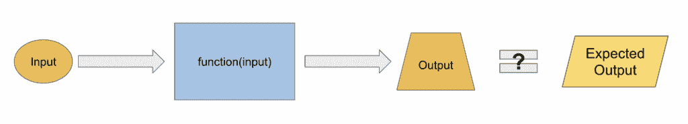
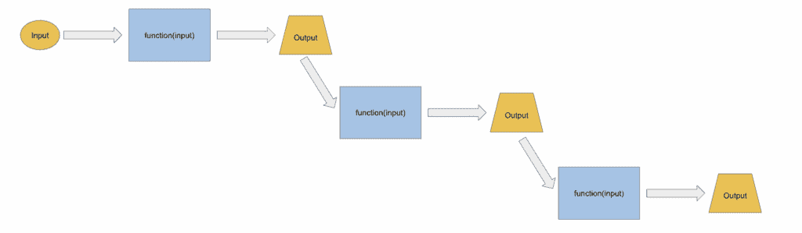

# 自动化测试：数据科学家必须知道的软件工程概念，以成功实现目标

> 原文：[`towardsdatascience.com/automated-testing-a-software-engineering-concept-data-scientists-must-know-to-succeed/`](https://towardsdatascience.com/automated-testing-a-software-engineering-concept-data-scientists-must-know-to-succeed/)

## 为什么你应该阅读这篇文章

<mdspan datatext="el1753819409643" class="mdspan-comment">大多数</mdspan>数据科学家会快速创建一个 Jupyter Notebook，在几个单元格中玩耍，然后在同一个笔记本中维护整个数据处理和模型训练流程。

代码在笔记本首次编写时测试了一次，然后被忽视了一段时间——可能是几天、几周、几个月、几年，直到：

+   需要重新运行笔记本的输出以重新生成丢失的输出。

+   需要使用不同的参数重新运行笔记本以重新训练模型。

+   需要更改上游的某些内容，并且需要重新运行笔记本以刷新下游数据集。

### ***许多人在阅读这篇文章时都会感到脊背发凉……***

**为什么？**

因为你知道这个笔记本永远不会运行。

你心里很清楚，那个笔记本里的代码最多需要调试数小时，最坏的情况是从头开始重写。

在这两种情况下，你都需要花费很长时间才能得到你需要的东西。

> ***为什么会这样发生？***
> 
> ***有没有避免这种情况的方法？***
> 
> ***有没有更好的编写和维护代码的方法？***

这正是本文将要回答的问题。

## 解决方案：自动化测试

### 它是什么？

如其名所示，自动化测试是在你的代码上运行预定义的测试集的过程，以确保它按预期工作。

这些测试验证了你的代码的行为是否符合预期——特别是在更改或添加之后——并在有问题时提醒你。它消除了手动测试代码的需要，并且不需要在实际数据上运行。

方便，不是吗？

## 自动化测试的类型

测试的类型有很多，涵盖所有这些内容超出了本文的范围。

让我们只关注对数据科学家最相关的两种主要类型：

+   单元测试

+   集成测试

#### **单元测试**



作者提供的图片。单元测试概念图解。

测试代码的最小部分（例如，一个函数）在隔离状态下。

函数应该只做一件事情，以便于测试。给它一个已知的输入，并检查输出是否符合预期。

#### **集成测试**



作者提供的图片。集成测试概念图解。

测试多个组件如何协同工作。

对于我们这些数据科学家来说，这意味着检查数据加载、合并和预处理步骤是否在已知输入数据集的情况下产生预期的最终数据集。

## 一个实际例子

理论已经足够了，让我们看看它在实际中是如何工作的。

我们将通过一个简单的例子来讲解，一个数据科学家在 Jupyter 笔记本（或脚本）中编写了一些代码，这在许多数据科学家的工作中都曾见过。

我们将探讨代码为什么不好。然后，我们将尝试让它变得更好。

我们所说的“更好”，是指：

+   易于测试

+   易于阅读

这最终意味着*易于维护*，因为从长远来看，好的代码是能够工作、持续工作且易于维护的。

我们将为改进后的代码设计一些单元测试，突出这些更改对测试的好处。为了防止这篇文章变得过长，我将把集成测试的例子留到未来的文章中。

然后，我们将讨论一些关于要测试的代码的经验法则。

最后，我们将介绍如何运行测试以及如何构建项目结构。


图片由 [Wolfgang Weiser](https://unsplash.com/@hamburgmeinefreundin?utm_content=creditCopyText&utm_medium=referral&utm_source=unsplash) 在 [Unsplash](https://unsplash.com/photos/a-train-traveling-through-a-forest-filled-with-lots-of-trees-el8EOJhVjEU?utm_content=creditCopyText&utm_medium=referral&utm_source=unsplash) 提供

## 示例管道

我们将以以下管道为例：

```py
# bad_pipeline.py

import pandas as pd

# Load data
df1 = pd.read_csv("data/users.csv")
df2 = pd.read_parquet("data/transactions.parquet")
df3 = pd.read_parquet("data/products.parquet")

# Preprocessing
# Merge user and transaction data
df = df2.merge(df1, how='left', on='user_id')

# Merge with product data
df = df.merge(df3, how='left', on='product_id')

# Filter for recent transactions
df = df[df['transaction_date'] > '2023-01-01']

# Calculate total price
df['total_price'] = df['quantity'] * df['price']

# Create customer segment
df['segment'] = df['total_price'].apply(lambda x: 'high' if x > 100 else 'low')

# Drop unnecessary columns
df = df.drop(['user_email', 'product_description', 'price'], axis=1)

# Group by user and segment to get total amount spent
df = df.groupby(['user_id', 'segment']).agg({'total_price': 'sum'}).reset_index()

# Save output
df.to_parquet("data/final_output.parquet")
```

在现实生活中，我们会看到数百行代码被压缩到一个单独的笔记本中。但这个脚本是典型的数据科学笔记本中需要修复的所有问题的典范。

这段代码正在执行以下操作：

1.  加载用户、交易和产品数据。

1.  将它们合并到一个统一的数据库中。

1.  过滤最近的交易。

1.  添加计算字段（`total_price`，`segment`）。

1.  删除无关的列。

1.  聚合每个用户和细分市场的总支出。

1.  将结果保存为 Parquet 文件。

## **为什么这个管道不好？**

哦，从不同的角度来看，这种方式的编码有很多不好的理由。问题不在于内容，而在于它的结构。

尽管我们可以从许多角度讨论这种编写代码方式的缺点，但在这篇文章中，我们将专注于可测试性。

### 1. 紧密耦合的逻辑（换句话说，没有模块化）

所有操作都被压缩到一个单独的脚本中，并一次性运行。除非你阅读每一行，否则不清楚每个部分的作用。即使是这样一个简单的脚本，这也是很难做到的。在现实生活中的脚本中，当代码达到数百行时，这只会变得更糟。

这使得测试变得不可能。

唯一的方法是一次性从头到尾运行整个流程，可能是在你将要使用的数据上。

如果你的数据集很小，那么你可能可以侥幸逃脱这种做法。但在大多数情况下，数据科学家都在处理大量的数据，因此快速运行任何形式的测试或合理性检查都是不可行的。

我们需要能够将代码分解成只做一件事且做得好的可管理块。然后，我们可以控制输入，并确认我们期望的结果。

### 2. 没有参数化

预设的文件路径和值，如`2023-01-01`，会使代码变得脆弱且缺乏灵活性。再次强调，除非使用实时/生产数据，否则很难对代码进行测试。

在我们运行代码的方式上没有灵活性，一切都是固定的。

更糟糕的是，一旦你做了改动，你无法保证脚本的其他部分没有出现错误。

例如，你有多少次在认为改动无害的情况下修改代码，结果却发现代码中完全意想不到的部分出现了问题？

## 如何改进？

现在，让我们一步一步地看看我们如何可以改进这段代码。

> *请注意，我们将假设我们正在使用`pytest`模块进行后续的测试。*

### 1. 清晰、可配置的入口点

```py
def run_pipeline(
    user_path: str,
    transaction_path: str,
    product_path: str,
    output_path: str,
    cutoff_date: str = '2023-01-01'
):
    # Load data
    ...

    # Process data
    ...

    # Save result
    ...
```

我们首先创建一个可以从任何地方运行的单一函数，具有可以更改的清晰参数。

这实现了什么？

这样做允许我们在特定的测试条件下运行管道。

```py
# GIVEN SOME TEST DATA
test_args = dict(
	test_user_path = "<test-dir>/fake_users.csv",
	test_transaction_path = "<test-dir>/fake_transaction.parquet",
	test_product_path = "<test-dir>/fake_products.parquet",
	test_cutoff_date = "<yyyy-MM-dd>",
)

# RUN THE PIPELINE THAT'S TO BE TESTED
run_pipeline(**test_args)

# TEST THE OUTPUT IS AS EXPECTED
output = <load-the-data>
expected_output = <define-the-expected-data>
assert output == expected_output
```

立即，你可以开始传递不同的输入，不同的参数，根据你想要测试的边缘情况。

通过使控制代码的输入和输出变得更容易，它为你提供了在不同设置中运行代码的灵活性。

以这种方式编写你的管道为集成测试你的管道铺平了道路。更多内容将在后续文章中介绍。

### 2. **将代码分组为有意义的块，每个块只做一件事，并且做好**

现在，这里就有一点艺术性了——不同的人会根据他们认为重要的部分以不同的方式组织代码。

没有正确或错误答案，但常识是确保一个函数只做一件事，并且做好。这样做，测试就变得容易了。

我们可以将代码分组的一种方式如下：

```py
def load_data(user_path: str, transaction_path: str, product_path: str):
    """Load data from specified paths"""
    df1 = pd.read_csv(user_path)
    df2 = pd.read_parquet(transaction_path)
    df3 = pd.read_parquet(product_path)
    return df1, df2, df3

def create_user_product_transaction_dataset(
    user_df:pd.DataFrame,
    transaction_df:pd.DataFrame,
    product_df:pd.DataFrame
):
    """Merge user, transaction, and product data into a single dataset.

    The dataset identifies which user bought what product at what time and price.

    Args:
	    user_df (pd.DataFrame):
            A dataframe containing user information. Must have column
            'user_id' that uniquely identifies each user.

	    transaction_df (pd.DataFrame):
            A dataframe containing transaction information. Must have
            columns 'user_id' and 'product_id' that are foreign keys
            to the user and product dataframes, respectively.

	    product_df (pd.DataFrame):
            A dataframe containing product information. Must have
            column 'product_id' that uniquely identifies each product.

    Returns:
        A dataframe that merges the user, transaction, and product data
        into a single dataset.
    """
    df = transaction_df.merge(user_df, how='left', on='user_id')
    df = df.merge(product_df, how='left', on='product_id')
    return df

def drop_unnecessary_date_period(df:pd.DataFrame, cutoff_date: str):
    """Drop transactions that happened before the cutoff date.

    Note:
        Anything before the cutoff date can be dropped because
        of <reasons>.

    Args:
        df (pd.DataFrame): A dataframe with a column `transaction_date`
        cutoff_date (str): A date in the format 'yyyy-MM-dd'

    Returns:
        A dataframe with the transactions that happened after the cutoff date
    """
    df = df[df['transaction_date'] > cutoff_date]
    return df

def compute_secondary_features(df:pd.DataFrame) -> pd.DataFrame:
    """Compute secondary features.

    Args:
        df (pd.DataFrame): A dataframe with columns `quantity` and `price`

    Returns:
        A dataframe with columns `total_price` and `segment`
        added to it.
    """
    df['total_price'] = df['quantity'] * df['price']
    df['segment'] = df['total_price'].apply(lambda x: 'high' if x > 100 else 'low')
    return df
```

分组实现了什么？

### **更好的文档**

首先，你会在代码中留下一些自然的空间来添加文档字符串。为什么这很重要？你尝试过在写完代码一个月后阅读自己的代码吗？

人们很快就会忘记细节，即使是**你**自己写的代码，几天后也可能变得难以理解。

至少记录代码正在做什么，它期望接收什么输入，以及它返回什么，这是非常重要的。

在你的代码中包含文档字符串提供了上下文，并设定了函数应该如何行为的期望，这使得未来更容易理解和调试失败的测试。

### 更好的可读性

通过将代码的复杂性“封装”到更小的函数中，你可以使代码更容易阅读和理解管道的整体流程，而无需阅读每一行代码。

```py
def run_pipeline(
    user_path: str,
    transaction_path: str,
    product_path: str,
    output_path: str,
    cutoff_date: str
):
    user_df, transaction_df, product_df = load_data(
        user_path,
        transaction_path,
        product_path
    )
    df = create_user_product_transaction_dataset(
        user_df,
        transaction_df,
        product_df
    )
    df = drop_unnecessary_date_period(df, cutoff_date)
    df = compute_secondary_features(df)
    df.to_parquet(output_path)
```

你已经为读者提供了一个信息层次，这通过有意义的函数名，为读者提供了`run_pipeline`函数中发生情况的逐步分解。

阅读者然后可以根据他们的需求选择查看函数定义和其中的复杂性。

将代码组合成“有意义的”块的行为展示了被称为“*封装***”和“*抽象***”的概念。

更多关于封装的细节，您可以阅读我关于这个主题的文章[这里](https://medium.com/data-science/encapsulation-a-software-engineering-concept-data-scientists-must-know-to-succeed-b3b1a0a42a41)

### 较小的代码包用于测试

接下来，我们有一组非常具体、定义良好的函数，它们只做一件事。这使得测试和调试更容易，因为我们只需要关注一件事。

下面是如何构建测试的说明。

## 构建单元测试

### 1\. 遵循 AAA 模式

```py
def test_create_user_product_transaction_dataset():
    # GIVEN

    # RUN

    # TEST
    ...
```

首先，我们定义一个测试函数，适当命名为 `test_<function_name>`。

然后，我们将它分为三个部分：

+   `GIVEN`: 函数的输入和预期输出。设置运行我们想要测试的函数所需的一切。

+   `RUN`: 根据给定的输入运行函数。

+   `TEST`: 将函数的输出与预期输出进行比较。

这是一个单元测试应该遵循的通用模式。这种设计模式的标准化名称是*“**AAA 模式***”，代表`Arrange`（安排）、`Act`（行动）、`Assert`（断言）。

我觉得这个命名不是很直观，这就是为什么我使用 `GIVEN`、`RUN`、`TEST`。

### 2\. Arrange: 设置测试

```py
# GIVEN
user_df = pd.DataFrame({
    'user_id': [1, 2, 3], 'name': ["John", "Jane", "Bob"]
})
transaction_df = pd.DataFrame({
    'user_id': [1, 2, 3],
    'product_id': [1, 1, 2],
    'extra-column1-str': ['1', '2', '3'],
    'extra-column2-int': [4, 5, 6],
    'extra-column3-float': [1.1, 2.2, 3.3],
})
product_df = pd.DataFrame({
    'product_id': [1, 2], 'product_name': ["apple", "banana"]
})
expected_df = pd.DataFrame({
    'user_id': [1, 2, 3],
    'product_id': [1, 1, 2],
    'extra-column1-str': ['1', '2', '3'],
    'extra-column2-int': [4, 5, 6],
    'extra-column3-float': [1.1, 2.2, 3.3],
    'name': ["John", "Jane", "Bob"],
    'product_name': ["apple", "apple", "banana"],
})
```

其次，我们定义函数的输入和预期输出。这就是我们嵌入对输入外观的预期，以及输出*应该*看起来像什么的地方。

如您所见，我们不需要定义我们期望运行的每个功能，只需要对测试有意义的那些。

例如，`transaction_df` 正确地定义了 `user_id`、`product_id` 列，同时添加了三种不同类型的列（`str`、`int`、`float`）来模拟将会有其他列的事实。

对于 `product_df` 和 `user_df` 也是如此，尽管这些表预期是维度表，所以只需定义 `name` 和 `product_name` 列就足够了。

### 3\. Act: 运行要测试的函数

```py
# RUN
output_df = create_user_product_transaction_dataset(
    user_df, transaction_df, product_df
)
```

第三，我们使用我们定义的输入运行函数，并收集输出。

### 4\. Assert: 测试结果是否符合预期

```py
# TEST
pd.testing.assert_frame_equal(
    output_df,
    expected_df
)
```

最后，我们检查输出是否与预期输出匹配。

注意，我们使用 `pandas` 测试模块，因为我们比较的是 pandas 数据框。对于非 pandas 数据框，您可以使用 `assert` 语句。

完整的测试代码看起来像这样：

```py
import pandas as pd

def test_create_user_product_transaction_dataset():
    # GIVEN
    user_df = pd.DataFrame({
        'user_id': [1, 2, 3], 'name': ["John", "Jane", "Bob"]
    })
    transaction_df = pd.DataFrame({
        'user_id': [1, 2, 3],
        'product_id': [1, 1, 2],
        'transaction_date': ["2021-01-01", "2021-01-01", "2021-01-01"],
        'extra-column1': [1, 2, 3],
        'extra-column2': [4, 5, 6],
    })
    product_df = pd.DataFrame({
        'product_id': [1, 2], 'product_name': ["apple", "banana"]
    })
    expected_df = pd.DataFrame({
        'user_id': [1, 2, 3],
        'product_id': [1, 1, 2],
        'transaction_date': ["2021-01-01", "2021-01-01", "2021-01-01"],
        'extra-column1': [1, 2, 3],
        'extra-column2': [4, 5, 6],
        'name': ["John", "Jane", "Bob"],
        'product_name': ["apple", "apple", "banana"],
    })

    # RUN
    output_df = create_user_product_transaction_dataset(
        user_df, transaction_df, product_df
    )

    # TEST
    pd.testing.assert_frame_equal(
        output_df,
        expected_df
    )
```

为了更好地组织测试并使其更干净，您可以使用类、固定值和参数化的组合。

本文的范围不涉及对这些概念的详细探讨，因此，对感兴趣的人来说，我提供了`pytest` [*如何指南*](https://docs.pytest.org/en/stable/how-to/index.html)作为对这些概念的参考。


图片由[Agence Olloweb](https://unsplash.com/@olloweb?utm_content=creditCopyText&utm_medium=referral&utm_source=unsplash)在[Unsplash](https://unsplash.com/photos/magnifying-glass-near-gray-laptop-computer-d9ILr-dbEdg?utm_content=creditCopyText&utm_medium=referral&utm_source=unsplash)提供

## **要测试什么？**

现在我们已经为一个函数创建了一个单元测试，我们将注意力转向我们还有的其他函数。敏锐的读者现在可能会想：

> ***“哇，我必须为每一件事都写测试吗？这太麻烦了！”***

是的，这是真的。这是你需要编写和维护的额外代码。

但好消息是，没有必要测试**一切**，但你需要知道在你的工作中什么才是重要的。

下面，我将给你一些关于我在决定测试什么以及为什么的直观规则和考虑因素。

### 1. 代码对于项目的结果是否至关重要？

数据科学项目中存在一些关键的转折点，这些转折点对于数据科学项目的成功至关重要，其中许多通常出现在**数据准备**和**模型评估/解释**阶段。

我们在上面看到的关于`create_user_product_transaction_dataset`函数的示例测试是一个很好的例子。

这个数据集将成为所有下游建模活动的基础。

如果`用户 -> 产品`连接在任何方面都是错误的，那么它将影响我们下游所做的所有事情。

因此，花时间确保这段代码正确运行是值得的。

至少，我们建立的测试确保在每次代码更改后，函数的行为与之前完全相同。

#### **示例**

*假设需要重写连接以提高内存效率。*

*更改后，单元测试确保输出保持不变。*

*如果无意中改变了某些内容，导致输出开始看起来不同（缺少行、列、不同的数据类型），测试将立即标记出问题。*

### 2. 代码主要使用第三方库吗？

以加载数据的函数为例：

```py
def load_data(user_path: str, transaction_path: str, product_path: str):
    """Load data from specified paths"""
    df1 = pd.read_csv(user_path)
    df2 = pd.read_parquet(transaction_path)
    df3 = pd.read_parquet(product_path)
    return df1, df2, df3
```

这个函数封装了从不同文件读取数据的过程。在底层，它所做的只是调用三个`pandas`加载数据的函数。

这段代码的主要价值在于**封装**。

同时，它没有任何业务逻辑，在我看来，函数的作用域非常具体，你不会期望未来添加任何逻辑。

如果是的话，那么函数名应该改变，因为它做的不仅仅是加载数据。

因此，这个函数**不需要**单元测试。

这个函数的单元测试只是测试`pandas`是否正常工作，我们应该能够相信`pandas`已经测试过它们自己的代码。

### 3. 代码是否可能会随时间而改变？

这个点已经在 1 和 2 中暗示了。为了可维护性，这可能是最重要的考虑因素。

你应该这样思考：

+   代码有多复杂？是否有多种方式实现相同的结果？

+   什么可能导致有人修改这段代码？数据源未来是否容易发生变化？

+   代码是否清晰？在重构过程中是否有容易被忽视的行为？

以`create_user_product_transaction_dataset`为例。

+   输入数据未来可能会有模式上的变化。

+   可能数据集变得更大，我们需要为了性能原因将合并拆分成多个步骤。

+   可能需要临时添加一些脏技巧来处理由于数据源问题导致的空值。

在每种情况下，底层代码的更改可能是必要的，并且每次我们都需要确保输出没有变化。

相比之下，`load_data`只是从文件中加载数据。

我不认为未来会有太大的变化，除了可能文件格式的变化。因此，我会推迟为这个功能编写测试，直到上游数据源发生重大变化（这种变化可能需要更改大量管道）。

## 放置测试和运行测试的方法

到目前为止，我们已经介绍了如何编写可测试的代码以及如何创建测试本身。

现在，让我们看看如何构建项目以包含测试，以及如何有效地运行它们。

### 项目结构

通常，一个数据科学项目可以遵循以下结构：

```py
<project-name>
|-- data                # where data is stored
|-- conf                # where config files for your pipelines are stored
|-- src                 # all the code to replicate your project is stored here
|-- notebooks           # all the code for one-off experiments, explorations, etc. are stored here
|-- tests               # all the tests are stored here
|-- pyproject.toml
|-- README.md
|-- requirements.txt
```

`src`文件夹应该包含项目中所有对项目交付至关重要的代码。

**一般性规则**

如果是预期会多次运行的代码（具有不同的输入或参数），它应该放在`src`文件夹中。

例如：

+   数据处理

+   特征工程

+   模型训练

+   模型评估

同时，任何一次性分析的部分都可以放在 Jupyter 笔记本中，存储在`notebooks`文件夹中。

这主要涉及

+   EDA

+   临时模型实验

+   本地模型解释分析

为什么？

> ***因为 Jupyter 笔记本以其不可靠、难以管理和难以测试而闻名。我们不希望通过笔记本重新运行关键代码。***

## 测试文件夹结构

假设你的`src`文件夹看起来像这样：

```py
src
|-- pipelines
    |-- data_processing.py
    |-- feature_engineering.py
    |-- model_training.py
    |-- __init__.py
```

每个文件都包含函数和管道，类似于我们上面看到的示例。

测试文件夹应该看起来像这样：

```py
tests
|-- pipelines
    |-- test_data_processing.py
    |-- test_feature_engineering.py
    |-- test_model_training.py
```

其中测试目录与`src`目录的结构相匹配，每个文件都以`test_`前缀开始。

原因很简单：

+   由于测试文件夹结构反映了`src`文件夹，因此很容易找到给定文件的测试。

+   它将测试代码与源代码很好地分离。

## 运行测试

一旦你像上面那样设置了测试，你就可以以各种方式运行它们：

### 1. 通过终端

```py
pytest -v
```

### 2. 通过代码编辑器

我在我的所有项目中都使用这个。

Visual studio code 是我的首选编辑器；它自动发现测试，并且调试起来非常容易。

在阅读了文档之后，我认为没有必要重复其内容，因为它们相当自解释，所以这里有一个链接：

+   [VSCode 测试文档](https://code.visualstudio.com/docs/debugtest/testing)

同样，大多数代码编辑器也将具有类似的功能，所以没有理由不编写测试。

这真的很简单，阅读文档并开始吧。

### 3. 通过 CI 流水线（例如 GitHub Actions、Gitlab 等）

通过 GitHub 设置测试自动运行在拉取请求中很容易。

想法是，每次你提交一个 PR 时，它都会自动为你找到并运行测试。

这意味着即使你忘记在本地通过 1 或 2 运行测试，每次你想要合并更改时，测试总会为你运行。

再次强调，没有必要让我重复文档内容；这里有一个链接

+   **[Github 构建和测试文档](https://docs.github.com/en/actions/how-tos/writing-workflows/building-and-testing/building-and-testing-python)**

## 我们想要实现的最终目标

根据上述说明，我认为更好地利用我们双方的时间，突出一些关于我们希望通过自动化测试实现的重要观点，而不是重复上述链接中可以找到的指令，会更好。

***首先和最重要的是***，正在编写自动化测试以建立对代码的信任，并最小化人为错误。

这是为了以下好处：

+   自己

+   你的团队

+   以及整个业务。

因此，为了真正充分利用你编写的测试，你必须着手设置一个***CI 流水线***。

能够忘记在本地运行测试，同时仍然有保证在创建 PR 或推送更改时测试会被运行，这意义重大。

你不希望成为因为忘记运行测试而造成生产事故的责任人，或者成为在 PR 审查中错过 bug 的人。

所以，如果你编写了一些测试，请花些时间设置 CI 流水线。我恳求你阅读`github`文档。设置起来非常简单，它将对你大有裨益。

## 最后的话

在阅读这篇文章后，我希望它给你留下了深刻的印象

1.  编写测试的重要性，特别是在数据科学背景下

1.  编写和运行它们的容易程度

但还有一个原因，你需要知道如何编写自动化测试。

那个原因是

> ***数据科学正在改变***。

数据科学曾经主要是概念验证，在 Jupyter 笔记本中构建模型，并将模型发送给工程师进行部署。同时，数据科学家因编写糟糕的代码而声名狼藉。

但现在，行业已经成熟。

随着 ML-Ops 和 ML 工程的成熟，快速构建和部署模型变得越来越容易。

因此，

+   模型构建

+   部署

+   重新训练

+   维护

正在成为机器学习工程师的任务。

同时，我们过去所做的大量数据处理工作变得越来越复杂，现在正逐渐发展成为专门的数据工程团队的工作。

因此，数据科学位于这两个学科之间一个非常狭窄的空间，并且很快数据科学家和数据分析师之间的界限将会变得模糊。

趋势是数据科学家将不再构建前沿模型，而是更多地关注业务和产品，生成洞察力和 MI 报告。

> ***如果你想要更接近模型构建，仅仅编写代码是不够的。***

你需要学习如何正确编码，以及如何维护它们。机器学习不再是新奇事物，它不再是仅仅的 PoCs，它正在成为软件工程。

### 如果你想了解更多

如果你想要了解更多关于将软件工程技能应用于数据科学的内容，以下是一些相关的文章：

+   [继承：数据科学家必须了解以成功应用软件工程概念](https://medium.com/data-science-collective/inheritance-a-software-engineering-concept-data-scientists-must-know-to-succeed-dd73a28fc105)

+   [封装：数据科学家必须了解以成功应用软件工程概念](https://medium.com/data-science/encapsulation-a-software-engineering-concept-data-scientists-must-know-to-succeed-b3b1a0a42a41)

+   [DSLP – 改变了我的团队的数据科学项目管理框架](https://medium.com/data-science/dslp-the-data-science-project-management-framework-that-transformed-my-team-1b6727d009aa)

你也可以在这里成为 Patreon 的团队成员[这里](http://patreon.com/BenjaminLeeDataScience)!

我们为所有文章都设有专门的讨论线程；向我提问有关自动化测试的问题，更详细地讨论这个话题，并与其他数据科学家分享经验。学习不应该在这里停止。

你可以在这里找到这篇文章的专用讨论线程[这里](https://www.patreon.com/posts/automated-data-135199621?utm_medium=clipboard_copy&utm_source=copyLink&utm_campaign=postshare_creator&utm_content=join_link)。
