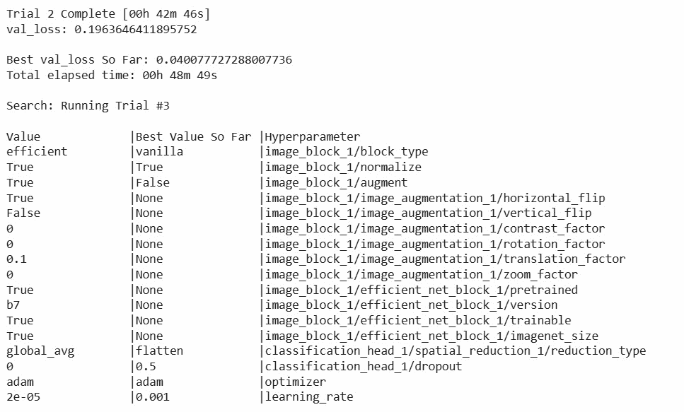
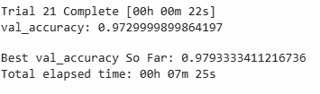
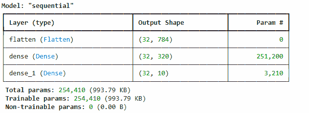
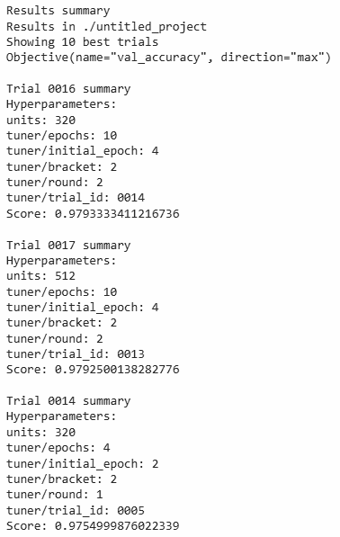

# 自动化深度学习：AutoKeras 和 Keras Tuner 的温和介绍

> 原文：[`towardsdatascience.com/automating-deep-learning-a-gentle-introduction-to-autokeras-and-keras-tuner/`](https://towardsdatascience.com/automating-deep-learning-a-gentle-introduction-to-autokeras-and-keras-tuner/)

深度学习已经彻底改变了机器学习。但设计正确的神经网络——层、神经元、激活函数、优化器——可能感觉像是一场无休止的实验。如果有人为你做这些繁重的工作，那岂不是很好？

这正是深度学习自动化机器学习（AutoML）旨在解决的问题。

在这篇文章中，我将向你介绍两个用于自动化深度学习的强大且易于使用的工具：AutoKeras 和 Keras Tuner。我们将深入探讨这些库，并进行一些动手模型构建。

## 为什么自动化深度学习？

深度学习模型设计和超参数调整是资源密集型的。很容易：

+   使用过多的参数导致过拟合。

+   浪费时间手动测试架构。

+   错过更好的配置。

自动化机器学习工具通过自动化架构搜索和调整来减少许多猜测工作。

## 这些库是如何工作的？

### AutoKeras

AutoKeras 在幕后利用了神经架构搜索（NAS）技术。它使用 Keras Tuner 背后的试错方法来测试不同的配置。一旦找到一个好的候选模型，它就会对其进行训练直到收敛并评估。

### Keras Tuner

Keras Tuner 专注于超参数优化。你定义搜索空间（例如，层数、单元数、学习率），然后它使用优化算法（随机搜索、贝叶斯优化、Hyperband）来找到最佳配置。

## 安装所需库

安装这些库相当简单；我们只需要使用 pip。我们可以在 Jupyter 笔记本中运行以下命令来安装这两个库。

```py
pip install autokeras
pip install keras-tuner
```

## AutoKeras：端到端自动深度学习

AutoKeras 是一个建立在 TensorFlow 和 Keras 之上的高级库。它自动化：

+   神经架构搜索（NAS）

+   超参数调整

+   模型训练

只需几行代码，你就可以训练用于图像、文本、表格和时间序列数据的深度学习模型。

### 创建模型

对于这篇文章，我们将专注于图像分类。我们将使用 Tensorflow Datasets 加载 MNIST 数据集。这个数据集在 Tensorflow 上是免费可用的，你可以在这里查看[它](https://www.tensorflow.org/datasets/catalog/overview#all_datasets)，然后我们将使用 AutoKeras 的 ImageClassifier。

```py
import autokeras as ak
from tensorflow.keras.datasets import mnist

(x_train, y_train), (x_test, y_test) = mnist.load_data()

clf = ak.ImageClassifier(max_trials=3)  # Try 3 different models
clf.fit(x_train, y_train, epochs=10)

accuracy = clf.evaluate(x_test, y_test)
print("Test accuracy:", accuracy)
```



我们可以在输出屏幕截图中看到，试验 2 花费了 42 分钟，它将继续进行到 3 次试验，然后显示具有参数的最佳模型。

## Keras Tuner：灵活的超参数优化

由 TensorFlow 团队开发的 Keras Tuner 是一个超参数优化库。与 AutoKeras 不同，它不是从头开始设计架构——相反，它调整你定义的架构的超参数。

### 创建模型

与 Auto Keras 不同，在这里我们不得不创建整个模型。我们将使用相同的 Mnist 图像数据集并创建一个 CNN 图像分类器模型。

```py
import tensorflow as tf
import keras_tuner as kt

(x_train, y_train), (x_test, y_test) = tf.keras.datasets.mnist.load_data()
x_train, x_test = x_train / 255.0, x_test / 255.0

def build_model(hp):
    model = tf.keras.Sequential()
    model.add(tf.keras.layers.Flatten())
    model.add(tf.keras.layers.Dense(hp.Int('units', 32, 512, step=32), activation='relu'))
    model.add(tf.keras.layers.Dense(10, activation='softmax'))
    model.compile(optimizer='adam',
                  loss='sparse_categorical_crossentropy',
                  metrics=['accuracy'])
    return model

tuner = kt.Hyperband(build_model, objective='val_accuracy', max_epochs=10)
tuner.search(x_train, y_train, epochs=10, validation_split=0.2)
```



因此，在输出中，我们可以清楚地看到试验 21 在 22 秒内完成，验证准确率约为 97.29%，并且模型也保持了最佳准确率，约为 97.93%。

要找出最佳模型，我们可以运行以下命令。

```py
models = tuner.get_best_models(num_models=2)
best_model = models[0]
best_model.summary()
```



我们也可以使用以下命令找出 Keras Tuner 执行的 Top 10 试验。

```py
tuner.results_summary()
```



## 真实世界的应用案例

我们如何使用这两个库的一个优秀例子是一家电信公司，它希望通过结构化客户数据预测客户流失。他们的数据科学团队使用 AutoKeras 快速在表格特征上训练模型，而无需编写复杂的架构代码。后来，他们使用 Keras Tuner 微调一个包含领域知识特征的定制神经网络。这种混合方法节省了数周的时间，并提高了模型性能。

## 结论

AutoKeras 和 Keras Tuner 都使深度学习更加易于访问和高效。

当你想快速构建端到端模型而不必担心架构时，请使用 AutoKeras。当你已经对架构有很好的了解，但想通过超参数调整来榨取最佳性能时，请使用 Keras Tuner。

自动化深度学习的部分工作可以让你有更多时间专注于理解你的数据并解读结果，这正是真正的价值所在。
