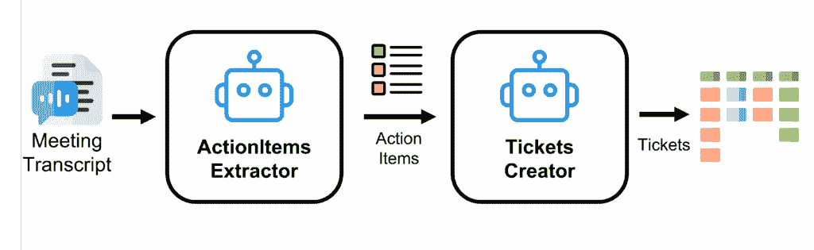
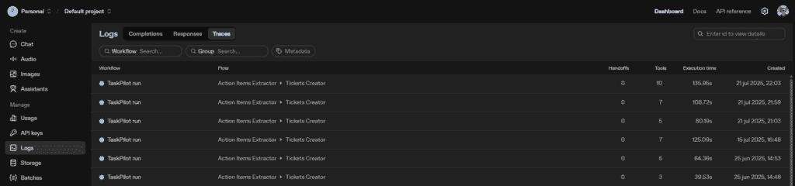
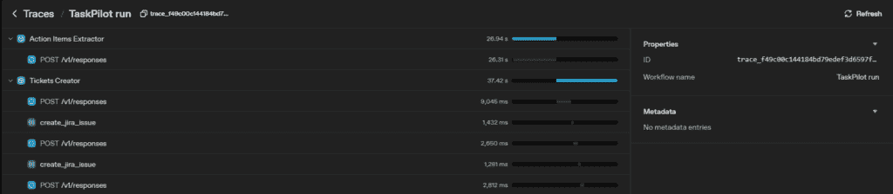
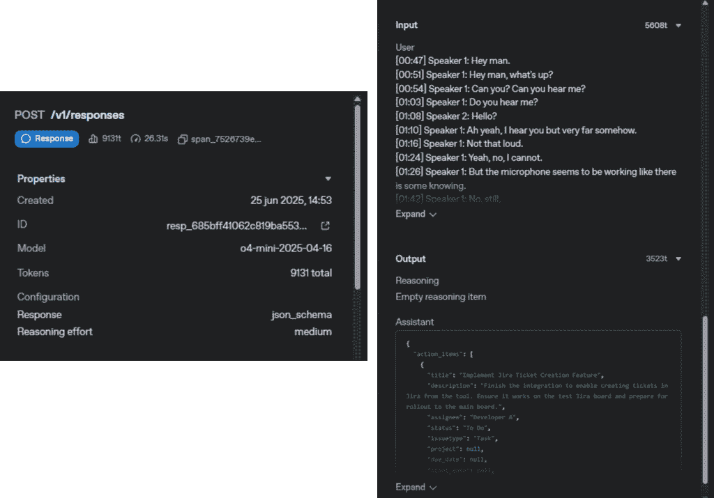

# 使用 OpenAI 代理 SDK 自动创建 Jira 问题的步骤指南：自动化 Jira 问题的创建

> 原文：[`towardsdatascience.com/automating-ticket-creation-in-jira-with-the-openai-agents-sdk-a-step-by-step-guide/`](https://towardsdatascience.com/automating-ticket-creation-in-jira-with-the-openai-agents-sdk-a-step-by-step-guide/)

如果在会议结束后，你已经在项目管理工具中有了所有讨论的项目，会怎样？在会议期间无需写下任何东西，也不必手动创建相应的票证！这正是这个短期实验项目的想法。

在本步骤指南中，我们将使用 [OpenAI 的代理 SDK](https://openai.github.io/openai-agents-python/) 创建名为“TaskPilot”的 Python 应用程序，以自动根据会议记录创建 Jira 问题。

### 挑战：从对话到可执行任务

根据会议记录，自动在 Jira 项目中创建问题，并对应于会议中讨论的内容。

### 解决方案：使用 OpenAI 代理自动化

使用 [**OpenAI 代理 SDK**](https://openai.github.io/openai-agents-python/)，我们将实现一个代理工作流程，**：**

1.  *接收并读取会议记录****.***

1.  *使用 AI 代理从对话中提取行动项。*

1.  *使用另一个 AI 代理根据那些行动项创建 Jira 问题。*



代理流程：图像由作者创建

* * *

## OpenAI 代理 SDK

[OpenAI 代理 SDK](https://openai.github.io/openai-agents-python/) 是一个 Python 库，可以编程创建 AI 代理，它们可以与工具交互、使用 MCP 服务器或将任务委托给其他代理。

SDK 的一些关键特性如下：

+   **代理循环**：一个内置的代理循环，处理与 LLM 的来回通信，直到代理完成其任务。

+   **功能工具**：将任何 Python 函数转换为工具，具有自动模式生成和 Pydantic 驱动的验证。

+   **MCP 支持**：允许代理使用 MCP 服务器扩展其与外部世界交互的能力。

+   **任务委托**：允许代理根据其专长/角色将任务委托给其他代理。

+   **安全网**：验证代理的输入和输出。如果代理收到无效输入，则提前终止执行。

+   **会话管理**：自动管理对话历史。确保代理拥有执行任务所需的上下文。

+   **跟踪**：提供跟踪上下文管理器，允许可视化代理的整个执行流程，使其易于调试和理解底层发生的事情。

现在，让我们深入了解实现过程！

* * *

## 实现

我们将按照以下 8 个简单步骤实现我们的项目：

1.  设置项目结构

1.  TaskPilot 运行器

1.  定义我们的数据模型

1.  创建代理

1.  提供工具

1.  配置应用程序

1.  在 `main.py` 中整合一切

1.  在 OpenAI 开发平台中监控我们的运行

让我们动手实践吧！

### 第 1 步：设置项目结构

首先，让我们创建我们项目的基本结构：

+   `taskpilot` 目录：将包含我们的主要应用程序逻辑。

+   `local_agents` 目录：将包含我们将在本项目中使用代理的定义（`local_agents`以避免与 OpenAI 库 `agents` 发生冲突）。

+   `utils` 目录：用于辅助函数、配置解析器和数据模型。

```py
taskpilot_repo/
├── config.yml
├── .env
├── README.md
├── taskpilot/
│   ├── main.py
│   ├── taskpilot_runner.py
│   ├── local_agents/
│   │   ├── __init__.py
│   │   ├── action_items_extractor.py
│   │   └── tickets_creator.py
│   └── utils/
│       ├── __init__.py
│       ├── agents_tools.py
│       ├── config_parser.py
│       ├── jira_interface_functions.py
│       └── models.py
```

### 第 2 步：TaskPilotRunner

`taskpilot/taskpilot_runner.py` 中的 `TaskPilotRunner` 类将是我们的应用程序的核心。它将协调整个工作流程，从会议记录中提取行动项，然后从行动项中创建 Jira 票据。同时，它将激活代理 SDK 内置的跟踪，以收集代理运行期间的事件记录，这有助于调试和监控代理工作流程。

让我们从实现开始：

+   在 `__init__()` 方法中，我们将创建用于此工作流程的两个代理。

+   `run()` 方法将是 `TaskPilotRunner` 类中最重要的方法，它将接收会议记录并将其传递给代理以创建 Jira 问题。代理将在一个 **跟踪上下文管理器** 中启动和运行，即 `with trace("TaskPilot run", trace_id):`。来自代理 SDK 的跟踪代表一个“工作流程”的单个端到端操作。

+   `_extract_action_items()` 和 `_create_tickets()` 方法将分别启动和运行每个代理。在这些方法中，将使用 OpenAI 代理 SDK 的 `Runner.run()` 方法来触发代理。该方法接受一个代理和一个输入，并返回代理执行的最终输出。最后，每个代理的结果将被解析为其定义的输出类型。

```py
# taskpilot/taskpilot_runner.py

from agents import Runner, trace, gen_trace_id
from local_agents import create_action_items_agent, create_tickets_creator_agent
from utils.models import ActionItemsList, CreateIssuesResponse

class TaskPilotRunner:
    def __init__(self):
        self.action_items_extractor = create_action_items_agent()
        self.tickets_creator = create_tickets_creator_agent()

    async def run(self, meeting_transcript: str) -> None:
        trace_id = gen_trace_id()
        print(f"Starting TaskPilot run... (Trace ID: {trace_id})")
        print(
            f"View trace: https://platform.openai.com/traces/trace?trace_id={trace_id}"
        )

        with trace("TaskPilot run", trace_id=trace_id):
            # 1\. Extract action items from meeting transcript
            action_items = await self._extract_action_items(meeting_transcript)

            # 2\. Create tickets from action items
            tickets_creation_response = await self._create_tickets(action_items)

            # 3\. Return the results
            print(tickets_creation_response.text)

    async def _extract_action_items(self, meeting_transcript: str) -> ActionItemsList:
        result = await Runner.run(
            self.action_items_extractor, input=meeting_transcript
        )
        final_output = result.final_output_as(ActionItemsList)
        return final_output

    async def _create_tickets(self, action_items: ActionItemsList) -> CreateIssuesResponse:
        result = await Runner.run(
            self.tickets_creator, input=str(action_items)
        )
        final_output = result.final_output_as(CreateIssuesResponse)
        return final_output
```

*这三个方法被定义为* ***异步函数****。这样做的原因是，来自 OpenAI 代理 SDK 的 `Runner.run()` 方法本身被定义为 `async` 协程。这允许多个代理、工具调用或流端点** ***并行运行而不阻塞****。*

### 第 3 步：定义我们的数据模型

没有特定配置的情况下，代理将以 `str` 作为输出返回文本。为了确保我们的代理提供结构化和可预测的响应，库支持使用 [Pydantic](https://docs.pydantic.dev/latest/) 模型来定义代理的 `output_type`（[它实际上支持任何可以包裹在 Pydantic TypeAdapter 中的类型——dataclasses、列表、TypedDict 等](https://openai.github.io/openai-agents-python/agents/#output-types)）。我们定义的数据模型将是代理将与之交互的数据结构。

对于我们的用例，我们将在 `taskpilot/utils/models.py` 中定义三个模型：

+   **`ActionItem`**：此模型代表从会议记录中提取的单个行动项。

+   **`ActionItemsList`**：此模型是`ActionItem`对象的列表。

+   **`CreateIssuesResponse`**：此模型定义了代理创建问题/工单的响应结构。

```py
# taskpilot/utils/models.py

from typing import Optional
from pydantic import BaseModel

class ActionItem(BaseModel):
    title: str
    description: str
    assignee: str
    status: str
    issuetype: str
    project: Optional[str] = None
    due_date: Optional[str] = None
    start_date: Optional[str] = None
    priority: Optional[str] = None
    parent: Optional[str] = None
    children: Optional[list[str]] = None

class ActionItemsList(BaseModel):
    action_items: list[ActionItem]

class CreateIssuesResponse(BaseModel):
    action_items: list[ActionItem]
    error_messages: list[str]
    success_messages: list[str]
    text: str
```

### 第 4 步：创建代理

代理是应用程序的核心。代理基本上是一个配置了指令（`AGENT_PROMPT`）并有权访问工具以在定义的任务上自主行动的 LLM。OpenAI 代理 SDK 中的代理由以下参数定义：

+   **`name`**：用于识别代理的名称。

+   **`instructions`**：告知代理其角色或应执行的任务的提示（也称为系统提示）。

+   **`model`**：用于代理的 LLM。SDK 为 OpenAI 模型提供开箱即用的支持，但是您也可以使用非 OpenAI 模型（见 [Agents SDK：模型](https://openai.github.io/openai-agents-python/models/)）。

+   **`output_type`**：代理应返回的 Python 对象，如前所述。

+   **`tools`**：一个 Python 可调用列表，这些将作为代理可以使用的工具来执行其任务。

基于这些信息，让我们创建我们的两个代理：**`ActionItemsExtractor`** 和 **`TicketsCreator`**。

#### 行动项提取器

此代理的任务是读取会议记录并提取行动项。我们将在`taskpilot/local_agents/action_items_extractor.py`中创建它。

```py
# taskpilot/local_agents/action_items_extractor.py

from agents import Agent
from utils.config_parser import Config
from utils.models import ActionItemsList

AGENT_PROMPT = """
Your are an assistant to extract action items from a meeting transcript.

You will be given a meeting transcript and you need to extract the action items so that they can be converted into tickets by another assistant.

The action items should contain the following information:
    - title: The title of the action item. It should be a short description of the action item. It should be short and concise. This is mandatory.
    - description: The description of the action item. It should be a more extended description of the action item. This is mandatory.
    - assignee: The name of the person who will be responsible for the action item. You shall infer from the conversation the name of the assignee and not use "Speaker 1" or "Speaker 2" or any other speaker identifier. This is mandatory.
    - status: The status of the action item. It can be "To Do", "In Progress", "In Review" or "Done". You shall extract from the transcript in which state the action item is. If it is a new action item, you shall set it to "To Do".
    - due_date: The due date of the action item. It shall be in the format "YYYY-MM-DD".  You shall extract this from the transcript, however if it is not explicitly mentioned, you shall set it to None. If relative dates are mentioned (eg. by tomorrow, in a week,...), you shall convert them to absolute dates in the format "YYYY-MM-DD".
    - start_date: The start date of the action item. It shall be in the format "YYYY-MM-DD". You shall extract this from the transcript, however if it is not explicitly mentioned, you shall set it to None.
    - priority: The priority of the action item. It can be "Lowest", "Low", "Medium", "High" or "Highest". You shall interpret the priority of the action item from the transcript, however if it is not clear, you shall set it to None.
    - issuetype: The type of the action item. It can be "Epic", "Bug", "Task", "Story", "Subtask". You shall interpret the issuetype of the action item from the transcript, if it is unclear set it to "Task".
    - project: The project to which the action item belongs. You shall interpret the project of the action item from the transcript, however if it is not clear, you shall set it to None.
    - parent: If the action item is a subtask, you shall set the parent of the action item to the title of the parent action item. If the parent action item is not clear or the action item is not a subtask, you shall set it to None.
    - children: If the action item is a parent task, you shall set the children of the action item to the titles of the child action items. If the children action items are not clear or the action item is not a parent task, you shall set it to None.
"""

def create_action_items_agent() -> Agent:
    return Agent(
        name="Action Items Extractor",
        instructions=AGENT_PROMPT,
        output_type=ActionItemsList,
        model=Config.get().agents.model,
    )
```

如您所见，在`AGENT_PROMPT`中，我们详细告知代理其任务是提取行动项，并详细说明我们希望如何提取行动项。

#### 票据创建器

此代理接受行动项列表并创建 Jira 工单。我们将在`taskpilot/local_agents/tickets_creator.py`中创建它。

```py
# taskpilot/local_agents/tickets_creator.py

from agents import Agent
from utils.config_parser import Config
from utils.agents_tools import create_jira_issue
from utils.models import CreateIssuesResponse

AGENT_PROMPT = """
You are an assistant that creates Jira issues given action items.

You will be given a list of action items and for each action item you shall create a Jira issue using the `create_jira_issue` tool.

You shall collect the responses of the `create_jira_issue` tool and return them as the provided type `CreateIssuesResponse` which contains:
    - action_items: list containing the action_items that were provided to you
    - error_messages: list containing the error messages returned by the `create_jira_issue` tool whenever there was an error trying to create the issue.
    - success_messages: list containing the response messages returned by the `create_jira_issue` tool whenever the issue creation was successful.
    - text: A text that summarizes the result of the tickets creation. It shall be a string created as following: 
        f"From the {len(action_items)} action items provided {len(success_messages)} were successfully created in the Jira project.\n {len(error_messages)} failed to be created in the Jira project.\n\nError messages:\n{error_messages}"
"""

def create_tickets_creator_agent() -> Agent:
    return Agent(
        name="Tickets Creator",
        instructions=AGENT_PROMPT,
        tools=[create_jira_issue],
        model=Config.get().agents.model,
        output_type=CreateIssuesResponse
    )
```

在这里，我们设置`tools`参数，并给代理提供`create_jira_issue`工具，我们将在下一步创建它。

### 第 5 步：提供工具

代理最强大的功能之一是它们使用工具与外部世界交互的能力。有人可能会说，工具的使用是将与 LLM 的交互转变为代理的关键。OpenAI 代理 SDK 允许代理使用三种类型的工具：

+   **托管工具**：直接由 OpenAI 提供，如搜索网络或文件、计算机使用、运行代码等。

+   **函数调用**：使用任何 Python 函数作为工具。

+   **代理作为工具**：允许代理调用其他代理而无需移交。

对于我们的用例，我们将使用函数调用并实现一个使用[Jira 的 REST API](https://developer.atlassian.com/cloud/jira/platform/rest/v3/)创建 Jira 工单的函数。根据个人选择，我决定将其分为两个文件：

+   在`taskpilot/utils/jira_interface_functions.py`中，我们将编写通过 HTTP 请求与 Jira REST API 交互的函数。

+   在 `taskpilot/utils/agents_tools.py` 中，我们将编写要提供给代理的函数的包装器。这些包装函数具有额外的响应解析，以便为代理提供一个处理过的文本响应而不是 JSON。尽管如此，代理也应该能够处理和理解 JSON 作为响应。

首先，我们在 `taskpilot/utils/jira_interface_functions.py` 中实现 `create_issue()` 函数：

```py
# taskpilot/utils/jira_interface_functions.py

import os
from typing import Optional
import json
from urllib.parse import urljoin
import requests
from requests.auth import HTTPBasicAuth
from utils.config_parser import Config

JIRA_AUTH = HTTPBasicAuth(Config.get().jira.user, str(os.getenv("ATLASSIAN_API_KEY")))

def create_issue(
    project_key: str,
    title: str,
    description: str,
    issuetype: str,
    duedate: Optional[str] = None,
    assignee_id: Optional[str] = None,
    labels: Optional[list[str]] = None,
    priority_id: Optional[str] = None,
    reporter_id: Optional[str] = None,
) -> requests.Response:

    payload = {
        "fields": {
            "project": {"key": project_key},
            "summary": title,
            "issuetype": {"name": issuetype},
            "description": {
                "content": [
                    {
                        "content": [
                            {
                                "text": description,
                                "type": "text",
                            }
                        ],
                        "type": "paragraph",
                    }
                ],
                "type": "doc",
                "version": 1,
            },
        }
    }

    if duedate:
        payload["fields"].update({"duedate": duedate})
    if assignee_id:
        payload["fields"].update({"assignee": {"id": assignee_id}})
    if labels:
        payload["fields"].update({"labels": labels})
    if priority_id:
        payload["fields"].update({"priority": {"id": priority_id}})
    if reporter_id:
        payload["fields"].update({"reporter": {"id": reporter_id}})

    endpoint_url = urljoin(Config.get().jira.url_rest_api, "issue")

    headers = {"Accept": "application/json", "Content-Type": "application/json"}

    response = requests.post(
        endpoint_url,
        data=json.dumps(payload),
        headers=headers,
        auth=JIRA_AUTH,
        timeout=Config.get().jira.request_timeout,
    )
    return response
```

如您所见，我们需要使用我们的 Jira 用户和相应的 `API_KEY`（我们可以在 [Atlassian 账户管理](https://id.atlassian.com/manage-profile/security/api-tokens) 上获取）来验证我们的 Jira 账户。

在 `taskpilot/utils/agents_tools.py` 文件中，我们实现了 `create_jira_issue()` 函数，该函数将被提供给 `TicketsCreator` 代理：

```py
# taskpilot/utils/agents_tools.py

from agents import function_tool
from utils.models import ActionItem
from utils.jira_interface_functions import create_issue

@function_tool
def create_jira_issue(action_item: ActionItem) -> str:

    response = create_issue(
        project_key=action_item.project,
        title=action_item.title,
        description=action_item.description,
        issuetype=action_item.issuetype,
        duedate=action_item.due_date,
        assignee_id=None,
        labels=None,
        priority_id=None,
        reporter_id=None,
    )

    if response.ok:
        return f"Successfully created the issue. Response message: {response.text}"
    else:
        return f"There was an error trying to create the issue. Error message: {response.text}"
```

**非常重要**：**`@function_tool`** 装饰器使得这个函数可以被我们的代理使用。现在代理可以调用这个函数并传递一个 `ActionItem` 对象。然后该函数使用 `create_issue` 函数，该函数通过访问 Jira API 来创建一个新的问题。

### 第 6 步：配置应用程序

为了使我们的应用程序可参数化，我们将使用 **`config.yml`** 文件进行配置设置，以及用于 API 密钥的 **`.env`** 文件。

应用程序的配置被分开：

+   **`agents`**: 用于配置代理和对 OpenAI API 的访问。这里有两个参数：`model`，这是代理将使用的 LLM，以及 `.env` 文件中的 `OPENAI_API_KEY`，用于验证对 OpenAI API 的使用。您可以在您的 [OpenAI 开发平台](https://platform.openai.com/settings/organization/api-keys) 上获取 OpenAI API 密钥。

+   **`jira`**: 用于配置对 Jira API 的访问。这里需要四个参数：`url_rest_api`，这是我们 Jira 实例的 REST API 的 URL；`user`，这是我们用于访问 Jira 的用户；`request_timeout`，这是在放弃之前等待服务器发送数据的超时时间（以秒为单位），最后是 `.env` 文件中的 `ATLASSIAN_API_KEY`，用于验证对 Jira 实例的访问。

下面是我们的 `.env` 文件，在下一步中，它将通过 `main.py` 中的 `python-dotenv` 库（[`pypi.org/project/python-dotenv/`](https://pypi.org/project/python-dotenv/)）被加载到我们的应用程序中：

```py
OPENAI_API_KEY=some-api-key
ATLASSIAN_API_KEY=some-api-key
```

下面是我们的 `config.yml` 文件：

```py
# config.yml

agents:
  model: "o4-mini"
jira:
  url_rest_api: "https://your-domain.atlassian.net/rest/api/3/"
  user: "[[email protected]](/cdn-cgi/l/email-protection)"
  request_timeout: 5
```

我们还将在 `taskpilot/utils/config_parser.py` 中创建一个配置解析器来加载这个配置。为此，我们实现了 `Config` 类作为单例（这意味着在整个应用程序生命周期中只能有一个此类实例）。

```py
# taskpilot/utils/config_parser.py

from pathlib import Path
import yaml
from pydantic import BaseModel

class AgentsConfig(BaseModel):

    model: str

class JiraConfig(BaseModel):

    url_rest_api: str
    user: str
    request_timeout: int

class ConfigModel(BaseModel):

    agents: AgentsConfig
    jira: JiraConfig

class Config:

    _instance: ConfigModel | None = None

    @classmethod
    def load(cls, path: str = "config.yml") -> None:
        if cls._instance is None:
            with open(Path(path), "r", encoding="utf-8") as config_file:
                raw_config = yaml.safe_load(config_file)
            cls._instance = ConfigModel(**raw_config)

    @classmethod
    def get(cls, path: str = "config.yml") -> ConfigModel:
        if cls._instance is None:
            cls.load(path)
        return cls._instance
```

### 第 7 步：在 `main.py` 中整合所有内容

最后，在 `taskpilot/main.py` 中，我们将把所有这些整合在一起。这个脚本将加载会议记录，创建 `TaskPilotRunner` 的实例，然后调用 `run()` 方法。

```py
# taskpilot/main.py

import os
import asyncio
from dotenv import load_dotenv

from taskpilot_runner import TaskPilotRunner

# Load the variables in the .env file
load_dotenv()

def load_meeting_transcript_txt(file_path: str) -> str:
    # ...
    return meeting_transcript

async def main():
    print("TaskPilot application starting...")

    meeting_transcript = load_meeting_transcript_txt("meeting_transcript.txt")

    await TaskPilotRunner().run(meeting_transcript)

if __name__ == "__main__":
    asyncio.run(main())
```

### 第 8 步：在 OpenAI 开发平台中监控我们的运行

正如之前提到的，OpenAI Agents SDK 的一个优点是，由于其跟踪功能，我们可以可视化我们代理的整个执行流程。这使得调试和理解在[OpenAI 开发平台](https://platform.openai.com/)底层的操作变得容易。

在[跟踪仪表板](https://platform.openai.com/traces)中，你可以：

+   跟踪代理工作流程的每一次运行。



作者截图

+   精确了解代理在代理工作流程中做了什么，并监控性能。



作者截图

+   调试对 OpenAI API 的每一次调用，以及监控每个输入和输出中使用的令牌数量。



作者截图

因此，利用这个功能来评估、调试和监控你的代理运行。

## 结论

就这么简单！在这八个简单步骤中，我们实现了一个可以自动从会议记录中创建 Jira 问题的应用。感谢 OpenAI Agents SDK 的简单界面，你可以轻松编程创建代理来帮助你自动化任务！

随意克隆这个仓库（本帖中描述的项目位于`function_calling`分支），亲自尝试一下，并开始构建你自己的 AI 驱动应用！

> [GitHub – juancarlos2701/TaskPilot](https://github.com/juancarlos2701/TaskPilot)

* * *

### 💡 接下来：

在即将到来的帖子中，我们将深入探讨**如何实现自己的 MCP 服务器**，以进一步扩展我们代理的功能，并允许它们与外部系统交互，而不仅仅是本地工具。敬请期待！

#### 🙋‍♂️ 让我们连接

如果你有问题、反馈，或者只是想跟随未来的项目：

+   🔗 [LinkedIn](https://www.linkedin.com/in/juan-carlos-suarez/)

+   🐦 [X](https://x.com/juancarlos_2701)

+   💻 [GitHub](https://github.com/juancarlos2701)

* * *

#### 参考

这篇文章灵感来源于*“OpenAI: Agents SDK”*课程，来自*LinkedInLearning*。
