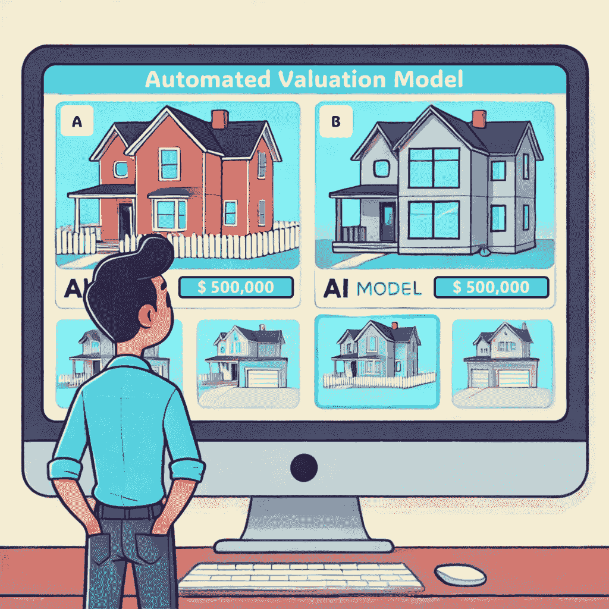
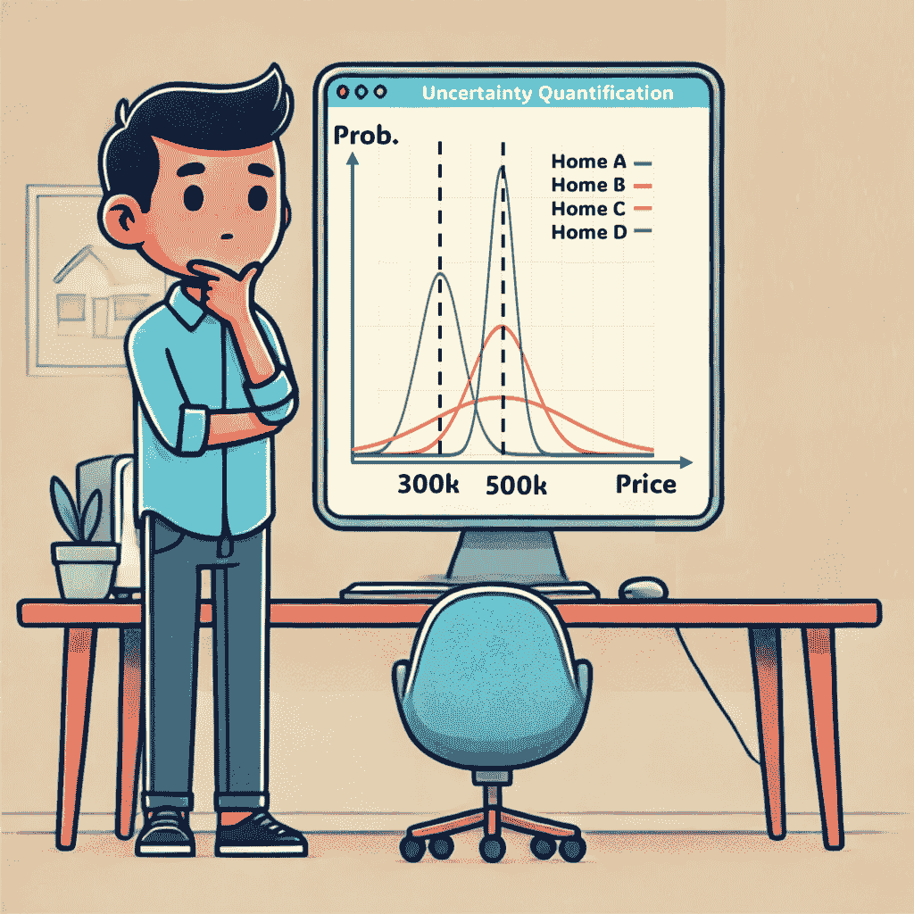

# 使用算法房屋估值的不确定性量化避免高昂的错误

> 原文：[`towardsdatascience.com/avoiding-costly-mistakes-with-uncertainty-quantification-for-algorithmic-home-valuations/`](https://towardsdatascience.com/avoiding-costly-mistakes-with-uncertainty-quantification-for-algorithmic-home-valuations/)

<mdspan datatext="el1744072612477" class="mdspan-comment">当你即将购买</mdspan>房屋时，无论你是寻找梦想之家的普通买家，还是经验丰富的房地产投资者，你很可能已经遇到了自动化估值模型，或称 AVM。这些聪明的工具使用包含大量过去房地产交易的庞大数据集来预测你潜在新房屋的价值。通过考虑位置、卧室数量、浴室数量、房屋年龄等特征，AVM 使用 AI 来学习与销售价格的相关性。任何房屋的快速低成本评估听起来很棒，而且在许多情况下确实如此。然而，每个价格预测都伴随着一定的不确定性，未能考虑这种不确定性可能会犯下代价高昂的错误。在这篇文章中，我通过 AVMU 方法说明了 AI 不确定性量化在 AVM 中的应用。

## **价格预测的不确定性？**

让我们从简单开始。想象一下，你正在寻找弗吉尼亚海滩，VA 一个舒适社区的两层四居室房屋。你已经下载了一些当地住房数据，并使用它来训练你自己的 AVM（你就像这样技术娴熟！）。

**案例 1**：幸运的是，在过去一年中，该社区有几套几乎完全相同的房屋以约 50 万美元的价格出售。你的 AVM 自信地建议你感兴趣的房屋也可能会值大约同样的价格。这很简单，对吧？

但这里事情变得复杂了：

**案例 2**：这次，近期没有类似的两层四居室房屋出售。相反，你的数据集显示较小的单层房屋售价为 40 万美元，而较大的三层房屋售价为 60 万美元。你的 AVM 平均了这些数据，再次建议售价为 50 万美元。这很有道理，你的目标房屋比便宜的房子大，比贵的房子小。

这两种情况都给出了相同的 50 万美元估值。然而，有一个陷阱：第一种情况有可靠的数据支持（近期有类似房屋出售），这使得价格预测非常可靠。另一方面，在第二种情况下，信任价格预测可能有点风险。由于可比销售较少，AVM 不得不“做出有根据的猜测”，导致价格预测的不确定性较低。

案例一中的稳固 AVM 是购买房屋的一个非常有帮助的决策支持工具，但案例二中的动摇 AVM 可能会给你一个关于房屋市场价值的完全错误的概念。这里有一个大问题：

> *你如何判断你的 AVM 预测是稳固的还是动摇的？*

## **AVMU——AVM 的不确定性量化技术**

这正是我们需要 AVMU，或自动估值模型不确定性的原因。AVMU 是一种最近的方法论框架，帮助我们量化这些 AVM 预测的可靠性（或不确定性）。把它想象成你房屋价格预测的信心计，帮助你做出更明智的决定，而不是盲目地信任算法。

让我们回到弗吉尼亚海滩的例子。你已经广泛浏览了房源列表，并将选择缩小到两套绝佳的房屋：让我们称它们为 A 家和 B 家。

图片由作者提供，部分使用 DALL-E 制作。

当然，你首先想知道的是它们的市场价值。了解市场价值可以确保你不至于过度支付，可能帮助你避免未来的财务头痛，并不得不以亏损的价格重新出售房屋。不幸的是，你对弗吉尼亚海滩的房价知之甚少，因为你最初来自[*插入你长大的地方的名字*]。幸运的是，你回想起在研究生院学到的数据科学技能，并自信地决定构建自己的 AVM，以了解你两个候选房屋的市场价值。

为了确保你的 AVM 预测尽可能准确，你使用均方误差（MSE）作为损失函数来训练模型：

\[均方误差(MSE) = \frac{1}{n} \sum_{i=1}^{n} (y_i – \hat{y}_i)²\]

在这里，\( n \) 是你的训练数据集中房屋的数量，\( \hat{y}_i \) 代表 AVM 对房屋 \( i \) 的价格预测，而 \( y_i \) 是房屋 \( i \) 实际的销售价格。

图片由作者提供，部分使用 DALL-E 制作。

训练好模型后，你急切地将 AVM 应用于 A 家和 B 家。令你惊讶（或许兴奋？）的是，算法将这两套房屋的估值都定为 50 万美元。很好，但就在你准备对 B 家提出报价时，一个想法闪过：这些预测并不是绝对的确定性。它们是“点预测”，本质上就是 AVM 对最可能市场价值的最佳猜测。事实上，真实的市场价值可能略高或略低，而且 AVM 预测将市场价值精确到美元的可能性相当低。

那么，我们如何衡量这种不确定性？这正是 AVMU 方法论发挥作用的地方，它采用了一种简单但强大的方法：

1.  首先，你使用交叉验证（例如，5 折交叉验证）为数据集中的所有 \( n \) 套房屋生成出折叠价格预测，\( \hat{y}_i \)。

1.  接下来，对于每一套房屋，你计算预测价格与实际销售价格之间的差距。这个差距被称为价格预测，\( \hat{y}_i \)，与实际销售价格，\( y_i \)之间的绝对偏差，\( |\hat{y}_i – y_i| \)。

1.  然后，你不再预测销售价格，而是使用这些绝对偏差 \( |\hat{y}_i – y_i| \) 作为目标，训练一个单独的“不确定性模型” \( F(\hat{y}_i, x_i) \)。这个特殊模型学习到 AVM 预测通常准确或不确定的模式。

1.  最后，你应用这个不确定性模型来估计 Home A 和 B（即你的测试集）的价格预测的不确定性，通过预测它们的绝对价格偏差。现在，你对这两栋房子的不确定性估计变得简单明了。

现在，我确切地知道你们中的一些人可能对第三步有什么想法：

> *“等等，你不能简单地在另一个回归模型上再套一个回归模型来解释为什么第一个模型不准确！”*

你绝对是对的。好吧，差不多吧。如果存在清晰、可预测的数据模式表明某些房屋的价格持续被你的 AVM 高估或低估，这意味着你的 AVM 一开始就不太理想。理想情况下，一个好的 AVM 应该捕捉到数据中的所有有意义模式。但这里有一个巧妙的转折：我们不是预测房屋是否被特别高估或低估（我们称之为有符号偏差），而是关注绝对偏差。通过这样做，我们避开了解释房屋估值过高或过低的问题。相反，我们让不确定性模型专注于识别 AVM 倾向于准确预测的房屋类型和它难以预测的房屋类型，无论误差的方向如何。

从购房者的角度来看，你自然会担心支付过高的价格。想象一下，你以 50 万美元的价格购买了一栋房子，却发现它实际上只值 40 万美元！但在实践中，低估房子的价值比你想象的更成问题。如果你出价过低，你可能会失去你的梦想家园给另一位买家。这就是为什么，作为一个拥有 AVM 预测的精明买家，你的目标不仅仅是追逐最高或最低的价格预测。相反，你的首要任务应该是稳健、可靠的估值，这些估值应与真实市场价值紧密匹配。多亏了 AVMU 不确定性估计，你现在可以更有信心地确定哪些预测可以信赖。

从数学上讲，上述过程可以写成如下形式：

\[|\hat{y}_i – y_i| = F(\hat{y}_i, x_i) + \varepsilon_i \quad \text{for } 1 \leq i \leq n\]

和：

\[\text{AVMU}_i = F(\hat{y}_i, x_i)\]

不确定性模型 \( F(\hat{y}_i, x_i) \) 可以基于任何回归算法（甚至与你的 AVM 相同的算法）。区别在于，对于你的不确定性模型，你并不一定对实现绝对偏差的完美预测感兴趣。相反，你感兴趣的是根据预测不确定性对房屋进行排名，从而了解在 Home A 和 Home B 的价格预测中，哪些是你最可以信赖的。因此，用于 AVM 的 MSE 损失函数（见第一个方程）可能不是理想的选择。

因此，您不是使用均方误差（MSE），而是将您的不确定性模型 \( F(\hat{y}_i, x_i) \) 配置到优化一个更适合排名的损失函数中。这种损失函数的一个例子是最大化排名相关性（即 Spearman 的 \( \rho \)），其表达式为：

\[\rho = 1 – \frac{6 \sum_{i=1}^{n} D_i²}{n(n² – 1)}\]

在这里，更高的 \( \rho \) 意味着您的模型在预测不确定性方面对房屋的排名更好。\( D_i \) 代表实际绝对偏差 \( |\hat{y}_i – y_i| \) 和预测不确定性 \( \text{AVMU}_i = F(\hat{y}_i, x_i) \) 之间的排名差异，对于房屋 \( i \)。

图片由作者提供，部分使用 DALL-E 制作。

因此，现在您对候选房屋都有了 AVM 价格预测和相应的 AVMU 不确定性估计。通过结合这两个指标，您很快就会注意到一个有趣的现象：即使多个房屋具有相同的“最可能的市场价值”，预测的可靠性也可能有很大的差异。在您的案例中，您看到房屋 B 的 AVMU 不确定性估计显著更高，这表明其实际市场价值可能远远偏离 50 万美元的估值。

为了保护自己免受不必要的风险，您明智地选择了房屋 A，其 AVM 估值为 50 万美元，并得到了更强的确定性支持。得益于 AVMU 的信心恢复，您愉快地完成了购买，知道您已经做出了明智、数据驱动的选择，并在您的新前院里与一杯放松的饮料庆祝您的新家。

图片由作者提供，部分使用 DALL-E 制作。

## **AVMU 的伦理和其他应用**

这篇关于 AVM 价格不确定性和 AVMU 如何指导您购房的简单介绍只是其众多潜在应用之一。房屋并非唯一可能从快速、低成本估值工具中受益的资产。尽管由于数据丰富和特征易于识别，AVM 通常与住房相关联，但这些模型及其通过 AVMU 进行的不确定性量化几乎可以应用于任何具有市场价格的东西。想想二手车、收藏品，甚至是职业足球运动员。只要预测其价格存在不确定性，AVMU 就可以用来理解它。

坚持住房领域，购房决策并非是 AVMU 唯一可能被使用的领域。抵押贷款发放者经常使用 AVM 来估算财产的抵押价值，但往往忽略了这些价格预测的准确性可能存在不均匀性。同样，税务机关可以使用 AVM 来确定您的财产税，但由于未承认的不确定性，可能会意外地设定不公平的估值。通过 AVMU 识别不确定性可以帮助使这些估值在各方面更加公平和准确。

然而，尽管它具有多功能性，但记住 AVMU 并非完美。它仍然是一个依赖于数据质量和数量的统计模型。没有任何模型可以完全消除不确定性，尤其是大多数市场固有的随机方面，有时被称为随机不确定性或不可减少的不确定性。想象一下，一对新婚夫妇对某个厨房一见钟情，促使他们出价远高于典型市场价值。或者，可能是恶劣的天气在看房期间负面影响了对房屋的看法。这样的不可预测的情况总是存在的，而 AVMU 无法解释每一个异常值。

记住，AVMU 给你的是概率，而不是固定的事实。AVMU 的不确定性更高的房屋**更有可能**经历价格偏差，这并不是一个保证。如果你发现自己在想，“*我应该制作第三个模型来预测我的不确定性模型的不确定性吗？*”，可能就是时候接受一些不确定性是不可避免的了。所以，带着你的 AVMU 信息洞察，放松，接受不确定性，享受你的新家吧！

## 参考文献

+   A. J. Pollestad, A. B. Næss 和 A. Oust, 向着自动估值模型中更好的不确定性量化迈进（2024），《房地产金融与经济杂志》。

+   A. J. Pollestad 和 A. Oust, 利用不确定性：房地产投资决策支持的新方法（2025），《定量金融》。
