# Awesome Plotly with Code 系列文章（第七部分）：柱状图中裁剪 y 轴

> 原文：[`towardsdatascience.com/awesome-plotly-with-code-series-part-7-cropping-the-y-axis-in-bar-charts-322fd7c7f792/`](https://towardsdatascience.com/awesome-plotly-with-code-series-part-7-cropping-the-y-axis-in-bar-charts-322fd7c7f792/)


使用 Dall-e 生成的图片

*欢迎来到我的“Plotly with code”系列的第七篇文章！如果你错过了第一篇，你可以在下面的链接中查看，或者浏览我的[“一篇文章统治所有”](https://medium.com/@joparga3/all-my-written-articles-in-one-place-24ccd6689f72)来跟随整个系列或其他我之前写过的主题。*

> [**Awesome Plotly with Code 系列文章（第一部分）：柱状图的替代方案**](https://towardsdatascience.com/awesome-plotly-with-code-series-part-1-alternatives-to-bar-charts-125502587690)

### 我为什么要写这个系列的一个简要概述

我创建可视化图表的首选工具是 Plotly。它非常直观，从叠加轨迹到添加交互性。然而，尽管 Plotly 在功能上表现出色，但它并没有提供“数据新闻”模板，该模板可以直接生成经过抛光的图表。

> 正是这一系列文章的用意所在——我将分享如何将 Plotly 的图表转换为时尚、专业级别的图表，这些图表符合数据新闻标准。

*PS：除非另有说明，所有图片均由我本人创作。*

## 简介 – 半句真话就是整个谎言。

我不知道你是否曾经[见过福克斯新闻的柱状图修剪“丑闻”](https://imgur.com/gallery/fox-news-is-great-math-3zmMKat)。福克斯决定调整 y 轴，以使其看起来奥巴马医改随着时间的推移获得了大量的支持（不言而喻，时间类别应该是一条线图，但这超出了本文的范围）。通过打破“始终从零开始”的“最佳实践”规则，该图表通过“半真话”来定制故事。

为了明确起见，这不仅仅是一个政治声明，这是一个关于不良可视化实践声明的。

为什么裁剪 y 轴是一种不良做法？当 y 轴被裁剪时，观众会失去对数据的上下文。例如，裁剪可能会使人们不清楚图表中的值是否接近“自然基线”（如零）或者值本身是相对较高或较低。

### 我们将在本博客中涵盖哪些内容？

理解到你应该**始终**从 0 开始绘制柱状图后，有些情况下，拥有 y 轴的全部值范围（从 0 到你想显示的任何值）实际上可能对讲述故事有害。那么在这些情况下我们该怎么办呢？

+   **场景 1:** 当柱状图**不**从 y=0 开始时。

+   **场景 2:** 偏差图——你的基线不是 y=0。

+   **场景 3:** 当从 y=0 开始会隐藏重要差异时。

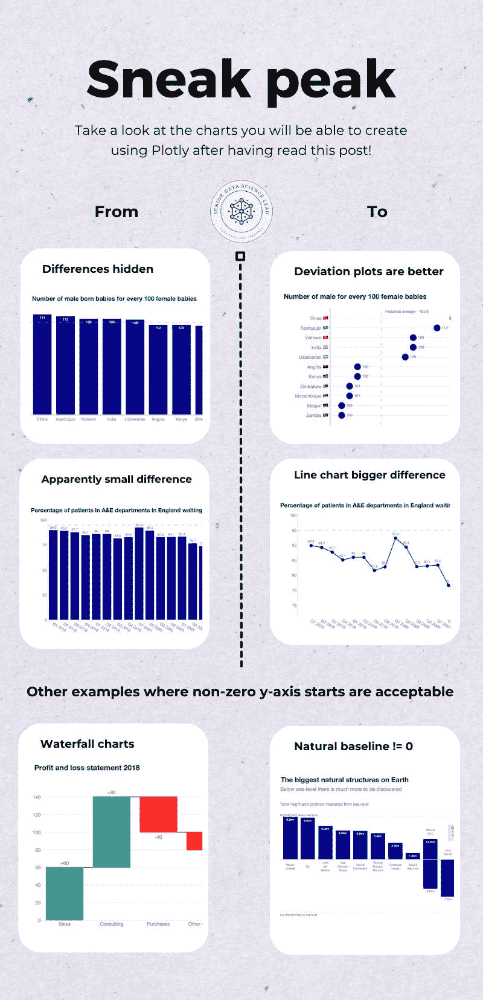

*一如既往，代码和 GitHub 仓库的链接将在这个过程中提供。让我们开始吧！*

## 场景 1. 柱状图可以不从 0 开始吗？

柱状图中的柱状图通常是从底部到顶部读取的，就像一座建筑。这就是为什么在我们的脑海中——遵循建筑类比——我们期望柱状图从 0 开始。

没有多少情况下柱状图从不是 0 的某个地方开始，但仍然可以一目了然地理解。我可以想到两个：

+   瀑布图

+   柱状图引用了诸如地理度量等元素，其中基线可以是不同的水平——海平面、平流层或地球地壳。

让我们看看一些例子。

### 示例 1. 瀑布图

瀑布图在金融界非常常见。你可以在下面看到一个我用 Plotly 创建的模拟瀑布图。

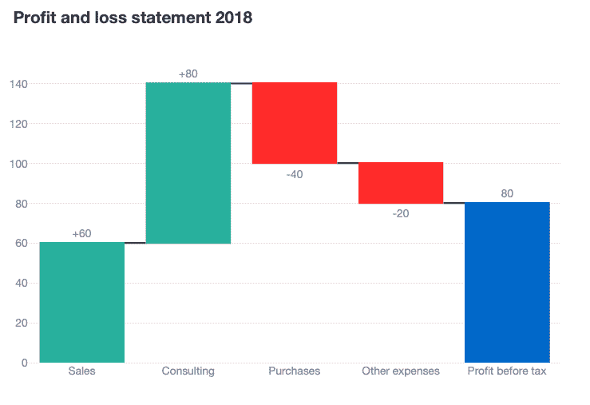

模拟数据源

**瀑布图的特点是什么？**

1.  你可以看到，有一些柱状图**不是**从 0 开始的。

1.  然而，从柱状图到柱状图之间存在连续的流动，这使得它非常类似于堆积柱状图。

1.  此外，对于每一步，都会绘制一个新的基线（用黑色线表示），这使每个柱状图似乎都是从一种“0 型”基线开始的。

1.  最后，整体图表实际上是从 0 开始的。我们没有打破柱状图应该始终从 0 开始的规则。

### 如何创建此图的技巧

***如何在 Plotly 中构建瀑布图？***

```py
fig = go.Figure(
   go.Waterfall(
      orientation="v",
      measure=["relative", "relative", "relative", "relative", "total"],
      x=["Sales", "Consulting", "Purchases", "Other expenses", "Profit before tax"],
      textposition="outside",
      text=["+60", "+80", "-40", "-20", "80"],
      y=[60, 80, -40, -20, 0],
      connector={"line": {"color": "rgb(63, 63, 63)"}},
   )
)

fig.update_layout(
   title=dict(text="Profit and loss statement 2018",
              font=dict(family="Helvetica Neue", size=18),
              ),
   showlegend=False,
   margin=dict(t=100, pad=0),
   height = 500,
   width=600,
   font=dict(family="Helvetica Neue"),
)
```

### 示例 2. 地理测量

现在想象一下，你是一位地理老师。你希望用以下问题挑战你的学生：（1）地球上最高的自然结构是什么？（2）地球上最高的山是什么？

你故意提出这些问题，因为大多数学生都会对两个问题都回答“珠穆朗玛峰”。但你想通过展示低于海平面的地理元素（如海沟和山脉）来“震惊”你的学生。这是你为他们整理的数据。

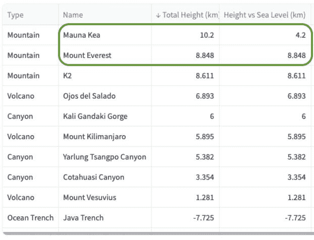

手动整理的数据源

在上面的截图中，我用绿色突出显示了莫纳克亚山是最高的山，但它比珠穆朗玛峰在海平面以上的露出部分要少。你将如何绘制这些数据？

你可以看到，我将所有这些信息绘制在一张图中的方法。

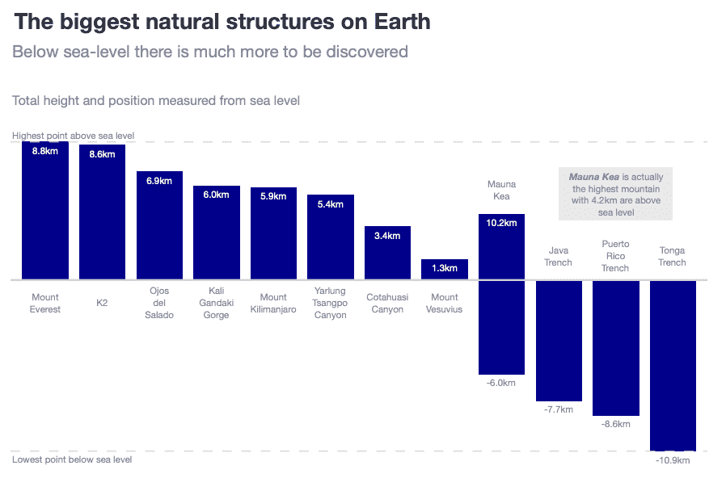

**这个图表的特点是什么？**

1.  该图表实际上确实有一条 0 线（代表海平面）。此外，我还添加了两条辅助线来表示这条 0 线以上和以下的最大值。

1.  柱状图按降序排列。你可以很容易地发现珠穆朗玛峰是海平面以上的最高山。

1.  通过使用负值的柱状图，我们使读者很容易理解存在低于海平面的地理特征。

1.  我对莫纳克亚山给予了双倍的关注。首先，我添加了 2 个数据标签：基准线在海拔以下的位置在哪里，以及总高度是多少。此外，我还包括了一个灰色框，清楚地指出莫纳克亚山是最高的山。

## 场景 2：偏差图

想象一个场景，你想比较类别，它们之间的差异很小，而且 y 轴的值很大。查看下面的数据框：

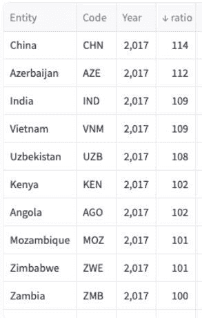

数据来源：[我们的世界数据](https://ourworldindata.org/gender-ratio#:~:text=Among%20first%2Dborn%20children%2C%20the,likely%20to%20have%20another%20child.)

### **第一次尝试：带有基准基准线的简单柱状图**

我认为下面的图表是一个良好的起点。然而，由于柱状图从 0 开始，并且值范围很大，柱状图看起来像摩天大楼。我们想要展示的图表的主要点是高国家和低国家之间的差异，但是有了这些摩天大楼，你真的感觉不到中国和赞比亚之间的差异。

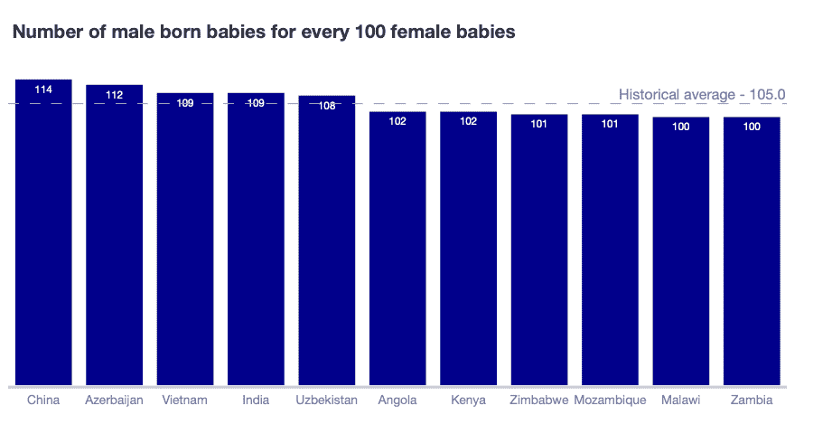

### **第二次尝试：使用柱状图（又称旗帜图）的偏差图**

旗帜图是一种修改后的柱状图。旗帜图有一个基准线（可以是 0 或不同于 0），柱子位于“旗帜”之上（或之下）。旗帜图使得关注数据点之间的相对差异变得容易，特别适用于比较增量变化或显示与目标或基准的偏差。

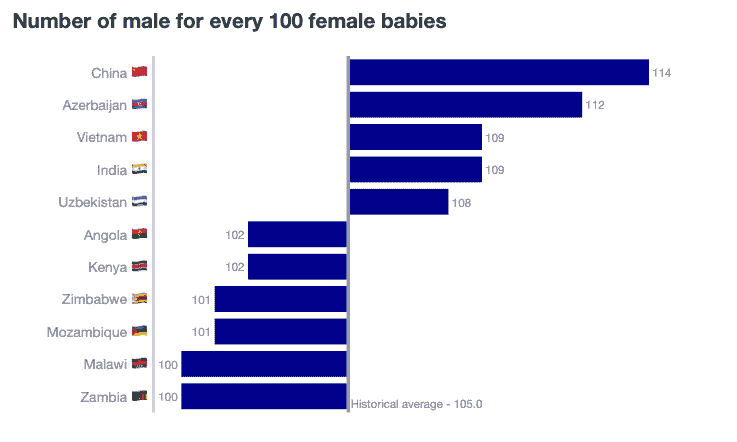

### 如何创建此图的技巧

+   **第一次**，绘制一个垂直基准线。

```py
hist_avg = df['ratio_avg'].min().round(0)
fig.add_vline(x=0, 
   line_color="darkgrey", 
   line_width=3, 
   annotation_text=f'Historical average - {hist_avg}',
   annotation_position='bottom right'
)
```

+   **第二次**，创建一个偏差特征。

```py
return_df['deviation'] = return_df['ratio'] - hist_avg
```

+   **第三次**，绘制一个柱状图，其中 x 轴是“偏差”，但你显示的文本是实际比率。

```py
fig.add_trace(
        go.Bar(
            y=df['Entity_text'],
            x=df['deviation'],
            orientation='h',
            marker_color='darkblue',
            text=df['ratio'],
            textposition='outside',
            showlegend=False,
        )
    )
```

### **第三次尝试：使用点图的偏差图**

在我看来，之前的图表相当有效。然而，鉴于我们知道最佳实践表明柱状图应该始终从 0 开始，我们正在打破这条规则。为了不打破这条规则，我们可以进行轻微的调整，将偏差图从柱状图转换为使用点。

我们实际上在*[神奇的 Plotly 代码系列（第一部分）：柱状图的替代方案](https://medium.com/towards-data-science/awesome-plotly-with-code-series-part-1-alternatives-to-bar-charts-125502587690)*中展示了一个“棒棒糖”图表，所以这里的想法也是使用类似的东西。通过使用点图，我们的注意力集中在每个单独的点，而不是整个柱子的长度。在我看来，这种偏差散点图要好得多。

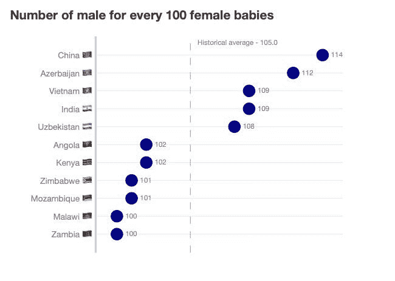

### 如何创建此图的技巧

好消息……你做的是和旗帜图一样，但不是使用`go.Bar()`，而是使用`go.Scatter()`！

## 场景 3：隐藏在柱状图大数字背后的内容。

在场景 2 中，我们已经看到柱状图如何隐藏在大的数字背后的微小变化。在场景 3 中，我们将覆盖相同的概念，但这次是关于变化随时间发生的情况。

想象一下，你是一名为 NHS 工作的顾问。你一直在收集关于 A&E 中等待 4 小时或更少（就像 4 小时是一个短的等待时间……）的患者的百分比数据。你知道 NHS 在 2018 年有一个 95%的目标。因此，你想展示这个百分比指标的演变及其与基准的对比。以下是您收集的数据。

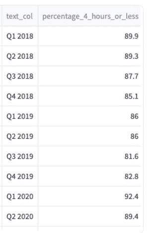

数据来源：[Nuffield Trust](https://www.nuffieldtrust.org.uk/resource/a-e-waiting-times)

### **第一次尝试：如果你想对 NHS 友好，请使用柱状图。**

你首先使用柱状图。你不想违反不将柱子从 0 开始的规则。总的来说，图表确实以某种方式显示了随时间的下降。它还显示你现在离 95%的目标最远。

但它并没有传达出显著的变化。因为它们从零开始，最高的起始点（70%）已经看起来很大了。换句话说，你是在展示真实的数据，但同时也试图取悦顶层的 NHS 人士。

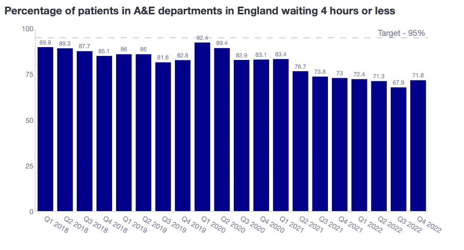

### **第二次尝试：如果你想向 NHS 展示显著的变化，请使用线形图。**

线形图和点状图不需要锚定在 y=0 开始的需求。正因为如此，我们可以放大到相关的值范围，以强调我们的故事。你能看到下面图表中的区别吗？

变化非常显著，产生了一种迫切感去“阻止下跌”。通过将最低百分比放在图表的最低部分，我们唤起了我们“触底”的感觉。在柱状图中，底部是 0，因此，我们离触底非常远。

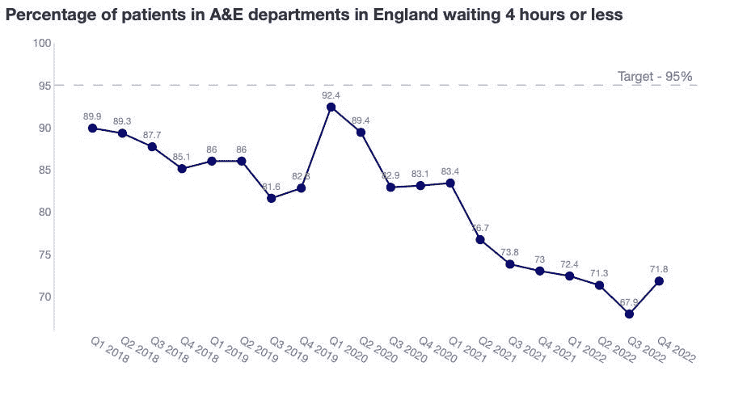

## 摘要

在这篇文章中，我们探讨了 y 轴操作对柱状图的影响。最佳实践规则是柱状图从零开始，以保持清晰和诚实。然而，如果你需要讲述一个特定的故事，你可能需要一个替代方案。例如，旗帜图或偏差图有助于关注基准或组之间的差异。此外，线形图不需要从 y=0 开始，这有助于关注趋势中的差异。

然而，文章应该传达的是……

> *柱状图应该**始终**从 0 开始。*
> 
> *如果你在考虑不从 0 开始，那么就切换图表类型。*

### 代码在哪里可以找到？

在我的仓库和实时 Streamlit 应用中：

+   Git 仓库：[`github.com/JoseParrenoGarcia/Plotly-great-examples/tree/main`](https://github.com/JoseParrenoGarcia/Plotly-great-examples/tree/main)

+   [Streamlit 应用](https://plotly-great-examples-fs7ctvf5zhvw44nniybkcb.streamlit.app/)

### 致谢

+   [我们的世界数据](https://ourworldindata.org/gender-ratio#:~:text=Among%20first%2Dborn%20children%2C%20the,likely%20to%20have%20another%20child.) (CC BY 4.0)

+   [Nuffield Trust](https://www.nuffieldtrust.org.uk/resource/a-e-waiting-times)

## 进一步阅读

感谢阅读这篇文章！如果您对我的更多书面内容感兴趣，这里有一篇文章收集了我所有其他博客文章，按主题组织：数据科学团队和项目管理、数据故事讲述、营销与投标科学以及机器学习与建模。

> [**所有我的书面文章都在这里**](https://medium.com/@joparga3/all-my-written-articles-in-one-place-24ccd6689f72)

## 请保持关注！

如果您想在我发布新书面内容时收到通知，请随意在 Medium 上关注我或订阅我的 Substack 通讯。此外，我很乐意在领英上与您聊天!

> [**高级数据科学负责人 | 何塞·帕雷诺·加西亚 | Substack**](https://joseparreogarcia.substack.com/)

* * *

*最初发布于[`joseparreogarcia.substack.com`](https://joseparreogarcia.substack.com/p/awesome-plotly-with-code-series-part-d9d).*
