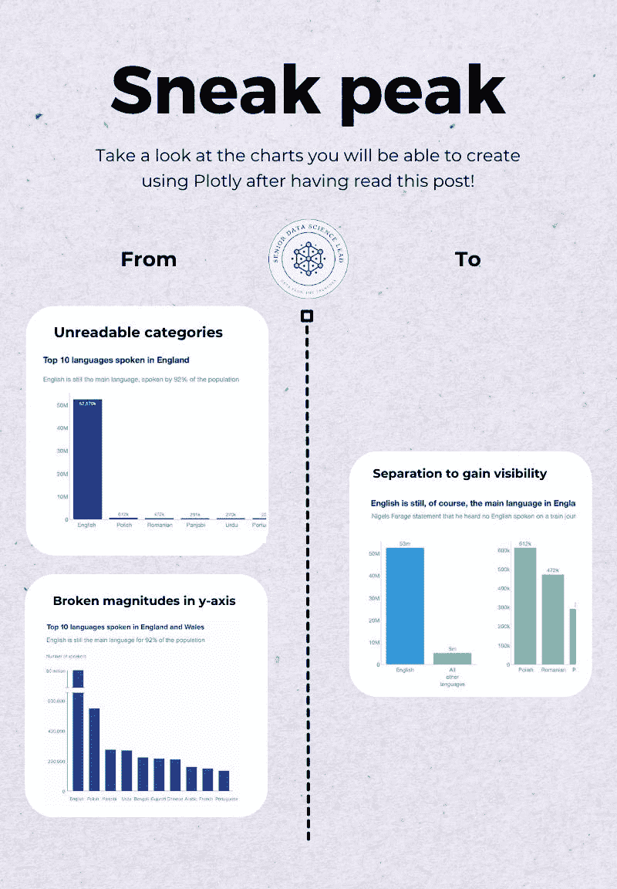
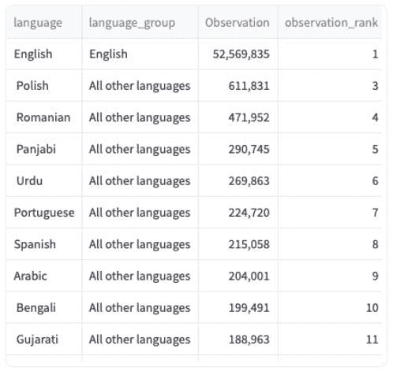
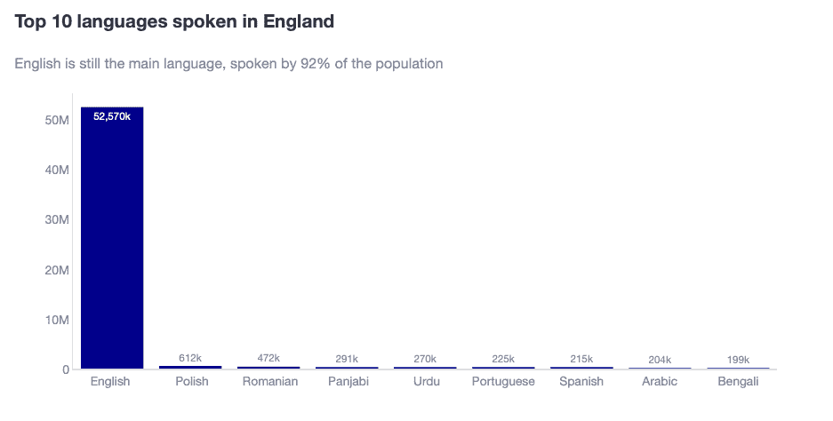
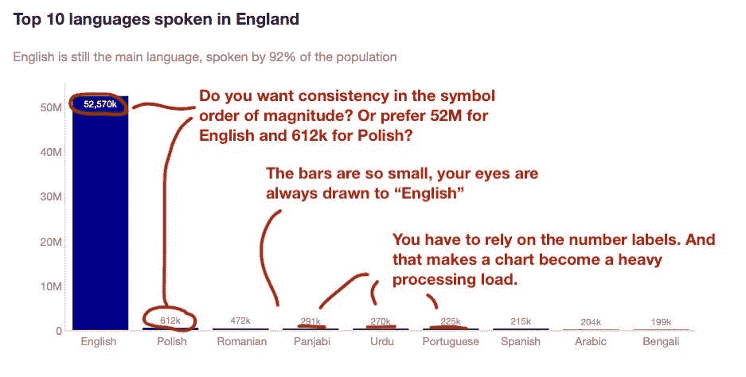
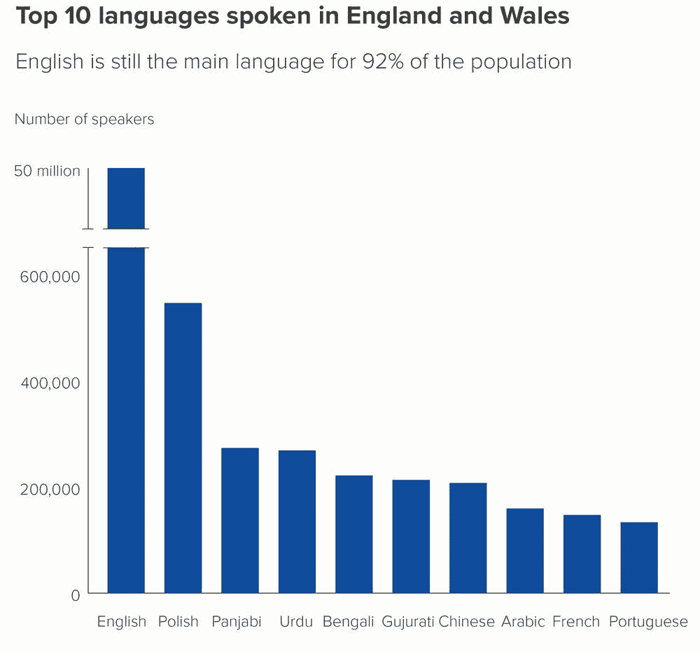
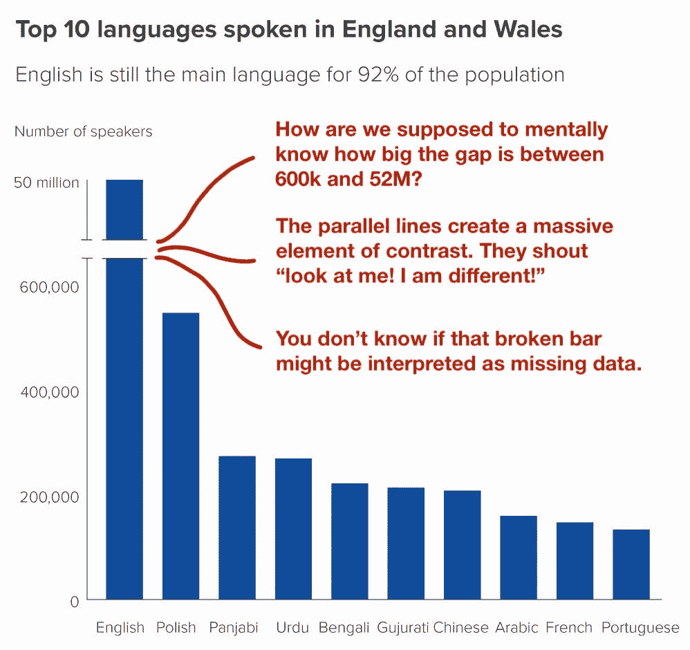
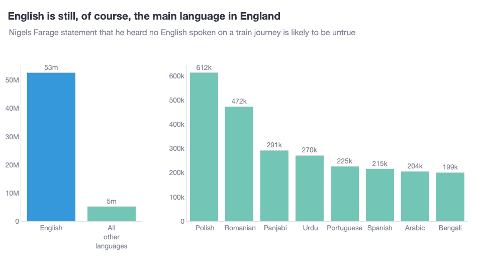

# 出色的 Plotly 编码系列（第八部分）：如何平衡主导柱状图类别

> 原文：[`towardsdatascience.com/awesome-plotly-with-code-series-part-8-how-to-balance-dominant-bar-chart-categories-d6d292e81587/`](https://towardsdatascience.com/awesome-plotly-with-code-series-part-8-how-to-balance-dominant-bar-chart-categories-d6d292e81587/)


使用 Dall-e 创建的图像

*欢迎来到我的“Plotly 编码”系列的第八篇！如果你错过了第一篇，你可以在下面的链接中查看，或者浏览我的["一篇统治所有文章"](https://medium.com/@joparga3/all-my-written-articles-in-one-place-24ccd6689f72)来跟随整个系列或其他我之前写过的主题。*

> [**出色的 Plotly 系列教程（第一部分）：柱状图的替代方案**](https://towardsdatascience.com/awesome-plotly-with-code-series-part-1-alternatives-to-bar-charts-125502587690)

### 简短总结：为什么我要写这个系列

我创建可视化图表的首选工具是 Plotly。它非常直观，从叠加轨迹到添加交互性。然而，虽然 Plotly 在功能上表现出色，但它没有提供“数据新闻”模板，该模板可以直接提供经过抛光的图表。

> 这就是本系列的作用所在——我将分享如何将 Plotly 的图表转换成时尚、专业级的图表，满足数据新闻标准。

*PS：除非另有说明，所有图像均由我本人创作。*

## 简介 – 没有图表是默认准备好处理主导类别的。

当人们想到柱状图时，他们通常会想象清晰且易于区分的柱子，有效地展示数据。但是，如果有一个柱子非常大，以至于它使其他所有柱子都显得渺小，会发生什么呢？在阅读我之前的[出色的 Plotly 编码系列（第三部分）：突出显示长尾中的柱子](https://medium.com/towards-data-science/awesome-plotly-with-code-series-part-3-highlighting-bars-in-the-long-tails-8e5116e36003)文章后，你可能会说：“约瑟，你已经展示了如何处理小而难以检测的柱状图，只需突出显示它们”。这完全正确，但我的上一篇文章是突出显示 2 个柱子，而不是除了一个之外的所有柱子！

在这篇文章中，我将向你展示如何展示一个图表，其中既代表高耸的“摩天大楼”柱子，也代表较小的“一层的房子”。

### 我们将在博客中涵盖什么？

1.  **场景 1：摩天大楼 – 绘制默认图表**

1.  **场景 2：断裂的柱子 – 谁发明了这个异常？**

1.  **场景 3：分离 – 为两个故事提供空间**

*PS：和往常一样，代码和我 GitHub 仓库的链接将在这个过程中提供。让我们开始吧！*



## 场景 1：摩天大楼柱状图和默认绘图问题

想象一下，你正在展示一项关于英格兰使用的语言的研究，并试图创建一个能够有效展示这些见解的条形图。想法是关注非英语语言，因为很明显英语是主导语言。然而，你仍然想提供一个关于英语比其他语言更占主导地位的视角。以下是你可能正在处理的数据：



数据来源：[ONS 数据](https://www.ons.gov.uk/datasets/TS024/editions/2021/versions/1)

你可以看到，英语被 5200 万人使用……而下一个最接近的语言是波兰语，有 60 万！这相差 86 倍！如果你要通过条形图来展示这些信息，而不真正考虑非英语语言会发生什么，那么你会发现自己在盯着下面的图表发呆。



**我认为这个图表有哪些问题？**

1.  很明显，这些较细的条形如此之小，以至于几乎无法区分它们之间的高度差异。

1.  即使你添加了数据标签，你也无法直观地看到旁遮普语、乌尔都语、葡萄牙语和西班牙语与这些语言相近，而波兰语是这些语言的 3 倍。

1.  事实上，因为你想要用 *"k"* 来表示千，那么对于 5300 万英语使用者来说会发生什么？你也会用 *"k"* 来标注数据标签吗？



问题总结

## 场景 2：断裂条形图 - 谁发明了这种异常？

我第一次在学校接触到“断裂条形图”，这是一种我很快学会在专业数据可视化中避免的方法。我希望我没有这样做。在我年轻的时候，这很有道理，以至于它一直留在我脑海中，直到我成年后面对一次演示，我带着“wtf”的表情盯着我的断裂条形图。

什么是断裂条形图？嗯，它是一种条形图，其中你切断了主导类别。最常见的断裂条形方式是使用两条平行线。请查看下面的图表。



那些断裂线究竟意味着什么？？！！ – 来自[AddTwoDigital](https://www.addtwodigital.com/add-two-blog/2021/11/1/rule-26-dont-use-broken-axes-or-bars)的视觉化

**我认为这个图表有哪些问题？**

1.  最重要的是，它打破了矩形维度与数据值之间的关系。我们该如何想象最大条形之间的差距有多大呢？

1.  断裂的平行线是一个巨大的对比元素。我们的大脑天生就擅长捕捉差异，而这个对比则大声喊道：“看看我！”因此，我并没有先阅读标题，然后专注于条形之间的差异，而是我的眼睛直接跳到了摩天大楼条形图中的裂缝。

1.  您不知道读者是否可能会将故事解释为关于完全不同的事情。例如，他们为什么不会认为故事是在强调数据不完整呢？



问题总结

## 场景 3：使用子图平衡主导条形图类别

面对这类故事时，最好回到数据中，弄清楚您需要绘制什么图表以及为什么。记住，您想要：

1.  展示非英语语言之间的差异。

1.  展示英语仍然占据主导地位的情况。

在这种情况下，我们似乎想要讲述两个故事。因此，我的建议是构建两个图表。子图是数据可视化中的一个基本工具，尤其是在平衡主导条形图类别方面。实际上，子图应该是您数据可视化工具包的一部分！下面您可以看到我讲述这两个故事的尝试。



**为什么我认为这个图表更好？**

1.  该图表清楚地划定了两个故事之间的界限。第一个是英语与非英语的比较。第二个是非英语语言之间的关系。

1.  两个图表的 y 轴范围不同。为了确保读者不会感到困惑，我使用了颜色来确保故事从第一个图表中的“5m”小条形图流畅地过渡到第二个图表。

1.  我故意给第一个图表留出了较窄的绘图空间，而第二个则更宽。

### 创建此图表的技巧

***如何为子图提供不同的宽度？***

+   在`make_subplots()`中使用`column_widths`参数

```py
fig = make_subplots(rows=1, cols=2, column_widths=[0.3, 0.7])
```

***如何创建不同的图表并将它们添加到子图中？***

+   使用`add_trace()`，创建`go.Bar()`并指定您想要分配给它的`row`和`col`。

```py
fig.add_trace(
        go.Bar(
            x=first_chart_data['language_group_text'],
            y=first_chart_data['Observation'],
            name='main_languages',
            text=[f'{obs / 1e6:.0f}m' for obs in first_chart_data['Observation']],
            texttemplate='%{text}',
            textposition='outside',
            showlegend=False,
            marker_color=['rgb(52, 152, 219)' if lang == 'English' else 'rgb(115, 198, 182)' for lang in first_chart_data['language_group_text']],
        ),
        row=1, col=1
    )

fig.add_trace(
        go.Bar(
            x=second_chart_data['language'],
            y=second_chart_data['Observation'],
            name='other_languages',
            text=[f'{obs / 1e3:.0f}k' for obs in second_chart_data['Observation']],
            texttemplate='%{text}',
            textposition='outside',
            showlegend=False,
            marker_color='rgb(115, 198, 182)',
        ),
        row=1, col=2
    )
```

***如何调整子图的轴美学？***

+   一种简单的方法是在`update_layout()`内部定义参数。在这里，您可以调用`yaxis1`和`yaxis2`，Plotly 将按照绘制痕迹的顺序循环。

+   例如，`yaxis1`将指代`(row=1, col=1)`中的子图，而`yaxis2`将指代`(row=1, col=2)`中的子图。

```py
fig.update_layout(
        ...
        yaxis1=dict(
            showline=True,
            linecolor='lightgrey',
            linewidth=1,
            showgrid=False,
        ),
        yaxis2=dict(
            showline=True,
            linecolor='lightgrey',
            linewidth=1,
            showgrid=False,
        ),
        xaxis1=dict(
            showline=True,
            linecolor='lightgrey',
            linewidth=1,
            showgrid=False,
        ),
        xaxis2=dict(
            showline=True,
            linecolor='lightgrey',
            linewidth=1,
            showgrid=False,
        ),
        margin=dict(t=100, pad=0),
        height=450,
        width=800,
    )
```

## 总结

总结来说，掌握具有主导类别的条形图需要深思熟虑的视觉化技术，如子图，以确保大值和小值都能有效地表示。这篇博客展示了为什么在这种情况下单个条形图往往失败，因为主导的“摩天大楼”条形图可能会掩盖较小的值，使得难以看到它们之间的相关性差异。

使用“断裂条形图”打破条形图会中断数据连续性，过多地吸引观众对断裂本身的注意，并使观众感到困惑。相反，使用子图是一种更有效的方法：一个图表可以描绘主导类别，而另一个独立的图表则以更详细的细节展示较小的类别。这样，每个子图都可以使用适当的缩放、颜色和空间来清楚地传达“整体图景”和“详细视图”的故事。

### 代码在哪里可以找到？

在我的仓库和实时 Streamlit 应用中：

+   Git 仓库：[`github.com/JoseParrenoGarcia/Plotly-great-examples/tree/main`](https://github.com/JoseParrenoGarcia/Plotly-great-examples/tree/main)

+   [Streamlit 应用](https://plotly-great-examples-fs7ctvf5zhvw44nniybkcb.streamlit.app/)

### 致谢

+   数据来源：[ONS 数据](https://www.ons.gov.uk/datasets/TS024/editions/2021/versions/1) (CC BY 4.0)

## 进一步阅读

感谢阅读这篇文章！如果您对我的更多书面内容感兴趣，这里有一篇文章收集了我所有其他博客文章，按主题组织：数据科学团队和项目管理、数据故事讲述、营销与出价科学以及机器学习与建模。

> [**所有我的文章都在这里**](https://medium.com/@joparga3/all-my-written-articles-in-one-place-24ccd6689f72)

## 请保持关注！

如果您想在我发布新内容时收到通知，请随意在 Medium 上关注我或订阅我的 Substack 通讯。此外，我很乐意在领英上与您聊天！

> [**高级数据科学主管 | 何塞·帕雷诺·加西亚 | Substack**](https://joseparreogarcia.substack.com/)

* * *

*最初发布于 [`joseparreogarcia.substack.com`](https://substack.com/home/post/p-151539404?source=queue&autoPlay=false)。*
