# 代码中的出色 Plotly 系列（第九部分）：点状、斜线还是堆叠？

> 原文：[`towardsdatascience.com/awesome-plotly-with-code-series-part-9-to-dot-to-slope-or-to-stack-bcf8523287f2/`](https://towardsdatascience.com/awesome-plotly-with-code-series-part-9-to-dot-to-slope-or-to-stack-bcf8523287f2/)


照片由 [Steffen Petermann](https://unsplash.com/@klapprothkoch?utm_content=creditCopyText&utm_medium=referral&utm_source=unsplash) 在 [Unsplash](https://unsplash.com/photos/a-statue-of-a-man-T9jqzy0INbA?utm_content=creditCopyText&utm_medium=referral&utm_source=unsplash) 上拍摄（我添加了一个气泡）

> 这座雕像可以在魏玛的伊尔姆公园找到（但显然莎士比亚不会说）

*欢迎来到我的“Plotly 代码”系列的第九篇文章！如果你错过了第一篇，你可以在下面的链接中查看，或者浏览我的["一篇涵盖所有内容"的文章](https://medium.com/@joparga3/all-my-written-articles-in-one-place-24ccd6689f72)，以跟随整个系列或其他我之前写过的主题。*

> [**出色的 Plotly 代码系列（第一部分）：柱状图的替代方案**](https://towardsdatascience.com/awesome-plotly-with-code-series-part-1-alternatives-to-bar-charts-125502587690)

### 简短总结我为何要写这个系列

我创建可视化图表的常用工具是 Plotly。它非常直观，从叠加轨迹到添加交互性。然而，尽管 Plotly 在功能上表现出色，但它并没有提供“数据新闻”模板，这个模板可以直接提供经过抛光的图表。

> 这就是本系列文章的用意所在——我将分享如何将 Plotly 的图表转换成时尚、专业级别的图表，这些图表符合数据新闻标准。

*PS：除非另有说明，所有图片均由我本人创作。*

## 简介——聚类列让你的大脑感到混乱

你在柱状图中用多种颜色表示多种类别有多少次了？我敢打赌，相当多……

这些多种颜色与多种类别的混合给人一种将柱状图聚在一起的感觉。当你沟通洞察时，聚类似乎不是一个受欢迎的词。当然，聚类在分析模式时是有用的，但当你从这些模式中传达你发现的内容时，你可能需要考虑去除、清理和整理（清理是我的黄金法则，在我阅读了 [Cole Nussbaumer 的《用数据讲故事》一书](https://medium.com/@joparga3/book-summary-storytelling-with-data-by-cole-nussbaumer-f38d0f588c4d)之后）。

在 *[使用代码的 Plotly 精彩系列（第四部分）：分组条形图与多色条形图](https://towardsdatascience.com/awesome-plotly-with-code-series-part-4-grouping-bars-vs-multi-coloured-bars-645410403ef8)* 中，我们已经讨论了一个场景，即使用颜色表示第三个维度使得读者理解变得相当困难。在这篇博客中我们将讨论的是当这些类别的基数爆炸性增长时的情况。例如，在 *第四部分* 博客中，我们用大洲来表示国家，这在心理上是很容易映射的。然而，如果我们尝试用国家来表示食物类别会发生什么呢？

现在，**那是一个不同的问题。**

## 在这篇博客中我们将涵盖哪些内容？

1.  **场景 1.** 是要分割子图还是堆叠条形图？这是一个问题。

1.  **场景 2.** 如何在 5 个国家和 7 种食物类型之间进行绘图？

1.  **场景 3.** 集簇图表未能传达两组在两个时期的变化。

*PS：像往常一样，代码和我 GitHub 仓库的链接将在过程中提供。让我们开始吧！*

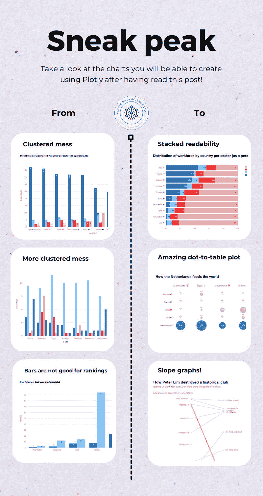

## 场景 1：可视化技术…是要分割子图还是堆叠条形图？这是一个问题。

想象一下你是一位在关于各国劳动力分布的会议上做咨询报告的顾问。你已经收集了所需的数据，可能看起来像下面的截图。

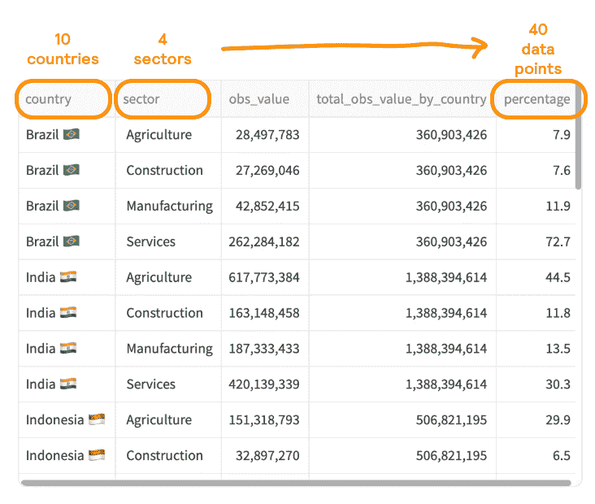

来源：[ILOSTAT 数据探索器](https://rshiny.ilo.org/dataexplorer44/?lang=en&id=EMP_TEMP_ECO_OCU_NB_A)

你希望图表显示每个国家每个部门的百分比。你并没有太多考虑图表设计，而是使用了 `plotly.express` 的默认输出…

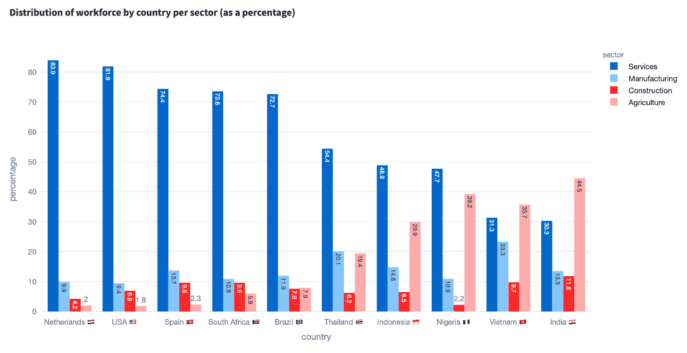

看起来一团糟...

**我认为这个图表有哪些问题？**

首先要说的是，这个图表在讲述一个有趣的故事方面做得有多糟糕。一些明显的问题包括：

+   **你必须使用一个键，这会减慢理解的速度。** 我们在条形图和键之间来回移动

+   **你给数据标签的空间太少了。** 我尝试添加它们，但条形图太窄，标签是旋转的。所以要么你是驱魔的孩子，要么你不断尝试根据 y 轴或提供的网格线来解读一个值。

+   **条形图太多，没有特定的顺序。** 你不能像展示单个变量的条形图那样对集簇条形图进行排名。你是按特定“部门”类别的值进行排名吗？你是按 x 轴或图例类别进行字母顺序排序？

+   **比较条形的顶部几乎是不可能的。** 假设你想比较越南的建筑业劳动力是否比西班牙多……寻找国家，然后弄清楚建筑业是红色条形，然后 somehow 穿越图表？不。我的意思是，如果我没有添加标签（即使旋转了），你可能无法分辨出差异。

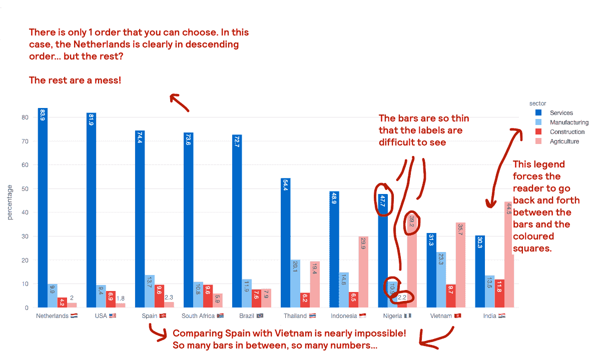

问题总结

让我们看看是否有比上面图表更好的替代方案。

### 替代方案 # 1\. 使用子图。

如果你想讲述的故事是关注比较哪个国家在每个部门中百分比最高的，那么我建议将类别分开到子图中。在，*[Awesome Plotly with code series (Part 8): How to balance dominant bar chart categories](https://towardsdatascience.com/awesome-plotly-with-code-series-part-8-how-to-balance-dominant-bar-chart-categories-d6d292e81587)***，**中，我们已经介绍了子图的使用。场景完全不同，但它仍然展示了子图的有效性。

调整上面的图表，可以得到以下结果。

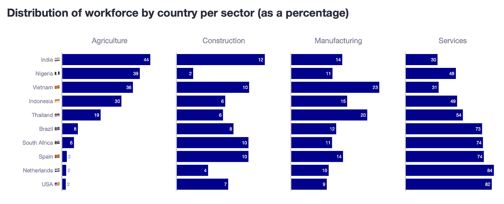

**我为什么认为这个图表比簇状条形图更好？**

1.  现在的水平条形图允许 **更清晰地呈现数据标签。**

1.  没有必要使用颜色编码。多亏了子图标题，人们可以轻松理解正在显示哪个类别。

**一个警告**

1.  **按子图分隔意味着你必须选择如何在 y 轴上排列国家。** 这是通过选择一个特定的类别来完成的。在这种情况下，我选择了“农业”，这意味着其他 3 个类别不保持其自然顺序，使得比较变得困难。

1.  **条形的幅度可能（或不一定）在所有子图中保持一致。** 在这个例子中，我们没有对幅度进行归一化。我的意思是，每个子图的价值范围——从 *min* 到 *max*——是单独确定的。结果是，价值为 12 的条形（见“印度”的“建筑业”）渲染得比价值为 30 的条形（见“印度”的“服务业”）大得多。

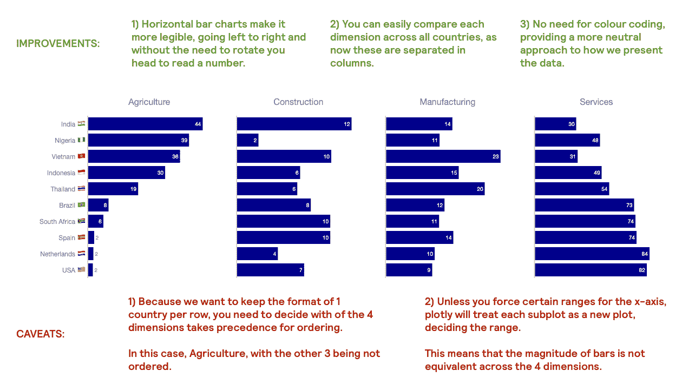

改进总结（以及一些注意事项）

尽管有缺陷，但子图图表比第一个簇状条形图更易于阅读。

### 替代方案 #2\. 使用堆叠条形图。

现在，假设您想传达的是各国劳动力分布的倾斜程度（或不是）。正如我们看到的**子图替代方案**，这有点困难，因为每个条形图在每个子图中渲染的方式都不同。子图替代方案非常适合回答“印度有最大的劳动力百分比用于建筑，而尼日利亚是最小的”，但很难回答“建筑和服务占印度劳动力的 77%”。

检查下面的堆叠条形图，并决定您更喜欢哪一个。

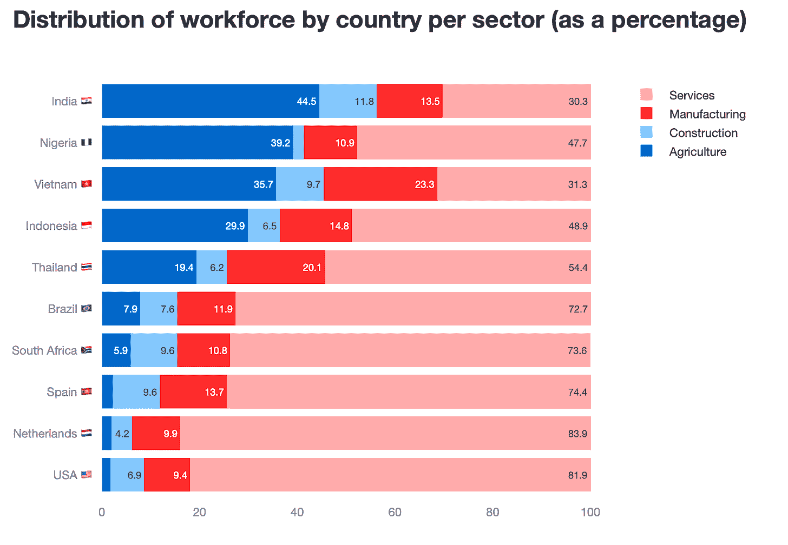

**为什么我认为这个图表比簇状条形图更好？**

1.  **堆叠条形图有助于为 y 轴上的每一行固定一个故事**。现在，即使在簇状条形图中相对容易理解的内容，在堆叠条形图中也更容易理解。

1.  水平条形图现在允许**更清晰地呈现数据标签**。

1.  因为**您正在处理百分比**，堆叠条形图可以真正传达这些数字加起来是 100%。

1.  最后，**所有条形图都有正确的量级**。

**注意事项**

1.  与**子图替代方案**类似，**通过子图进行分离意味着您必须选择如何在 y 轴上排列国家**。

1.  **需要一个彩色编码的图例**，因此需要额外的时间进行处理。

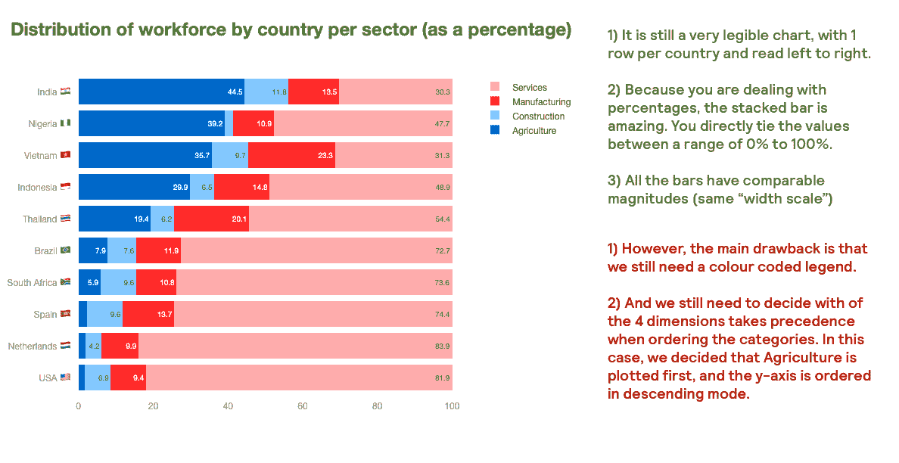

改进总结（以及一些注意事项）

再次，尽管它存在一些问题，但我希望您会同意我的观点，即堆叠条形图比第一个簇状条形图更易于阅读。

### 如何创建这两个图表的技巧

**创建子图图表**

+   **第一点**，您当然需要创建一个子图对象。

```py
fig = make_subplots(
  rows=1, cols=4, 
  shared_yaxes=True,
  subplot_titles=list_of_categories,
)
```

+   **第二点**，简单地遍历每个类别，并在特定的“列轨迹”上绘制每个条形图。

```py
fig.add_trace(
    go.Bar(
        y=aux_df['country'],
        x=aux_df['percentage'],
        marker=dict(color='darkblue'),
        text=aux_df['percentage'].round(0),
        textposition='auto',
        orientation='h',
        showlegend=False,
    ),
    row=1, col=i
)
```

**创建堆叠条形图**

+   **第一点**，决定主要类别的顺序。

```py
df = df.sort_values(['sector', 'percentage'], ascending=[True, True])
```

+   **第二点**，遍历每个类别。通过国家提取信息并添加一个轨迹。

```py
for sector in df['sector'].unique():
  aux_df = df[df['sector'] == sector].copy()

  fig.add_trace(
            go.Bar(
                x=aux_df['percentage'],
                y=aux_df['country'],
                orientation='h',
                name=sector,
                text=aux_df['percentage'],
                textposition='auto',
            )
        )
```

+   **第三点**，您需要告诉 plotly 这是一个堆叠条形图。您可以在`update_layout`方法中这样做。

```py
fig.update_layout(barmode='stack')
```

> ***如果莎士比亚曾作为数据分析师工作，他可能会说：是使用子图还是堆叠？***

## 场景 2：如何绘制 5 个国家与 7 种食品类型的图表？

在这个第二种场景中，您正在处理**多类别数据**，这些数据表示每个国家出口的食品类型占其总生产的百分比。在下面的数据集中，您将获得有关 5 个国家及 7 种食品类型的信息。您将如何传达这些信息？

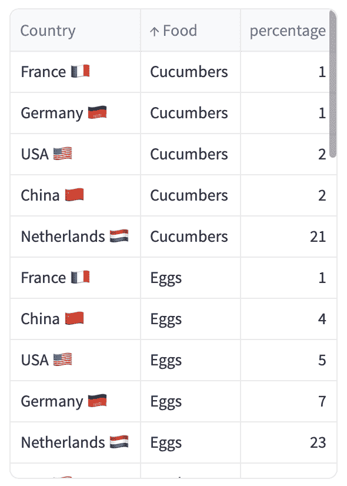

模拟数据由作者提供

### 默认输出注定要失败

您尝试一下`plotly.express`的默认输出。您看到的结果可能不是您想要的。

**选项 1**。将国家放在 x 轴上，将食品类别放在图例中。

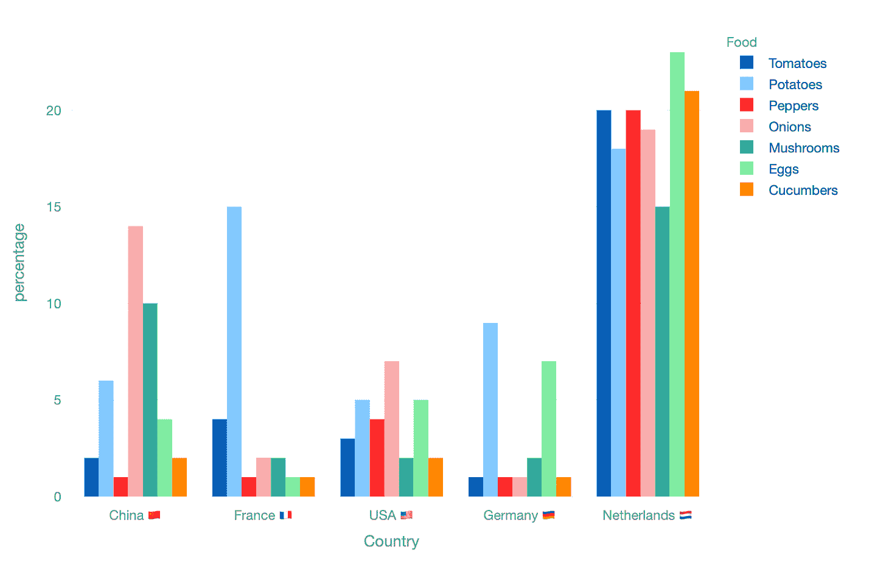

国家在 x 轴上

**选项 2：将食品类别放在 x 轴上，将国家放在图例中**

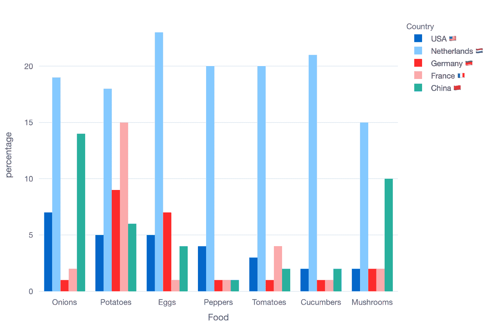

国家在 y 轴上

你会同意我的观点，这两个图表都不能用来讲述一个清晰的故事。让我们看看如果我们使用上面所示的堆积条形图会发生什么。

### 替代方案#1：堆积条形图（在这种情况下，失败了）

在之前的场景中，堆积条形图为我们服务得很好。它也能帮助我们在这里，即我们拥有更多类别且百分比总和不为 100%的情况下吗？

检查下面的条形图：

**选项 1：将国家放在 x 轴上，将食品类别放在图例中**

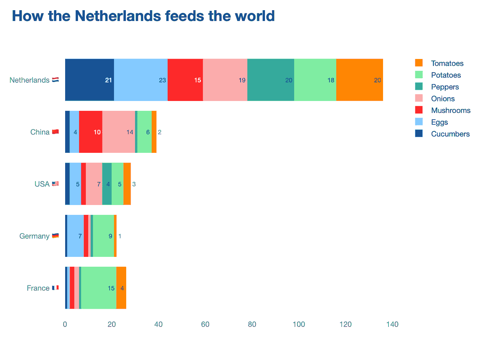

如果你想在国家层面上讲故事，恐怕堆积条形图看起来真的很奇怪。

**选项 2：将食品类别放在 x 轴上，将国家放在图例中**

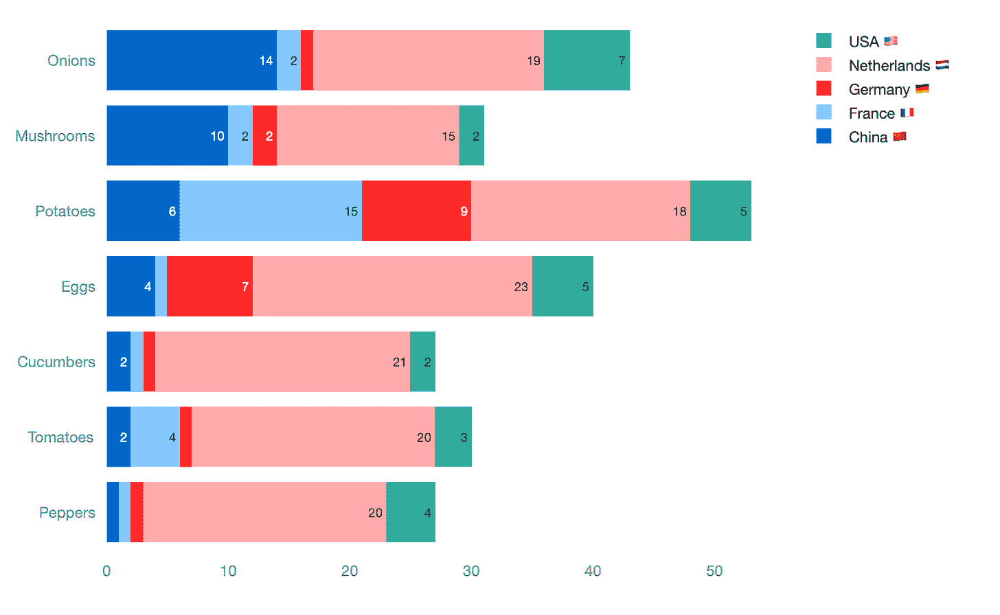

如果你想在食品类别层面上讲故事，图表稍微好一些，但不是好很多。

两种堆积图表都未能简化我们所观察的内容。事实上，我敢说它们与簇状条形图一样难以阅读。因此，在这种情况下，堆积条形图实际上已经失败了。

### 替代方案#2：点图（这是一种花哨的散点图）

我即将提出的这个替代方案受到了我们在场景 1 中使用的子图想法的启发。然而，在这种情况下，我将把条形换成点。

在场景 1 中，我不喜欢的一点是，不同类别中条形的大小没有意义。每个子图都有自己的 x 轴范围。

现在，你认为这种点图方法对更清晰的数据叙事有何看法？

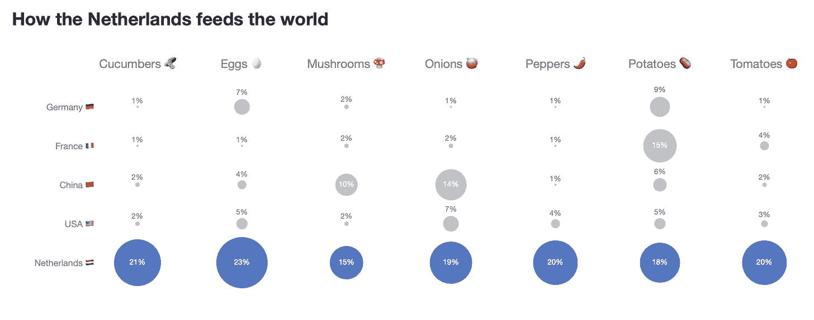

**为什么我认为这个图更好？**

1.  点图的大小在整个图表中保持一致。

1.  由于我有一个国家（荷兰）超过了其他国家，我觉得点可以更好地传达这种优越性——甚至当我用不同的颜色给它们着色时。

1.  将这些子图排列成表格，使事物看起来整齐有序。换句话说，在国家和食品类别层面上查找答案很容易。

1.  不需要颜色编码！我们可以使用表情符号！

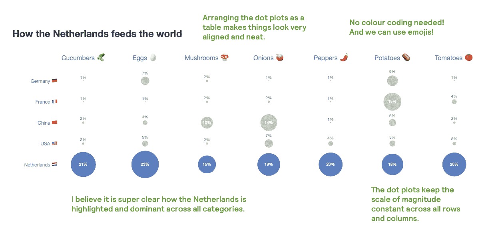

改进总结

### 如何创建此图的技巧

+   **1.** 创建一个子图对象。我使用字典定义了标题，并用表情符号表示

```py
list_of_categories = df['Food'].unique().tolist()
list_of_categories.sort()

food_to_emoji = {
        'Cucumbers': '🥒',
        'Eggs': '🥚',
        'Mushrooms': '🍄 ',
        'Onions': '🧅',
        'Peppers': '🌶 ️',
        'Potatoes': '🥔',
        'Tomatoes': '🍅 '
}
subplot_titles = [f"{category} {food_to_emoji.get(category, '')}" for category in list_of_categories]
fig = make_subplots(rows=1, cols=7, shared_yaxes=True,
                    subplot_titles=subplot_titles
                    )
```

+   **第二点**，如何为每个{国家}-{食物}组合添加一个单一的数据点？遍历食物类别，但在 x 轴上强制绘制一个虚拟值（我使用了数字 1）**

```py
for i, feature in enumerate(list_of_categories):
  c = i + 1

  if c == 1:
        aux_df = df[df['Food'] == feature].sort_values('percentage', ascending=False).copy()
     else:
        aux_df = df[df['Food'] == feature].copy()
     fig.add_trace(
              go.Scatter(
                  y=aux_df['Country'],
                  x=[1] * len(aux_df), # <---- forced x-axis
                  mode='markers+text',
                  text=text,
                  textposition=textposition,
                  textfont=textfont,
                  marker=marker,
                  showlegend=False,
              ),
              row=1, col=c
          )
```

+   **第三点**，但是如果你绘制值 1，你如何显示真实的食物百分比值？简单，你可以在`text`、`textposition`、`textfont`和`marker`参数中定义这些值。

```py
text = [f"{val}%" for val in aux_df['percentage'].round(0)]

textposition = ['top center' if val < 10 else 'middle center' for val in aux_df['percentage']]
textfont = dict(color=['grey' if val < 10 else 'white' for val in aux_df['percentage']])
marker = dict(size=aux_df['percentage'] * 3,
              color=['rgb(0, 61, 165)' if country == 'Netherlands 🇳🇱 ' else 'darkgrey' for country in aux_df['Country']])
```

## 场景 3：簇状图表无法传达两组之间的变化。

在上述两种情况下，我们都在处理多个类别，并看到了如何簇状柱状图阻碍了我们快速理解我们试图传达的信息的能力。在最后一个场景中，我们涵盖了只有两个类别的情况。在这种情况下，两个不同时间段（可能是两个部分、两个区域等）

因为基数很小（只有 2），我见过很多人仍然使用堆叠柱状图。查看下面的数据。它代表了不同西班牙足球队在两个不同赛季中持有的排名。

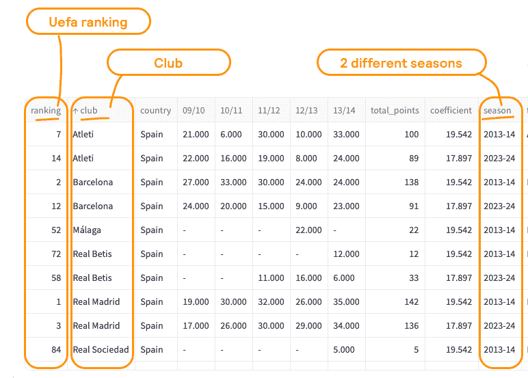

来源：[UEFA 排名](https://www.uefa.com/nationalassociations/uefarankings/club/?year=2025)

如果你将团队绘制在 x 轴上，排名绘制在 y 轴上，并将赛季作为彩色图例，我们就会得到以下图表。

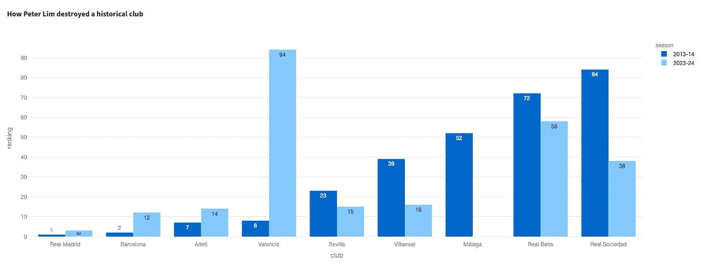

**我认为这个图表有哪些问题？**

1.  **排名用柱状图表示不佳**。例如，这里较大的排名更差（即，排名=1 比排名=50 要好得多）

1.  **比较 2023-2024 赛季的排名并不容易**。这是因为我们已经根据 2013-2014 赛季对图表进行了升序排序。

1.  **有些球队在 2013-2014 赛季有 UEFA 排名**，但在 2023-2024 赛季没有（马拉加）。这一点从图表中并不立即明显。

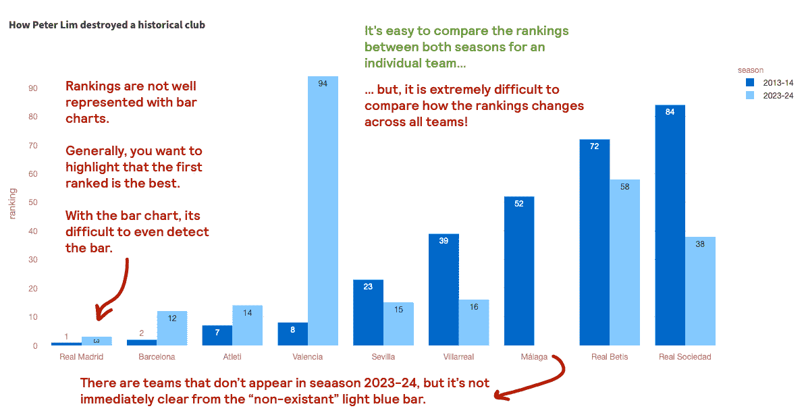

### 斜率图的替代方案

当我需要可视化**排名比较**或任何变化的故事（即，这个数据点已经从**这里**移动到**这里**）时，我总是转向斜率图。变化不一定是随时间发生的（尽管这是最常见的类型），斜率图可以用来比较两种情景、两种相反的观点、两个地理区域等。我真的很喜欢它们，因为你的眼睛可以很容易地从起点移动到终点，而不会被打断。此外，它使变化的程度更加明显。查看下面的图表…这是瓦伦西亚 CF 自新老板到来后完全摧毁其排名的故事。

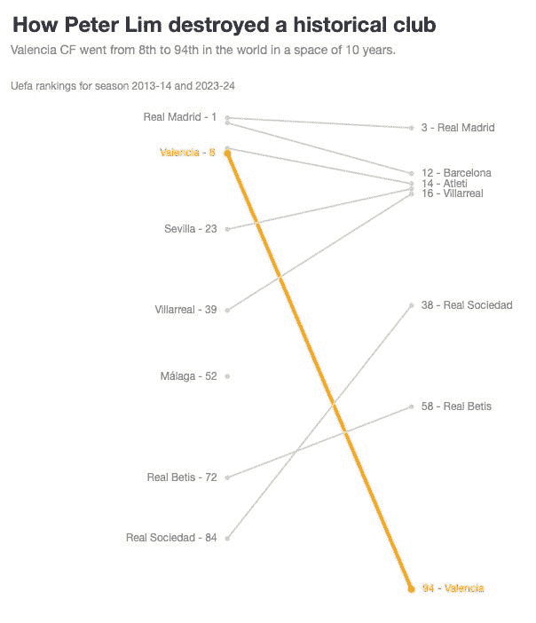

### 如何创建此图表的技巧

+   **第一点**，遍历每个俱乐部并绘制散点图。

```py
for club in df['club'].unique():
  club_data = df[df['club'] == club]

  # DEFINITION OF COLOUR PARAMETERS
  ...
  fig.add_trace(go.Scatter(
    x=club_data['season'],
    y=club_data['ranking'],
    mode='lines+markers+text',
    name=club,
    text=club_data['text_column'],
    textposition=['middle left' if season == '2013-14' else 'middle right' for season in club_data['season']],
    textfont=dict(color=colour_),
    marker=dict(color=color, size=marker_size),
  line=dict(color=color, width=line_width)
))
```

+   **第二点**，定义`text`、`textfont`、`marker`和`line`参数。

```py
for club in df['club'].unique():
  club_data = df[df['club'] == club]

  if club == 'Valencia':
         color = 'orange'
         line_width = 4
         marker_size = 8
         colour_ = color
      else:
         color = 'lightgrey'
         line_width = 2
         marker_size = 6
         colour_ = 'grey'

      # go.Scatter()
      ...
```

+   **第三点**，因为我们处理的是“排名”，你可以设置`yaxis_autorange='reversed'`

```py
fig.update_layout(
   ...
   yaxis_autorange='reversed',  # Rankings are usually better when lower
)
```

## 多类别可视化方法总结

在这篇文章中，我们探讨了如何通过使用更有效的可视化技术来超越簇状条形图。以下是关键要点快速回顾：

**场景 1：子图与堆叠条形图**

+   **子图**：最适合进行类别特定的比较，标签清晰，无需颜色编码的图例。

+   **堆叠条形图**：非常适合展示累积分布，条形大小一致，100% 总数直观。

**场景 2：高基数点图**

+   当处理 x 轴和 y 轴上的多个类别时，**点图**提供了一个更清晰的视图。

+   与子图或堆叠条形图不同，点图保持大小恒定，比较清晰。

**场景 3：两点比较的斜率图**

+   对于追踪两点之间的变化，**斜率图**清楚地显示了运动和方向。

+   它们可以一目了然地突出显示上升、下降或稳定的趋势。

### 代码在哪里可以找到？

在我的仓库和实时 Streamlit 应用中：

+   Git 仓库：[`github.com/JoseParrenoGarcia/Plotly-great-examples/tree/main`](https://github.com/JoseParrenoGarcia/Plotly-great-examples/tree/main)

+   [Streamlit 应用](https://plotly-great-examples-fs7ctvf5zhvw44nniybkcb.streamlit.app/)

### 致谢

+   来源：[ILOSTAT](https://rshiny.ilo.org/dataexplorer44/?lang=en&id=EMP_TEMP_ECO_OCU_NB_A)

+   来源：[Uefa 排名](https://www.uefa.com/nationalassociations/uefarankings/club/?year=2025)

## 进一步阅读

感谢阅读这篇文章！如果你对我的其他文章感兴趣，这里有一篇文章收集了我所有其他博客文章，按主题组织：数据科学团队和项目管理、数据故事讲述、营销与出价科学以及机器学习与建模。

> [**所有我的文章都在这里**](https://medium.com/@joparga3/all-my-written-articles-in-one-place-24ccd6689f72)

## 请保持关注！

如果你想在我发布新内容时收到通知，请在 Medium 上关注我或订阅我的 Substack 订阅新闻简报。此外，我很乐意在领英上聊天!

> [**高级数据科学负责人 | 何塞·帕雷诺·加西亚 | Substack**](https://joseparreogarcia.substack.com/)

* * *

*原文发表于 [`joseparreogarcia.substack.com`](https://joseparreogarcia.substack.com/p/awesome-plotly-part-9-clear-multi-category-data)。*
