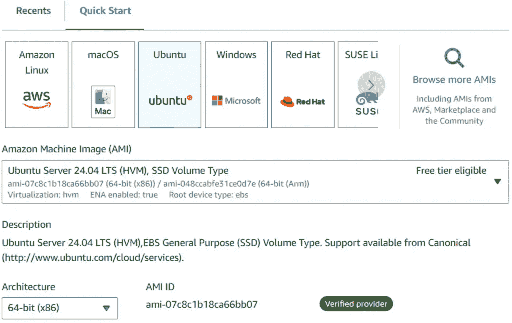
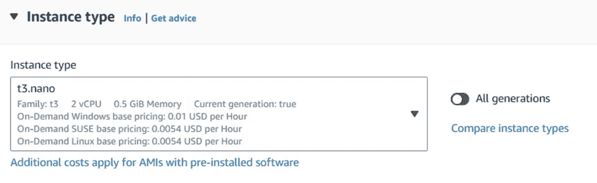
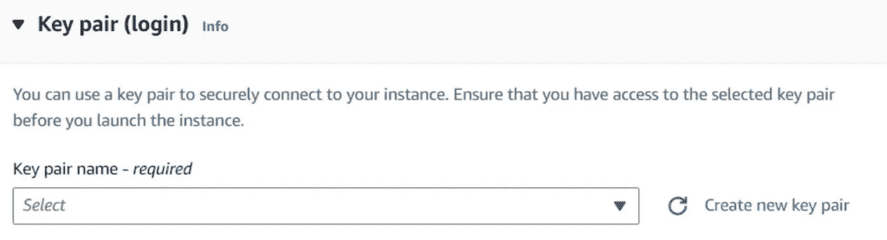
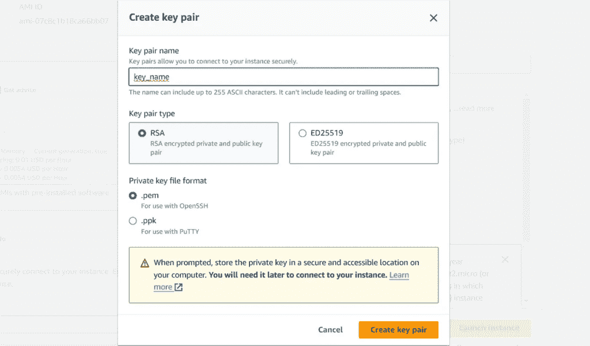
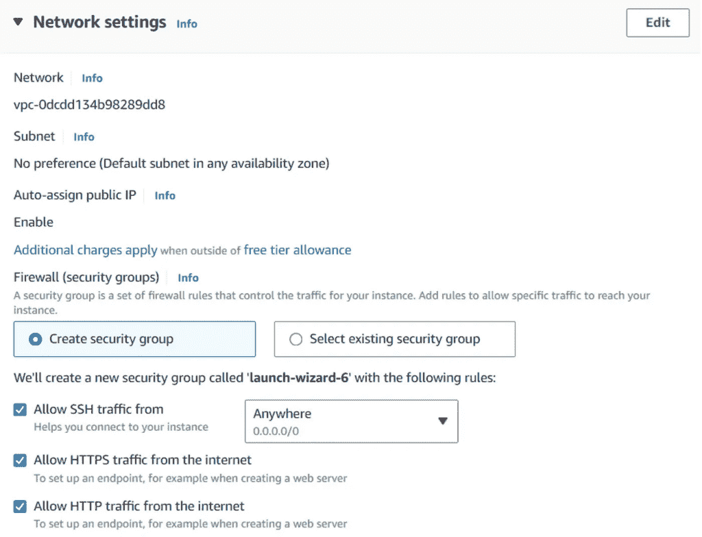
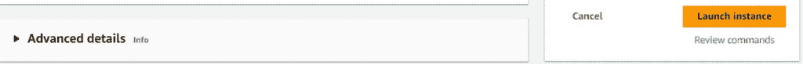
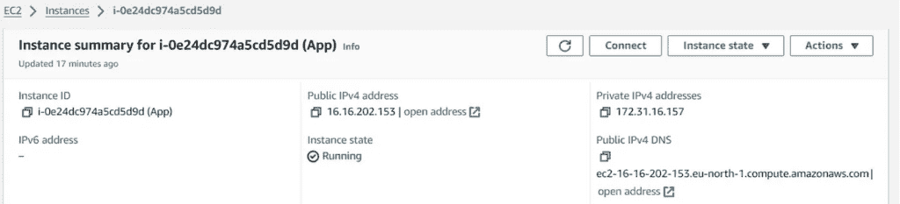
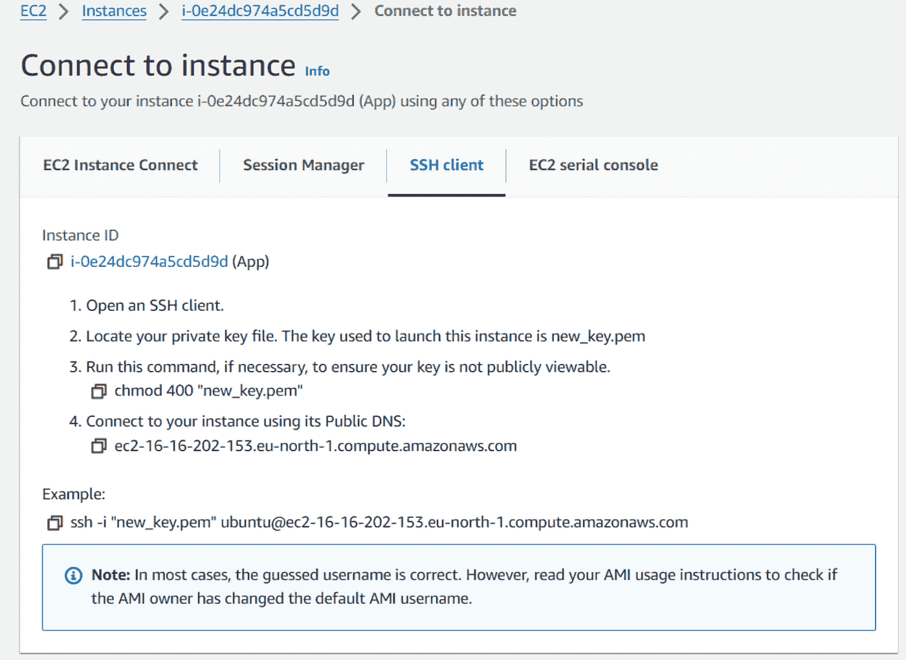

# AWS：在几分钟内部署 FastAPI 应用程序到 EC2

> 原文：[`towardsdatascience.com/aws-deploying-a-fastapi-app-on-ec2-in-minutes/`](https://towardsdatascience.com/aws-deploying-a-fastapi-app-on-ec2-in-minutes/)

## <mdspan datatext="el1745541501643" class="mdspan-comment">简介</mdspan>

AWS 是一个流行的云服务提供商，它使大型应用程序的部署和扩展成为可能。掌握至少一个云平台是软件工程师和数据科学家必备的技能。在本地运行应用程序不足以使其在生产环境中可用——它必须部署到服务器上才能对最终用户可用。

在本教程中，我们将通过一个部署 FastAPI 应用程序的示例进行操作。虽然这个示例侧重于核心 EC2 网络概念，但其原理也广泛适用于其他类型的应用程序。

> 请注意，本教程不涵盖 AWS 使用的最佳实践。相反，目标是给读者提供一个使用 EC2 实例部署应用程序的动手介绍。

## # 01. 实例创建

在 AWS 服务菜单中导航到 EC2 仪表板，并选择创建新实例。这将打开一个页面，我们可以定义实例参数。



选择相应的实例类型。在本教程中，我们将启动一个技术要求极低的非常简单的服务器，因此*t3.nano*应该能满足我们的需求。



对于其容器，AWS 使用 SSH 身份验证。在创建新实例时，必须创建一个新的密钥对，这将允许我们使用 SSH 协议从本地机器登录。点击**创建新密钥对**。



为新的密钥分配一个名称。我们在这里不会深入探讨可能的选项，因此我们将选择 RSA 作为密钥对类型，并选择.pem 作为私钥文件格式。



为了节省时间，在我们的演示应用程序中，我们不会担心安全问题。对于网络设置，勾选所有对应 SSH、HTTP 和 HTTPS 流量的复选框。



太好了！点击**启动实例**，AWS 将创建一个新的实例。



实例创建后，一个*.pem*文件将被下载到你的本地机器。此文件包含允许 SSH 身份验证的私钥。作为一个好的做法，将此文件存储在安全的位置，因为如果丢失，AWS 没有提供恢复的方法。

通过打开 EC2 仪表板，你会注意到创建的实例有一个关联的 IP 地址。这个 IP 地址显示在标签*“公共 IPv4 地址”*下。例如，在下面的图片中，它是*“16.16.202.153”*。一旦我们部署了应用程序，它就可以通过这个 IP 地址从浏览器访问。



## # 02. SSH 连接

AWS 提供了多种进行身份验证的方式。在我们的案例中，我们将使用 SSH 机制。

在实例菜单中，点击 ***连接*** 并从顶部栏选择 ***SSH 客户端***。



打开本地终端，并使用上面的截图作为参考，复制并执行命令 #3 (`chmod 400 "<key_name>.pem"`) 以及 *“示例”* 标签下显示的命令。确保你的当前终端目录与上一步中下载 *.pem* 密钥的位置相匹配。

在 SSH 连接过程中，终端可能会提示是否继续。如果出现提示，请输入 *“yes”*。

> 到目前为止，我们已经成功从本地终端连接到 EC2 实例。现在，终端中输入的任何命令都将直接在 EC2 容器中执行。

## # 03. 环境配置

从本地终端连接到实例后，下一步是更新包管理器并安装 Python 以及 Nginx。

```py
sudo apt-get update
sudo apt install -y python3-pip nginx
```

要将流量重定向到我们的应用程序，我们需要创建一个 Nginx 配置文件。此文件应放置在目录 `/etc/nginx/sites-enabled/` 中，可以具有任何自定义名称。我们将添加以下配置到其中：

```py
server {
  listen 80;
  server_name <Public_IP_Address>;
  location / {
    proxy_pass http://127.0.0.1:8000;
  }
}
```

基本上，我们指定任何发送到 EC2 实例默认端口 80 的外部请求都应该通过代理重定向到运行在 EC2 容器内的应用程序，地址为 `http://127.0.0.1:8000`。提醒一下，这是 FastAPI 分配的默认 HTTP 地址和端口。

要应用这些更改，我们需要重启 Nginx：

```py
sudo service nginx restart
```

如果我们有一个想要启动的 FastAPI 服务器，最简单的方式就是将其发布到 GitHub 上，然后克隆仓库到 EC2 实例上。

```py
git clone <GitHub_URL> <directory>
cd <directory>
```

创建并激活虚拟环境：

```py
python3 -m venv venv
source venv/bin/activate
```

安装必要的 Python 依赖项（假设克隆的仓库包含一个 *requirements.txt* 文件）：

```py
pip3 install -r requirements.txt
```

运行服务器：

```py
python3 -m uvicorn <server_filename>:app
```

打开浏览器并输入实例的 IP 地址。

确保使用 HTTP（而不是 HTTPS）协议。例如：`<a href="http://16.16.202.153/" rel="noreferrer noopener" target="_blank">http://16.16.202.153</a>`。防火墙可能会阻止你的连接，但你应该继续打开网页。在 URL 后添加 `/docs` 以打开 Fast API Swagger。

### 练习

如果你想运行一个 FastAPI 示例，你可以创建一个只包含一个 *main.py* 文件和一个 *requirements.txt* 的简单仓库。

*main.py*

```py
from fastapi import FastAPI

app = FastAPI()

@app.get("/")
def read_root():
    return {"message": "Hello, World!"}
```

*requirements.txt*

```py
fastapi
uvicorn
```

## 上传文件

如果你尝试向服务器上传文件，并收到带有错误消息 *“错误：请求实体过大”* 的 413 状态码，这很可能是由于 Nginx 对可上传的最大文件大小有限制。要解决这个问题，请转到 Nginx 配置文件，并使用 *client_max_body_size* 指令指定最大允许的文件大小（将其设置为 0 表示不对输入文件大小进行限制）：

```py
server {
  listen 80;
  server_name <PUBLIC_IP_ADDRESS>;
  location / {
    proxy_pass http://127.0.0.1:8000;
    client_max_body_size 0;
  }
}
```

在更改配置文件后，别忘了重启 Nginx。

## 结论

在本文中，我们以 FastAPI 服务器为例，学习了如何快速创建一个运行中的 EC2 实例。尽管我们没有遵循最佳部署和安全实践，但本文的主要目标是提供足够的信息，帮助初学者在 AWS 上启动他们的第一个服务器。

> 在 AWS 学习路线图中的下一步合乎逻辑的操作是创建多个 EC2 实例并将它们相互连接。

*除非另有说明，所有图片均为作者提供。*

## 与我联系

+   **[Medium](https://medium.com/@slavahead)** ✍️

+   **[LinkedIn](https://www.linkedin.com/in/vyacheslav-efimov/)** 🧑‍💻
