# 概率符号基础

> 原文：[`towardsdatascience.com/basics-of-probability-notations-03b6abd5510a/`](https://towardsdatascience.com/basics-of-probability-notations-03b6abd5510a/)

由[Martin Woortman](https://unsplash.com/@martfoto1?utm_content=creditCopyText&utm_medium=referral&utm_source=unsplash)在[Unsplash](https://unsplash.com/photos/a-black-and-white-photo-of-a-tall-building-_ylk2ZMROq8?utm_content=creditCopyText&utm_medium=referral&utm_source=unsplash)拍摄的照片

> 如果你不是 Medium 的付费会员，我可以免费提供我的故事：[朋友链接](https://medium.com/@sahn1998/basics-of-probability-notations-03b6abd5510a?sk=cacb67619a957b3ba1d76678506fb5c8)

如果你一直在关注我之前关于概率的文章，你可能已经注意到，在深入探讨[贝叶斯定理](https://towardsdatascience.com/bayes-theorem-understanding-outcomes-with-evidence-9e23e18b0912)之前，我简要地提到了像[概率符号](https://medium.com/@sahn1998/probability-notations-a-way-to-write-the-likelihood-of-events-9e97233a7e1c)这样的概念。

我花了一些时间回顾我的文章，并意识到我没有深入探讨那些为所有概率计算奠定基础的基础符号，例如并集、交集、独立性、不相交等。

这些符号不仅仅是应该被一带而过的东西，因为它们在所有与数据相关的事物中都极其重要。特别是在数据分析、机器学习、统计建模等领域。

这种认识让我想到：在深入探讨高级主题，如条件概率、条件独立性、[贝叶斯定理](https://towardsdatascience.com/bayes-theorem-understanding-outcomes-with-evidence-9e23e18b0912)、马尔可夫链或蒙特卡洛方法之前，对基础知识的牢固理解至关重要。

> 没有这个基础，高级概率主题可能会感觉令人不知所措且缺乏联系。

因此，我退一步，给出一些更好的解释来阐述**概率符号**。但别担心，就像我的大多数文章一样，这不会仅仅是理论！我会通过清晰的例子和实际场景带你理解。

> 让我们开始吧！

* * *

## 目录

1.  **并集：** **P(A U B)**

1.  **交集：** **P(A ∩ B)**

1.  **独立性和不相交**

1.  **补集 (Aᶜ) 和差集 (A B)**

1.  **有用的运算**

* * *

## 1. 并集：P(A U B)

概率中最基本的运算之一是**并集**。如果你在高中或大学期间上过统计学、数学、机器学习或工程学的课程，你很可能已经遇到过这个概念。

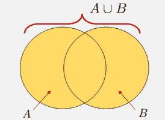

我们这样发音：A "并" B

两个集合（或事件）的**并集**定义为“包含在集合 A、集合 B 或两者中的所有元素。”用更简单的术语来说，它捕捉了至少属于一个集合的所有事物。

从逻辑角度来看，并集使用运算符**"或"**连接。如果你有计算机科学背景，这可能会让你感到熟悉，因为它与编程中使用的逻辑“或”运算符相一致。

### 1.1. 美国足球数据：并集的实际应用

想象一下，你是一名美国国家足球队的データサイエンティスト，负责分析球队的表现。主教练走到你面前，提出了一个简单的问题（考虑到你的 200K 美元薪水，这个问题可能太简单了）：

“你能识别出以下比赛吗：

1.  球队在主场**输掉了比赛**（在美国的体育场），

1.  球队**至少以两球之差被击败**，或者

1.  两者（球队**主场输掉比赛并且至少以两球之差**）？

作为一名勤奋的数据科学家，你首先将问题分解为计算和识别这些场景。在备战 2026 年世界杯的同时，检查相关的统计数据也很有用，例如球队主场输球的频率或比赛中至少进两球的情况。

这里有一个例子，使用了 10 场最近国家队比赛的资料：

+   球队主场**输掉比赛**的比赛：{1, 3, 5, 7}

+   球队**至少以两球之差被击败**的比赛：{2, 3, 4, 5, 9}

为了回答教练的问题，你计算了这些事件的**并集**，它包括发生任一条件或两者都发生的所有比赛。结果是：**{1, 2, 3, 4, 5, 7, 9}**

这些比赛代表了分析出错的机会。你将这份清单交给教练，建议他们在世界杯前审查这些比赛，以确定改进的领域。

> 非常简单，对吧？现在让我们来谈谈交集。

* * *

## 2. 交集：P(A∩B)

两个集合（或事件）的**交集**定义为“存在于集合 A 和集合 B 中的元素。”用更简单的术语来说，它确定了同时属于**两个集合**的元素。

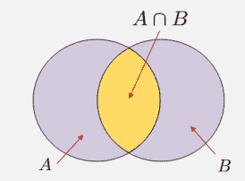

我们这样发音：A "交集" B

虽然集合的**并集**使用逻辑运算符**"或"**连接，但**交集**使用逻辑运算符**"与"**连接。这意味着只有当结果同时满足两个条件时，它才属于交集。

### 2.1. 美国足球数据：交集的实际应用

让我们回到美国足球数据，但这次，主教练要求进行更深入的分析：

“你能识别出以下比赛吗：

1.  球队**主场输掉比赛**（在美国的体育场），并且

1.  球队**至少以两球之差被击败**。

在回顾**并集**的例子时，你可能想过，“分析我们输掉比赛超过两球的情况，而不是仅仅看所有主场失利或惨败的比赛，不是更有洞察力吗？”如果是这样，你直觉上是在考虑这两组事件的**交集**——即使你没有意识到这一点！

回顾数据：

+   球队**主场失利**的比赛：{1, 3, 5, 7}

+   球队**至少以两球劣势败北**的比赛：{2, 3, 4, 5, 9}

为了回答教练的问题，你需要计算这些事件的**交集**，它只包括符合两个事件条件的比赛。结果是：**{3, 5}**

专注于这些比赛可以让球队识别出模式或弱点，例如防守问题或主场作战时没有奏效的策略。通过分析这些具体的比赛结果，教练团队可以采取行动步骤来改善主场的表现和防守策略，为未来的比赛做准备。

这个逻辑上的“和”有助于关注满足两个标准的结果，这有助于识别模式或趋势，例如球队防守表现与输球相关的比赛。

* * *

现在我们已经涵盖了两个基本的概率概念——**并集**和**交集**——我们可以更深入地探讨计算概率时至关重要的其他方面：**独立性和不交集**

## 3. 独立性和不交集

通常当我们谈论事件之间的概率时，明确事件是**“独立”**还是**“不交集”**是很重要的。这两个概念在最初可能难以区分，如果你没有仔细注意，它们可能看起来很相似。

然而，它们在本质上是有区别的，这种区别导致了完全不同的概率计算。

+   **不交集事件**是互斥的，不能同时发生

+   **独立事件**不会相互影响，但可以同时发生。

我会先更具体地解释不交集的概念，然后再讨论独立性。

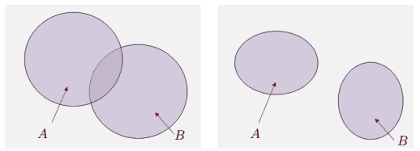

(左) A & B 是重叠的 | (右) A & B 是不交集

### 3.1. 不交集：P(A∩B)=0

不交集事件描述的是两种事件**永远不会同时发生**的情况，这意味着它们没有共同的结果。请记住这个陈述，因为它对于独立性（我将在下一节中讨论）是一个极其重要的区分。

从数学上讲，如果事件 A 和事件 B 是不交集的，它被定义为：

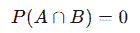

不交集

用更简单的话说，一个事件的发生**保证**另一个事件不可能发生。我个人认为用例子来可视化会更简单。

### **参加超级碗和冰岛度假航班？**

想象一下，你计划在**2025 年 2 月 9 日**度假。你将飞往冰岛，在温泉中放松。然而，你意识到这一天恰好是老鹰队和雷电队之间的超级碗 LIX 比赛日。航班起飞时间在超级碗期间。

那么，让我问你一个问题。你能够同时到达冰岛和超级碗的概率是多少？

+   **事件 A**：你正在乘坐飞往冰岛的飞机航班。

+   **事件 B**：你将亲自参加超级碗。

显然，这两个事件不能同时发生。如果你在飞往冰岛的航班上，就不可能物理地出现在超级碗现场，反之亦然。这些事件是**互斥的**。

互斥事件是相互排斥的——如果其中一个发生，另一个就不能发生。你**飞往冰岛的概率 "P[A]"**和**亲自参加超级碗的概率 "P[B]"**为零！

这是概率中一个关键的概念，因为它通过确保事件之间没有重叠来简化计算。

### 3.2\. 独立性：P(A∩B) = P(A) ⋅ P(B)

独立事件是**不影响彼此**的事件，这意味着一个事件的发生对另一个事件发生的概率没有影响。

定义可能听起来与互斥事件非常相似，然而，与互斥事件不同，独立事件可以同时发生。

从数学上讲，如果一个事件 A 和事件 B 是独立的，它被定义为：

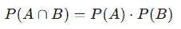

独立性

这意味着这两个事件同时发生的概率仅仅是它们各自概率的乘积。

### 雷电队赢得超级碗和度假航班延误？

让我们看看一个类似的场景，涉及超级碗和你的冰岛度假航班。

+   **事件 A**：堪萨斯城酋长队赢得超级碗。

+   **事件 B**：你的度假航班飞往冰岛延误。

这些事件是**独立的**，因为雷电队是否赢得比赛对你的航班延误的可能性没有影响。同样，航班的状态也不会影响超级碗的结果。

这两个事件可以同时发生（雷电队赢得比赛并且你的航班延误），但它们是无关的。

### 3.3\. TL;DR

我会快速给你总结一下差异，以便你稍后回顾。

+   **互斥事件**是相互排斥的，不能同时发生（例如，同时参加超级碗和飞往冰岛）。

+   **独立事件**不会相互影响，可以同时发生（例如，雷电队赢得比赛并且你的航班延误）。

* * *

## 4\. 补集（Aᶜ）和差集（AB）

现在我们已经涵盖了概率中大多数基本的基础概念，让我们继续到最后两个：**补集**和**差集**。

这些可能是最简单可视化和理解的事件，但它们在处理高级概率主题时仍然非常重要。

### 快速术语概述：全集（Ω）

在我们继续前进到补集和差集之前，让我们快速回顾一下**全集**的概念，通常表示为Ω。这是集合论和概率论中的一个基本概念，理解它将使补集和差集等概念更加清晰。

**全集**是包含实验或场景所有可能结果的集合。它代表所有考虑元素构成的“宇宙”。

> **我们讨论的每个集合或事件都是Ω的子集**。

**回到足球比赛**：如果分析美国国家足球队 10 场比赛，全集可能代表所有比赛：Ω={1,2,3,4,5,6,7,8,9,10}

**掷骰子**：对于标准的六面骰子，全集是：Ω={1,2,3,4,5,6}

全集为定义其他集合提供了一个**参考点**。没有Ω，很难确定给定集合的“外部”是什么。

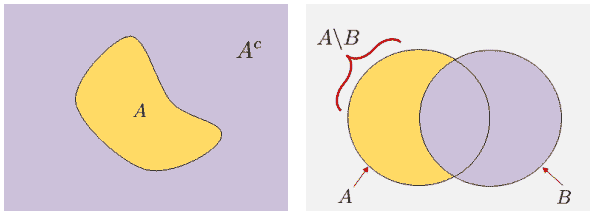

（左）Aᶜ | （右）AB

### 4.1\. 补集（Aᶜ）

集合 A 的**补集**包括全集（Ω）中不在 A 中的所有元素。用更简单的说法，它代表所有不属于 A 的结果。

### 足球示例（补集）

+   我们的全集（Ω）是足球队的所有 10 场比赛：

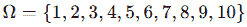

+   我们的事件 A 是**“球队主场失利”**：

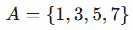

**补集**，Aᶜ，代表所有球队**没有主场失利**的比赛。这包括客场比赛或主场获胜的比赛。

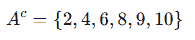

在这个例子中，Aᶜ帮助教练分析球队在主场或客场表现更好的比赛，重点关注成功的成果。

### 4.2\. 差集（A∖B）

两个集合之间的**差集**，A∖B，是所有在 A 中但不在 B 中的元素的集合。将其视为从 A 中减去 B。

### 足球示例（差集）

+   集合 A：球队**主场失利**的比赛：

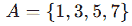

+   集合 B：球队**至少以两球之差被击败**的比赛：

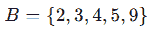

**差集** A∖B 代表所有球队主场失利**但至少没有输掉两球**的比赛。本质上，这是 A 中球队仅以一球之差失利的子集：

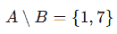

在这种情况下，教练可以关注球队主场险些失利的情况，可能识别出在接近比赛中的改进机会。

### 4.3\. 简要概述

我会再次快速为您总结，以便您稍后可以回顾。

+   **补集（Aᶜ）**有助于识别不属于特定事件的结果，例如球队没有主场失利的情况。

+   **差集（A∖B）**将焦点缩小到特定结果子集，例如球队仅以一球之差主场失利的情况。

* * *

## 5\. 简要概述

为了完成这篇文章，我认为最好给你们一个整体的 TL;DR，以及一些在计算概率时需要记住的有用操作。首先，让我给你们一个 TL;DR 的表格。

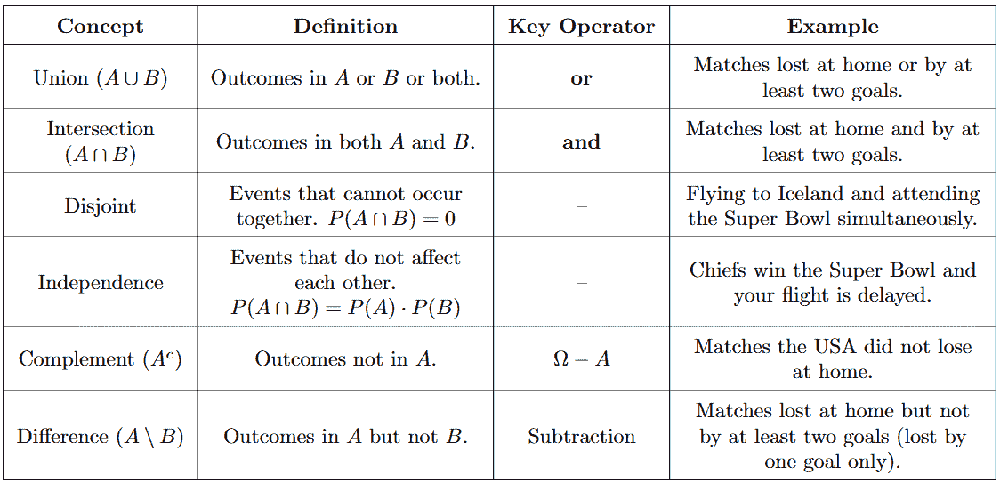

TL;DR

### 5.1. 概率中的有用操作

**A. 交换律**：对于两个事件 A 和 B，组合事件的顺序并不重要。

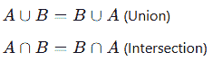

**B. 结合律**：对于三个事件 A、B 和 C，事件的分组顺序并不重要。

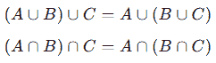

**C. 分配律**：交集分配到并集，反之亦然

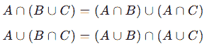

**D. 德摩根定律**：并集和交集的补集

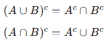

### 5.2. 概率中的有用规则

**A. 加法规则**：对于两个事件的并集，它总是遵循以下方程

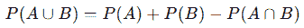

事件 A 和 B 的并集

然而，如果 A 和 B 是互斥的，那么你可以走捷径：

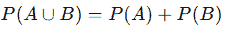

**B. 乘法规则**：对于两个事件的交集，如果 A 和 B 是独立的，它总是遵循以下方程

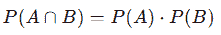

A 和 B 的交集（独立）

然而，如果它们不是独立的（通常情况下是这样的），你必须使用条件概率。这是下一篇文章中我会讨论的话题！

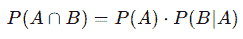

**C. 补规则**：事件 A 的补集是 Aᶜ（不在 A 中的所有事物）

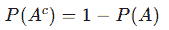

Aᶜ

* * *

我希望你们能学到一些东西！

## 与我联系！

+   **[领英](https://www.linkedin.com/in/sahn1998/)**，

+   **电子邮件**，**[网站](https://sunghyun-ahn.com/)**

如果你已经读到这儿，我假设你是一位有志成为数据科学家的人，数据科学领域的教师，一位希望磨练技艺的专业人士，或者只是不同领域的一位热切学习者！我很乐意和你聊聊任何话题！

> *对于那些对我的图片感到好奇的人：除非另有说明，所有图片均为作者（我自己）提供* 
> 
> [**Sunghyun Ahn – Medium**](https://medium.com/@sahn1998)
