# AWS 上创建 S3 存储的入门指南

> 原文：[`towardsdatascience.com/beginners-guide-to-creating-a-s3-storage-on-aws/`](https://towardsdatascience.com/beginners-guide-to-creating-a-s3-storage-on-aws/)

## <mdspan datatext="el1745296693599" class="mdspan-comment">简介</mdspan>

AWS 是一家知名的云服务提供商，其主要目标是分配服务器资源，以便软件工程师部署他们的应用程序。AWS 提供许多服务，其中之一是 EC2，它提供虚拟机以在云中运行软件应用程序。

> 然而，对于数据密集型应用程序，将数据存储在 EC2 实例中并不总是最佳选择。虽然 EC2 提供快速的读写速度，但它并不适合可扩展性。更好的替代方案是使用 S3 存储。

## 在 EC2 与 S3 中存储数据

亚马逊 S3 专门设计用于存储大量非结构化数据：

+   它有一个高度可靠的弹性系统，这使得耐用率超过 99.99%。

+   S3 会自动在多个服务器之间复制数据，以防止潜在的数据丢失。

+   它与其他 AWS 服务无缝集成，用于数据分析和机器学习。

+   在 S3 中存储数据与 EC2 相比，具有显著的成本效益。

> EC2 可能更受欢迎的主要用例是当需要频繁访问数据时。例如，在机器学习模型训练期间，数据集必须为每个批次重复读取。在大多数其他情况下，S3 是更好的选择。

## 关于本文

本文的目标是演示如何创建基本的 S3 存储。到教程结束时，我们将拥有一个可以远程访问上传图片的功能性 S3 存储。

> 为了保持对关键方面的关注，我们将仅涵盖存储创建过程，而不会深入最佳安全实践。

## 教程

### # 01\. 创建 S3 存储

要执行与 S3 存储管理相关的任何操作，从服务菜单中选择 ***存储*** 选项。在出现的子菜单中，选择 ***S3***。

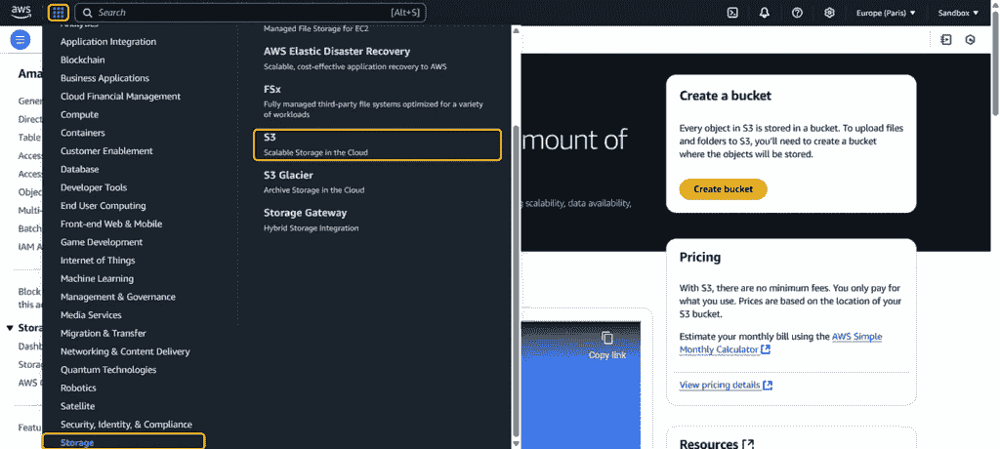

AWS 将数据组织成称为**存储桶**的集合。要创建存储桶，点击 ***创建存储桶***。

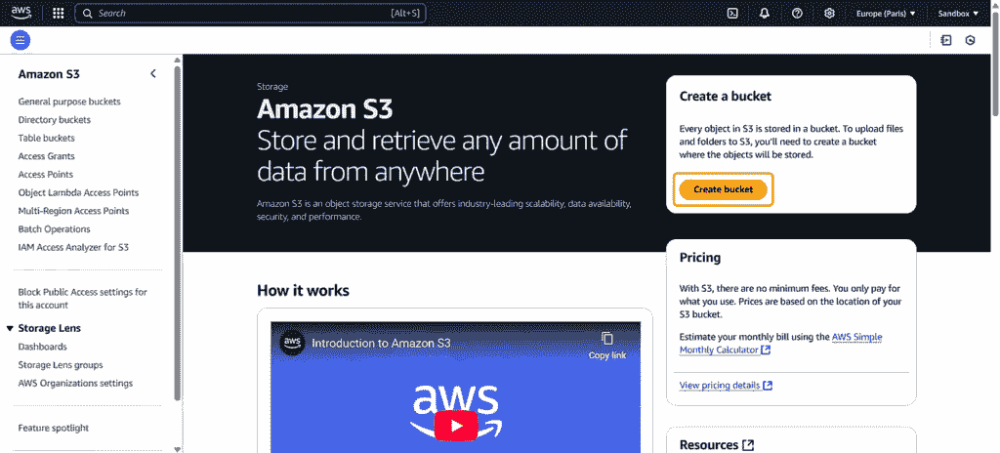

每个存储桶都需要一个唯一的全局名称。大多数其他设置可以保留为默认值。

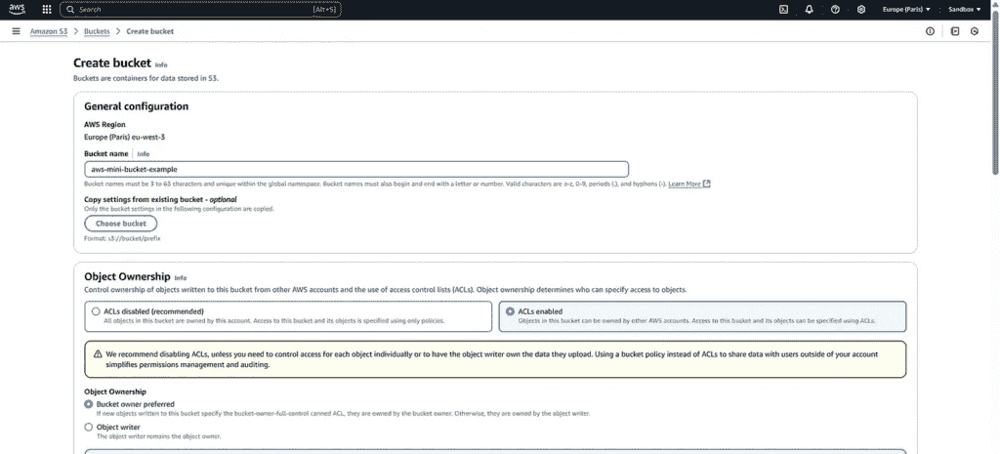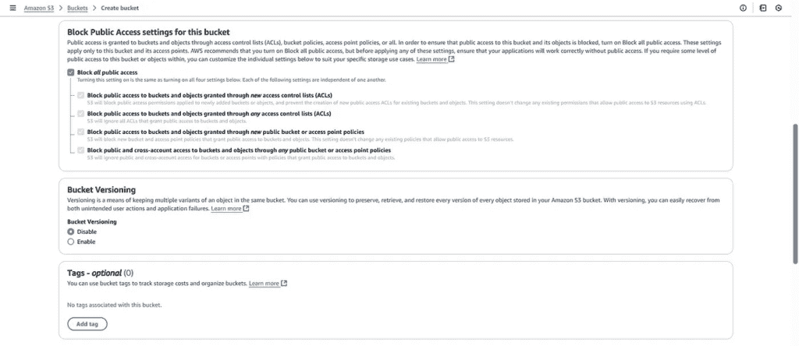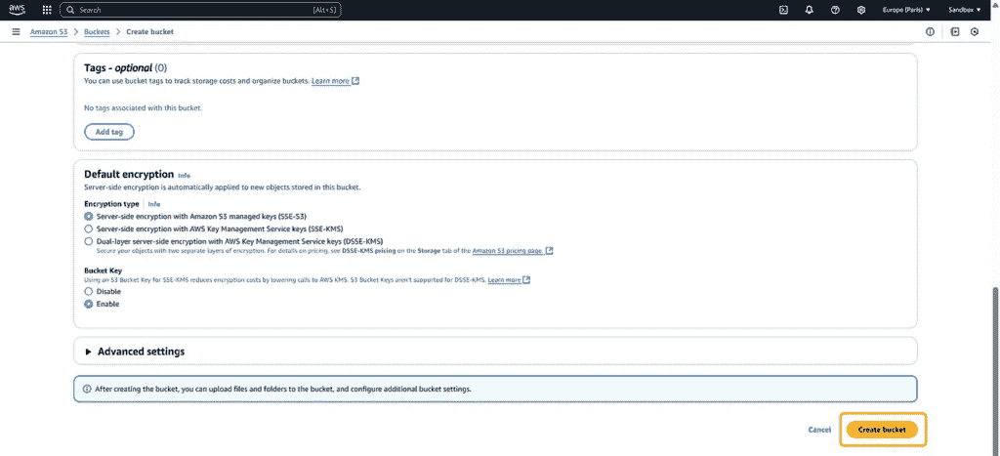

选择所有选项后，点击 ***创建存储桶***。几秒钟后，AWS 将您重定向到存储桶管理面板。

### # 02\. 创建文件夹（可选步骤）

> S3 中的文件夹功能类似于标准计算机文件夹，有助于组织分层数据。此外，存储在 S3 文件夹中的任何文件都将有一个包含文件夹路径的 URL 前缀。

创建文件夹，点击 ***创建文件夹*** 按钮。

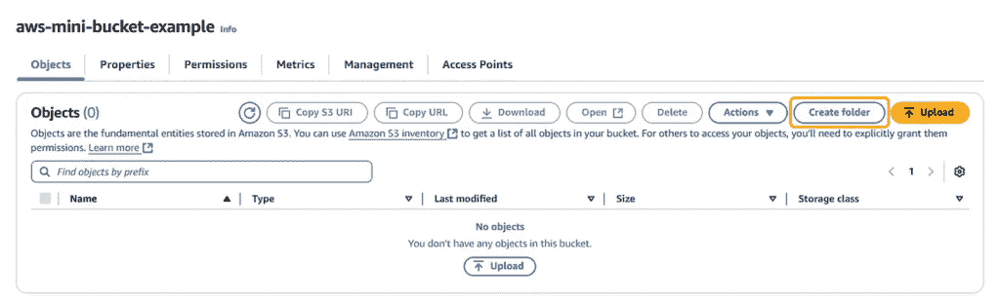

在出现的窗口中，为文件夹选择一个自定义名称。

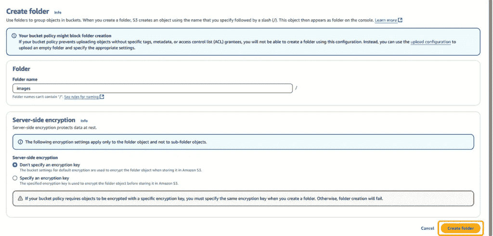

点击**创建文件夹按钮**后，文件夹将被创建！您现在可以导航到它。由于尚未上传任何图片，目前文件夹是空的，但在步骤 4 中我们将添加图片。

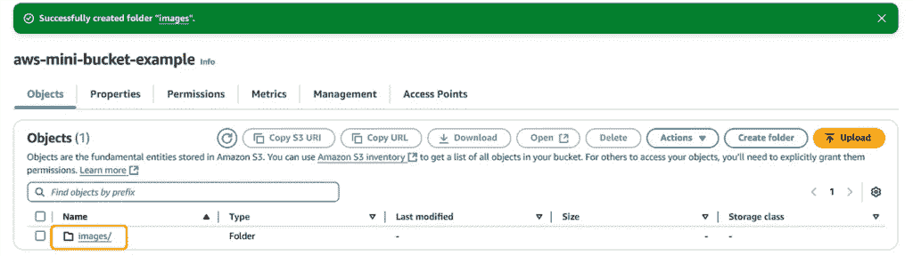

### # 03\. 调整数据访问

作为提醒，我们的目标是创建一个公开可见的图像存储库，允许远程访问。为了实现这一点，我们需要调整数据访问策略。

通过点击桶名称下的**权限**标签页，您将看到一系列选项来修改访问设置。

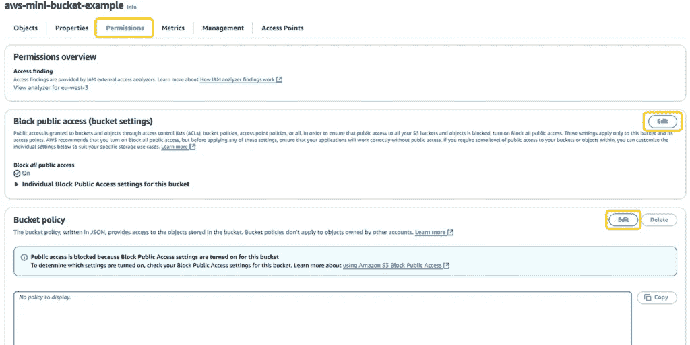

我们需要解除公开访问的限制，因此点击界面中的相应**编辑按钮**，并取消选中所有与访问阻止相关的复选框。

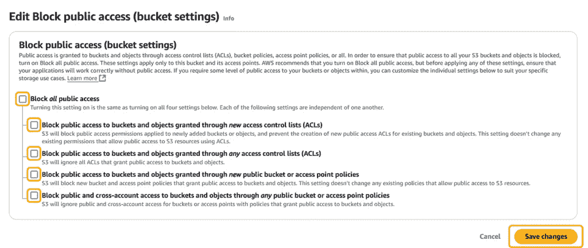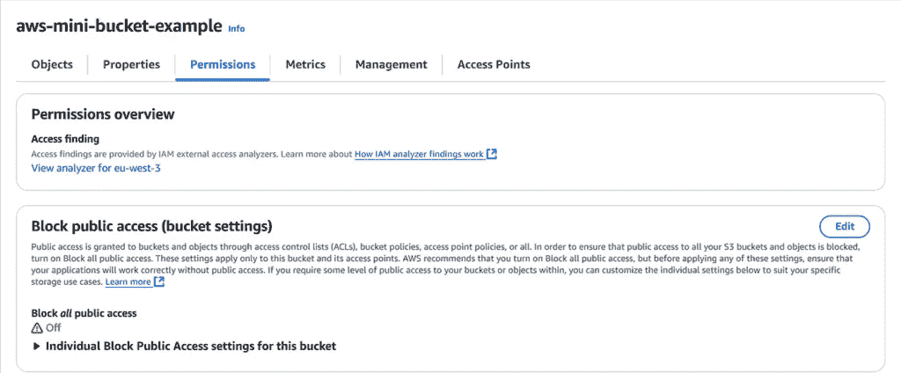

保存更改后，我们应该看到一个感叹号图标，旁边有*“关闭”*文本。然后，导航到**桶策略**部分并点击**编辑**。

要允许读取访问，插入以下策略文本：

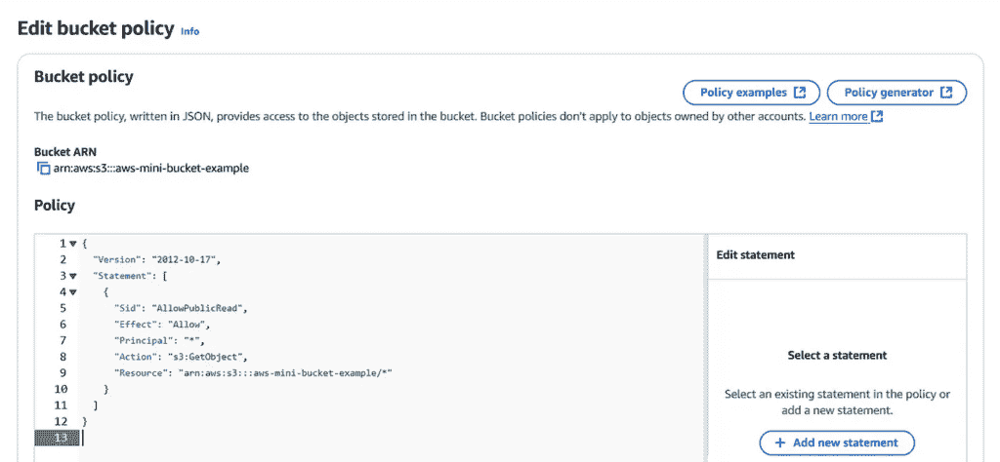

### # 04\. 上传图片

现在是时候上传图片了。为此，导航到创建的*“images”*文件夹，并点击**上传**按钮。

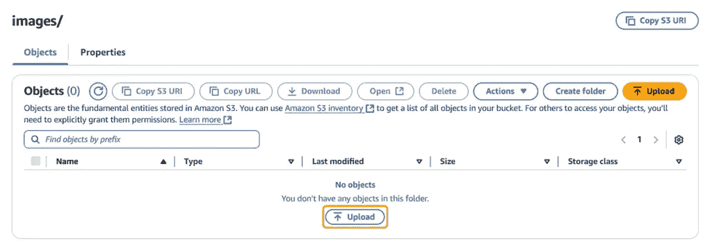

点击**添加文件**按钮，这将打开您的计算机上的文件资源管理器。从那里选择并导入图片。

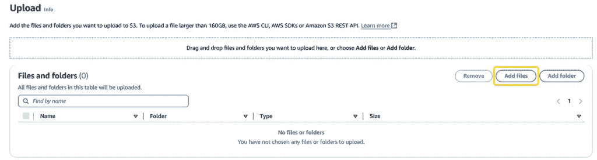

根据导入图片的数量和大小，AWS 可能需要一些时间来处理它们。

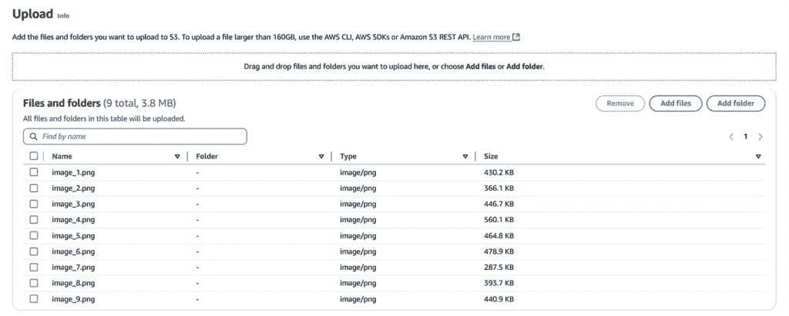

在这个例子中，我已导入九张图片。

### # 05\. 访问数据

图片成功导入后，点击任何一个文件名以获取更多信息。

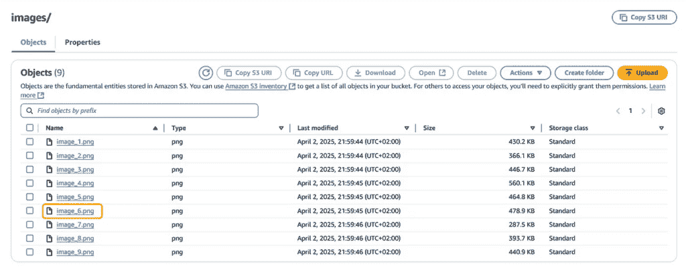

在打开的面板中，您将看到与所选图像相关的元数据。正如我们在*“对象 URL”*字段中看到的那样，AWS 为我们的图像创建了一个唯一的 URL！

此外，我们还可以注意到 URL 中包含 images/前缀，这与我们上面定义的文件夹结构完全对应！

最后，由于我们已经授权了读取访问权限，现在我们可以公开访问这个 URL。

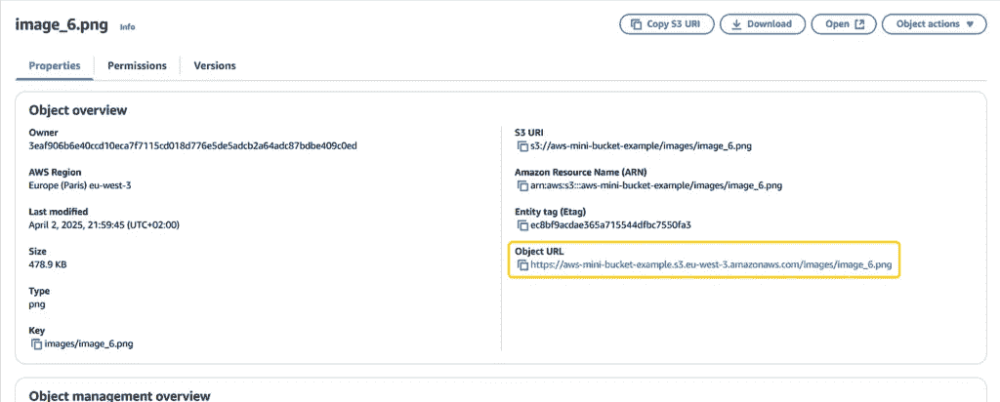

如果您点击图像 URL 并将其复制到浏览器的地址栏中，图像将被显示！

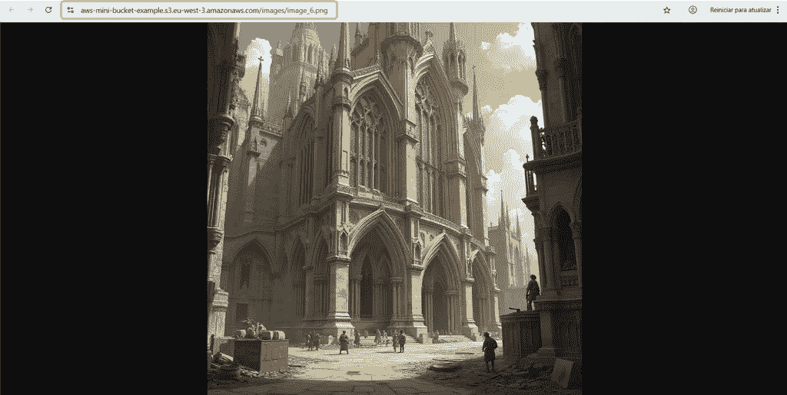

令人惊讶的是，您现在可以创建一个格式为`https://<bucket_url>/<folder_path>/<filename>`的 URL 模板。

通过这样做，您可以在程序中动态替换<filename>字段以访问图像并执行数据处理。

## 结论

在本文中，我们介绍了 AWS S3 存储系统，这对于存储大量非结构化数据非常有用。凭借其先进的可扩展性和安全机制，与 EC2 容器相比，S3 在以更低成本组织大量数据量方面非常理想。

*所有图片除非另有说明，均为作者原创。*

## 与我联系

+   **[Medium](https://medium.com/@slavahead)** ✍️

+   **[领英](https://www.linkedin.com/in/vyacheslav-efimov/)** 🧑‍💻
