# 魔法的背后：张量如何驱动 Transformer

> 原文：[`towardsdatascience.com/behind-the-magic-how-tensors-drive-transformers/`](https://towardsdatascience.com/behind-the-magic-how-tensors-drive-transformers/)

## <mdspan datatext="el1745540862691" class="mdspan-comment">介绍</mdspan>

Transformer 改变了人工智能的工作方式，尤其是在理解和从数据中学习方面。这些模型的核心是**张量**（一种广义的数学矩阵，有助于处理信息）。当数据通过 Transformer 的不同部分时，这些张量会经历不同的变换，帮助模型理解句子或图像等事物。了解张量在 Transformer 内部的工作原理可以帮助你理解当今最智能的 AI 系统是如何实际工作和思考的。

## 本篇文章涵盖的内容和未涵盖的内容

✅ **本文涉及：**

+   在 Transformer 模型中，张量从输入到输出的流动。

+   确保在整个计算过程中保持维度一致性。

+   张量在各个 Transformer 层中经历的逐步变换。

❌ **本文不涉及：**

+   对 Transformer 或深度学习的通用介绍。

+   Transformer 模型详细架构

+   Transformer 的训练过程或超参数调整。

## 张量在 Transformer 中的作用

Transformer 由两个主要组件组成：

+   **编码器**：处理输入数据，捕捉上下文关系以创建有意义的表示。

+   **解码器**：利用这些表示生成连贯的输出，逐个预测每个元素。

张量是经过这些组件的基本数据结构，经历多次变换以确保维度一致性和适当的信息流动。

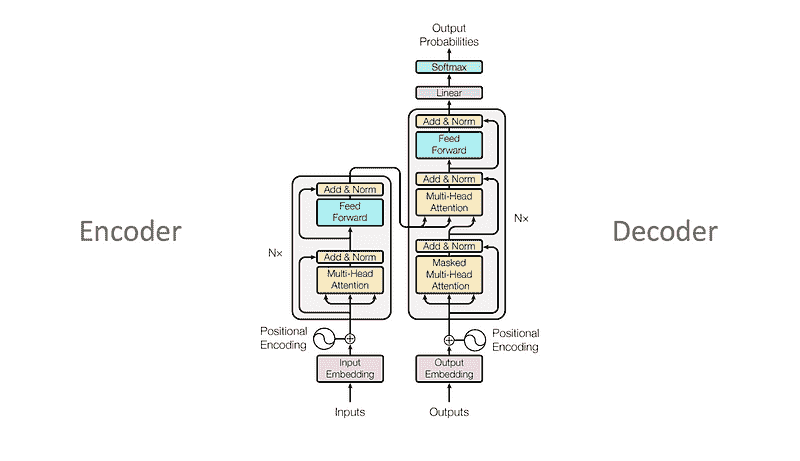

研究论文中的图片：Transformer 标准架构

## 输入嵌入层

在进入 Transformer 之前，原始输入标记（单词、子词或字符）通过**嵌入层**转换为密集向量表示。这一层作为一个查找表，将每个标记向量映射到其他单词的语义关系。

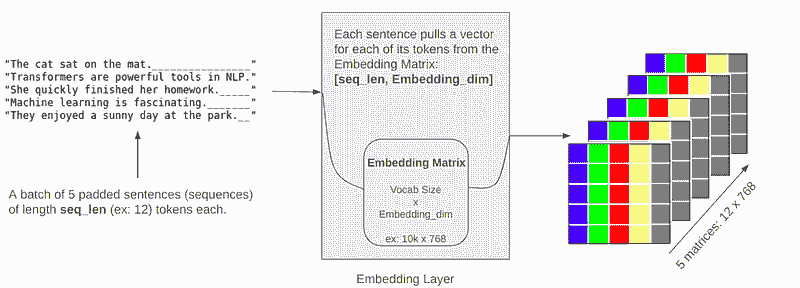

作者图片：张量通过嵌入层

对于一个包含五个句子、每个句子长度为 12 个标记、嵌入维度为 768 的批次，张量形状为：

+   **张量形状**：`[batch_size, seq_len, embedding_dim] → [5, 12, 768]`

在嵌入之后，**位置编码**被添加，确保顺序信息得到保留，同时不改变张量形状。

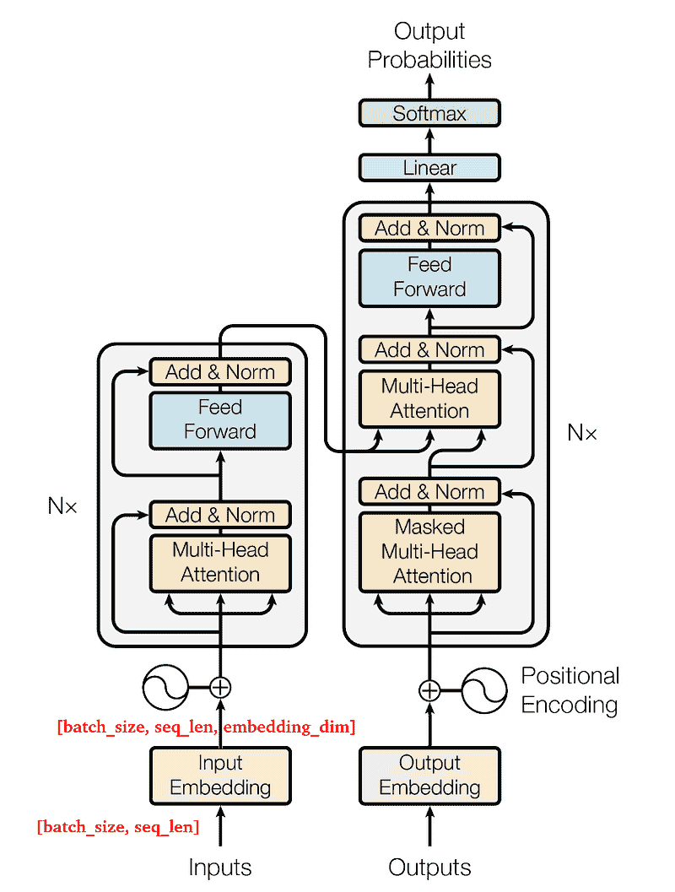

研究论文修改后的图片：工作流程情况

## 多头注意力机制

Transformer 最关键的部分之一是**多头注意力（MHA）机制**。它作用于从输入嵌入中派生出的三个矩阵：

+   **查询 (Q)**

+   **关键 (K)**

+   **值 (V)**

这些矩阵是通过使用可学习的权重矩阵生成的：

+   **Wq, Wk, Wv** 的形状为 `[embedding_dim, d_model]`（例如，`[768, 512]`）。

+   结果的 Q, K, V 矩阵的维度

    `[batch_size, seq_len, d_model]`。

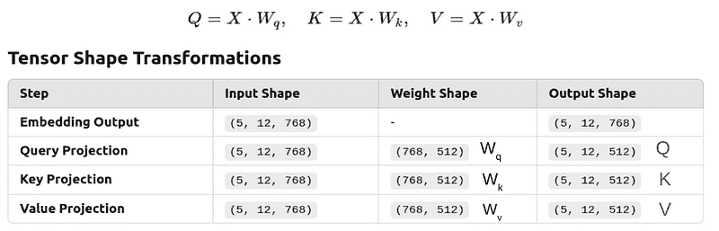

作者的图像：显示嵌入、Q、K、V 张量形状/维度的表格

## 将 Q, K, V 分割成多个头部

为了有效的并行化和改进学习，MHA 将 Q, K, V 分割成多个头部。假设我们有 8 个注意力头：

+   每个头在 `d_model / head_count` 的子空间上操作。

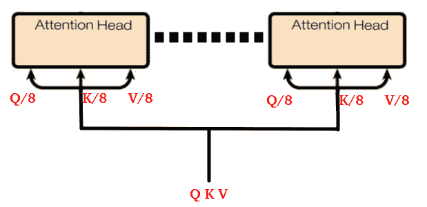

作者的图像：多头注意力

+   重塑的张量维度是 `[batch_size, seq_len, head_count, d_model / head_count]`。

+   示例：`[5, 12, 8, 64]` 调整为 `[5, 8, 12, 64]`，以确保每个头都能接收到一个单独的序列片段。

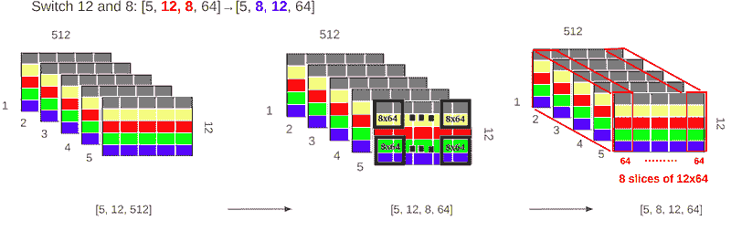

作者的图像：张量重塑

+   因此，每个头都会得到其份额的 Qi, Ki, Vi。

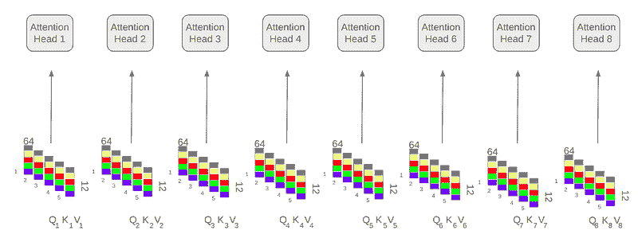

作者的图像：每个 Qi, Ki, Vi 发送到不同的头

## 注意力计算

每个头使用以下公式计算注意力：

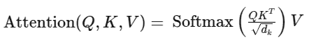

一旦计算了所有头的注意力，输出被连接起来并通过线性变换传递，恢复初始张量形状。

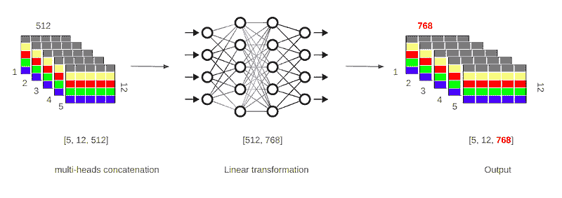

作者的图像：连接所有头的输出

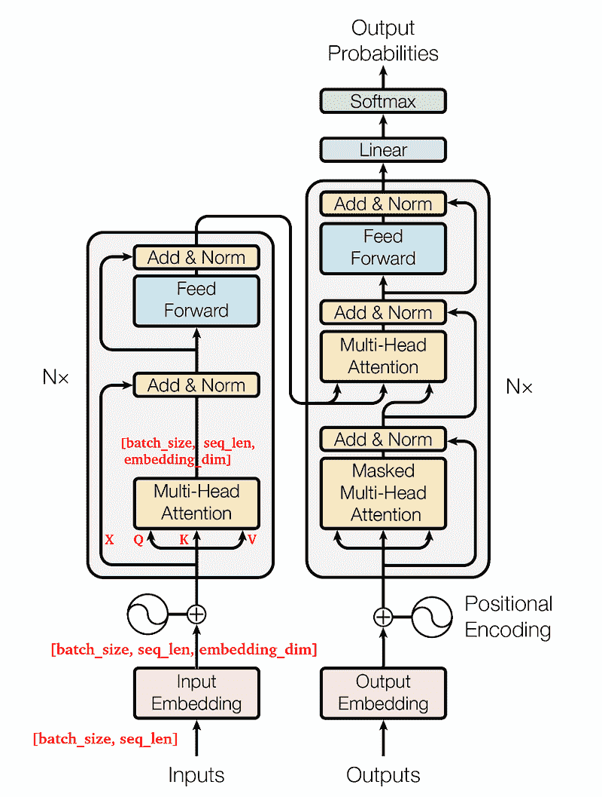

来自研究论文的修改图像：工作流程的情况

## 残差连接和归一化

在多头注意力机制之后，添加了 **残差连接**，然后是 **层归一化**：

+   残差连接：`Output = Embedding Tensor + Multi-Head Attention Output`

+   归一化：`(Output − μ) / σ` 以稳定训练

+   张量形状保持 `[batch_size, seq_len, embedding_dim]`

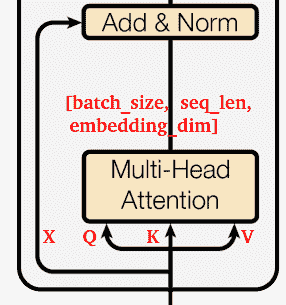

作者的图像：残差连接

## 前馈网络 (FFN)

在解码器中，**掩码多头注意力** 确保每个标记只关注前面的标记，防止未来信息的泄漏。

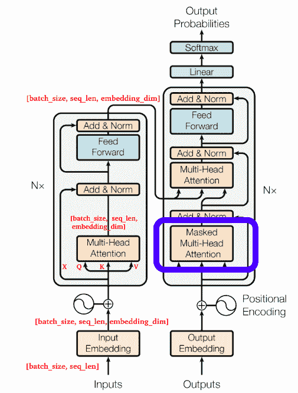

来自研究论文的修改图像：掩码多头注意力

这是通过使用形状为 `[seq_len, seq_len]` 的下三角掩码，其中上三角的值为 `-inf` 来实现的。应用此掩码确保 Softmax 函数使未来位置归零。

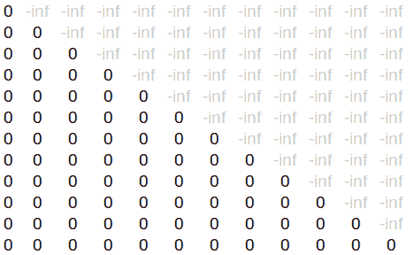

作者的图像：掩码矩阵

## 解码中的交叉注意力

由于解码器不完全理解输入句子，它利用 **交叉注意力** 来细化预测。在这里：

+   解码器从其输入（`[batch_size, target_seq_len, embedding_dim]`）生成查询 **(Qd)**。

+   编码器的输出作为键 **(Ke)** 和值 **(Ve)**。

+   解码器计算**Qd**和**Ke**之间的注意力，从编码器的输出中提取相关上下文。

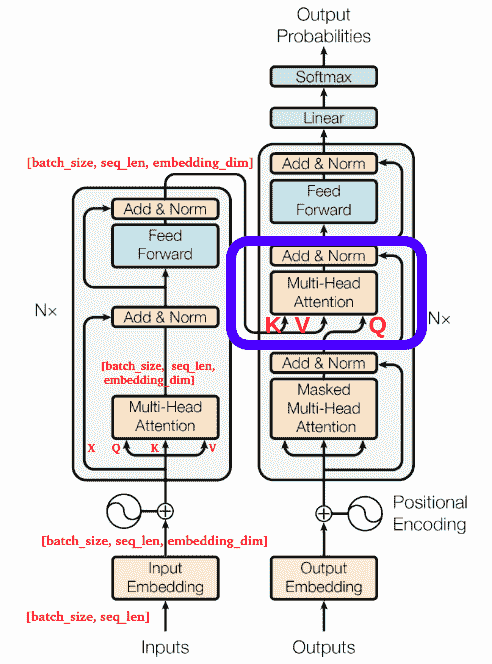

研究论文中的修改图像：交叉头注意力

## 结论

变换器使用**张量**来帮助它们学习和做出明智的决定。随着数据在网络中流动，这些张量会经历不同的步骤——比如被转换成模型可以理解的数字（嵌入），关注重要部分（注意力），保持平衡（归一化），以及通过学习模式的层（前馈）。这些变化确保数据在整个过程中保持正确的形状。通过理解张量的移动和变化，我们可以更好地了解 AI 模型的工作原理以及它们如何理解和创造类似人类的语言。
