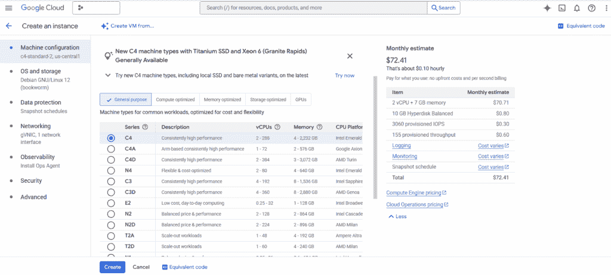
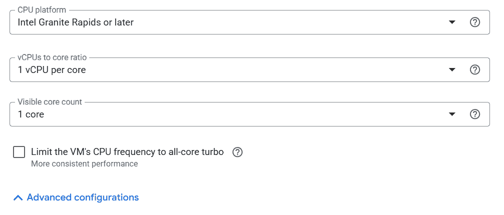
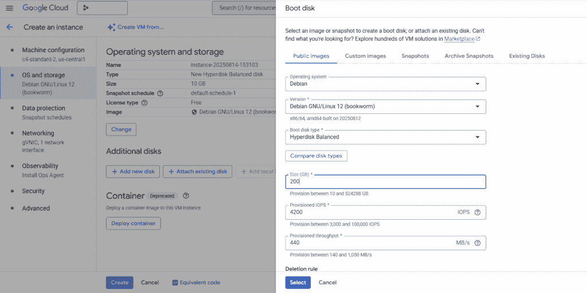

# 如何在 Google Cloud 上基准测试经典机器学习工作负载

> 原文：[`towardsdatascience.com/benchmarking-classical-machine-learning-workloads-on-google-cloud/`](https://towardsdatascience.com/benchmarking-classical-machine-learning-workloads-on-google-cloud/)

## <mdspan datatext="el1755898002223" class="mdspan-comment">为什么经典机器学习仍然重要</mdspan>

在 GPU 至上的时代，为什么现实世界的商业案例如此依赖经典机器学习和基于 CPU 的训练？答案是，对现实世界商业应用最重要的数据仍然是压倒性的**表格化、结构化和关系型**——想想欺诈检测、保险风险评估、客户流失预测和运营遥测。实证结果（例如，[Grinsztajn 等人*，* *为什么基于树的模型在典型表格数据上仍然优于深度学习？* (2022)，NeurIPS 2022 数据集和基准测试轨道](https://papers.neurips.cc/paper_files/paper/2022/file/0378c7692da36807bdec87ab043cdadc-Paper-Datasets_and_Benchmarks.pdf)）表明，对于这些领域，**随机森林**、**梯度提升**和**逻辑回归**在准确性和可靠性方面优于神经网络。它们还提供了在受监管行业如银行和医疗保健中至关重要的可解释性。

由于**数据传输延迟**（[PCIe](https://www.intel.com/content/www/us/en/gaming/resources/what-is-pcie-4-and-why-does-it-matter.html)开销）和一些基于树的算法的**扩展性差**，GPU 在这里往往失去了优势。因此，**基于 CPU 的训练**仍然是云平台上针对小型中型结构化数据工作负载最具成本效益的选择。

在这篇文章中，我将向您介绍在[Google Cloud Platform (GCP)](https://cloud.google.com/) CPU 提供上基准测试传统机器学习算法的步骤，包括最近公开发布的[Intel® Xeon® 6](https://www.intel.com/content/www/us/en/products/details/processors/xeon.html)。（完全披露：我是英特尔的一名高级 AI 软件解决方案工程师。）

通过系统性地比较算法的运行时间、可扩展性和成本，我们可以基于证据做出决策，关于哪些方法在准确度、速度和运营成本之间提供了最佳权衡。

## Google Cloud 上的机器配置

前往[console.cloud.google.com](https://console.cloud.google.com/)，设置您的账单，然后转到“计算引擎”。然后点击“创建实例”以配置虚拟机（VM）。下面的图显示了由 Intel® Xeon® 6（代号 Granite Rapids）和第五代 Intel® Xeon®（代号 Emerald Rapids）CPU 驱动的[C4 VM 系列](https://cloud.google.com/compute/docs/general-purpose-machines#c4_series)。



在 Google Cloud 上设置虚拟机

超线程可能会引入性能可变性，因为两个线程会竞争同一核心的执行资源。为了获得一致的基准测试结果，将“vCPUs 到核心比例”设置为 1 可以消除这个变量——更多内容将在下一节中介绍。



在“高级配置”下可以设置 vCPUs 到核心的比例和可见核心计数。

在创建虚拟机之前，从左侧面板增加启动磁盘大小——200 GB 将足够安装本博客所需的软件包。



在 Google Cloud 上增加虚拟机的启动磁盘大小

## 非均匀内存访问（NUMA）意识

在多核、多插槽 CPU 上，内存访问是非均匀的。这意味着内存操作的延迟和带宽取决于哪个 CPU 核心正在访问哪个内存区域。如果你不控制 NUMA，你是在基准测试调度器，而不是 CPU，结果可能看起来不一致。“内存亲和性”正是通过控制哪些 CPU 核心访问哪些内存区域来消除这个问题的。Linux 调度器了解平台的 NUMA 拓扑结构，并试图通过在内存所在的节点上的处理器上调度线程来提高性能，而不是让调度器随机分配工作到整个系统。然而，没有显式的亲和性控制，你无法保证可靠的基准测试的一致放置。

让我们通过 XGBoost 和足够大的合成数据集进行一次 NUMA 实验，以测试内存的压力。

首先，配置一个跨越多个 NUMA 节点的虚拟机，SSH 到实例中，并安装依赖项。

```py
sudo apt update && sudo apt install -y python3-venv numactl
```

然后创建并激活一个 Python 虚拟环境来安装`scikit-learn`、`numpy`和`xgboost`。将下面的脚本保存为`xgb_bench.py`。

```py
import numpy as np
import xgboost as xgb
from sklearn.datasets import make_classification
from time import time

# 10M samples, 100 features
X, y = make_classification(n_samples=10_000_000, n_features=100, random_state=42)
dtrain = xgb.DMatrix(X, label=y)

params = {
    "objective": "binary:logistic",
    "tree_method": "hist",
    "max_depth": 8,
    "nthread": 0,  # use all available threads
}

start = time()
xgb.train(params, dtrain, num_boost_round=100)
print("Elapsed:", time() - start, "seconds")
```

接下来，以三种模式（`baseline / numa0 / interleave`）运行此脚本。至少重复每个实验 5 次，并报告平均值和标准差。（这需要另一个简单的脚本！）

```py
# Run without NUMA binding
python3 xgb_bench.py
```

```py
# Run with NUMA binding to a single node
numactl --cpunodebind=0 --membind=0 python3 xgb_bench.py
```

当将任务分配给特定的物理核心时，使用`--physcpubind`或`-C`选项而不是`--cpunodebind`。

```py
# Run with interleaved memory across nodes
numactl --interleave=all python3 xgb_bench.py
```

哪个实验的平均值最小？标准差如何？在解释这些数字时，请记住，

+   `numa0`的标准差较低表明局部性更稳定。

+   与`baseline`相比，`numa0`的均值较低表明跨节点流量正在损害你，并且

+   如果`interleave`缩小了与`baseline`的差距，那么你的工作负载对带宽敏感，并从分散页面中受益——这可能会以延迟为代价。

如果这些都不适用于基准测试，那么工作负载可能是计算密集型的（例如，浅树，小数据集），或者虚拟机可能只暴露一个 NUMA 节点。

## 选择合适的基准测试

当在 CPU 上基准测试经典机器学习算法时，你应该构建自己的测试框架，或者利用现有的基准测试套件，或者如果适当，使用混合方法。

现有的测试套件，如 [scikit-learn_bench](https://github.com/IntelPython/scikit-learn_bench) 和 [Phoronix 测试套件 (PTS)](https://github.com/phoronix-test-suite/phoronix-test-suite)，当你需要标准化、可重复的结果，其他人可以验证并与之比较时非常有用。它们在评估像随机森林、SVM 或 XGBoost 这样的成熟算法时尤其有效，因为标准数据集提供了有意义的见解。你使用的数据集直接影响了你的基准测试揭示的内容。请随时查阅官方的 [scikit-learn 基准测试](https://github.com/scikit-learn/scikit-learn/tree/main/benchmarks) 以获取灵感。这里还有一个你可以用来创建自定义测试的样本集。

| **数据集** | **大小** | **任务** | **来源** |
| --- | --- | --- | --- |
| Higgs | 1100 万行 | 二分类 | [UCI ML 仓库](https://archive.ics.uci.edu/dataset/280/higgs) |
| 航班延误 | 变量 | 多类分类 | [BTS](https://www.transtats.bts.gov/ot_delay/ot_delaycause1.asp) |
| 加利福尼亚住房 | 2K 行 | 回归 | `sklearn.datasets.fetch_california_housing` |
| 合成 | 可变 | 缩放测试 | `sklearn.datasets.make_classification` |

合成缩放数据集特别有用，可以揭示缓存、内存带宽和 I/O 的差异。

在本博客的其余部分，我们将说明如何使用开源的 scikit-learn_bench 运行实验，该工具目前支持 scikit-learn、cuML 和 XGBoost 框架。

## 安装和基准测试

一旦初始化 GCP 虚拟机，你就可以通过 SSH 进入实例，并在你的终端中执行以下命令。

```py
sudo apt update && sudo apt upgrade -y 
sudo apt install -y git wget numactl
```

要在 GCP 虚拟机上安装 Conda，你需要考虑 CPU 架构。如果你不确定你的虚拟机架构，你可以运行

```py
uname -m
```

在继续之前

```py
wget https://repo.anaconda.com/miniconda/Miniconda3-latest-Linux-x86_64.sh -O ~/miniconda.sh

# Use the installer for Linux aarch64 if your VM is based on Arm architecture.
# wget https://repo.anaconda.com/miniconda/Miniconda3-latest-Linux-aarch64.sh -O ~/miniconda.sh
```

接下来，你需要执行脚本并接受服务条款（ToS）。

```py
bash ~/miniconda.sh
source ~/.bashrc
```

最后，从 GitHub 克隆最新的 scikit-learn_bench，创建一个虚拟环境并安装所需的 Python 库。

```py
git clone https://github.com/IntelPython/scikit-learn_bench.git
cd scikit-learn_bench
conda env create -n sklearn_bench -f envs/conda-env-sklearn.yml
conda activate sklearn_bench
```

在这个阶段，你应该能够使用 [sklbench 模块](https://github.com/IntelPython/scikit-learn_bench/tree/main/sklbench) 和特定的配置运行基准测试：

```py
python -m sklbench --config configs/xgboost_example.json
```

默认情况下，`sklbench`对标准 scikit-learn 实现及其由**sklearnex**（Intel 的加速扩展）提供的优化版本——或其他受支持的框架如 cuML 或 XGBoost——进行基准测试，并将结果以及硬件和软件元数据记录到`result.json`中。您可以使用`--result-file`自定义输出文件，并包含`--report`以生成 Excel 报告（`report.xlsx`）。有关所有受支持选项的列表，请参阅[文档](https://github.com/IntelPython/scikit-learn_bench/blob/main/sklbench/report/README.md#arguments)。

如前所述，您可以使用`numactl`将进程及其子进程固定到特定的 CPU 核心。以下是使用`numactl`运行`sklbench`并将它绑定到选定核心的方法：

```py
cores="0-3"
export runid="$(date +%Y%m%d%H%M%S)"

numactl --physcpubind $cores python3 -m sklbench \
  --config configs/regular \
  --filters algorithm:library=sklearnex algorithm:device=cpu algorithm:estimator=RandomForestClassifier \
  --result-file $result-${runid}.json 
```

## 结果解读和最佳实践

[报告生成器](https://github.com/IntelPython/scikit-learn_bench/tree/main/sklbench/report)允许您组合多次运行的结果文件。

```py
python -m sklbench.report --result-files <result 1> <result 2>
```

云决策的真实指标是每项任务的成本，即，

*每项任务的成本 = 运行时间（小时）x 每小时价格*。

现实世界的部署很少像单次基准测试那样运行。为了准确计算每项任务的成本，考虑 CPU 加速行为、云基础设施的变异性以及内存拓扑结构是有用的，因为它们都可以以单次测量无法捕捉的方式影响性能。为了更好地反映实际的运行时间特性，我建议从预热迭代开始以稳定 CPU 频率调整。然后多次运行每个实验以考虑系统噪声和瞬态效应。报告平均值和标准差有助于揭示一致的趋势，而当方差较高时，使用中位数可能更稳健，尤其是在云环境中，邻近的噪声邻居或资源竞争可能会扭曲平均值。为了确保可重复性，重要的是要固定软件包版本并使用一致的虚拟机镜像快照。在结果中包含 NUMA 配置有助于他人理解内存局部性效应，这可能会显著影响性能。像 scikit-learn_bench 这样的工具自动化了许多这些步骤，使得生成既具有代表性又可重复的基准测试变得更加容易。

如果您觉得这篇文章有价值，请考虑与您的网络分享。有关更多 AI 开发教程内容，请访问[Intel® AI 开发资源](https://www.intel.com/content/www/us/en/developer/topic-technology/artificial-intelligence/overview.html)。

***致谢***

*作者感谢 Neal Dixon、Miriam Gonzales、Chris Liebert 和 Rachel Novak 对这篇工作的早期草稿提供反馈。*

***资源**

+   [优化 NUMA 应用程序](https://www.intel.com/content/dam/develop/external/us/en/documents/3-5-memmgt-optimizing-applications-for-numa-184398.pdf)，Intel 多线程应用程序开发指南

+   Vijay Janapa Reddi，《机器学习系统导论》（2025），麻省理工学院出版社

+   库涅夫等人，[为科学家和工程师的系统基准测试](https://link.springer.com/book/10.1007/978-3-031-85634-1)，第二版 (2025)，斯普林格出版社

+   马修·斯图尔特，[人工智能的奥林匹克：机器学习系统的基准测试](https://medium.com/data-science/the-olympics-of-ai-benchmarking-machine-learning-systems-c4b2051fbd2b) (2023)，《数据科学》
