# 基准测试表格强化学习算法

> 原文：[`towardsdatascience.com/benchmarking-tabular-reinforcement-learning-algorithms/`](https://towardsdatascience.com/benchmarking-tabular-reinforcement-learning-algorithms/)

<mdspan datatext="el1746515722680" class="mdspan-comment">在先前的</mdspan>文章中，我们探讨了 Sutton 和 Barto 的经典著作《强化学习》的第一部分[1]（*）。在该部分中，我们深入研究了几乎所有现代强化学习（RL）算法背后的三个基本技术：动态规划（DP）、蒙特卡洛方法（MC）和时序差分学习（TD）。我们不仅深入讨论了每个领域的算法，还用 Python 实现了每一个。

书的第一部分专注于表格求解方法——适用于可以表示为表格形式的问题的解决方案。例如，使用 Q 学习，我们可以计算并存储一个包含每个可能的状态-动作对的完整 Q 表。相比之下，Sutton 书的第二部分处理近似求解方法。当状态和动作空间变得太大——甚至无限大时——我们必须进行泛化。考虑玩 Atari 游戏的挑战：状态空间过于庞大，无法全面建模。相反，深度神经网络被用来将状态压缩成一个潜在向量，然后作为近似值函数的基础[2]。

虽然我们将在未来的文章中探讨第二部分，但我很高兴宣布一个新的系列：我们将对第一部分中介绍的所有算法进行相互基准测试。这篇文章既是总结，也是我们基准测试框架的介绍。我们将根据每个算法解决越来越大的网格世界环境的速度和效率来评估每个算法。在未来的文章中，我们计划将我们的实验扩展到更具挑战性的场景，例如两人游戏，这些方法之间的差异将更加明显。

总结来说，在这篇文章中，我们将：

+   介绍基准任务并讨论我们的比较标准。

+   提供 Sutton 书中介绍的方法的章节总结以及初步的基准测试结果。

+   确定每个组中表现最佳的方法，并在更大规模的基准测试实验中部署它们。

**目录**

+   介绍基准任务和实验规划

    +   预备知识

    +   应用强化学习技巧

    +   比较标准

    +   实验结构

+   所有算法的回顾和基准测试

    +   动态规划

    +   蒙特卡洛方法

    +   时序差分学习

    +   TD-n

    +   基于模型的强化学习/规划

+   基准测试最佳算法

+   结论

## 介绍基准任务和实验规划

在这篇文章中，我们将使用 Gymnasium [3]环境“Gridworld”。这本质上是一个寻找迷宫的任务，其中代理必须从迷宫的左上角到达右下角的瓷砖（即当前状态）——而不掉入任何冰湖：

图片由作者提供

状态空间是一个介于 0 和 N—1 之间的数字，其中 N 是最大瓷砖数（在我们的例子中是 16）。代理在每一步可以执行四种动作：向左、向右、向上或向下。达到目标获得 1 分，掉入湖中则结束游戏，没有任何奖励。

这个环境的好处是，可以生成任意大小的随机世界。因此，我们将使用所有方法，绘制解决环境所需的步骤/更新数与环境大小之间的关系图。事实上，Sutton 在书中的一些部分也做了这件事，因此我们可以参考。

### 基础知识

我想从一些一般性的注释开始——希望这些注释能引导你了解我的思考过程。

以“公平”的方式比较算法并不容易。在实现算法时，我主要关注正确性，但也关注简单性——也就是说，我希望读者能够轻松地将 Python 代码与 Sutton 书中的伪代码联系起来。对于“实际”用例，人们肯定会优化代码更多，并使用大量在 RL 中常见的技巧，例如使用衰减探索、乐观初始化、学习率调整等等。此外，人们会非常小心地调整部署算法的超参数。

### 应用 RL 技巧

由于正在研究的算法数量众多，我无法在这里完成这项工作。相反，我确定了两种重要的机制，并在一个已知工作相当好的算法 Q-learning 上测量了它们的有效性。这些是：

+   **中间奖励**：我们不仅奖励代理达到目标，还奖励它在迷宫中的进展。我们通过当前状态和先前状态之间 x 和 y 坐标的（归一化）差异来量化这一点。这是利用了每个 Gridworld 环境中的目标始终位于右下角的事实，因此较高的 x/y 坐标通常更好（尽管如果代理和目标之间有一个冰湖，仍然可能会“卡住”）。由于这个差异是通过状态数量归一化的，因此它的贡献很小，以至于它不会掩盖达到目标的奖励。

+   **衰减探索**：在整个系列文章中，探索-探索困境经常出现。它描述了在利用已知状态/动作和探索较少探索的状态之间的权衡——可能找到更好的解决方案，但冒着在不太优化的区域浪费时间的风险。解决这个问题的常见技术是衰减探索：一开始用大量的探索，然后逐渐将这个量减少到较低水平。我们通过线性衰减ε从 1（100%随机探索）到 0.05，在 1000 步内完成这个过程。

让我们看看 Q-learning 使用这些技术表现如何：

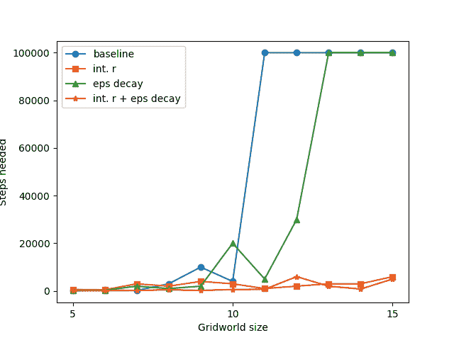

图片由作者提供

如我们所见，在基线设置中，所需的步数迅速增长，达到允许的最大步数（100,000）——这意味着算法在分配的步数内没有解决环境。然而，仅添加衰减ε并没有带来太多贡献。然而，添加中间奖励被证明是极其有效的——而且这种结合与衰减ε的组合表现最佳。

因此，对于大多数方法，我们首先从“天真”的环境，即基线实现开始。稍后我们将展示“改进”环境的成果，该环境包含中间奖励和衰减探索。

### 比较标准

如前节所示，我选择直到找到的策略解决 Gridworld 环境所需的步数作为比较方法的默认方式。这似乎比仅仅测量经过的时间更公平，因为时间取决于具体的实现（类似于[大 O 符号](https://en.wikipedia.org/wiki/Big_O_notation)的概念）——而且，如上所述，我没有针对速度进行优化。然而，需要注意的是，步数也可能具有误导性，例如，DP 方法中的一步包含对所有状态的循环，而 MC 和 TD 方法中的一步是生成一个场景（实际上对于 TD 方法，我们通常将一步计为一个值更新，即一个场景生成由多个步骤组成——然而我故意使这更类似于 MC 方法）。因此，我们有时也会显示经过的时间。

### 实验结构

为了减少方差，对于每个 Gridworld 大小，我们运行每种方法三次，然后保存所需的最低步数。

运行所有后续基准测试所需的代码可以在[GitHub](https://github.com/hermanmichaels/rl_book/blob/main/rl_book/scripts/benchmark.py)上找到。

## 所有算法的回顾和基准测试

在基础知识已经到位之后，让我们开始。在本节中，我们将回顾 Sutton 书籍第一部分中介绍的所有算法。此外，我们将在之前引入的 Gridworld 任务上对它们进行基准测试。

### 动态规划

我们从 Sutton 的书的第四章开始，描述了动态规划的方法。这些方法可以应用于各种各样的问题，始终基于从较小的子问题迭代构建较大解决方案的原则。在强化学习的背景下，动态规划方法维护一个 Q 表，该表是逐步填充的。为此，我们需要一个环境模型，然后，使用这个模型，根据可能的后续状态更新状态或状态-动作对的预期值。Sutton 介绍了我们在对应帖子中提到的两种方法：策略迭代和值迭代。

让我们从**策略迭代**开始。这由两个交替的步骤组成，即策略评估和策略改进。策略评估使用动态规划来——正如其名——评估当前策略：我们通过使用模型和政策来逐步更新状态估计。接下来是策略改进，它采用了强化学习的一个基本概念：根据**策略改进定理**，任何策略在将一个状态中的预测动作更改为更好的动作时都会变得更好。随后，我们以贪婪的方式从 Q 表中构建新的策略。这会重复进行，直到策略收敛。

相应的伪代码如下：

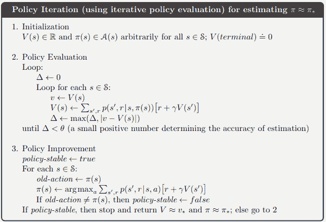

图片来自[1]

接下来是**值迭代**。这与策略迭代非常相似，但有一个简单而关键的修改：在每次循环中，只运行一次策略评估。可以证明这仍然收敛到最优策略，并且总体上比策略迭代更快：

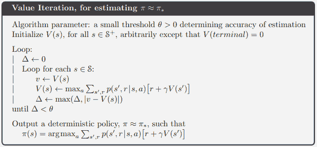

图片来自[1]

更多细节，请参阅[关于动态规划方法的对应帖子](https://towardsdatascience.com/introducing-markov-decision-processes-setting-up-gymnasium-environments-and-solving-them-via-e806c36dc04f/)。

**结果**

现在是时候看看这两个算法真正由什么构成了。我们运行了上述实验，并得到了以下图表：

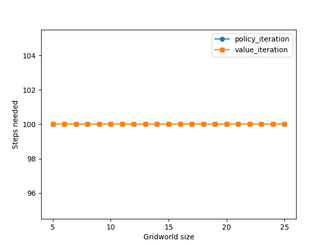

图片由作者提供

这两种方法都能以最少的步骤数解决所有创建的网格世界大小，即 100 步。令人惊讶吗？实际上，这实际上显示了动态规划方法以及我们方法论的一个优点和一个缺点：动态规划方法是“彻底”的，它们需要一个完整的模型来描述世界，然后迭代遍历所有状态——只需遍历所有状态几次就能得到一个好的解决方案。然而，这意味着所有状态都需要被估计直到收敛——即使其中一些可能不太有趣——并且这随着环境大小的增加而变得非常糟糕。实际上，这里测量的一步包含了对所有状态的完整遍历——这表明对于这些方法来说，时间是一个更好的衡量标准。

因此，我们得到了以下图表：

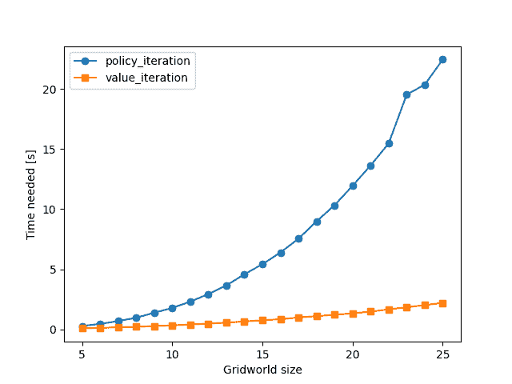

图片由作者提供

现在，我们可以看到随着状态数量的增加，所需的计算量也在增加。我们还可以看到，正如所声称的，值迭代收敛得更快，并且扩展得更好。请注意，x 轴标签表示 n，网格世界的大小为 n x n。

### 蒙特卡洛方法

在我们关于强化学习的后续系列文章中，我们介绍了蒙特卡洛方法。这些方法可以从经验中单独学习，即可以在任何类型的环境中运行它们，而不需要对其有模型——这是一个惊人的认识，非常有用：通常，我们没有这个模型，有时，使用它过于复杂且不切实际。考虑黑杰克游戏：虽然我们可以确定所有可能的结果及其相应的概率，但这是一项非常繁琐的任务——而且仅仅通过这样做来学习玩游戏是非常诱人的想法。由于不使用模型，蒙特卡洛方法是无偏的——但缺点是它们的期望值具有很高的方差。

实施这些方法时，一个问题是确保所有状态-动作对都被持续访问并更新。由于没有模型，我们无法简单地遍历所有可能的组合（例如，与 DP 方法比较），但（在某种程度上）随机探索环境。如果我们因此完全错过了某些状态，我们将失去理论收敛保证，这会转化为实践。

满足这一点的办法之一是**探索开始**假设（ES）：我们在一个随机状态开始每个剧集，并且也随机选择第一个动作。除此之外，蒙特卡洛方法可以相当简单地实现：我们简单地玩出完整的剧集，并将状态-动作对的期望值设置为获得的平均回报。

MC 与 ES 看起来如下：

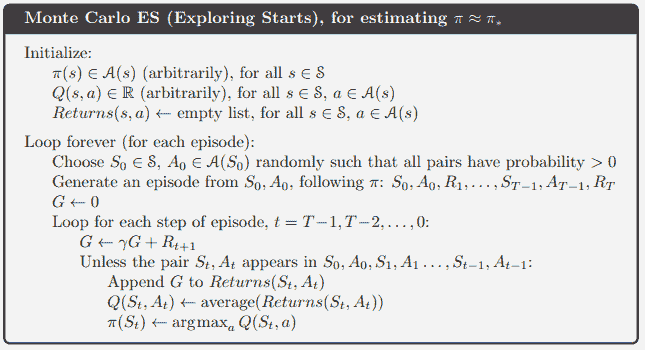

图片来自[1]

为了消除 ES 的假设，我们可以求助于两类算法：在策略和离策略方法。让我们先从在策略方法开始。

这实际上与 ES 算法并没有太大的不同，我们只是使用一个ε-贪婪策略来生成剧集。也就是说，我们消除了 ES 的假设，并**使用一个“软”策略而不是“硬”策略”来生成剧集：每次迭代的使用的策略不是完全贪婪的，而是ε-贪婪——这保证了在极限情况下，我们会看到所有可能的状态-动作对：

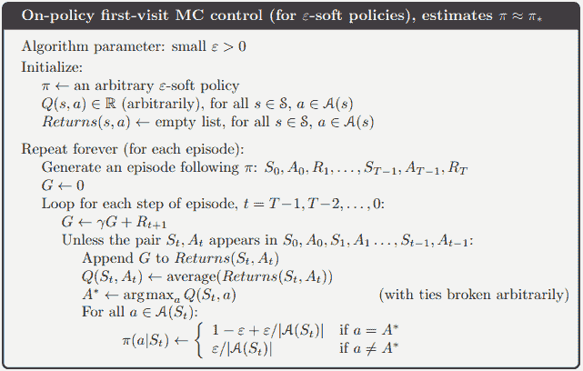

图片来自[1]

**离策略方法**遵循将探索和学习分为两个策略的想法。我们维护一个策略π，这是我们想要优化的，以及一个行为策略，b。

然而，我们不能在我们的算法的每个地方都简单地使用 b。当生成一个剧集并计算回报时，我们得到：

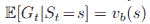

图片来自[1]

即，得到的结果是 b 的预测值，而不是π。

这就是重要性采样发挥作用的地方。我们可以用正确的比率来固定这个期望值：

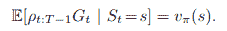

图片来自[1]

这个比率由以下定义：

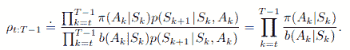

图像来自[1]

在我们的情况下，我们得到以下公式：

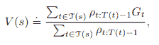

图像来自[1]

（注意，这里使用的是加权重要性采样，而不是“原始”重要性采样。）

我们当然可以在每一步计算这些比率。然而，Sutton 介绍了一种聪明的方案，可以增量地更新这些值（用`W`表示），这要高效得多。事实上，在我的原始帖子中，我也展示了原始版本——我相信这有助于理解。然而，由于这里我们主要关注基准测试，并且“原始”和“增量”版本在性能上相同，所以我们这里只列出稍微复杂一点的增量版本。

在伪代码中，相应的算法如下所示：

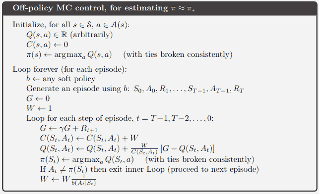

图像来自[1]

注意，与介绍这些方法的初始帖子相反，那里的行为策略是简单地随机选择，这里我们选择了一个更好的策略——即针对当前 Q 表的ε贪婪策略。

对于更多细节，[这里是我的关于 MC 方法的对应帖子](https://towardsdatascience.com/monte-carlo-methods-for-solving-reinforcement-learning-problems-ff8389d46a3e/)。

**结果**

这样，让我们比较这三个算法在小型网格世界环境中的表现。注意，这里的一步代表一个完整的回合生成：

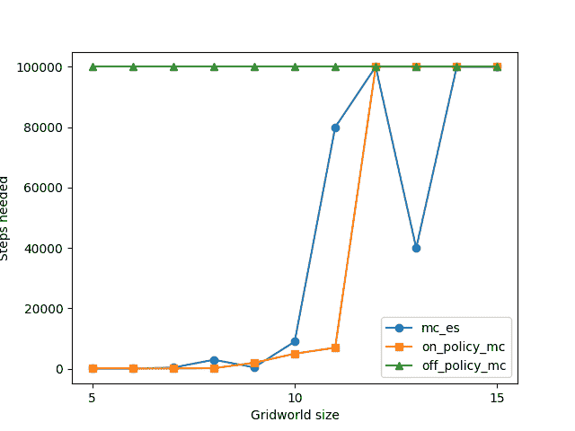

我们观察到离线策略的 MC 在 5×5 的网格世界大小上就已经超时，尽管带有 ES 和在线策略的 MC 表现更好，但它们也开始在更大的尺寸上挣扎。

这可能对 MC 爱好者来说有些令人惊讶，也有些令人失望。别担心，我们将设法提高这一点——然而，它显示了这些算法的弱点：在“大型”环境且奖励稀疏的情况下，MC 方法基本上只能寄希望于偶然发现目标——这随着环境大小的增加而指数级下降。

因此，让我们尝试让模型的任务更容易一些，并使用之前介绍的经验上发现有助于 TD-learning 性能的技巧：添加中间奖励和ε衰减——我们的“改进”设置。

实际上，使用所有这些方法表现都更好：

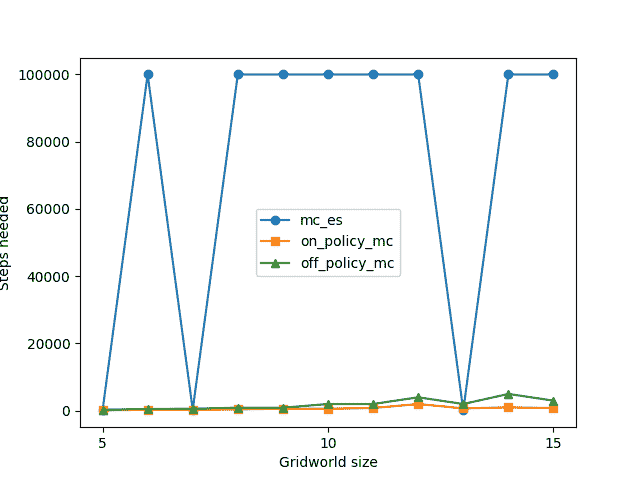

然而，现在 MC ES 引起了问题。因此，让我们把它放在一边，继续进行而不考虑它：ES 无论如何都是 MC 方法开发过程中的一个理论概念，使用起来/实现起来很笨拙（有些人可能记得我是如何实现环境以随机状态开始的……）：

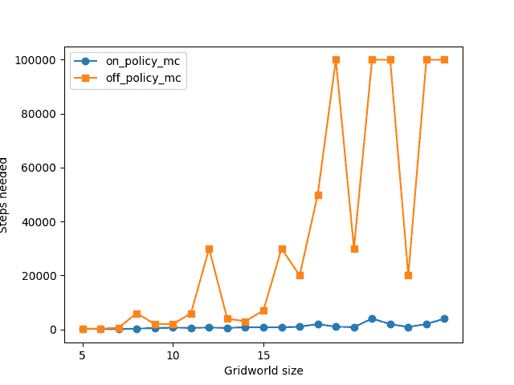

至少，我们接近了动态规划的结果。请注意，我已将最大步数限制为 100,000，因此当图表中出现这个数字时，意味着算法在给定的步数限制内无法解决这个环境。实际上，离策略蒙特卡洛似乎表现得很出色，所需的步数几乎没有增加——但离策略蒙特卡洛似乎表现较差。

**讨论**

对我来说，蒙特卡洛方法表现得很令人惊讶——因为它们本质上是在环境中随机摸索，希望通过探索找到目标。然而，当然这并不完全正确——它们的性能（就离策略蒙特卡洛而言）只有在启用中间奖励后才变得非常好——这些奖励引导模型朝着目标前进。在这个设置中，蒙特卡洛方法似乎表现得很出色——一个潜在的原因是它们是无偏的——并且对超参数调整和协同等不太敏感。

### 时间差分学习

让我们来看看 TD 方法。这些方法可以看作是结合了之前介绍过的两种方法的优点：与蒙特卡洛类似，它们不需要环境模型——但它们仍然基于之前的估计，它们是自举的——就像动态规划一样。

让我们回顾一下 DP 和 MC 模型：

DP 方法将贝尔曼方程转换为更新规则，并基于其后续状态估计值计算状态的价值：

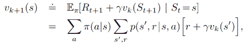

图片来自[1]

另一方面，蒙特卡洛方法会播放完整的剧集，然后根据观察到的回报更新其价值估计：

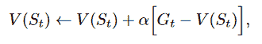

图片来自[1]

TD 方法结合了这两个想法。它们播放完整的剧集，但在每一步更新价值估计，包括观察到的回报和之前的估计：

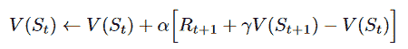

图片来自[1]

一些最基础的强化学习算法源自这个领域——我们将在以下内容中讨论它们。

让我们从**Sarsa**开始。首先，我们修改上述引入的更新规则，使其能够与状态-动作对一起工作：

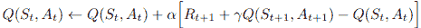

图片来自[1]

这样，Sarsa 实际上被迅速引入：我们播放剧集，并按照当前策略更新值。这个名字来自更新中使用的元组：

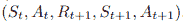

图片来自[1]

在伪代码中，它看起来如下所示：

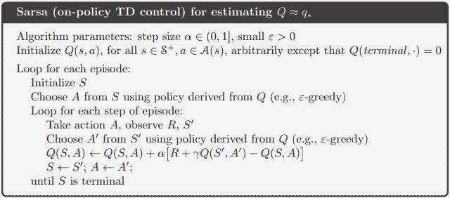

图片来自[1]

接下来是**Q-learning**。这与 Sarsa 非常相似，但有一个关键的区别：它是一个离策略算法。在更新过程中，我们不是简单地跟随执行的转换，而是取所有后续状态的 Q 值的最大值：

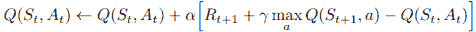

图片来自[1]

你可以想象这是创建一个行为策略 b，它等于π，但在所讨论的转换中是贪婪的。

伪代码看起来如下所示：

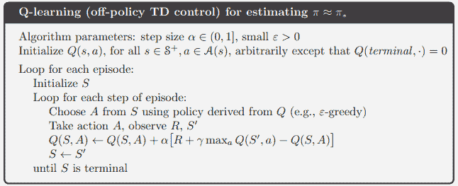

图片来自[1]

另一个算法是**Expected Sarsa**，正如你所猜到的——它是 Sarsa 的一个扩展。我们不是遵循策略执行的一个转换，而是考虑所有可能的后继状态，并按照当前策略下它们发生的可能性来权衡它们：

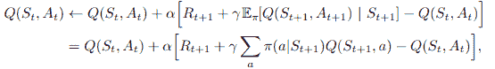

图片来自[1]

本章的最后一个算法是 Q 学习的扩展。Q 学习有一个被称为**最大化偏差**的问题：因为它使用期望值的最大值，所以得到的估计可能存在正偏差。我们可以通过使用两个 Q 表来解决它：对于每次更新，我们使用一个来选择值最大化的动作，另一个来计算更新目标。哪个被使用由抛硬币决定。该算法被称为**Double Q-learning**：

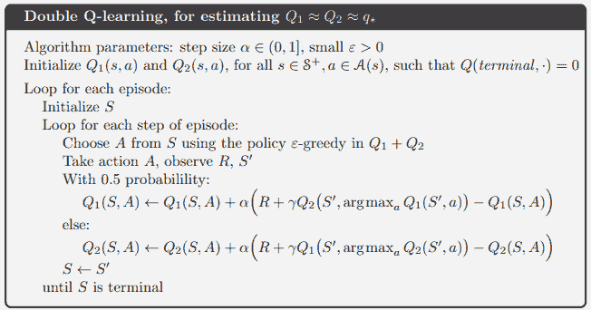

图片来自[1]

**结果**

让我们来看看结果，从简单的环境开始：

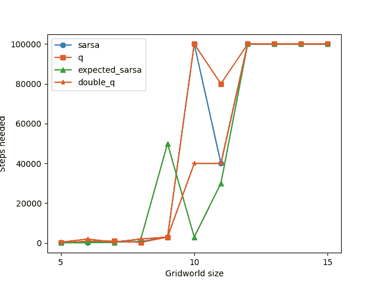

图片由作者提供

我们可以看到，当网格世界的大小为 11 x 11 时，两种 Q 学习方法都开始出现问题。

因此，让我们应用我们已知的技巧，得到“改进”的设置：

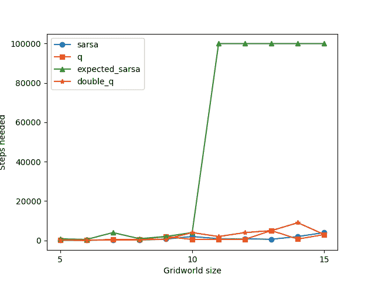

图片由作者提供

所有方法现在都可以更快地找到解决方案——只是 Expected Sarsa 表现不佳。这可能是——它比 Q 学习或 Sarsa 使用得少得多，也许更多是一个理论概念。

因此，让我们不使用这种方法继续前进，看看我们能解决多大的世界规模：

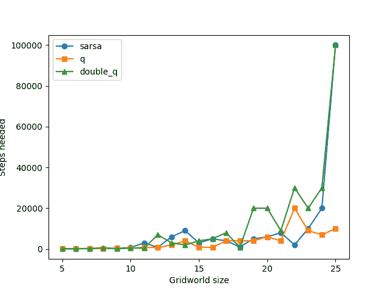

图片由作者提供

Q-learning 现在也可以无问题地解决 25 x 25 的网格大小——但 Sarsa 和 Double Q-learning 开始退化。

更多细节可以在我的[关于 TD 方法的介绍性帖子](https://towardsdatascience.com/temporal-difference-learning-combining-dynamic-programming-and-monte-carlo-methods-for-e0c2f0829a51/#:~:text=TD%20learning%20can%20be%20viewed,not%20need%20a%20model%20and).

**讨论**

在改进的设置中，TD 方法总体上表现良好。我们只是早期排除了 Expected Sarsa，而这本身也不是一个常见的算法。

“简单”的 Sarsa 和 Double Q-learning 在更大的环境规模上表现不佳，而 Q-learning 总体上表现良好。这有点令人惊讶，因为 Double Q-learning 应该能够解决标准 Q 学习的一些缺点，特别是高方差。可能，我们已经通过运行每个实验 n 次来减少了方差。另一个假设可能是 Double Q-learning 需要更长的时间来收敛，因为参数的数量也翻倍了——这表明 Double Q-learning 在更复杂的问题上，有更多时间的情况下表现更好。

如前所述，Q-learning 比 Sarsa 表现更好。这反映了我们在研究/文献中看到的情况，即 Q-learning 的普及程度显著更高。这可能是由于它是离线策略，通常会产生更强大的解决方案。另一方面，Sarsa 在随机或“危险”任务上表现更好：由于在 Sarsa 中，实际选择的行动在价值更新中被考虑在内，它更好地理解了其行动的影响，这对于随机环境或/或可以，例如，从悬崖上掉下来的环境来说很有用。尽管后一种情况在这里成立，但环境可能并不复杂或足够大，以至于这种影响会发挥作用。

### TD-n

TD-n 方法在某种程度上结合了经典的 TD 学习和 MC 方法。正如 Sutton 所说，它们“使我们摆脱了时间步的暴政”[1]。在 MC 方法中，我们必须等待一个完整的游戏周期才能进行任何更新。在 TD 方法中，我们在每一步更新估计——但我们也被迫只看一步之远。

因此，引入 n 步回报是有意义的：

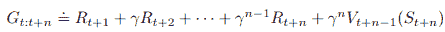

图片来自[1]

有了这个，我们可以简单地介绍**Sarsa-n**：

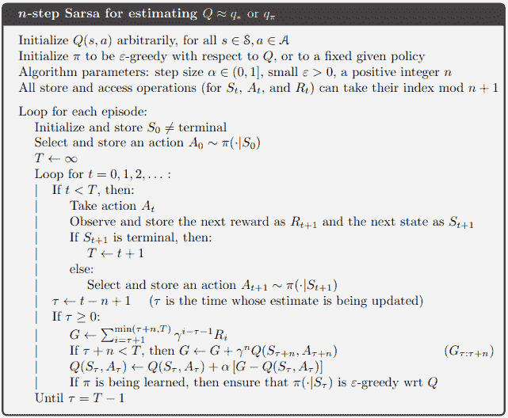

图片来自[1]

我们按照当前策略进行游戏，然后用 n 步回报更新价值估计。

在我的相应帖子中，我们还介绍了这个方法的离线版本。然而，为了不让这篇帖子太长，以及离线 MC 方法的负面经验，我们专注于“经典”方法——例如 Sarsa-n 和 tree-n 树回溯，我们将在下一部分介绍。

**n 步树回溯**是之前看到的 Expected Sarsa 的扩展。在计算 n 步回报时，相应的转换树如下：

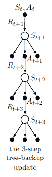

图片来自[1]

即，树中有一条对应实际采取行动的单一路径。就像在 Expected Sarsa 中一样，我们现在想要根据策略确定的概率来权衡行动。但由于现在我们有一个深度大于 1 的树，后续级别的累积价值将根据采取这些级别的行动的概率进行加权：

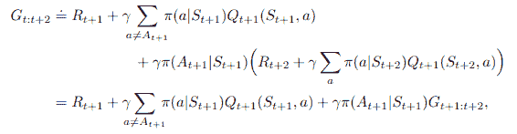

图片来自[1]

伪代码如下：

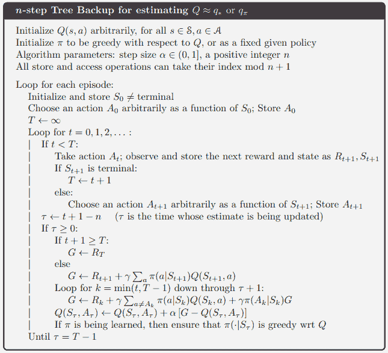

图片来自[1]

这里是我关于[n 步 TD 方法](https://towardsdatascience.com/introducing-n-step-temporal-difference-methods-7f7878b3441c/)的相应帖子。

**结果**

如同往常，我们从“天真”设置开始，并得到以下结果：

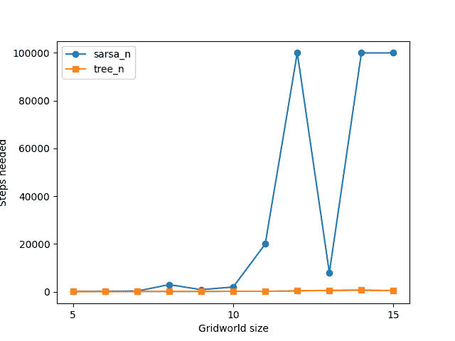

图片由作者提供

Sarsa-n 在较小的网格世界大小上已经开始挣扎。让我们看看改进的设置是否改变这一点：

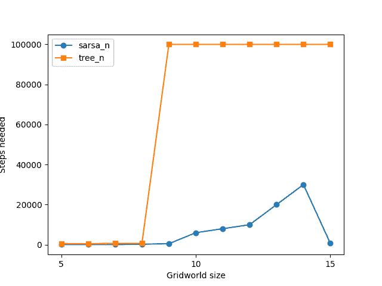

图片由作者提供

现在确实 Sarsa-n 表现更好，但 n 步树回溯没有。

**讨论**

我发现这个发现出乎意料，并且有些难以解释。我很乐意听听你们的想法——但与此同时，我正在和我选择的聊天机器人聊天，并提出了以下假设：中间奖励可能会让树形算法感到困惑，因为它需要学习所有可能动作的匹配回报分布。此外，ε衰减得越多，预期的分布可能就越偏离行为策略。

### 基于模型的强化学习/规划

在上一章中，我们讨论了“规划”这个主题——在强化学习背景下，我们主要指的是基于模型的策略。也就是说，我们（或构建）了一个环境模型，并使用这个模型来进一步“虚拟”探索，特别是使用这些探索来获得更多和更好的价值函数更新/学习。以下图像很好地展示了规划与学习的集成：

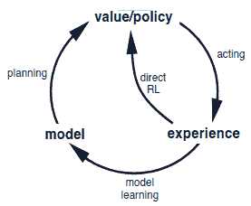

图片来自[1]

在右上角，我们看到“经典”的强化学习训练循环（也称为“直接”强化学习）：从某个价值函数/策略开始，我们在（真实）环境中采取行动，并使用这些经验来更新我们的价值函数（或策略梯度方法中的策略）。当引入规划时，我们还会从这些经验中学习世界模型，然后使用这个模型生成更多的（虚拟）经验，并从这些经验中更新我们的价值或策略函数。

这实际上就是**Dyna-Q**算法，其伪代码如下：

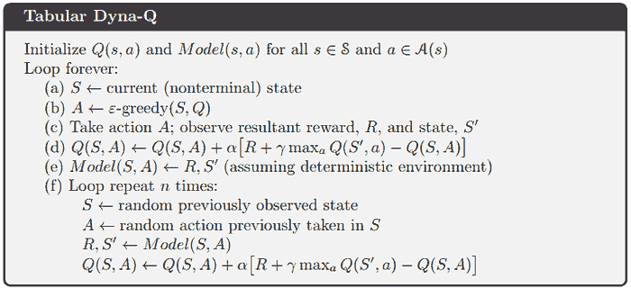

图片来自[1]

步骤（a）—（d）是我们的经典 Q 学习，而算法的其余部分添加了新颖的规划功能，特别是世界模型学习。

另一个相关的算法是**优先级遍历**，它改变了我们对“规划循环”中状态的采样方式：我们在真实环境中探索和玩耍，同时学习模型，并将具有大预期值变化的动作-状态对保存到队列中。只有有了这个队列，我们才开始“规划循环”，即上述步骤（e）和（f）：

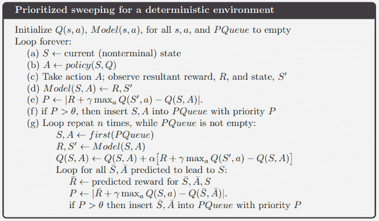

图片来自[1]

更多细节可以在我的关于[基于模型的强化学习方法](https://medium.com/data-science-collective/planning-and-learning-in-reinforcement-learning-68de9bce815d)的上一篇文章中找到。

**结果**

让我们从简单的设置开始：

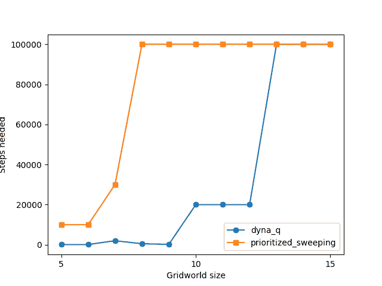

作者提供的图像

Dyna Q 表现合理，而优先级遍历在早期表现不佳。

在改进的设置中，我们看到类似的情况：

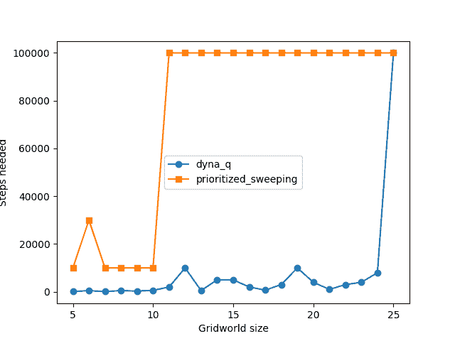

作者提供的图像

**讨论**

优先级遍历在相应的介绍性帖子中已经表现不佳了——我怀疑可能存在某些问题，或者更可能的是这只是一个“调整”问题——即使用错误的采样分布。

Dyna-Q 产生了可靠的结果。

## 基准测试最佳算法

我们现在已经通过按章节和大小为 25 x 25 的 Gridworld 进行基准测试，看到了 Sutton 书籍第一部分中所有算法的性能。在这里，我们已经看到了表现好和差的算法，并且特别已经淘汰了一些不适合更大环境的候选者。

现在我们想将剩余的算法——每个章节中最好的算法——相互比较，在大小为 50 x 50 的 Gridworld 上进行基准测试。

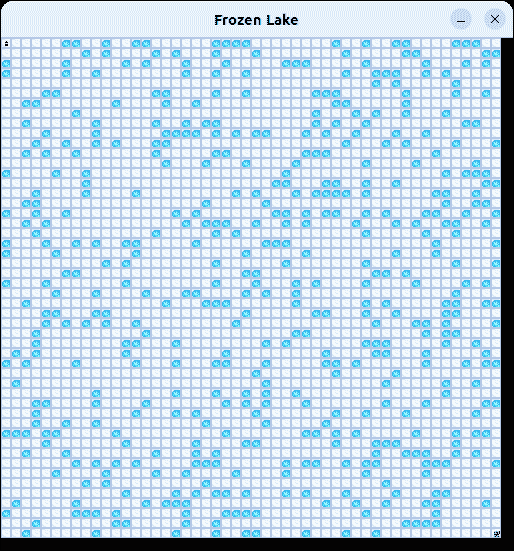

作者图片

这些算法是：

+   值迭代

+   on-policy MC

+   Q-learning

+   Sarsa-n

+   Dyna-Q

**结果**

这是它们在 Gridworld 上的表现，这次最大步数限制为 200,000：

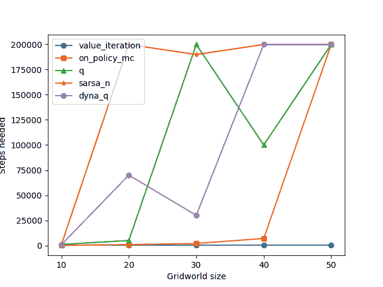

作者图片

让我们也绘制相应的所需时间（注意，我绘制了未成功的运行——达到最大步数而没有生成可行策略的运行——在 500 秒）：

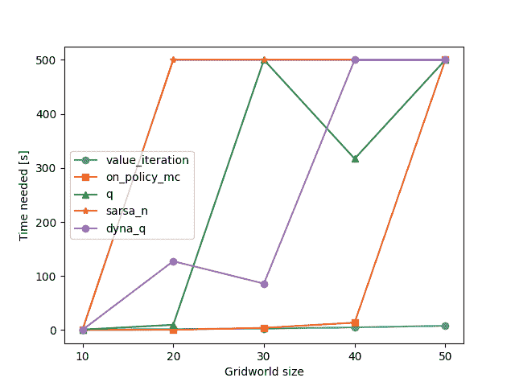

作者图片

我们可以从这些图表中观察到几个有趣的事实：

1.  步数与所需时间高度相关。

1.  值迭代表现异常出色，甚至可以轻松解决大小为 50 x 50 的 Gridworld，并且比下一个最佳算法快得多。

1.  剩余算法的排名（从好到差）：On-policy MC，Dyna-Q，Q-learning，Sarsa-n。

在下一节中，我们将更详细地讨论这些问题。

**讨论**

1. 步数与时间

我们以讨论哪些指标/测量方法为起点，特别是是否使用步数或解决问题所需的时间。回顾起来，我们可以说这次讨论实际上并不那么相关，而且——有些令人惊讶——这两个数字高度相关。也就是说，尽管最初描述中提到的一个“步”可能因算法而异。

2. 值迭代占主导地位

值迭代表现非凡，甚至可以轻松解决大型 Gridworld（高达 50×50），并且远远超过所有其他算法。考虑到 DP 方法通常被认为是理论工具，很少在实际中使用，这一点可能令人惊讶。现实世界的应用往往更喜欢 Q-learning [2]、PPO [4] 或 MCTS [5] 等方法。

那么为什么这样一个“教科书”方法在这里占主导地位呢？因为这种环境是为它量身定制的：

+   模型完全已知。

+   动态简单且确定。

+   状态空间相对较小。

这些正是 DP 繁荣的条件。相比之下，像 Q-learning 这样的模型无关方法是为那些信息**不**可用的环境设计的。它们的优势在于通用性和可扩展性，而不是利用小而定义明确的问题。Q-learning 具有高方差，需要许多回合才能收敛——这些缺点在小规模环境中被放大。简而言之，**效率**和**通用性**之间存在明显的权衡。我们将在介绍函数逼近的后续文章中重新审视这一点，届时 Q-learning 有更多的空间发光。

3. 排名出现

除了值迭代之外，我们还观察到了以下性能排名：**策略蒙特卡洛 > Dyna-Q > Q-learning > Sarsa-n**

**策略蒙特卡洛**成为表现最佳的模型无关算法。这与我们之前的推理相符：蒙特卡洛方法简单、无偏，非常适合具有确定性目标的问题——尤其是在回合相对较短的情况下。虽然不适用于大型或连续问题，但蒙特卡洛方法在小到中等规模的任务（如网格世界）中似乎非常有效。

**Dyna-Q**位居其次。这个结果加强了我们之前的预期：Dyna-Q 将基于模型的规划与模型无关的学习相结合。虽然模型是学习到的（与值迭代不同，不是给定的），但在这里它仍然简单且确定——使得学习到的模型有用。这显著提高了性能，超过了纯模型无关方法。

**Q-learning**虽然仍然强大，但在这个上下文中表现不佳，原因如上所述：它是一个通用算法，无法充分利用简单环境的结构。

**Sarsa-n**排名最后。一个可能的解释是通过多步更新中引入的通过引导产生的偏差。与估计从完整轨迹（无偏）的蒙特卡洛方法不同，Sarsa-n 使用对未来奖励的引导估计。在小环境中，这种偏差可能会超过减少方差的好处。

最后，让我们比较一下我们的结果与 Sutton 的结果：

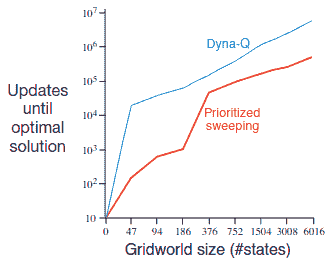

图片来自 [1]

注意，Sutton 在 x 轴上列出的是总步数，而我们列出的是 n，总状态数是 n x n。对于 376 个状态，Sutton 报告在找到最优解之前大约有 10 万步，而我们在 400 个状态（20 x 20）的情况下报告了 7.5 万步（考虑到 Dyna-Q）。这些数字高度可比，并为我们设置和实现的可靠性提供了令人欣慰的验证。

## 结论

这篇文章既是对 Sutton 和 Barto 的《强化学习》第一部分的系列回顾[1]，也是对书籍范围之外的扩展——通过在越来越大的网格世界环境中基准测试所有引入的算法。

我们首先概述了我们的基准测试设置，然后回顾了第一部分的核心章节：动态规划、蒙特卡洛方法、时序差分学习和基于模型的重强化学习/规划。在每个部分，我们介绍了关键算法，如 Q 学习，提供了完整的 Python 实现，并在 25×25 大小的网格世界中评估了它们的性能。这次初步的目标是确定每个算法家族中的佼佼者。根据我们的实验，突出的是：

**值迭代**、**按策略 MC**、**Q 学习**、**Sarsa-n**和**Dyna-Q**。用于重现这些结果的 Python 代码，以及所有讨论方法的实现，可在[GitHub](https://github.com/hermanmichaels/rl_book/tree/main/rl_book/methods)上找到。

接下来，我们在更大的环境中（高达 50×50）对这些高性能者进行了压力测试，并观察到了以下排名：

**值迭代 > 按策略 MC > Dyna-Q > Q 学习 > Sarsa-n**

虽然这个结果可能令人惊讶——鉴于 Q 学习的广泛应用以及值迭代和 MC 方法相对较少的应用——但在上下文中是有道理的。简单的、完全已知的、确定性的环境非常适合值迭代和 MC 方法。相比之下，Q 学习是为更复杂、未知和高变异性环境设计的，在这些环境中函数逼近是必要的。正如我们讨论的，在结构化任务中的效率和复杂任务中的通用性之间存在权衡。

这就引出了接下来要讨论的内容。在未来的文章中，我们将进一步拓展边界：

+   首先，通过在更具挑战性的环境中（如**两人游戏**）对这些方法进行基准测试，直接竞争将更明显地暴露它们的差异。

+   然后，我们将深入到萨顿（Sutton）书籍的第二部分，其中介绍了函数逼近。这解锁了将强化学习扩展到表格方法无法处理的更广泛环境的能力。

如果你已经读到这儿——感谢你的阅读！我希望你喜欢这次深入探讨，并期待你在系列的下一次连载中回来。

## 本系列的其他文章

+   第一部分：[强化学习简介及解决多臂老虎机问题](https://towardsdatascience.com/introduction-to-reinforcement-learning-and-solving-the-multi-armed-bandit-problem-e4ae74904e77/)

+   第二部分：[介绍马尔可夫决策过程、设置体育馆环境以及通过动态规划方法解决它们](https://towardsdatascience.com/introducing-markov-decision-processes-setting-up-gymnasium-environments-and-solving-them-via-e806c36dc04f)

+   第三部分：[解决强化学习问题的蒙特卡洛方法](https://towardsdatascience.com/monte-carlo-methods-for-solving-reinforcement-learning-problems-ff8389d46a3e)

+   第四部分：[时间差分学习：结合动态规划和蒙特卡洛方法进行强化学习](https://towardsdatascience.com/temporal-difference-learning-combining-dynamic-programming-and-monte-carlo-methods-for-e0c2f0829a51/)

+   第五部分：[介绍 n 步时间差分方法](https://towardsdatascience.com/introducing-n-step-temporal-difference-methods-7f7878b3441c/)

+   第六部分：[强化学习中的规划和学习](https://medium.com/data-science-collective/planning-and-learning-in-reinforcement-learning-68de9bce815d)

## 参考文献

[1] [`incompleteideas.net/book/RLbook2020.pdf`](http://incompleteideas.net/book/RLbook2020.pdf)

[2] [`arxiv.org/abs/1312.5602`](https://arxiv.org/abs/1312.5602)

[3] [`gymnasium.farama.org/index.html`](https://gymnasium.farama.org/index.html)

[4] [`arxiv.org/abs/1707.06347`](https://arxiv.org/abs/1707.06347)

[5] [`arxiv.org/abs/1911.08265`](https://arxiv.org/abs/1911.08265)

(*) 从[1]中使用的图像已获得作者许可。
