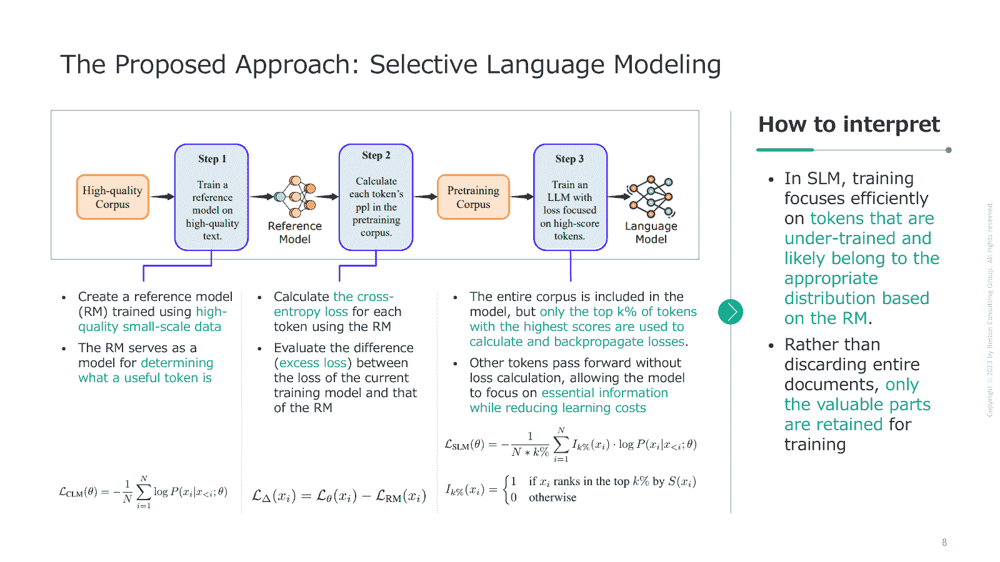
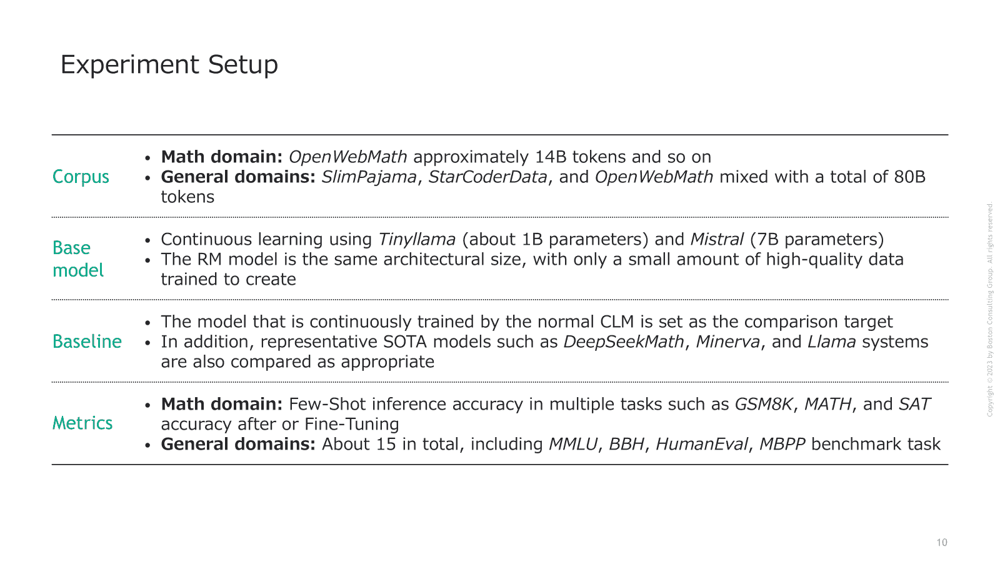

# 超越因果语言模型

> 原文：[`towardsdatascience.com/beyond-causal-language-modeling-a-deep-dive-into-not-all-tokens-are-what-you-need-for-781166bc35b3/`](https://towardsdatascience.com/beyond-causal-language-modeling-a-deep-dive-into-not-all-tokens-are-what-you-need-for-781166bc35b3/)

## 引言

几天前，我有机会在一个专注于*NeurIPS 2024*中最激动人心和有洞察力的论文的本地阅读小组上发言。作为一名发言人，我选择了一篇题为***["Not All Tokens Are What You Need for Pretraining"](https://openreview.net/forum?id=0NMzBwqaAJ)***的论文。它提出一个超级简单但合理的问题：*我们在语言模型预训练过程中是否真的需要将下一个 token 预测损失应用于所有 token*？

我们中的大多数人已经习惯了标准方法：输入一个巨大的网络抓取语料库，对每个 token 应用因果语言模型（CLM），并相信更大的更好。这篇论文的作者对这一假设提出了质疑，相反，他们认为一些 token 实际上可能对学习过程有害。从他们的分析中可以看出，将训练预算集中在特别“有用”的 token 上可以在数据效率和下游任务中带来显著的效率和性能提升。

在这篇文章中，我将总结论文中提出的 Selective Language Modeling (SLM)方法的核心思想，并分享一些让我印象最深刻的实验见解。

* * *

## 背景

### 大型网络语料库中的 Token 级噪声

当你从网络上抓取大量文本时，发现相当数量的噪声并不奇怪。研究人员已经尝试通过应用文档级过滤器来精炼他们的语料库——移除看起来可疑或低质量的整个文档。然而，作者指出，噪声也可能存在于文档内部：一篇好文章可能仍然包含一些无意义或极其不可预测的 token。如果你的模型被迫从所有内容中学习，这些噪声 token 可能会浪费计算，甚至可能使模型困惑。

### Token 级学习动态

通过检查多个阶段的训练检查点，作者根据 token 的交叉熵损失随时间的高低进行了分类：

+   **L→L (低到低)：**这些 token 早期就被学习，并且对模型来说始终“容易”，之后不再有显著的梯度更新。

+   **H→L (高到低)：**一开始很难但最终被学习的子集。这意味着这些 token 在学习上仍有很大的改进空间。

+   **H→H (高到高)：**那些仍然难以预测且波动很大的 token，通常是由于它们固有的不可预测性（即，*随机不确定性*）

+   **L→H (低到高)：**最初被学习但后来变得令人困惑的 token，可能是由于上下文变化或噪声。

最大的收获是只有一小部分标记真正贡献了有意义的学习信号。许多标记早期就掌握了（L→L），然后停止有益。同时，那些持续困难的标记（H→H）在整个训练过程中可能非常嘈杂且无益。

* * *

## 提出的方法：选择性语言建模（SLM）

*图 1。作者根据原始论文中展示的图创建，增加了额外的解释和解读*

作者提出了**选择性语言建模（SLM）**作为一种更细致的方法。以下是它的工作原理：

### 第 1 步：训练参考模型（RM）

他们首先选择一个小但**高质量的数据集**，该数据集反映了他们的“理想”数据分布。使用已经部分预训练的基础模型，他们对这个模型进行微调以创建一个 RM。这个模型本质上成为了一个法官，决定哪些标记值得后续训练。

### 第 2 步：使用额外损失评分标记

对于大规模语料库中的每个标记，他们计算**RM 损失**（RM 预测该标记有多好）并将其与**当前训练模型的损失**进行比较。差异，称为**额外损失**，表明在参考分布下“应该”可预测的标记上还有多少改进空间。

### 第 3 步：选择顶部 k%的标记进行反向传播

在主要预训练期间，他们仍然对所有标记执行**完整的前向传递**，但只对顶部 k%的标记的损失进行反向传播（那些具有最高额外损失的标记）。这意味着模型将大部分能力投入到既可学习又相关的标记上，而忽略被认为不太有帮助的标记。这种动态选择在每个步骤或批次发生，因此它会随着训练模型本身的变化而适应。

* * *

## 实验

本文展示了 SLM 在几个实验设置中的好处：

图 2。作者创建以总结实验设置

### 数学领域结果

当他们在*OpenWebMath*上继续预训练较小的 1B 模型时，改进是显著的——在 GSM8K 和 MATH 上比使用 CLM 训练的相同模型提高了 10%甚至更多。作者强调，SLM 可以达到基线性能 5-10 倍快，需要更少的标记和更少的计算。

在一个引人注目的案例中，他们的 7B 模型匹配了先前 SOTA 方法的准确性，同时只消耗了先前所用的训练标记的 3%。

此外，简单的微调步骤进一步将 1B 模型的 MATH 分数提高了 40%以上——这是一个小型开源模型通常难以在没有巨大训练预算的情况下达到的水平。

### 通用领域结果

如果你已经有一个看到大量通用文本的模型，作者展示了 SLM 仍然有帮助。

即使是一个强大的基础模型，在 15 个基准测试中平均提高了约 5.8 个百分点，尤其是在代码和数学等更困难的领域。因此，即使在大规模训练之后，仍然有一小部分标记有助于提高性能。

### 自引用

出现了一个问题：如果你一开始就没有精选数据集来训练你的参考模型，怎么办？作者展示了一个创造性的解决方案：你可以在相同的原始语料库上仅用几个 epoch 快速训练一个简陋的参考模型。

即使那个参考模型可能并不完美，它仍然可以很好地识别那些妨碍训练的噪声标记。结果是下游准确率提高了 2-3%，使用的标记减少了 30-40%。

* * *

## 结论和未来方向

### 本工作的贡献

这篇论文提供了对标记级训练动态的启发式分析，以及一种称为 SLM 的新技术：

**标记损失分析：**他们展示了大多数标记在初始训练阶段之后贡献很小，而一小部分保持持续的高损失。

**SLM 用于专注学习：**通过利用参考模型来衡量每个标记的“有用性”，他们设法大幅减少训练标记，而没有牺牲质量——在许多情况下甚至提高了下游性能。

**广泛展示有效性：**SLM 不仅适用于数学特定任务，也适用于更广泛的领域，无论是精心策划的参考数据集还是来自相同大型语料库的参考模型。

### 接下来会走向何方？

SLM 涵盖了未来研究的各种潜在方向。例如：

**进一步扩展规模：**尽管论文主要关注 1B 到 7B 参数的模型，但仍然存在一个开放问题，即 SLM 在 30B、70B 或 100B+规模上的表现如何。如果标记级方法具有良好的泛化能力，对于真正巨大的 LLM 来说，成本节约可能是巨大的。

**通过 API 的参考模型：**如果你无法收集精选数据，也许你可以使用基于 API 的语言模型作为你的参考。这可能使得对于缺乏选择性参考训练资源的较小研究团队来说，SLM 更加实用。

**强化学习扩展：**想象一下将 SLM 与强化学习相结合。参考模型可以充当“奖励模型”，而标记选择可能通过类似策略梯度的方法进行优化。

**多个参考模型：**而不是单一的 RM，你可以训练或收集*几个*，每个都专注于不同的领域或风格。然后，将它们的标记分数结合起来，以产生一个更稳健的多领域过滤系统。

**对齐与安全性**：越来越倾向于将对齐或真实性考虑在内。一个人可能训练一个参考模型，使其对有充分支持的陈述给出更高的评分，并将看似事实错误或有害的标记归零。

* * *

感谢阅读，希望这个分析能帮助你理解 NeurIPS 2024 最佳论文。
