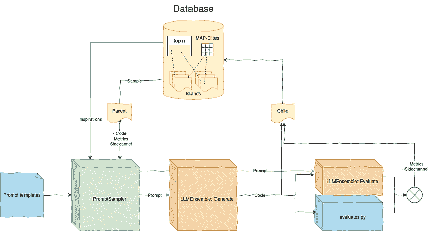
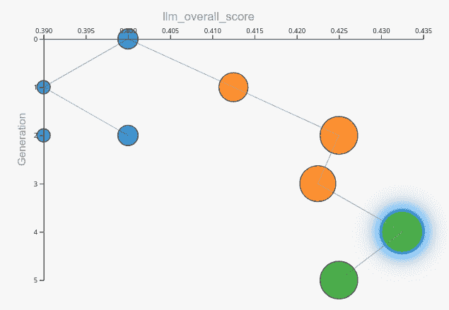
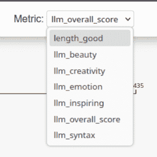

# 代码生成之外：使用 LLMs 持续进化文本

> 原文：[`towardsdatascience.com/beyond-code-generation-continuously-evolve-text-with-llms/`](https://towardsdatascience.com/beyond-code-generation-continuously-evolve-text-with-llms/)

<mdspan datatext="el1750311146010" class="mdspan-comment">当 LLM 的初始响应不符合您的需求时，您会重新运行它，对吧？现在，如果您想自动化这个过程…

```py
success = false
while not success:
    response = prompt.invoke()
    success = evaluate(response)
```

好吧，类似这样。人们已经为代码做过这件事，如果*evaluate()*函数适用，同样的方法也适用于非代码。如今，您可以使用**LLMs 进行内容生成和评估**。然而，一个简单的等待最佳随机结果的 while 循环并不总是足够好。有时，您需要修改提示。进行实验，混合不同的方法，并记录哪些有效，哪些无效。跟随不同的创意路径以保持选项开放…

在这篇文章中，我们将讨论如何使用**OpenEvolve** [1]，这是 Google 的 AlphaEvolve 论文[2]的开源实现，用于内容创作。在幕后，它应用了这种“实验和混合，跟随不同路径”的方法来优化 LLM 提示。

AlphaEvolve 论文将**进化系统**应用于 LLMs 的代码生成。在我的文章中了解更多关于这篇激动人心的、全新的论文结果，[Google 的 AlphaEvolve：使用进化编码代理开始](https://towardsdatascience.com/googles-alphaevolve-getting-started-with-evolutionary-coding-agents/)。本质上，在适者生存的方案中，程序被混合并得到改进。作者建议这些进化编码代理可以实现研究突破，并提出了几个结果。

由于内容可以具有的纯粹数量，我认为除了代码之外，还有可能存在**高价值内容创作**，这利用了这样一个长期运行、持续进化的过程。在这篇文章中，我们探讨了如何将相同的技术应用于一个非代码用例，其中 LLMs 而不是算法判断 LLM 生成的解决方案的结果。我们还讨论了如何检查结果。

## 前提条件

首先，让我们准备一个快速、基本的设置。

### LLM 服务器

为了使用 OpenEvolve，您需要访问一个具有 OpenAI 兼容 API 端点的 LLM 服务器。您可以在 Cerebras（他们有一个免费层）、OpenAI、Google Gemini 或类似的服务上注册。或者，如果您有一个强大的 GPU，您可以设置自己的服务器，例如使用 ollama。您至少需要选择两种不同的 LLM 模型，一个是弱模型（例如，4bn 参数）和一个强模型（例如，17bn 参数）。

### Python 环境 & git

我假设您正在运行一个带有准备好的 Python 环境的 Linux 系统，在其中您可以创建虚拟环境并从 Python 包索引安装包。

### OpenEvolve 配置

安装 OpenEvolve，然后准备您自己的项目和提示文件夹：

```py
git clone https://github.com/codelion/openevolve.git
cd openevolve
python3 -m venv .venv
source .venv/bin/activate
pip install -e .
mkdir -p examples/my_project/prompts
```

一点警告：OpenEvolve 目前是一个研究项目。其代码库仍在快速发展。因此，密切关注所有更新是一个好主意。

## 配置

创建文件 *examples/my_project/config.yaml:*

```py
checkpoint_interval: 1

# LLM configuration
llm:
  models:
    - name: "llama3.1-8b"
      weight: 0.8
      temperature: 1.5
    - name: "llama-4-scout-17b-16e-instruct"
      weight: 0.2
      temperature: 0.9
  evaluator_models:
    - name: "llama-4-scout-17b-16e-instruct"
      weight: 1.0
      temperature: 0.9
  api_base: "https://api.cerebras.ai/v1/" # The base URL of your LLM server API

# Prompt configuration
prompt:
  template_dir: "examples/my_project/prompts"
  num_top_programs: 0
  num_diverse_programs: 0

# Database configuration
database:
  num_islands: 3

# Evaluator configuration
evaluator:
  timeout: 60
  cascade_evaluation: false
  use_llm_feedback: true
  llm_feedback_weight: 1.0 # (Non-LLM metrics are weighed with a factor of 1)

diff_based_evolution: true
allow_full_rewrites: false
```

为了了解您在这里配置的内容，请考虑在 OpenEvolve 中新解决方案是如何生成和评估的。解决方案包括它们各自的内容文本，并存储在数据库中，与它们的评估指标和“旁路”文本结果（例如，执行过程中的错误或文本改进建议）一起。数据库还存储了一份精英程序列表和在不同指标上表现特别好的程序列表（MAP-Elites），以便为新解决方案提供灵感。一个大型语言模型（LLM）基于单个父本生成这些新的、变异的解决方案。然后，程序性和/或 LLM 评估器在将其反馈到数据库之前评估新的解决方案。



OpenEvolve 的生成和评估流程：采样一个父本和灵感，生成一个新的子本，评估它，并将其存储在父本所在的同一岛屿上。（图片由作者提供）

配置选项包括：

+   **llm：models, evaluator_models**

    对于生成和评估，您可以配置任意数量的模型。

    使用多个模型背后的想法是使用一个快速（弱）模型来快速探索许多不同的选项，以及一个较慢（更强）的模型来增加质量。对于生成，权重参数控制每个模型在每次迭代中被选中的概率——一次只能选择一个模型，而不是多个。对于评估，每次都会执行所有模型，并且它们的输出指标会根据指定的参数进行加权。

    温度设置影响这些模型的行为的随机性。1.5 的值非常高，而 0.9 仍然是一个高温值。对于创意用例，我认为这些值是好的。对于商业内容或代码，使用较低的值。OpenEvolve 的默认设置是 0.7。

+   **提示：template_dir**

    `template_dir` 选项指定包含用于覆盖默认值的提示模板的目录。有关文件夹内容的更多信息，请参阅下文。

+   **数据库：num_top_programs, num_diverse_programs**

    生成新解决方案的提示可以包括来自数据库中其他程序的灵感。我将此功能关闭，因为我认为这些灵感——不包括内容本身，而是仅包括指标和变更摘要——对于创意内容进化并不太有用。

+   **数据库：num_islands** 控制在数据库中维护多少个独立的子种群。你使用的岛屿越多，产生的解决方案路径的多样性就越大，而在同一岛屿内，你会观察到更少的实质性变化。对于创意用例，如果你有足够的时间和资源来运行多次迭代，增加岛屿的数量可能是有益的。

+   **评估器：llm_feedback_weight**

    评估 LLM 生成的综合指标与这个参数相乘。然后，与算法生成的指标一起，使用数值平均值来找到最佳程序。假设生成的指标是

    *length: 1.0

    llm_correctness: 0.5

    llm_style: 0.7*

    当 *llm_feedback_weight* 为 1.0 时，整体分数将是 (1.0+0.5*1.0+0.7*1.0)/3

+   **diff_base_evolution / allow_full_rewrites:**

    支持两种不同的生成器 LLM 提示方法。在 diff 模式下，LLM 使用搜索和替换的响应格式来替换当前解决方案中的特定元素。在 full_rewrite 模式下，LLM 简单地输出完整的重写。后者对于能力较弱的 LLM 来说要求较低，但不太适合长内容。根据我的测试，diff 模式下的质量也更好。

对于更多选项，请参阅 *configs/default_config.yaml*。

## 提示

OpenEvolve 的默认提示是为代码进化编写的。因此，其提示默认不适用于非代码生成。幸运的是，我们可以覆盖它们。默认提示编码在文件 *openevolve/prompt/templates.py* 中。

创建以下文件，并根据你的用例调整提示。让我们尝试一个简单的例子来创建诗歌。

**初始占位符内容：** *examples/my_project/initial_content.txt*

```py
No initial poem, invent your own.
```

初始提示代表“第一代”父代。它影响其后代，即第二代解决方案。

对于初始内容，你可以提供一个现有版本或一个空占位符文本。你也可以提供特定的说明，例如“确保提到猫”，以引导初始生成向期望的方向发展。如果你需要为所有生成提供更一般的上下文，请将其包含在系统提示中。

**系统提示：** *examples/my_project/prompts/system_message.txt*

```py
You are a Shakespeare level poem writer, turning content into beautiful poetry and improving it further and further.
```

系统提示仅设置生成器模型的通用上下文，以便它知道你的用例是什么。在这个例子中，我们不是创建代码，而是在写诗。

**用户内容生成提示：** *examples/my_project/prompts/diff_user.txt*

```py
# Current Solution Information
- Current performance metrics: {metrics}
- Areas identified for improvement: {improvement_areas}

{artifacts}

# Evolution History
{evolution_history}

# Current Solution
```

{current_program}

```py

# Task
Suggest improvements to the answer that will lead to better performance on the specified metrics.

You MUST use the exact SEARCH/REPLACE diff format shown below to indicate changes:

<<<<<<< SEARCH
# Original text to find and replace (must match exactly)
=======
# New replacement text
>>>>>>> REPLACE

Example of valid diff format:
<<<<<<< SEARCH
poem stub
=======
Tyger Tyger, burning bright, In the forests of the night; What immortal hand or eye
>>>>>>> REPLACE

You can suggest multiple changes. Each SEARCH section must exactly match text in the current solution. If the solution is a blank placeholder, make sure to respond with exactly one diff replacement -- searching for the existing placeholder string, replacing it with your initial solution.
```

内容生成用户提示非常通用。它包含几个占位符，这些占位符将被从解决方案数据库中的内容所替换，包括父程序的评估结果。这个提示说明了进化过程如何影响新解决方案的生成。

**无 diff 方法的用户内容生成提示：** *examples/my_project/prompts/full_rewrite.txt*

```py
# Current Solution Information
- Current metrics: {metrics}
- Areas identified for improvement: {improvement_areas}

{artifacts}

# Evolution History
{evolution_history}

# Current Solution
```

{当前程序}

```py

# Task
Rewrite the answer to improve its performance on the specified metrics.
Provide the complete new answer. Do not add reasoning, changelog or comments after the answer!

# Your rewritten answer here
```

**演变历史的提示片段：***examples/my_project/prompts/*evolution_history.txt*

```py
## Previous Attempts

{previous_attempts}

## Top Performing Solution

{top_programs}
```

**顶级程序的提示片段：***examples/my_project/prompts/*top_programs.txt*

```py
### Solution {program_number} (Score: {score})
```

{程序片段}

```py
Key features: {key_features}
```

**评估器的系统提示：** *examples/my_project/prompts/evaluator_system_message.txt*

```py
You are a Shakespeare level poem writer and are being asked to review someone else's work.
```

这个系统提示用于评估器模型与用于生成器 LLM 的系统提示基本相同。

**评估器的用户提示：** *examples/my_project/prompts/evaluation.txt*

```py
Evaluate the following poem:
1\. Beauty: Is it beautiful?
2\. Inspiring: Is its message inspired and meaningful?
3\. Emotion: Does the poem trigger an emotional response?
4\. Creativity: Is it creative?
5\. Syntax: Is its syntax good? Is it only a poem or does it also contain non-poem content (if yes, rate as 0)? Are its lines overly long (if yes, rate low)?
6\. Overall score: Give an overall rating. If Poem, Syntax or Length evaluation was not okay, give a bad overall feedback.

For each metric, provide a score between 0.0 and 1.0, where 1.0 is best.

Answer to evaluate:
```

{当前程序}

```py

Return your evaluation as a JSON object with the following format:
{{
    "beauty": score1,
    "inspiring": score2,
    "emotion": score3,
    "creativity": score4,
    "syntax": score5,
    "overall_score": score6,
    "improvement_suggestion": "..",
}}
Even for invalid input, return nothing but the JSON object.
```

这里是魔法发生的地方。在这个提示中，您必须考虑代表您所优化内容的指标。什么决定了内容是好是坏？正确性？幽默？写作技巧？决定什么对您来说很重要，并明智地编码它。这可能需要一些实验，您才能看到进化以您期望的方式收敛。观察您内容的变化时，请进行一些尝试（更多内容见下文）。

请注意——每个指标都被同等对待。它们在您的 *config.yaml* 文件中乘以 *llm_feedback_weight* 因子。保留一个提供整体评估总结的 *overall_score* 指标也是一个好主意。您可以根据它对生成的解决方案进行排序。

*improvement_suggestion* 是评估器 LLM 的文本建议。它将与指标一起存储在数据库中，并在使用此解决方案作为父项时，作为您上面看到的 *{artifacts}* 占位符的一部分提供给生成器 LLM。（注意：截至本文写作时，文本 LLM 反馈仍然是 OpenEvolve 代码库中的一个拉取请求[正在审查](https://github.com/codelion/openevolve/pull/68)，请确保使用支持它的版本。）

## 评估程序

OpenEvolve 是为具有算法评估器的代码生成而设计的。虽然很难编写一个判断诗歌美感的算法，但我们 *可以* 为我们的内容生成用例设计一个有用的算法评估函数。例如，我们可以定义一个针对特定行数或单词数的指标。

创建一个文件 *examples/my_project/evaluation.txt:* 

```py
from openevolve.evaluation_result import EvaluationResult

def linear_feedback(actual, target):
    deviation = abs(actual - target) / target
    return 1 - min(1.0, deviation)

def evaluate_stage1(file_path):
    # Read in file_path
    with open(file_path, 'r') as file:
        content = file.read()

    # Count lines and words
    lines = content.splitlines()
    num_lines = len(lines)
    num_words = sum(len(line.split()) for line in lines)

    # Target length
    line_target = 5
    word_target = line_target*7

    # Linear feedback between 0 (worst) and 1 (best)
    line_rating = linear_feedback(num_lines, line_target)
    word_rating = linear_feedback(num_words, word_target)
    combined_rating = (line_rating + word_rating) / 2

    # Create textual feedback
    length_comment_parts = []

    # Line count feedback
    line_ratio = num_lines / line_target
    if line_ratio > 1.2:
        length_comment_parts.append("Reduce the number of lines.")
    elif line_ratio < 0.8:
        length_comment_parts.append("Increase the number of lines.")
    else:
        length_comment_parts.append("Line count is just right.")

    # Words per line feedback
    words_per_line = num_words / num_lines if num_lines else 0
    target_words_per_line = word_target / line_target
    words_per_line_ratio = words_per_line / target_words_per_line

    if words_per_line_ratio > 1.2:
        length_comment_parts.append("Reduce the number of words per line.")
    elif words_per_line_ratio < 0.8:
        length_comment_parts.append("Increase the number of words per line.")

    length_comment = " ".join(length_comment_parts)

    return EvaluationResult(
        metrics={
            "length_good": combined_rating,
        },
        artifacts={
            "length_recommendation": length_comment,
        },
    )

def evaluate(file_path):
    return evaluate_stage1(file_path)
```

这段代码有两个方面：

首先，它创建一个指标值，使我们能够量化响应长度的质量。如果响应太短或太长，则分数较低。如果响应恰到好处，则分数达到 1。

其次，这段代码准备 LLM 可以直观理解的 *文本反馈*，这样它就知道在长度不佳时应该改变什么，而不会陷入预先设定的关于应该做什么的想法。例如，它不会错误地认为：“我需要写更多..更多..”。 

## 数据审查：演变中的进化

运行进化过程：

```py
source .venv/bin/activate
export OPENAI_API_KEY="sk-.."
python3 openevolve-run.py \
    examples/my_project/initial_program.py \
    examples/my_project/evaluator.py \
    --config examples/my_project/config.yaml \
    --iterations 9
```

最好从只有少数迭代开始，并仔细分析结果，以确保一切正常工作。为此，启动可视化网络服务器，并实时观察：

```py
python3 scripts/visualizer.py
```

或者，如果您有一个希望分析的特定过去检查点，请使用以下方式打开：

```py
python3 scripts/visualizer.py --path examples/content_writing/openevolve_output/checkpoints/checkpoint_2
```

在进行改进后重新运行测试时，请确保在重新开始之前将当前检查点文件夹移开：

```py
mkdir -p examples/my_project/archive
mv examples/my_project/openevolve_output/ examples/my_project/archive/
```



如果一切配置正确，你应该能看到结果的演变（图片由作者提供）

在可视化前端，点击节点以查看相关的当前解决方案文本，以及它们的所有指标、提示和 LLM 响应。你还可以轻松地在侧边栏中点击子节点。如果你在图中迷路且看不到节点，请使用黄色定位按钮。通过观察提示，你可以追踪父节点的评估响应如何影响子节点的生成用户提示。（注意：截至本文写作时，提示和响应记录仍然是 OpenEvolve 代码库中的一个拉取请求[正在审查](https://github.com/codelion/openevolve/pull/73)，请确保使用支持它的版本。）

如果你想要比较特定指标的解决方案，请从顶部栏中选择它：



指标选择框显示了由你的 evaluation.py 逻辑和 evaluation.txt 提示产生的所有指标。通过它，你可以更改用于确定图中节点半径的指标。（图片由作者提供）

+   节点颜色代表岛屿，进化主要在这些岛屿上独立进行（如果你运行足够长时间！）并且朝不同的方向。偶尔，根据配置中的迁移参数，一个岛屿的个体可以被复制到另一个岛屿。

+   每个节点的尺寸表示其在当前所选指标上的性能。

+   可视化中的边显示了哪个父节点被修改以产生子节点。这显然对后代有最强的影响。

事实上，AlphaEvolve 算法在其提示中结合了几个先前程序的学习成果（可配置的前 *n* 个程序）。生成提示被添加了先前更改的总结及其对结果指标的影响。这种“提示交叉”没有可视化。同样没有可视化的是“克隆”的关系：当一个解决方案迁移到另一个岛屿时，它会连同所有数据（包括其 ID）一起复制。复制在图中显示为一个未链接的元素。

在任何情况下，最佳解决方案将保存到 *examples/my_project/openevolve_output/best/best_program.txt:* 

> 在丝绸般的月光下，夜幕被揭开，
> 
> 一群梦想被轻轻移动，
> 
> 心脏，一幅用鲜艳色彩绘制的画布。
> 
> 在温柔的缪斯中，情感交响。

## 我可以……

+   **..使用我自己的起始提示？**

    是的！只需将你已有的解决方案放入你的 initial_content.txt 中。

+   **..不创建我自己的起始提示？**

    是的！只需在 *initial_content.txt* 中放一个占位符，例如 *“没有初始诗歌，自己创作。确保提到猫。”* 在你的 *initial_content.txt* 中。

+   **..不写任何代码？**

    是的！如果你不想使用算法评估器，在你的 *evaluator.py* 中放一个存根，如下所示：

```py
def evaluate_stage1(file_path):
    return {}
def evaluate(file_path):
    return evaluate_stage1(file_path)
```

+   **…使用本地或非 OpenAI LLM？**

    是的，只要它与 OpenAI API 兼容！在您的*config.yaml*中，将*llm: api_base:*更改为类似于”http://localhost:11434/v1/”的值，以进行默认的 ollama 配置。在命令行中，在调用 Python 程序之前设置您的 API 密钥：

```py
export OPENAI_API_KEY="ollama"
```

## 最后的想法

这篇文章描述了在进化算法的背景下使用 LLM 反馈的实验。我想启用并探索这个用例，因为 AlphaEvolve 论文本身也暗示了这一点——并提到他们还没有针对这一点进行优化。这只是开始。这种相对较高的内容生成努力值得使用的正确用例，还需要更多的实验。希望，所有这些在将来都会更容易使用。

实际结果：在实践中，我发现所有指标在某个点上都有所改善。然而，由于 LLM 的评分不够精细，因此很快就会达到平台期，从 LLM 中获得良好的数值指标是困难的。更好的提示，特别是对于评估者来说，可能会改善这一点。无论如何，算法和 LLM 评估与强大的进化算法以及许多配置选项的结合，使得整体方法非常有效。

为了生成更多令人兴奋的 LLM 指标，以证明长期演化的合理性，可以纳入多阶段 LLM 评估器管道。这些管道可以总结内容并确保某些事实的存在，等等。通过从*evaluator.py*文件调用这些管道，现在在 OpenEvolve 中就可以实现这一点。

通过知识库和工具，可以进一步扩展包含 LLM 反馈的这种进化系统的能力。对于 OpenEvolve 来说，一个令人兴奋的补充可能是未来对 MCP 服务器的支持，但同样，你可以在*evaluator.py*文件中利用这些来生成反馈。

这种整个方法也可以应用于多模态 LLM 或单独的后端 LLM，后者以不同的模态生成实际内容，并由进化系统提示。现有的 MCP 服务器可以生成图像、音频等。只要我们有一个适合评估结果的 LLM，我们就可以进一步细化提示以生成新的、改进的后代。

总结来说，在这个激动人心的框架中还有许多更多的实验等待完成。我期待着您的回复，并渴望看到这个的结果。感谢阅读！

### 参考文献

1.  Asankhaya Sharma，[OpenEvolve：AlphaEvolve 的开源实现](https://github.com/codelion/openevolve)（2025），Github

1.  Novikov 等人，[AlphaEvolve：一个 Gemini 驱动的用于设计高级算法的编码代理](https://deepmind.google/discover/blog/alphaevolve-a-gemini-powered-coding-agent-for-designing-advanced-algorithms/)（2025），Google DeepMind
