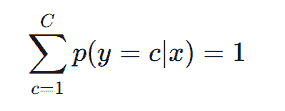

# 不仅仅是美化曲线拟合：探索机器学习的概率基础

> 原文：[`towardsdatascience.com/beyond-glorified-curve-fitting-exploring-the-probabilistic-foundations-of-machine-learning/`](https://towardsdatascience.com/beyond-glorified-curve-fitting-exploring-the-probabilistic-foundations-of-machine-learning/)

<mdspan datatext="el1746060446031" class="mdspan-comment">你看到</mdspan>了一个你不立即理解的数学公式。

你的直觉？停止阅读。

不要。

这正是我开始阅读凯文·P·墨菲的《概率机器学习——入门》时对自己说的话。

这绝对是值得的。

它改变了我对机器学习的看法。

当然，一些公式乍一看可能看起来很复杂。

但让我们看看公式，看看它所描述的是否简单。

当机器学习模型做出预测（例如，分类）时，它实际上在做什么？

它是在所有可能的输出/类别之间分配概率。

而这些概率必须始终加起来等于 100%——或者 1。

让我们来看一个例子：想象我们向模型展示一张动物的图片，并问：“这是什么动物？”

模型可能会这样回答：

+   猫：85%

+   狗：10%

+   狐狸：5%

加起来？

正好 100%。

这意味着模型认为它最有可能是一只猫——但它也为狗或狐狸留了一丝机会。

这个简单的公式提醒我们，机器学习模型不仅能给我们一个答案（=它是一只猫！），还能揭示它们对其预测的信心程度。

我们可以利用这种不确定性来做出更好的决策。

**目录**

1 从概率论的角度看，机器学习是什么意思？

2 所以，什么是监督学习？

3 所以，什么是无监督学习？

4 所以，什么是强化学习？

5 从数学的角度看：我们实际上在学什么？

最终思考——理解概率论视角的目的是什么？

你可以在哪里继续学习？*

## 从概率论的角度看，机器学习是什么意思？

[汤姆·米切尔](https://en.wikipedia.org/wiki/Tom_M._Mitchell)，一位美国计算机科学家，将机器学习定义为如下：

> > *如果一个计算机程序在某个任务类 T 和性能度量 P 方面从经验 E 中学习，那么如果它在 T 中的任务性能随着经验 E 的提高而提高，则称该程序从经验 E 中学习。*

**让我们来分解一下：**

+   **T (任务)**：要解决的问题，例如分类图像或预测购买所需的电力量。

+   **E (经验)**：模型从中学习的经验。例如，训练数据如图像或过去的电力购买与实际消费相比。

+   **P (性能度量)**：用于评估性能的指标，例如准确率、错误率或均方误差（MSE）。

### 概率论视角在哪里？

在经典机器学习中，一个值通常简单地被预测：

> > *“房价为 317k CHF。”*

然而，概率观点专注于学习概率分布。

我们对生成固定预测不感兴趣，而是对哪些不同结果（在这个例子中是价格）的可能性感兴趣。

所有不确定的事物——输出、参数、预测——都被视为随机变量。

在房价的情况下，可能仍然存在谈判机会或通过机制如保险减轻的风险。

但现在让我们看看一个例子，在这个例子中，对不确定性进行明确建模对于做出良好决策至关重要：

想象一个能源供应商需要决定今天购买多少电力。

不确定性在于能源需求取决于许多因素：温度、天气、经济状况、工业生产、通过光伏系统进行自生产等等。所有这些都是不确定变量。

### 那么，概率现在能帮助我们什么呢？

如果我们只依赖单一的最佳估计，我们可能会面临以下风险：

+   我们能量过剩（导致成本高昂的过度生产）。

+   我们能量不足（导致供应缺口）。

另一方面，通过概率计算，我们可以计划需求有 95%的概率将保持在 850 MWh 以下。这反过来又允许我们正确地计算安全缓冲——不是基于单一点预测，而是基于所有可能结果的范围。

如果我们必须在不确定性下做出最优决策，这只有在我们明确建模不确定性的情况下才可能。

### 这为什么很重要？

+   **在不确定性下做出更好的决策：**

    如果我们的模型理解了不确定性，我们就可以更好地权衡风险。例如，在信用评分中，被标记为“不安全客户”的客户可能会触发额外的验证步骤。

+   **提高信任和可解释性：**

    对于我们人类来说，概率比刚性的点预测更直观。概率输出有助于利益相关者理解模型预测的内容，以及模型对其预测的信心程度。

要理解概率观点为什么如此强大，我们需要看看机器实际上是如何学习的（监督学习、无监督学习或强化学习）。所以，这是下一步。

* * *

## 许多机器学习模型是确定性的——但世界是不确定的：

### 那么，什么是监督学习？

简而言之，监督学习意味着我们有示例——并且对于每个示例，我们知道它的含义。

例如：

> *“如果你看到这张图片（输入 x），那么这朵花被称为 Setosa（输出 y）。”*

目标是找到一个规则，对于新的、未见过的输入做出良好的预测。监督学习任务的典型例子是分类或回归。

### 概率观点增加了什么？

概率观点提醒我们，在现实世界中没有绝对的确定性。

**在现实世界中，没有什么是可以完美预测的。**

+   有时信息缺失——这被称为认识论不确定性。

+   有时世界本身是随机的——这被称为随机不确定性。

因此，而不是与一个单一的“固定答案”工作，概率模型与概率一起工作：

> > *“这个模型有 95%的把握是 Setosa。”*

这样，模型不仅猜测，还表达了它有多自信。

### 那么，关于无免费午餐定理呢？

在机器学习中，没有一种适用于所有问题的“最佳方法”。

无免费午餐定理告诉我们：

> > *如果一个算法在某种类型的任务上表现特别出色，那么它在其他类型的任务上表现会较差。*

为什么会这样？

因为每个算法都会对世界做出假设。这些假设在某些情况下有帮助——在其他情况下则有害。

或者正如[乔治·博克斯](https://en.wikipedia.org/wiki/All_models_are_wrong)著名地说：

> *> 所有模型都是错误的，但有些模型是有用的。*

### 监督学习被比作“美化曲线拟合”

[J. Pearl](https://arxiv.org/abs/1801.04016)将监督学习描述为“美化曲线拟合”。

他的意思是，监督学习在本质上，是关于尽可能平滑地连接已知点（x，y）——就像在数据中绘制一条巧妙的曲线。

相反，无监督学习是关于在没有标签的情况下理解数据——试图在没有预定目标的情况下理解潜在的结构。

### 那么，什么是无监督学习？

无监督学习意味着模型接收数据——但没有解释或标签。

例如：

当模型看到一个图像（输入 x）时，它没有被告知它是否是 Setosa、Versicolor 还是 Virgnica。

模型必须自己找出数据中是否存在组、模式或结构。无监督学习的典型例子是聚类。

因此，目标不是学习一个固定的规则，而是更好地理解世界的隐藏结构。

### 概率性观点如何帮助我们？

我们并不是试图说：

> > *“这张图片肯定是 Setosa。”*

而是更倾向于：

> > *“数据中可能隐藏着哪些结构或模式？”*

概率性思维使我们能够捕捉可能解释中的不确定性和多样性。我们不是强制进行硬分类，而是对可能性进行建模。

### 为什么我们需要无监督学习？

有时数据没有标签——或者收集它们会非常昂贵或困难（例如，医学诊断）。

有时类别定义不清楚（例如，一个动作何时开始和何时结束）。

或者有时模型的任务是发现我们自己尚未认识到的模式。

让我们来看一个例子：

想象我们有一组动物图片——但我们没有告诉模型显示的是哪种动物。

任务是：模型应该将相似的动物放在一起。完全基于它可以检测到的模式。

## 那么，什么是强化学习？

强化学习意味着一个系统通过行动并接收关于其行动是好是坏的反馈来从经验中学习。

换句话说：

+   系统看到一种情况（输入 x）。

+   系统选择一个动作（a）。

+   系统收到奖励或惩罚。

简单来说，这实际上与我们训练狗的方式相似。

让我们看看一个例子：

机器人正在尝试学习如何行走。它尝试各种动作。如果机器人摔倒，它会学到这个动作是错误的。如果机器人走了几步，它会获得积极的奖励。

在幕后，机器人构建一个策略或规则，称为策略 π(x)：

> > *“在情况 x 中，选择行动 a。”*

初始时，这些规则完全是随机的或非常糟糕。机器人处于探索阶段，以找出哪些方法有效，哪些无效。通过每一次经验（例如摔倒或行走），机器人会收到反馈（奖励），例如站立时获得 +1 分，摔倒时获得 -10 分。

随着时间的推移，机器人调整其策略，以优先选择导致更高累积奖励的动作。它改变其规则 π(x)，以充分利用好的经验并避免坏的经验。

机器人的目标是什么？

机器人想要找到在时间上带来最高奖励的动作（例如保持直立，向前移动）。

从数学的角度来看，机器人试图最大化其预期的未来奖励价值。

### 概率观如何帮助我们？

在这个例子中，系统（机器人）通常不知道其许多动作中哪一个导致了奖励。这意味着它必须在不确定性下学习哪些策略（策略）是好的。

在强化学习中，我们因此试图学习一个策略：

*π(x)*

这个策略定义了系统在哪种情况下应该执行哪种动作，以在时间上最大化奖励。

### 为什么强化学习如此迷人？

强化学习反映了人类和动物的学习方式。

这非常适合那些没有明确示例，但通过经验可以改进的任务。

电影《AlphaGo》和突破都是基于强化学习。

## 从数学的角度来看：我们实际上在学什么？

当我们谈论机器学习中的模型时，我们意味着的不仅仅是概率观中的函数。

模型是对世界的分布假设。

**现在让我们看看经典观：**

模型是一个函数 f(x)=y，它将输入转换为输出。

**现在让我们看看概率观：**

模型明确地描述了不确定性——例如在 f(x)=p(y∣x) 中。

这不是提供“一个最佳答案”，而是建模不同答案的可能性。

+   在监督学习中，我们学习一个描述条件概率 p(y|x) 的函数：

    给定输入 x，标签 y 的概率。

    我们问：“这个输入的正确答案是什么？”

    公式：f(x)=p(y∣x)

+   在无监督学习中，我们学习一个描述输入数据概率分布 p(x) 的函数：

    数据本身的概率，没有明确的目标值。

    我们问：“这些数据本身的概率有多大？”

    公式：f(x)=p(x)

+   在强化学习中，我们学习一个策略π(x)，它决定了状态 x 的最佳行动 a：

    一条规则，为每个可能的状态 x 建议一个行动 a，在长期内带来尽可能多的奖励。

    我们问：“现在应该执行哪个行动，以便系统在长期内获得最佳奖励？”

    公式：a=π(x)

* * *

在我的[*Substack*](https://sarahleaschrch.substack.com/)上，我定期撰写关于科技、Python、数据科学、机器学习和人工智能领域已发表文章的总结。如果你感兴趣，可以查看或订阅。

* * *

## 最后的想法 — 理解概率观点的目的是什么？

在现实世界中，几乎没有什么事情是真正确定的。

不确定性、信息不完整和随机性是每个我们做出的决策的特征。

概率机器学习帮助我们处理正是这种情况。

而不是仅仅试图“更准确”，概率方法变为：

1.  对错误和不确定性更具鲁棒性。

    例如，在医疗诊断系统中，我们希望模型表明其不确定性（“有 60%的可能性是癌症”）而不是做出固定的诊断。这样，如果存在高度的不确定性，可以进行额外的测试。

1.  更灵活，因此更能适应新情况。

    例如，一个以概率方式模拟天气数据的模型可以更容易地应对新的气候条件，因为它学会了不确定性。

1.  更易于理解和可解释，因为模型不仅给出答案，还告诉我们它们有多确定。

    例如，在信用评分系统中，我们可以向利益相关者展示模型有 90%的把握认为客户是值得信赖的。剩余的 10%不确定性被明确传达——这有助于透明的决策和风险评估。

这些优势使得概率模型更加透明、可信和可解释的系统（而不是黑盒算法）。

## 你可以在哪里继续学习？

+   [书籍 — 凯文·P·墨菲的《概率机器学习：入门》](https://probml.github.io/pml-book/book1.html)

+   [书籍 — 凯文·P·墨菲的《概率机器学习：高级主题》](https://probml.github.io/pml-book/book2.html)

+   [GeeksForGeeks 博客 — 监督学习、无监督学习和强化学习之间的比较](https://www.geeksforgeeks.org/supervised-vs-reinforcement-vs-unsupervised/)

+   [Nvidia 博客 — SuperVize Me：监督学习、无监督学习、半监督学习和强化学习之间的区别是什么？](https://blogs.nvidia.com/blog/supervised-unsupervised-learning/)

+   [DataCamp 博客 — 监督机器学习](https://www.datacamp.com/blog/supervised-machine-learning)

+   [DataCamp 博客 — 无监督学习简介](https://www.datacamp.com/blog/introduction-to-unsupervised-learning)

+   [DataCamp 博客 — 无监督机器学习速查表](https://www.datacamp.com/cheat-sheet/unsupervised-machine-learning-cheat-sheet)
