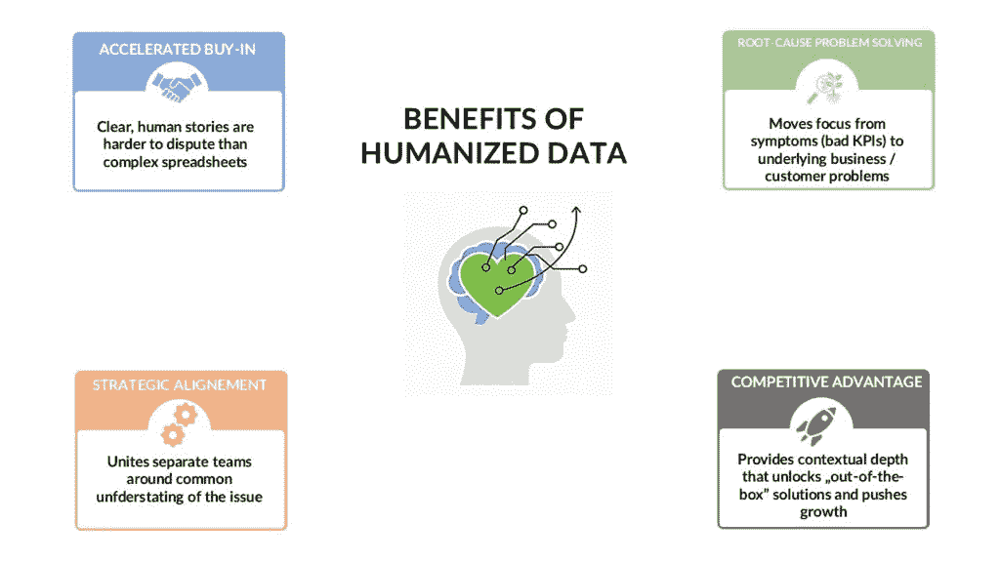
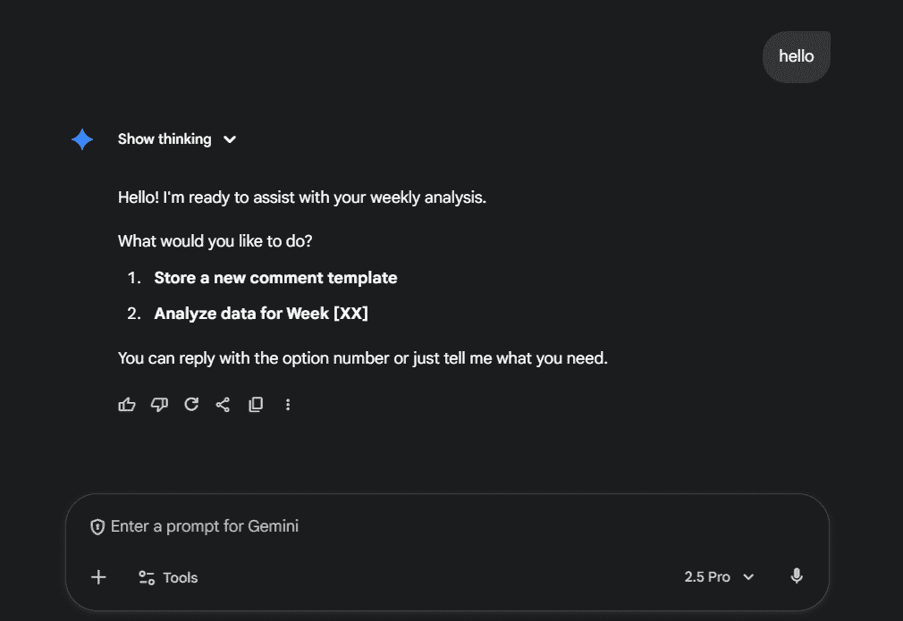
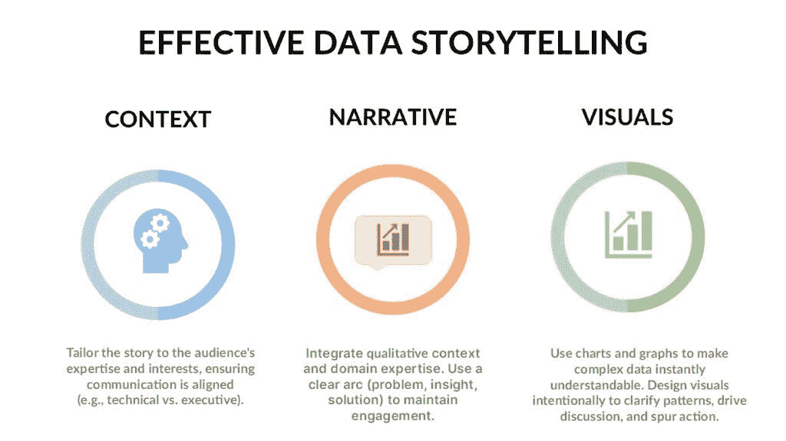
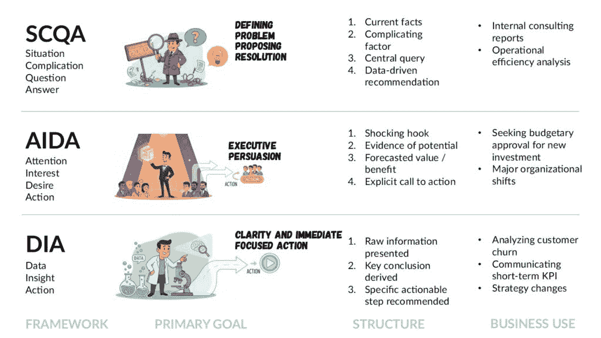

# 超越数字：如何使数据和分析人性化

> 原文：[`towardsdatascience.com/beyond-numbers-how-to-humanize-your-data-analysis/`](https://towardsdatascience.com/beyond-numbers-how-to-humanize-your-data-analysis/)

<mdspan datatext="el1762458770204" class="mdspan-comment">你有没有注意到</mdspan>主帖图片中的奇怪之处？

你实际上看到的是赫尔曼网格的变体，我是借助 Gemini 生成的。更准确地说，我是基于雅克·尼尼奥对这种网格的不同修改创建的。经典的赫尔曼网格在交叉处创造出错觉的灰色斑点，因为视网膜细胞误解了外围刺激的亮度。雅克·尼尼奥的变体放大了通过视觉分组和使用焦点来操纵感知的‘容易’程度[1]。

回到最初的问题，如果答案是肯定的，那么你可能想知道，你被一种名为**闪烁网格错觉**的强大视觉错觉所欺骗。当你瞥向网格时，你可能会看到暗淡的、幽灵般的‘鬼影’点出现在交叉处的白色圆圈中。这些点似乎在‘闪烁’或闪耀，随着你的眼睛移动而出现和消失，但错觉最强的一部分是当你试图直接看其中一个黑点时：它会消失。实际上，这些点只出现在你的余光中。这种现象是由你眼睛中的神经元处理高对比度区域的方式造成的，本质上是在‘欺骗’你的大脑，让你感知到一个实际上并不存在的点。

**这些网格作为数据和分析的有力警示故事。**在我看来，它们很好地说明了‘原始数据’（实际的黑白线条）和‘感知数据’（错觉的黑白/灰色斑点）之间的差距。它们表明，信息的视觉呈现方式可以根本改变人类的感知，甚至创造虚假的现实。**这让你想起什么吗？**考虑数据可视化：如果一个图表或图形在设计时没有考虑到我们自身感知系统中的‘缺陷’，它可能会无意中误导观众，使他们感知到不存在的虚假趋势或相关性——‘灰色斑点’。

有很多数据，但做出了错误的决定。来源：YouTube

## 呼吁数据人性化

‘传统’的数据分析、商业智能和数据科学方法主要关注数据的**技术**属性——其体积、速度和多样性。在这种设置中，指标被视为目的本身。**结果？关键的洞察力仍然埋藏在大量的电子表格或冗长的报告中。反过来，‘数据驱动’的决策制定需要花费很长时间，并且往往证明是无效的[2]。**即使有最细致的计划、全面的仪表板和强大的数据集，今天的领导者、经理和同事仍然发现自己在问：

> *井底那是什么光？*

这个特定的“消失的点”说明了即使数据完美，如果人们不能正确使用它（在这种情况下是倒着读），也不能总是消除任何复杂任务的基本不确定性。

为了摆脱“数据丰富，行动匮乏”的悖论，组织需要一种新的哲学：**数据人性化**。

这个概念不仅仅是购买一个新工具：**这是拥抱一种新的思维方式**。目标是把数据从被动的电子表格转变为引人入胜的故事，从而**推动**利益相关者采取行动。在我看来，实施“人性化”方法基于四个要素：

1.  **一些小修复（先从这些开始）：** 与其启动另一个复杂的公司项目，不如从今天开始做一些小的修复。

1.  **工匠：** 建立“数据工匠”角色，以塑造和翻译复杂的数据。

1.  **故事：** 将“数据讲故事”作为核心竞争力，使洞察清晰且可操作。

1.  **影响：** 执行稳健的道德治理，并且，关键的是，衡量分析带来的财务回报。

### “人性化数据”是什么意思？

在详细讨论这些元素之前，明确理解我们所说的“人性化数据”至关重要。

**人性化数据是一种战略资产，它将正在发生的事情转化为为什么它很重要。这种上下文是使数据可操作的原因。而不是仅仅跟踪症状（关键绩效指标，KPIs），团队最终可以解决根本原因问题。**

当传统的 KPIs 和人化洞察结合时，真正的力量才会显现。它们相互增强，使前进的道路清晰且直接。

### 从指标到意义：例子

| **标准 KPI（是什么）** | **人性化洞察（为什么和谁）** |
| --- | --- |
| **购物车放弃率是 75%。** | 75%的购物者放弃了购物车。我们的分析显示**60%的人在结账页面放弃购物**，将“意外费用”作为主要原因。 |
| **“凤凰”项目超出了预算 30%。** | “凤凰”项目超出了预算 30%，这是由于**核心工程团队 800 小时的未计划加班**来修复第 3 模块的范围蔓延。 |
| **生产线 B 的可用率是 88%。** | 生产线 B 的 12%停机时间几乎完全是由于手动切换。**自动化这个特定过程**将每周恢复 10 小时的产量。 |
| **第三季度客户流失率上升了 8%。** | 我们第三季度的 8%客户流失率是由**长期客户（3 年以上）**使用我们的新支持系统所驱动，他们报告“首次电话解决率”下降了 50%。 |

表 1. KPIs（症状）与人性化洞察的结合。

来源：作者表格。

表 1 说明了上述主张。左侧显示基于原始 KPI 的简单评论，而右侧则通过扩展的人性化见解丰富了相同的指标。正如这个比较所示，原始 KPI 仅仅揭示了症状，而人性化见解则揭示了根本原因——例如客户动机或流程障碍。这种产生的清晰度远更具有可操作性，使团队能够超越仅仅跟踪指标，开始解决阻碍成功的核心问题。

### 人性化数据的关键好处：

基于以下内容的基于人性化的数据的好处。图片由作者根据多个来源制作。

中心以及右上角的图标是在 Gemini 中生成的。

## 数据人性化的要素

### 在通往数据人性化的道路上进行的小修复和快速胜利。

为了简化我的每周报告流程，该流程涉及从多个来源获取数据，例如一个广泛的 KPI 仪表板，我最近开发了一个代理。为了确保报告提供的不只是简单的数字更新，我给代理一个额外的任务，提示如下：

> *为我找到本周的一个独特见解……寻找一些不同寻常的东西：一个异常，一个趋势突破，或者我可以分享的一些有趣的东西.*

**无论代理产生什么，我都会审查它，并用我从业务会议中收集到的自己的定性见解来丰富它。**偶尔，我会将这个增强后的最终评论反馈给模型，让它学习并改进下周的建议。

我编写的简单代理的打开菜单。来源：作者屏幕截图。

这个简单的例子展示了我在本段中将要分享的强大技术之一。它们都具有三个共同特点：它们是实用的，几乎不需要任何资本投资，并且只需占用你每周日程中的一小部分时间。你可以在团队或个人层面上开始这些，直接应用于你自己的工作。

**以下是有八种简单的方法可以开始。**

| **找到真实的问题** | 与其他部门的同事交谈。询问他们对数据的挫败感或哪些数据相关的任务完成时间过长。倾听他们的挑战，找到值得解决的问题。这建立了信任，并允许你解决重要的问题。 |
| --- | --- |
| **讲述人的故事** | 比如说“每月流失率”这样的指标通常是抽象的。重新定义它们。与其写“流失率：3.4%”，不如写“上个月：452 名客户离我们而去。”这种在仪表板上的小变化将数据与真实的人联系起来，使指标更有意义和可操作。 |
| **分享一周的数据故事** | 每周，从你的数据中找到一个简单、有趣的见解。为它创建一个清晰的图表，写 2-3 句话解释为什么它很重要，并在公司范围内的渠道，如 Slack 上分享。这使得数据成为常规、非威胁性的对话。 |
| **在分享您的数据或见解之前进行快速伦理检查** | 花几分钟时间提出关键伦理问题。例如：“这项分析可能会伤害任何群体吗？”或“这些数据可能会被如何误解？”将此作为必经步骤，以确保您负责任地使用数据。 |
| **在仪表板上添加客户声音** | 您的图表显示了正在发生的事情，但客户评论解释了原因。在您的仪表板上添加一个部分，显示来自调查或支持聊天的真实、匿名客户引语。这为数字提供了关键上下文。 |
| **构建“5 分钟仪表板”** | 使用简单、免费的工具（如 Looker、Datawrapper），或人工智能助手（如 Gemini 或 ChatGPT）快速回答利益相关者的一个紧急问题。不要追求完美。创建两三个简单的图表，立即分享，并获取反馈。这种协作方法可以快速产生价值。 |
| **精通一种可视化工具** | 在大多数情况下，您不需要复杂、昂贵的软件。精通一个工具，无论是免费还是付费的，即使是 Excel 或 Sheets 也能完成任务。最重要的是，您可以使用这个工具创建干净、引人入胜的图表。使用这个工具进行“每周数据故事”练习，以提高您的讲故事能力。  |
| **使用 AI 撰写草稿，而非最终报告。**  | 让生成式 AI 撰写总结或报告的第一稿（类似于我的小代理）。然后，使用 Grammarly 等工具使其听起来更自然。**始终让人类审查最终文本，以检查准确性、语气和同理心（!!!）。** |

表 2. 八个“数据人性化”快速修复方案。

来源：作者根据自身经验编制的表格。

### 工匠精神

图片由[Shubham Sharan](https://unsplash.com/@shubhamsharan?utm_source=unsplash&utm_medium=referral&utm_content=creditCopyText)在[Unsplash](https://unsplash.com/photos/a-person-standing-in-front-of-a-wall-of-lights-OC8VNwyE47I?utm_source=unsplash&utm_medium=referral&utm_content=creditCopyText)上提供

人性化数据是使复杂信息易于理解的关键。通过添加上下文，原始数据被转化为可消费的见解，赋予业务分析师权力，而无需他们成为编程或统计专家。

**这种转型需要提升数据分析师的角色，使其成为“数据工匠”。**’

数据工匠必须学习如何充当“上下文建筑师”。这实际上成为一个结合了深厚业务知识和技术技能以构建复杂数据工作流程的混合角色。他们的主要职能是让数据“讲述其故事”，从而促进和推动战略决策。

### 数据工匠应履行以下职能：

+   **摄取与整合**：他们掌握了将传统结构化数据与来自社交媒体或传感器等来源的非结构化上下文相结合的“艺术”。这是机器仍然无法做到的事情——寻找意外的模式，关联那些在理论上没有明显、清晰联系的事实（或假设），否则这些可能被人工智能助手读取。

+   **寻求模式而非完美**：他们将分析目标从“像素级”精确度转变为在大数据量中识别有意义的、预测性的模式。有时，一个后来未被证实的大胆假设可能比完美的数据更有价值。有时，明天以 80%的准确性回答我们问题的东西比三周后 99.9%的准确性更有价值。

+   **决策点的洞察**：工匠帮助去中心化强大的分析工具，使决策者能够访问并赋予他们权力。他们主张利用简单的仪表板创建工具，如 Looker 或 Datawrapper，即使它们提供的是静态数据。目标不是完美的用户体验或美丽的设计。目标是促进更快地做出决策。如果洞察“触动”了，那么总是容易（或者至少更容易）找到时间和资源来确保适当的数据上传或友好的界面。

+   **重用分析知识产权**：创建健壮、可重用的数据对象和分析工作流程。优化你的工作。创建代理来处理重复性任务，但给他们“自由”来发现超出基本算法的东西。

**此角色的主要目标是使复杂分析民主化**。数据工匠通过创建可重用知识产权和易于访问的平台来承担复杂性的负担。这反过来又使得组织中的非专业人士能够做出明智、快速的决策，并促进真正的组织敏捷性 [3]。

## 故事

数据讲述是将技术洞察转化为有说服力的、人类行动的主要转换机制。如果洞察是以洞察为中心的组织中的货币，那么讲述就是交易系统。

#### 每一个引人入胜的数据故事都必须有意承认和整合三个基本要素：

数据讲述的三个支柱。图片由作者提供。

**选择叙事框架是一个关键的战略决策，它取决于沟通的主要目标**。当受众是高管利益相关者时，这一选择变得至关重要。高管在紧张的时间压力下工作，专注于战略、风险和投资回报率。为技术团队构建的数据故事——可能是一次深入的探索性研究——将无法引起共鸣。

**框架必须根据目标定制。** 如果目标是为新平台争取资金，那么像**AIDA**（注意、兴趣、欲望、行动）这样的说服性结构对于构建有说服力的商业案例至关重要。如果目标是报告操作瓶颈并提出解决方案，那么以问题为中心的、逻辑性的**SCQA**（情况、复杂、问题、答案）框架将更有效地展示尽职调查并导致明确的建议。**框架是洞察力的载体，对于高管听众，这个载体必须是快速、清晰且直接针对决策的。**

### 战略数据讲故事框架示例

来源：作者基于[3]的图像。Gemini 生成的作者图像。

对于高管来说，有效的数据讲故事是一种战略性的翻译，而不是数据倾倒。**领导者不需要原始数据；他们需要洞察力。** 他们需要数据被清晰、简洁地呈现，以便他们可以快速把握影响，识别关键趋势，并将这些发现传达给其他利益相关者。一个强大的叙事结构——从明确的问题到可行的解决方案——可以防止宝贵的洞察力在糟糕的论证中丢失。这种将数据转化为战略的能力将数据专业人士从单纯的统计学家提升为真正的战略合作伙伴，他们能够影响高级业务方向。

### 高影响力数据可视化的原则

数据可视化是复杂数据集与人类理解之间的桥梁（也是我许多文章的主题）。为了有效，[图表或图形的选择必须与信息相一致](https://towardsdatascience.com/turning-insights-into-actionable-outcomes-f7b2a638fa52)。例如，折线图最适合展示随时间变化的趋势，条形图最适合进行清晰的比较，而散点图最适合揭示变量之间的关系。

除了选择正确的图表类型之外，有意识地使用颜色和文本也是至关重要的。颜色不应是装饰性的；它应该有目的地使用，以突出最重要的信息，使观众能够更快地抓住关键要点。文本应尽可能少，仅用于阐明视觉本身无法表达的观点。

最后，所有可视化都承担着道德责任。数据完整性必须得到维护。[可视化绝不能有意地歪曲事实](https://towardsdatascience.com/how-not-to-mislead-with-your-data-driven-story)，例如，通过使用误导性的刻度或不适用的颜色对比。

### 影响

### 核心思想：证明数据的价值以获得支持

要让高管资助“数据人性化”（使数据清晰且易于使用），你必须证明其财务价值。最好的方法是通过展示其投资回报率（ROI）。

### 如何证明价值：一个两步 ROI 计划

投资回报率的计算是一个简单的比较：

> **行动的价值（来自清晰的数据）与不采取行动的成本（来自混乱的数据）**

一个令人困惑且被忽视的仪表板不仅毫无价值；其投资回报率是**负的**，因为它浪费了时间和金钱。一个清晰、人性化的仪表板是一种投资，使团队更聪明、更高效。

### 第 1 步：找出数据质量差的**真实成本**

首先，衡量你现有、“非人性化”报告的**真实成本**。这个基线不仅仅是分析师的薪水。包括混乱的隐藏成本：

+   **洞察力所需时间：**经理们浪费了多少小时试图理解复杂的报告？

+   **翻译劳动：**分析师花了多少小时重新解释发现或制作更简单的 PowerPoint 版本？

+   **洞察力的采用：**有多少关键决策实际上是基于报告的？（如果为零，则报告毫无价值。）

**这个总数是你目前为混乱所付出的高昂代价。**

### 第 2 步：衡量数据人性化的**收益**

一旦你推出了新的、清晰的仪表板，将其与基线进行比较。收益是双重的：

1.  **效率收益（省钱）：**

    +   经理的洞察力所需时间可能从一小时缩短到五分钟。

    +   分析师的翻译劳动（重新解释）几乎消失。

1.  **价值收益（赚钱）：**

    +   这是真正的回报。追踪由于数据最终清晰而做出的**新、更好或更快的决策**。

    +   **示例：**一个营销团队提前 10 天调整预算，或者销售团队发现了一个新的机会，产生了可衡量的新收入。

### 一个简单的例子

+   **（之前，数据质量差）：**一个包含 10 个标签的数据倾倒电子表格每月使公司损失**$10,000**的管理时间和分析师支持。

+   **（之后，数据人性化）：**一个新的、一页的仪表板建设成本为**$1,500**。

+   **（第一个月的回报）：**节省**$8,000**的恢复时间和帮助销售团队创造**$20,000**的新价值。

**底线：****数据人性化不是一个“想要”的设计选择。它是一种高回报的商业战略，将组织浪费转化为决定性行动[7]。**

## 结论

最终，从原始数据到现实世界影响的旅程充满了感知陷阱，就像赫尔曼网格的错觉点一样。正如我们所看到的，数字本身并不是不言自明的；它们是被动的电子表格和抽象的 KPI，往往使我们“数据丰富但行动匮乏”。

打破这个循环需要战略和文化上的转变，转向数据人性化。这种转型并非关于新软件的引入，而是关于一种新的思维方式——一种赋予**数据艺术家**寻找背景、将**数据讲故事**作为核心竞争力的方式，并通过清晰的回报率（ROI）不断证明其**影响**。

通过拥抱这些原则，我们超越了网格中的“幽灵”——虚假的相关性和错失的机会——看到了背后的人类现实。这就是我们最终弥合分析和行动之间的差距，将数据从简单的“发生了什么”的报告中转变为“接下来会发生什么”的有力催化剂。 

## 来源

[1] Ninio, J. 和 Stevens, K. A. (2000) Hermann 网格的变体：一种灭绝错觉。感知，29，1209-1217。

[2] 数据故事讲述 101：如何用数据讲述一个有力的故事 – StoryIQ，2025，[`storyiq.com/data-storytelling/`](https://storyiq.com/data-storytelling/)

[2] 人类化大数据 – DLT Solutions，[`www.dlt.com/sites/default/files/sr/brand/dlt/PDFs/Humanizing-Big-Data.pdf`](https://www.dlt.com/sites/default/files/sr/brand/dlt/PDFs/Humanizing-Big-Data.pdf)

[3] **Gouranga Jha**，使用数据讲故事框架，Medium，[`medium.com/@post.gourang/frameworks-for-storytelling-with-data-5bfeb1fbc37b`](https://medium.com/@post.gourang/frameworks-for-storytelling-with-data-5bfeb1fbc37b)

[4] **Michal Szudejko**，将洞察转化为可操作的结果，[`towardsdatascience.com/turning-insights-into-actionable-outcomes-f7b2a638fa52`](https://towardsdatascience.com/turning-insights-into-actionable-outcomes-f7b2a638fa52)

[5] **Michal Szudejko**，如何在数据可视化中使用颜色，[`towardsdatascience.com/how-to-use-color-in-data-visualizations-37b9752b182d`](https://towardsdatascience.com/how-to-use-color-in-data-visualizations-37b9752b182d)

[6] **Michal Szudejko**，如何避免用数据驱动故事误导，[`towardsdatascience.com/how-not-to-mislead-with-your-data-driven-story`](https://towardsdatascience.com/how-not-to-mislead-with-your-data-driven-story)

[7] 以投资回报率为驱动的业务案例与实现价值 – 工具，[`instrumental.com/build-better-handbook/roi-business-cases-realized-value-technology-investments`](https://instrumental.com/build-better-handbook/roi-business-cases-realized-value-technology-investments)

* * *

### 免责声明

*本文使用 Microsoft Word 编写，拼写和语法均经 Grammarly 检查。我审查并调整了任何修改，以确保我的意图得到准确反映。所有其他 AI 的使用（图像和样本数据生成）均直接在文本中披露。*

* * *
