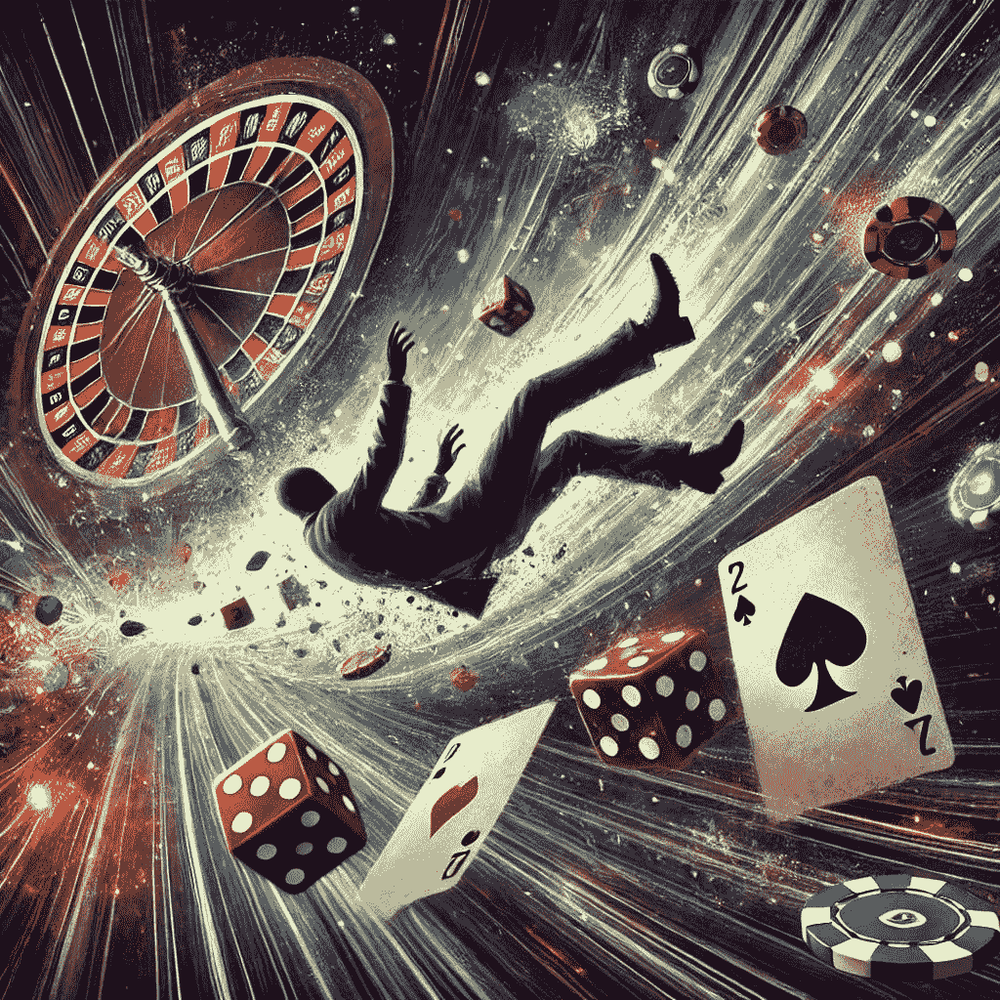
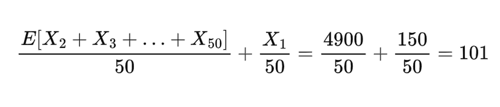
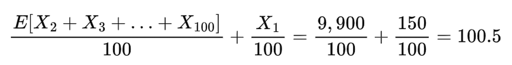
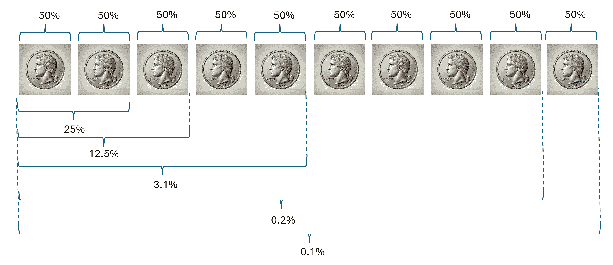

# 小份量数据科学：陷入赌徒谬误

> 原文：[`towardsdatascience.com/bite-size-data-science-falling-for-the-gamblers-fallacy-9a3ebf7a86cd/`](https://towardsdatascience.com/bite-size-data-science-falling-for-the-gamblers-fallacy-9a3ebf7a86cd/)

由作者提示生成的 DALL-E 图像

文章的“小份量”格式旨在就单一、小范围的主题提供简洁、集中的见解。我的目标是写一篇文章，让你在工作中的短暂休息时能够获得一些关键收获。阅读这篇文章后，你将理解这些关键点：

1.  赌徒谬误的定义

1.  为什么我们会陷入其中

1.  它在你作为数据科学家的工作中可能引起的问题以及如何避免这些问题

> [**小份量数据科学**](https://medium.com/@jarom.hulet/list/1ee9475b4f57)

### **1 – 什么是赌徒谬误？**

赌徒谬误是一种错误的假设，即先前随机事件将影响其他随机事件。这是一种认知偏差，使我们相信之前随机发生的事情将影响未来的随机结果。这个谬误的相反面是理解随机性是随机的，任何数量的奇特独立事件都不会影响随机事件本身。

让我们通过几个例子来对这个谬误有一些直观的了解：

**抛硬币（“经典”例子**）

赌徒谬误的经典和广泛使用的例子是一系列抛硬币。假设我抛硬币九次——这九次抛掷都是“正面”。我即将进行第十次抛掷。再次得到“正面”的概率是多少？正确的答案（假设抛掷是独立的，硬币是“公平”的）是 50%。这通常会感觉是错误的，因为连续抛 10 次正面似乎不太可能。那种“错误”的感觉就是赌徒谬误在你内心发挥作用！

**赌桌**

想象一下，你在赌场*赌博*——你坐在赌桌前，最近十次旋转都中了黑色（黑色意味着如果旋转结果落在任何黑色数字上，你就能获得回报；这大约有 48%的概率），你每次都输了。你应该继续下注黑色吗？还是转到红色？或者垂头丧气地离开赌场？如果你像我以及许多人一样，你内心深处想要继续下注黑色，因为它“应该”赢一次。这种感觉是如此不可能，下一次旋转不会再次出现黑色。这种感觉就是赌徒谬误！

**交通灯**

想象一下，你开车去上班，连续遇到了三个红灯——让我们假设这些交通灯是独立运作的（在现实生活中可能并不公平）。沮丧之余，你*知道*下一个灯一定是绿灯，你怎么可能在这段通勤中遇到这么多红灯呢？！这也是赌徒谬误。

**体育表现**

想象一下，你现在正在观看你最喜欢的运动队（我的队伍是达拉斯小牛队）。你的明星球员已经连续命中了 10 次投篮，他正处在火热状态！你的朋友，对方球队的球迷，转向你说——他接下来将会连续错过很多投篮，因为他的投篮平均命中率是 47%。假设你的明星球员的投篮是相互独立的，你朋友的结论是没有根据的。你的朋友已经成为赌徒谬误的受害者！

### **2 – 为什么我们会陷入赌徒谬误？**

现在我们已经了解了赌徒谬误是什么，让我们来谈谈为什么它会吸引我们。有许多因素和理论解释了我们为什么会受到赌徒谬误的影响。我想重点谈谈我认为最有趣和有说服力的两个原因。

**我们误解了大数定律**

大数定律断言，随着样本量的增大，样本均值会非常接近总体均值（这是一个非正式的定义）。更大的样本增加样本均值与总体均值匹配的概率这一概念是直观的，并且大多数人正确理解了这一点。误解在于样本均值是如何收敛到总体均值的。

**正确理解**：随着样本量的增加，观测值的数量会“稀释”极端随机值对样本分布两端的影響。这种稀释会平衡样本分布的两端，并最终导致样本均值与总体均值收敛。

**错误理解**：我们常常无意中（通常是无意识地）认为大数定律是由某种平衡机制“强制执行”的。例如，如果我们样本中有一个极端低的观测值，我们将在样本中有一个极端高的观测值来补偿。当然，没有“平衡”机制——这是对随机事件本质的误解。样本观测值不会相互“抵消”，而是相互“稀释”。如果我们有一个非常大的样本量，我们可能会遇到极端低的观测值来平衡极端高的观测值——但没有任何规则强制执行这一点。这就是为什么样本量在**大数**定律中如此重要的原因。我们抽取的随机样本越多，观测值相互平衡的可能性就越大。如果有平衡机制，样本量就不会那么重要，因为平衡样本会被强制执行。这种隐含的信念，即随机事件存在“平衡”，导致了赌徒谬误。在这种印象下，我们认为“如果之前发生了某事，那么之后一定会出现平衡”——当然并非如此！

> 随机性中没有平衡力。大数定律不是平衡定律，而是稀释定律。

大多数人如果面对一个关于如何随着样本量增加随机样本平衡的问题时，可能会捕捉到这个问题。但是，当我们移除这个美好的框架时，我们倾向于陷入谬误。

阿莫斯·特沃斯基和丹尼尔·卡尼曼对认知偏差进行了多项研究。他们经常向科学家和统计学家提出精心设计的、揭示偏差和基本误解的问题——甚至在这些专业人士中也是如此！以下是他们提出的一个问题，揭示了人们对赌徒谬误的易受性。看看你将如何回答！

“该城市八年级学生群体的平均智商*已知*为 100。你随机选取了 50 名儿童进行教育成就研究。第一个测试的孩子的智商为 150。你预计整个样本的平均智商是多少？¹”——特沃斯基与卡尼曼

正确答案是 101，我们将在下面证明。特沃斯基和卡尼曼报告说，“令人惊讶的大量人数”答错了。人们认为答案是 100，因为其他 49 个样本将*抵消*第一个样本中异常高的智商——这根本不是事实。其他样本与第一个样本是独立的。这是一个在赌场之外的赌徒谬误的例子！

就算你不相信我，以下是在一个观察值为 150 的 50 名学生样本的期望值计算。

给定一个 150 IQ 的观察值计算样本期望值 - 图片由作者提供

他们不会*抵消*彼此，但他们可以*稀释*彼此——让我们看看如果我们的样本增加到 100 名学生会发生什么？

展示如何通过增加样本量稀释 150 IQ 观察值 - 图片由作者提供

随机样本越多，样本的期望值就越接近 100——即使在我们样本中的极端高智商学生也是如此。这种收敛是由稀释而不是平衡驱动的！

**我们将一系列随机事件的概率与一个单一随机事件的概率混淆**

这里有两个类似的问题，但答案却截然不同：

> 抛掷公平硬币连续 10 次都是正面的概率是多少？
> 
> 公平硬币已经抛掷了 9 次，所有 9 次都是正面。第 10 次抛掷也是正面的概率是多少？

你能发现其中的区别吗？一个是询问一系列事件的概率；另一个有巧妙的框架，但只询问一个单一事件的概率。

第一个问题描述了一个相当不可能的事件。我们可以超越直觉，使用二项分布来计算确切的概率，这简化为：0.5¹⁰ = 0.1% - 我会称之为“不太可能”。

第二个问题是；给定一个不太可能的事件已经发生，另一个独立事件发生的概率是多少。因为我们只谈论第 10 次翻转，所以答案是 50%。但我们感觉它更少，因为一个奇怪但独立的事件发生在它之前。

每次翻转独立有 50%的概率出现正面；随着翻转次数的增加，一系列正面的概率变得不太可能——硬币图像由 DALL-E 生成，其他部分由作者生成

如果我们在心中不区分这两个问题（一系列事件的概率与单个事件的概率），我们可能会容易受到赌徒谬误的影响。

让我们回到轮盘赌桌上来完成这个要点。想象一下你连续 10 次都输了黑色——你感觉不可能连续 11 次都输。你必须在下一轮赢得胜利！确实，连续 11 次都输的概率非常低。但是，这个概率只适用于你在任何旋转之前坐下时。一旦你已经连续输了 10 次，第 11 次输的概率就只是你一般输的概率。之前发生的事情没有任何影响！

### 3 – 赌徒谬误在你的数据科学家工作中可能引起哪些问题？你如何避免它们？

我整理了一份我认为最有可能受到赌徒谬误影响的数据科学领域的列表。与上一节类似，我的目标不是制作一个详尽的列表，而是突出我认为可能受到影响的最常见领域。

1.  **问题：** 我们倾向于赌徒谬误可能使我们倾向于过于迅速或样本量过小地接受趋势或模式。这个谬误使我们感觉需要更少的随机变量（即更小的随机样本）来从噪声中观察到信号。**如何避免：** 这可以通过使用统计技术来计算我们在样本中观察到的模式是偶然发生的概率来避免。

1.  **问题：** 赌徒谬误可能导致我们设计样本量过小的测试。这会导致我们的测试效力不足，意味着我们能够从实验中捕捉到趋势/模式的可能性太低。**如何避免：** 我们可以通过计算测试的效力并决定是否可以接受它来避免这个问题。如果我们仅仅依靠直觉来估计一个合适的样本量——我们很可能选择一个样本量过小。统计计算效力消除了我们在决策中需要使用直觉的需求。

1.  **问题：** 赌徒谬误可能导致我们在接受重复结果时过于保守。由于赌徒谬误迫使我们相信小样本能够代表总体**以及**其他小样本（Tversky & Kahneman），我们倾向于期望重复测试和实验之间有太多的相似性。例如，假设我们在 15 株豆苗上测试一种新的肥料。我们得到的结果显示，这种肥料有助于豆苗生长，p 值小于 5%。我们决定稍后重复实验，得到一个统计上不显著的 p 值为 15%，但肥料对生长的平均估计值为正值。鉴于第二个实验是“不显著的”，我们倾向于认为结果没有被重复——即使在这两个实验中样本量都较小。**如何避免：** 再次强调，避免这种问题的最佳方式是通过统计学和计算。可以使用原始实验/测试的关键统计数据来计算“重复概率”，例如效应量、标准误差和统计功效。有了这些指标和重复实验的样本量，我们可以得到一个定量的（而不是直观的）理解，了解重复结果将有多难。在豆苗的例子中，如果我们发现结果有 50%的可能性会在 15 株豆苗的样本中被重复，那么第二个实验没有重复统计显著性，我们也不会轻易放弃第一个实验的发现。

### 结论

我们已经讨论了赌徒谬误的定义、为什么它对我们有吸引力以及它如何在我们作为数据科学家的工作中引起问题。赌徒谬误不仅出现在赌场之外，而且在我们发现它的任何地方都会引起问题。**对抗谬误的最佳方式是依靠统计学和计算，而不是我们的直觉来做出决策和结论。**

1.  Tversky, A., & Kahneman, D. (1971). 小数定律的信念. 心理学报, 76(2), 105–110\. [`doi.org/10.1037/h0031322`](https://doi.org/10.1037/h0031322)
