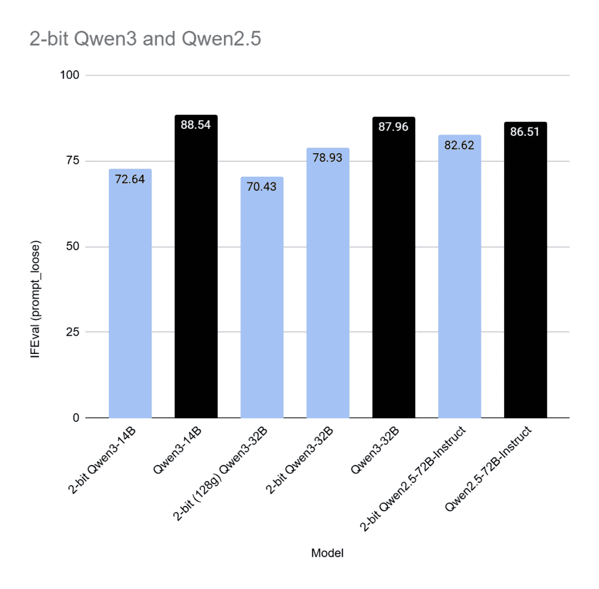
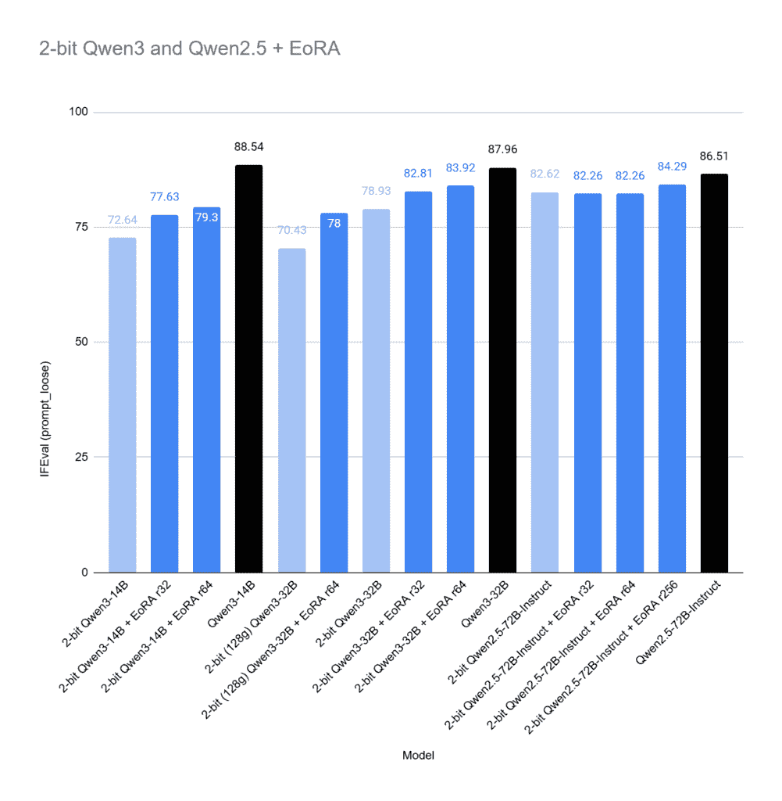
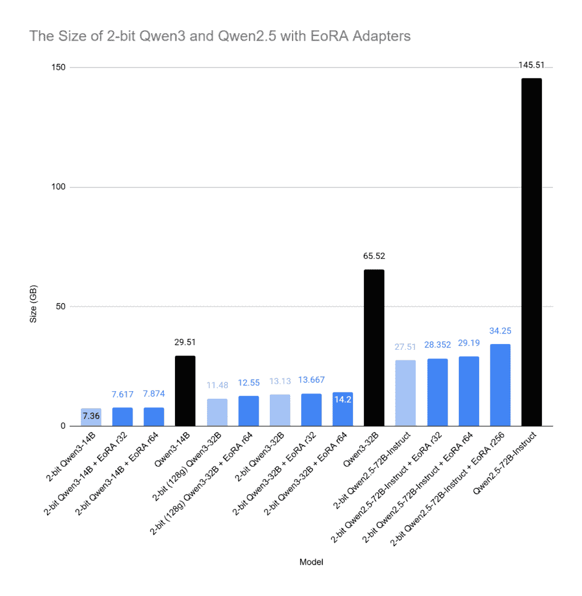

# 使用 EoRA 提升 2 位 LLM 的准确性

> 原文：[`towardsdatascience.com/boost-2-bit-llm-accuracy-with-eora/`](https://towardsdatascience.com/boost-2-bit-llm-accuracy-with-eora/)

<mdspan datatext="el1747288055104" class="mdspan-comment">量化</mdspan>是减少大型语言模型（LLMs）内存占用足迹的关键技术之一。它通过将模型参数的数据类型从 32 位浮点（FP32）或 16 位浮点（FP16/BF16）等高精度格式转换为低精度整数格式（通常是 INT8 或 INT4）来实现。例如，将模型量化到 4 位意味着每个参数仅使用 0.5 字节，而 FP32 则需要 4 字节。

后训练量化方法如 GPTQ 和 AWQ 可以显著减少大型模型的大小。像 Llama 3 这样的模型，拥有 700 亿个参数，在 FP16 下可以占用大约 140 GB，但使用 4 位量化可以减少到大约 40 GB，同时在下游任务上仍保持强大的性能。

然而，尽管这种大幅减少，这些模型仍然超过了大多数消费级 GPU 的内存容量，这些 GPU 通常提供 24 GB 到 32 GB 的 VRAM。为了使这些模型真正可访问，需要将量化到更低的位宽，例如 2 位。尽管低位量化最近取得了进展，但实现稳定和准确的 2 位量化仍然是一个重大挑战。

在本文中，我们回顾了一种称为**EoRA**的技术，该技术有助于补偿量化引起的误差。EoRA 是一种*无需训练*的方法，这意味着它可以快速有效地应用于任何模型，即使是最大的模型。我们将检查 EoRA 是如何工作的，并展示它如何显著提高 2 位量化模型的性能，使它们的准确性接近全精度版本，同时体积缩小到原来的 1/5.5。

我们将分析使用大型模型（如 Qwen3-32B 和 Qwen2.5-72B）获得的实验结果，这两个模型都使用最先进的量化技术量化到 2 位，以说明 EoRA 的有效性。

## 深入研究特征空间以寻找适配器

后训练量化或更普遍地说，压缩旨在通过最小化原始权重*W[l]*和压缩权重*Ŵ[l]*之间的输出差异来减少模型大小或推理成本，这仅使用一个小型校准数据集。

大多数量化方法都是按层划分的，但压缩格式的选择是刚性的，这限制了满足不同部署需求时的灵活性。

为了绕过格式限制并提高准确性，先前的工作，如 QLoRA [1] 和 HQQ+ [2]，直接在冻结的量化模型上微调了 LoRA 适配器。

也可以将压缩重新定义为*补偿*问题：给定一个压缩模型，引入低秩残差路径，专门纠正压缩误差。

一种简单的方法使用 SVD 分解压缩误差：

\[\Delta W_l = W_l – \hat{W}_l\]

转换为

\[U_l \Sigma_l V_l^T\]

通过两个矩阵形成低秩逼近：

\[B_l = U_l \Sigma_l \]

\[A_l = V_l^T\]

其中 *A[l]* 和 *B[l]* 是 LoRA 适配器的标准张量。

然而，普通的 SVD 有两个限制：它不能直接最小化原始层压缩损失，并且它将容量均匀地分配到所有误差分量，忽略了模型不同部分的重要性差异。

为了解决这个问题，NVIDIA 提出了**EoRA** [3]。

[EoRA：使用特征空间低秩逼近的无训练补偿压缩 LLM](https://arxiv.org/html/2410.21271v1)

EoRA 首先将压缩误差投影到由输入激活协方差定义的特征空间：

\[\tilde{X} \tilde{X}^T\]

其中 *X̃* 是校准集上的平均激活。然后，通过执行特征值分解，我们得到：

\[\tilde{X} \tilde{X}^T = Q \Lambda Q^T\]

压缩误差 *ΔW* 被投影为：

\[\Delta W’ = \Delta W Q’\]

其中 *Q′=QΛ*。然后对 *ΔW′* 应用奇异值分解（SVD）以产生低秩逼近，并将结果投影回原始空间，相应地调整低秩因子。

这种特征空间投影改变了优化目标：根据不同误差分量对层输出（通过特征值）的贡献来加权其重要性，使逼近更有效率。它可以快速计算，无需任何训练，只需要校准激活，并且不会引入额外的推理延迟。此外，推导表明这种方法直接最小化了层压缩损失，而不仅仅是原始权重误差。

从理论上讲，在投影空间中截断奇异值对应于在关于校准激活的合理假设下最小化真实压缩误差。

在他们的论文中，NVIDIA 展示了一系列强大的结果，表明 EoRA 可以显著提高量化模型的准确性。然而，他们的实验主要关注较老的量化方法，如 GPTQ，并且限制在中型 LLM 上，参数量高达 13B，精度为 3 位和 4 位。

这留下了一个未解决的问题：*EoRA 对于使用更现代的量化技术、甚至降低到 2 位精度的更大模型是否仍然有效？*

让我们来探究一下。

## 校准 EoRA 适配器

假设我们有一些量化模型，在某些任务上与全精度版本相比性能显著下降。我们的目标是使用 EoRA 减少这种性能差距。

对于实验，我使用了 Qwen2.5-72B Instruct 和 Qwen3-32B，两者都使用 [AutoRound (Apache 2.0 许可证)，由英特尔开发的一种最先进的量化算法](https://github.com/intel/auto-round)量化到 2 位。AutoRound 利用 SignSGD 优化来微调量化，在低比特设置中特别有效。

我制作的所有模型都可在以下链接获取（Apache 2.0 许可证）：

+   [量化 Qwen3](https://huggingface.co/collections/kaitchup/quantized-qwen3-68132ed4ca82afb00ba988ea)

+   [量化 Qwen2.5](https://huggingface.co/collections/kaitchup/2-bit-qwen25-72b-instruct-680d6b70291aa4507d0f78fa)

2 位模型使用 32 组大小进行了量化，除了其中一个使用了 128 组大小。更大的组大小通过存储更少的量化元数据来减少模型大小，但引入了更大的量化误差。

我在 IFEval 上评估了这些模型，IFEval 是一个衡量指令遵循能力的基准。结果显示，量化版本的性能明显下降。



图片由作者提供

为了补偿这种退化，我使用了 [GPTQModel 库](https://github.com/ModelCloud/GPTQModel)（Apache 2.0 许可证）中提供的 EoRA 适配器。集成很简单。如果你对它在 PyTorch 中的实现感兴趣，代码库紧凑、干净且易于理解：

+   GPTQModel 的 EoRA 实现：[eora.py](https://github.com/ModelCloud/GPTQModel/blob/main/gptqmodel/eora/eora.py)

EoRA 需要一个校准数据集。理想情况下，这个数据集应该反映模型的目标使用案例。然而，由于我们在这个上下文中没有特定的目标任务，并且旨在保留模型的一般能力，我使用了来自 [C4 数据集](https://huggingface.co/datasets/allenai/c4)（ODC-BY 许可证）的 1,024 个随机样本。

另一个关键参数是 LoRA 排名，它极大地影响了 EoRA 适配器的有效性。其最佳值取决于模型架构、目标任务和校准数据。更高的排名可能会带来更好的性能，但风险是过度拟合到校准集。它还会增加适配器的大小，这与量化整体目标是减少内存使用相矛盾。相反，较低的排名可以保持适配器轻量，但可能无法捕捉到足够的信息来有效地补偿量化误差。

在我的实验中，我测试了 32、64 和 256 的 LoRA 排名。

下面是使用 GPTQModel 创建 EoRA 适配器的代码：

```py
from gptqmodel import GPTQModel
from gptqmodel.adapter.adapter import Lora
from datasets import load_dataset

calibration_dataset = load_dataset(
      "allenai/c4",
      data_files="en/c4-train.00001-of-01024.json.gz",
      split="train", download_mode="force_redownload"
    ).select(range(1024))["text"]

eora_adapter_path = "Qwen3-32B-autoround-2bit-gptq-r256"
model_path = "kaitchup/Qwen3-32B-autoround-2bit-gptq"
eora = Lora(
    path=eora_adapter_path,
    rank=256,
)

GPTQModel.adapter.generate(
        adapter=eora,
        model_id_or_path="Qwen/Qwen3-32B",
        quantized_model_id_or_path=model_path,
        calibration_dataset=calibration_dataset,
        calibration_dataset_concat_size=0,
        auto_gc=False)
```

在 [RunPod (推荐链接)](https://runpod.io?ref=1ip9lvtj) 上使用 NVIDIA A100 GPU，生成 Qwen3-32B-autoround-2bit-gptq 模型的 EoRA 适配器大约需要 4 个小时。

为这些模型创建的所有 EoRA 适配器都是公开可用的（Apache 2.0 许可证）：

+   [Qwen2.5 和 Qwen3 的 EoRA 适配器](https://huggingface.co/collections/kaitchup/eora-adapters-for-qwen25-and-qwen3-6821e72b551eaf5b4381a4aa)

## 评估 2 位 LLM 的 EoRA 适配器

让我们来评估 EoRA 适配器的影响。它们是否提高了 2 位模型的准确性？



图片由作者提供

它工作得很好！

对于 Qwen3-14B 和 Qwen3-32B 的改进尤为显著。例如，将 EoRA 应用于 Qwen3-32B，将其量化为 2 位，组大小为 128，结果实现了近 7.5 个百分点的精度提升。将 LoRA 的秩从 32 增加到 64，也带来了改进，突显了秩对性能的影响。

EoRA 对更大的模型如 Qwen2.5-72B 也有效，尽管收益更为适度。低秩适配器在此模型上几乎没有带来任何好处；直到我将秩增加到 256，显著的改进才开始出现。

## EoRA 的内存消耗

在推理过程中使用 EoRA 适配器会导致以下内存消耗增加：



作者提供的图片

负载通常可以忽略不计。例如，对于 2 位的 Qwen3-14B，适配器仅将 257 MB 和 514 MB 添加到总模型大小中，秩分别为 32 和 64。随着秩的增大，使用 EoRA 适配器变得可疑，因为总内存消耗可能超过以更高精度量化的相同模型的内存消耗。例如，带有 256 秩适配器的 2 位 Qwen2.5 72B 比 3 位的 Qwen2.5 72B 大。

*注意：此估计仅包括适配器参数消耗的内存。为了完整性，我们还可以考虑适配器在推理过程中激活所使用的内存。然而，这些相对于其他张量（如模型的注意力机制和 MLP 层）来说非常小，可以安全地认为是可以忽略不计的。*

## 结论

**EoRA 有效。** 我们已经确认，它是一种简单而有效的方法，用于补偿量化误差，即使在 2 位精度下也是如此。它直观、无需训练，并带来有意义的性能提升。尽管如此，还有一些权衡需要考虑：

+   **秩搜索：** 寻找最佳的 LoRA 秩需要实验。预先预测 32 位秩是否足够或更高秩，如 256 位，是否会导致过拟合是困难的。最佳值取决于模型、校准数据和目标任务。

+   **内存消耗增加：** 量化的目标是减少内存使用，通常用于高度受限的环境。虽然 EoRA 适配器在较低的秩上相对较轻量，但它们确实略微增加了内存消耗，尤其是在较高的秩上，这降低了 2 位量化的整体效率。

展望未来，NVIDIA 的论文还表明，EoRA 适配器是 QLoRA 微调的绝佳起点。换句话说，如果您计划使用 QLoRA 微调 2 位模型，从 EoRA 适配的模型初始化可以以更少的训练努力获得更好的结果。我去年在我的通讯中写到了 GPTQ 模型适配器的微调：

[使用 AutoRound 的 QLoRA：在您的 GPU 上更便宜、更好的 LLM 微调](https://kaitchup.substack.com/p/qlora-with-autoround-cheaper-and)

主要区别在于，我们不会从头开始初始化适配器，而是加载 EoRA 适配器。这个适配器将被微调。

## 参考文献

[1] Dettmers 等，[QLoRA：高效微调量化 LLM](https://arxiv.org/abs/2305.14314) (2023), arXiv

[2] Badri 和 Shaji, [迈向 1 位机器学习模型](https://mobiusml.github.io/1bit_blog/) (2024), Mobius Labs 的博客

[3] 刘等，[EoRA：使用特征空间低秩逼近的无训练补偿压缩 LLM](https://arxiv.org/html/2410.21271v1) (2024), arXiv
