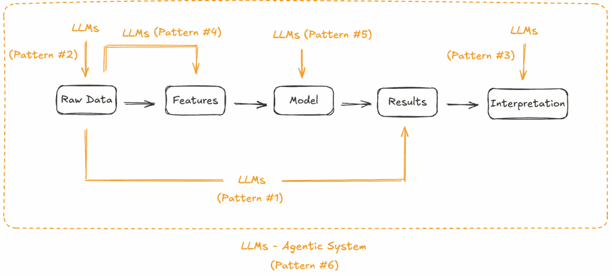

# 使用 LLM 提升你的异常检测能力

> 原文：[`towardsdatascience.com/boosting-your-anomaly-detection-with-llms/`](https://towardsdatascience.com/boosting-your-anomaly-detection-with-llms/)

<mdspan datatext="el1756962453887" class="mdspan-comment">异常检测</mdspan>一直是机器学习社区的一个长期挑战。

每当出现一种新的范式，无论是深度学习、强化学习、自监督学习还是图神经网络，你几乎总是会看到实践者急于将其应用于异常检测问题。

LLM 当然也不例外。

在这篇文章中，我们将探讨一些人们正在使用 LLM 进行异常检测管道的兴起方式：

+   **直接异常检测**

+   **数据增强**

+   **异常解释**

+   **基于 LLM 的表示学习**

+   **智能检测模型选择**

+   **多智能体系统用于自主异常检测**

+   **(额外内容) LLM 代理系统的异常检测**

对于每种应用模式，我们将检查具体的例子，看看它在实践中是如何应用的。希望这能让你对自己的挑战有一个更清晰的了解。

> 如果你刚开始接触 LLM 和代理，我邀请你通过**[LangGraph 101：让我们构建一个深度研究代理](https://towardsdatascience.com/langgraph-101-lets-build-a-deep-research-agent/)**进行一次动手构建。

* * *

**1. 直接异常检测**

**1.1 概念**

最常见的方法是直接使用 LLM 来分析数据并检测异常。实际上，我们是在赌注 LLM 的广泛、预训练的知识（以及提示中提供的知识）已经足够好，能够区分异常和正常基线。

**1.2 案例研究**

当底层数据是文本格式时，这种使用 LLM 的方式是最简单的。一个例子是**LogPrompt**研究[1]，其中研究人员研究了软件操作背景下的系统日志异常检测。

解决方案很简单：首先，LLM 被配置了一个精心制定的提示。在推理过程中，当给出新的原始系统日志时，LLM 可以输出异常预测以及可读的解释。

如你所猜，这个工作流程中的关键步骤是提示工程。在研究中，作者们采用了思维链提示、少量样本上下文学习（带有标记的示例），以及领域驱动的规则约束。他们报告说，这种混合提示策略取得了良好的性能。

对于文本以外的数据模态，另一个值得提到的有趣研究是 SIGLLM[2]，这是一个用于时间序列的无样本异常检测器。

工作中解决的一个关键问题是 **将时间序列数据转换为文本**。为了实现这一目标，作者提出了一个由缩放步骤、量化步骤、滚动窗口创建步骤以及最后的标记步骤组成的流水线。一旦 LLM 能够正确理解时间序列数据，它就可以通过直接提示或通过预测（即使用预测值和实际值之间的差异来标记异常）来进行异常检测。

**1.3 实际考虑**

这种直接异常检测模式之所以突出，很大程度上是因为其 **简单性**，因为 LLM 主要被视为一个标准的、单轮输入输出的聊天机器人。一旦你弄清楚如何将你的领域数据转换为文本并制定一个有效的提示，你就可以开始了。

然而，我们应该记住，这种应用模式所做出的隐含假设是，LLM 的预训练知识（可能通过提示进行增强）足以区分正常和异常。这可能不适用于利基领域。

此外，该应用模式在定义“正常”方面也面临挑战，数据转换中的信息损失、可扩展性有限以及可能的高成本等问题。

总体而言，我们可以将其视为使用 LLM 进行异常检测的良好入门点，特别是对于基于文本的数据，但请记住，对于许多情况，它只能带你走那么远。

**1.4 资源**

[1] 刘等人，[使用提示策略的基于大型语言模型的可解释在线日志分析](https://arxiv.org/abs/2308.07610)，arXiv，2023。

[2] Alnegheimish 等人，[大型语言模型能否作为零样本时间序列异常检测器？](https://arxiv.org/abs/2405.14755)，arXiv，2024。

* * *

**2. 数据增强**

**2.1 概念**

在实践中进行异常检测的一个常见痛点是缺乏 **标记的异常样本**。这个冷酷的事实通常阻碍从业者采用更有效的监督学习范式。

LLM 是生成模型。因此，从业者探索其生成逼真异常样本的能力是顺理成章的。这样，我们就可以获得一个更平衡的数据集，使监督式异常检测成为可能。

**2.2 案例研究**

我们可以从中学习的一个例子是 NVIDIA 的用于合成日志生成的合成语言模型 [3]。

在他们的工作中，NVIDIA 研究团队专门在原始网络安全日志上训练了一个与 GPT-2 相当规模的基座模型。一旦模型训练完成，它就可以用于生成不同目的的逼真合成日志，例如针对特定用户的日志生成、场景模拟和可疑事件生成。这些合成数据可以轻松地融入 [NVIDIA Morpheus](http://www.nvidia.com/morpheus) 的数字指纹识别管道的下一个训练周期，以减少误报。

**2.3 实际考虑**

利用 LLMs 的生成能力来克服数据稀缺性是提高下游异常检测系统鲁棒性和泛化能力的经济有效方法。一个很大的优点是，你可以轻松实现可控和有针对性的生成，即提示 LLMs 创建具有特定特征的数据，或针对现有检测模型中的特定盲点。

然而，挑战也同时存在。例如，如何确保生成数据真正具有可信度、代表性以及多样性？如何验证合成数据的质量？

仍然有许多未知的问题需要解决。尽管如此，如果你的问题由于缺乏异常样本（或正常样本的多样性）而存在高误报率，通过 LLMs 生成合成数据仍然值得一试。

**2.4 资源**

[3] Gorkem Batmaz, [构建网络语言模型以解锁新的网络安全能力](https://developer.nvidia.com/blog/building-cyber-language-models-to-unlock-new-cybersecurity-capabilities/), NVIDIA 博客，2024.

* * *

**3. 异常解释**

**3.1 概念**

在实践中，仅仅标记异常通常是不够的。从业者通常需要理解“为什么”来确定最佳下一步行动。传统的异常检测方法通常只停留在产生二元是/否标签。通过 LLMs 的广泛预训练知识和它们的语言理解与生成能力，可以潜在地弥合“预测”和“行动”之间的差距。

**3.2 案例研究**

工作中给出了一个有趣的例子[4]，其中作者探讨了使用 LLMs（GPT-4 & LLaMA3）为时间序列数据提供可解释的异常检测。

与我们之前讨论的 SIGLLM 中的工作相比，这项当前的工作更进一步，不仅能够识别异常，还能为特定点或模式被认为是异常的原因生成自然语言解释。例如，在检测周期性模式中的形状异常时，系统可能会解释：“在 2)索引 17、18 和 19 处存在异常 – 3)在这里，值意外地达到 4，这与之前观察到的周期不符，在达到峰值后通常会下降。这个异常可以被标记出来，因为它中断了已建立的峰值和多模态指令低谷的周期性模式。”

然而，这项工作也揭示了解释质量因异常类型而显著不同：点异常通常导致更高质量的解释。相比之下，上下文感知异常，如形状异常或季节性/趋势异常，似乎更难以获得准确的解释。

**3.3 实际考虑**

当你需要理解指导后续行动的理由时，“异常解释”模式效果最佳。它也可能在你不满意可能无法捕捉复杂数据模式的简单统计解释时派上用场。

然而，要防止**幻觉**。在当前阶段，我们仍然看到 LLMs 生成听起来合理但实际上是错误的陈述。这也可能适用于异常解释。

**3.4 资源**

[4] Done 等人，《LLMs 可以作为时间序列异常检测器吗？》(https://arxiv.org/pdf/2408.03475v1)，arXiv，2024。

> 如果你对分析可解释人工智能技术也感兴趣，请随时查看我的博客：[使用 RuleFit 进行可解释异常检测：直观指南](https://towardsdatascience.com/explainable-anomaly-detection-with-rulefit-an-intuitive-guide/).

* * *

## 4. 基于 LLM 的表示学习

### 4.1 概念

通常，我们可以将基于机器学习的异常检测任务视为以下 3 个步骤：

**特征工程** –> **异常检测** –> **异常解释**

如果 LLMs 可以在异常检测步骤（模式#1）和异常解释步骤（模式#3）中应用，我们真的看不出为什么它不能应用于第一步，即特征工程。

具体来说，这种应用模式将 LLMs 视为特征转换器，将原始数据转换为新的语义潜在空间，这更好地描述了数据中的复杂模式和关系。然后，传统的异常检测算法可以将这些转换后的特征作为输入，并有望产生更优越的检测性能。

**4.2 案例研究**

在 Databricks 的技术博客[5]中给出了一个代表性案例研究，关于检测欺诈购买。

在这项工作中，LLMs 首先用于计算购买数据的嵌入。然后，使用传统的异常检测算法（例如 PCA 或基于聚类的方法）对嵌入向量的异常性进行评分。对于异常评分高于预设阈值的物品，将发出异常标志。

这项工作的另一个有趣之处在于提出了一个混合方法：通过嵌入+PCA 识别出的异常进一步由 LLM 分析，以获得更深层次的上下文理解和解释，即阐明为什么某个特定产品被标记为异常。实际上，它结合了模式#3 和当前模式，提供了一种全面的异常检测解决方案。正如博客的作者所指出的，这种混合方法在保持准确性和可解释性的同时，降低了成本并使解决方案更具可扩展性。

**4.3 实际考虑**

使用 LLMs 转换原始数据是一种强大的方法，可以有效捕捉深层语义意义和上下文。这为采用经典异常检测算法铺平了道路，同时仍然能够达到高性能。

尽管如此，我们也应该记住，LLM 生成的嵌入是一个高维、不透明的向量，这可能会使得解释检测到的异常的根本原因变得困难。

此外，表示的质量完全取决于预训练的 LLM 中嵌入的知识。如果你的数据高度领域特定，生成的嵌入可能没有意义。因此，异常检测的性能可能会较差。

最后，生成嵌入并不是免费的。实际上，你正在通过一个非常大的神经网络进行正向传播，这比传统的特征工程方法计算成本高得多，并且引入了更多的延迟。这对实时检测系统可能是一个重大问题。

**4.4 资源**

[5] Kyra Wulffert, [使用嵌入和 GenAI 进行异常检测，Databricks 技术博客](https://community.databricks.com/t5/technical-blog/anomaly-detection-using-embeddings-and-genai/ba-p/95564)，2024。

* * *

## 5. 智能检测模型选择

### 5.1 概念

在实际构建异常检测解决方案时，对于初学者和经验丰富的从业者来说，一个很大的难题就是选择正确的模型。由于有这么多算法，并不总是清楚哪个算法最适合你的数据集。传统上，这基本上是一个专家知识驱动的、试错的过程。

LLMs，得益于其广泛的预训练，可能已经积累了大量关于各种异常检测算法理论的知识，以及哪些算法最适合哪种类型的问题/数据特征。

因此，利用 LLMs 的预训练知识和推理能力来自动化模型推荐过程是顺理成章的。

**5.2 案例研究**

在 pyOD 2 库的新版本[6]（这是检测多元数据中异常/离群值的首选库）中，开发者引入了新的功能，即 LLM 驱动的异常/离群值检测模型选择。

这个推荐系统通过三个步骤操作：

+   **模型分析** – 分析每个算法的研究论文和源代码，提取描述优势（例如，“在高维数据中有效”）和劣势（例如，“计算量大”）的符号元数据。

+   **数据集分析** – 计算诸如维度、偏度和噪声水平等统计特征，然后使用 LLM 将这些指标转换为标准化的符号标签。

+   **智能选择** – 应用符号匹配，然后基于 LLM 进行推理，以评估候选模型之间的权衡并选择最合适的选项。

这样，模型推荐系统能够使其选择透明且易于理解。同时，它足够灵活，可以轻松适应新模型的引入。

**5.3 实际考虑**

将 LLMs 视为“AI 法官”已经在更广泛的 AutoML 领域成为一个热门话题，因为它在解决专家知识可扩展性方面有很大的潜力。这对可能缺乏统计学、机器学习或特定数据领域深厚专业知识的初级从业者来说可能特别有帮助。

这种应用模式的另一个优点是它有助于规范和标准化最佳实践。我们可以轻松地将团队/组织的内部最佳实践集成到 LLMs 的提示中。这样，我们可以确保正在开发的解决方案不仅有效，而且一致、可维护且符合规范。

然而，我们应始终保持警惕，不要被 LLMs 可能产生的推荐/正当化幻觉所迷惑。永远不要盲目相信结果；始终验证 LLMs 的推理轨迹。

此外，异常检测领域不断演变，新的算法和技术经常出现。这意味着 LLMs 可能基于过时的知识库运行，建议使用较旧、效果较差的方法，而不是针对问题的更新、更适合的模型。RAG 在这里至关重要，以保持 LLMs 知识的时效性并确保所提建议的有效性和相关性。

**5.4 资源**

[6] 陈等，《PyOD 2：一个用于异常检测的 Python 库》，

LLM 驱动的模型选择](https://arxiv.org/abs/2412.12154), arXiv, 2024。

***

**6. 多代理系统用于自主异常检测**

**6.1 概念**

多代理系统（MAS）是指一个由多个专门代理（由 LLMs 驱动）协作以实现预定义目标的系统。代理通常在任务或技能（具有某些文档访问/检索能力或可调用的工具）方面具有专业性。这是 LLM 应用中增长最快的领域之一，从业者也在研究如何使用这个新工具包来推动端到端自主异常检测。

> 对于一个可以用于异常分类和规则合成的实际代理图，请参阅[**LangGraph 101**](https://towardsdatascience.com/langgraph-101-lets-build-a-deep-research-agent/)。

**6.2 案例研究**

对于这种应用模式，让我们看看**Argos**系统[7]：一个由 LLMs 驱动的云基础设施中的时间序列异常检测的代理系统。

开发的系统依赖于**可重复和可解释**的检测规则来标记时间序列数据中的异常。因此，系统的核心是确保这些检测规则的稳健生成。

为了实现这一目标，开发者组成了一个三代理协作流程：

+   **检测代理**，通过分析时间序列数据模式并实现为可执行代码来生成基于 Python 的异常检测规则。

+   **修复代理**，通过在虚拟数据上执行所提出的规则来检查语法错误，并提供错误信息和修正，直到所有语法问题都得到解决。

+   **审查智能体**，它评估验证数据上的规则准确性，与先前迭代进行比较，并提供改进的反馈。

注意，这些智能体并不是以简单的线性方式工作，而是形成一个迭代循环，不断改进规则准确性。例如，如果审查智能体检测到任何问题，规则将被发送回修复智能体进行修复；否则，它们将被反馈给检测智能体以纳入新规则。

在这项工作中还提出了一种有趣的设计模式，即融合 LLM 生成的规则与经过时间在生产中精心调优的现有异常检测器。这种模式享受两个世界的优点：分析型 AI 和生成型 AI。

**6.3 实际考虑**

多智能体系统是将 LLMs 集成到异常检测管道中的高级应用模式。其核心优势包括专业化和劳动分工，每个智能体都可以配备高度专业化的指令、工具和上下文，以及实现真正端到端自主解决问题的可能性。

然而，另一方面，这种应用模式继承了多智能体系统所有的痛点。例如，设计、实施和维护的复杂性显著增加；级联错误和沟通不畅；以及高成本和延迟，使得大规模或实时应用变得不可行。

**6.4 资源**

[7] Gu 等人，《[Argos：通过大型语言模型自主生成规则进行智能体时间序列异常检测](https://arxiv.org/abs/2501.14170)》，arXiv，2025。

* * *

**7. LLM 智能体系统的异常检测**

**7.1 概念**

作为附加部分，让我们讨论另一种新兴模式，它将 LLMs 与异常检测相结合。这次，我们转换一下思路：不是将 LLMs 应用于辅助异常检测，而是探索异常检测策略如何用于监控 LLM 系统的行为。

正如我们在上一节中简要提到的，多智能体系统（MAS）的采用正在成为主流。随之而来的是新的安全和可靠性挑战。

现在，如果我们从高层次来看 MAS，我们可以简单地将其视为另一个复杂的工业系统，它接受一些输入，生成一些输出，并在过程中发出遥测数据。在这种情况下，为什么不采用异常检测方法来检测 MAS 的异常行为呢？

### 7.2 案例研究

对于这种应用模式，让我们看看最近的一项工作，称为**SentinelAgent** [8]，这是一个基于图的异常检测系统，旨在监控基于 LLM 的 MAS。

对于任何系统监控解决方案，它应该解决两个关键问题：

+   如何从系统中提取有意义的、可分析的特征？

+   如何利用这些特征数据进行异常检测？

对于第一个问题，SentinelAgent 通过将代理交互建模为动态执行 **图** 来解决这个问题，其中节点是代理或工具，而边表示交互（消息和调用）。这样，多代理系统的异构、非结构化输出就被转换成了一个干净、可分析的图表示。

对于数据收集，SentinelAgent 使用 OpenTelemetry [9]（标准可观察性框架）以最小的开销拦截运行时事件。此外，Phoenix 平台 [10] 用于事件监控，可以近乎实时地收集代理系统的执行跟踪。

对于第二个问题，SentinelAgent 将基于规则的分类与基于 LLM 的语义推理（模式 #1）结合起来，对收集的遥测数据进行行为分析。这使得可以从单个代理的异常行为到复杂的多代理攻击模式等多个粒度进行检测。

该解决方案在两个案例研究中得到了验证，即一个电子邮件助手系统和微软的 Magentic-One 通用系统。作者展示了 SentinelAgent 成功检测到复杂的攻击，包括提示注入传播、未经授权的工具使用和多代理共谋场景。

**7.3 实际考虑**

随着 LLM 基于的 MAS 在生产环境中越来越广泛部署，将异常检测应用于 MAS 的这种应用模式将变得更加重要。

然而，当前使用 LLM 作为行为评判标准的方法引入了显著的扩展性挑战。我们实际上是在使用另一个基于 LLM 的系统来监控目标 MAS。成本和延迟可能成为严重问题，尤其是在监控具有高消息吞吐量或复杂执行模式的系统时。

具有讽刺意味的是，监控系统本身（SentinelAgent）可能成为潜在的攻击目标。因为它依赖于基于 LLM 的推理进行语义分析，它继承了它旨在检测的相同漏洞（想想提示注入、幻觉或对抗性操纵）。攻击者如果破坏了监控系统，可能会使组织对正在进行的攻击视而不见，或者创建虚假警报来掩盖真实威胁。

一种可能的解决方案是开发标准化的遥测格式和方法，从多代理系统交互中构建数值特征。这样，我们就可以利用传统的、成熟的异常检测算法，这些算法提供更具可扩展性和成本效益的监控解决方案，同时减少监控系统本身的攻击面。

**7.4 资源**

[8] He 等人，[SentinelAgent：多代理系统中的基于图的异常检测](https://arxiv.org/abs/2505.24201)，arXiv，2025。

[9] [OpenTelemetry](https://opentelemetry.io/docs/) 文档。

[10] Arize AI，[Phoenix](https://github.com/Arize-ai/phoenix) 文档。

* * *

**8. 结论**

现在我们已经涵盖了将 LLMs 应用于异常检测的最突出、最新兴的模式。如果我们回顾一下，不难发现 LLMs 实际上可以应用于典型异常检测工作流程的各个步骤：

将 LLMs 应用于异常检测的常见模式。（图片由作者提供）

此外，我们还看到，逆向应用，即使用异常检测方法来监控基于 LLM 的系统本身，正在获得一些真正的关注，从而在这两个领域之间建立了一种双向关系。

到目前为止，你已经看到了 LLMs 的多样性如何为解决异常检测问题开辟了一个全新的工具箱。希望这篇帖子能给你一些灵感，去实验、适应，并在你自己的异常检测工作流程中拓展边界。
