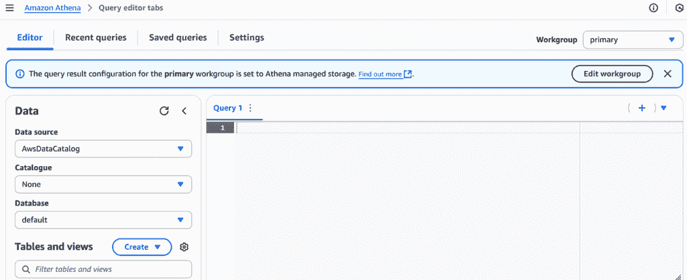

# 在下午构建数据湖屋

> 原文：[`towardsdatascience.com/bootstrap-a-data-lakehouse-in-an-afternoon/`](https://towardsdatascience.com/bootstrap-a-data-lakehouse-in-an-afternoon/)

<mdspan datatext="el1764701792928" class="mdspan-comment">构建数据湖屋**并不需要那么复杂**。 在本文中，我将向您展示如何开发一个基本的、“入门级”的数据湖屋，它使用 AWS S3 存储上的 Iceberg 表格。一旦使用 AWS Glue 注册了表格，您将能够从 Amazon Athena 查询和修改它，包括使用：

+   **时间旅行查询**，

+   **合并、更新和删除数据**

+   **优化和清理您的表格**。

我还将向您展示如何从 **DuckDB** 本地检查**相同的表格**，我们还将看到如何使用 **Glue/Spark** 插入更多表格数据。

我们的示例可能很简单，但它将展示设置、不同的工具和您可以实施的过程来构建更广泛的数据存储。所有现代云服务提供商都有与我在这篇文章中讨论的 AWS 服务等效的产品，因此应该可以很容易地在 Azure、Google Cloud 等平台上复制我在这里讨论的内容。

为了确保我们都在同一页面上，以下是对我们将使用的一些关键技术的简要解释。

### AWS Glue/Spark

AWS Glue 是亚马逊提供的一项完全托管的无服务器 ETL 服务，它简化了数据分析与机器学习中的数据准备和集成。它能够自动检测和将来自各种来源（如 S3）的元数据分类到中央数据存储中。此外，它还可以创建基于 Python 的可定制的 Spark ETL 脚本，在可扩展的无服务器 Apache Spark 平台上执行这些任务。这使得它在构建 Amazon S3 上的数据湖、将数据加载到像 Amazon Redshift 这样的数据仓库以及执行数据清洗和转换方面非常出色，而且无需管理基础设施。

### AWS Athena

AWS Athena 是一种交互式查询服务，它简化了在 Amazon S3 中使用标准 SQL 直接进行数据分析。作为一个无服务器平台，无需管理或配置服务器；只需将 Athena 指向您的 S3 数据，定义您的模式（通常使用 AWS Glue），然后开始运行 SQL 查询。它常用于对大型数据集进行临时分析、报告和探索，这些数据集的格式可以是 CSV、JSON、ORC 或 Parquet。

### Iceberg 表格

Iceberg 表格是一种开放表格格式，为存储在数据湖（如 Amazon S3 对象存储）中的数据集提供类似数据库的功能。传统上，在 S3 上，您可以创建、读取和删除对象（文件），但无法更新它们。Iceberg 格式解决了这一限制，同时还提供了其他好处，包括 ACID 事务、模式演变、隐藏分区和时间旅行功能。

### DuckDB

DuckDB 是一个用 C++ 编写的内存分析数据库，专为分析 SQL 工作负载而设计。自其几年前发布以来，其受欢迎程度不断提高，现在已成为数据工程师和科学家使用的顶级数据处理工具之一，这得益于其在 SQL、性能和多功能性方面的优势。

### 情景概述

假设您被分配了一个构建小型“轻量级仓库”分析表的任务，用于订单事件，但您目前不想采用重量级平台。您需要：

+   **安全写入**（没有损坏的读取器，没有部分提交）

+   **行级**更改（UPDATE/DELETE/MERGE，而不仅仅是追加）

+   **点时间读取**（用于审计和调试）

+   对生产准确数据进行的**本地分析**以进行快速检查

## 我们将构建

1.  通过 **Athena** 在 **Glue** 和 **S3** 中创建一个 Iceberg 表

1.  加载和修改行（**INSERT/UPDATE/DELETE/MERGE**）

1.  **时间旅行**到先前的快照（通过时间戳和快照 ID）

1.  使用 **OPTIMIZE** 和 **VACUUM** 保持快速

1.  从 **DuckDB**（通过 DuckDB Secrets 访问 S3）本地读取**相同的表**

1.  查看如何使用 Glue Spark 代码向我们的表中添加新记录

因此，简而言之，我们将使用：-

+   S3 用于数据存储

+   Glue 目录用于表元数据和发现

+   Athena 用于无服务器 SQL 读取和写入

+   使用 DuckDB 对相同的 Iceberg 表进行低成本本地分析

+   Spark 处理工作

> 我们的观点的关键收获是，通过使用上述技术，我们将在对象存储上执行类似数据库的查询。

### 设置我们的开发环境

我更喜欢将本地工具隔离在单独的环境中。使用您喜欢的任何工具来完成此操作；我将使用 conda 来演示，因为这是我通常的做法。出于演示目的，我将在 Jupyter Notebook 环境中运行所有代码。

```py
# create and activate a local env
conda create -n iceberg-demo python=3.11 -y
conda activate iceberg-demo

# install duckdb CLI + Python package and awscli for quick tests
pip install duckdb awscli jupyter
```

### 先决条件

由于我们将使用 AWS 服务，您需要一个 AWS 账户。此外，

+   用于数据湖的 S3 存储桶（例如，`s3://my-demo-lake/warehouse/`)

+   一个 Glue 数据库（我们将创建一个）

+   您工作组中的 Athena 引擎版本 3 **i**

+   一个具有 S3 + Glue 权限的 IAM 角色或用户用于 Athena

### 1/ Athena 设置

一旦您登录 AWS，请在控制台中打开 Athena 并设置您的工作组、引擎版本和 S3 输出位置（用于查询结果）。为此，请在 Athena 主屏幕的左上角寻找汉堡式菜单图标。点击它以在左侧弹出一个新的菜单块。在那里，您应该看到一个 Administration-> Workgroups 链接。您将自动分配到主工作组。您可以保留这个工作组，或者如果您喜欢，可以创建一个新的工作组。无论您选择哪个选项，都要编辑它并确保以下选项被选中。

+   分析引擎—Athena SQL。手动将引擎版本设置为 3.0。

+   选择客户管理的查询结果配置，并输入所需的存储桶和账户信息。

### 2/ 在 Athena 中创建一个 Iceberg 表

我们将存储订单事件，并让 Iceberg 透明地管理分区。我将在时间戳的日期上使用一个“隐藏”分区来分散写/读操作。返回 Athena 主页并启动 Trino SQL 查询编辑器。你的屏幕应该看起来像这样。



图片来自 AWS 网站

输入并运行以下 SQL。根据需要更改 bucket/表名。

```py
-- This automatically creates a Glue database 
-- if you don't have one already
CREATE DATABASE IF NOT EXISTS analytics;
```

```py
CREATE TABLE analytics.sales_iceberg (
  order_id    bigint,
  customer_id bigint,
  ts          timestamp,
  status      string,
  amount_usd  double
)
PARTITIONED BY (day(ts))
LOCATION 's3://your_bucket/warehouse/sales_iceberg/'
TBLPROPERTIES (
  'table_type' = 'ICEBERG',
  'format' = 'parquet',
  'write_compression' = 'snappy'
)
```

### 3) 加载数据并修改数据（INSERT / UPDATE / DELETE / MERGE）

Athena 支持真实的 Iceberg DML，允许你使用 MERGE 语句插入行、更新和删除记录以及更新。在底层，Iceberg 使用基于快照的 ACID 与删除文件；读者保持一致性，而写者并行工作。

**种几行**。

```py
INSERT INTO analytics.sales_iceberg VALUES
  (101, 1, timestamp '2025-08-01 10:00:00', 'created', 120.00),
  (102, 2, timestamp '2025-08-01 10:05:00', 'created',  75.50),
  (103, 2, timestamp '2025-08-02 09:12:00', 'created',  49.99),
  (104, 3, timestamp '2025-08-02 11:47:00', 'created', 250.00);
```

快速检查。

```py
SELECT * FROM analytics.sales_iceberg ORDER BY order_id;

 order_id | customer_id |          ts           |  status  | amount_usd
----------+-------------+-----------------------+----------+-----------
  101     | 1           | 2025-08-01 10:00:00   | created  | 120.00
  102     | 2           | 2025-08-01 10:05:00   | created  |  75.50
  103     | 2           | 2025-08-02 09:12:00   | created  |  49.99
  104     | 3           | 2025-08-02 11:47:00   | created  | 250.00
```

**更新和删除**。

```py
UPDATE analytics.sales_iceberg
SET status = 'paid'
WHERE order_id IN (101, 102)
```

```py
-- removes order 103
DELETE FROM analytics.sales_iceberg
WHERE status = 'created' AND amount_usd < 60
```

**Idempotent upserts with MERGE**

让我们将订单 104 视为已退款并创建新的订单 105。

```py
MERGE INTO analytics.sales_iceberg AS t
USING (
  VALUES
    (104, 3, timestamp '2025-08-02 11:47:00', 'refunded', 250.00),
    (105, 4, timestamp '2025-08-03 08:30:00', 'created',   35.00)
) AS s(order_id, customer_id, ts, status, amount_usd)
ON s.order_id = t.order_id
WHEN MATCHED THEN 
  UPDATE SET 
    customer_id = s.customer_id,
    ts = s.ts,
    status = s.status,
    amount_usd = s.amount_usd
WHEN NOT MATCHED THEN 
  INSERT (order_id, customer_id, ts, status, amount_usd)
  VALUES (s.order_id, s.customer_id, s.ts, s.status, s.amount_usd);
```

你现在可以重新查询以查看：101/102 → **已支付**，103 已删除，104 → **已退款**，105 → **已创建**。（如果你在一个“真实”账户中运行此操作，你会注意到 S3 对象计数正在增加——稍后会有更多关于维护的内容。）

```py
SELECT * FROM analytics.sales_iceberg ORDER BY order_id

# order_id customer_id ts status amount_usd
1 101 1 2025-08-01 10:00:00.000000 paid 120.0
2 105 4 2025-08-03 08:30:00.000000 created 35.0
3 102 2 2025-08-01 10:05:00.000000 paid 75.5
4 104 3 2025-08-02 11:47:00.000000 refunded 250.0
```

### 4) 时间旅行（和版本旅行）

这就是使用 Iceberg 的真正价值所在。你可以查询在某个时间点看起来像这样的表，或者通过特定的快照 ID。在 Athena 中，使用此语法，

```py
-- Time travel to noon on Aug 2 (UTC)
SELECT order_id, status, amount_usd
FROM analytics.sales_iceberg
FOR TIMESTAMP AS OF TIMESTAMP '2025-08-02 12:00:00 UTC'
ORDER BY order_id;

-- Or Version travel (replace the id with an actual snapshot id from your table)

SELECT *
FROM analytics.sales_iceberg
FOR VERSION AS OF 949530903748831860;
```

要获取与特定表关联的各种版本（快照）ID，请使用此查询。

```py
SELECT * FROM "analytics"."sales_iceberg$snapshots"
ORDER BY committed_at DESC;
```

### 5) 保持数据健康：OPTIMIZE 和 VACUUM

行级写操作（UPDATE/DELETE/MERGE）创建许多**删除文件**并可能使数据碎片化。两个语句保持事物快速且存储友好：

+   **OPTIMIZE … 使用 BIN_PACK 重新编写数据**—压缩小/碎片化文件并将删除折叠到数据中

+   **VACUUM**—过期旧快照 + 清理**孤儿**文件

```py
-- compact "hot" data (yesterday) and merge deletes
OPTIMIZE analytics.sales_iceberg
REWRITE DATA USING BIN_PACK
WHERE ts >= date_trunc('day', current_timestamp - interval '1' day);

-- expire old snapshots and remove orphan files
VACUUM analytics.sales_iceberg;
```

### 6) 使用 DuckDB 进行本地分析（只读）

能够从笔记本电脑上检查生产表而无需运行集群真是太好了。DuckDB 的 **httpfs** + **iceberg** 扩展使这变得简单。

#### 6.1 安装和加载扩展

打开你的 Jupyter 笔记本并输入以下内容。

```py
# httpfs gives S3 support; iceberg adds Iceberg readers.

import duckdb as db
db.sql("install httpfs; load httpfs;")
db.sql("install iceberg; load iceberg;")
```

#### 6.2 以“正确”的方式向 DuckDB 提供 S3 凭据（密钥）

DuckDB 有一个小巧但强大的密钥管理器。在 AWS 中最稳健的设置是 **凭证链** 提供者，它重用 AWS SDK 可以找到的任何内容（环境变量、IAM 角色等）。因此，你需要确保，例如，你的 AWS CLI 凭据已配置。

```py
db.sql("""CREATE SECRET ( TYPE s3, PROVIDER credential_chain )""")
```

之后，在这个 DuckDB 会话中的任何 **s3://…** 读取都将使用密钥数据。

#### 6.3 将 DuckDB 指向 Iceberg 表的元数据

最明确的方式是引用一个具体的元数据文件（例如，你表中的 `metadata/` 文件夹中的最新一个）：

要获取这些列表，请使用此查询

```py
result = db.sql("""
SELECT *
FROM glob('s3://your_bucket/warehouse/**')
ORDER BY file
""")
print(result)

...
...
s3://your_bucket_name/warehouse/sales_iceberg/metadata/00000-942a25ce-24e5-45f8-ae86-b70d8239e3bb.metadata.json                                      │
s3://your_bucket_name/warehouse/sales_iceberg/metadata/00001-fa2d9997-590e-4231-93ab-642c0da83f19.metadata.json                                      │
s3://your_bucket_name/warehouse/sales_iceberg/metadata/00002-0da3a4af-64af-4e46-bea2-0ac450bf1786.metadata.json                                      │
s3://your_bucket_name/warehouse/sales_iceberg/metadata/00003-eae21a3d-1bf3-4ed1-b64e-1562faa445d0.metadata.json                                      │
s3://your_bucket_name/warehouse/sales_iceberg/metadata/00004-4a2cff23-2bf6-4c69-8edc-6d74c02f4c0e.metadata.json    
...
...
...
```

寻找具有**最高编号起始文件名**的 metadata.json 文件，例如我的情况是 00004。然后，你可以在查询中使用它来检索底层表的最新位置。

```py
# Use the highest numbered metadata file (00004 appears to be the latest in my case)
result = db.sql("""
SELECT *
FROM iceberg_scan('s3://your_bucket/warehouse/sales_iceberg/metadata/00004-4a2cff23-2bf6-4c69-8edc-6d74c02f4c0e.metadata.json')
LIMIT 10
""")
print(result)

┌──────────┬─────────────┬─────────────────────┬──────────┬────────────┐
│ order_id │ customer_id │         ts          │  status  │ amount_usd │
│  int64   │    int64    │      timestamp      │ varchar  │   double   │
├──────────┼─────────────┼─────────────────────┼──────────┼────────────┤
│      105 │           4 │ 2025-08-03 08:30:00 │ created  │       35.0 │
│      104 │           3 │ 2025-08-02 11:47:00 │ refunded │      250.0 │
│      101 │           1 │ 2025-08-01 10:00:00 │ paid     │      120.0 │
│      102 │           2 │ 2025-08-01 10:05:00 │ paid     │       75.5 │
└──────────┴─────────────┴─────────────────────┴──────────┴────────────┘
```

想要特定的快照？使用此方法获取列表。

```py
result = db.sql("""
SELECT *
FROM iceberg_snapshots('s3://your_bucket/warehouse/sales_iceberg/metadata/00004-4a2cff23-2bf6-4c69-8edc-6d74c02f4c0e.metadata.json')
""")
print("Available Snapshots:")
print(result)

Available Snapshots:
┌─────────────────┬─────────────────────┬─────────────────────────┬──────────────────────────────────────────────────────────────────────────────────────────────────────────────────────────────────┐
│ sequence_number │     snapshot_id     │      timestamp_ms       │                                                          manifest_list                                                           │
│     uint64      │       uint64        │        timestamp        │                                                             varchar                                                              │
├─────────────────┼─────────────────────┼─────────────────────────┼──────────────────────────────────────────────────────────────────────────────────────────────────────────────────────────────────┤
│               1 │ 5665457382547658217 │ 2025-09-09 10:58:44.225 │ s3://your_bucket/warehouse/sales_iceberg/metadata/snap-5665457382547658217-1-bb7d0497-0f97-4483-98e2-8bd26ddcf879.avro │
│               3 │ 8808557756756599285 │ 2025-09-09 11:19:24.422 │ s3://your_bucket/warehouse/sales_iceberg/metadata/snap-8808557756756599285-1-f83d407d-ec31-49d6-900e-25bc8d19049c.avro │
│               2 │   31637314992569797 │ 2025-09-09 11:08:08.805 │ s3://your_bucket/warehouse/sales_iceberg/metadata/snap-31637314992569797-1-000a2e8f-b016-4d91-9942-72fe9ddadccc.avro   │
│               4 │ 4009826928128589775 │ 2025-09-09 11:43:18.117 │ s3://your_bucket/warehouse/sales_iceberg/metadata/snap-4009826928128589775-1-cd184303-38ab-4736-90da-52e0cf102abf.avro │
└─────────────────┴─────────────────────┴─────────────────────────┴──────────────────────────────────────────────────────────────────────────────────────────────────────────────────────────────────┘
```

### 7) 可选额外：从 Spark/Glue 写入

如果你更喜欢 Spark 进行更大的批量写入，Glue 可以读取/写入在 Glue 目录中注册的 Iceberg 表。你可能仍然希望使用 Athena 进行即席 SQL、时间旅行和维护，但大型 CTAS/ETL 可以通过 Glue 作业完成。（但请注意，版本兼容性和 AWS LakeFormation 权限可能会出现问题，因为 Glue 和 Athena 可能在 Iceberg 版本上略有滞后。）

这里是一个 Glue Spark 代码示例，它将一些新的数据行插入到我们的现有表中，起始订单 ID 为 110。在运行此代码之前，你应该添加以下 Glue 作业参数（在 Glue 作业详情->高级参数->作业参数下）。

```py
Key: --conf
Value: spark.sql.extensions=org.apache.iceberg.spark.extensions.IcebergSparkSessionExtensions
```

```py
import sys
import random
from datetime import datetime
from pyspark.context import SparkContext
from awsglue.utils import getResolvedOptions
from awsglue.context import GlueContext
from awsglue.job import Job
from pyspark.sql import Row

# --------------------------------------------------------
# Init Glue job
# --------------------------------------------------------
args = getResolvedOptions(sys.argv, ['JOB_NAME'])
sc = SparkContext()
glueContext = GlueContext(sc)
spark = glueContext.spark_session
job = Job(glueContext)
job.init(args['JOB_NAME'], args)

# --------------------------------------------------------
# Force Iceberg + Glue catalog configs (dynamic only)
# --------------------------------------------------------
spark.conf.set("spark.sql.catalog.glue_catalog", "org.apache.iceberg.spark.SparkCatalog")
spark.conf.set("spark.sql.catalog.glue_catalog.warehouse", "s3://your_bucket/warehouse/")
spark.conf.set("spark.sql.catalog.glue_catalog.catalog-impl", "org.apache.iceberg.aws.glue.GlueCatalog")
spark.conf.set("spark.sql.catalog.glue_catalog.io-impl", "org.apache.iceberg.aws.s3.S3FileIO")
spark.conf.set("spark.sql.defaultCatalog", "glue_catalog")

# --------------------------------------------------------
# Debug: list catalogs to confirm glue_catalog is registered
# --------------------------------------------------------
print("Current catalogs available:")
spark.sql("SHOW CATALOGS").show(truncate=False)

# --------------------------------------------------------
# Read existing Iceberg table (optional)
# --------------------------------------------------------
existing_table_df = glueContext.create_data_frame.from_catalog(
    database="analytics",
    table_name="sales_iceberg"
)
print("Existing table schema:")
existing_table_df.printSchema()

# --------------------------------------------------------
# Create 5 new records
# --------------------------------------------------------
new_records_data = []
for i in range(5):
    order_id = 110 + i
    record = {
        "order_id": order_id,
        "customer_id": 1000 + (i % 10),
        "price": round(random.uniform(10.0, 500.0), 2),
        "created_at": datetime.now(),
        "status": "completed"
    }
    new_records_data.append(record)

new_records_df = spark.createDataFrame([Row(**r) for r in new_records_data])
print(f"Creating {new_records_df.count()} new records:")
new_records_df.show()

# Register temp view for SQL insert
new_records_df.createOrReplaceTempView("new_records_temp")

# --------------------------------------------------------
# Insert into Iceberg table (alias columns as needed)
# --------------------------------------------------------
spark.sql("""
    INSERT INTO analytics.sales_iceberg (order_id, customer_id, ts, status, amount_usd)
    SELECT order_id,
           customer_id,
           created_at AS ts,
           status,
           price AS amount_usd
    FROM new_records_temp
""")

print(" Sccessfully added 5 new records to analytics.sales_iceberg")

# --------------------------------------------------------
# Commit Glue job
# --------------------------------------------------------
job.commit()
```

使用 Athena 进行双重检查。

```py
select * from analytics.sales_iceberg
order by order_id

# order_id customer_id ts status amount_usd
1 101 1 2025-08-01 10:00:00.000000 paid 120.0
2 102 2 2025-08-01 10:05:00.000000 paid 75.5
3 104 3 2025-08-02 11:47:00.000000 refunded 250.0
4 105 4 2025-08-03 08:30:00.000000 created 35.0
5 110 1000 2025-09-10 16:06:45.505935 completed 248.64
6 111 1001 2025-09-10 16:06:45.505947 completed 453.76
7 112 1002 2025-09-10 16:06:45.505955 completed 467.79
8 113 1003 2025-09-10 16:06:45.505963 completed 359.9
9 114 1004 2025-09-10 16:06:45.506059 completed 398.52
```

## 未来步骤

从这里，你可以：

+   创建更多包含数据的表。

+   添加模式演变

+   尝试分区演变实验（例如，随着数据量的增长，将表分区从日更改为小时），

+   添加计划维护。例如，EventBridge、Step 和 Lambdas 可以用于按计划执行**OPTIMIZE/VACUUM**。

## 摘要

在本文中，我试图为在 AWS 上构建**Iceberg 数据湖屋**提供一条清晰的路径。它应该作为想要将简单的对象存储与复杂的企业数据仓库连接的数据工程师的指南。

希望我已经展示了构建一个数据湖屋——一个结合数据湖低成本和仓库事务完整性的系统——不一定需要大量的基础设施部署。虽然创建一个完整的湖屋可能需要很长时间才能演变，但我希望我已经说服你，你真的可以在一个下午内构建其基本框架。

通过在云存储系统（如**Amazon S3**）上利用**Apache Iceberg**，我演示了如何将静态文件转换为动态、可管理的表，这些表能够进行 ACID 事务、行级变更（MERGE、UPDATE、DELETE）和时间旅行，而无需部署任何服务器。

我还展示了通过使用新的分析工具，如**DuckDB**，可以在本地读取从小型到中型数据湖。当你的数据量增长并变得太大而无法进行本地处理时，我展示了如何轻松升级到企业级数据处理平台，如**Spark**。
