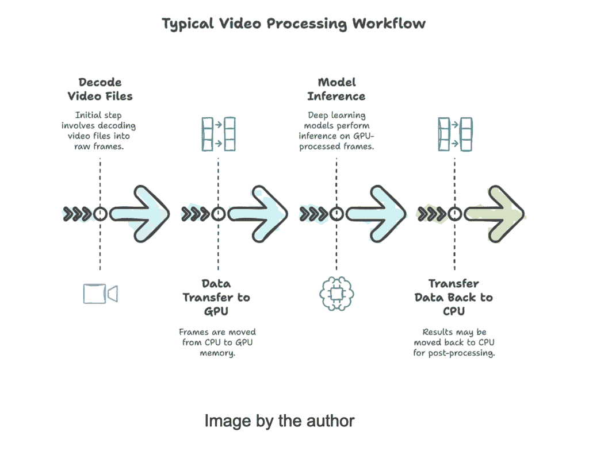
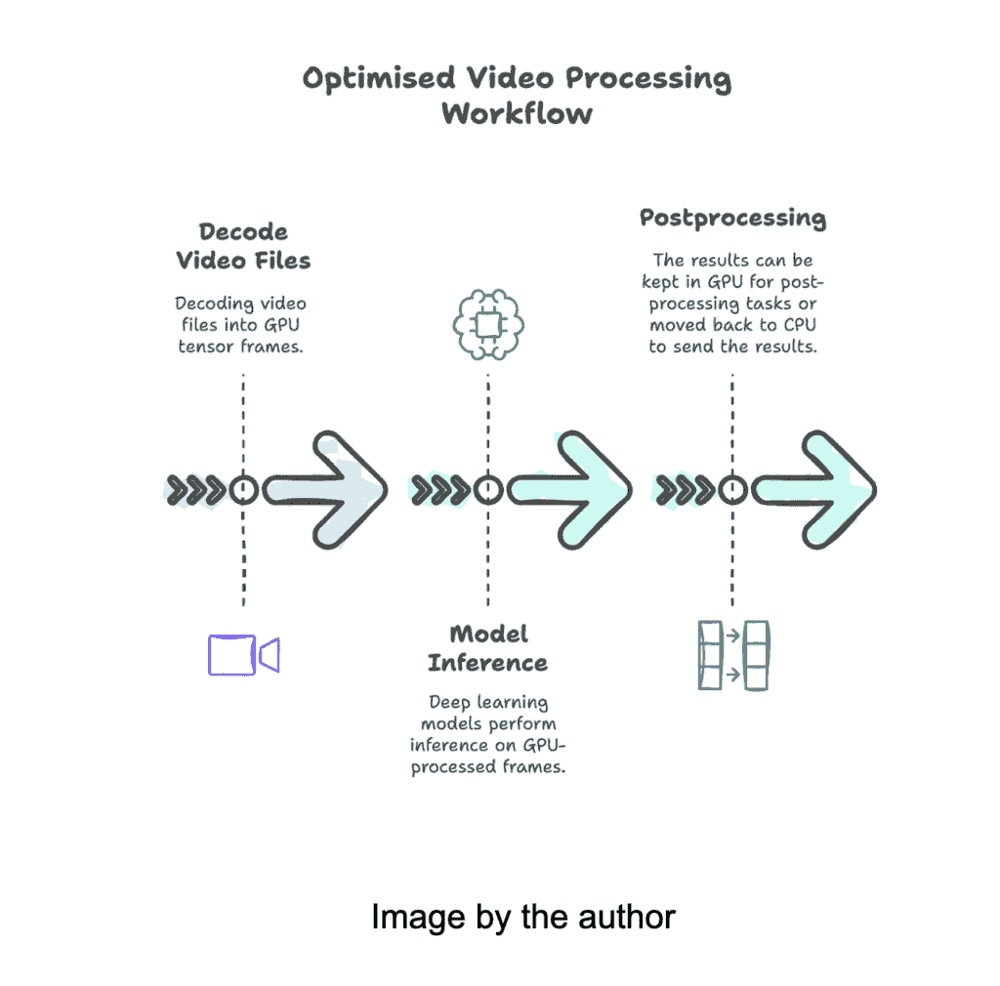

# 打破瓶颈：深度学习 GPU 优化视频处理

> 原文：[`towardsdatascience.com/breaking-the-bottleneck-gpu-optimised-video-processing-for-deep-learning/`](https://towardsdatascience.com/breaking-the-bottleneck-gpu-optimised-video-processing-for-deep-learning/)

深度学习（DL）应用通常需要处理视频数据以执行诸如目标检测、分类和分割等任务。然而，传统的视频处理流程通常对深度学习推理效率低下，导致性能瓶颈。本文将利用 PyTorch 和 FFmpeg 与 NVIDIA 硬件加速来实现这一优化。

# 为什么当前流程效率低下？

效率低下源于视频帧通常是如何解码以及在 CPU 和 GPU 之间传输的。我们可能在大多数教程中找到的标准工作流程遵循以下结构：

1.  **在 CPU 上解码帧**：视频文件首先使用基于 CPU 的解码工具（例如，OpenCV，没有 GPU 支持的 FFmpeg）解码成原始帧。

1.  **传输到 GPU**：然后这些帧从 CPU 传输到 GPU 内存，以使用 TensorFlow、PyTorch、ONNX 等框架进行深度学习推理。

1.  **在 GPU 上进行推理**：一旦帧进入 GPU 内存，模型就会进行推理。

1.  **（如果需要）传输回 CPU**：一些后处理步骤可能需要将数据移动回 CPU。

这种 CPU-GPU 传输过程引入了显著的性能瓶颈，尤其是在处理高分辨率视频且帧率较高时。不必要的内存复制和上下文切换会减慢整体推理速度，限制实时处理能力。

例如，以下片段展示了你在开始学习深度学习时遇到的典型视频处理流程：

## 解决方案：基于 GPU 的视频解码和推理

一种更有效的方法是将整个流程保持在 GPU 上，从视频解码到推理，消除冗余的 CPU-GPU 传输。这可以通过使用**FFmpeg 和 NVIDIA GPU 硬件加速**来实现。

### 关键优化

1.  **GPU 加速视频解码**：而不是使用基于 CPU 的解码，我们利用**FFmpeg 和 NVIDIA GPU 加速（NVDEC）**直接在 GPU 上解码视频帧。

1.  **零拷贝帧处理**：解码后的帧保留在 GPU 内存中，避免不必要的内存传输。

1.  **GPU 优化推理**：一旦帧被解码，我们直接在相同的 GPU 上使用任何模型进行推理，显著降低延迟。

## 实践操作！

### 前提条件

为了实现上述改进，我们将使用以下依赖项：

+   FFmpeg 与 NVIDIA GPU 加速 ([`docs.nvidia.com/video-technologies/video-codec-sdk/12.0/ffmpeg-with-nvidia-gpu/index.html`](https://docs.nvidia.com/video-technologies/video-codec-sdk/12.0/ffmpeg-with-nvidia-gpu/index.html))

+   torchaudio.io 模块中的 StreamReader 对象 ([`pytorch.org/audio/main/generated/torchaudio.io.StreamReader.html#torchaudio.io.StreamReader`](https://pytorch.org/audio/main/generated/torchaudio.io.StreamReader.html#torchaudio.io.StreamReader))

### 安装

请，要深入了解如何使用 NVIDIA GPU 加速安装 FFmpeg，请遵循 [这些说明](https://pytorch.org/audio/main/build.ffmpeg.html#enabling-hw-decoder)。

测试了：

+   **系统**: Ubuntu 22.04

+   **NVIDIA 驱动程序版本**: 550.120

+   **CUDA 版本**: 12.4

+   **Torch**: 2.4.0

+   **Torchaudio:** 2.4.0

+   **Torchvision**: 0.19.0

### 1. 安装 NV-Codecs

### 2. 克隆并配置 FFmpeg

### 3. 使用 torchaudio.utils 验证安装是否成功

编写优化管道的时间！

## 基准测试

为了基准测试它是否有所改变，我们将使用 Pawel Perzanowski 在 Pexels 上提供的 [这个视频](https://www.pexels.com/video/a-commercial-street-full-of-people-and-branded-stores-3026357/)。由于那里的大多数视频都非常短，我已经将相同的视频堆叠了几次，以提供不同视频长度的结果。原始视频时长为 32 秒，这给我们总共提供了 960 帧。新的修改后的视频分别有 5520 和 9300 帧。

### **原始视频**

+   典型工作流程：28.51 秒

+   优化工作流程：24.2 秒

好吧… 这看起来并不像真正的改进，对吧？让我们用更长的视频来测试它。

### **修改后的视频 v1 (5520 帧)**

+   典型工作流程：118.72 秒

+   优化工作流程：100.23 秒

### **修改后的视频 v2 (9300 帧)**

+   典型工作流程：292.26 秒

+   优化工作流程：240.85 秒

随着视频时长的增加，优化的好处变得更加明显。在最长测试案例中，我们实现了 **18% 的加速**，展示了处理时间的显著减少。这些性能提升在处理大型视频数据集或实时视频分析任务时尤其关键，因为小的效率提升可以累积成大量的时间节省。

## 结论

在今天的文章中，我们探讨了两种视频处理管道，一种是典型的管道，其中帧从 CPU 复制到 GPU，引入了明显的瓶颈，另一种是优化管道，其中帧在 GPU 中解码并直接传递到推理，随着视频时长的增加，可以节省大量时间。

## 参考资料

+   [`docs.nvidia.com/video-technologies/video-codec-sdk/12.0/ffmpeg-with-nvidia-gpu/index.html`](https://docs.nvidia.com/video-technologies/video-codec-sdk/12.0/ffmpeg-with-nvidia-gpu/index.html)

+   [`pytorch.org/audio/stable/installation.html#ffmpeg-dependency`](https://pytorch.org/audio/stable/installation.html#ffmpeg-dependency)
