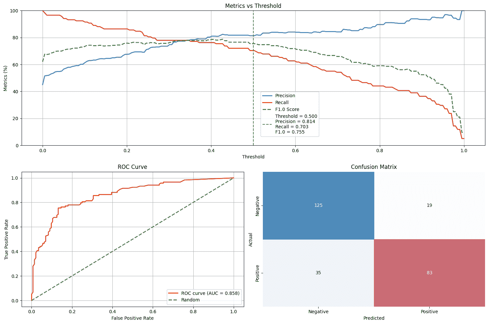
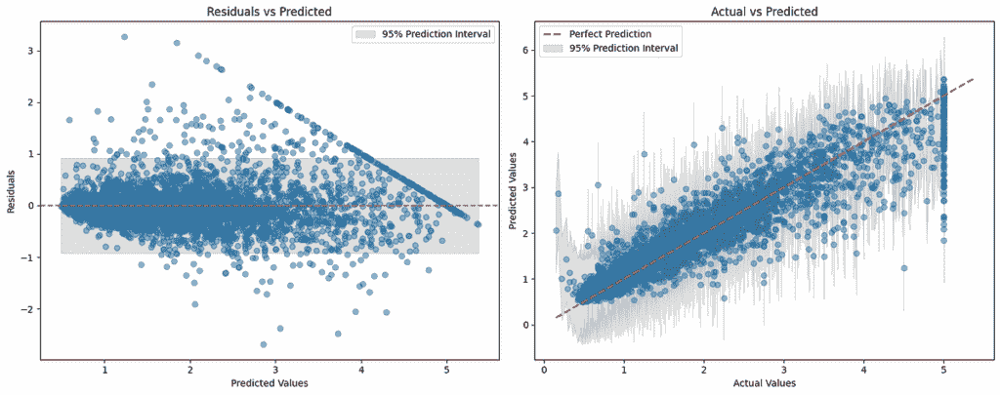
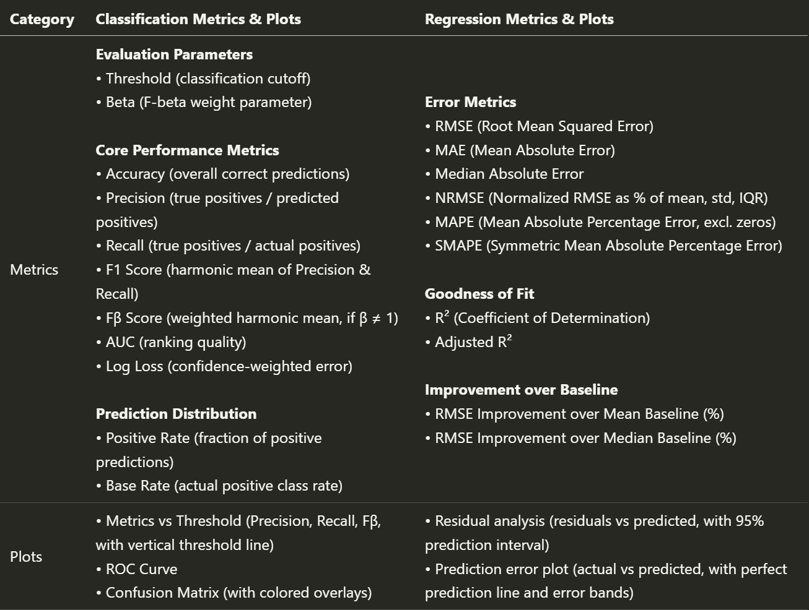
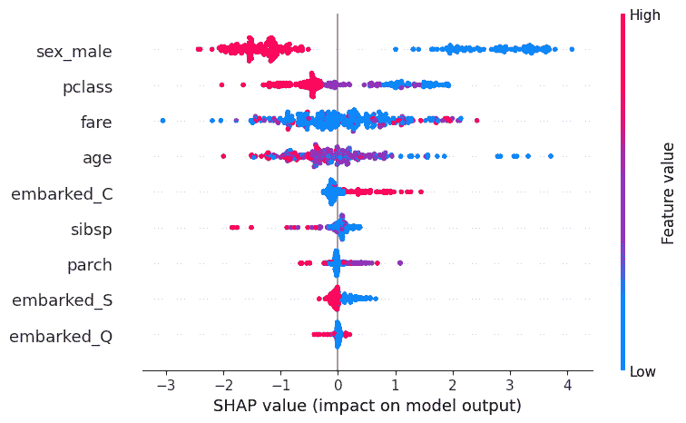
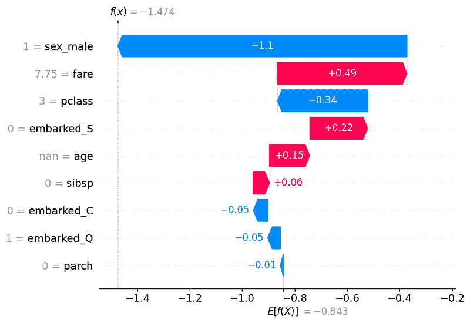
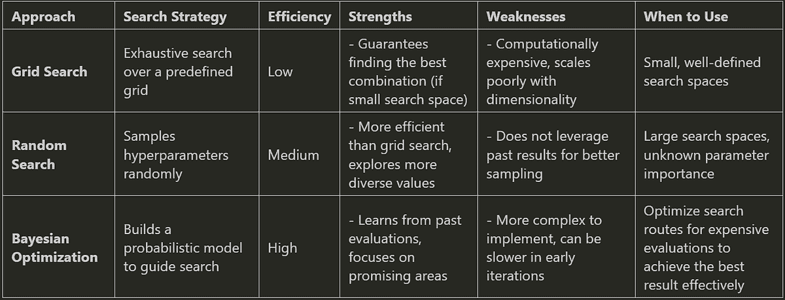
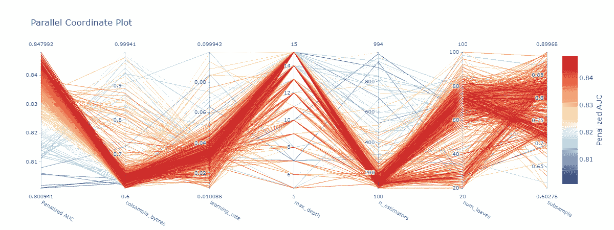
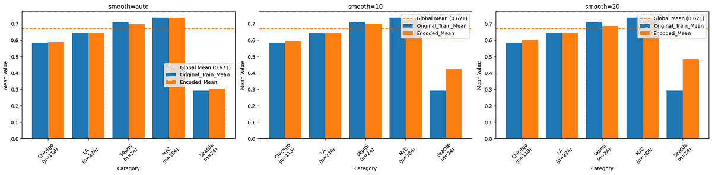
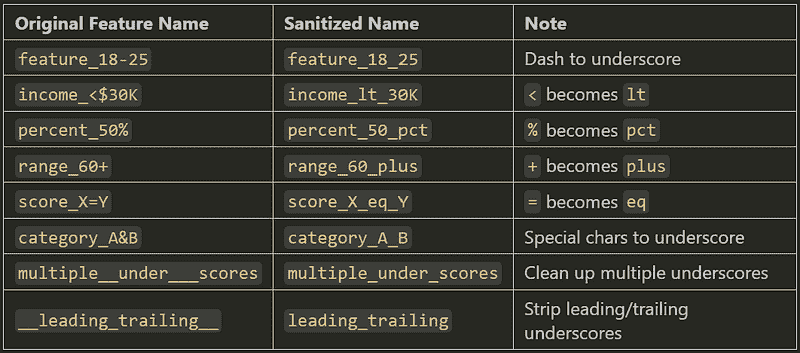

# 轻松构建算法无关的机器学习管道

> 原文：[`towardsdatascience.com/build-algorithm-agnostic-ml-pipelines-in-a-breeze/`](https://towardsdatascience.com/build-algorithm-agnostic-ml-pipelines-in-a-breeze/)

<mdspan datatext="el1751561045478" class="mdspan-comment">这是我的第 3 篇文章</mdspan>关于算法无关模型构建的话题。您可以在以下 TDS 上找到之前发表的两篇文章。

[使用 MLflow 进行算法无关模型构建](https://towardsdatascience.com/algorithm-agnostic-model-building-with-mlflow-b106a5a29535/)

[使用 MLflow 的可解释通用机器学习管道](https://medium.com/data-science/explainable-generic-ml-pipeline-with-mlflow-2494ca1b3f96)

在撰写这两篇文章之后，我继续开发这个框架，它逐渐演变成比我最初设想的更大的东西。而不是把所有东西都塞进另一篇文章里，我决定将其打包成一个名为 MLarena 的开源 Python 库，与同行数据科学家和机器学习从业者分享。MLarena 是一个算法无关的机器学习工具包，支持模型训练、诊断和优化。

🔗您可以在 GitHub 上找到完整的代码库：[MLarena 仓库](https://github.com/MenaWANG/mlarena) 🧰

在其核心，MLarena 被实现为一个定制的`mlflow.pyfunc`模型。这使得它与 MLflow 生态系统完全兼容，无论您使用哪个底层机器学习库，都支持强大的实验跟踪、模型版本控制和无缝部署，并在必要时实现算法之间的平滑迁移。

此外，它还寻求在模型开发中在自动化和专家洞察之间取得平衡。许多工具要么过度抽象，使得难以理解底层发生了什么，要么需要太多的模板代码，从而减慢迭代速度。MLarena 旨在弥合这一差距：它使用最佳实践自动化常规机器学习任务，同时为专家用户提供诊断、解释和优化模型的有效工具。

在接下来的章节中，我们将探讨这些想法如何在工具包的设计中体现，并介绍如何通过实际示例展示它如何支持现实世界的机器学习工作流程。

* * *

## 1. 用于训练和评估的轻量级抽象

在机器学习工作流程中，一个常见的痛点是需要编写大量的模板代码才能构建一个可工作的管道，尤其是在算法或框架之间切换时。MLarena 引入了一个轻量级的抽象，该抽象标准化了这一过程，同时与 scikit-learn 风格的估计器保持兼容。

这里有一个简单的例子，展示了核心`MLPipeline`对象是如何工作的：

```py
from mlarena import MLPipeline, PreProcessor

# Define the pipeline
mlpipeline_rf = MLPipeline(
    model = RandomForestClassifier(), # works with any sklearn style algorithm
    preprocessor = PreProcessor() 
)
# Fit the pipeline
mlpipeline_rf.fit(X_train,y_train)
# Predict on new data and evaluate
results = mlpipeline_rf.evaluate(X_test, y_test)
```

此界面将常见的预处理步骤、模型训练和评估组合在一起。内部自动检测任务类型（分类或回归），应用适当的指标，并生成诊断报告——所有这些都不牺牲对模型或预处理器的定义的灵活性（有关自定义选项的更多信息见后文）。

与将所有内容抽象化不同，MLarena 专注于呈现有意义的默认值和见解。`evaluate` 方法不仅返回分数，还产生一个针对任务定制的完整报告。

### 1.1 诊断报告

对于分类任务，评估报告包括关键指标，如 AUC、MCC、精确率、召回率、F1 和 F-β（当指定 beta 时）。可视化输出包括 ROC-AUC 曲线（左下角）、灵敏度矩阵（右下角）和顶部的一个精确率-召回率-阈值图。在这个顶部图中，精确率（蓝色）、召回率（红色）和 F-β（默认 β = 1 的绿色）在不同分类阈值上显示，垂直虚线表示当前阈值以突出权衡。这些可视化不仅对技术诊断有用，而且有助于与领域专家就阈值选择进行讨论（有关阈值优化的更多信息见后文）。

```py
=== Classification Model Evaluation ===

1\. Evaluation Parameters
----------------------------------------
• Threshold:   0.500    (Classification cutoff)
• Beta:        1.000    (F-beta weight parameter)

2\. Core Performance Metrics
----------------------------------------
• Accuracy:    0.805    (Overall correct predictions)
• AUC:         0.876    (Ranking quality)
• Log Loss:    0.464    (Confidence-weighted error)
• Precision:   0.838    (True positives / Predicted positives)
• Recall:      0.703    (True positives / Actual positives)
• F1 Score:    0.765    (Harmonic mean of Precision & Recall)
• MCC:         0.608    (Matthews Correlation Coefficient)

3\. Prediction Distribution
----------------------------------------
• Pos Rate:    0.378    (Fraction of positive predictions)
• Base Rate:   0.450    (Actual positive class rate)
```



对于回归模型，MLarena 自动调整其评估指标和可视化：

```py
=== Regression Model Evaluation ===

1\. Error Metrics
----------------------------------------
• RMSE:         0.460      (Root Mean Squared Error)
• MAE:          0.305      (Mean Absolute Error)
• Median AE:    0.200      (Median Absolute Error)
• NRMSE Mean:   22.4%      (RMSE/mean)
• NRMSE Std:    40.2%      (RMSE/std)
• NRMSE IQR:    32.0%      (RMSE/IQR)
• MAPE:         17.7%      (Mean Abs % Error, excl. zeros)
• SMAPE:        15.9%      (Symmetric Mean Abs % Error)

2\. Goodness of Fit
----------------------------------------
• R²:           0.839      (Coefficient of Determination)
• Adj. R²:      0.838      (Adjusted for # of features)

3\. Improvement over Baseline
----------------------------------------
• vs Mean:      59.8%      (RMSE improvement)
• vs Median:    60.9%      (RMSE improvement)
```



在快速迭代 ML 项目中存在的一个危险是，一些潜在问题可能被忽视。因此，除了上述指标和图之外，当检测到潜在的红灯时，报告将出现一个 ***模型评估诊断*** 部分：

**回归诊断**

⚠️ 样本到特征比警告：当 n/k < 10 时发出警报，表示存在高过拟合风险

ℹ️ MAPE 透明度：报告由于零目标值而被排除在 MAPE 之外的观测值的数量

**分类诊断**

⚠️ 数据泄露检测：标记接近完美的 AUC（>99%），这通常表明存在泄露

⚠️ 过拟合警报：与回归相同的 n/k 比率警告

ℹ️ 类别不平衡意识：标记严重不平衡的类别分布

下面是 MLarena 对分类和回归任务评估报告的概述：



### 1.2 作为内置层的可解释性

在机器学习项目中，可解释性对于多个原因至关重要：

1.  **模型选择**可解释性帮助我们通过评估其推理的合理性来选择最佳模型。即使两个模型显示出相似的性能指标，与领域专家一起检查它们所依赖的特征也可以揭示哪个模型的逻辑与实际世界的理解更一致。

1.  **故障排除**

    分析模型的推理是改进的一个强大故障排除策略。例如，通过调查分类模型为何自信地犯了一个错误，我们可以确定贡献特征并纠正其推理。

1.  **模型监控**

    除了典型的性能和数据漂移检查之外，监控模型推理非常有信息量。当被提醒生产模型决策中关键特征的显著变化时，有助于保持其可靠性和相关性。

1.  **模型实现**

    在预测的同时提供模型推理对于最终用户来说可能非常有价值。例如，客户服务代表可以使用客户流失分数以及导致该分数的具体客户特征来更好地保留客户。

为了支持模型可解释性，`explain_model`方法提供了***全局解释***，揭示哪些特征对模型预测的影响最大。

```py
mlpipeline.explain_model(X_test)
```



`explain_case`方法为单个案例提供***局部解释***，帮助我们了解每个特征如何对每个特定预测做出贡献。

```py
mlpipeline.explain_case(5)
```



### 1.3 无额外开销的可重复性和部署

在机器学习项目中，一个持续的挑战是确保模型可重复且适用于生产——不仅作为代码，还包括包括预处理、模型逻辑和元数据的完整工件。通常，从工作笔记本到可部署模型的过程涉及手动连接多个组件，并记住跟踪所有相关配置。

为了减少这种摩擦，`MLPipeline`被实现为一个自定义的`mlflow.pyfunc`模型。这种设计选择允许整个管道（包括预处理步骤和训练好的模型），作为一个单一、可携带的工件打包。

当评估管道时，您可以通过设置`log_model=True`来启用 MLflow 日志记录：

```py
results = mlpipeline.evaluate(
    X_test, y_test, 
    log_model=True # to log the pipeline with mlflow
)
```

在幕后，这会触发一系列 MLflow 操作：

+   启动并管理一个 MLflow 运行

+   记录模型超参数和评估指标

+   将完整的管道对象保存为版本化的工件

+   自动推断模型签名以减少部署错误

这有助于团队保持实验可追溯性，并更平滑地从实验过渡到部署，而无需重复跟踪或序列化代码。生成的工件与 MLflow 模型注册表兼容，可以通过 MLflow 支持的任何后端进行部署。

## 2. 考虑效率和稳定性来调整模型

超参数调整是构建机器学习模型中最资源密集的部分之一。虽然网格搜索或随机搜索等技术很常见，但它们可能计算成本高昂且效率低下，尤其是在应用于大型或复杂的搜索空间时。在超参数优化中，另一个大问题是它可能会产生不稳定模型，这些模型在开发中表现良好，但在生产中性能下降。



为了解决这些问题，MLarena 包含一个`tune`方法，它简化了超参数优化过程，同时鼓励稳健性和透明度。它基于贝叶斯优化——一种根据先前结果进行自适应的搜索策略——并添加了护栏以避免常见的陷阱，如过拟合或不完整的搜索空间覆盖。

### 2.1 带内置早期停止和方差控制的超参数优化

这里是一个使用 LightGBM 和自定义搜索空间进行调优的示例：

```py
from mlarena import MLPipeline, PreProcessor
import lightgbm as lgb

lgb_param_ranges = {
    'learning_rate': (0.01, 0.1),  
    'n_estimators': (100, 1000),   
    'num_leaves': (20, 100),
    'max_depth': (5, 15),
    'colsample_bytree': (0.6, 1.0),
    'subsample': (0.6, 0.9)
}

# setting up with default settings, see customization below 
best_pipeline = MLPipeline.tune(
    X_train, 
    y_train,
    algorithm=lgb.LGBMClassifier, # works with any sklearn style algorithm
    preprocessor=PreProcessor(),
    param_ranges=lgb_param_ranges 
    )
```

为了避免不必要的计算，调整过程包括早期停止的支持：您可以设置最大评估次数，并在指定次数的试验后没有观察到改进时自动停止过程。这节省了计算时间，同时将搜索集中在搜索空间最有希望的部分。

```py
best_pipeline = MLPipeline.tune(
    ... 
    max_evals=500,       # maximum optimization iterations
    early_stopping=50,   # stop if no improvement after 50 trials
    n_startup_trials=5,  # minimum trials before early stopping kicks in
    n_warmup_steps=0,    # steps per trial before pruning    
    )
```

为了确保结果稳健，MLarena 在超参数调整过程中应用交叉验证。除了优化平均性能之外，它还允许您使用`cv_variance_penalty`参数惩罚跨折间的方差。这在现实场景中尤其有价值，因为在现实场景中，模型稳定性可能和原始准确度一样重要。

```py
best_pipeline = MLPipeline.tune(
    ...
    cv=5,                    # number of folds for cross-validation
    cv_variance_penalty=0.3, # penalize high variance across folds
    )
```

例如，在两个具有相同平均 AUC 的模型之间，跨折方差较低的模型在生产中通常更可靠。它将因其更好的有效分数而被 MLarena 调整选中，该有效分数是`mean_auc - std * cv_variance_penalty`：

| 模型 | 平均 AUC | 标准差 | 有效分数 |
| --- | --- | --- | --- |
| A | 0.85 | 0.02 | 0.85 – 0.02 * 0.3 (惩罚) |
| B | 0.85 | 0.10 | 0.85 – 0.10 * 0.3 (惩罚) |

### 2.2 使用视觉反馈诊断搜索空间设计

调整过程中的另一个常见瓶颈是设计良好的搜索空间。如果超参数的范围太窄或太宽，优化器可能会浪费迭代或完全错过高性能区域。

为了支持更明智的搜索设计，MLarena 包括一个**平行坐标图**，它可视化不同超参数值与模型性能之间的关系：

+   你可以**发现**趋势，例如哪些`learning_rate`的范围始终产生更好的结果。

+   你可以**识别**边缘聚类，即表现最好的试验集中在参数范围的边界，这通常是范围需要调整的迹象。

+   你可以**看到**多个超参数之间的交互，这有助于完善你的直觉或指导进一步的探索。

这种可视化有助于用户迭代地细化搜索空间，以更少的迭代次数获得更好的结果。

```py
best_pipeline = MLPipeline.tune(
    ...
    # to show parallel coordinate plot:
    visualize = True # default=True
    )
```



### 2.3 为问题选择合适的指标

调优的目标并不总是相同的：在某些情况下，你希望最大化 AUC，在其他情况下，你可能更关心最小化 RMSE 或 SMAPE。但不同的指标也要求不同的优化方向——当与交叉验证方差惩罚结合时，这需要根据优化方向将惩罚加到或从 CV 均值中减去，数学计算可能会变得繁琐。😅

MLarena 通过支持分类和回归的广泛指标来简化这一点：

**分类指标：**

+   `auc`（默认）

+   `f1`

+   `accuracy`

+   `log_loss`

+   `mcc`

**回归指标：**

+   `rmse`（默认）

+   `mae`

+   `median_ae`

+   `smape`

+   `nrmse_mean`, `nrmse_iqr`, `nrmse_std`

要切换指标，只需将`tune_metric`传递给方法：

```py
best_pipeline = MLPipeline.tune(
    ...
    tune_metric = "f1"
    )
```

MLarena 处理其余部分，自动确定指标应该是最大化还是最小化，并一致地应用方差惩罚。

## 3. 解决现实世界的预处理挑战

预处理通常是机器学习工作流程中最被忽视的步骤之一，也是最容易出错的一个。处理缺失值、高基数分类、无关特征和不一致的列命名可能会引入微妙的错误，降低模型性能，甚至完全阻止生产部署。

MLarena 的`PreProcessor`被设计成使这一步更加稳健且不那么随意。它为常见用例提供了合理的默认值，同时提供了在更复杂场景下所需的灵活性和工具。

这里是一个默认配置的例子：

```py
from mlarena import PreProcessor

preprocessor = PreProcessor(
    num_impute_strategy="median",          # Numeric missing value imputation
    cat_impute_strategy="most_frequent",   # Categorical missing value imputation
    target_encode_cols=None,               # Columns for target encoding (optional)
    target_encode_smooth="auto",           # Smoothing for target encoding
    drop="if_binary",                      # Drop strategy for one-hot encoding
    sanitize_feature_names=True            # Clean up special characters in column names
)

X_train_prep = preprocessor.fit_transform(X_train)
X_test_prep = preprocessor.transform(X_test)
```

这些默认值通常足以进行快速迭代。但现实世界的数据集很少能完美地符合默认值。因此，让我们探索`PreProcessor`支持的更细微的预处理任务。

### 3.1 使用目标编码管理高基数分类

高基数分类特征是一个挑战：传统的独热编码可能导致数百个稀疏列。目标编码提供了一个紧凑的替代方案，用目标变量的平滑平均值替换类别。然而，调整平滑参数是棘手的：平滑太少会导致过拟合，而平滑太多会稀释有用的信号。

MLarena 采用基于经验贝叶斯的方法在 SKLearn 的`TargetEncoder`中实现`target_encode_smooth="auto"`时的平滑处理，并允许用户指定数值（参见[sklearn TargetEncoder 文档](https://scikit-learn.org/stable/modules/generated/sklearn.preprocessing.TargetEncoder.html)和[Micci-Barrec, 2001](https://dl.acm.org/doi/10.1145/507533.507538)）。

```py
preprocessor = PreProcessor(
    target_encode_cols=['city'],
    target_encode_smooth='auto'
)
```

为了帮助指导这个选择，`plot_target_encoding_comparison`方法可视化不同平滑值如何影响稀有类别的编码。例如：

```py
PreProcessor.plot_target_encoding_comparison(
    X_train, y_train,
    target_encode_col='city',
    smooth_params=['auto', 10, 20]
)
```



这对于检查对代表性不足的类别（例如，只有 24 个样本的城市“西雅图”）的影响特别有用。可视化显示不同的平滑参数会导致西雅图编码值的明显差异。这种清晰的视觉效果支持数据专家和领域专家进行有意义的讨论，并就最佳编码策略做出明智的决定。

### 3.2 识别和移除无用的特征

另一个常见的挑战是特征过载：变量太多，其中并非所有变量都提供有意义的信号。选择一个更干净的子集可以提高性能和可解释性。

`filter_feature_selection`方法有助于过滤掉：

+   缺失值高的特征

+   只有一个唯一值的特征

+   与目标具有低互信息的特征

这是如何工作的：

```py
filter_fs = PreProcessor.filter_feature_selection(
    X_train,
    y_train,
    task='classification', # or 'regression'
    missing_threshold=0.2, # drop features with > 20% missing values
    mi_threshold=0.05,     # drop features with low mutual information
)
```

这将返回如下摘要：

```py
Filter Feature Selection Summary:
==========
Total features analyzed: 7

1\. High missing ratio (>20.0%): 0 columns

2\. Single value: 1 columns
   Columns: occupation

3\. Low mutual information (<0.05): 3 columns
   Columns: age, tenure, occupation

Recommended drops: (3 columns in total)
```

可以通过编程方式访问选定的特征：

```py
selected_cols = fitler_fs['selected_cols']
X_train_selected = X_train[selected_cols]
```


这个早期过滤步骤不会取代完整的特征工程或基于包装器的选择（这将在路线图上），但有助于在开始更重的建模之前减少噪声。

### 3.3 使用列名清理预防下游错误

当对分类特征应用独热编码时，列名可以继承特殊字符，如`'age_60+'`或`'income_<$30K'`。这些字符可能会破坏下游管道，尤其是在日志记录、部署或与 MLflow 一起使用时。

为了降低静默管道失败的风险，MLarena 默认自动清理特征名称：

```py
preprocessor = PreProcessor(sanitize_feature_names=True)
```

如下表所示，字符如`+`、`<`和`%`被替换为安全的替代字符，从而提高了与生产级工具的兼容性。喜欢使用原始名称的用户可以通过设置`sanitize_feature_names=False`轻松禁用此行为。



## 4. 解决机器学习实践中的日常挑战

在现实世界的机器学习项目中，成功不仅仅取决于模型精度。它通常取决于我们如何清晰地传达结果，我们的工具如何支持利益相关者的决策制定，以及我们的管道如何可靠地处理不完整的数据。MLarena 包含一系列旨在解决这些实际挑战的工具。以下只是几个例子。

### 4.1 分类问题的阈值分析

二元分类模型通常输出概率，但现实世界的决策需要硬阈值来区分正例和负例。这个选择会影响精确度、召回率，最终影响业务成果。然而在实践中，阈值通常被设置为默认的 0.5，即使这并不符合领域需求。

MLarena 的`threshold_analysis`方法帮助使这个选择更加严谨和定制。我们可以：

+   通过 F-beta 分数中的 beta 参数自定义精确度-召回率平衡

    

+   通过最大化 F-beta 找到基于我们业务目标的最佳分类阈值

+   使用自助法或分层 k 折交叉验证进行稳健、可靠的估计

```py
# Perform threshold analysis using bootstrap method
results = MLPipeline.threshold_analysis(  
    y_train,                     # True labels for training data
    y_pred_proba,                # Predicted probabilities from model
    beta = 0.8,                  # F-beta score parameter (weights precision more than recall)
    method = "bootstrap",        # Use bootstrap resampling for robust results
    bootstrap_iterations=100)    # Number of bootstrap samples to generate

# utilize the optimal threshold identified on new data
best_pipeline.evaluate(
    X_test, y_test, beta=0.8, 
    threshold=results['optimal_threshold']
    ) 
```

这使得从业者能够将模型决策与领域优先级更紧密地联系起来，例如捕捉更多欺诈案例（召回率）或减少质量控制中的误报（精确度）。

### 4.2 通过可视化清晰沟通

强大的可视化不仅对数据探索分析（EDA）至关重要，而且对于吸引利益相关者和验证发现也至关重要。MLarena 包含一系列旨在提高可解释性和清晰度的绘图工具。

#### 4.2.1 比较组间分布

当分析跨越不同类别（如地区、队列或治疗组）的数值数据时，除了均值或中位数等中心趋势指标之外，还需要全面理解数据的分布并识别任何异常值。为了解决这个问题，Mlarena 中的`plot_box_scatter`函数将箱线图与抖动散点图叠加，在单一直观的视觉中提供丰富的分布信息。

此外，将视觉洞察与稳健的统计分析相结合通常非常有价值。因此，绘图函数可选地集成了如方差分析（ANOVA）、Welch 的方差分析（Welch’s ANOVA）和 Kruskal-Wallis 等统计测试，允许我们像下面展示的那样，用统计测试结果标注我们的图表。

```py
import mlarena.utils.plot_utils as put

fig, ax, results = put.plot_box_scatter(
    data=df,
    x="item",
    y="value",
    title="Boxplot with Scatter Overlay (Demo for Crowded Data)",
    point_size=2,
    xlabel=" "，
    stat_test="anova",      # specify a statistical test
    show_stat_test=True
    )
```


有许多方法可以自定义图表——要么通过修改返回的`ax`对象，要么使用内置函数参数。例如，您可以使用`point_hue`参数通过另一个变量来着色点。

```py
fig, ax = put.plot_box_scatter(
    data=df,
    x="group",
    y="value",
    point_hue="source", # color points by source
    point_alpha=0.5,
    title="Boxplot with Scatter Overlay (Demo for Point Hue)",
)
```


#### 4.2.2 可视化时间分布

数据专家和领域专家经常需要观察连续变量随时间变化的分布，以发现关键转变、新兴趋势或异常。

这通常涉及一些常规任务，如按所需的时间粒度（每小时、每周、每月等）聚合数据，确保正确的时序顺序，以及自定义外观，例如根据感兴趣的第三个变量着色点。我们的`plot_distribution_over_time`函数轻松处理这些复杂性。

```py
# automatically group data and format X-axis lable by specified granularity
fig, ax = put.plot_distribution_over_time(
    data=df,
    x='timestamp',
    y='heart_rate',
    freq='h',                                   # specify granularity
    point_hue=None,                             # set a variable to color points if desired
    title='Heart Rate Distribution Over Time',
    xlabel=' ',
    ylabel='Heart Rate (bpm)',
)
```


在[plot_utils 文档](https://github.com/MenaWANG/mlarena/blob/master/examples/3.utils_plot.ipynb)🔗中可以找到更多绘图函数和示例。

### 4.3 数据工具

如果你像我一样，你可能在到达机器学习的有趣部分之前，会花费大量时间清理和调试数据。😅现实世界的数据通常是杂乱的、不一致的，并且充满惊喜。这就是为什么 MLarena 包括一个不断增长的`data_utils`函数集合，以简化并简化我们的 EDA 和数据准备过程。

#### 4.3.1 清理不一致的日期格式

日期列并不总是以干净的 ISO 格式出现，不一致的大小写或格式可能真的让人头疼。`transform_date_cols`函数有助于标准化日期列，以便进行下游分析，即使值具有不规则的格式，例如：

```py
import mlarena.utils.data_utils as dut

df_raw = pd.DataFrame({
    ...
    "date": ["25Aug2024", "15OCT2024", "01Dec2024"],  # inconsistent casing
})

# transformed the specified date columns
df_transformed = dut.transform_date_cols(df_raw, 'date', "%d%b%Y")
df_transformed['date']
# 0   2024-08-25
# 1   2024-10-15
# 2   2024-12-01
```

它自动处理大小写变化，并将列转换为正确的日期时间对象。

如果你有时会忘记 Python 日期格式代码，或者与 Spark 的混淆，你并不孤单 😁。只需查看函数的文档字符串进行快速刷新。

```py
?dut.transform_date_cols  # check for docstring
```

```py
Signature:
----------
dut.transform_date_cols(
    data: pandas.core.frame.DataFrame,
    date_cols: Union[str, List[str]],
    str_date_format: str = '%Y%m%d',
) -> pandas.core.frame.DataFrame
Docstring:
Transforms specified columns in a Pandas DataFrame to datetime format.

Parameters
----------
data : pd.DataFrame
    The input DataFrame.
date_cols : Union[str, List[str]]
    A column name or list of column names to be transformed to dates.
str_date_format : str, default="%Y%m%d"
    The string format of the dates, using Python's `strftime`/`strptime` directives.
    Common directives include:
        %d: Day of the month as a zero-padded decimal (e.g., 25)
        %m: Month as a zero-padded decimal number (e.g., 08)
        %b: Abbreviated month name (e.g., Aug)
        %B: Full month name (e.g., August)
        %Y: Four-digit year (e.g., 2024)
        %y: Two-digit year (e.g., 24)
```

#### 4.3.2 在杂乱数据中验证主键

在现实世界的杂乱数据集中识别有效的主键可能具有挑战性。虽然传统的主键必须本质上在整个行中是唯一的，并且不包含缺失值，但潜在的关键列通常包含空值，尤其是在数据管道的早期阶段。

`is_primary_key`函数采用一种务实的方法来应对这一挑战：它会提醒用户潜在关键列中的任何缺失值，然后验证剩余的非空行是否可以唯一识别。

这对于以下情况很有用：

– **数据质量评估**：快速评估我们的关键字段的不完整性和唯一性。

– **连接准备就绪**：识别合并数据集的可靠键，即使某些值最初缺失。

– **ETL 验证**：在考虑现实世界数据不完美的情况下，验证关键约束。

– **模式设计**：利用从实际数据关键特征中得出的见解来指导稳健的数据库模式规划。

因此，`is_primary_key` 在设计在不太完美的数据环境中具有弹性的数据管道时特别有价值。它通过接受列名或列名列表来支持单键和复合键。

```py
df = pd.DataFrame({
    # Single column primary key
    'id': [1, 2, 3, 4, 5],    
    # Column with duplicates
    'category': ['A', 'B', 'A', 'B', 'C'],    
    # Date column with some duplicates
    'date': ['2024-01-01', '2024-01-01', '2024-01-02', '2024-01-02', '2024-01-03'],
    # Column with null values
    'code': ['X1', None, 'X3', 'X4', 'X5'],    
    # Values column
    'value': [100, 200, 300, 400, 500]
})

print("\nTest 1: Column with duplicates")
dut.is_primary_key(df, ['category'])  # Should return False

print("\nTest 2: Column with null values")
dut.is_primary_key(df, ['code','date']) # Should return True
```

```py
Test 1: Column with duplicates
✅ There are no missing values in column 'category'.
ℹ️ Total row count after filtering out missings: 5
ℹ️ Unique row count after filtering out missings: 3
❌ The column(s) 'category' do not form a primary key.

Test 2: Column with null values
⚠️ There are 1 row(s) with missing values in column 'code'.
✅ There are no missing values in column 'date'.
ℹ️ Total row count after filtering out missings: 4
ℹ️ Unique row count after filtering out missings: 4
🔑 The column(s) 'code', 'date' form a primary key after removing rows with missing values.
```

* * *

除了我们已经涵盖的内容之外，`data_utils` 模块还提供了其他有用的工具，包括一组专门针对“发现 → 调查 → 解决”去重工作流程的三个函数。上面讨论的 `is_primary_key` 作为初始步骤。更多详细信息请参阅 [data_utils 示例](https://github.com/MenaWANG/mlarena/blob/master/examples/3.utils_data.ipynb)🔗。

* * *

由此，我们得到了 MLarena 包的介绍。我希望这些工具在简化我的机器学习工作流程方面证明与它们对我自己的价值一样。这是一个开源、非营利性的倡议。如果您有任何问题或希望请求新功能，请不要犹豫，与我联系。我很乐意听到您的声音！🤗

请保持关注，并关注我的 [Medium](https://menawang.medium.com/)。 😁

💼[领英](https://www.linkedin.com/in/mena-ning-wang/) | 😺[GitHub](https://github.com/MenaWANG) | 🕊️[Twitter/X](https://x.com/mena_wang)

* * *

除非另有说明，所有图像均由作者提供。
