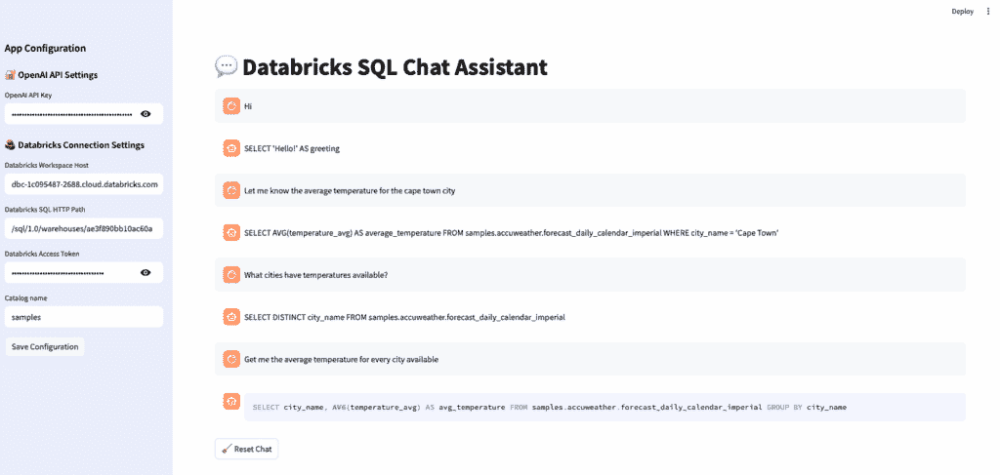

# 使用自然语言构建一个探索您的数据目录的 AI 代理

> 原文：[`towardsdatascience.com/build-and-ai-agent-to-explore-your-data-catalog-with-natural-language/`](https://towardsdatascience.com/build-and-ai-agent-to-explore-your-data-catalog-with-natural-language/)

<mdspan datatext="el1749772317006" class="mdspan-comment">在每一个数据驱动型应用、产品或仪表板的核心</mdspan>，都有一个关键组件：数据库。这些系统长期以来一直是存储、管理和查询结构化数据的基础——无论是关系型、时间序列型还是分布在不同云平台上的。

为了与这些系统交互，我们一直依赖 SQL（结构化查询语言），这是一种标准化且极其强大的方式，用于检索、操作和分析数据。SQL 表达能力强，精确，且针对性能进行了优化。然而，对于许多用户——尤其是那些对数据新手——SQL 可能会让人感到畏惧。记住语法、理解连接和导航复杂的模式可能会成为生产力的障碍。

但用自然语言查询数据库的想法并不新鲜！实际上，对自然语言数据库接口（NLIDBs）的研究可以追溯到 20 世纪 70 年代。像 LUNAR 和 PRECISE 这样的项目探讨了用户如何用普通的英语提问，并接收由 SQL 驱动的结构化答案。尽管学术上兴趣浓厚，但这些早期系统在泛化、模糊性和可扩展性方面遇到了困难。回到 2029 年，PowerBI 也于 2019 年向我们展示了自然语言数据查询的早期一瞥。虽然问答功能很有前景，但它难以处理复杂查询，需要精确的措辞，并且高度依赖于数据模型是否干净。最终，它缺乏用户从真正的助手那里期望的那种推理和灵活性！

但关于 2025 年呢？我们是否拥有实现它的技术？

## LLMs 能否做到我们之前无法做到的事情？

[基于我们对 LLMs 及其能力的了解](https://arxiv.org/abs/2005.14165)，我们也明白它们以及 AI 代理的概念独特地能够弥合技术 SQL 和自然人类查询之间的差距。它们擅长解释模糊的问题，生成语法正确的 SQL，并适应不同的用户意图。这使得它们非常适合数据对话界面。然而，LLMs 不是确定性的；它们高度依赖概率推理，这可能导致[幻觉、错误的假设或 <mdspan datatext="el1749510261518" class="mdspan-comment">缺乏商业背景的表面推理。</mdspan>](https://arxiv.org/abs/2207.05221)

这就是 AI 代理变得相关的地方。通过将 LLM 封装在一个结构化的系统中——一个包括记忆、工具、验证层和明确目的的系统——我们可以减少概率输出的缺点。代理不仅仅是一个文本生成器：它成为了一个理解其操作环境的合作伙伴。[结合适当的策略，如扎根、模式检查和用户意图检测，](https://towardsdatascience.com/how-to-design-my-first-ai-agent/)代理使我们能够构建比仅提示设置更可靠的系统。

这就是本简短教程的基础：如何构建您的第一个 AI 代理助手以查询您的数据目录！

## 创建 Databricks 目录助手的逐步指南

首先，我们需要选择我们的技术栈。我们需要一个模型提供者、一个帮助我们强制执行代理流程结构的工具、连接到我们的数据库的连接器，以及一个简单的 UI 来提供聊天体验！

+   **OpenAI (gpt-4**): 在自然语言理解、推理和 SQL 生成方面处于领先地位。

+   **Pydantic A**I: 为 LLM 响应添加结构。没有幻觉或含糊不清的答案——只有干净、经过模式验证的输出。

+   **Streamlit**: 快速构建一个内置 LLM 和反馈组件的响应式聊天界面。

+   **Databricks SQL Connector**: 实时访问您的 Databricks 工作区的目录、模式和查询结果。

好吧，我们不要忘记——这只是一个小型、简单的项目。如果您计划在生产环境中部署它，跨越多个用户和多个数据库，您肯定需要考虑其他问题：可扩展性、访问控制、身份管理、用例设计、用户体验、数据隐私……等等。

### 1. 环境设置

在我们开始编码之前，让我们准备好我们的开发环境。这一步确保所有必需的包都已安装并隔离在干净的虚拟环境中。这避免了版本冲突并使我们的项目更有条理。

```py
conda create -n sql-agent python=3.12
conda activate sql-agent

pip install pydantic-ai openai streamlit databricks-sql-connector
```

### 2. 创建访问 Databricks 数据目录信息的工具和逻辑

虽然构建一个会话式 SQL 代理可能看起来像是一个 LLM 问题，但实际上它首先是一个**数据问题**。您需要元数据、列级上下文、约束，理想情况下还有一个分析层，以了解什么可以安全查询以及如何解释结果。这是我们所说的**以数据为中心的 AI 堆栈**（可能听起来有点像 2021 年的东西，但我保证它仍然非常相关！）——在这里，分析、质量和模式验证在提示工程之前。

在这种情况下，由于代理需要上下文来推理您的数据，这一步包括设置与您的 Databricks 工作区的连接并程序化提取您的数据目录的结构。这些元数据将作为生成准确 SQL 查询的基础。

```py
def set_connection(server_hostname: str, http_path: str, access_token: str):
    connection = sql.connect(
        server_hostname=server_hostname,
        http_path=http_path,
        access_token=access_token
    )
    return connection
```

元数据连接器的完整代码[可以在这里找到。](https://github.com/fabclmnt/ai-tutorials/blob/main/sql-agent/functions/catalog_connector.py)

### 3. 使用 Pydantic AI 构建 SQL 代理

这里是我们定义我们的 AI 代理的地方。我们使用 `pydantic-ai` 来强制执行结构化输出，在这种情况下，我们希望确保我们始终会收到来自 LLM 的干净 SQL 查询。这使得代理在应用程序中使用时更安全，并减少了模糊不清的代码以及更重要的是，不可解析代码的可能性。

要定义代理，我们首先使用 Pydantic 指定一个输出模式，在这种情况下，一个表示 SQL 查询的单个字段 `code`。然后，我们使用 `Agent` 类将系统提示、模型名称和输出类型连接起来。

```py
from pydantic import BaseModel
from pydantic_ai.agent import Agent
from pydantic_ai.messages import ModelResponse, TextPart

# ==== Output schema ====
class CatalogQuery(BaseModel):
    code: str

# ==== Agent Factory ====
def catalog_metadata_agent(system_prompt: str, model: str="openai:gpt-4o") -> Agent:
    return Agent(
        model=model,
        system_prompt=system_prompt,
        output_type=CatalogQuery,
        instrument=True
    )

# ==== Response Adapter ====
def to_model_response(output: CatalogQuery, timestamp: str) -> ModelResponse:
    return ModelResponse(
        parts=[TextPart(f"```sql\n{output.code}\n```py")],
        timestamp=timestamp
    )
```

系统提示提供了指导和示例来指导 LLM 的行为，而 `instrument=True` 则启用了调试或评估的跟踪和可观察性。

[系统提示](https://github.com/fabclmnt/ai-tutorials/blob/main/sql-agent/functions/catalog_connector.py) 本身是为了指导代理的行为而设计的。它清楚地说明了助手的任务（为 Unity Catalog 编写 SQL 查询），包括元数据上下文以定位其推理，并提供具体示例来说明预期的输出格式。这种结构有助于 LLM 模型保持专注，减少歧义，并返回可预测、有效的响应。

### 4. 构建 Streamlit 聊天界面

现在我们已经为我们的 SQL Agent 打下了基础，是时候让它变得交互式了。利用 Streamlit，我们现在将创建一个简单的前端，我们可以提出自然语言问题，并实时接收生成的 SQL 查询。

幸运的是，Streamlit 已经为我们提供了强大的构建块来创建由 LLM 驱动的聊天体验。如果您感兴趣，这里有一个很好的[教程](https://docs.streamlit.io/develop/tutorials/chat-and-llm-apps/chat-response-feedback)，它详细介绍了整个过程。



作者截图 – Databricks SQL Agent 与 OpenAI 和 Streamlit 的聊天

您可以在[这里](https://github.com/fabclmnt/ai-tutorials/tree/main/sql-agent)找到本教程的完整代码，并且您[可以在 Streamlit Community Cloud 上尝试应用程序](https://dbx-sql-agent.streamlit.app/)。

## 最后的想法

在本教程中，您学习了如何构建简单 AI 代理的初始机制。重点是创建一个轻量级原型，帮助您了解如何构建代理流程并实验现代 AI 工具。

但是，如果您要将此进一步用于生产，以下是一些需要考虑的事项：

+   幻觉是真实的，您无法确定返回的 SQL 是否正确。利用 SQL 静态分析来验证输出并实现重试机制，理想情况下更确定；

+   利用模式感知工具来检查表名和列名是否合理。

+   当查询失败时添加回退流程——例如，“你是想用这个表格吗？”

+   使其具有状态

+   所有基础设施相关的事务，包括系统的管理和运营。

最终，使这些系统有效的不只是模型，还有为其奠定基础的*数据*。清洁的元数据、范围明确的提示和上下文验证都是数据质量堆栈的一部分，它们将生成接口转变为值得信赖的代理。
